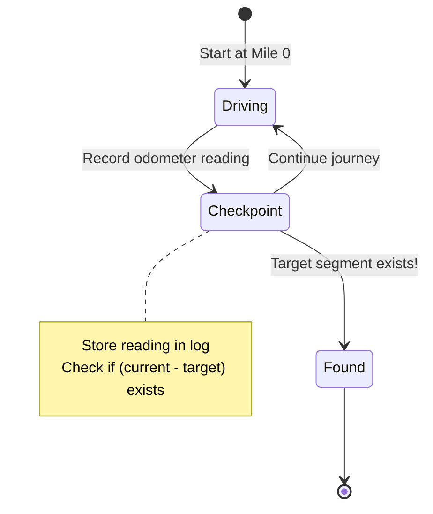
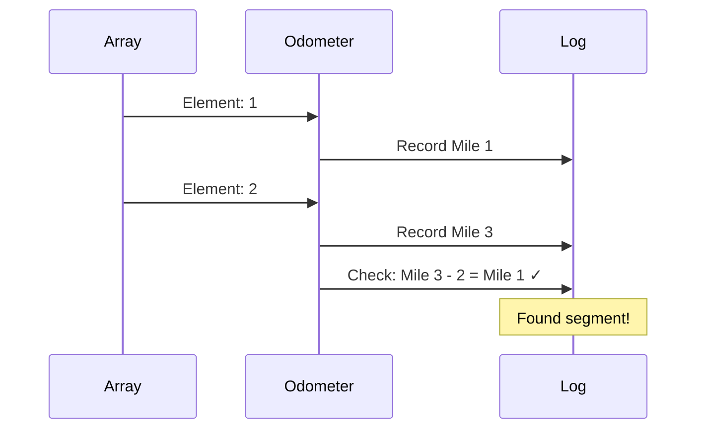

# Mental Model Building for LeetCode Problems

## Purpose

This skill creates mental model study guides that help understand algorithm concepts through **a single, powerful analogy**.

**What this skill does:**

- Builds deep understanding of the problem and solution approach
- Explains the "why" behind algorithmic choices
- Creates memorable mental models using real-world analogies
- Generates paired step files (`step1-problem.ts` + `step1-solution.ts` … `stepM-problem.ts` + `stepM-solution.ts`) and `solution.ts` that teach the concepts progressively

**What this skill does NOT do:**

- Analyze or debug existing code
- Fix bugs in implementations
- Review or critique current solutions
- Compare multiple solution approaches

## Study Guides Location

- Always create study guide directories in `./app/problems/`
- Use the format: `./app/problems/[problem-number]-[problem-name]/`

## Required Workflow

1. Choose ONE powerful analogy and commit to it
2. **Phase 1:** Write substantial analogy section explaining the mental model (NO CODE yet)
3. **Phase 2:** Build the algorithm incrementally, translating analogy concepts to code
4. Create `mental-model.md` using only that analogy throughout
5. Use mermaid charts for visualizations
6. **MUST validate all mermaid charts** using the validation script
7. Fix any validation errors before considering mental-model.md complete
8. **Create step files and solution.ts** — one `stepN-problem.ts` + `stepN-solution.ts` pair per algorithm step, plus a complete `solution.ts`; insert `:::stackblitz` directives in `mental-model.md`; add **Tracing through an Example** table, **Common Misconceptions**, and **Complete Solution** plain code block at the bottom
9. **Validate step files** — run each in order; all must exit 0; `solution.ts` must print only PASS lines
10. **Verify the problem is wired into journey.ts** — see "Step 10: Verify journey.ts" below
11. **DO NOT create README.md or any other summary documents** - only create `mental-model.md`, step files, and `solution.ts`

**Validation command:**

```bash
../../../.claude/skills/leet-mental/validate-mermaid.sh mental-model.md
```

**Step files run command:**

```bash
npx tsx step-1.ts   # Expected: TODO lines, no crashes
npx tsx solution.ts # Expected: PASS lines only
```

---

## Core Principles

1. **Choose ONE analogy and commit** - Select a single real-world metaphor and use it consistently
2. **Build the mental model FIRST** - Fully explain the analogy before introducing any code
3. **Stay in the analogy** - Never break character; keep all explanations using analogy terms
4. **Build from ground up** - Start with the simplest case, show the pattern emerging
5. **Focus on intuition, not math** - Avoid formulas and equations until after understanding
6. **Use clear visualizations** - Leverage mermaid charts and tables
7. **Explain every piece** - Never assume understanding of any component
8. **⭐ THEN BUILD CODE INCREMENTALLY** - After the mental model is solid, translate each analogy concept to code piece by piece

## Required Sections (in order)

Every mental model MUST have these seven sections in this order:

### 0. The Problem

The verbatim LeetCode problem statement followed by the provided examples. This section comes before the analogy — it anchors the reader so they know exactly what they are solving before any mental model is introduced.

Format:

- One paragraph with the exact problem description (copy it verbatim from LeetCode)
- Each example as a labeled block: **Example 1**, **Example 2**, etc., with `Input:` and `Output:` lines
- No commentary, no analysis, no analogy — just the raw problem

### 1. The [Analogy Name] Analogy (intro paragraph)

2-4 paragraphs introducing the analogy. Map each algorithm concept to a real-world counterpart. Establish the core insight. **No code.**

### 2. Understanding the Analogy

Rich, multi-paragraph prose with these named subsections:

- **The Setup** — what do we have, what are we trying to accomplish, what are the constraints? Use the analogy's vocabulary exclusively.
- **[Key mechanism name]** — explain the central data structure or technique through the analogy (e.g. "The Anchor Car", "The Three Logbooks"). Cover any critical edge case that motivates scaffolding (e.g. the dummy node, the empty container check). This may be 1-2 subsections depending on the problem.
- **Why This Approach** — why does this strategy work? What makes it efficient? What would be worse?

**This section has zero code.** It exists so the reader fully understands the solution conceptually before any implementation details appear.

### 3. How I Think Through This

**Two logical blocks. No subsections. No code.**

**Block 1 — Whiteboard walkthrough:** First-person prose, broken into one short paragraph per algorithmic phase. Start with what the problem is really asking. Name every key variable inline and say what it represents. Each distinct pass, scan, or decision gets its own paragraph — never run multiple phases together into one dense block. Call out the one rule or invariant that keeps the algorithm correct. End by stating what the final state holds. Use variable names naturally in prose but show no code blocks.

> **Spacing rule:** If the algorithm has two passes (e.g. forward then backward), write two separate paragraphs — one per pass — with a blank line between them. Never describe both passes in a single paragraph. If a step introduces a new variable or changes direction, that's a paragraph break.

**Block 2 — Concrete trace:** Open with "Take `[example]`." on its own line (blank line above it). Then embed the appropriate trace component (`:::trace-map`, `:::trace-lr`, `:::trace-ps`, or `:::trace`) to visualize the algorithm executing on that example. Choose the same component type you use in "Building the Algorithm" — the trace here is a compact preview; the one in the steps section is the full walkthrough. Always include a trace component here — never fall back to prose narration of each step.

> **Never narrate the trace as prose.** "Position 0 writes 1 then `leftTally` becomes 1; position 1 writes 1 then `leftTally` becomes 2…" is unreadable. That content belongs in the trace component's `label` fields, not in a paragraph.

### 4. Building the Algorithm

Each step = **concept** → **concrete example/trace** → **code sketch** → **StackBlitz embed**. Do NOT separate concepts from code into independent sections.

**How many steps to use:**

**Every problem requires at least 2 steps.** If the algorithm seems like one indivisible unit, look for the **data-structure-setup split**: Step 1 covers building the data structure + the gate condition that decides which elements to process; Step 2 covers the expansion or computation triggered by each gate-passing element. Calibrate step 1 tests to cases where the gate logic alone produces correct output — typically empty inputs and inputs where no element triggers the expansion (e.g. all disjoint numbers when the longest chain is 1). Step 2 tests add the cases that require the full expansion.

> **Example split (Longest Consecutive Sequence):** Step 1 = build the catalog Set + for-loop with the `if (!catalog.has(volume - 1))` gate → tests pass for `[]` → 0 and `[10, 5, 100]` → 1. Step 2 = add the inner while-loop that expands each opener into its full chain → tests now cover `[100, 4, 200, 1, 3, 2]` → 4.

The number of steps beyond the minimum is determined by how many independently verifiable pieces the algorithm has. The test: _can step N's solution pass all tests without step N+1?_ If yes — it's a real step. If no — the operations are coupled and belong in the same step.

- ✅ **Split into a step** when the addition alone produces correct output. Example: initializing a dummy node (step 1 tests pass), then adding traversal logic (step 2 tests pass with more cases).
- ❌ **Do NOT split** when two operations are coupled and neither works without the other. Example: the "check" and "insert" in Two Sum's HashMap scan — with only the check, the book is always empty and every test returns `[]` (FAIL). Only together do they produce correct output. Keep them in one step.

**Step names must reflect one unified concept.** If the name uses "and" or "then", it describes two operations — decide whether to split (if independently testable) or rename to a single concept (if coupled). "Check the Guest Book, Then Record the Guest" should become "The Guest Book Scan".

> ⛔ **IRON RULE: Code blocks in mental-model.md NEVER contain working implementation.**
>
> The typescript block above each `:::stackblitz` directive is a **thinking scaffold** — it shows the _shape_ of the logic (pseudocode, skeleton, key comment outline) to orient the learner before they open the editor. The complete, runnable implementation lives **only** inside `stepN-solution.ts` (the Solution tab). If someone could copy your code block, paste it into the problem file, and pass the tests — you've violated this rule.
>
> ✅ Correct code block: shows structure, raises the right question, leaves the implementation blank
> ❌ Wrong code block: shows working logic the learner just has to read and understand

**What belongs in each Step:**

1. **Analogy prose** — explain the concept through the analogy. What is this step doing in the real-world metaphor? What question should the learner be asking themselves before they start coding?
2. **Trace component** _(when the step has visualizable execution)_ — pick the right one for the data structure:
   - `:::trace-map` — building a HashMap or Set (hash map / frequency counting problems)
   - `:::trace-lr` — one or two pointers scanning a string or array (two-pointer, sliding window)
   - `:::trace-ps` — two-pass prefix/suffix with a result array
   - `:::trace` — read/write cursor compacting an array in-place
3. **StackBlitz embed** — where the learner actually writes the code and checks against the solution.
4. **Gotchas block** — a `<details>` element immediately after the embed. Collapsed by default so the learner encounters it only after trying. Contains 2–4 analogy-vocabulary hints about the traps and non-obvious patterns specific to this step.

**No code sketches before the embed.** A code sketch before the embed gives away structural hints that short-circuit the learner's thinking. The trace component already shows execution; prose already explains the concept. If the urge to add a code sketch arises, write a Gotchas block instead — it delivers the same orientation after the learner has genuinely tried.

**Gotchas block format:**

```html
<details>
  <summary>Hints & gotchas</summary>

  - **[Pattern name]**: [hint in analogy vocabulary or a short code snippet if
  the concept is clearer in code] - **[Common trap]**: [why learners get stuck
  here — prose, analogy, or inline `code` as needed]
</details>
```

Gotchas block rules:

- 2–4 bullets mixing analogy-vocabulary prose and, where useful, inline code or short TypeScript snippets
- Code is allowed here because the block is collapsed — the learner sees it only after trying; it cannot short-circuit their thinking
- Describe _traps_ and _non-obvious patterns_, not solution steps
- Content that would make a stuck learner say "oh, that's why"
- Place immediately after `:::stackblitz`, before the next `### Step` heading

**Mermaid charts do not belong inside algorithm steps.** A flowchart of the counting loop or scan logic embedded between prose and a StackBlitz embed breaks the step's focus and duplicates what the trace component already shows. Mermaid goes in a dedicated section after "Building the Algorithm" — see "## [Analogy] at a Glance" below.

### 5. Tracing through an Example

**A full-table trace of the complete algorithm on one concrete input.** This section appears after "Building the Algorithm" and gives the reader a scannable reference they can return to.

Format: a markdown table with one row per loop iteration (or meaningful phase). Columns must include every key variable, the action taken, and the resulting state. Use analogy-based column names where possible.

- Choose the most illustrative example — one with enough iterations to show all code paths (at least one duplicate hit and one new-title hit)
- Show the initial state as a "Start" row before the loop
- Show the final "Done" row with the return value
- Column headers must name the variable AND its analogy role, e.g. `Reading Hand (i)` not just `i`
- Every row must be complete — no blank cells

Example structure (two-pointer problems):

| Step  | Reading Hand (i) | nums[i] | Writing Hand (k) | Last Placed (nums[k-1]) | New Title? | Action     | Clean Section |
| ----- | ---------------- | ------- | ---------------- | ----------------------- | ---------- | ---------- | ------------- |
| Start | 1                | ...     | 1                | ...                     | —          | initialize | [...]         |
| ...   |                  |         |                  |                         |            |            |               |
| Done  | —                | —       | k                | —                       | —          | return k   | [...]         |

### 6. Common Misconceptions

**3–5 bullet points** covering the mistakes learners most often make with this problem or technique. Each bullet must:

1. State the misconception as a natural-sounding wrong belief (in quotes or italics)
2. Explain concisely why it's wrong, using the analogy
3. State the correct mental model

Use the analogy vocabulary throughout — don't break to raw algorithm language.

Example structure:

```
**"[Wrong belief]"** — [Why it's wrong in 1-2 sentences using the analogy]. [Correct version.]
```

Place this section immediately after "Tracing through an Example" and before "Complete Solution".

1. Introduce the concept for this step using the analogy — elaborate on the "what" and "why" with a concrete example or diagram. Cover any edge case that belongs here.
2. Show the code for this step only (prior steps are locked in the step file).
3. Insert the `:::stackblitz` directive immediately after the code block.

After the final step, the reader has a complete working solution. If one key technique deserves deeper explanation (e.g., "the insertion trick", "the four-pointer dance"), add **one optional section** with multiple subsections — never multiple peer-level technique sections. That section must: (1) name and explain the technique, (2) show how it fits the analogy, (3) give a concrete code example. No checklists, no "ready for the solution?" prompts, no visualizing-the-N-pointers standalone sections.

### The Wrong Way

❌ **Separating concepts from code:**

```
## Building from the Ground Up

Example 1: [long conceptual walkthrough, no code]
Example 2: [another conceptual walkthrough, no code]
Example 3: [another conceptual walkthrough, no code]

## Building the Algorithm

Step 1: [code for step 1]
Step 2: [code for step 2]
Step 3: [code for step 3]
```

This splits concept from code, forcing the reader to mentally reconnect them later.

### The Right Way

✅ **Weave concept + code + embed at each step:**

````markdown
## Building the Algorithm

Each step introduces one concept from the analogy, then a StackBlitz embed to try it immediately.

### Step 1: [First Concept from the Analogy]

[Explain the concept with a concrete example and diagram. Cover the edge case that
motivates any scaffolding (e.g. the dummy node). Build the "why" before showing code.]

```typescript
// Code for step 1 only
// Prior steps don't exist yet — this is the foundation
```
````

:::stackblitz{file="step1-problem.ts" step=1 total=N solution="step1-solution.ts"}

### Step 2: [Second Concept from the Analogy]

[Trace through the concrete example to show how this step works. The reader already
understands step 1's code — now extend it with step 2's logic.]

```typescript
// Step 1 code already there (implied as locked)
// Step 2 adds the new logic
```

:::stackblitz{file="step2-problem.ts" step=2 total=N solution="step2-solution.ts"}

### Step N: [Final Concept]

[Close the loop — explain why the last piece is necessary. Cover any edge cases
that apply here. After this embed, the reader has a complete working solution.]

```typescript
return result;
```

:::stackblitz{file="stepN-problem.ts" step=N total=N solution="stepN-solution.ts"}

---

[Deeper dives and alternatives follow here — they ANCHOR on the mental model above,
not replace it. E.g. "Now that you have the working solution, here's why the
insertion trick is cleverer than the classic two-pointer reversal..."]

````

### The Woven Pattern

Each step = **concept** → **concrete example/trace** → **code** → **StackBlitz embed**

By the end of the final embed, the reader has a complete working solution. The deeper dives and alternative approaches that follow should always anchor back to the mental model already established — they enrich understanding rather than replace it.

### Structure Template

```markdown
# [Problem Name] - Mental Model

## The Problem

[Verbatim LeetCode problem description — one paragraph, copy exactly as written.]

**Example 1:**
````

Input: [input values]
Output: [expected output]

```

**Example 2:**
```

Input: [input values]
Output: [expected output]

````

## The [Single Analogy Name] Analogy

[2-4 paragraphs introducing the analogy. Map each algorithm concept to a real-world
counterpart. Establish the core insight. NO CODE.]

## Understanding the Analogy

### The Setup

[What do we have? What are we trying to accomplish? What are the constraints?
Use analogy vocabulary exclusively — no variable names, no TypeScript.]

### [Key Mechanism — e.g. "The Anchor Car", "The Three Logbooks"]

[Explain the central technique or data structure through the analogy.
Cover the critical edge case that motivates any scaffolding (dummy node, etc.).]

### Why This Approach

[Why does this strategy work? What would be worse? What makes it efficient?]

## How I Think Through This

[Block 1 — One short paragraph per algorithmic phase. Name key variables inline,
call out the invariant. If the algorithm has two passes, write two paragraphs
with a blank line between. NO CODE BLOCKS.]

[If two-pass algorithm, the second paragraph goes here — blank line between them.]

[Block 2 — Open with "Take `[example]`." on its own line, then drop the trace component.
NEVER narrate the trace as prose ("position 0 writes…"). The labels field of the
trace component carries that detail.]

---

## Building the Algorithm

Each step introduces one concept from the [analogy name], then a StackBlitz embed to try it.

### Step 1: [First Concept]

[Explain this step's concept through the analogy. What is the learner setting up, and why?
Walk through how it applies to a small concrete example using analogy terms.
Raise the question the learner should answer before opening the editor.]

[Trace component if pointer/cursor movement is involved — :::trace, :::trace-lr, or :::trace-ps]

[Typescript sketch ONLY if there is a structural question prose and trace cannot answer.
If the step is "build a map" or "scan left to right," prose is sufficient — no sketch needed.]

:::stackblitz{file="step1-problem.ts" step=1 total=N solution="step1-solution.ts"}

### Step 2: [Second Concept]

[Trace through the concrete example to show what this step adds. The reader already
has step 1 internalized — now: what new decision does this step make, and when?
Use the analogy to make the condition or loop feel inevitable, not arbitrary.]

[Trace component if the step moves a pointer or cursor through data]

[Typescript sketch only if structural question remains after prose + trace]

:::stackblitz{file="step2-problem.ts" step=2 total=N solution="step2-solution.ts"}

### Step N: [Final Concept]

[Close the loop. What does this last step decide, and what happens if it's missing?
After the StackBlitz embed the learner has a complete working solution.]

:::stackblitz{file="stepN-problem.ts" step=N total=N solution="stepN-solution.ts"}

---

## [Optional: [Analogy Name] at a Glance]

**Use this section for mermaid flowcharts that show the algorithm's overall decision structure.**
Place it immediately after "Building the Algorithm" and before "Tracing through an Example."
This is where a flowchart of the counting loop, recursion shape, or state machine belongs —
NOT inside individual algorithm steps.

```mermaid
[flowchart or stateDiagram showing overall algorithm flow]
````

---

## [Optional: The [Key Technique Name]]

**Use this section only when one technique needs more explanation than the algorithm steps provide.**
This should be a SINGLE section — never multiple peer-level technique sections.

### What It Is

[Name the technique and explain it concisely. Stay in the analogy vocabulary.]

### How It Fits the Analogy

[Show explicitly how this technique maps to the analogy. Use concrete values from your running example.]

### The Code

```typescript
// Focused code example showing just this technique
// Annotate with analogy terms
```

---

## Tracing through an Example

| Step  | [Reading Hand var] | [value] | [Writing Hand var] | [Last Placed] | New Title? | Action     | [State] |
| ----- | ------------------ | ------- | ------------------ | ------------- | ---------- | ---------- | ------- |
| Start | 1                  | ...     | 1                  | ...           | —          | initialize | [...]   |
| ...   |                    |         |                    |               |            |            |         |
| Done  | —                  | —       | k                  | —             | —          | return k   | [...]   |

---

## Common Misconceptions

**"[First wrong belief]"** — [Why it's wrong using the analogy. What the correct mental model is.]

**"[Second wrong belief]"** — [Why it's wrong using the analogy. What the correct mental model is.]

**"[Third wrong belief]"** — [Why it's wrong using the analogy. What the correct mental model is.]

---

## Complete Solution

:::stackblitz{file="solution.ts" step=N total=N solution="solution.ts"}

```

### Visualization Guidelines

**Decision rule:** When visualizing *how code executes* (pointer movement, array mutation, cursor advancing), use a trace component. When visualizing *conceptual structure* (decision trees, recursion shape, algorithm topology), use mermaid. Never use mermaid to show step-by-step code execution — that's what trace components are for.

---

#### Trace Components (for step-by-step code execution)

Three components are available. Each is a fenced block: open with `:::trace`, `:::trace-lr`, or `:::trace-ps`, place a JSON array, close with `:::`.

**`:::trace-lr`** — Two-pointer / cursor scan over a sequence

Use when: one or two pointers move through a string or array (two-pointer, sliding window, cursor-based decode).

```

:::trace-lr
[
{"chars": ["a","b","c"], "L": 0, "R": 2, "action": "match", "label": "..."},
...
]
:::

```

| Field | Type | Meaning |
|-------|------|---------|
| `chars` | `string[]` | The cells to display — individual characters, or short strings when visualizing a list |
| `L` | `number` | Left pointer index |
| `R` | `number` | Right pointer index (set `L === R` when there is only one cursor) |
| `action` | `"match" \| "mismatch" \| "done" \| null` | Visual state of the highlighted cells |
| `label` | `string` | Analogy-based explanation of this step |

Cell coloring: cells left of L or right of R → verified (grey). L cell → left-pointer highlight. R cell → right-pointer highlight. `action: done` → all cells verified.

**`:::trace-ps`** — Prefix/suffix pass with accumulator

Use when: the algorithm makes two passes (forward then backward) building a result array, with a running accumulator.

```

:::trace-ps
[
{"nums": [1,2,3,4], "result": [1,0,0,0], "currentI": 0, "pass": "forward", "accumulator": 1, "accName": "prefix", "label": "..."},
...
]
:::

```

| Field | Type | Meaning |
|-------|------|---------|
| `nums` | `number[]` | Input array |
| `result` | `number[]` | Output array being built |
| `currentI` | `number` | Active index (`-1` = no highlight) |
| `pass` | `"forward" \| "backward" \| "done"` | Pass direction badge |
| `accumulator` | `number` | Current running value |
| `accName` | `"prefix" \| "suffix" \| ""` | Label shown next to accumulator |
| `label` | `string` | Step description |

**`:::trace-map`** — HashMap / Set building pass

Use when: the algorithm scans an array and builds a frequency map, complement map, or set as it goes.

```

:::trace-map
[
{"input": ["a","b","a"], "currentI": 0, "map": [], "highlight": null, "action": null, "label": "..."},
{"input": ["a","b","a"], "currentI": 0, "map": [["a",1]], "highlight": "a", "action": "insert", "label": "..."},
...
]
:::

```

| Field | Type | Meaning |
|-------|------|---------|
| `input` | `(string\|number)[]` | The array being scanned |
| `currentI` | `number` | Active index (`-2` = all done / scan complete) |
| `map` | `[key, value][]` | Current map entries in order; set `value` to `null` for Set mode |
| `highlight` | `string \| number \| null` | Key to color in the map panel |
| `action` | `"insert" \| "update" \| "found" \| "miss" \| "done" \| null` | Badge shown on this step |
| `label` | `string` | Step description |
| `vars` | `{name, value}[]` | Optional extra variables to display (e.g. a running sum) |

Actions: `insert` = new key added, `update` = existing key incremented, `found` = key lookup succeeded, `miss` = key not in map, `done` = scan complete.

**`:::trace`** — Read/write cursor over an array

Use when: a reader pointer scans forward while a writer pointer lags behind, compacting an array in-place.

```

:::trace
[
{"array": [1,1,2,3], "reader": 1, "writer": 1, "action": "skip", "label": "..."},
...
]
:::

````

| Field | Type | Meaning |
|-------|------|---------|
| `array` | `number[]` | The array being processed |
| `reader` | `number` | Read-head index |
| `writer` | `number` | Write-head index |
| `action` | `"keep" \| "skip" \| "done" \| null` | Disposition of the current element |
| `label` | `string` | Step description |

---

#### Mermaid (for conceptual/mental structure only)

**USE MERMAID FOR:**
- Decision trees (backtracking, recursion branching)
- Tree/graph topology (binary trees, DAGs)
- High-level algorithm phases or state machines

**DO NOT use mermaid** to show a pointer moving through an array or a cursor advancing through a string — use a trace component instead.

**Mermaid Best Practices:**
- Always validate with the mermaid validation script before considering complete
- Label nodes with concrete analogy values, not abstract variables
- Keep hierarchy clear with proper indentation

### Mermaid Chart Examples by Problem Type

**Binary Tree Problems:**
```mermaid
graph TD
    A["Root: 5<br/>Altitude: 0"] --> B["Left: 3<br/>Going up (+3)"]
    A --> C["Right: 8<br/>Going up (+8)"]
    B --> D["Left: 1<br/>Peak! (+1)"]
    B --> E["Right: 4<br/>Still climbing (+4)"]
````

**Backtracking/Decision Trees:**

```mermaid
graph TD
    A["Start: []<br/>open=3, close=3"] --> B["Add (<br/>[(]<br/>open=2, close=3"]
    A --> C["Can't add )<br/>close <= open"]
    B --> D["Add (<br/>[((]<br/>open=1, close=3"]
    B --> E["Add )<br/>[(]<br/>open=2, close=2"]
    style C fill:#f99
```

**State Machine/Flow:**



**Sequence/Timeline:**



### Validating Mermaid Charts

**CRITICAL: Always validate charts before completion**

After creating a mental model with mermaid charts, you MUST validate them:

```bash
# Run the validation script on your mental-model.md file
../../../.claude/skills/leet-mental/validate-mermaid.sh mental-model.md
```

The script will:

1. Extract all mermaid blocks from the markdown file
2. Validate basic syntax (diagram type, structure, common errors)
3. Report which charts pass syntax validation
4. Exit with error code if any chart has syntax errors

**Validation workflow:**

1. Create mental-model.md with mermaid charts
2. Run validation script
3. If errors found: fix the mermaid syntax and re-run
4. Only consider the file complete when all charts pass validation

**Note:** This performs basic syntax validation without rendering. Charts should still be visually verified in GitHub, Obsidian, or other markdown viewers.

### Example: Good vs Bad Explanations

**❌ BAD:**

```
We check if (current_sum - k) exists in the hashmap.
If it does, we found a subarray.
```

**✅ GOOD:**

```
Imagine your car's odometer shows 100 miles.
If you want to find when you drove exactly 30 miles,
you look in your logbook for when the odometer read 70.
The segment between 70 and 100 is exactly 30 miles!
```

### Choosing Your Single Analogy

**CRITICAL: Pick ONE analogy and commit to it completely.**

Don't mix analogies. Don't switch metaphors mid-explanation. The power comes from consistency.

#### Proven Analogies by Problem Type

**Subarray Sum Problems:**

- **Odometer journey** (running sums = cumulative distances traveled)
  - Why it works: Segments between checkpoints = subarrays
  - Natural fit for prefix sums, looking back at previous readings

**Tree Problems:**

- **Mountain climbing** (going up to children, down to parent)
  - Why it works: Height/altitude maps to depth, peaks = leaves
  - Natural fit for DFS, path concepts

**Backtracking:**

- **Maze exploration** (try paths, hit walls, backtrack)
  - Why it works: Dead ends = invalid states, retracing steps = backtracking
  - Natural fit for constraint checking, state restoration

**Graph Problems:**

- **City/road map** (cities = nodes, roads = edges)
  - Why it works: Distance, connectivity, paths all intuitive
  - Natural fit for BFS/DFS, shortest path

**Selection criteria:**

- Does every algorithm concept have a natural real-world parallel?
- Do edge cases make sense in the analogy?
- Will someone remember this analogy weeks later?
- Can you explain the entire solution without leaving the analogy?

**Reinforcement rule:** Once you pick the analogy, every example, trace, visualization label, variable name, and misconception must be expressed through that same analogy. Repetition of the analogy across different examples is what makes it stick. The reader should never encounter a second metaphor — if they do, the analogy wasn't strong enough and you should rework it rather than introduce another.

### Variable Naming in Solutions

When implementing with the analogy:

- Use analogy-based names: `odoLog`, `milesDriven`, `segmentsFound`
- Avoid generic names: `map`, `sum`, `count`
- Make the connection to mental model obvious

**Example:**

```typescript
// ✅ GOOD - Uses analogy
const odoLog = new Map();
let milesDriven = 0;
const targetReading = milesDriven - k;

// ❌ BAD - Generic
const map = new Map();
let sum = 0;
const target = sum - k;
```

### Testing Your Mental Model

Before considering a mental model complete, verify all four required sections are present and correct:

**Section 1 — The Analogy Intro**

1. Does it establish the analogy in 2-4 paragraphs with no code?
2. Are all key algorithm concepts mapped to analogy counterparts?

**Section 2 — Understanding the Analogy** 3. Does it have named subsections: The Setup, [Key Mechanism], Why This Approach? 4. Is the Setup written purely in analogy terms — no variable names, no TypeScript? 5. Does it cover the critical edge case (if any) within the analogy explanation?

**Section 3 — How I Think Through This** 8. Is Block 1 broken into one short paragraph per algorithmic phase (one pass = one paragraph)? No multi-phase walls of text. 9. Does each paragraph in Block 1 name key variables inline, call out the core rule/invariant, and explain why — all in prose with no code blocks? 10. Does Block 2 open with "Take `[...]`." and use a trace component — never prose narration of each step? 11. Could you read both blocks, close your laptop, and reconstruct the algorithm on a whiteboard?

**Section 4 — Building the Algorithm (Woven Steps)** 11. Does each step weave concept + trace component (where applicable) + StackBlitz embed together? No mermaid inside steps. Code sketch only if a structural question remains after prose + trace. 12. Is the :::stackblitz directive placed immediately after the trace component or sketch (if any) for each step? 13. By the final step, does the reader have a complete working solution? 14. **Code sketch check (CRITICAL):** For every code block above a `:::stackblitz` — could a learner copy it, paste it into the problem file, and pass the tests? If yes, it's implementation code, not a sketch. Replace the working logic with comments or pseudocode that convey the _shape_ without giving away the answer.

**Section 5 — Tracing through an Example** 14. Is there a markdown table with one row per loop iteration (or meaningful phase)? 15. Does every column name include the variable AND its analogy role (e.g. `Reading Hand (i)` not just `i`)? 16. Are all code paths represented — at least one duplicate hit and one new-title hit? 17. Is there a "Start" row (initial state) and a "Done" row (return value)?

**Section 6 — Common Misconceptions** 18. Are there 3–5 misconceptions, each stated as a natural-sounding wrong belief? 19. Is each explained using the analogy (not raw algorithm language)? 20. Does each end with the correct mental model?

**Complete Solution** 21. Does the Complete Solution use `:::stackblitz{file="solution.ts" step=M total=M solution="solution.ts"}` (same file and solution value so tabs are hidden)?

**Overall** 22. **Single analogy throughout:** No secondary metaphors, no "it's also like..." 23. **Reinforcement:** Every example deepens comfort with the ONE analogy 24. **No code analysis:** Avoid debugging or reviewing existing code

**The ultimate test:** Can someone read the analogy section, fully understand the approach without seeing any code, and then easily follow the code section because they already have the mental model?

### What to Avoid

**Never do these:**

- ❌ **Offering two solutions (brute force then optimized)** — Steps must build ONE algorithm from the start. Never implement a naive solution in step 1 and an optimized solution in step 2. Each step should add a piece to the single correct solution — the learner builds the optimal algorithm incrementally, not via replacement.
- ❌ **Pre-building scaffolding in step 1** — The step 1 problem file must contain only the function signature and `throw new Error('not implemented')`. Never pre-populate the HashMap, loop structure, variable declarations, or any other setup — those are what the learner implements.
- ❌ Analyzing or debugging existing code implementations
- ❌ Fixing bugs in current solutions
- ❌ Reviewing code quality or suggesting refactors
- ❌ **Separating concepts from code** — don't write "Building from the Ground Up" (conceptual) as a standalone section followed by a separate "Building the Algorithm" (code) section; weave them together at each step
- ❌ **Jumping into code before establishing the analogy** — the analogy intro section must come first, before any steps
- ❌ Mixing multiple analogies or switching metaphors mid-explanation
- ❌ Introducing a second analogy to "clarify" the first — if the first analogy needs help, replace it with a better one
- ❌ Starting with "The algorithm does X" instead of analogy
- ❌ Breaking out of the analogy to use technical terms in the analogy section
- ❌ Using mathematical notation before building intuition
- ❌ Comparing multiple solution approaches (focus on understanding ONE way)
- ❌ Assuming knowledge of data structures (explain why through analogy)
- ❌ Skipping the "why this exists" for each component
- ❌ Using confusing phrasing like "subtract an old running total"
- ❌ Missing the progression from simple to complex examples
- ❌ Generic variable names (use analogy-based names always)
- ❌ Dumping complete code at the end instead of building it incrementally
- ❌ **Not having a clear break between "understanding the analogy" and "building the code"**
- ❌ **Filling in the TODO in any problem file** — each `stepN-problem.ts` body must throw `new Error('not implemented')` until the learner implements it; only `stepN-solution.ts` and `solution.ts` have working code
- ❌ **Calling a void/in-place function outside the test thunk** — if the function mutates in-place and returns void, the setup (build input) and mutation call must live inside `() => { ... return result }` so that `Error('not implemented')` is caught and prints `TODO` instead of crashing the process
- ❌ **Showing working solution code in mental-model.md code blocks** — this is the single most common mistake; code blocks above `:::stackblitz` directives must be SKETCHES only (pseudocode, commented structure, shape of the logic). If a learner could copy your code block and pass the tests, you wrote implementation code instead of a sketch. The full working code lives exclusively in `stepN-solution.ts` and `solution.ts`.
- ❌ **Adding a typescript code sketch by default** — sketches are off by default. Only add one if there is a specific structural question (loop shape, branching condition, return placement) that neither the prose nor a trace component answers. "Scan left to right and return the first match" does not need a sketch — that's just a for loop. The trace already showed it.
- ❌ **Embedding mermaid charts inside algorithm steps** — a flowchart of the counting loop or scan logic between step prose and a StackBlitz embed breaks focus and duplicates what the trace shows. Mermaid belongs in a dedicated `## [Analogy] at a Glance` section placed after "Building the Algorithm." Inline in steps: prose + trace components only.
- ❌ **Using mermaid to show step-by-step code execution** — cursor movement, pointer advancement, array mutation, and loop iterations belong in a `:::trace`, `:::trace-lr`, or `:::trace-ps` component. Mermaid is for conceptual structure: decision trees, recursion topology, algorithm phases.
- ❌ **Writing "How I Think Through This" as a wall of text** — each algorithmic phase gets its own paragraph with a blank line between. Two passes = two paragraphs. Never run a forward pass and a backward pass together in one block. The concrete trace (Block 2) must use a trace component — never write out "position 0 writes X then `var` becomes Y; position 1…" as a prose sentence.
- ❌ **Using `---` horizontal rules between every section** — `---` appears in exactly two places: immediately before `## Building the Algorithm` (signaling the shift from conceptual to hands-on) and immediately before `## Common Misconceptions` (signaling the shift to reference material). Everywhere else, sections flow directly into one another with no divider.
- ❌ **Multiple peer-level technique sections** after the algorithm steps — if you need deeper explanation, use ONE section with subsections (what it is, how it fits the analogy, code), not separate `## The Reversal Technique`, `## The Four-Pointer Technique`, `## Visualizing the Four Pointers`, etc.
- ❌ **Checklists, "Ready for the Solution?" prompts, or "The Mental Model Checklist" sections** — these add no pedagogical value and dilute the analogy

**Remember:**

- First: Build the mental model through the analogy (NO CODE)
- Then: Translate that mental model to code piece by piece

---

## Step 8: Create step files and solution.ts

After completing `mental-model.md`, count the `### Step N:` subsections in the "Building the Algorithm" section. For a guide with M steps, generate **paired files** `step1-problem.ts` + `step1-solution.ts` through `stepM-problem.ts` + `stepM-solution.ts`, plus a complete `solution.ts`.

### File naming convention

| File                | Purpose                                                                            |
| ------------------- | ---------------------------------------------------------------------------------- |
| `stepN-problem.ts`  | Step N starter — function body throws `Error('not implemented')`, cumulative tests |
| `stepN-solution.ts` | Step N solution — function body fully implemented, all tests pass                  |
| `solution.ts`       | Complete solution with all steps — every test passes                               |

Each file in a pair is **fully self-contained** (no imports, no top-level async).

### stepN-problem.ts structure

1. **Header comment** — states the step goal in one sentence from the analogy
2. **Function + tests** — the function to implement (with prior steps locked inside the body), then tests immediately after
3. **Helpers sentinel + boilerplate** — `// ─── Helpers ───` divider, then data structures (`ListNode`, etc.) and utility functions at the bottom

The editor auto-folds everything below `// ─── Helpers ───`, so the learner sees only the function and tests. The helpers must still be present for the file to run.

**Step 1 must always start from a blank function body.** Never pre-build scaffolding — no HashMap initialization, no loop structure, no variable declarations. The learner builds everything:

```typescript
// ✅ CORRECT — learner builds from scratch
function twoSum(nums: number[], target: number): number[] {
  throw new Error('not implemented');
}

// ❌ WRONG — scaffolding pre-built, learner only fills in the middle
function twoSum(nums: number[], target: number): number[] {
  const guestBook = new Map<number, number>();
  for (let i = 0; i < nums.length; i++) {
    const complement = target - nums[i];
    throw new Error('not implemented');
  }
  return [];
}
```

For steps 2+, prior steps' completed code is locked inside the function body — but the new step's contribution always starts at `throw new Error('not implemented')`.

The test helper uses a **thunk form** to catch `Error('not implemented')` during the call, not just during comparison:

```typescript
function test(desc: string, fn: () => unknown, expected: unknown): void {
  try {
    const actual = fn();
    const pass = JSON.stringify(actual) === JSON.stringify(expected);
    console.log(`${pass ? 'PASS' : 'FAIL'} ${desc}`);
    if (!pass) {
      console.log(`  expected: ${JSON.stringify(expected)}`);
      console.log(`  received: ${JSON.stringify(actual)}`);
    }
  } catch (e) {
    if (e instanceof Error && e.message === 'not implemented') {
      console.log(`TODO  ${desc}`);
    } else {
      throw e;
    }
  }
}
```

### stepN-problem.ts template

```typescript
// =============================================================================
// {Problem Name} — Step N of M: {Step Title}
// =============================================================================
// Goal: {one sentence from the analogy describing what this step accomplishes}
//
// Prior steps are complete and locked inside the function body.

function solveProblem(...): ReturnType {
  // ✓ Step 1: {what step 1 does} (locked)
  // ... step 1 code inlined and working ...

  // ✓ Step N-1: {what prior step does} (locked)
  // ...

  throw new Error('not implemented');
}

// Tests
test('{desc}', () => solveProblem(input), expected);
test('{desc}', () => solveProblem(input), expected);
```

**In-place / void functions**: if the problem mutates a data structure and returns `void` (e.g. reverse a list in-place), the mutation call MUST happen inside the thunk — never outside it. Calling it outside means `throw new Error('not implemented')` propagates uncaught, crashing the process instead of printing `TODO`.

```typescript
// ❌ WRONG — crashes when function is unimplemented
const list = createList([1, 2, 3]);
reverseList(list);
test('basic reverse', () => listToArray(list), [3, 2, 1]);

// ✅ CORRECT — mutation inside thunk, throw is caught
test(
  'basic reverse',
  () => {
    const list = createList([1, 2, 3]);
    reverseList(list);
    return listToArray(list);
  },
  [3, 2, 1],
);
```

```typescript
// ─── Helpers ──────────────────────────────────────────────────────────────────
// (auto-folded in the editor — must be present for the file to run)

class ListNode {
  // or TreeNode, etc.
  val: number;
  next: ListNode | null;
  constructor(val = 0, next: ListNode | null = null) {
    this.val = val;
    this.next = next;
  }
}

function createList(values: number[]): ListNode | null {
  const dummy = new ListNode();
  let cur = dummy;
  for (const v of values) {
    cur.next = new ListNode(v);
    cur = cur.next;
  }
  return dummy.next;
}

function listToArray(head: ListNode | null): number[] {
  const r: number[] = [];
  let cur = head;
  while (cur) {
    r.push(cur.val);
    cur = cur.next;
  }
  return r;
}

function test(desc: string, fn: () => unknown, expected: unknown): void {
  try {
    const actual = fn();
    const pass = JSON.stringify(actual) === JSON.stringify(expected);
    console.log(`${pass ? 'PASS' : 'FAIL'} ${desc}`);
    if (!pass) {
      console.log(`  expected: ${JSON.stringify(expected)}`);
      console.log(`  received: ${JSON.stringify(actual)}`);
    }
  } catch (e) {
    if (e instanceof Error && e.message === 'not implemented') {
      console.log(`TODO  ${desc}`);
    } else {
      throw e;
    }
  }
}
```

### stepN-solution.ts template

Identical layout to `stepN-problem.ts` but the function body is **fully implemented** and all tests must print PASS. No TODO comments. Add inline comments referencing the analogy on non-trivial lines.

```typescript
// =============================================================================
// {Problem Name} — Step N of M: {Step Title} — SOLUTION
// =============================================================================
// Goal: {one sentence from the analogy}

function solveProblem(...): ReturnType {
  // ✓ Step 1: {analogy term} — {one-line explanation}
  // ... step 1 code ...

  // Step N: {analogy term} — {one-line explanation}
  // ... step N implementation ...
}

// Tests — all must print PASS
test('{desc}', () => solveProblem(input), expected);
test('{desc}', () => solveProblem(input), expected);

// ─── Helpers ──────────────────────────────────────────────────────────────────
// (identical to problem file)
class ListNode { ... }
function createList(...) { ... }
function listToArray(...) { ... }
function test(...) { ... }
```

### solution.ts file structure

Complete implementation with all M steps. Every test must print PASS. Add inline comments on each non-trivial line referencing the analogy.

```typescript
// =============================================================================
// {Problem Name} — Complete Solution
// =============================================================================

function solveProblem(...): ReturnType {
  // All steps implemented
}

// Tests — all must print PASS
test('{desc}', () => ..., expected);

// ─── Helpers ──────────────────────────────────────────────────────────────────
class ListNode { ... }
function createList(...) { ... }
function listToArray(...) { ... }
function test(...) { ... }
```

### Insert :::stackblitz directives in mental-model.md

**Placement is critical:** The "Building the Algorithm" section (with its `### Step N:` subsections) must appear **inline in the natural narrative flow** — immediately after the introductory analogy sections end, **not appended at the bottom** of the file.

After each `### Step N:` code block, insert this directive on its own line with a blank line before and after:

```
:::stackblitz{file="stepN-problem.ts" step=N total=M solution="stepN-solution.ts"}
```

Where M is the total number of algorithm steps. The directive must match this format exactly — the MarkdownRenderer regex requires fixed attribute order and quoted file/solution values.

**At the very bottom of mental-model.md**, after Common Misconceptions, add the complete solution as a runnable StackBlitz embed. Use `solution.ts` for both `file` and `solution` — the component detects this and hides the Try It / Solution tabs, showing a single runnable editor:

```markdown
## Complete Solution

:::stackblitz{file="solution.ts" step=M total=M solution="solution.ts"}
```

---

## Step 9: Validate step files

Run each step file in order from the problem directory. All must exit 0. Unimplemented TODOs will print `TODO` — that is expected. `solution.ts` must print only `PASS` lines.

```bash
cd app/problems/{id}-{slug}/

npx tsx step1-problem.ts    # Expected: TODO lines, no crashes
npx tsx step1-solution.ts   # Expected: PASS lines only (for step 1 tests)
npx tsx step2-problem.ts    # Expected: TODO lines, no crashes
npx tsx step2-solution.ts   # Expected: PASS lines only (for step 1+2 tests)
# repeat for each step pair
npx tsx solution.ts         # Expected: PASS lines only
```

If any file exits non-zero (TypeScript/syntax error, or test failure in solution.ts), fix it before proceeding.

**Step 10 (journey.ts verification) is unchanged.**

---

## Step 10: Verify journey.ts

After the step files validate, verify the problem is wired into the learning path:

1. Read `./lib/journey.ts`
2. Search every section's `firstPass` and `reinforce` arrays for `{ id: '{problemId}', ...}`
   - Problem ID = the zero-padded number (e.g., `'026'`, `'076'`)
3. **If found**: confirm with "✓ Problem {id} is in the learning path under [{section.label}]" — no edit needed, `content.ts` auto-discovers the mental model from disk
4. **If NOT found**: the problem isn't in the journey yet
   - Re-read `./00-complete-dsa-path.md` and locate which step/section the problem belongs to
   - Match that step's name to the corresponding `section.label` in `journey.ts`
   - Determine tier: if listed under **Practice** in the DSA path → add to `firstPass`; if under **Revisit** → add to `reinforce`
   - Use the Edit tool to append the entry to the correct array:
     - `firstPass`: `{ id: '{id}', isFirstPass: true },`
     - `reinforce`: `{ id: '{id}', isFirstPass: false },`
   - Confirm the edit with the section it was added to

---

### Reference Examples

**Excellent mental models (read these to match the tone):**

- `./app/problems/022-generate-parentheses/mental-model.md`
  - Uses mountain climbing analogy
  - Builds from n=1 to n=3
  - Explains constraints naturally

- `./app/problems/560-subarray-sum-equals-k/mental-model.md`
  - Uses odometer/checkpoint analogy
  - Shows why hashmap stores counts
  - Traces duplicate readings clearly
