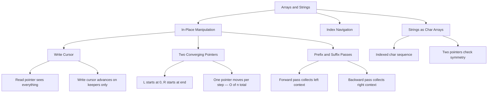
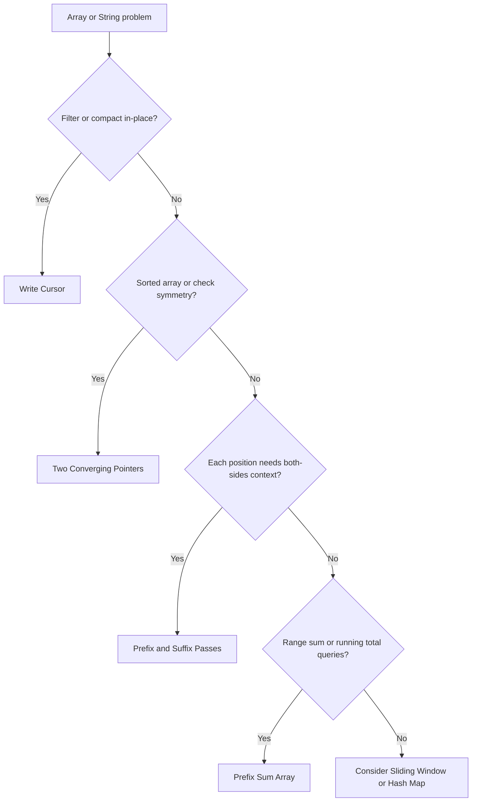

## 1. Overview

Arrays and strings are the bedrock of every coding interview. Nearly every problem — even trees, graphs, and dynamic programming — eventually reduces to operating on a sequence of values by index.

What makes array problems deceptively hard is that the most obvious approach (nested loops, building a new array) is rarely what's expected. The goal is almost always to do it _in-place_ in a single pass with O(1) extra space.

This guide covers the three index-based tools that unlock all of that: **the write cursor**, **two converging pointers**, and **prefix/suffix passes**. By the end, you'll recognize which tool a problem is asking for before you write a single line of code.

## 2. Core Concept & Mental Model

### The Assembly Line Analogy

Picture a factory assembly line. A **conveyor belt** carries items from left to right — that's your array. There are two key roles:

- A **reader** (read pointer) moves steadily from left to right, inspecting every item without exception.
- A **writer** (write cursor) sits near the front and only advances when it places a valid item.

When you need to compact or filter, the reader looks at everything, but the writer only places keepers. The gap between them represents eliminated slots.

For problems that check symmetry or search a sorted sequence, you deploy **two inspectors**: one starts at the left end, one at the right, and they walk toward each other. Each step eliminates a position from further consideration — which is what makes this O(n) instead of O(n²).

For problems where each position needs context from both sides — "what's the product of everything _except_ this element?" — you send a **left messenger** walking forward collecting prefix information, then a **right messenger** walking backward collecting suffix information. Each position gets its answer from what both messengers gathered on their respective sides.

### Understanding the Analogy

#### The Setup

The conveyor belt stretches from index 0 to index n-1. Each slot holds one item — a number or a character. You cannot add more slots or create a second belt (no extra space). Your only tools are: where you're reading from, where you're writing to, and what you've accumulated so far.

#### The Three Roles on the Line

The **reader and writer** (write cursor) work as a pair on the same belt moving forward. The reader looks at every item. The writer only places keepers. The gap between them grows as more items are eliminated — that gap is the "graveyard" of discarded slots, which you can safely overwrite.

The **two converging inspectors** start at opposite ends and walk toward each other. They exploit the structure of the belt — sorted order, or the symmetry property of palindromes — to eliminate one slot per step. No item they've already judged needs to be revisited.

The **two messengers** make separate trips. The first walks left-to-right, recording what it accumulates before each slot. The second walks right-to-left, recording what it accumulates after each slot. Each slot collects both messengers' notes and combines them — this is how you answer "what about everything _except_ me?" without rescanning.

#### Why These Approaches

All three exploit the fact that arrays are indexed. You never need to look at an element twice if you move your pointers correctly. The write cursor's output is always a _prefix_ of the input — which means it fits in-place. Converging pointers eliminate half the problem each time they both move. Two-pass prefix/suffix flips an O(n²) inside-out look into two forward scans.

#### A Simple Example

The line is `[3, 2, 2, 1, 2, 4]` and you want to remove all `2`s. The reader walks forward. Each time it finds a non-2, the writer places it and advances one slot. When the reader reaches the end, the writer has only advanced three times — slots 0, 1, 2 now hold `[3, 1, 4]`. The rest of the belt doesn't matter.

Now you understand the tools. Let's build them step by step.

## 3. Building Blocks — Progressive Learning

### Level 1: The Write Cursor

**Why this level matters**

The most common array constraint is "do it in-place with O(1) extra space." That means you cannot build a new filtered array — you must rewrite the original. The write cursor is the pattern that makes this possible. Without it, you instinctively reach for a second array or a nested loop. With it, nearly any filter-and-compact problem becomes a single forward pass.

**How to think about it**

You maintain two positions in the same array: `reader` (scanning every element) and `writer` (tracking where the next valid element should land). The reader always advances. The writer only advances when it places something.

Think of `writer` as pointing to the next blank slot in your output. When the reader finds a keeper, it writes it into slot `writer` and bumps `writer` forward by one. Non-keepers are skipped — the reader moves on but the writer stays put, ready to overwrite that slot the next time a keeper arrives.

When the reader finishes, the first `writer` positions of the array hold exactly the valid elements. Everything after index `writer` is irrelevant — the problem only cares about the first `writer` positions.

**Walking through it**

Remove all `2`s from `[3, 2, 2, 1, 2, 4]`. Expected: first 3 elements are `[3, 1, 4]`, return length `3`.

:::trace
[
{"array":[3,2,2,1,2,4],"reader":0,"writer":0,"action":null,"label":"Start — reader and writer both at index 0, ready to begin."},
{"array":[3,2,2,1,2,4],"reader":1,"writer":1,"action":"keep","label":"nums[0]=3 is a keeper → written to writer=0, writer advances to 1."},
{"array":[3,2,2,1,2,4],"reader":2,"writer":1,"action":"skip","label":"nums[1]=2 matches val — skipped, reader advances, writer stays at 1."},
{"array":[3,2,2,1,2,4],"reader":3,"writer":1,"action":"skip","label":"nums[2]=2 matches val — skipped, reader advances, writer stays at 1."},
{"array":[3,1,2,1,2,4],"reader":4,"writer":2,"action":"keep","label":"nums[3]=1 is a keeper → written to writer=1, writer advances to 2."},
{"array":[3,1,2,1,2,4],"reader":5,"writer":2,"action":"skip","label":"nums[4]=2 matches val — skipped, reader advances, writer stays at 2."},
{"array":[3,1,4,1,2,4],"reader":6,"writer":3,"action":"keep","label":"nums[5]=4 is a keeper → written to writer=2, writer advances to 3."},
{"array":[3,1,4,1,2,4],"reader":6,"writer":3,"action":"done","label":"Done — return writer=3. First 3 elements [3, 1, 4] are the result ✓"}
]
:::

**The one thing to get right**

`writer` is simultaneously "the index to write to" and "the count of valid elements placed so far." If you increment `writer` before writing, you skip slot 0 and your count is off by one. If you write without incrementing, you overwrite the same slot forever. Always: write first, then increment.

:::stackblitz{step=1 total=3 exercises="step1-exercise1-problem.ts,step1-exercise2-problem.ts,step1-exercise3-problem.ts" solutions="step1-exercise1-solution.ts,step1-exercise2-solution.ts,step1-exercise3-solution.ts"}

> **Mental anchor**: The write cursor says "I only advance when I place something real." The read pointer says "I look at everything." The gap between them is the graveyard.

**→ Bridge to Level 2**

The write cursor moves in one direction with one active pointer. But many problems need to reason about both ends of the array simultaneously — that's when two converging pointers replace the single read pointer.

---

### Level 2: Two Converging Pointers

**Why this level matters**

Problems involving symmetry ("is this a palindrome?") or a sorted structure ("find two numbers that sum to target") appear impossible to solve in less than O(n²) until you notice that starting from both ends and moving inward eliminates one element per step. That insight drops the work to O(n) — without any extra memory.

**How to think about it**

Place `L` at index 0 and `R` at index `n-1`. At each step, look at the pair `(arr[L], arr[R])`. Based on what you find, advance one (or both) pointers inward. The critical question is: which pointer moves, and when?

- For a **palindrome check**: if `s[L] !== s[R]` you already know it's not a palindrome and can stop. If they match, both pointers move inward. Either way, you make progress.
- For a **sorted two-sum**: if the sum of the pair is too small, moving `L` right increases the sum (because the array is sorted and larger values are to the right). If the sum is too large, move `R` left. If it matches, you're done.

Each move **eliminates an entire position** from consideration. After at most `n` total moves, the two pointers meet — the loop ends.

**Walking through it**

Check if `"racecar"` is a palindrome.

:::trace-lr
[
{"chars":["r","a","c","e","c","a","r"],"L":0,"R":6,"action":null,"label":"Start — L at index 0, R at index 6, ready to compare the outer pair."},
{"chars":["r","a","c","e","c","a","r"],"L":1,"R":5,"action":"match","label":"s[0]='r' === s[6]='r' — match, both pointers move inward."},
{"chars":["r","a","c","e","c","a","r"],"L":2,"R":4,"action":"match","label":"s[1]='a' === s[5]='a' — match, both pointers move inward."},
{"chars":["r","a","c","e","c","a","r"],"L":3,"R":3,"action":"match","label":"s[2]='c' === s[4]='c' — match, both pointers move inward."},
{"chars":["r","a","c","e","c","a","r"],"L":3,"R":3,"action":"done","label":"L >= R — loop ends. Every pair matched. Palindrome ✓"}
]
:::

Check if `"hello"` is a palindrome.

:::trace-lr
[
{"chars":["h","e","l","l","o"],"L":0,"R":4,"action":null,"label":"Start — L at index 0, R at index 4, ready to compare the outer pair."},
{"chars":["h","e","l","l","o"],"L":0,"R":4,"action":"mismatch","label":"s[0]='h' !== s[4]='o' — mismatch detected, return false immediately. Not a palindrome ✗"}
]
:::

**The one thing to get right**

The loop condition is `L < R`, not `L <= R`. When `L === R`, you are looking at the middle character of an odd-length string. It always matches itself — there is nothing to check. Checking it with `L <= R` is harmless but if your logic tries to advance past a single-character middle it can skip elements.

:::stackblitz{step=2 total=3 exercises="step2-exercise1-problem.ts,step2-exercise2-problem.ts,step2-exercise3-problem.ts" solutions="step2-exercise1-solution.ts,step2-exercise2-solution.ts,step2-exercise3-solution.ts"}

> **Mental anchor**: Two pointers converge by eliminating one position per step. They always meet in O(n) — no matter how the array is structured.

**→ Bridge to Level 3**

Both the write cursor and two pointers work with information available _at the current position_. But some problems need context about everything to the left and everything to the right of each position simultaneously — and that context can't be gathered in a single pass. Prefix and suffix passes solve this.

---

### Level 3: Prefix & Suffix Passes

**Why this level matters**

Some problems ask: "at each position, combine everything before it with everything after it." The naive solution is O(n²) — scan left and right for each element. Prefix and suffix passes reduce this to O(n): compute the left side in one forward pass, the right side in one backward pass. Each position gets its answer by combining the two.

**How to think about it**

Send two messengers across the array:

1. **Left messenger** walks left-to-right. Before reaching position `i`, it has accumulated information from all elements to the left. It records that information and moves on.
2. **Right messenger** walks right-to-left. Before reaching position `i`, it has accumulated information from all elements to the right. It multiplies that in.

Each position ends up with the combined result from both messengers — without ever re-scanning.

The canonical example is "product of array except self." You can't divide the total product by `nums[i]` because it might be zero. Instead:

- Forward pass: `result[i]` = product of all elements _before_ position `i`. Start with `prefix = 1`.
- Backward pass: multiply `result[i]` by the product of all elements _after_ position `i`. Maintain a running `suffix` variable as you scan right-to-left.

No extra array needed — the output array accumulates both passes in-place.

**Walking through it**

`nums = [1, 2, 3, 4]`. Expected output: `[24, 12, 8, 6]`.

:::trace-ps
[
{"nums":[1,2,3,4],"result":[1,1,1,1],"currentI":-1,"pass":"forward","accumulator":1,"accName":"prefix","label":"Forward pass begins — result initialized to all 1s, prefix=1."},
{"nums":[1,2,3,4],"result":[1,1,1,1],"currentI":0,"pass":"forward","accumulator":1,"accName":"prefix","label":"i=0: result[0]=prefix=1, then prefix becomes 1×1=1."},
{"nums":[1,2,3,4],"result":[1,1,1,1],"currentI":1,"pass":"forward","accumulator":2,"accName":"prefix","label":"i=1: result[1]=prefix=1, then prefix becomes 1×2=2."},
{"nums":[1,2,3,4],"result":[1,1,2,1],"currentI":2,"pass":"forward","accumulator":6,"accName":"prefix","label":"i=2: result[2]=prefix=2, then prefix becomes 2×3=6."},
{"nums":[1,2,3,4],"result":[1,1,2,6],"currentI":3,"pass":"forward","accumulator":24,"accName":"prefix","label":"i=3: result[3]=prefix=6, then prefix becomes 6×4=24. Forward pass complete."},
{"nums":[1,2,3,4],"result":[1,1,2,6],"currentI":-1,"pass":"backward","accumulator":1,"accName":"suffix","label":"Backward pass begins — suffix=1, scanning right-to-left."},
{"nums":[1,2,3,4],"result":[1,1,2,6],"currentI":3,"pass":"backward","accumulator":4,"accName":"suffix","label":"i=3: result[3]×=suffix=1 → 6×1=6, suffix becomes 1×4=4."},
{"nums":[1,2,3,4],"result":[1,1,8,6],"currentI":2,"pass":"backward","accumulator":12,"accName":"suffix","label":"i=2: result[2]×=suffix=4 → 2×4=8, suffix becomes 4×3=12."},
{"nums":[1,2,3,4],"result":[1,12,8,6],"currentI":1,"pass":"backward","accumulator":24,"accName":"suffix","label":"i=1: result[1]×=suffix=12 → 1×12=12, suffix becomes 12×2=24."},
{"nums":[1,2,3,4],"result":[24,12,8,6],"currentI":0,"pass":"backward","accumulator":24,"accName":"suffix","label":"i=0: result[0]×=suffix=24 → 1×24=24. Backward pass complete."},
{"nums":[1,2,3,4],"result":[24,12,8,6],"currentI":-1,"pass":"done","accumulator":0,"accName":"","label":"Done — result = [24, 12, 8, 6] ✓"}
]
:::

**The one thing to get right**

`prefix` at position `i` covers elements _strictly before_ `i`, not including `i` itself. So `prefix` starts at `1` (the multiplicative identity), and you update it _after_ recording `result[i]`. Getting this order reversed includes `nums[i]` in its own product — corrupting every answer.

:::stackblitz{step=3 total=3 exercises="step3-exercise1-problem.ts,step3-exercise2-problem.ts,step3-exercise3-problem.ts" solutions="step3-exercise1-solution.ts,step3-exercise2-solution.ts,step3-exercise3-solution.ts"}

> **Mental anchor**: Prefix tells each position what came before. Suffix tells it what comes after. Together they answer in two O(n) passes what a nested loop would answer in O(n²).

---

### How I Think Through This

The first question I ask when I see an array or string problem is: _am I being asked to modify the array in-place, or am I computing something about it?_ That one question usually tells me which of the three tools to reach for.

#### Write Cursor

When the problem says "in-place" or "O(1) extra space" and asks me to remove or filter elements, I know I need the write cursor. I place `writer = 0` at the front, then let `reader` scan every element. Every time `reader` finds a keeper, I write it to `nums[writer]` and bump `writer` forward. Non-keepers — I just move `reader` on and leave `writer` where it is.

The thing I have to remind myself: write _first_, then increment. If I do `writer++; nums[writer] = nums[reader]` I skip slot 0 and the count is wrong. The other thing I keep in mind is that `writer` serves double duty — it's both where I write next _and_ the count of valid elements placed so far. When the loop ends, I return `writer`, not `writer - 1`.

#### Two Converging Pointers

When the array is sorted, or the problem involves symmetry (palindrome, reverse, two-sum on a sorted array), I reach for two pointers starting at opposite ends: `L = 0`, `R = n - 1`.

At each step I ask: what does comparing `arr[L]` and `arr[R]` tell me, and which pointer should move? For a palindrome check, a mismatch means I'm done — I return false immediately. A match means both move inward. For a sorted two-sum, if the pair sums too low I move `L` right (larger values are to the right), if it sums too high I move `R` left. Either way, each step eliminates one position from further consideration, so the whole thing runs in O(n).

The loop condition I always use is `L < R`, not `L <= R`. When `L === R` I'm sitting on the middle character of an odd-length string — it trivially matches itself and there's nothing to check.

#### Prefix & Suffix Passes

When each position needs to combine information from everything to its left _and_ everything to its right, I know a single pass won't cut it. The signal phrase I look for is "except self" or "without using division."

I run two passes over the output array. Forward pass: I track a running `prefix` (starts at `1`) and before I touch position `i`, I write `result[i] = prefix`, then update `prefix *= nums[i]`. After the forward pass, `result[i]` holds the product of everything strictly to `i`'s left.

Backward pass: I track a running `suffix` (starts at `1`) and walk right-to-left. At each position I multiply `result[i] *= suffix`, then update `suffix *= nums[i]`. Now `result[i]` holds the product of everything to the left _and_ everything to the right — without ever including `nums[i]` itself.

The order-of-operations matters: I always read `result[i]` (or set it) before updating the running variable, because the running variable represents what's accumulated _before_ the current position, not including it.

## 4. Key Patterns

### Pattern: In-Place Compaction with Write Cursor

**When to use**: the problem says "in-place," "O(1) extra space," "remove elements," or "compress array." You're asked to modify the array and return the new length (not a new array).

**How to think about it**: the output is a _prefix_ of the input array. You're deciding which elements belong in that prefix. The write cursor marks the boundary between "placed" and "not yet placed."

**Code**

```typescript
function removeDuplicates(nums: number[]): number {
  let writer = 1;
  for (let reader = 1; reader < nums.length; reader++) {
    if (nums[reader] !== nums[reader - 1]) {
      nums[writer] = nums[reader];
      writer++;
    }
  }
  return nums.length === 0 ? 0 : writer;
}
```

**Complexity**: Time O(n), Space O(1)

---

### Pattern: Prefix Sum for Range Queries

**When to use**: the problem involves summing or querying subarrays repeatedly, or asks for counts/sums over ranges. The key signal is "sum of elements between index i and j."

**How to think about it**: compute `prefix[i]` = sum of `nums[0..i-1]` once up front. Then any range sum `[L, R]` = `prefix[R+1] - prefix[L]` in O(1). The upfront O(n) cost pays off when you have many queries.

**Code**

```typescript
function buildPrefix(nums: number[]): number[] {
  const prefix = new Array(nums.length + 1).fill(0);
  for (let i = 0; i < nums.length; i++) {
    prefix[i + 1] = prefix[i] + nums[i];
  }
  return prefix;
}

function rangeSum(prefix: number[], L: number, R: number): number {
  return prefix[R + 1] - prefix[L];
}
```

**Complexity**: Build O(n), Query O(1), Space O(n)

## 5. Decision Framework

### Concept Map



### Key Operations

| Operation                | Time | Space      | Notes                                    |
| ------------------------ | ---- | ---------- | ---------------------------------------- |
| Access by index          | O(1) | —          | The core advantage of arrays             |
| Write cursor compact     | O(n) | O(1)       | One read pass, one write head            |
| Two-pointer scan         | O(n) | O(1)       | Each pointer moves at most n steps total |
| Build prefix array       | O(n) | O(n)       | Separate array stores cumulative values  |
| Prefix + suffix in-place | O(n) | O(1) extra | Two passes, reuse output array           |

### When to use which



**Recognition signals**

| Problem keywords                                            | Technique               |
| ----------------------------------------------------------- | ----------------------- |
| "in-place", "O(1) space", "remove/filter elements"          | Write cursor            |
| "palindrome", "two sum in sorted array", "reverse"          | Two converging pointers |
| "product/sum except self", "context from both sides"        | Prefix + suffix passes  |
| "subarray sum", "range query", "count subarrays with sum k" | Prefix sum + hash map   |

**When NOT to use two pointers from both ends**: when the array is unsorted and you need to find a pair sum. Two pointers only work because a sorted array guarantees that moving `L` right increases the sum and moving `R` left decreases it. Without that guarantee, use a hash set instead.

## 6. Common Gotchas & Edge Cases

**"I'll write first, then increment `writer`" — except you incremented first.**
It's easy to write `writer++; nums[writer] = nums[reader]` instead of `nums[writer] = nums[reader]; writer++`. The first version skips slot 0 and produces an off-by-one count. Always write to `writer` _before_ advancing it.

**Loop condition `L <= R` for two pointers.**
When `L === R`, you're examining the middle of an odd-length array. The element always matches itself. If your logic is `if s[L] !== s[R] return false`, this is harmless. But if you decrement `R` and increment `L` past each other, you'll miss or double-count. Use `L < R` and stop cleanly.

**Prefix[i] includes `nums[i]` — off by one.**
If `prefix[i]` = sum of `nums[0..i]` (including `i`), then `prefix[R] - prefix[L]` gives the sum of `nums[L+1..R]`, not `nums[L..R]`. The standard convention is `prefix[i]` = sum of `nums[0..i-1]` so that `prefix[R+1] - prefix[L]` = sum of `nums[L..R]`. Decide your convention up front and be consistent.

**Forgetting to handle the empty array.**
`removeDuplicates([])` — if `w` starts at 1 and the array is empty, you return 1 instead of 0. Always check edge cases: empty input, single element, all duplicates, all different.

**Modifying the array while reading it with a separate index.**
In the write cursor pattern this is intentional — but if `w === r` you're overwriting the element you just read. This is fine because `nums[w] = nums[r]` when `w === r` is a no-op (you're writing the value to itself).

**Edge cases to always check**:

- Empty array `[]`
- Single-element array `[1]`
- All elements identical `[2, 2, 2, 2]`
- Already sorted / already valid
- Negative numbers in prefix sums (the pattern still works — don't assume positive)

**Debugging tips**: print `(reader, writer, nums.slice(0, writer))` at each iteration of a write cursor. For two pointers, print `(L, R, s[L], s[R])`. For prefix passes, print the `result` array after the forward pass and again after the backward pass.
