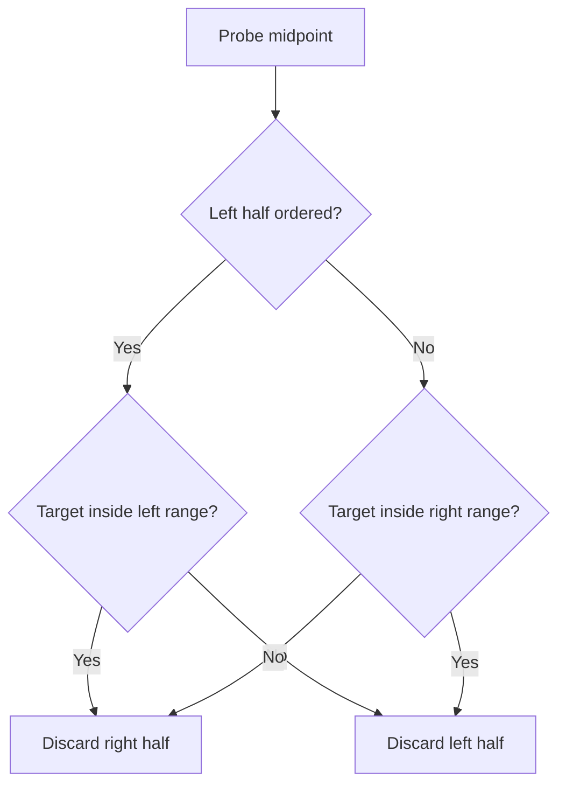
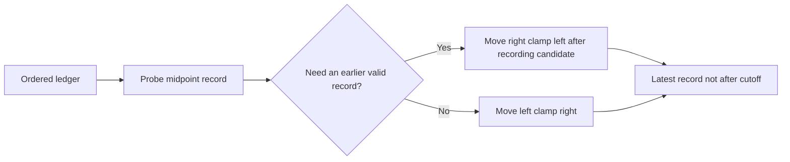
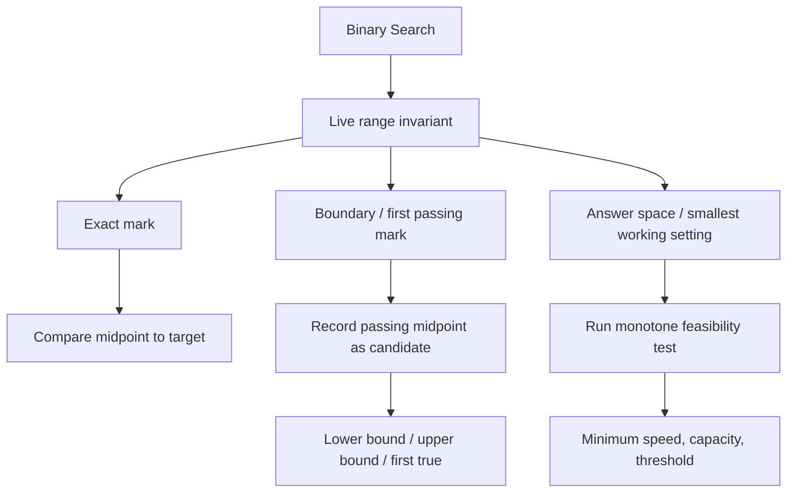
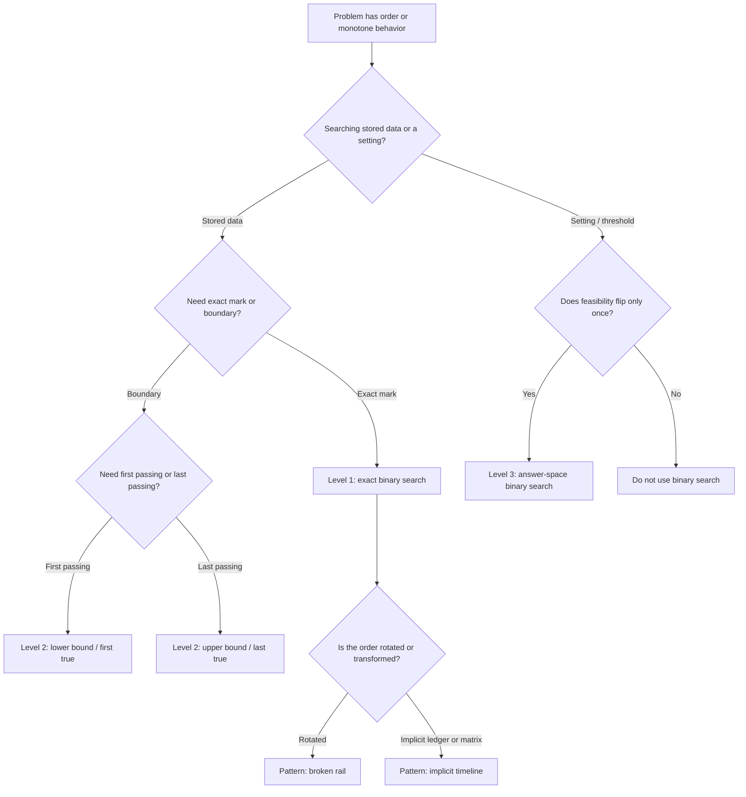

## 1. Overview

Binary Search is the technique for solving ordered problems by removing half of the remaining possibilities at every step. Instead of scanning item by item, you keep a valid range of candidates and repeatedly test the midpoint until only the answer can remain.

From Arrays & Strings and Two Pointers, you already know how valuable index movement can be. Binary Search sharpens that idea: the range itself becomes the state, and every midpoint test must prove that one entire half can never contain the answer.

The three building-block levels in this guide cover exact-hit lookup on a sorted rail, boundary search for the first or last valid position, and answer-space search where each position is not an item to find but a possible setting to test.

## 2. Core Concept & Mental Model

### The Surveyor's Calibration Rail

Picture a surveyor standing over a long numbered rail. Somewhere on that rail is the mark she needs. She places a **left clamp** and a **right clamp** around every mark that could still be correct. Then she drops a **probe** at the midpoint. The reading from that probe tells her which half of the rail can be thrown away.

On some jobs, the surveyor wants one exact mark. On others, she wants the **first passing mark** where a rule starts being true. On harder jobs, each mark is not a stored value at all but a possible machine setting, and the probe runs a pass/fail test to decide whether that setting is strong enough.

### Understanding the Analogy

#### The Setup

The calibration rail is ordered from smallest to largest. That order is the whole reason Binary Search works. When the probe lands in the middle, the surveyor does not just learn something about one mark. She learns something about every mark to the left or every mark to the right.

The left clamp and right clamp are the only territory she still trusts. Everything outside them has already been disproved. The invariant is simple: if an answer exists, it must still live inside the clamped range.

#### The Midpoint Probe

The midpoint probe is the surveyor's test drill. If the midpoint value is too small for the target, then every mark to the left is also too small, so the left clamp can jump past the probe. If the midpoint value is too large, then every mark to the right is also too large, so the right clamp can jump left of the probe.

That is the real mental leap: the probe does not merely inspect a value. It certifies that a whole half is impossible.

#### Certified Edges

Boundary search adds one more idea. Sometimes the midpoint is acceptable, but the surveyor is not done, because she wants the first acceptable mark, not just any acceptable mark. In that case she records the midpoint as a **certified candidate** and keeps squeezing left to see whether an earlier acceptable mark exists.

Answer-space search uses the same squeeze, but the rail now represents possible settings, capacities, speeds, or thresholds. The probe runs a monotone pass/fail test. Once a setting passes, every larger setting also passes. Once a setting fails, every smaller setting also fails.

#### Why These Approaches

Linear search spends one check per candidate. Binary Search spends one check per halving. That changes the growth rate from O(n) to O(log n), which is why ordered problems that would be expensive by scanning become cheap once you can prove that each probe eliminates half the rail.

### How I Think Through This

When I see a problem with sorted data, an ordered answer space, or a pass/fail rule that flips only once, I stop asking "where should I search next?" and start asking "what range of answers is still alive?" Then I define the invariant for that alive range. If I want an exact value, the range holds all positions where the value could still be. If I want the first passing position, the range holds every place the first pass could still begin. If I want the smallest working setting, the range holds every setting that might still be the minimum acceptable one. The midpoint only matters because it lets me prove which half no longer belongs in that range.

Take `[3, 7, 11, 14, 18, 21, 25]`, looking for `18`.

:::trace-bs
[
  {"values":[3,7,11,14,18,21,25],"left":0,"mid":3,"right":6,"action":"check","label":"Clamp the full rail. Probe index 3, value 14. Too small, so the answer cannot be at index 0 through 3."},
  {"values":[3,7,11,14,18,21,25],"left":4,"mid":5,"right":6,"action":"discard-left","label":"Move the left clamp to index 4. Probe index 5, value 21. Too large, so index 5 and 6 are out."},
  {"values":[3,7,11,14,18,21,25],"left":4,"mid":4,"right":4,"action":"check","label":"Only one live mark remains. Probe index 4, value 18."},
  {"values":[3,7,11,14,18,21,25],"left":4,"mid":4,"right":4,"action":"found","label":"Exact hit. The surveyor has found the mark at index 4."}
]
:::

---

## 3. Building Blocks — Progressive Learning

### Level 1: Probe the Exact Mark

**Why this level matters**
The foundation of Binary Search is learning how to keep a live range for one exact answer in sorted data. This is the version where the midpoint either is the answer, proves everything left is too small, or proves everything right is too large. Until this feels automatic, boundary search and answer-space search stay fuzzy.

**How to think about it**
Imagine the surveyor only cares about one precise mark. The left clamp starts at the first index, the right clamp at the last. Each probe asks one question: is the midpoint too small, too large, or exactly right?

The midpoint result does not tell you where to move next by instinct. It tells you which half has become impossible. If the midpoint is too small, the answer cannot live at or left of that midpoint, so the next live range begins at `mid + 1`. If the midpoint is too large, the answer cannot live at or right of that midpoint, so the next live range ends at `mid - 1`.

**The one thing to get right**
Every update must strictly remove the midpoint you just checked. If you set `left = mid` or `right = mid`, the live range may stop shrinking and the loop can repeat forever on the same midpoint.

**Visualization**
Watch the surveyor keep only the half that can still contain `23`.

Take `[4, 8, 12, 16, 23, 31, 40, 52]`, looking for `23`.

:::trace-bs
[
  {"values":[4,8,12,16,23,31,40,52],"left":0,"mid":3,"right":7,"action":"check","label":"Probe index 3, value 16. Too small, so the live rail becomes index 4 through 7."},
  {"values":[4,8,12,16,23,31,40,52],"left":4,"mid":5,"right":7,"action":"discard-left","label":"Probe index 5, value 31. Too large, so the live rail becomes index 4 through 4."},
  {"values":[4,8,12,16,23,31,40,52],"left":4,"mid":4,"right":4,"action":"check","label":"Probe index 4, value 23. Only one possible mark remains."},
  {"values":[4,8,12,16,23,31,40,52],"left":4,"mid":4,"right":4,"action":"found","label":"Exact hit. The surveyor stops at index 4."}
]
:::

:::stackblitz{step=1 total=3 exercises="step1-exercise1-problem.ts,step1-exercise2-problem.ts,step1-exercise3-problem.ts" solutions="step1-exercise1-solution.ts,step1-exercise2-solution.ts,step1-exercise3-solution.ts"}

> The midpoint is useful only if one whole half becomes impossible.

**→ Bridge to Level 2**
Exact search stops when it sees the target. But many problems need the first or last place where a condition becomes true, so seeing a valid midpoint is not enough. You need to keep the midpoint as a candidate and continue squeezing one side.

### Level 2: Squeeze to the First Passing Mark

**Why this level matters**
Boundary search is the version of Binary Search that interview problems lean on most heavily. Instead of asking for one exact mark, you ask for the first mark that is big enough, the last mark that is small enough, or the first position where a monotone rule becomes true. That shift unlocks insert positions, frequency ranges, lower bounds, upper bounds, and first-true search.

**How to think about it**
Now the surveyor is looking for an edge, not a single known mark. When the midpoint passes the rule, she cannot stop. She records it as a certified candidate and keeps squeezing toward the earlier edge to see if an even earlier passing mark exists.

The live range still shrinks the same way, but the meaning changes. A failing midpoint proves one side is too early. A passing midpoint proves the answer is at the midpoint or earlier, so you store that midpoint and move the right clamp left.

**The one thing to get right**
Do not throw away a passing midpoint when you are searching for the first passing mark. Record it before shrinking left, or you will lose the best candidate you have seen so far.

**Visualization**
Watch the surveyor search for the first mark that is at least `30`.

Take `[10, 14, 19, 30, 30, 42, 50]`, looking for the first mark `>= 30`.

:::trace-bs
[
  {"values":[10,14,19,30,30,42,50],"left":0,"mid":3,"right":6,"action":"check","label":"Probe index 3, value 30. It passes. Record index 3 as a candidate and squeeze left."},
  {"values":[10,14,19,30,30,42,50],"left":0,"mid":3,"right":2,"action":"candidate","label":"Candidate recorded at index 3. The live rail is now index 0 through 2 to see whether an earlier passing mark exists."},
  {"values":[10,14,19,30,30,42,50],"left":0,"mid":1,"right":2,"action":"check","label":"Probe index 1, value 14. Too small, so the first passing mark must be to the right."},
  {"values":[10,14,19,30,30,42,50],"left":2,"mid":2,"right":2,"action":"discard-left","label":"Probe index 2, value 19. Still too small. The live rail empties, so the recorded candidate stays best."},
  {"values":[10,14,19,30,30,42,50],"left":3,"mid":null,"right":2,"action":"done","label":"Done. The first passing mark is the certified candidate at index 3."}
]
:::

:::stackblitz{step=2 total=3 exercises="step2-exercise1-problem.ts,step2-exercise2-problem.ts,step2-exercise3-problem.ts" solutions="step2-exercise1-solution.ts,step2-exercise2-solution.ts,step2-exercise3-solution.ts"}

> A passing midpoint is not the answer yet; it is a candidate until no earlier candidate can survive.

**→ Bridge to Level 3**
Boundary search still works on stored positions. Some harder problems hide the rail entirely: each midpoint is a possible speed, capacity, or threshold. You are no longer locating data in an array. You are locating the smallest setting that passes a monotone test.

### Level 3: Calibrate the Smallest Working Setting

**Why this level matters**
The advanced version of Binary Search searches an answer space instead of a stored list. That is how you solve problems about minimum speed, minimum capacity, maximum feasible threshold, or integer roots. Once you learn to define a monotone pass/fail test, Binary Search becomes a general optimization tool rather than a lookup trick.

**How to think about it**
The surveyor lays out every possible setting on the calibration rail. The midpoint probe does not compare against a target value in an array. It runs a feasibility test: "If I use this setting, does the job finish in time?" If the answer is yes, this setting might already be enough, so it becomes a candidate and the search squeezes left for a smaller working setting. If the answer is no, every smaller setting fails too, so the left clamp jumps right.

The hard part is not the loop. The hard part is proving monotonicity. You need a rule where once a setting passes, every larger setting also passes, or once a setting fails, every smaller setting also fails.

**The one thing to get right**
Binary Search only works here if your feasibility test is monotone. If the test can flip back and forth between fail and pass as settings increase, there is no single edge to squeeze toward.

**Visualization**
Watch the surveyor find the smallest rate that can finish the work in time.

Take the possible rates `[1, 2, 3, 4, 5, 6, 7, 8, 9, 10, 11]`, where every rate `>= 4` passes.

:::trace-bs
[
  {"values":[1,2,3,4,5,6,7,8,9,10,11],"left":0,"mid":5,"right":10,"action":"check","label":"Probe rate 6. It passes, so record it and squeeze left for a smaller working rate."},
  {"values":[1,2,3,4,5,6,7,8,9,10,11],"left":0,"mid":5,"right":4,"action":"candidate","label":"Candidate rate 6 recorded. Search the smaller rates 1 through 5."},
  {"values":[1,2,3,4,5,6,7,8,9,10,11],"left":0,"mid":2,"right":4,"action":"check","label":"Probe rate 3. It fails, so every smaller rate fails too."},
  {"values":[1,2,3,4,5,6,7,8,9,10,11],"left":3,"mid":3,"right":4,"action":"discard-left","label":"Move the left clamp right. Probe rate 4. It passes, so record it and squeeze left again."},
  {"values":[1,2,3,4,5,6,7,8,9,10,11],"left":3,"mid":3,"right":2,"action":"done","label":"Done. The smallest working setting is the certified candidate at value 4."}
]
:::

:::stackblitz{step=3 total=3 exercises="step3-exercise1-problem.ts,step3-exercise2-problem.ts,step3-exercise3-problem.ts" solutions="step3-exercise1-solution.ts,step3-exercise2-solution.ts,step3-exercise3-solution.ts"}

> Binary Search is not about arrays. It is about finding the single edge where fail becomes pass.

## 4. Key Patterns

**Pattern: Search a Broken Rail**

**When to use**: the data is still sorted in pieces, but a rotation or pivot has split the rail into two ordered segments. Common signals are "rotated sorted array", "find minimum after rotation", or "one side is still sorted."

**How to think about it**: the surveyor's rail is broken at one pivot, but each side of the break is still ordered. The midpoint tells you which side is normally ordered, and that ordered side tells you whether the target could live there. You are still discarding half each step, but the proof comes from identifying the sorted half first.

**Complexity**: Time O(log n), Space O(1).

**Pattern: Search an Implicit Timeline**

**When to use**: each index stores a time, version, or row/column projection, and you need the latest value before a cutoff or the right place to translate a 2D position into a 1D order. Signals include "latest timestamp not after t", "version history", and "sorted matrix treated as one ordered list."

**How to think about it**: the surveyor is not probing the final object directly. She is probing an ordered ledger that points to it. The rail still has one clean ordering, but the payload might be timestamps, row-major slots, or event versions. What matters is that "everything before here" and "everything after here" still mean something monotone.

**Complexity**: Time O(log n) per query, Space O(1) extra beyond the stored ledger.

---

## 5. Decision Framework

**Concept Map**

**Complexity Table**

| Technique | Time | Space | Core invariant |
| --- | --- | --- | --- |
| Exact-match binary search | O(log n) | O(1) | If target exists, it stays inside `[left, right]` |
| Lower bound / first passing mark | O(log n) | O(1) | Candidate is best passing midpoint seen so far |
| Upper bound / last passing mark | O(log n) | O(1) | Candidate is best passing midpoint on the right side |
| First true on monotone boolean rail | O(log n) | O(1) | Fail region stays left of pass region |
| Answer-space binary search | O(log range) * test cost | O(1) extra | Feasibility flips only once |
| Rotated-array binary search | O(log n) | O(1) | One half is still ordered every step |

**Decision Tree**

**Recognition Signals**

| Problem signal | Technique |
| --- | --- |
| "sorted array", "find target", "return index or -1" | Level 1 exact binary search |
| "where would this value be inserted?" | Level 2 first index `>= target` |
| "first bad version", "first time condition becomes true" | Level 2 first true / first passing mark |
| "last value not greater than target", "latest timestamp <= t" | Level 2 last passing mark |
| "minimum speed/capacity that still works" | Level 3 answer-space binary search |
| "find minimum or target in rotated sorted array" | Pattern: broken rail |
| "sorted matrix flattened by order", "per-key timestamp list" | Pattern: implicit timeline |

**When NOT to use**

Do not use Binary Search just because numbers are present. You need one of two things: an explicitly ordered structure you can index, or a monotone rule that splits candidates into one failing side and one passing side. If the predicate can bounce between true and false, or if probing the midpoint does not let you discard half the space, Binary Search is the wrong tool.

## 6. Common Gotchas & Edge Cases

**Forgetting the invariant**
What goes wrong: updates feel arbitrary, and off-by-one bugs pile up.
Why it's tempting: you focus on the midpoint value instead of the live range.
How to fix it: say the invariant out loud before coding: "if the answer exists, it is still inside `[left, right]`" or "candidate is the best passing midpoint seen so far."

**Using `left = mid` or `right = mid` in a shrinking loop**
What goes wrong: the range may stop changing and loop forever.
Why it's tempting: it feels like keeping the midpoint around is safer.
How to fix it: in exact search, once the midpoint has been checked, remove it with `mid + 1` or `mid - 1`. In boundary search, keep it by recording it as a candidate, not by refusing to shrink.

**Stopping the moment a midpoint passes in boundary search**
What goes wrong: you return some valid index, not the first or last valid one.
Why it's tempting: the midpoint already satisfies the rule.
How to fix it: a passing midpoint is evidence, not proof of optimality. Record it and keep squeezing toward the relevant edge.

**Applying Binary Search to a non-monotone predicate**
What goes wrong: the search discards the half that secretly contains a later pass or earlier fail.
Why it's tempting: many optimization problems sound like "find the minimum" even when the predicate does not flip cleanly once.
How to fix it: test three sample settings and verify the pass/fail pattern only moves in one direction.

**Overflowing the midpoint formula in other languages**
What goes wrong: `mid = (left + right) / 2` can overflow fixed-width integers.
Why it's tempting: it is the simplest formula to remember.
How to fix it: use `left + Math.floor((right - left) / 2)` as a habit, even in JavaScript where the practical risk is lower.

**Edge cases to check**

- Empty array or empty search space
- Single-element range
- Target smaller than every value
- Target larger than every value
- Duplicate values when searching for a boundary
- Answer-space problems where the minimum and maximum candidate are the same

**Debugging tips**

- Print `left`, `mid`, and `right` every iteration and confirm the range strictly shrinks.
- For boundary search, also print the current candidate whenever it changes.
- For answer-space search, print the midpoint setting and whether the feasibility test passed.
- If the loop hangs, inspect whether one update can leave `left`, `mid`, and `right` unchanged.
