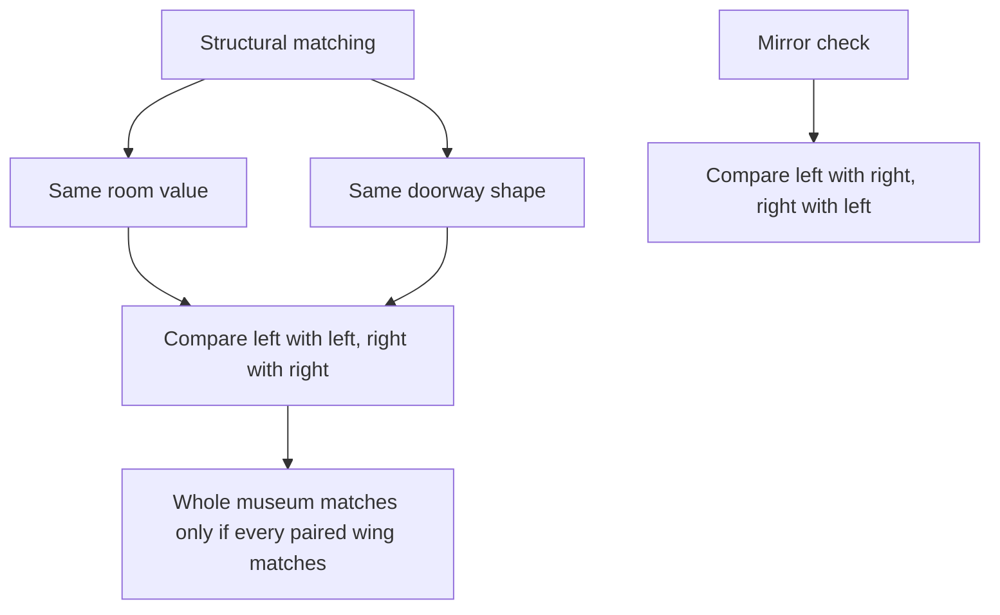
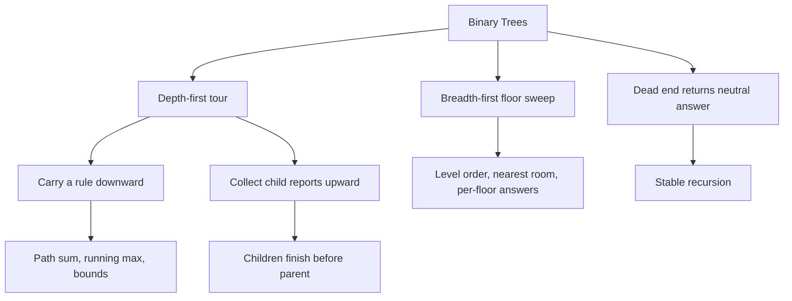
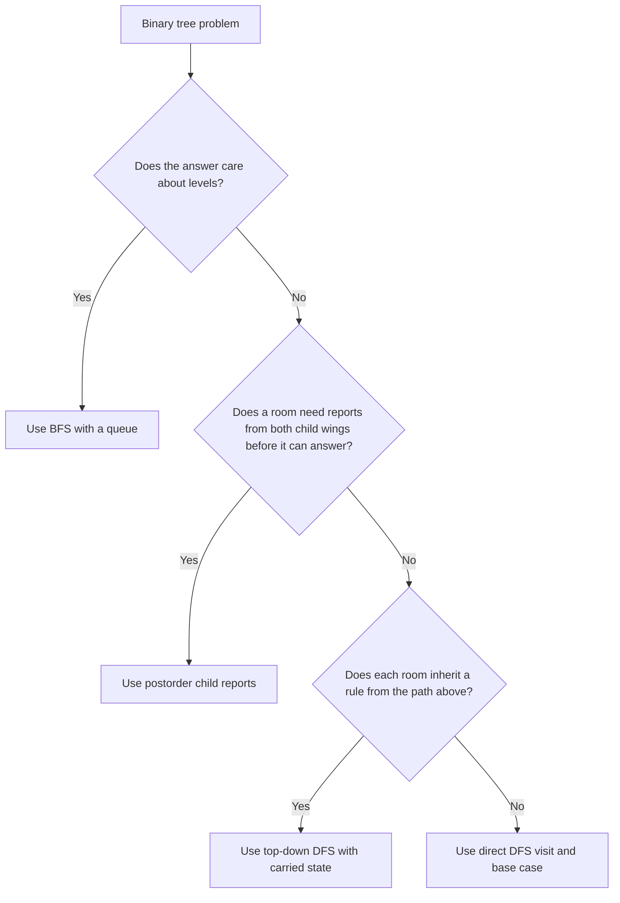

## Overview

Binary trees are the first place where data stops feeling linear. Instead of marching through one sequence, you stand in one room and choose between two smaller wings, each of which contains its own smaller wings.

From recursion and stack thinking, you already know how to trust smaller subproblems. Binary trees sharpen that into one durable rule: each room can ask its left wing and right wing for help, then decide what to do with their answers. This guide builds that idea in three levels: hallway descent with DFS, child reports that combine upward, and floor-by-floor sweeps with BFS.

## Core Concept & Mental Model

Picture a museum where every room can open into at most two smaller wings: a left doorway and a right doorway. A room's plaque is the value stored at that node. A missing doorway is a dead end. If you send a docent into the museum, they can inspect it in two fundamentally different ways:

- Follow one hallway all the way down before coming back up.
- Sweep one floor of rooms at a time before descending.

Those two tour styles are DFS and BFS. The most important habit in tree problems is deciding which tour the question is really asking for.

### Understanding the Analogy

#### The Setup

You start in the lobby room. Every room has three pieces of information that matter: its own plaque, its left doorway, and its right doorway. The museum keeps shrinking as you move. A child wing is not a special case of the whole museum; it is the whole museum again, just smaller. That is why tree recursion works so reliably.

#### Hallway Descent

In a depth-first tour, the docent commits to one hallway, keeps going until a dead end, then backtracks and explores the other hallway. The key is that every room uses the same rule. If the docent reaches a dead end, that branch contributes nothing except the base case. If the docent reaches a real room, that room can inspect itself, ask both smaller wings for their reports, and continue.

This is why DFS feels like a conversation between a room and its two wings. A room never needs to understand the entire museum at once. It only needs to know what question to ask each child wing and how to combine the two answers.

#### Reports From Child Wings

Some questions are not about visiting a room. They are about what comes back upward. A room might ask each wing:

- How many rooms do you contain?
- How tall are you?
- Are you balanced?
- What is the best score hidden inside you?

When the two reports come back, the current room merges them into one new report for its parent. This is the postorder habit: let the smaller wings finish first, then compute the answer for the current room.

#### Why These Approaches

Tree questions become manageable because each move throws away most of the museum. You only ever stand in one room and reason about two smaller wings. DFS is ideal when the answer depends on root-to-leaf paths or on reports bubbling upward from children. BFS is ideal when the question cares about levels, nearest rooms, or the first time you encounter something floor by floor.

### How I Think Through This

When I see a binary tree problem, the first thing I ask is: does the answer belong to a path, to a room, or to a whole level? If it belongs to a path or depends on child reports, I start thinking recursively. If it belongs to a level or asks for the first thing seen at each depth, I switch to a queue and think floor by floor. Then I ask one more question: is this top-down state I carry into each room, or bottom-up information each room returns to its parent?

Take `[8, 4, 12, 2, 6, 10, 14]`.

:::trace-tree
[
{
"nodes": [
{"index": 0, "value": 8, "tone": "focus", "badge": "lobby"},
{"index": 1, "value": 4, "tone": "default"},
{"index": 2, "value": 12, "tone": "default"},
{"index": 3, "value": 2, "tone": "default"},
{"index": 4, "value": 6, "tone": "default"},
{"index": 5, "value": 10, "tone": "default"},
{"index": 6, "value": 14, "tone": "default"}
],
"facts": [
{"name": "tour", "value": "DFS", "tone": "orange"},
{"name": "goal", "value": "follow one hallway", "tone": "blue"}
],
"action": "visit",
"label": "Start in the lobby room 8. A depth-first docent chooses one hallway and trusts that each smaller wing can be toured with the same rule."
},
{
"nodes": [
{"index": 0, "value": 8, "tone": "active"},
{"index": 1, "value": 4, "tone": "focus", "badge": "next"},
{"index": 2, "value": 12, "tone": "muted"},
{"index": 3, "value": 2, "tone": "default"},
{"index": 4, "value": 6, "tone": "default"},
{"index": 5, "value": 10, "tone": "muted"},
{"index": 6, "value": 14, "tone": "muted"}
],
"facts": [
{"name": "tour", "value": "DFS", "tone": "orange"},
{"name": "active wing", "value": "left", "tone": "orange"}
],
"action": "branch",
"label": "The docent commits to the left wing first. The right wing still exists, but it can wait because recursion remembers where to return."
},
{
"nodes": [
{"index": 0, "value": 8, "tone": "active"},
{"index": 1, "value": 4, "tone": "active"},
{"index": 2, "value": 12, "tone": "muted"},
{"index": 3, "value": 2, "tone": "focus", "badge": "dead end next"},
{"index": 4, "value": 6, "tone": "muted"},
{"index": 5, "value": 10, "tone": "muted"},
{"index": 6, "value": 14, "tone": "muted"}
],
"facts": [
{"name": "tour", "value": "DFS", "tone": "orange"},
{"name": "base case", "value": "missing doorway = stop", "tone": "green"}
],
"action": "visit",
"label": "At room 2 the docent is nearly at a dead end. Missing doorways do not break the tour; they are the signal to return the base-case report."
},
{
"nodes": [
{"index": 0, "value": 8, "tone": "active"},
{"index": 1, "value": 4, "tone": "focus", "badge": "merge"},
{"index": 2, "value": 12, "tone": "muted"},
{"index": 3, "value": 2, "tone": "done"},
{"index": 4, "value": 6, "tone": "done"},
{"index": 5, "value": 10, "tone": "muted"},
{"index": 6, "value": 14, "tone": "muted"}
],
"facts": [
{"name": "left report", "value": "done", "tone": "green"},
{"name": "right report", "value": "done", "tone": "green"}
],
"action": "combine",
"label": "Once both child wings of room 4 have reported back, room 4 can compute its own answer and hand a single combined report upward."
},
{
"nodes": [
{"index": 0, "value": 8, "tone": "answer", "badge": "whole museum"},
{"index": 1, "value": 4, "tone": "done"},
{"index": 2, "value": 12, "tone": "done"},
{"index": 3, "value": 2, "tone": "done"},
{"index": 4, "value": 6, "tone": "done"},
{"index": 5, "value": 10, "tone": "done"},
{"index": 6, "value": 14, "tone": "done"}
],
"facts": [
{"name": "rule", "value": "room + child reports", "tone": "purple"}
],
"action": "done",
"label": "That is the tree habit in one picture: descend, stop cleanly at dead ends, let child wings finish, then let each room hand one report to its parent."
}
]
:::

---

## Building Blocks — Progressive Learning

### Level 1: Hallway Descent

**Why this level matters**

This is the foundation of tree thinking. If you cannot trust yourself to stand in one room, handle the dead-end case cleanly, and recurse into the two smaller wings, every later tree pattern feels chaotic. Hallway descent is the move behind counting rooms, finding a plaque, collecting leaves, and any root-to-leaf walk.

**How to think about it**

Pretend the docent only has one job: arrive in a room, do the small piece of work that belongs to that room, then send the same docent into the left doorway and the right doorway. The room is never responsible for the whole museum. It only follows the tour rule once.

The dead-end case is what keeps the whole museum from falling apart. A missing doorway is not an error. It is a valid tiny wing whose report is immediate and predictable. Once you stop treating `null` as a weird exception, recursive DFS becomes stable.

**The one thing to get right**

Decide exactly what the dead end returns before you write anything else. If the empty wing returns the wrong neutral value, every real room inherits that mistake and the whole tour drifts off course.

**Visualization**

Take `[7, 3, 11, 1, 5, null, 13]`.

:::trace-tree
[
{
"nodes": [
{"index": 0, "value": 7, "tone": "focus", "badge": "start"},
{"index": 1, "value": 3, "tone": "default"},
{"index": 2, "value": 11, "tone": "default"},
{"index": 3, "value": 1, "tone": "default"},
{"index": 4, "value": 5, "tone": "default"},
{"index": 6, "value": 13, "tone": "default"}
],
"facts": [
{"name": "pattern", "value": "visit then recurse", "tone": "orange"}
],
"action": "visit",
"label": "The docent starts at room 7 and commits to the same tour rule for every room: inspect this room, then recurse into the left and right doorways."
},
{
"nodes": [
{"index": 0, "value": 7, "tone": "active"},
{"index": 1, "value": 3, "tone": "focus", "badge": "left wing"},
{"index": 2, "value": 11, "tone": "muted"},
{"index": 3, "value": 1, "tone": "default"},
{"index": 4, "value": 5, "tone": "default"},
{"index": 6, "value": 13, "tone": "muted"}
],
"facts": [
{"name": "call stack", "value": "7 -> 3", "tone": "orange"}
],
"action": "branch",
"label": "The tour goes down the left hallway first. The rest of the museum waits on the call stack rather than disappearing."
},
{
"nodes": [
{"index": 0, "value": 7, "tone": "active"},
{"index": 1, "value": 3, "tone": "active"},
{"index": 2, "value": 11, "tone": "muted"},
{"index": 3, "value": 1, "tone": "focus", "badge": "leaf"},
{"index": 4, "value": 5, "tone": "muted"},
{"index": 6, "value": 13, "tone": "muted"}
],
"facts": [
{"name": "dead ends next", "value": "both doorways", "tone": "green"}
],
"action": "visit",
"label": "Room 1 is a leaf. Its child wings are both missing, so the next recursive calls hit the base case immediately."
},
{
"nodes": [
{"index": 0, "value": 7, "tone": "active"},
{"index": 1, "value": 3, "tone": "focus", "badge": "resume"},
{"index": 2, "value": 11, "tone": "muted"},
{"index": 3, "value": 1, "tone": "done"},
{"index": 4, "value": 5, "tone": "focus", "badge": "next leaf"},
{"index": 6, "value": 13, "tone": "muted"}
],
"facts": [
{"name": "tour state", "value": "backtrack then right", "tone": "purple"}
],
"action": "branch",
"label": "After the leftmost dead end reports back, the docent resumes at room 3 and takes its right doorway. DFS is just disciplined backtracking."
},
{
"nodes": [
{"index": 0, "value": 7, "tone": "answer", "badge": "resolved"},
{"index": 1, "value": 3, "tone": "done"},
{"index": 2, "value": 11, "tone": "done"},
{"index": 3, "value": 1, "tone": "done"},
{"index": 4, "value": 5, "tone": "done"},
{"index": 6, "value": 13, "tone": "done"}
],
"facts": [
{"name": "habit", "value": "same rule in every room", "tone": "purple"}
],
"action": "done",
"label": "Once you can trust that repeated room rule, simple DFS problems stop feeling like special tricks and start feeling mechanical."
}
]
:::

:::stackblitz{step=1 total=3 exercises="step1-exercise1-problem.ts,step1-exercise2-problem.ts,step1-exercise3-problem.ts" solutions="step1-exercise1-solution.ts,step1-exercise2-solution.ts,step1-exercise3-solution.ts"}

> The room does one small job, dead ends return the neutral answer, and the same tour rule repeats down both hallways.

**→ Bridge to Level 2**

Hallway descent teaches you to visit rooms correctly, but it does not yet teach you how to build a useful report from both child wings. As soon as the answer depends on what the left and right sides each discovered, you need child reports that combine upward.

### Level 2: Child Reports

**Why this level matters**

This level unlocks the real power of trees. Many important questions are not answered while descending. They are answered only after both child wings have come back. Height, balance, subtree counts, and many hidden-path metrics all live here.

**How to think about it**

Each child wing returns a report with exactly the information its parent needs. The parent room does not ask for raw tour history. It asks for a compact summary. Then the parent merges the left summary, the right summary, and its own plaque into one new summary for the next room above.

This is postorder thinking. Children finish first. Parent computes second. If you try to compute a child-report question before both wings have answered, you are reasoning too early.

**The one thing to get right**

Be explicit about what your report contains. If a room needs both a count and a flag, return both. Trying to squeeze multiple meanings into one number usually creates a bug that only appears on uneven trees.

**Visualization**

Take `[9, 4, 12, 2, 6, 11, 15]`.

:::trace-tree
[
{
"nodes": [
{"index": 0, "value": 9, "tone": "active"},
{"index": 1, "value": 4, "tone": "active"},
{"index": 2, "value": 12, "tone": "muted"},
{"index": 3, "value": 2, "tone": "done", "badge": "size 1"},
{"index": 4, "value": 6, "tone": "done", "badge": "size 1"},
{"index": 5, "value": 11, "tone": "muted"},
{"index": 6, "value": 15, "tone": "muted"}
],
"facts": [
{"name": "left report", "value": "1", "tone": "green"},
{"name": "right report", "value": "1", "tone": "green"}
],
"action": "combine",
"label": "Both child leaves of room 4 have already finished. Each wing returns a compact report: its subtree size is 1."
},
{
"nodes": [
{"index": 0, "value": 9, "tone": "active"},
{"index": 1, "value": 4, "tone": "focus", "badge": "merge now"},
{"index": 2, "value": 12, "tone": "muted"},
{"index": 3, "value": 2, "tone": "done", "badge": "1"},
{"index": 4, "value": 6, "tone": "done", "badge": "1"},
{"index": 5, "value": 11, "tone": "muted"},
{"index": 6, "value": 15, "tone": "muted"}
],
"facts": [
{"name": "room 4 size", "value": "3", "tone": "orange"}
],
"action": "combine",
"label": "Room 4 merges left size 1, right size 1, and itself to create one new report: this whole wing has size 3."
},
{
"nodes": [
{"index": 0, "value": 9, "tone": "focus", "badge": "final merge"},
{"index": 1, "value": 4, "tone": "done", "badge": "3"},
{"index": 2, "value": 12, "tone": "done", "badge": "3"},
{"index": 3, "value": 2, "tone": "done"},
{"index": 4, "value": 6, "tone": "done"},
{"index": 5, "value": 11, "tone": "done"},
{"index": 6, "value": 15, "tone": "done"}
],
"facts": [
{"name": "left wing", "value": "3", "tone": "green"},
{"name": "right wing", "value": "3", "tone": "green"},
{"name": "whole museum", "value": "7", "tone": "purple"}
],
"action": "combine",
"label": "Once both wing reports arrive at the lobby, the lobby can answer a museum-wide question in one step. That is the essence of postorder aggregation."
},
{
"nodes": [
{"index": 0, "value": 9, "tone": "answer", "badge": "report up"},
{"index": 1, "value": 4, "tone": "done"},
{"index": 2, "value": 12, "tone": "done"},
{"index": 3, "value": 2, "tone": "done"},
{"index": 4, "value": 6, "tone": "done"},
{"index": 5, "value": 11, "tone": "done"},
{"index": 6, "value": 15, "tone": "done"}
],
"facts": [
{"name": "pattern", "value": "children first, parent second", "tone": "purple"}
],
"action": "done",
"label": "A child-report problem is solved when every room can summarize its wing for the room above it."
}
]
:::

:::stackblitz{step=2 total=3 exercises="step2-exercise1-problem.ts,step2-exercise2-problem.ts,step2-exercise3-problem.ts" solutions="step2-exercise1-solution.ts,step2-exercise2-solution.ts,step2-exercise3-solution.ts"}

> Let the child wings finish first; then each room turns two smaller reports into one report for its parent.

**→ Bridge to Level 3**

Child reports are perfect when the answer belongs to a room and its two wings, but they lose the notion of depth-wide context. If the question asks what happens at each level or which room appears first from left to right, you need to tour the museum floor by floor instead.

### Level 3: Floor Sweep

**Why this level matters**

Some tree questions care about levels rather than root-to-leaf structure. Level order listings, nearest exits, and first room seen on each floor all require you to keep rooms grouped by depth. DFS can simulate that, but BFS makes the grouping explicit and easier to trust.

**How to think about it**

Imagine a rope line holding the rooms you still need to inspect. Start with the lobby in the line. Remove the front room, record whatever the current floor needs, then add that room's children to the back of the line. When you know how many rooms were already in line at the start of a floor, you know exactly where one level ends and the next begins.

This is the queue habit: the front of the line is the current room, the back of the line is tomorrow's work. The queue preserves level order for free.

**The one thing to get right**

Freeze the current floor size before you start processing that floor. If you keep reading the queue's changing length while you append children, rooms from the next floor leak into the current one.

**Visualization**

Take `[8, 4, 12, 2, 6, 10, 14]`.

:::trace-tree
[
{
"nodes": [
{"index": 0, "value": 8, "tone": "frontier", "badge": "queue"},
{"index": 1, "value": 4, "tone": "muted"},
{"index": 2, "value": 12, "tone": "muted"},
{"index": 3, "value": 2, "tone": "muted"},
{"index": 4, "value": 6, "tone": "muted"},
{"index": 5, "value": 10, "tone": "muted"},
{"index": 6, "value": 14, "tone": "muted"}
],
"facts": [
{"name": "queue", "value": "[8]", "tone": "purple"},
{"name": "floor", "value": "0", "tone": "blue"}
],
"action": "queue",
"label": "The rope line starts with only the lobby. That means floor 0 contains exactly one room."
},
{
"nodes": [
{"index": 0, "value": 8, "tone": "focus", "badge": "pop"},
{"index": 1, "value": 4, "tone": "frontier"},
{"index": 2, "value": 12, "tone": "frontier"},
{"index": 3, "value": 2, "tone": "muted"},
{"index": 4, "value": 6, "tone": "muted"},
{"index": 5, "value": 10, "tone": "muted"},
{"index": 6, "value": 14, "tone": "muted"}
],
"facts": [
{"name": "queue", "value": "[4,12]", "tone": "purple"},
{"name": "next floor", "value": "1", "tone": "blue"}
],
"action": "queue",
"label": "After inspecting room 8, its two children join the back of the line. The next floor is now waiting in order."
},
{
"nodes": [
{"index": 0, "value": 8, "tone": "done"},
{"index": 1, "value": 4, "tone": "focus", "badge": "floor 1"},
{"index": 2, "value": 12, "tone": "frontier", "badge": "same floor"},
{"index": 3, "value": 2, "tone": "frontier"},
{"index": 4, "value": 6, "tone": "frontier"},
{"index": 5, "value": 10, "tone": "muted"},
{"index": 6, "value": 14, "tone": "muted"}
],
"facts": [
{"name": "frozen floor size", "value": "2", "tone": "orange"},
{"name": "queue", "value": "[4,12]", "tone": "purple"}
],
"action": "queue",
"label": "Floor 1 has exactly two rooms because the queue length was frozen before the floor began. Their children wait for the next round."
},
{
"nodes": [
{"index": 0, "value": 8, "tone": "done"},
{"index": 1, "value": 4, "tone": "done"},
{"index": 2, "value": 12, "tone": "done"},
{"index": 3, "value": 2, "tone": "frontier"},
{"index": 4, "value": 6, "tone": "frontier"},
{"index": 5, "value": 10, "tone": "frontier"},
{"index": 6, "value": 14, "tone": "frontier"}
],
"facts": [
{"name": "queue", "value": "[2,6,10,14]", "tone": "purple"},
{"name": "floor", "value": "2", "tone": "blue"}
],
"action": "queue",
"label": "Now the entire next floor is lined up from left to right. This is why BFS is the natural answer for level-order questions."
},
{
"nodes": [
{"index": 0, "value": 8, "tone": "done"},
{"index": 1, "value": 4, "tone": "done"},
{"index": 2, "value": 12, "tone": "done"},
{"index": 3, "value": 2, "tone": "done"},
{"index": 4, "value": 6, "tone": "done"},
{"index": 5, "value": 10, "tone": "done"},
{"index": 6, "value": 14, "tone": "answer", "badge": "sweep done"}
],
"facts": [
{"name": "habit", "value": "front is now, back is later", "tone": "purple"}
],
"action": "done",
"label": "A floor sweep is complete when each level was processed using the queue snapshot that existed at that level's start."
}
]
:::

:::stackblitz{step=3 total=3 exercises="step3-exercise1-problem.ts,step3-exercise2-problem.ts,step3-exercise3-problem.ts" solutions="step3-exercise1-solution.ts,step3-exercise2-solution.ts,step3-exercise3-solution.ts"}

> BFS keeps a rope line of rooms: the front is what you inspect now, the back is the next floor waiting its turn.

## Key Patterns

### Pattern: Carrying Rules Downward

**When to use**: the question says a room is valid only if it respects something inherited from above. Common signals are path sums, visible rooms, lower/upper limits, or "every node on the path so far."

**How to think about it**: this is still DFS, but the important information travels downward instead of upward. Each room receives a touring rule from its parent, updates that rule with its own plaque, then passes the revised rule to both children. The room does not wait for a complex child report; it carries state into the next hallway.

:::trace-tree
[
{
"nodes": [
{"index": 0, "value": 9, "tone": "focus", "badge": "best so far 9"},
{"index": 1, "value": 4, "tone": "default"},
{"index": 2, "value": 12, "tone": "default"},
{"index": 3, "value": 2, "tone": "default"},
{"index": 4, "value": 7, "tone": "default"}
],
"facts": [
{"name": "carried rule", "value": "max plaque = 9", "tone": "orange"}
],
"action": "visit",
"label": "The lobby hands the current best plaque value down to its children. This is a top-down instruction, not a child report."
},
{
"nodes": [
{"index": 0, "value": 9, "tone": "done"},
{"index": 1, "value": 4, "tone": "focus", "badge": "still below"},
{"index": 2, "value": 12, "tone": "default"},
{"index": 3, "value": 2, "tone": "default"},
{"index": 4, "value": 7, "tone": "default"}
],
"facts": [
{"name": "carried rule", "value": "max plaque stays 9", "tone": "orange"}
],
"action": "branch",
"label": "Room 4 inherits the best plaque seen so far. Since 4 does not beat it, the same rule continues unchanged into the next child wing."
},
{
"nodes": [
{"index": 0, "value": 9, "tone": "done"},
{"index": 1, "value": 4, "tone": "done"},
{"index": 2, "value": 12, "tone": "focus", "badge": "new max"},
{"index": 3, "value": 2, "tone": "muted"},
{"index": 4, "value": 7, "tone": "muted"}
],
"facts": [
{"name": "carried rule", "value": "max plaque becomes 12", "tone": "green"}
],
"action": "visit",
"label": "When room 12 beats the inherited rule, the carried state changes before the tour continues into that wing."
}
]
:::

**Complexity**: Time `O(n)`, Space `O(h)` for the recursion stack, where `h` is tree height.

### Pattern: Structural Matching

**When to use**: the question asks whether two trees mirror each other, match exactly, or whether one wing contains the same shape as another.

**How to think about it**: now the docent is walking two museums at once. The comparison is room-by-room and doorway-by-doorway. A mismatch can happen because the plaques differ or because one museum has a doorway where the other has a dead end. Shape and value matter together.

**Complexity**: Time `O(n)` for a full comparison of `n` paired rooms, Space `O(h)` for recursion.

---

## Decision Framework

**Concept Map**

**Complexity table**

| Technique               | Time   | Space  | Use when                                              |
| ----------------------- | ------ | ------ | ----------------------------------------------------- |
| Recursive DFS visit     | `O(n)` | `O(h)` | The answer depends on paths or single-room inspection |
| Postorder child reports | `O(n)` | `O(h)` | The parent needs summaries from both wings            |
| BFS with queue          | `O(n)` | `O(w)` | The answer depends on levels or nearest-first order   |
| Structural comparison   | `O(n)` | `O(h)` | You are matching two trees room-by-room               |

`h` = height of the tree, `w` = maximum width of any level.

**Decision tree**

**Recognition signals table**

| Problem signal                                                   | Technique               |
| ---------------------------------------------------------------- | ----------------------- |
| "for each level", "nearest", "leftmost/rightmost on every floor" | BFS queue               |
| "height", "balanced", "best hidden inside a subtree"             | Postorder child reports |
| "path sum", "good nodes", "bounds from ancestors"                | Top-down DFS            |
| "count nodes", "find value", "collect leaves"                    | Direct DFS visit        |
| "same tree", "mirror", "subtree shape"                           | Structural matching     |

**When NOT to use**

Do not use BFS when the answer depends on a child wing's finished report rather than on level order; the queue adds noise without helping. Do not force DFS when the question is explicitly level-based; you can simulate levels with recursion, but the bookkeeping becomes more fragile than a simple queue.

## Common Gotchas & Edge Cases

- Treating a missing doorway like an error instead of a valid base case. This is tempting because `null` feels like missing data, but in trees it is part of the structure. Fix it by deciding the neutral return for an empty wing before writing the recursive case.
- Computing the parent room too early. In child-report problems, the parent cannot answer until both wings have finished. Fix it by writing the recursive calls first and naming the two returned summaries before combining them.
- Mixing top-down and bottom-up state in one variable. This is tempting because both are "information about the tree," but they travel in opposite directions. Fix it by separating carried path state from returned child reports.
- Reading the queue length after adding children during BFS. This quietly merges two floors into one. Fix it by freezing the floor size at the beginning of each level.
- Forgetting that extremely unbalanced trees make recursion depth large. Fix it by tracing the height separately from the node count and by considering iterative BFS or stack-based DFS when depth becomes part of the constraint.

**Edge cases**

- Empty museum
- Single room
- Only left doorways
- Only right doorways
- Repeated plaque values
- Negative plaque values when sums or best scores are involved

**Debugging tips**

- Print the current room plaque together with the report returned from the left and right wings.
- For top-down DFS, print the carried rule before descending into each child.
- For BFS, print the queue contents at the start of every floor, not after each child append.
- When a result is off by one, trace the exact neutral value you return for a dead end; tree bugs often start there.
