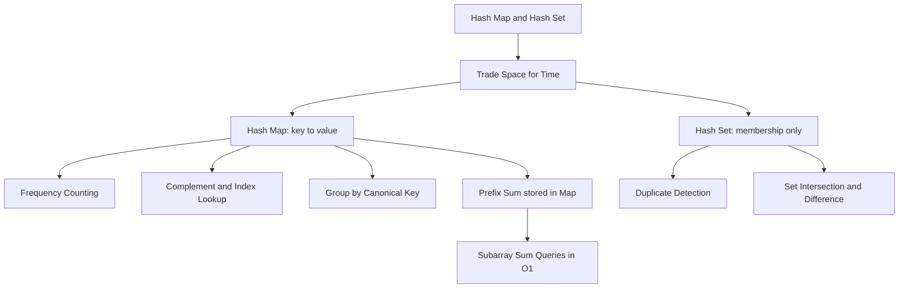
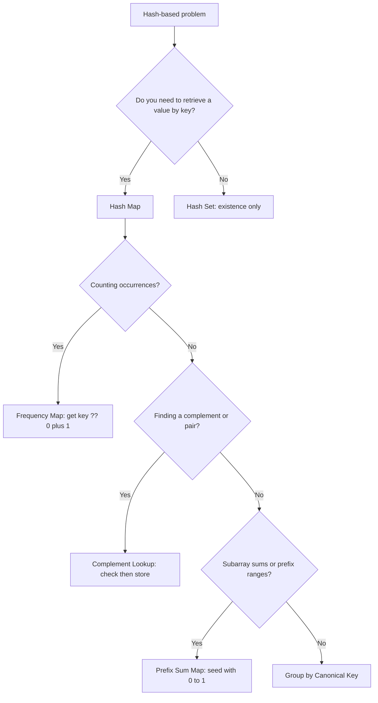

## 1. Overview

Hash maps and hash sets are the fastest way out of O(n²). Any time you find yourself writing "for each element, scan the rest of the array to check…", that inner scan is the problem — and a hash map eliminates it. You've already worked with arrays from Arrays & Strings; a hash map is how you replace searching with remembering.

The core trade is always the same: spend O(n) space to build a lookup structure, earn O(1) per query forever after. When queries are repeated (or when an inner loop's worth of lookups are needed), that trade always wins.

This guide covers three tools in progression: the hash map for counting and mapping (Level 1), the hash set for O(1) membership testing (Level 2), and prefix sums stored in a hash map for answering subarray range questions in O(1) (Level 3).

## 2. Core Concept & Mental Model

### The Library Card Catalog

A large library holds tens of thousands of books. Without organization, finding any book means walking every aisle until you spot it — O(n) per question. Three tools solve this:

- **The card catalog** is the hash map. Every book has a card filed by title: title → shelf location. Any lookup costs one step regardless of library size.
- **The checked-out logbook** is the hash set. Not where the book is — just whether it's borrowed. Membership only, O(1), no value stored.
- **The daily borrow tally** is the prefix sum stored in a map. Every hour, the librarian records the running total of borrowed books. "Books borrowed between 2pm and 4pm?" = tally at 4pm minus tally at 2pm. No re-counting.

These three tools — catalog, logbook, tally — handle nearly every hash-based interview problem.

#### Understanding the Analogy

**The Setup**

You're the head librarian. Patrons ask questions constantly: "Is this book checked out? Which shelf is it on? How many books were borrowed this afternoon?" Without tools, every answer costs a full library walk. You need a system that answers each question in one step, regardless of how large the library grows.

**The Catalog and Logbook**

When a new book arrives, you make a card — title on the front, shelf location on the back — and file it alphabetically. Filing is O(1): go to the right letter, insert. Looking up is O(1): go to the right letter, pull. The catalog works because the act of filing _is_ the act of making the answer retrievable. You don't search for books anymore; you retrieve their cards.

The logbook is simpler. When a book is borrowed, you stamp its title on today's page. "Is _Moby Dick_ checked out?" — one scan of the logbook, yes or no. The logbook is the catalog with the shelf location stripped out: existence only, no value.

What would go wrong without them? Every question becomes a full-library walk. Ten thousand books, one thousand daily questions: ten million steps. The catalog and logbook collapse this to around twenty thousand steps total.

**The Tally Sheet**

Every hour, a volunteer records the running total of borrowed books since opening. At 2pm the count is 47; at 4pm it's 112. "How many books were borrowed between 2pm and 4pm?" = 112 − 47 = 65. No re-scanning the logbook page by page.

In code, the tally sheet is a running sum stored in a hash map. As you walk an array, you keep a running prefix sum. You store each prefix sum in the map. When you want to know whether any subarray ending at the current position sums to a target _k_, you ask: "has the running sum ever been `currentSum − k`?" If yes, the elements between that earlier checkpoint and now sum to exactly _k_.

**Why These Approaches**

Every hash-based technique trades space for time. You spend O(n) space on the catalog, logbook, or tally sheet, and you earn O(1) per lookup instead of O(n) per scan. When you need to look something up for every element — that's a potential O(n²) loop — the hash structure buys you O(n) total instead.

The alternative, scanning, is quadratic when repeated. A single lookup over n elements is O(n). Do it for every element and you have O(n²). The catalog replaces each of those inner scans with O(1). One pass to build, O(1) per query after.

**A Simple Example**

A patron hands you a pile of book return slips and asks how many times each title appears. Without a catalog: for every slip, re-read the whole pile to count that title — O(n²) total. With a tally card per title: pick up each slip once, add one mark to that title's card, set it down. One pass through the pile, O(1) per slip. Done.

Now you understand the tools. Let's build them step by step.

#### How I Think Through This

When I see a problem involving "find the element that pairs with X" or "check if this appeared before" or "how often does Y appear," I immediately ask: what would I need to _remember_ to avoid scanning? If the answer is a value I need to retrieve later (a count, an index, a group key) — that's a hash map. If it's just yes/no — that's a hash set. If the problem involves subarrays and their sums, I add a running prefix sum alongside the map. The recognition is almost always the same: I see a potential inner loop and I ask what the catalog equivalent would be.

Take `[2, 7, 11, 15]` with target `9`. For each element I ask: does the complement (`9 − element`) already appear in what I've walked past? I keep a map of value → index as I go. When I reach `7`: is `9 − 7 = 2` in the map? I inserted `2` one step ago, so yes. Return `[0, 1]` immediately. No inner loop, one pass. ✓

## 3. Building Blocks — Progressive Learning

**Level 1: The Catalog — Counting and Mapping**

**Why this level matters**
Most hash map usage in interviews reduces to two operations: counting how often something appears, or remembering a value (an index, a group key) keyed to something you've seen. Once you can build a frequency table and do a complement lookup in your sleep, you've got the core of the majority of hash map problems.

**How to think about it**
A hash map is the card catalog in code: `map.set(key, value)` files a card, `map.get(key)` retrieves it. The most common pattern — frequency counting — is just incrementing a counter for each key you encounter. As you walk, for each element: `map.set(x, (map.get(x) ?? 0) + 1)`. That `?? 0` is the critical detail: if the key has never been seen, `map.get` returns `undefined`, not `0`.

The second pattern — value → index — powers complement lookups. As you walk, store `map.set(value, index)`. For each new element, check if `target − element` already exists in the map. If it does, you have your pair without scanning backwards.

**Walking through it**

Build a frequency table for `['cat', 'dog', 'cat', 'bird', 'dog', 'cat']`:

:::trace-map
[
{"input":["cat","dog","cat","bird","dog","cat"],"currentI":-1,"map":[],"action":null,"label":"Open an empty catalog — no cards filed yet. freq = {}"},
{"input":["cat","dog","cat","bird","dog","cat"],"currentI":0,"map":[["cat",1]],"highlight":"cat","action":"insert","label":"See 'cat'. freq.get('cat') → undefined. File new card: cat → 1."},
{"input":["cat","dog","cat","bird","dog","cat"],"currentI":1,"map":[["cat",1],["dog",1]],"highlight":"dog","action":"insert","label":"See 'dog'. freq.get('dog') → undefined. File new card: dog → 1."},
{"input":["cat","dog","cat","bird","dog","cat"],"currentI":2,"map":[["cat",2],["dog",1]],"highlight":"cat","action":"update","label":"See 'cat'. freq.get('cat') → 1. Update card: cat → 2."},
{"input":["cat","dog","cat","bird","dog","cat"],"currentI":3,"map":[["cat",2],["dog",1],["bird",1]],"highlight":"bird","action":"insert","label":"See 'bird'. freq.get('bird') → undefined. File new card: bird → 1."},
{"input":["cat","dog","cat","bird","dog","cat"],"currentI":4,"map":[["cat",2],["dog",2],["bird",1]],"highlight":"dog","action":"update","label":"See 'dog'. freq.get('dog') → 1. Update card: dog → 2."},
{"input":["cat","dog","cat","bird","dog","cat"],"currentI":5,"map":[["cat",3],["dog",2],["bird",1]],"highlight":"cat","action":"update","label":"See 'cat'. freq.get('cat') → 2. Update card: cat → 3."},
{"input":["cat","dog","cat","bird","dog","cat"],"currentI":-2,"map":[["cat",3],["dog",2],["bird",1]],"action":"done","label":"One pass, six steps. \"How often does 'cat' appear?\" → freq.get('cat') = 3 ✓"}
]
:::

One pass, six steps. "How often does 'cat' appear?" — one lookup, answer: 3.

**The one thing to get right**

`map.get(key)` returns `undefined` when the key is absent, not `0`. Writing `map.get(key) + 1` produces `NaN`, which silently corrupts every count downstream. Always use `(map.get(key) ?? 0) + 1`. This is the single most common hash map bug in interviews.

:::stackblitz{step=1 total=3 exercises="step1-exercise1-problem.ts,step1-exercise2-problem.ts,step1-exercise3-problem.ts" solutions="step1-exercise1-solution.ts,step1-exercise2-solution.ts,step1-exercise3-solution.ts"}

> **Mental anchor**: "Walk once, catalog as you go. `(freq[key] ?? 0) + 1` — the `?? 0` is the card that was never filed."

**→ Bridge to Level 2**: A frequency map stores values. But sometimes you only need to know whether a key exists — you don't care what it maps to. A hash set is a map with no values: pure membership in O(1), with less overhead and clearer intent.

---

**Level 2: The Logbook — Membership in O(1)**

**Why this level matters**
Deduplication, intersection, "have I seen this before?" — all of these reduce to membership testing. A hash set answers membership in O(1). It is a focused tool: add an entry, check it, no values needed.

**How to think about it**
`set.add(x)` stamps an entry in the logbook. `set.has(x)` checks whether that stamp exists. Nothing more. Use a set when the question is yes/no and you don't need to retrieve an associated value later.

The classic pattern: walk the array, check `set.has(x)` before calling `set.add(x)`. If the check passes, you've found a duplicate. For intersection, load array A into a set, then walk array B and collect every element where `set.has(element)` is true.

**Walking through it**

"Does `[3, 1, 4, 1, 5]` contain a duplicate?"

:::trace-map
[
{"input":[3,1,4,1,5],"currentI":-1,"map":[],"action":null,"label":"Open empty logbook — nothing stamped yet. seen = {}"},
{"input":[3,1,4,1,5],"currentI":0,"map":[[3,null]],"highlight":3,"action":"insert","label":"See 3. seen.has(3)? No → stamp it. seen = {3}"},
{"input":[3,1,4,1,5],"currentI":1,"map":[[3,null],[1,null]],"highlight":1,"action":"insert","label":"See 1. seen.has(1)? No → stamp it. seen = {3, 1}"},
{"input":[3,1,4,1,5],"currentI":2,"map":[[3,null],[1,null],[4,null]],"highlight":4,"action":"insert","label":"See 4. seen.has(4)? No → stamp it. seen = {3, 1, 4}"},
{"input":[3,1,4,1,5],"currentI":3,"map":[[3,null],[1,null],[4,null]],"highlight":1,"action":"found","label":"See 1. seen.has(1)? YES → return true immediately. Duplicate found at index 3 ✓"},
{"input":[3,1,4,1,5],"currentI":-2,"map":[[3,null],[1,null],[4,null]],"action":"done","label":"Done — duplicate detected, returned true. Found in four steps, never scanned backwards ✓"}
]
:::

Found the duplicate at index 3 after four steps. Never had to scan backwards.

**The one thing to get right**

A set tracks existence, not count. If you need to know how often something appeared — for example, to find the _first_ element that appears exactly once — a set is wrong: it cannot distinguish "appeared once" from "appeared five times." Use a frequency map for count-based questions; use a set only for pure existence checks.

:::stackblitz{step=2 total=3 exercises="step2-exercise1-problem.ts,step2-exercise2-problem.ts,step2-exercise3-problem.ts" solutions="step2-exercise1-solution.ts,step2-exercise2-solution.ts,step2-exercise3-solution.ts"}

> **Mental anchor**: "Set = the logbook. `has()` before `add()`. Set for existence, map for values."

**→ Bridge to Level 3**: Sets and maps answer per-element questions. But some problems ask about _contiguous slices_ of an array: "does any subarray sum to k?" Checking every subarray is O(n²). The prefix sum stored in a map collapses this to O(n) by reframing the question as a single O(1) lookup per element.

---

**Level 3: The Tally Sheet — Prefix Sum + Hash Map**

**Why this level matters**
"Count subarrays with sum equal to k" looks like it needs a nested loop. The prefix sum + hash map pattern reduces this to a single pass. Once you see how the tally sheet works, you'll recognize this trick across dozens of problems involving sums, differences, and ranges.

**How to think about it**
Maintain a running `prefixSum` as you walk the array. You want to know: does any subarray ending _here_ have sum exactly `k`? If the running sum at position `j` is `S`, and there was a running sum of `S − k` at some earlier position `i`, then the slice from `i+1` to `j` sums to exactly `k`. Store all seen prefix sums in a map (prefixSum → count of how many times that sum appeared) and check `map.has(prefixSum − k)` at each step.

Initialize the map with `{0: 1}` before you start. This represents the empty prefix before any elements. Without it, when `prefixSum === k` (a subarray starting at index 0), you'd look for `prefixSum − k = 0` and find nothing — silently missing valid answers.

**Walking through it**

Count subarrays with sum = 2 in `[1, 1, 1]`:

:::trace-map
[
{"input":[1,1,1],"currentI":-1,"map":[[0,1]],"action":null,"vars":[{"name":"prefixSum","value":0},{"name":"result","value":0}],"label":"Initialize: prefixSum = 0, result = 0. Seed map with {0: 1} — the empty prefix before any elements."},
{"input":[1,1,1],"currentI":0,"map":[[0,1],[1,1]],"highlight":null,"action":"miss","vars":[{"name":"prefixSum","value":1},{"name":"result","value":0}],"label":"Index 0, value 1. prefixSum = 0+1 = 1. Look for 1−2 = −1 in counts → miss. Store counts[1] = 1."},
{"input":[1,1,1],"currentI":1,"map":[[0,1],[1,1],[2,1]],"highlight":0,"action":"found","vars":[{"name":"prefixSum","value":2},{"name":"result","value":1}],"label":"Index 1, value 1. prefixSum = 1+1 = 2. Look for 2−2 = 0 in counts → found (value: 1)! result += 1 → result = 1. Store counts[2] = 1."},
{"input":[1,1,1],"currentI":2,"map":[[0,1],[1,1],[2,1],[3,1]],"highlight":1,"action":"found","vars":[{"name":"prefixSum","value":3},{"name":"result","value":2}],"label":"Index 2, value 1. prefixSum = 2+1 = 3. Look for 3−2 = 1 in counts → found (value: 1)! result += 1 → result = 2. Store counts[3] = 1."},
{"input":[1,1,1],"currentI":-2,"map":[[0,1],[1,1],[2,1],[3,1]],"action":"done","vars":[{"name":"prefixSum","value":3},{"name":"result","value":2}],"label":"Done. Two subarrays sum to 2: [1,1] at indices 0–1 and [1,1] at indices 1–2. Return 2 ✓"}
]
:::

Result: 2. The two subarrays are `[1,1]` at indices 0–1 and `[1,1]` at indices 1–2. ✓

**The one thing to get right**

Seed the map with `{0: 1}` before processing any element. Without the seed, subarrays that start at the very beginning (index 0) are invisible: when `prefixSum === k`, you look for `prefixSum − k = 0` in the map, but zero was never recorded. The code runs silently and returns a count that is simply off by some amount with no error to catch it.

:::stackblitz{step=3 total=3 exercises="step3-exercise1-problem.ts,step3-exercise2-problem.ts,step3-exercise3-problem.ts" solutions="step3-exercise1-solution.ts,step3-exercise2-solution.ts,step3-exercise3-solution.ts"}

> **Mental anchor**: "prefixSum[j] − prefixSum[i] = subarray sum i+1..j. Store seen sums in map. Seed with {0:1} or you miss index-0 subarrays."

## 4. Key Patterns

**Pattern: Complement Lookup**

**When to use**: "Find two elements that sum to target", "find a pair with difference k", "find an element's partner." You need to check whether a specific value appeared somewhere earlier in the array.

**How to think about it**: For each element at position `j`, compute the "complement" — the value that would satisfy the condition when paired with `element[j]`. Store all previously seen values in a map (value → index). Then `map.has(complement)` answers the question in O(1). Always _check before storing_ so an element cannot match itself.

**Complexity**: Time O(n), Space O(n)

**Pattern: Frequency Map + Canonical Key**

**When to use**: "Are these two strings anagrams?", "group words that are anagrams of each other", "do these collections have the same distribution?" You're checking whether two collections share the same multiset of elements, or bucketing items that share a property.

**How to think about it**: Build a frequency map for one collection, walk the second and decrement; if all counts reach zero, the distributions match. For grouping, use a canonical key: sort each word's characters to get a stable key like `"aet"` for "eat", "tea", and "ate". Words with the same canonical key land in the same bucket automatically.

**Complexity**: Time O(n · m log m) where m = average string length, Space O(n · m)

## 5. Decision Framework

**Concept Map**

**Complexity**

| Operation | Hash Map | Hash Set | Array scan  |
| --------- | -------- | -------- | ----------- |
| Insert    | O(1) avg | O(1) avg | O(1) append |
| Lookup    | O(1) avg | O(1) avg | O(n)        |
| Delete    | O(1) avg | O(1) avg | O(n)        |
| Space     | O(n)     | O(n)     | O(1) extra  |

**Decision Tree**

**Recognition Signals**

| Problem keywords                                   | Technique                               |
| -------------------------------------------------- | --------------------------------------- |
| "contains duplicate", "any repeats", "seen before" | Hash set, one pass                      |
| "two sum", "pair that adds to", "complement"       | Complement lookup (check before store)  |
| "frequency", "most common", "count occurrences"    | Frequency map                           |
| "anagram", "same letters", "valid permutation"     | Frequency map or sorted canonical key   |
| "subarray sum equals k", "subarray with sum"       | Prefix sum + map, seed `{0:1}`          |
| "group by", "cluster", "bucket into"               | Map of arrays with canonical key        |
| "longest consecutive sequence"                     | Load into set, scan for sequence starts |

**When NOT to use**

- **Data is already sorted** → binary search is O(log n); a hash scan is O(n)
- **Key space is small and bounded** (e.g., 26 lowercase letters) → a plain fixed-size array has the same O(1) access with less overhead
- **You need elements in sorted order** → maps have no ordering guarantee; sort at the end or use a sorted structure
- **Spatial or positional reasoning** → two pointers or sliding window; hash maps don't help with index arithmetic

## 6. Common Gotchas & Edge Cases

**Typical Mistakes**

1. **`map.get(key) + 1` when the key is absent** — `undefined + 1` produces `NaN`. Every subsequent count from that key is also `NaN`, corrupting results silently. Always write `(map.get(key) ?? 0) + 1`.

2. **Forgetting to seed the prefix map with `{0: 1}`** — without the seed, subarrays starting at index 0 are invisible. When `prefixSum === k`, you look for `0` in the map; it's not there; you silently miss valid subarrays with no error.

3. **Storing before checking in complement lookups** — if you call `map.set(nums[i], i)` before checking `map.has(target − nums[i])`, an element can match itself. Always check first, then store.

4. **Using a set when you need a count** — sets cannot tell you "appeared exactly once" vs. "appeared three times." For first-unique-character style problems, you need a frequency map, not a set.

5. **`for...in` on a Map** — `for...in` iterates prototype properties, not map entries. Use `for (const [k, v] of map)` or `map.forEach` to iterate map contents.

**Edge Cases to Always Test**

- Empty input → return `0`, `[]`, or `false` as appropriate; no crash
- Single element → can't form a pair; subarray is just that element
- All elements identical → frequency count = n; set size = 1
- Target sum of `0` in prefix problems → the seed `{0: 1}` handles this correctly
- Negative numbers in prefix problems → the algorithm is correct; no special-casing needed

**Debugging Tips**

- Print the map after building: `console.log([...map.entries()])` — check keys and counts look right
- For prefix sum, log `prefixSum` and `prefixSum − k` at each step; the lookup should hit at the positions you expect
- If a count is off by one, verify you seeded the prefix map and that you're checking before storing
- For complement lookups, trace the map state at the moment the lookup fires — the complement should already be present
