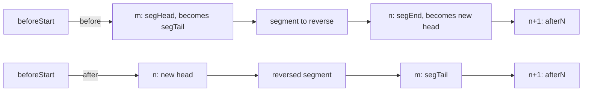
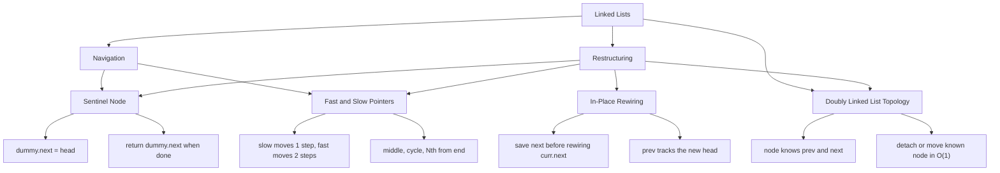
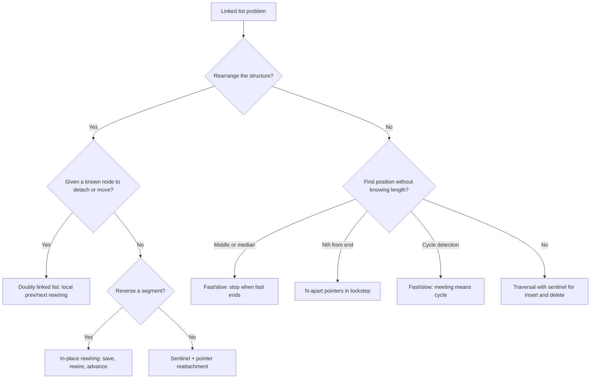

## 1. Overview

Linked lists are chains of nodes connected by pointers. In a **singly linked list**, each node holds a value and a reference to the next node in the sequence. In a **doubly linked list**, each node also keeps a reference back to the previous node. Unlike arrays, there is no index-based access. To reach the fifth node you walk through nodes one, two, three, and four.

You already know how to think with pointers moving forward through a sequence from [Arrays & Strings](/fundamentals/arrays-strings). Linked lists use the same forward-scanning intuition, but instead of incrementing an index you follow pointers like `.next` or `.prev` — and instead of writing to a slot you rewire a connection between nodes.

This guide covers four building blocks: **node topology** (singly vs doubly linked structure), the **sentinel node** (eliminating head-special-case bugs), **fast and slow pointers** (finding midpoints and detecting cycles in a single pass), and **in-place pointer rewiring** (reversing and restructuring sections of a list without extra memory).

## 2. Core Concept & Mental Model

Picture a freight train winding through the countryside. Each car is a node. In the simplest version, every car has a single coupling at the back connecting it to the car ahead: that is a **singly linked list** and the coupling is `.next`. In a **doubly linked list**, each car also has a backward coupling to the car behind: `.prev`.

The locomotive at the front is the head. The last car has no forward coupling — its `.next` is null. In a doubly linked train, the first real car also has no backward coupling unless you deliberately attach a sentinel in front of it.

There is no way to jump to car seven directly. You board the locomotive and walk forward, car by car, until you reach the one you need.

### Understanding the Analogy

#### The Setup

You stand at the locomotive. You can read the cargo of the car you're in (`node.val`), and you can step to the next car by following the coupling (`node.next`). Your tasks are restructuring ones: reverse the order of the cars, detect if someone has accidentally coupled the last car back to an earlier one creating an endless loop, find the center car without knowing the length, or remove certain cars from the middle of the train. You must accomplish all of this without building a second train — no extra lists.

#### Three Techniques on the Train

**The node topology** is the first decision. In a singly linked list, each car knows only the car ahead. That is enough for forward traversal, cycle detection, reversal, and many interview problems. In a doubly linked list, each car knows both neighbors. That costs one extra pointer per node, but it lets you remove a known node or move it between positions in O(1) because you can rewire both sides directly. This is the pattern behind structures like an LRU cache.

**The sentinel car** is a dummy locomotive you attach at the very front before starting work — it has no real cargo but gives you a fixed anchor. With the sentinel in place, every real car has a predecessor, including the very first one. Insert and delete operations look identical regardless of which car you're touching. When you finish, unhook the sentinel and return `sentinel.next` as the new head of the train.

In doubly linked lists, it is common to use **two sentinels**: one at the hot/front end and one at the cold/back end. Then every real node always has something on both sides, so insertions and removals near the ends look exactly like insertions and removals in the middle.

**The advance guard** is a pair of conductors. Both start at the locomotive at the same moment. The slow conductor moves one car per step. The fast conductor moves two. After k steps, slow is at position k and fast is at position 2k. When fast can no longer take a full two-car step (the train has ended), slow is at the midpoint. If the train loops — if a coupling somewhere at the back leads to an earlier car — fast will eventually lap slow and they'll occupy the same car.

**Save before cutting** is the discipline of in-place rewiring. A coupling is just a pointer. The moment you overwrite it with `curr.next = something_new`, the old destination is gone unless you saved it first. The atomic move for every reversal step is: save `next = curr.next`, then rewire `curr.next = prev`, then advance `prev = curr; curr = next`. Every reversal operation in this section is built from this single three-step move.

#### Why These Approaches

Linked lists have no random access, so positional information must come from _relative movement_ rather than index arithmetic. The advance guard extracts position — middle, Nth from end — from speed differences without needing a count. Rewiring pointers beats allocating new nodes because you work with the couplings that already exist. The sentinel eliminates the boundary condition where the head node has no predecessor.

The topology matters because it determines what operations are cheap. Singly linked lists are ideal when all motion is forward and you only need the predecessor because you are carrying it in a local variable. Doubly linked lists are worth the extra pointer when nodes need to detach and reattach from the middle frequently without searching for their predecessor first.

### How I Think Through This

When I see a linked list problem, the first thing I ask is: _what node topology do I have, and am I trying to find something or rearrange it?_

If the problem gives me a normal interview `ListNode` with only `.next`, I know I am in singly linked list land. That means I can walk forward, reverse chains, run fast/slow pointers, and delete only if I am also carrying the predecessor. If the problem gives me both `.next` and `.prev`, or talks about moving known nodes to the front/back in O(1), then I switch mental models: this is a doubly linked list problem.

If **finding** — middle, Nth from end, cycle — I reach for fast and slow pointers. The two conductors start at the locomotive and the speed difference does the positioning work for me. If there's a cycle, they'll meet. If there isn't, fast falls off the end and slow is at the midpoint.

If **rearranging** — reversing, merging, rotating, reordering — I start by drawing the couplings I need to cut and rewire. I always set up a sentinel first so I have an anchor before the first real car. Then I identify what three things I need in hand at each step: `prev` (the car behind), `curr` (the car I'm operating on), and `next` (saved before I cut anything).

Take `1 → 2 → 3 → 4 → 5` — finding the middle using fast and slow conductors:

:::trace-ll
[
{"nodes":[{"val":"1"},{"val":"2"},{"val":"3"},{"val":"4"},{"val":"5"}],"pointers":[{"index":0,"label":"slow","color":"blue"},{"index":0,"label":"fast","color":"orange"}],"action":null,"label":"Both slow and fast board at the locomotive, node(1)."},
{"nodes":[{"val":"1"},{"val":"2"},{"val":"3"},{"val":"4"},{"val":"5"}],"pointers":[{"index":1,"label":"slow","color":"blue"},{"index":2,"label":"fast","color":"orange"}],"action":null,"label":"Slow moves 1 car → node(2). Fast moves 2 cars → node(3)."},
{"nodes":[{"val":"1"},{"val":"2"},{"val":"3"},{"val":"4"},{"val":"5"}],"pointers":[{"index":2,"label":"slow","color":"blue"},{"index":4,"label":"fast","color":"orange"}],"action":null,"label":"Slow moves to node(3). Fast moves to node(5)."},
{"nodes":[{"val":"1"},{"val":"2"},{"val":"3"},{"val":"4"},{"val":"5"}],"pointers":[{"index":2,"label":"slow","color":"blue"},{"index":5,"label":"fast","color":"orange"}],"action":"done","label":"fast cannot take another double step — it falls to null. slow is at node(3): the middle car. ✓"}
]
:::

---

## 3. Building Blocks — Progressive Learning

### Level 1: The Sentinel Node & Basic Traversal

**Why this level matters**

Before you can restructure a linked list, you need to be comfortable walking it and making clean insertions and deletions. The most common first bug is the "head special case" — handling the first node differently from every other node, which leads to duplicated code and subtle errors at the boundary. The sentinel node eliminates this asymmetry entirely. It is the single most useful linked list technique for writing correct, branch-free code on a first attempt.

**How to think about it**

#### 1. The Basic Loop — Why Sentinels Matter

Traversal is a while loop: start at `head`, follow `.next` until you reach `null`. At each step you read the current value, check a condition, and decide whether to keep or remove.

```typescript
let prev = null;
let curr = head;

while (curr !== null) {
  if (shouldRemove(curr)) {
    // Remove curr
    if (prev === null) {
      // Special case: removing the head
      head = curr.next;
    } else {
      prev.next = curr.next;
    }
    curr = curr.next;
  } else {
    // Keep curr
    prev = curr;
    curr = curr.next;
  }
}
```

The problem: the first node has no predecessor (`prev = null`), so you need a special case. Every insertion and deletion must check "is this the head?" — and that branch-per-operation duplicates code and introduces bugs.

#### 2. Sentinel Setup & Loop Structure

The sentinel pattern eliminates the head special case entirely. Allocate a dummy node and set `dummy.next = head`. Now _every real node has a predecessor_ — the sentinel is the car before car one.

```typescript
const dummy = new ListNode(0);
dummy.next = head;
let prev = dummy;
let curr = head;

while (curr !== null) {
  if (shouldRemove(curr)) {
    // Remove curr
    prev.next = curr.next; // No special case — same code for head and middle
    curr = curr.next;
  } else {
    // Keep curr
    prev = curr;
    curr = curr.next;
  }
}

return dummy.next; // Return the new head (skip the sentinel)
```

Now `prev` always has a valid `.next` to rewrite. The rest of the logic is identical whether you're at the head or deep in the list.

#### 3. Insertion Pattern — Both Pointers Always Advance

To insert a new node, find the position and splice it in. After insertion, both `prev` and `curr` advance to continue scanning.

```typescript
const dummy = new ListNode(0);
dummy.next = head;
let prev = dummy;
let curr = head;

while (curr !== null) {
  if (curr.val >= targetValue) {
    // Insert before curr
    const newNode = new ListNode(targetValue);
    prev.next = newNode;
    newNode.next = curr;

    // Continue scanning: both advance
    prev = newNode;
    curr = curr.next;
  } else {
    // Not yet at insertion point: advance both
    prev = curr;
    curr = curr.next;
  }
}
```

**Example trace:** Insert `4` into `1 → 3 → 5`:

:::trace-ll
[
{"nodes":[{"val":"D"},{"val":"1"},{"val":"3"},{"val":"5"}],"pointers":[{"index":0,"label":"prev","color":"green"},{"index":1,"label":"curr","color":"blue"}],"action":null,"label":"sentinel → 1 → 3 → 5. prev=sentinel, curr=node(1). Insert 4."},
{"nodes":[{"val":"D"},{"val":"1"},{"val":"3"},{"val":"5"}],"pointers":[{"index":1,"label":"prev","color":"green"},{"index":2,"label":"curr","color":"blue"}],"action":null,"label":"curr.val=1 < 4 → keep scanning. Advance both: prev=node(1), curr=node(3)."},
{"nodes":[{"val":"D"},{"val":"1"},{"val":"3"},{"val":"5"}],"pointers":[{"index":2,"label":"prev","color":"green"},{"index":3,"label":"curr","color":"blue"}],"label":"curr.val=3 < 4 → keep scanning. Advance both: prev=node(3), curr=node(5)."},
{"nodes":[{"val":"D"},{"val":"1"},{"val":"3"},{"val":"4"},{"val":"5"}],"pointers":[{"index":2,"label":"prev","color":"green"},{"index":4,"label":"curr","color":"blue"}],"action":"rewire","label":"curr.val=5 >= 4 → insert. Create node(4). prev.next=node(4), node(4).next=node(5). Both advance: prev=node(4), curr=node(5)."},
{"nodes":[{"val":"D"},{"val":"1"},{"val":"3"},{"val":"4"},{"val":"5"}],"pointers":[{"index":3,"label":"prev","color":"green"},{"index":5,"label":"curr","color":"blue"}],"action":"done","label":"curr=null → done. Result: 1 → 3 → 4 → 5. ✓"}
]
:::

Insertion is straightforward: whenever you move forward (insert or skip), advance both pointers.

#### 4. Counted Traversal — Move A Cursor Exactly K Steps

Not every traversal is "walk until `null`." A common linked-list pattern is: start from a known anchor, then advance a pointer a fixed number of steps to reach the insertion point, split point, or predecessor you need.

This is the linked-list version of array indexing. Since you cannot jump to index `k`, you simulate "go to position `k`" by physically moving a cursor forward `k` times.

```typescript
const dummy = new ListNode(0);
dummy.next = head;
let current = dummy;

for (let i = 0; i < k; i++) {
  if (current.next === null) break;
  current = current.next;
}
```

How to read this loop:

- `current` starts at the sentinel, not at `head`, because sometimes you want position `0` to mean "before the first real node."
- Each loop iteration moves `current` forward by one node.
- After `k` successful moves, `current` is sitting on the predecessor of the place where you'll often insert or relink.
- The null check protects you from walking past the end of the list.

This is still traversal. The only difference is the stopping rule:

- `while (curr !== null)` means "scan until the list ends."
- `for (let i = 0; i < k; i++)` means "scan exactly `k` links forward."

That makes the splice step straightforward:

```typescript
const newNode = new ListNode(val);
newNode.next = current.next;
current.next = newNode;
```

The mental model is simple: first **walk to the predecessor you need**, then **rewire once**.

#### 5. Deletion Pattern — The Key Discipline

Deletion is trickier. `prev` tracks the predecessor of the next candidate. After removal, do **not** advance `prev` — it must stay in place to be the predecessor of the next node you examine.

**Correct pattern:**

```typescript
while (curr !== null) {
  if (shouldRemove(curr)) {
    // Remove curr: skip it, don't advance prev
    prev.next = curr.next;
    curr = curr.next;
  } else {
    // Keep curr: advance both
    prev = curr;
    curr = curr.next;
  }
}
```

**Example trace — Correct deletion:** Remove all `3`s from `1 → 3 → 3 → 4 → 5`:

:::trace-ll
[
{"nodes":[{"val":"D"},{"val":"1"},{"val":"3"},{"val":"3"},{"val":"4"},{"val":"5"}],"pointers":[{"index":0,"label":"prev","color":"green"},{"index":1,"label":"curr","color":"blue"}],"action":null,"label":"sentinel(D) → 1 → 3 → 3 → 4 → 5. prev=sentinel, curr=node(1). Target: remove all nodes with value 3."},
{"nodes":[{"val":"D"},{"val":"1"},{"val":"3"},{"val":"3"},{"val":"4"},{"val":"5"}],"pointers":[{"index":1,"label":"prev","color":"green"},{"index":2,"label":"curr","color":"blue"}],"action":null,"label":"curr.val=1 ≠ 3 → keep. Advance both: prev=node(1), curr=node(3 first)."},
{"nodes":[{"val":"D"},{"val":"1"},{"val":"3"},{"val":"3"},{"val":"4"},{"val":"5"}],"pointers":[{"index":1,"label":"prev","color":"green"},{"index":3,"label":"curr","color":"blue"}],"action":"rewire","label":"curr.val=3 → remove \n prev.next = node(3 second).\n curr = node(3 second). \n prev stays at node(1)."},
{"nodes":[{"val":"D"},{"val":"1"},{"val":"3"},{"val":"3"},{"val":"4"},{"val":"5"}],"pointers":[{"index":1,"label":"prev","color":"green"},{"index":4,"label":"curr","color":"blue"}],"action":"rewire","label":"curr.val=3 → remove.\n prev.next = node(4). \n curr = node(4). \n prev stays at node(1)."},
{"nodes":[{"val":"D"},{"val":"1"},{"val":"3"},{"val":"3"},{"val":"4"},{"val":"5"}],"pointers":[{"index":4,"label":"prev","color":"green"},{"index":5,"label":"curr","color":"blue"}],"action":null,"label":"curr.val=4 ≠ 3 → keep. Advance both: prev=node(4), curr=node(5)."},
{"nodes":[{"val":"D"},{"val":"1"},{"val":"3"},{"val":"3"},{"val":"4"},{"val":"5"}],"pointers":[{"index":5,"label":"prev","color":"green"},{"index":6,"label":"curr","color":"blue"}],"action":"done","label":"curr.val=5 ≠ 3 → keep. curr advances to null — done. Return dummy.next = node(1). Result: 1 → 4 → 5. ✓"}
]
:::

Now watch what happens if you break the rule. Suppose you mistakenly advanced `prev` after removing the first `3`:

**Broken deletion — What happens if you advance `prev` after removal:**

:::trace-ll
[
{"nodes":[{"val":"D"},{"val":"1"},{"val":"3"},{"val":"3"},{"val":"4"},{"val":"5"}],"pointers":[{"index":0,"label":"prev","color":"green"},{"index":1,"label":"curr","color":"blue"}],"action":null,"label":"Start: sentinel → 1 → 3 → 3 → 4 → 5. prev=sentinel, curr=node(1). Target: remove 3s."},
{"nodes":[{"val":"D"},{"val":"1"},{"val":"3"},{"val":"3"},{"val":"4"},{"val":"5"}],"pointers":[{"index":1,"label":"prev","color":"green"},{"index":2,"label":"curr","color":"blue"}],"action":null,"label":"curr.val=1 ≠ 3 → keep. Advance both: prev=node(1), curr=node(3 first)."},
{"nodes":[{"val":"D"},{"val":"1"},{"val":"3"},{"val":"3"},{"val":"4"},{"val":"5"}],"pointers":[{"index":1,"label":"prev","color":"green"},{"index":3,"label":"curr","color":"blue"}],"action":"rewire","label":"curr.val=3 → remove. prev.next = node(3 second). curr = node(3 second)."},
{"nodes":[{"val":"D"},{"val":"1"},{"val":"3"},{"val":"3"},{"val":"4"},{"val":"5"}],"pointers":[{"index":2,"label":"prev","color":"red"},{"index":3,"label":"curr","color":"blue"}],"action":"rewire","label":"⚠️ BUG: Mistakenly advance prev to node(3 first). Now prev is sitting ON the node we just removed from the chain!"},
{"nodes":[{"val":"D"},{"val":"1"},{"val":"3"},{"val":"3"},{"val":"4"},{"val":"5"}],"pointers":[{"index":2,"label":"prev","color":"red"},{"index":4,"label":"curr","color":"blue"}],"action":"rewire","label":"curr.val=3 → remove. Execute prev.next = node(4). But prev points to the orphaned node(3 first), so node(3 first).next is rewritten."},
{"nodes":[{"val":"D"},{"val":"1"},{"val":"3"},{"val":"4"},{"val":"5"}],"pointers":[{"index":2,"label":"prev","color":"red"},{"index":5,"label":"curr","color":"blue"}],"action":"done","label":"⚠️ BROKEN: The orphaned node(3 first) is still in the chain! Result: sentinel → 1 → 3 (orphaned) → 4 → 5. ✗"}
]
:::

**Why this breaks:** When you remove a node and then advance `prev` to it, `prev` is now sitting on a node that's no longer in the chain. The next removal relinks from that orphaned node, leaving it behind. `prev` must always point to a node still in the list.

**The discipline:** Advance `prev` _only_ when you keep `curr`. After removal, `prev` stays in place because it must be the predecessor of the next node you examine.

**The one thing to get right**

In the deletion pattern, `prev` is the predecessor of the next candidate node. The moment you remove `curr`, `prev` is still the predecessor of whatever comes next — do not move it. Only advance `prev` when you decide to keep `curr`. Violating this leaves orphaned nodes stranded in the middle of the list.

:::stackblitz{step=1 total=4 exercises="step1-exercise1-problem.ts,step1-exercise2-problem.ts,step1-exercise3-problem.ts" solutions="step1-exercise1-solution.ts,step1-exercise2-solution.ts,step1-exercise3-solution.ts"}

> **Mental anchor**: The sentinel is the car before car one. With it, every real car has a predecessor — no head-special-case branches, ever.

**→ Bridge to Level 2**

Singly linked lists teach you how to carry the predecessor from outside the node. But another class of problems gives you the exact node and asks you to detach it or move it in O(1). That is where doubly linked lists become the right tool.

---

### Level 2: Doubly Linked Lists & Paired Sentinels

#### **Why this level matters**

Singly linked lists are enough for most traversal problems, but they are the wrong tool when the operation is "given this exact node, remove it from the middle" or "move this exact node to the front." In a singly linked list, a node does not know its predecessor, so you cannot detach it in O(1) unless you already carried that predecessor with you. A doubly linked list fixes that by storing both neighbors directly on the node.

This level matters because it is the pattern behind deques, browser history, undo/redo style navigation, and LRU cache internals. The main idea is not "walk the list." It is "rewire around a known node locally."

#### **How to think about it**

In a **singly linked list**, each node knows only what comes after it:

- `node.next`

That means if you are standing on node `B`, you cannot remove it unless you also know node `A` from outside the node.

In a **doubly linked list**, each node knows both neighbors:

- `node.prev`
- `node.next`

So if you are given node `B`, you can detach it immediately:

```typescript
node.prev!.next = node.next;
node.next!.prev = node.prev;
```

That is the first primitive move.

The second primitive move is insertion after a known anchor:

```typescript
const oldNext = anchor.next!;
anchor.next = node;
node.prev = anchor;
node.next = oldNext;
oldNext.prev = node;
```

Once you have those two moves, "move node to front" becomes: detach it, then insert it after the front sentinel.

This is also where **paired sentinels** matter. In a doubly linked list, it is common to place one sentinel at the front and one at the back. Then every real node always has a node on both sides. That removes edge cases at the ends for both deletion and insertion.

#### **Walking through it**

:::trace-ll
[
{"nodes":[{"val":"H"},{"val":"A"},{"val":"B"},{"val":"C"},{"val":"T"}],"pointers":[{"index":2,"label":"node","color":"blue"},{"index":1,"label":"prev","color":"green"},{"index":3,"label":"next","color":"orange"}],"action":null,"label":"With paired sentinels, node(B) always has both neighbors available."},
{"nodes":[{"val":"H"},{"val":"A"},{"val":"B"},{"val":"C"},{"val":"T"}],"pointers":[{"index":2,"label":"node","color":"blue"}],"action":"rewire","label":"Detach B by rewiring A.next = C and C.prev = A. No scan from the front is needed."},
{"nodes":[{"val":"H"},{"val":"B"},{"val":"A"},{"val":"C"},{"val":"T"}],"pointers":[{"index":1,"label":"recent","color":"green"}],"action":"rewire","label":"To move a known node to the front, insert it right after the front sentinel. This is the same detach + insert pattern used by LRU caches."}
]
:::

**The one thing to get right**

A doubly linked list only works if every insertion and deletion updates **both directions**. Forgetting one side creates a half-broken chain: forward traversal might still work while backward traversal is corrupted. Every local move must leave `prev` and `next` consistent on both neighbors.

:::stackblitz{step=2 total=4 exercises="doubly-linked-exercise1-problem.ts,doubly-linked-exercise2-problem.ts,doubly-linked-exercise3-problem.ts" solutions="doubly-linked-exercise1-solution.ts,doubly-linked-exercise2-solution.ts,doubly-linked-exercise3-solution.ts"}

> **Mental anchor**: In a doubly linked list, a known node can detach itself because it already knows both neighbors.

**→ Bridge to Level 3**

Doubly linked lists solve local detach-and-insert problems. But some linked list problems are still about extracting positional information in a single pass: middle, Nth from end, and cycles. For those, fast and slow pointers are still the right tool.

---

### Level 3: Fast & Slow Pointers

#### **Why this level matters**

You cannot know the length of a linked list without a full traversal. Some problems need the middle node, the Nth node from the end, or whether a cycle exists — and they need the answer in a single pass with no extra memory. Fast and slow pointers (Floyd's technique) answer all three. Without it, you'd traverse once to count, then traverse again to position — double the work.

#### **How to think about it**

Two conductors board the locomotive together. Slow moves one car per step. Fast moves two. After every step, the gap between them grows by one.

**Middle:** when fast can no longer take a full two-car step, slow is at the midpoint. For an even-length train, slow lands on the second of the two middle cars.

**Nth from end:** advance fast exactly N steps alone, leaving slow at the locomotive. Then move both in lockstep. When fast falls off the end (hits null), slow is exactly N steps behind — at the Nth car from the end.

**Cycle:** if the train loops, fast will eventually lap slow. They'll occupy the same car. If there's no loop, fast falls off the end without ever meeting slow.

#### **Walking through it**

:::trace-ll
[
{"nodes":[{"val":"1"},{"val":"2"},{"val":"3"},{"val":"4"},{"val":"5"}],"pointers":[{"index":0,"label":"trailer","color":"blue"},{"index":0,"label":"lead","color":"orange"}],"action":null,"label":"N=2. Both start at head. lead will advance N=2 steps alone."},
{"nodes":[{"val":"1"},{"val":"2"},{"val":"3"},{"val":"4"},{"val":"5"}],"pointers":[{"index":0,"label":"trailer","color":"blue"},{"index":2,"label":"lead","color":"orange"}],"action":null,"label":"lead advanced 2 steps → node(3). trailer stays at node(1)."},
{"nodes":[{"val":"1"},{"val":"2"},{"val":"3"},{"val":"4"},{"val":"5"}],"pointers":[{"index":1,"label":"trailer","color":"blue"},{"index":3,"label":"lead","color":"orange"}],"action":null,"label":"Both advance: lead → node(4), trailer → node(2)."},
{"nodes":[{"val":"1"},{"val":"2"},{"val":"3"},{"val":"4"},{"val":"5"}],"pointers":[{"index":2,"label":"trailer","color":"blue"},{"index":4,"label":"lead","color":"orange"}],"action":null,"label":"Both advance: lead → node(5), trailer → node(3)."},
{"nodes":[{"val":"1"},{"val":"2"},{"val":"3"},{"val":"4"},{"val":"5"}],"pointers":[{"index":3,"label":"trailer","color":"blue"},{"index":5,"label":"lead","color":"orange"}],"action":"done","label":"Both advance: lead → null, trailer → node(4). lead is null → stop. trailer is the 2nd car from the end. ✓"}
]
:::

**The one thing to get right**

The safe loop guard for fast/slow is `while (fast !== null && fast.next !== null)`. Without both conditions, accessing `fast.next.next` inside the loop will crash when `fast.next` is null — which happens on the step where fast reaches the last node of an odd-length list. Both null checks are required, every time.

:::stackblitz{step=3 total=4 exercises="step2-exercise1-problem.ts,step2-exercise2-problem.ts,step2-exercise3-problem.ts" solutions="step2-exercise1-solution.ts,step2-exercise2-solution.ts,step2-exercise3-solution.ts"}

> **Mental anchor**: Slow walks one car, fast walks two. When fast is done, slow is at the middle. If fast laps slow, the train loops.

**→ Bridge to Level 4**

Fast and slow pointers navigate the train without touching a single coupling. But the hardest linked list problems ask you to rewire the couplings — reversing a section and reattaching it to the rest. That requires the three-step reversal move: save, rewire, advance.

---

### Level 4: In-Place Pointer Rewiring

**Why this level matters**

Reversing all or part of a linked list is the core operation behind the majority of the reinforce problems in this section: reverse a list, reverse a sublist from position m to n, reorder a list by interleaving front and back halves. The underlying move is always the same three-step sequence. Once that sequence is in muscle memory, you can compose it to solve all of those problems without looking up a template.

**How to think about it**

To reverse the direction of a coupling, you need three cars in view simultaneously:

- `prev` — the car behind (null at the start, or the car just before the segment you're reversing).
- `curr` — the car you're operating on right now.
- `next` — the car ahead, which you **must save before you cut** the coupling.

The atomic move:

1. Save: `next = curr.next`.
2. Rewire: `curr.next = prev`.
3. Advance: `prev = curr; curr = next`.

Repeat until `curr` is null. At that point, `prev` is sitting on what was the last car — the new head of the reversed section.

For partial reversal (reverse from position m to n, 1-indexed), walk a sentinel to the node just before position m. Save that node as `beforeStart` and save the node at position m as `segTail` — it will become the tail of the reversed section and after reversal must point to the node that was at position n+1. Perform (n−m+1) reversal steps. Then reconnect: `beforeStart.next = prev` (new head of segment) and `segTail.next = curr` (first node after position n).

**Walking through it**

Reverse `1 → 2 → 3 → 4 → 5`:

:::trace-ll
[
{"nodes":[{"val":"1"},{"val":"2"},{"val":"3"},{"val":"4"},{"val":"5"}],"pointers":[{"index":-1,"label":"prev","color":"green"},{"index":0,"label":"curr","color":"blue"}],"action":null,"label":"prev=null, curr=node(1). Save `next=node(2)`, rewire `1.next=null`."},
{"nodes":[{"val":"1"},{"val":"2"},{"val":"3"},{"val":"4"},{"val":"5"}],"pointers":[{"index":0,"label":"prev","color":"green"},{"index":1,"label":"curr","color":"blue"}],"action":"rewire","label":"Rewired: `1.next=null`. Advance: prev=node(1), curr=node(2). Save `next=node(3)`, rewire `2.next=node(1)`."},
{"nodes":[{"val":"1"},{"val":"2"},{"val":"3"},{"val":"4"},{"val":"5"}],"pointers":[{"index":1,"label":"prev","color":"green"},{"index":2,"label":"curr","color":"blue"}],"action":"rewire","label":"Rewired: `2.next=node(1)`. Advance: prev=node(2), curr=node(3). Save `next=node(4)`, rewire `3.next=node(2)`."},
{"nodes":[{"val":"1"},{"val":"2"},{"val":"3"},{"val":"4"},{"val":"5"}],"pointers":[{"index":2,"label":"prev","color":"green"},{"index":3,"label":"curr","color":"blue"}],"action":"rewire","label":"Rewired: `3.next=node(2)`. Advance: prev=node(3), curr=node(4). Save `next=node(5)`, rewire `4.next=node(3)`."},
{"nodes":[{"val":"1"},{"val":"2"},{"val":"3"},{"val":"4"},{"val":"5"}],"pointers":[{"index":3,"label":"prev","color":"green"},{"index":4,"label":"curr","color":"blue"}],"action":"rewire","label":"Rewired: `4.next=node(3)`. Advance: prev=node(4), curr=node(5). Save `next=null`, rewire `5.next=node(4)`."},
{"nodes":[{"val":"1"},{"val":"2"},{"val":"3"},{"val":"4"},{"val":"5"}],"pointers":[{"index":4,"label":"prev","color":"green"},{"index":5,"label":"curr","color":"blue"}],"action":"done","label":"curr=null — done. prev=node(5) is the new head. Result: 5→4→3→2→1 ✓"}
]
:::

**The one thing to get right**

Save `next` _before_ `curr.next = prev`. The moment you execute `curr.next = prev`, the only forward pointer to the rest of the train is overwritten. If `next` was not saved, the rest of the list is unreachable and unrecoverable. The order is always: save, then rewire, then advance. No exceptions, no shortcuts.

:::stackblitz{step=4 total=4 exercises="step3-exercise1-problem.ts,step3-exercise2-problem.ts,step3-exercise3-problem.ts" solutions="step3-exercise1-solution.ts,step3-exercise2-solution.ts,step3-exercise3-solution.ts"}

> **Mental anchor**: Save the next coupling before you cut it. The order is always save → rewire → advance. One step out of order and you lose the rest of the train.

## 4. Key Patterns

### Pattern: Delete the Nth Car from the End

**When to use**: the problem gives you a list and a number N, and asks you to remove the Nth node from the tail without knowing the list length. Keywords: "remove Nth from end," "delete last N nodes."

**How to think about it**: Place two conductors at the sentinel (the dummy node before head). Advance the lead conductor N+1 steps alone — N to be N ahead of trailer, plus 1 extra so that when lead hits null, trailer is on the _predecessor_ of the Nth node from end, which is what you need to do `trailer.next = trailer.next.next`. Move both in lockstep until lead hits null.

The +1 is the key insight. Without it, trailer lands on the node to delete — but you need the node before it.

:::trace-ll
[
{"nodes":[{"val":"D"},{"val":"1"},{"val":"2"},{"val":"3"},{"val":"4"},{"val":"5"}],"pointers":[{"index":0,"label":"trailer","color":"blue"},{"index":0,"label":"lead","color":"orange"}],"action":null,"label":"N=2. Both start at sentinel (D). lead will advance N+1=3 steps alone."},
{"nodes":[{"val":"D"},{"val":"1"},{"val":"2"},{"val":"3"},{"val":"4"},{"val":"5"}],"pointers":[{"index":0,"label":"trailer","color":"blue"},{"index":3,"label":"lead","color":"orange"}],"action":null,"label":"lead advanced N+1=3 steps → node(3). trailer stays at sentinel."},
{"nodes":[{"val":"D"},{"val":"1"},{"val":"2"},{"val":"3"},{"val":"4"},{"val":"5"}],"pointers":[{"index":1,"label":"trailer","color":"blue"},{"index":4,"label":"lead","color":"orange"}],"action":null,"label":"Both advance: lead → node(4), trailer → node(1)."},
{"nodes":[{"val":"D"},{"val":"1"},{"val":"2"},{"val":"3"},{"val":"4"},{"val":"5"}],"pointers":[{"index":2,"label":"trailer","color":"blue"},{"index":5,"label":"lead","color":"orange"}],"action":null,"label":"Both advance: lead → node(5), trailer → node(2)."},
{"nodes":[{"val":"D"},{"val":"1"},{"val":"2"},{"val":"3"},{"val":"4"},{"val":"5"}],"pointers":[{"index":2,"label":"trailer","color":"blue"},{"index":6,"label":"lead","color":"orange"}],"action":"done","label":"Both advance: lead → null, trailer → node(2). trailer.next is node(4) — the 2nd from end. Rewire: `trailer.next = trailer.next.next`. ✓"}
]
:::

**Complexity**: Time O(n), Space O(1)

### Pattern: In-Place Reversal of a Sublist

**When to use**: the problem asks you to reverse only a segment of the list — nodes from position m to n, or groups of k, or the second half. Keywords: "reverse between positions," "reverse in k-groups," "reorder list."

**How to think about it**: Walk to the node just before position m and save it as `beforeStart`. Save the node at position m as `segTail` — after reversal it becomes the tail and must point to the node at position n+1. Perform (n−m+1) reversal steps. Reconnect: `beforeStart.next = prev` and `segTail.next = curr`.

The critical pre-save: `segTail` must be captured before reversal begins, because the very first reversal step will overwrite `segTail.next`.



**Complexity**: Time O(n), Space O(1)

---

## 5. Decision Framework

### Concept Map



### Key Operations

| Operation                   | Time   | Space | Notes                                |
| --------------------------- | ------ | ----- | ------------------------------------ |
| Traverse to position k      | O(k)   | O(1)  | No index-based access                |
| Find middle node            | O(n)   | O(1)  | Fast/slow, single pass               |
| Detect cycle                | O(n)   | O(1)  | Floyd's algorithm                    |
| Find Nth from end           | O(n)   | O(1)  | N-apart pointers, single pass        |
| Reverse full list           | O(n)   | O(1)  | Three-pointer technique              |
| Reverse sublist of length k | O(k)   | O(1)  | Walk to start, then k reversal steps |
| Merge two sorted lists      | O(n+m) | O(1)  | Sentinel + compare heads             |
| Remove known node in DLL    | O(1)   | O(1)  | Requires `prev` and `next` pointers  |
| Move known node to front    | O(1)   | O(1)  | Doubly linked list + sentinels       |

### Decision Tree



### Recognition Signals

| Problem keywords                     | Technique                             |
| ------------------------------------ | ------------------------------------- |
| "reverse", "rotate", "reorder nodes" | In-place rewiring with prev/curr/next |
| "cycle", "loop", "does it loop"      | Fast/slow pointers (Floyd's)          |
| "middle node", "find the median"     | Fast/slow pointers                    |
| "Nth from end", "remove last N"      | N-apart pointers + sentinel           |
| "merge", "delete by value", "insert" | Sentinel + prev/curr traversal        |
| "move this node to front/back", "delete known node in O(1)" | Doubly linked list + paired sentinels |

**When NOT to use linked lists**: if your algorithm requires repeated random access by index — looking up position k more than once or twice — convert the list to an array first. The O(k) traversal cost compounds quickly when you need multiple random accesses, and an array gives O(1) access at O(n) upfront cost.

---

## 6. Common Gotchas & Edge Cases

**Rewiring before saving.**
`curr.next = prev` before `const next = curr.next`. The moment you overwrite `curr.next`, the rest of the train is gone with no recovery. Always: save first, rewire second.

**Advancing `prev` after a deletion.**
In the sentinel + delete pattern, `prev` is the predecessor of the next candidate. Advancing it after removing a node means the next removal will have a broken predecessor and leave an orphan. Advance `prev` only when keeping `curr`.

**Updating only one side of a doubly linked list.**
If you set `prev.next` but forget `next.prev` (or vice versa), the chain is only half rewired. Forward traversal might look correct while backward traversal is corrupt. Doubly linked list operations must update both directions every time.

**Missing one of the two null guards on fast.**
`while (fast && fast.next)` — both are required. `fast.next.next` inside the loop assumes `fast.next` exists. On an odd-length list, fast lands on the last node; `fast.next` is null and `fast.next.next` will throw.

**Returning `dummy` instead of `dummy.next`.**
The sentinel holds junk cargo (typically 0). Returning it as the head of the result passes a garbage node to the caller. Always return `dummy.next`.

**N vs N+1 steps for delete-Nth-from-end.**
If you advance lead N steps (not N+1), trailer lands on the Nth node from end — the one to delete, not its predecessor. You cannot delete a node without its predecessor. The extra step is why it's N+1. Getting this wrong either deletes the wrong node or causes a null pointer error.

**Edge cases to always test**:

- Empty list (`null`)
- Single node (`1 → null`)
- Two-node list (`1 → 2 → null`)
- All nodes with the same value
- N equals the list length (remove the head — sentinel handles this cleanly)
- Cycle at the very last node (tail points to head)

**Debugging tips**: for reversal, print `(prev?.val ?? null, curr.val, curr.next?.val ?? null)` at each step. For fast/slow, print `(slow?.val, fast?.val)` each iteration. For sentinel operations, walk `dummy.next` after each mutation and print all values.
