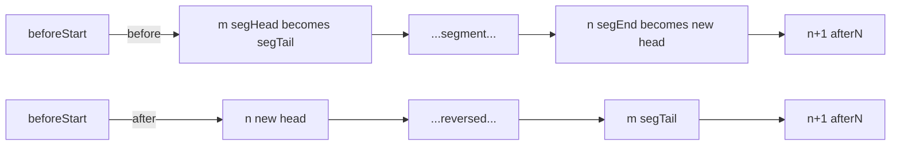
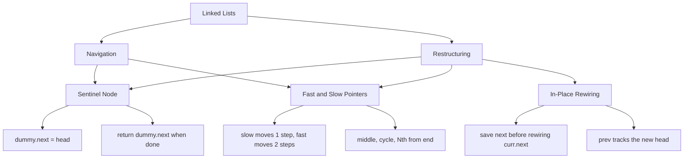
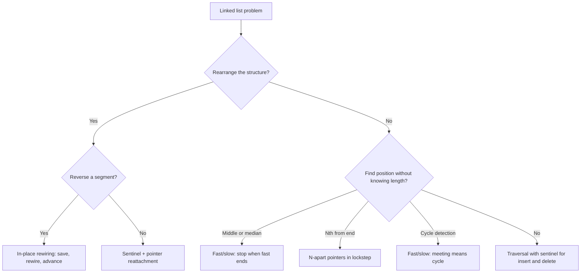

## 1. Overview

Linked lists are chains of nodes connected by pointers — each node holds a value and a reference to the next node in the sequence. Unlike arrays, there is no index-based access. To reach the fifth node you walk through nodes one, two, three, and four.

You already know how to think with pointers moving forward through a sequence from [Arrays & Strings](/fundamentals/arrays-strings). Linked lists use the same forward-scanning intuition, but instead of incrementing an index you follow `.next` — and instead of writing to a slot you rewire a pointer.

This guide covers the three building blocks: the **sentinel node** (eliminating head-special-case bugs), **fast and slow pointers** (finding midpoints and detecting cycles in a single pass), and **in-place pointer rewiring** (reversing and restructuring sections of a list without extra memory).

## 2. Core Concept & Mental Model

Picture a freight train winding through the countryside. Each car is a node: it holds cargo (the value) and has a single coupling at the back connecting it to the car ahead (the `.next` pointer). The locomotive at the front is the head. The last car has no forward coupling — its `.next` is null.

There is no way to jump to car seven directly. You board the locomotive and walk forward, car by car, until you reach the one you need.

### Understanding the Analogy

#### The Setup

You stand at the locomotive. You can read the cargo of the car you're in (`node.val`), and you can step to the next car by following the coupling (`node.next`). Your tasks are restructuring ones: reverse the order of the cars, detect if someone has accidentally coupled the last car back to an earlier one creating an endless loop, find the center car without knowing the length, or remove certain cars from the middle of the train. You must accomplish all of this without building a second train — no extra lists.

#### Three Techniques on the Train

**The sentinel car** is a dummy locomotive you attach at the very front before starting work — it has no real cargo but gives you a fixed anchor. With the sentinel in place, every real car has a predecessor, including the very first one. Insert and delete operations look identical regardless of which car you're touching. When you finish, unhook the sentinel and return `sentinel.next` as the new head of the train.

**The advance guard** is a pair of conductors. Both start at the locomotive at the same moment. The slow conductor moves one car per step. The fast conductor moves two. After k steps, slow is at position k and fast is at position 2k. When fast can no longer take a full two-car step (the train has ended), slow is at the midpoint. If the train loops — if a coupling somewhere at the back leads to an earlier car — fast will eventually lap slow and they'll occupy the same car.

**Save before cutting** is the discipline of in-place rewiring. A coupling is just a pointer. The moment you overwrite it with `curr.next = something_new`, the old destination is gone unless you saved it first. The atomic move for every reversal step is: save `next = curr.next`, then rewire `curr.next = prev`, then advance `prev = curr; curr = next`. Every reversal operation in this section is built from this single three-step move.

#### Why These Approaches

Linked lists have no random access, so positional information must come from _relative movement_ rather than index arithmetic. The advance guard extracts position — middle, Nth from end — from speed differences without needing a count. Rewiring pointers beats allocating new nodes because you work with the couplings that already exist. The sentinel eliminates the boundary condition where the head node has no predecessor.

### How I Think Through This

When I see a linked list problem, the first thing I ask is: _am I trying to find something in the list, or rearrange it?_

If **finding** — middle, Nth from end, cycle — I reach for fast and slow pointers. The two conductors start at the locomotive and the speed difference does the positioning work for me. If there's a cycle, they'll meet. If there isn't, fast falls off the end and slow is at the midpoint.

If **rearranging** — reversing, merging, rotating, reordering — I start by drawing the couplings I need to cut and rewire. I always set up a sentinel first so I have an anchor before the first real car. Then I identify what three things I need in hand at each step: `prev` (the car behind), `curr` (the car I'm operating on), and `next` (saved before I cut anything).

Take `1 → 2 → 3 → 4 → 5` — finding the middle using fast and slow conductors:

:::trace-ll
[
  {"nodes":[{"val":"1"},{"val":"2"},{"val":"3"},{"val":"4"},{"val":"5"}],"pointers":[{"index":0,"label":"slow","color":"blue"},{"index":0,"label":"fast","color":"orange"}],"action":null,"label":"Both slow and fast board at the locomotive, node(1)."},
  {"nodes":[{"val":"1"},{"val":"2"},{"val":"3"},{"val":"4"},{"val":"5"}],"pointers":[{"index":1,"label":"slow","color":"blue"},{"index":2,"label":"fast","color":"orange"}],"action":null,"label":"Slow moves 1 car → node(2). Fast moves 2 cars → node(3)."},
  {"nodes":[{"val":"1"},{"val":"2"},{"val":"3"},{"val":"4"},{"val":"5"}],"pointers":[{"index":2,"label":"slow","color":"blue"},{"index":4,"label":"fast","color":"orange"}],"action":null,"label":"Slow moves to node(3). Fast moves to node(5)."},
  {"nodes":[{"val":"1"},{"val":"2"},{"val":"3"},{"val":"4"},{"val":"5"}],"pointers":[{"index":2,"label":"slow","color":"blue"},{"index":5,"label":"fast","color":"orange"}],"action":"done","label":"fast cannot take another double step — it falls to null. slow is at node(3): the middle car. ✓"}
]
:::

---

## 3. Building Blocks — Progressive Learning

### Level 1: The Sentinel Node & Basic Traversal

**Why this level matters**

Before you can restructure a linked list, you need to be comfortable walking it and making clean insertions and deletions. The most common first bug is the "head special case" — handling the first node differently from every other node, which leads to duplicated code and subtle errors at the boundary. The sentinel node eliminates this asymmetry entirely. It is the single most useful linked list technique for writing correct, branch-free code on a first attempt.

**How to think about it**

Traversal is a while loop: start at `head`, follow `.next` until you reach `null`. At each step you read the current value, check a condition, and decide whether to cut this coupling, keep it, or skip past.

The sentinel pattern wraps that loop: allocate a dummy node and set `dummy.next = head`. Now run your operations with `prev = dummy` and `curr = head`. When you find a node to remove, `prev.next = curr.next` — no special check for "is this the head?" When you're done, `dummy.next` is the new head.

The key discipline for deletion: only advance `prev` when you _keep_ a node. If you remove a node and advance `prev`, the next deletion will have a broken predecessor reference.

**Walking through it**

Remove all cars carrying cargo `3` from the train `1 → 3 → 3 → 4 → 5`:

:::trace-ll
[
  {"nodes":[{"val":"D"},{"val":"1"},{"val":"3"},{"val":"3"},{"val":"4"},{"val":"5"}],"pointers":[{"index":0,"label":"prev","color":"green"},{"index":1,"label":"curr","color":"blue"}],"action":null,"label":"sentinel(D) → 1 → 3 → 3 → 4 → 5. prev=sentinel, curr=node(1). Target: remove all nodes with value 3."},
  {"nodes":[{"val":"D"},{"val":"1"},{"val":"3"},{"val":"3"},{"val":"4"},{"val":"5"}],"pointers":[{"index":1,"label":"prev","color":"green"},{"index":2,"label":"curr","color":"blue"}],"action":null,"label":"curr.val=1 ≠ 3 → keep. Advance both: prev=node(1), curr=node(3 first)."},
  {"nodes":[{"val":"D"},{"val":"1"},{"val":"3"},{"val":"3"},{"val":"4"},{"val":"5"}],"pointers":[{"index":1,"label":"prev","color":"green"},{"index":3,"label":"curr","color":"blue"}],"action":"rewire","label":"curr.val=3 → remove. prev.next = node(3 second). curr = node(3 second). prev stays at node(1)."},
  {"nodes":[{"val":"D"},{"val":"1"},{"val":"3"},{"val":"3"},{"val":"4"},{"val":"5"}],"pointers":[{"index":1,"label":"prev","color":"green"},{"index":4,"label":"curr","color":"blue"}],"action":"rewire","label":"curr.val=3 → remove. prev.next = node(4). curr = node(4). prev stays at node(1)."},
  {"nodes":[{"val":"D"},{"val":"1"},{"val":"3"},{"val":"3"},{"val":"4"},{"val":"5"}],"pointers":[{"index":4,"label":"prev","color":"green"},{"index":5,"label":"curr","color":"blue"}],"action":null,"label":"curr.val=4 ≠ 3 → keep. Advance both: prev=node(4), curr=node(5)."},
  {"nodes":[{"val":"D"},{"val":"1"},{"val":"3"},{"val":"3"},{"val":"4"},{"val":"5"}],"pointers":[{"index":5,"label":"prev","color":"green"},{"index":6,"label":"curr","color":"blue"}],"action":"done","label":"curr.val=5 ≠ 3 → keep. curr advances to null — done. Return dummy.next = node(1). Result: 1 → 4 → 5. ✓"}
]
:::

**The one thing to get right**

When you delete a node, do not advance `prev`. `prev` is the predecessor of the next candidate. If you move it after a deletion, the next removal will leave a broken coupling in the middle of the list. Advance `prev` only when you decide to keep `curr`.

:::stackblitz{step=1 total=3 exercises="step1-exercise1-problem.ts,step1-exercise2-problem.ts,step1-exercise3-problem.ts" solutions="step1-exercise1-solution.ts,step1-exercise2-solution.ts,step1-exercise3-solution.ts"}

> **Mental anchor**: The sentinel is the car before car one. With it, every real car has a predecessor — no head-special-case branches, ever.

**→ Bridge to Level 2**

Traversal with a sentinel handles insertion and deletion cleanly. But some problems need positional information — the middle, the Nth car from the end — without knowing how long the train is. A single pointer can't extract that information without counting first. Fast and slow pointers replace the need for a count.

---

### Level 2: Fast & Slow Pointers

**Why this level matters**

You cannot know the length of a linked list without a full traversal. Some problems need the middle node, the Nth node from the end, or whether a cycle exists — and they need the answer in a single pass with no extra memory. Fast and slow pointers (Floyd's technique) answer all three. Without it, you'd traverse once to count, then traverse again to position — double the work.

**How to think about it**

Two conductors board the locomotive together. Slow moves one car per step. Fast moves two. After every step, the gap between them grows by one.

**Middle:** when fast can no longer take a full two-car step, slow is at the midpoint. For an even-length train, slow lands on the second of the two middle cars.

**Nth from end:** advance fast exactly N steps alone, leaving slow at the locomotive. Then move both in lockstep. When fast falls off the end (hits null), slow is exactly N steps behind — at the Nth car from the end.

**Cycle:** if the train loops, fast will eventually lap slow. They'll occupy the same car. If there's no loop, fast falls off the end without ever meeting slow.

**Walking through it**

:::trace-ll
[
  {"nodes":[{"val":"1"},{"val":"2"},{"val":"3"},{"val":"4"},{"val":"5"}],"pointers":[{"index":0,"label":"trailer","color":"blue"},{"index":0,"label":"lead","color":"orange"}],"action":null,"label":"N=2. Both start at head. lead will advance N=2 steps alone."},
  {"nodes":[{"val":"1"},{"val":"2"},{"val":"3"},{"val":"4"},{"val":"5"}],"pointers":[{"index":0,"label":"trailer","color":"blue"},{"index":2,"label":"lead","color":"orange"}],"action":null,"label":"lead advanced 2 steps → node(3). trailer stays at node(1)."},
  {"nodes":[{"val":"1"},{"val":"2"},{"val":"3"},{"val":"4"},{"val":"5"}],"pointers":[{"index":1,"label":"trailer","color":"blue"},{"index":3,"label":"lead","color":"orange"}],"action":null,"label":"Both advance: lead → node(4), trailer → node(2)."},
  {"nodes":[{"val":"1"},{"val":"2"},{"val":"3"},{"val":"4"},{"val":"5"}],"pointers":[{"index":2,"label":"trailer","color":"blue"},{"index":4,"label":"lead","color":"orange"}],"action":null,"label":"Both advance: lead → node(5), trailer → node(3)."},
  {"nodes":[{"val":"1"},{"val":"2"},{"val":"3"},{"val":"4"},{"val":"5"}],"pointers":[{"index":3,"label":"trailer","color":"blue"},{"index":5,"label":"lead","color":"orange"}],"action":"done","label":"Both advance: lead → null, trailer → node(4). lead is null → stop. trailer is the 2nd car from the end. ✓"}
]
:::

**The one thing to get right**

The safe loop guard for fast/slow is `while (fast !== null && fast.next !== null)`. Without both conditions, accessing `fast.next.next` inside the loop will crash when `fast.next` is null — which happens on the step where fast reaches the last node of an odd-length list. Both null checks are required, every time.

:::stackblitz{step=2 total=3 exercises="step2-exercise1-problem.ts,step2-exercise2-problem.ts,step2-exercise3-problem.ts" solutions="step2-exercise1-solution.ts,step2-exercise2-solution.ts,step2-exercise3-solution.ts"}

> **Mental anchor**: Slow walks one car, fast walks two. When fast is done, slow is at the middle. If fast laps slow, the train loops.

**→ Bridge to Level 3**

Fast and slow pointers navigate the train without touching a single coupling. But the hardest linked list problems ask you to rewire the couplings — reversing a section and reattaching it to the rest. That requires the three-step reversal move: save, rewire, advance.

---

### Level 3: In-Place Pointer Rewiring

**Why this level matters**

Reversing all or part of a linked list is the core operation behind the majority of the reinforce problems in this section: reverse a list, reverse a sublist from position m to n, reorder a list by interleaving front and back halves. The underlying move is always the same three-step sequence. Once that sequence is in muscle memory, you can compose it to solve all of those problems without looking up a template.

**How to think about it**

To reverse the direction of a coupling, you need three cars in view simultaneously:

- `prev` — the car behind (null at the start, or the car just before the segment you're reversing).
- `curr` — the car you're operating on right now.
- `next` — the car ahead, which you **must save before you cut** the coupling.

The atomic move:
1. Save: `next = curr.next`.
2. Rewire: `curr.next = prev`.
3. Advance: `prev = curr; curr = next`.

Repeat until `curr` is null. At that point, `prev` is sitting on what was the last car — the new head of the reversed section.

For partial reversal (reverse from position m to n, 1-indexed), walk a sentinel to the node just before position m. Save that node as `beforeStart` and save the node at position m as `segTail` — it will become the tail of the reversed section and after reversal must point to the node that was at position n+1. Perform (n−m+1) reversal steps. Then reconnect: `beforeStart.next = prev` (new head of segment) and `segTail.next = curr` (first node after position n).

**Walking through it**

Reverse `1 → 2 → 3 → 4 → 5`:

:::trace-ll
[
  {"nodes":[{"val":"1"},{"val":"2"},{"val":"3"},{"val":"4"},{"val":"5"}],"pointers":[{"index":-1,"label":"prev","color":"green"},{"index":0,"label":"curr","color":"blue"}],"action":null,"label":"prev=null, curr=node(1). Save `next=node(2)`, rewire `1.next=null`."},
  {"nodes":[{"val":"1"},{"val":"2"},{"val":"3"},{"val":"4"},{"val":"5"}],"pointers":[{"index":0,"label":"prev","color":"green"},{"index":1,"label":"curr","color":"blue"}],"action":"rewire","label":"Rewired: `1.next=null`. Advance: prev=node(1), curr=node(2). Save `next=node(3)`, rewire `2.next=node(1)`."},
  {"nodes":[{"val":"1"},{"val":"2"},{"val":"3"},{"val":"4"},{"val":"5"}],"pointers":[{"index":1,"label":"prev","color":"green"},{"index":2,"label":"curr","color":"blue"}],"action":"rewire","label":"Rewired: `2.next=node(1)`. Advance: prev=node(2), curr=node(3). Save `next=node(4)`, rewire `3.next=node(2)`."},
  {"nodes":[{"val":"1"},{"val":"2"},{"val":"3"},{"val":"4"},{"val":"5"}],"pointers":[{"index":2,"label":"prev","color":"green"},{"index":3,"label":"curr","color":"blue"}],"action":"rewire","label":"Rewired: `3.next=node(2)`. Advance: prev=node(3), curr=node(4). Save `next=node(5)`, rewire `4.next=node(3)`."},
  {"nodes":[{"val":"1"},{"val":"2"},{"val":"3"},{"val":"4"},{"val":"5"}],"pointers":[{"index":3,"label":"prev","color":"green"},{"index":4,"label":"curr","color":"blue"}],"action":"rewire","label":"Rewired: `4.next=node(3)`. Advance: prev=node(4), curr=node(5). Save `next=null`, rewire `5.next=node(4)`."},
  {"nodes":[{"val":"1"},{"val":"2"},{"val":"3"},{"val":"4"},{"val":"5"}],"pointers":[{"index":4,"label":"prev","color":"green"},{"index":5,"label":"curr","color":"blue"}],"action":"done","label":"curr=null — done. prev=node(5) is the new head. Result: 5→4→3→2→1 ✓"}
]
:::

**The one thing to get right**

Save `next` _before_ `curr.next = prev`. The moment you execute `curr.next = prev`, the only forward pointer to the rest of the train is overwritten. If `next` was not saved, the rest of the list is unreachable and unrecoverable. The order is always: save, then rewire, then advance. No exceptions, no shortcuts.

:::stackblitz{step=3 total=3 exercises="step3-exercise1-problem.ts,step3-exercise2-problem.ts,step3-exercise3-problem.ts" solutions="step3-exercise1-solution.ts,step3-exercise2-solution.ts,step3-exercise3-solution.ts"}

> **Mental anchor**: Save the next coupling before you cut it. The order is always save → rewire → advance. One step out of order and you lose the rest of the train.

## 4. Key Patterns

### Pattern: Delete the Nth Car from the End

**When to use**: the problem gives you a list and a number N, and asks you to remove the Nth node from the tail without knowing the list length. Keywords: "remove Nth from end," "delete last N nodes."

**How to think about it**: Place two conductors at the sentinel (the dummy node before head). Advance the lead conductor N+1 steps alone — N to be N ahead of trailer, plus 1 extra so that when lead hits null, trailer is on the _predecessor_ of the Nth node from end, which is what you need to do `trailer.next = trailer.next.next`. Move both in lockstep until lead hits null.

The +1 is the key insight. Without it, trailer lands on the node to delete — but you need the node before it.

:::trace-ll
[
  {"nodes":[{"val":"D"},{"val":"1"},{"val":"2"},{"val":"3"},{"val":"4"},{"val":"5"}],"pointers":[{"index":0,"label":"trailer","color":"blue"},{"index":0,"label":"lead","color":"orange"}],"action":null,"label":"N=2. Both start at sentinel (D). lead will advance N+1=3 steps alone."},
  {"nodes":[{"val":"D"},{"val":"1"},{"val":"2"},{"val":"3"},{"val":"4"},{"val":"5"}],"pointers":[{"index":0,"label":"trailer","color":"blue"},{"index":3,"label":"lead","color":"orange"}],"action":null,"label":"lead advanced N+1=3 steps → node(3). trailer stays at sentinel."},
  {"nodes":[{"val":"D"},{"val":"1"},{"val":"2"},{"val":"3"},{"val":"4"},{"val":"5"}],"pointers":[{"index":1,"label":"trailer","color":"blue"},{"index":4,"label":"lead","color":"orange"}],"action":null,"label":"Both advance: lead → node(4), trailer → node(1)."},
  {"nodes":[{"val":"D"},{"val":"1"},{"val":"2"},{"val":"3"},{"val":"4"},{"val":"5"}],"pointers":[{"index":2,"label":"trailer","color":"blue"},{"index":5,"label":"lead","color":"orange"}],"action":null,"label":"Both advance: lead → node(5), trailer → node(2)."},
  {"nodes":[{"val":"D"},{"val":"1"},{"val":"2"},{"val":"3"},{"val":"4"},{"val":"5"}],"pointers":[{"index":2,"label":"trailer","color":"blue"},{"index":6,"label":"lead","color":"orange"}],"action":"done","label":"Both advance: lead → null, trailer → node(2). trailer.next is node(4) — the 2nd from end. Rewire: `trailer.next = trailer.next.next`. ✓"}
]
:::

**Complexity**: Time O(n), Space O(1)

### Pattern: In-Place Reversal of a Sublist

**When to use**: the problem asks you to reverse only a segment of the list — nodes from position m to n, or groups of k, or the second half. Keywords: "reverse between positions," "reverse in k-groups," "reorder list."

**How to think about it**: Walk to the node just before position m and save it as `beforeStart`. Save the node at position m as `segTail` — after reversal it becomes the tail and must point to the node at position n+1. Perform (n−m+1) reversal steps. Reconnect: `beforeStart.next = prev` and `segTail.next = curr`.

The critical pre-save: `segTail` must be captured before reversal begins, because the very first reversal step will overwrite `segTail.next`.

**Complexity**: Time O(n), Space O(1)

---

## 5. Decision Framework

### Concept Map

### Key Operations

| Operation | Time | Space | Notes |
|-----------|------|-------|-------|
| Traverse to position k | O(k) | O(1) | No index-based access |
| Find middle node | O(n) | O(1) | Fast/slow, single pass |
| Detect cycle | O(n) | O(1) | Floyd's algorithm |
| Find Nth from end | O(n) | O(1) | N-apart pointers, single pass |
| Reverse full list | O(n) | O(1) | Three-pointer technique |
| Reverse sublist of length k | O(k) | O(1) | Walk to start, then k reversal steps |
| Merge two sorted lists | O(n+m) | O(1) | Sentinel + compare heads |

### Decision Tree

### Recognition Signals

| Problem keywords | Technique |
|----------------|-----------|
| "reverse", "rotate", "reorder nodes" | In-place rewiring with prev/curr/next |
| "cycle", "loop", "does it loop" | Fast/slow pointers (Floyd's) |
| "middle node", "find the median" | Fast/slow pointers |
| "Nth from end", "remove last N" | N-apart pointers + sentinel |
| "merge", "delete by value", "insert" | Sentinel + prev/curr traversal |

**When NOT to use linked lists**: if your algorithm requires repeated random access by index — looking up position k more than once or twice — convert the list to an array first. The O(k) traversal cost compounds quickly when you need multiple random accesses, and an array gives O(1) access at O(n) upfront cost.

---

## 6. Common Gotchas & Edge Cases

**Rewiring before saving.**
`curr.next = prev` before `const next = curr.next`. The moment you overwrite `curr.next`, the rest of the train is gone with no recovery. Always: save first, rewire second.

**Advancing `prev` after a deletion.**
In the sentinel + delete pattern, `prev` is the predecessor of the next candidate. Advancing it after removing a node means the next removal will have a broken predecessor and leave an orphan. Advance `prev` only when keeping `curr`.

**Missing one of the two null guards on fast.**
`while (fast && fast.next)` — both are required. `fast.next.next` inside the loop assumes `fast.next` exists. On an odd-length list, fast lands on the last node; `fast.next` is null and `fast.next.next` will throw.

**Returning `dummy` instead of `dummy.next`.**
The sentinel holds junk cargo (typically 0). Returning it as the head of the result passes a garbage node to the caller. Always return `dummy.next`.

**N vs N+1 steps for delete-Nth-from-end.**
If you advance lead N steps (not N+1), trailer lands on the Nth node from end — the one to delete, not its predecessor. You cannot delete a node without its predecessor. The extra step is why it's N+1. Getting this wrong either deletes the wrong node or causes a null pointer error.

**Edge cases to always test**:
- Empty list (`null`)
- Single node (`1 → null`)
- Two-node list (`1 → 2 → null`)
- All nodes with the same value
- N equals the list length (remove the head — sentinel handles this cleanly)
- Cycle at the very last node (tail points to head)

**Debugging tips**: for reversal, print `(prev?.val ?? null, curr.val, curr.next?.val ?? null)` at each step. For fast/slow, print `(slow?.val, fast?.val)` each iteration. For sentinel operations, walk `dummy.next` after each mutation and print all values.
