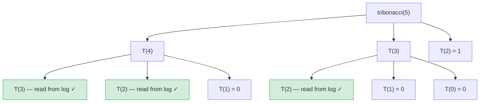
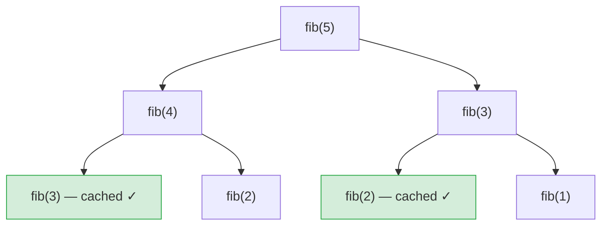
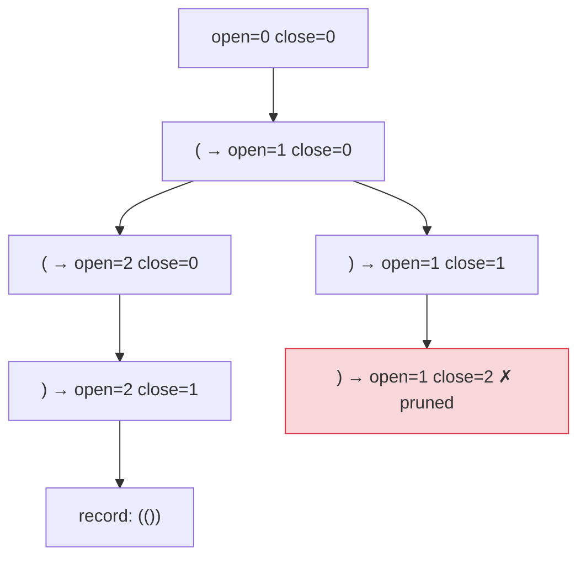
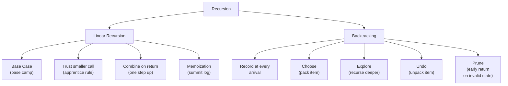
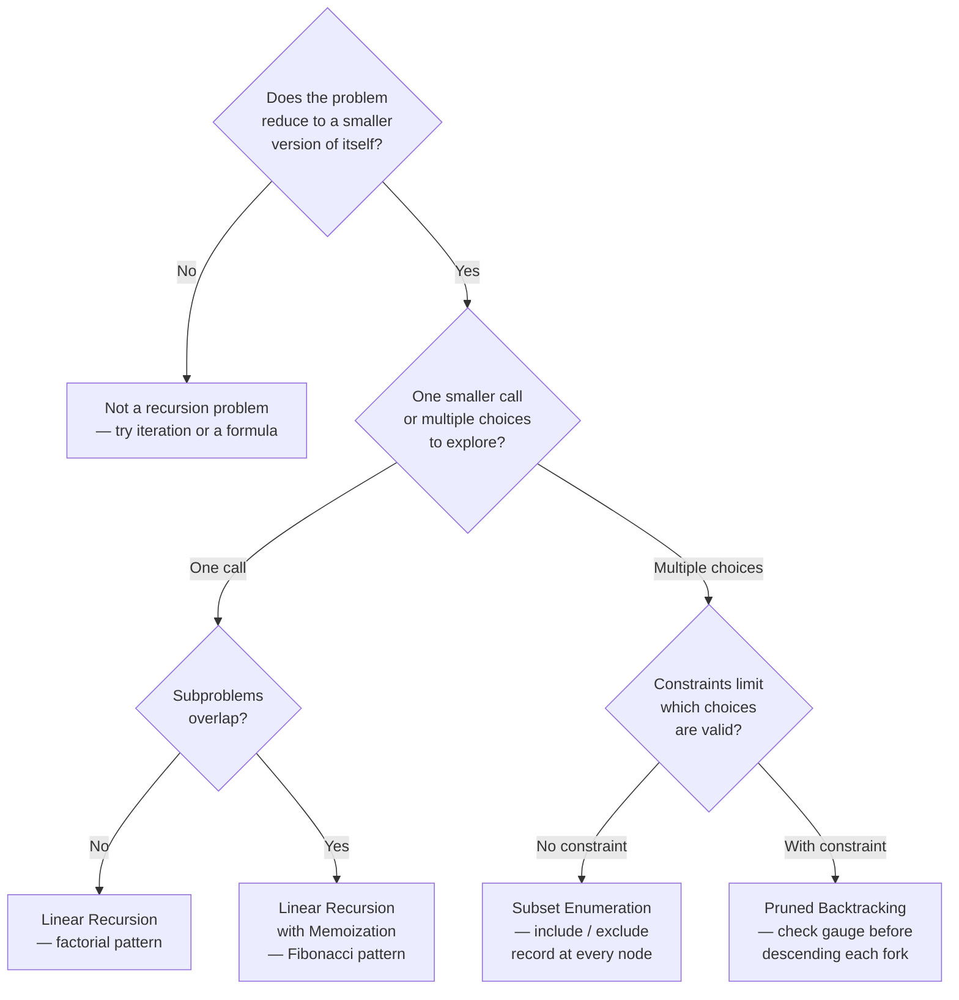

## 1. Overview

Recursion is the technique of solving a problem by having a function call itself on a strictly smaller version of the same problem. Backtracking extends that idea: at each decision point you make one choice, recurse into everything reachable from that choice, then undo it and try the next. Together they unlock a whole family of problems — combinatorial enumeration, constraint satisfaction, and tree-shaped computation — that feel intractable until you see the decision structure hiding inside them.

You already know how a loop processes a sequence one item at a time. Recursion does something different: it delegates the remaining work to itself and trusts that the answer will come back correct, focusing only on the single step that this level contributes. The three building-block levels here move from trusting linear recursion (factorial) through branching recursive calls and result caching (Fibonacci), to the full choose-explore-undo cycle that generates every valid subset.

## 2. Core Concept & Mental Model

A mountain guide follows one unbreakable rule: to summit any peak at height n, dispatch an apprentice to the peak just below — height n-1 — and wait for them to return. Once the apprentice reports back, the guide takes exactly one final step up. The guide never tries to solve the whole mountain at once. Base camp is the only exception: at height zero, the guide already knows the answer and returns immediately without calling anyone.

Backtracking adds a second move. When the trail forks, the guide dispatches a scout down the left path with an empty pack, lets the scout explore everything reachable from there (recording every waypoint), then calls the scout back to the exact same fork with their pack emptied, and sends them down the right path. "Emptied at the fork" is the critical phrase — without it, what the scout picked up on the left path would contaminate the right path.

### Understanding the Analogy

**The Setup** — The guide starts at the trailhead with one job: summit the peak at height n. Every call shares the same job description, just at a different height. The guide carries two things at any moment: the current height (which subproblem they're solving), and whatever the scout has packed so far (the current path being built). Base camp is height zero — the answer is known without any delegation.

**The Summit Rule** — For linear problems the rule is simple: delegate to n-1 and contribute one step on the way back. The guide does not multiply all the numbers by hand; they ask the apprentice for the product of everything below, then multiply once by their own height. This is the trust that makes recursion work — you assume the smaller call returns the right answer and you build on top of it. The combining step happens on the way back up, not on the way down.

**The Fork and the Return** — Backtracking activates when the trail splits at each item: go left (include this item in the pack) or go right (skip it). The guide goes left first — the scout packs the item, recurses deeper, records the pack contents at every waypoint, then returns to this fork. The pack is then emptied of that item before the scout goes right. This undo step is mandatory. The scout's pack is a shared object mutated throughout the entire descent; if you do not empty it at each fork, the left path's choices bleed into the right path.

**Why These Approaches** — Why delegate rather than compute from scratch? Because the problem strictly reduces. Factorial of n depends on factorial of n-1, which depends on n-2, and so on down to base camp. That strict reduction guarantees the recursion terminates. Why explore every fork? Because for enumeration problems — all subsets, all valid parentheses — no formula shortcut exists. Every possible choice must be visited at least once to be collected.

### How I Think Through This

When I see a problem that defines a value of size n in terms of the same value at a smaller size — "factorial", "nth Fibonacci", "power", "count paths" — I reach for linear recursion. Two questions settle it: what is base camp (the smallest n I can answer directly)? And what single step does the current call contribute after the apprentice returns?

When I see a problem asking for all valid combinations, subsets, or sequences, I reach for backtracking. The signal is "generate all" or "list every possible". I identify what constitutes one choice (include or skip this element, place a character, assign a value), what the valid range of choices is at each step, and what the stopping condition looks like. Then I write the same template every time: record the current pack, loop over remaining choices, pack one item, recurse, unpack.

Take `nums = [1, 2]`.

:::trace-subset
[
  {"nums":[1,2],"start":0,"basket":[],"action":"record","label":"Trailhead: pack is empty. Record [] as the first waypoint. Begin loop from item 0."},
  {"nums":[1,2],"start":0,"basket":[1],"action":"add","label":"Left fork at item 0: pack 1 → pack = [1]. Descend with start=1."},
  {"nums":[1,2],"start":1,"basket":[1],"action":"record","label":"Arrive at fork 1. Record [1]. Begin loop from item 1."},
  {"nums":[1,2],"start":1,"basket":[1,2],"action":"add","label":"Left fork at item 1: pack 2 → pack = [1,2]. Descend with start=2."},
  {"nums":[1,2],"start":2,"basket":[1,2],"action":"record","label":"start=2 equals nums.length. Record [1,2]. No items remain — return to fork."},
  {"nums":[1,2],"start":1,"basket":[1],"action":"remove","label":"Undo: unpack 2 → pack = [1]. Loop ends — return to the outer fork."},
  {"nums":[1,2],"start":0,"basket":[],"action":"remove","label":"Undo: unpack 1 → pack = []. Right fork: advance to item 1."},
  {"nums":[1,2],"start":1,"basket":[2],"action":"add","label":"Right fork: pack 2 → pack = [2]. Descend with start=2."},
  {"nums":[1,2],"start":2,"basket":[2],"action":"record","label":"start=2 equals nums.length. Record [2]. Return to fork."},
  {"nums":[1,2],"start":1,"basket":[],"action":"remove","label":"Undo: unpack 2 → pack = []. Loop ends — return."},
  {"nums":[1,2],"start":2,"basket":[],"action":"done","label":"All forks explored. Results: [[], [1], [1,2], [2]] — all 4 subsets collected. ✓"}
]
:::

---

## 3. Building Blocks — Progressive Learning

**Level 1: The Summit Rule**

**Why this level matters**

Every recursive function is built around one insight: the current call does not have to solve everything. It delegates the hard part to a smaller version of itself and contributes exactly one step when the result comes back. Without that delegation — if you try to do all the work inside a single call — you have a loop, not recursion. The Summit Rule is the act of trust: assume the apprentice returns the right answer, and focus only on the combining step.

**How to think about it**

The mountain guide receives a problem of size n. They ask: is this base camp? If yes, return the known answer immediately — no apprentice is needed. If not, dispatch an apprentice to solve the problem of size n-1 and wait. When the apprentice returns with their report, the guide takes one step up: adds n to the sum, multiplies by n, peels one digit off, or does whatever the problem requires. The guide never sees the full chain; they see only their own height and the single result returned from below.

The combining step happens on the way back up, not on the way down. When the guide calls the apprentice, they are committing to a pause. The entire call stack unwinds from the bottom (base camp) upward, with each level doing its one step as it wakes up.

**The one thing to get right**

Write the base case first. If the recursive call executes before the base case check, the function falls into infinite recursion — the apprentice is dispatched even when n is already at base camp, which dispatches another, and so on until the call stack overflows.

**Visualization**

The call-stack trace makes the Summit Rule concrete: every call pushes onto the stack while it is waiting, and each frame only does its one combining step after the smaller call returns.

:::trace-sq
[
  {
    "structures": [
      {"kind":"stack","label":"callStack","items":["sumRange(4)"],"color":"blue","activeIndices":[0],"pointers":[{"index":0,"label":"top"}]}
    ],
    "action":"push",
    "label":"sumRange(4): not base camp. Dispatch sumRange(3) and wait."
  },
  {
    "structures": [
      {"kind":"stack","label":"callStack","items":["sumRange(4)","sumRange(3)"],"color":"blue","activeIndices":[1],"pointers":[{"index":1,"label":"top"}]}
    ],
    "action":"push",
    "label":"sumRange(3): not base camp. Dispatch sumRange(2) and wait."
  },
  {
    "structures": [
      {"kind":"stack","label":"callStack","items":["sumRange(4)","sumRange(3)","sumRange(2)","sumRange(1)","sumRange(0)"],"color":"blue","activeIndices":[4],"pointers":[{"index":4,"label":"top"}]}
    ],
    "action":"push",
    "label":"Chain continues down to sumRange(0). Base camp — return 0 immediately."
  },
  {
    "structures": [
      {"kind":"stack","label":"callStack","items":["sumRange(4)","sumRange(3)","sumRange(2)","sumRange(1)"],"color":"blue","activeIndices":[3],"pointers":[{"index":3,"label":"top"}]}
    ],
    "action":"pop",
    "label":"sumRange(1) wakes up. Apprentice returned 0. One step: 1 + 0 = 1. Return 1."
  },
  {
    "structures": [
      {"kind":"stack","label":"callStack","items":["sumRange(4)","sumRange(3)","sumRange(2)"],"color":"blue","activeIndices":[2],"pointers":[{"index":2,"label":"top"}]}
    ],
    "action":"pop",
    "label":"sumRange(2) wakes up. Apprentice returned 1. One step: 2 + 1 = 3. Return 3."
  },
  {
    "structures": [
      {"kind":"stack","label":"callStack","items":["sumRange(4)","sumRange(3)"],"color":"blue","activeIndices":[1],"pointers":[{"index":1,"label":"top"}]}
    ],
    "action":"pop",
    "label":"sumRange(3) wakes up. Apprentice returned 3. One step: 3 + 3 = 6. Return 6."
  },
  {
    "structures": [
      {"kind":"stack","label":"callStack","items":["sumRange(4)"],"color":"blue","activeIndices":[0],"pointers":[{"index":0,"label":"top"}]}
    ],
    "action":"pop",
    "label":"sumRange(4) wakes up. Apprentice returned 6. One step: 4 + 6 = 10. Return 10."
  },
  {
    "structures": [
      {"kind":"stack","label":"callStack","items":[],"color":"blue"}
    ],
    "action":"done",
    "label":"Stack empty. Final answer: 10 ✓"
  }
]
:::

:::stackblitz{step=1 total=3 exercises="step1-exercise1-problem.ts,step1-exercise2-problem.ts,step1-exercise3-problem.ts" solutions="step1-exercise1-solution.ts,step1-exercise2-solution.ts,step1-exercise3-solution.ts"}

> "Base camp first. Combine on the way back up."

**→ Bridge to Level 2**

The Summit Rule works when each call makes exactly one recursive call. Fibonacci needs two — T(n) depends on both T(n-1) and T(n-2). With two branches, the call tree fans out, and T(n-2) gets recomputed every time T(n-1) needs it. Without a summit log that caches each sub-peak's result, the guide sends a new apprentice to the same height repeatedly, making the total work grow exponentially.

**Level 2: Branching Peaks**

**Why this level matters**

Some problems cannot reduce to a single smaller call. Fibonacci depends on two previous values; tribonacci on three. Each additional branch doubles or triples the work because sub-peaks overlap: T(5) needs T(4) and T(3), but T(4) also needs T(3). Without caching, the same peak is summited from scratch dozens, then thousands of times. Memoization installs a summit log at each peak — the first apprentice to return writes the result; every subsequent guide dispatched there just reads from the log.

**How to think about it**

Imagine tribonacci as three apprentices dispatched per step. The guide at peak n sends one to n-1, one to n-2, and one to n-3. Without the summit log, the guide at n-1 also sends three apprentices — one of them to n-2, which has already been dispatched by the guide at n. Two separate climbing teams are now racing up the same sub-peak simultaneously, doing the same work. At scale, this duplication becomes catastrophic.

The summit log is a shared notebook. Before any guide dispatches an apprentice, they check the notebook: "Has peak k been summited before?" If yes, they copy the result out of the notebook rather than sending anyone. If no, they send the apprentice, wait, then write the result in the notebook before returning upward. Every peak is climbed at most once — the total number of unique summits is the only work that gets done.

**Visualization**

Take `tribonacciMemo(5)`.

The trace shows the key shift: once a sub-peak is solved, later branches stop climbing and just read the saved result.

:::trace-sq
[
  {
    "structures": [
      { "kind": "stack", "label": "callStack", "items": ["T(5)"], "color": "blue", "activeIndices": [0], "pointers": [{ "index": 0, "label": "top" }] },
      { "kind": "queue", "label": "summit log", "items": [], "color": "green" }
    ],
    "action": "push",
    "label": "Start at T(5). The summit log is empty, so the climb must begin from scratch."
  },
  {
    "structures": [
      { "kind": "stack", "label": "callStack", "items": ["T(5)", "T(4)", "T(3)"], "color": "blue", "activeIndices": [2], "pointers": [{ "index": 2, "label": "top" }] },
      { "kind": "queue", "label": "summit log", "items": [], "color": "green" }
    ],
    "action": "push",
    "label": "The first branch keeps descending until a smaller sub-peak like T(3) is reached and solved."
  },
  {
    "structures": [
      { "kind": "stack", "label": "callStack", "items": ["T(5)", "T(4)"], "color": "blue", "activeIndices": [1], "pointers": [{ "index": 1, "label": "top" }] },
      { "kind": "queue", "label": "summit log", "items": ["T(3)=1"], "color": "green", "activeIndices": [0], "pointers": [{ "index": 0, "label": "saved" }] }
    ],
    "action": "pop",
    "label": "T(3) finishes and writes its answer into the summit log before returning upward."
  },
  {
    "structures": [
      { "kind": "stack", "label": "callStack", "items": ["T(5)", "T(4)"], "color": "blue", "activeIndices": [1], "pointers": [{ "index": 1, "label": "top" }] },
      { "kind": "queue", "label": "summit log", "items": ["T(3)=1", "T(2)=1"], "color": "green", "activeIndices": [0, 1], "pointers": [{ "index": 1, "label": "saved" }] }
    ],
    "action": "peek",
    "label": "Now T(4) needs T(3) and T(2), but both answers are already saved. No second climb is needed."
  },
  {
    "structures": [
      { "kind": "stack", "label": "callStack", "items": ["T(5)"], "color": "blue", "activeIndices": [0], "pointers": [{ "index": 0, "label": "top" }] },
      { "kind": "queue", "label": "summit log", "items": ["T(3)=1", "T(2)=1", "T(4)=2"], "color": "green", "activeIndices": [2], "pointers": [{ "index": 2, "label": "saved" }] }
    ],
    "action": "pop",
    "label": "T(4) resolves once, records T(4)=2, and returns to the original call."
  },
  {
    "structures": [
      { "kind": "stack", "label": "callStack", "items": [], "color": "blue" },
      { "kind": "queue", "label": "summit log", "items": ["T(3)=1", "T(2)=1", "T(4)=2", "T(5)=4"], "color": "green", "activeIndices": [3], "pointers": [{ "index": 3, "label": "saved" }] }
    ],
    "action": "done",
    "label": "T(5) combines saved answers and finishes. Each sub-peak was solved once, then reused from the log."
  }
]
:::

**The one thing to get right**

Pass the memo object into every recursive call — or close over it. If the memo is created fresh on each call (`= new Map()` in the default parameter without threading it through), it resets to empty on every recursion and caches nothing. The same summit log must be visible to every guide on the mountain.

The recursion tree below shows the same overlap structurally: repeated sub-peaks are exactly the work the summit log removes.

:::stackblitz{step=2 total=3 exercises="step2-exercise1-problem.ts,step2-exercise2-problem.ts,step2-exercise3-problem.ts" solutions="step2-exercise1-solution.ts,step2-exercise2-solution.ts,step2-exercise3-solution.ts"}

> "Check the summit log before dispatching anyone. Write to it before returning."

**→ Bridge to Level 3**

Both linear and branching recursion compute one answer and return it. When a problem asks for every valid combination — all subsets, all binary strings, all size-k groups — there is no single number to return. Every fork in the trail leads to a different outcome, and every outcome must be collected. That requires a different structure: instead of the apprentice returning a value, the scout carries a pack, explores every path, and records what is in the pack at the right moments.

**Level 3: The Fork and Return**

**Why this level matters**

Backtracking solves a class of problems that recursion alone cannot: generating all valid outcomes rather than one. The pattern is always the same — pack one item, explore everything that follows, unpack — but what you record and when you return early varies by problem. Once you see the template, you can adapt it to any combinatorial enumeration problem.

**How to think about it**

The scout starts at the trailhead with an empty pack. At each item, the trail forks: go left (pack the item and continue) or go right (skip the item and continue). The scout goes left first. They pack the item, recurse deeper, and when they return to this fork, they unpack it exactly as it was. Then they go right. "Exactly as it was" is the guarantee the pop provides — without it, the pack at the right fork contains leftovers from the left fork.

Two variations change what gets recorded:

- **Record at every arrival** (subsets pattern): every time the scout arrives anywhere on the trail, the pack contents are a valid result. Record immediately, then continue exploring.
- **Record only at a matching condition** (filtered pattern): the scout only records when the pack satisfies a rule — sum equals target, size equals k, string is complete. Keep exploring without recording otherwise.

Both use the same push-recurse-pop template. Only the record step changes.

**Visualization**

Take `subsets([1,2,3])`.

The trace makes the choose-explore-undo cycle visible: every push creates a deeper branch, every arrival records the current pack, and every pop restores the exact state before the next fork begins.

**The one thing to get right**

Push before the recursive call, pop immediately after — always paired, never separated by a conditional. `pack` is the same array object for the entire descent. Every push must be undone before the loop advances, or the next fork inherits a contaminated pack.

:::trace-subset
[
  {"nums":[1,2,3],"start":0,"basket":[],"action":"record","label":"Trailhead: pack=[], record []. Loop from item 0."},
  {"nums":[1,2,3],"start":0,"basket":[1],"action":"add","label":"Pack item 0 (1) → pack=[1]. Descend with start=1."},
  {"nums":[1,2,3],"start":1,"basket":[1],"action":"record","label":"Arrive: record [1]. Loop from item 1."},
  {"nums":[1,2,3],"start":1,"basket":[1,2],"action":"add","label":"Pack item 1 (2) → pack=[1,2]. Descend with start=2."},
  {"nums":[1,2,3],"start":2,"basket":[1,2],"action":"record","label":"Arrive: record [1,2]. Loop from item 2."},
  {"nums":[1,2,3],"start":2,"basket":[1,2,3],"action":"add","label":"Pack item 2 (3) → pack=[1,2,3]. Descend with start=3."},
  {"nums":[1,2,3],"start":3,"basket":[1,2,3],"action":"record","label":"start=3=nums.length. Record [1,2,3]. Return."},
  {"nums":[1,2,3],"start":2,"basket":[1,2],"action":"remove","label":"Undo: unpack 3 → pack=[1,2]. Loop ends — return."},
  {"nums":[1,2,3],"start":1,"basket":[1],"action":"remove","label":"Undo: unpack 2 → pack=[1]. Advance to item 2."},
  {"nums":[1,2,3],"start":2,"basket":[1,3],"action":"add","label":"Pack item 2 (3) → pack=[1,3]. Descend with start=3."},
  {"nums":[1,2,3],"start":3,"basket":[1,3],"action":"record","label":"Record [1,3]. Return."},
  {"nums":[1,2,3],"start":2,"basket":[1],"action":"remove","label":"Undo: unpack 3 → pack=[1]. Return."},
  {"nums":[1,2,3],"start":0,"basket":[],"action":"remove","label":"Undo: unpack 1 → pack=[]. Advance to item 1."},
  {"nums":[1,2,3],"start":1,"basket":[2],"action":"add","label":"Pack item 1 (2) → pack=[2]. Descend."},
  {"nums":[1,2,3],"start":2,"basket":[2],"action":"record","label":"Record [2]. Loop from item 2."},
  {"nums":[1,2,3],"start":2,"basket":[2,3],"action":"add","label":"Pack item 2 (3) → pack=[2,3]. Descend."},
  {"nums":[1,2,3],"start":3,"basket":[2,3],"action":"record","label":"Record [2,3]. Return."},
  {"nums":[1,2,3],"start":2,"basket":[2],"action":"remove","label":"Undo: unpack 3 → pack=[2]."},
  {"nums":[1,2,3],"start":1,"basket":[],"action":"remove","label":"Undo: unpack 2 → pack=[]. Advance to item 2."},
  {"nums":[1,2,3],"start":2,"basket":[3],"action":"add","label":"Pack item 2 (3) → pack=[3]. Descend."},
  {"nums":[1,2,3],"start":3,"basket":[3],"action":"record","label":"Record [3]. Return."},
  {"nums":[1,2,3],"start":2,"basket":[],"action":"remove","label":"Undo: unpack 3 → pack=[]. Return."},
  {"nums":[1,2,3],"start":3,"basket":[],"action":"done","label":"All forks explored. Results: [[], [1], [1,2], [1,2,3], [1,3], [2], [2,3], [3]] ✓"}
]
:::

:::stackblitz{step=3 total=3 exercises="step3-exercise1-problem.ts,step3-exercise2-problem.ts,step3-exercise3-problem.ts" solutions="step3-exercise1-solution.ts,step3-exercise2-solution.ts,step3-exercise3-solution.ts"}

> "Push before recurse, pop after — always paired. Snapshot the pack, never push the live reference."

## 4. Key Patterns

**Pattern: Overlapping Subproblems and Memoization**

**When to use**: the recursive call tree branches into two or more sub-calls, and the same sub-peak appears at multiple places in the tree. Classic signals: Fibonacci, counting paths on a grid, coin change.

**How to think about it**: Fibonacci(5) requires the guide to summit peak 4 and peak 3 — but peak 3 is also required by peak 4. Without a memo, the guide sends a new apprentice to peak 3 twice, causing exponential growth in total work. Memoization installs a summit log at each peak: the first apprentice to return writes their result in the log; every subsequent guide dispatched to that height just reads from the log instead of climbing again. The summit log converts the duplicated tree into a linear chain of unique climbs.

**Complexity**: Time O(n) with memo (each peak climbed once), O(2ⁿ) without. Space O(n) for the summit log plus the call stack.

**Pattern: Pruned Backtracking with Constraints**

**When to use**: you are generating all valid sequences, but not all forks are legal — some paths can be ruled out before they are fully explored. Signals: "valid", "balanced", "at most k of", or any rule that limits which choices are allowed at each step.

**How to think about it**: Generating valid parentheses (n pairs) uses the same choose-explore-undo template as subsets, but the guide checks two gauges before going down any fork: the count of open parentheses placed so far, and the count of close parentheses. A fork is valid only if open < n (you can still place more opens) or close < open (you can close without breaking balance). When either gauge is out of range, the guide turns back immediately without descending — that is the prune. Pruning is just an early return at the top of the recursive call, before the loop runs. Without it, the guide would explore every possible character sequence and filter at the end, which is far slower.

**Complexity**: Time O(4ⁿ / √n) — the Catalan number, which counts valid sequences of n pairs. Space O(n) for the call stack depth.

---

## 5. Decision Framework

**Concept Map**

**Complexity Reference**

| Algorithm | Time | Space (stack) |
|---|---|---|
| Linear recursion — factorial | O(n) | O(n) |
| Branching recursion — Fibonacci (no memo) | O(2ⁿ) | O(n) |
| Branching recursion — Fibonacci (memo) | O(n) | O(n) |
| Backtracking — subsets of n items | O(n × 2ⁿ) | O(n) |
| Pruned backtracking — generate parentheses (n pairs) | O(4ⁿ / √n) | O(n) |

**Decision Tree**

**Recognition Signals**

| Problem signal | Technique |
|---|---|
| "nth factorial", "nth power" | Linear recursion |
| "nth Fibonacci", "count paths" | Branching recursion with memoization |
| "all subsets", "power set" | Subset enumeration |
| "all valid X" with a balancing rule | Pruned backtracking |
| "generate all combinations/permutations" | Backtracking with or without pruning |
| Problem defined explicitly as f(n) = f(n-1) + something | Linear or branching recursion |

**When NOT to Use**

If you need only one answer — not all of them — backtracking is the wrong tool. BFS finds the shortest path; greedy makes the locally optimal pick; binary search finds a single target. Reserve recursion and backtracking for problems where the full set of outcomes must be collected, or where the problem structure is inherently self-similar with no iterative shortcut.

## 6. Common Gotchas & Edge Cases

**Missing or wrong base case**

What goes wrong: the function calls itself forever and hits a stack overflow. Why tempting: it feels like the recursion will "naturally stop" when n gets small — but without an explicit check, the guide keeps dispatching apprentices past zero, then to negative n, indefinitely. How to fix: always identify base camp first. Ask "what is the smallest input I can answer directly, without calling myself?" and write that return before anything else.

**Combining step on the way down instead of the way back up**

What goes wrong: the combining step runs before the recursive call returns, so you're combining n with a value you haven't computed yet — typically undefined or 0. Why tempting: if the code reads "multiply n by n-1", it's natural to write `n * factorial(n-1)` as a single expression. That expression is correct — JavaScript evaluates right-to-left and waits for the call — but writing the multiply before the call in an if-branch structure causes it to run before the result exists. How to fix: always write `const sub = recursiveCall(...); return n * sub;` mentally, even if you compress it to one line.

**Forgetting to pop after the recursive call in backtracking**

What goes wrong: the pack carries items from the left fork into the right fork. The results contain subsets with extra elements — each reported result is longer than expected. Why tempting: the pop feels redundant after recursion "cleans up". But recursion does not reset the pack. The pack is shared across every call in the descent. How to fix: push and pop are a matched pair, always adjacent around the recursive call. Never separate them with a conditional.

**Pushing the live pack instead of a snapshot**

What goes wrong: all entries in the results array end up as the same empty array by the time the traversal finishes. Why tempting: `results.push(pack)` looks correct — you're pushing what's currently in the pack. But you're pushing the reference, not a copy. Every subsequent mutation of pack mutates what's already in results. How to fix: always spread when recording: `results.push([...pack])`.

**Calling backtrack(i) instead of backtrack(i+1)**

What goes wrong: the same item is packed repeatedly with no progress, causing an immediate stack overflow. Why tempting: it's easy to forget that the next recursive call must advance past the current item. How to fix: after packing `nums[i]`, always recurse with `i + 1` so the scout moves forward. Never re-examine the current index.

**Edge cases to handle explicitly**

- n=0 for linear recursion: always needs its own base case — zero is not always "nothing" (0! = 1, not 0)
- Empty array for backtracking: should return `[[]]` if recording at every arrival, because the empty pack is always a valid state
- k=0 for combinationsOfSize: there is exactly one combination of size 0 — the empty combination
- target=0 for collectSumK: the empty subset always sums to 0 and should be included

**Debugging tips**

For linear recursion: log the value of n at the top of the function to confirm the chain is heading toward base camp. If you see n going negative, the base case condition is wrong. For backtracking: log pack at every record step to see exactly what is being collected. If results all contain the same reference (all empty), you forgot to spread. If results contain items from the wrong branch, you forgot to pop.
