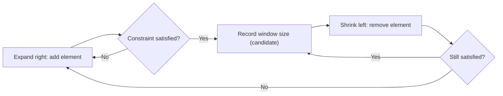
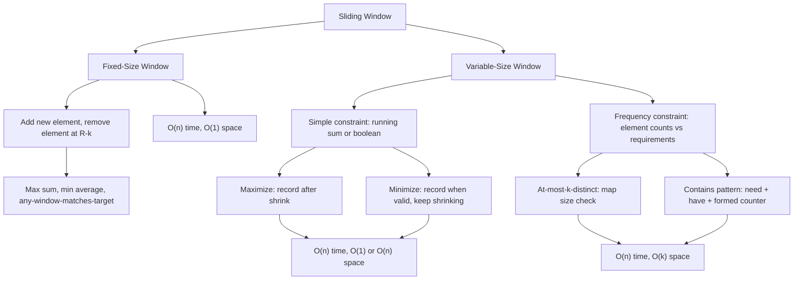
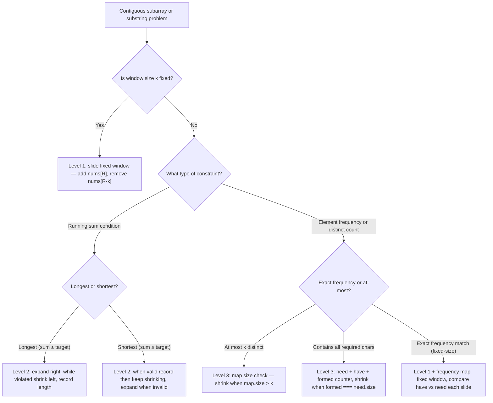

## 1. Overview

Sliding window is the pattern for problems about the best, longest, or shortest contiguous subarray or substring. Rather than testing every possible subarray — O(n²) — you maintain a window of elements and adjust it with two pointers that only move forward. Each element enters and exits the window at most once, making the whole scan O(n).

From Two Pointers, you already know how to move left and right pointers through an array. Sliding window adds one new idea: both pointers move in the same direction. The right pointer expands the window to explore new territory; the left pointer shrinks it when the window violates a constraint.

The three building-block levels cover fixed-size windows (size k given, just slide and compute), variable windows with a simple running constraint (expand until invalid, shrink until valid), and variable windows that track element frequencies with a hash map — the tool behind minimum-window and permutation problems.

## 2. Core Concept & Mental Model

### The Adjustable Magnifying Glass

Picture a historian scanning a long manuscript for the best passage to quote. She uses an adjustable magnifying glass — a frame that can expand to include more text on the right, or contract by releasing text from the left.

- The **manuscript** is your array or string.
- The **frame** is the window, defined by a left edge and a right edge.
- The **constraint** is the rule that determines when a passage is invalid — too many repeated words, total length exceeds a budget, sum surpasses a threshold.
- The **goal** is to find the best (longest, shortest, highest-sum) passage that satisfies the constraint.

The historian never resets to the beginning. Both edges only move forward. Every character enters the frame once when the right edge passes it, and exits once when the left edge passes it.

### Understanding the Analogy

#### The Setup

The historian starts with both edges at the left margin. She expands the right edge to include the next character — making the passage one word longer. If the passage now violates the constraint, she slides the left edge rightward, releasing characters one at a time, until the passage is valid again. At each step she checks whether the current passage is the best she has found so far.

#### Expand and Shrink

When the right edge moves right, the window grows — a new element enters. When the left edge moves right, the window shrinks — the leftmost element leaves. The window's running state can be tracked with a single number (for sum-based constraints) or a hash map (for frequency-based constraints).

The key insight: you never need to move the left edge past the right edge. Once left catches up to right, the window has zero elements and is trivially valid. Every element has been examined exactly once by each pointer — two passes total, not n².

#### Why These Approaches

A brute-force approach fixes a start index and extends an end index: two nested loops, O(n²) total subarray checks. The sliding window eliminates this by noticing that if a window starting at index L is invalid, there is no reason to test all longer windows starting at L — just advance L and continue. Both pointers travel left to right, never backtracking. Total steps: each pointer moves at most n times, so the entire scan is O(n).

### How I Think Through This

When I see a problem asking for the longest, shortest, or best contiguous subarray (or substring), the first question I ask is: **what is the constraint that defines a valid window?**

If the constraint is a running sum — "sum ≤ budget", "sum ≥ target" — I track a single number. If it involves character or element frequencies — "at most k distinct characters", "window contains all letters of pattern" — I use a hash map.

Next I ask: **is the window size fixed or variable?** Fixed size means the left pointer always trails the right pointer by exactly k — one add, one remove per step. Variable size means the left pointer advances only when the constraint is violated.

Take `"abcabc"` with the constraint "no repeating characters."

:::trace-lr
[
  {"chars":["a","b","c","a","b","c"],"L":0,"R":0,"action":null,"label":"Right edge includes 'a'. Window: {a}. No repeat. Length = 1."},
  {"chars":["a","b","c","a","b","c"],"L":0,"R":1,"action":null,"label":"Right edge includes 'b'. Window: {a,b}. No repeat. Length = 2."},
  {"chars":["a","b","c","a","b","c"],"L":0,"R":2,"action":null,"label":"Right edge includes 'c'. Window: {a,b,c}. No repeat. Length = 3. Max = 3."},
  {"chars":["a","b","c","a","b","c"],"L":0,"R":3,"action":"mismatch","label":"Right edge includes 'a'. Repeat! Shrink: left releases 'a'."},
  {"chars":["a","b","c","a","b","c"],"L":1,"R":3,"action":null,"label":"Window: {b,c,a}. Valid. Length = 3. Max stays 3."},
  {"chars":["a","b","c","a","b","c"],"L":1,"R":4,"action":"mismatch","label":"Right edge includes 'b'. Repeat! Shrink: left releases 'b'."},
  {"chars":["a","b","c","a","b","c"],"L":2,"R":4,"action":"done","label":"Window: {c,a,b}. Valid. Length = 3. Scan completes. Longest = 3."}
]
:::

---

## 3. Building Blocks — Progressive Learning

### Level 1: Fixed-Size Window

#### Why this level matters

The simplest sliding window fixes the frame size. When the problem says "find the best subarray of exactly k elements," both pointers move in lockstep — the right pointer advances one step, and the left pointer trails by exactly k. Instead of recomputing the window sum from scratch each step (O(k) per step, O(n × k) total), you add the incoming element and remove the outgoing element: one addition and one subtraction per step, O(n) total.

#### How to think about it

Build the initial window manually: compute the answer for elements 0 through k−1. Then slide: advance the right pointer to include the next element, remove the element at `right − k` (the one that just fell off the left side), and update your running answer. The outgoing element's index is always `right − k`, not left − 1 — trust that arithmetic over a separately maintained left pointer.

Two common goals: maximize (keep a `maxSoFar`) and minimize (keep a `minSoFar`). Both update the running answer after every slide.

#### Walking through it

Array `[2, 1, 5, 1, 3, 2]`, find max sum of window size k = 3.

:::trace-lr
[
  {"chars":["2","1","5","1","3","2"],"L":0,"R":2,"action":null,"label":"First window [0..2]: sum = 2+1+5 = 8. Record max = 8."},
  {"chars":["2","1","5","1","3","2"],"L":1,"R":3,"action":null,"label":"Slide: add nums[3]=1, remove nums[3-3]=nums[0]=2. Sum = 8+1−2 = 7. Max stays 8."},
  {"chars":["2","1","5","1","3","2"],"L":2,"R":4,"action":null,"label":"Slide: add nums[4]=3, remove nums[4-3]=nums[1]=1. Sum = 7+3−1 = 9. Max = 9."},
  {"chars":["2","1","5","1","3","2"],"L":3,"R":5,"action":"done","label":"Slide: add nums[5]=2, remove nums[5-3]=nums[2]=5. Sum = 9+2−5 = 6. Max stays 9 ✓"}
]
:::

#### The one thing to get right

The outgoing element when the right pointer lands on index `R` is `nums[R − k]`. Off-by-one here causes you to remove the wrong element, and the running sum silently drifts across every subsequent slide. Trace the first two steps manually on paper before trusting your implementation.

:::stackblitz{step=1 total=3 exercises="step1-exercise1-problem.ts,step1-exercise2-problem.ts,step1-exercise3-problem.ts" solutions="step1-exercise1-solution.ts,step1-exercise2-solution.ts,step1-exercise3-solution.ts"}

> **Mental anchor**: "Fixed frame = add one, remove one. The outgoing element is always k steps behind the incoming one: `nums[R − k]`."

**→ Bridge to Level 2**: A fixed-size window only works when the problem specifies the exact frame size. When the frame must grow until it becomes invalid and shrink until it becomes valid again, you need a variable window — and a condition that tells the left edge when to move.

### Level 2: Variable Window — Expand and Shrink

#### Why this level matters

Most sliding window problems do not give you a fixed size. Instead, they give you a constraint: "sum ≤ budget", "no repeating characters", "all values below threshold". The window must expand to explore and shrink when the constraint breaks. The fixed-window technique cannot handle this because the left edge does not trail by a fixed offset — it advances only when the window becomes invalid.

#### How to think about it

The pattern: expand the right pointer unconditionally (always add the new element to the running state). Then, while the window violates the constraint, advance the left pointer (remove the outgoing element, update state). After shrinking until the window is valid, record the current window as a candidate for the answer.

Two variations: **maximize** records the window length after each expand-then-shrink cycle; **minimize** records the window length each time it becomes valid, then keeps shrinking to see if a smaller valid window exists.

#### Walking through it

Array `[3, 1, 2, 5, 1, 1]`, find the longest subarray with sum ≤ 7.

:::trace-lr
[
  {"chars":["3","1","2","5","1","1"],"L":0,"R":0,"action":null,"label":"Add 3. Sum = 3 ≤ 7. Valid. Length = 1."},
  {"chars":["3","1","2","5","1","1"],"L":0,"R":1,"action":null,"label":"Add 1. Sum = 4 ≤ 7. Valid. Length = 2."},
  {"chars":["3","1","2","5","1","1"],"L":0,"R":2,"action":null,"label":"Add 2. Sum = 6 ≤ 7. Valid. Length = 3. Max = 3."},
  {"chars":["3","1","2","5","1","1"],"L":0,"R":3,"action":"mismatch","label":"Add 5. Sum = 11 > 7. Constraint violated — enter shrink loop."},
  {"chars":["3","1","2","5","1","1"],"L":1,"R":3,"action":"mismatch","label":"Remove 3. Sum = 8 > 7. Still violated — shrink again."},
  {"chars":["3","1","2","5","1","1"],"L":2,"R":3,"action":null,"label":"Remove 1. Sum = 7 ≤ 7. Valid. Length = 2. Max stays 3."},
  {"chars":["3","1","2","5","1","1"],"L":2,"R":4,"action":"mismatch","label":"Add 1. Sum = 8 > 7. Shrink: remove 2. Sum = 6 ≤ 7. Valid. Length = 2."},
  {"chars":["3","1","2","5","1","1"],"L":3,"R":5,"action":"done","label":"Add 1. Sum = 7 ≤ 7. Valid. Length = 3. Max = 3 ✓ (first achieved at [0..2])"}
]
:::

#### The one thing to get right

The shrink step is a `while` loop, not an `if`. After removing one element from the left, the window may still violate the constraint — keep shrinking until it is valid. Stopping after a single shrink step causes you to record invalid windows as candidates, producing answers that are too large.

:::stackblitz{step=2 total=3 exercises="step2-exercise1-problem.ts,step2-exercise2-problem.ts,step2-exercise3-problem.ts" solutions="step2-exercise1-solution.ts,step2-exercise2-solution.ts,step2-exercise3-solution.ts"}

> **Mental anchor**: "Expand unconditionally. Shrink with a while-loop until valid. Record after shrinking."

**→ Bridge to Level 3**: Sum and boolean constraints are easy to track with a single number. Frequency constraints — "the window must contain all characters of a pattern", "at most k distinct characters" — require counting each distinct element inside the window. That means a hash map, and a way to know when "enough" characters have been collected.

### Level 3: Variable Window with Frequency Map

#### Why this level matters

Some constraints cannot be expressed as a running sum. Permutation problems ask: "does the window contain exactly the same character frequencies as the pattern?" Minimum-window problems ask: "does the window contain at least one of each required character?" Both require tracking counts inside the window and comparing those counts against a requirement — a hash map for `have` (what the window currently contains) and a second map for `need` (what is required).

#### How to think about it

Track a counter `formed` — the number of distinct characters whose count in the window exactly meets (or exceeds) the required count. When `formed === need.size`, the window satisfies the constraint.

Expand right: add the new character to `have`. If its count now exactly equals its `need` count, increment `formed` by 1. Shrink left: if the window is valid (`formed === need.size`), record it as a candidate, then remove the leftmost character from `have`. If its count drops one below its `need` count, decrement `formed` by 1 — the window is now invalid.

#### Walking through it

String `"ADOBECODEBANC"`, pattern `"ABC"`. Need: A×1, B×1, C×1.

:::trace-lr
[
  {"chars":["A","D","O","B","E","C","O","D","E","B","A","N","C"],"L":0,"R":0,"action":null,"label":"Add 'A'. have={A:1}. A meets need → formed = 1."},
  {"chars":["A","D","O","B","E","C","O","D","E","B","A","N","C"],"L":0,"R":3,"action":null,"label":"Expand D, O. Add 'B'. have={A:1,D:1,O:1,B:1}. B meets need → formed = 2."},
  {"chars":["A","D","O","B","E","C","O","D","E","B","A","N","C"],"L":0,"R":5,"action":"match","label":"Expand E. Add 'C'. C meets need → formed = 3. Window 'ADOBEC' valid! Record length = 6."},
  {"chars":["A","D","O","B","E","C","O","D","E","B","A","N","C"],"L":1,"R":5,"action":null,"label":"Shrink: remove 'A'. have[A] drops to 0 < need[A]=1 → formed = 2. Window invalid. Stop shrinking."},
  {"chars":["A","D","O","B","E","C","O","D","E","B","A","N","C"],"L":1,"R":10,"action":"match","label":"Expand until 'A' re-enters at index 10 → formed = 3. Window valid, length = 10. Longer than 6 — skip. Shrink."},
  {"chars":["A","D","O","B","E","C","O","D","E","B","A","N","C"],"L":9,"R":12,"action":"done","label":"After further shrinking: window 'BANC' [9..12], length 4 < 6. New best! Final answer: 'BANC' ✓"}
]
:::

#### The one thing to get right

`formed` tracks whether the count for each character is satisfied — not the total character count. When you add a character and `have[c]` now exactly equals `need[c]`, increment `formed` by exactly 1. When you remove a character and `have[c]` drops from `need[c]` to `need[c] − 1`, decrement `formed` by exactly 1. Adjusting `formed` by more or less than 1 per step corrupts the validity signal and causes the left pointer to move at wrong times.

:::stackblitz{step=3 total=3 exercises="step3-exercise1-problem.ts,step3-exercise2-problem.ts,step3-exercise3-problem.ts" solutions="step3-exercise1-solution.ts,step3-exercise2-solution.ts,step3-exercise3-solution.ts"}

> **Mental anchor**: "formed counts satisfied requirements, not total characters. +1 when count exactly hits need[c]; −1 when it falls one below."

## 4. Key Patterns

### Pattern: Longest Valid Window (Maximize)

**When to use**: the problem asks for the longest contiguous subarray or substring satisfying some constraint. Keywords: "longest subarray where...", "maximum length window with...", "longest substring without...".

**How to think about it**: the historian wants the widest frame that still satisfies her editorial rules. She expands right always, shrinks left with a while-loop only when a rule breaks, and records the frame width after each shrink. The maximum recorded width is the answer.

The key insight: you record the window length after shrinking, not before. The window after shrinking is the longest valid window ending at the current right pointer.

:::trace-lr
[
  {"chars":["a","b","c","a","b"],"L":0,"R":2,"action":null,"label":"Expand to [a,b,c]. Valid (all distinct). Record length = 3."},
  {"chars":["a","b","c","a","b"],"L":0,"R":3,"action":"mismatch","label":"Add 'a'. Repeat. Shrink."},
  {"chars":["a","b","c","a","b"],"L":1,"R":3,"action":null,"label":"Remove 'a'. Window [b,c,a] valid. Record length = 3. Max = 3."},
  {"chars":["a","b","c","a","b"],"L":1,"R":4,"action":"mismatch","label":"Add 'b'. Repeat. Shrink."},
  {"chars":["a","b","c","a","b"],"L":2,"R":4,"action":"done","label":"Remove 'b'. Window [c,a,b] valid. Length = 3. Max = 3 ✓"}
]
:::

**Complexity**: Time O(n), Space O(1) for sum-based constraints, O(n) for set or map tracking.

### Pattern: Minimum Valid Window (Minimize)

**When to use**: the problem asks for the shortest subarray or substring that satisfies a condition. Keywords: "minimum length subarray with sum ≥ target", "smallest window containing all characters", "shortest subarray that...".

**How to think about it**: the historian wants the tightest frame that still covers the required content. Once the window becomes valid, she tightens from the left — not to make it invalid, but to see if an even tighter valid frame exists. She records the frame width on every step where the window remains valid.

**Complexity**: Time O(n), Space O(1) for sum-based or O(n) for frequency-based constraints.

---

## 5. Decision Framework

**Concept Map**

**Complexity Table**

| Problem type                              | Time    | Space  | Notes                                     |
|-------------------------------------------|---------|--------|-------------------------------------------|
| Fixed-size window (sum, product, count)   | O(n)    | O(1)   | One add, one remove per step              |
| Variable window, running sum              | O(n)    | O(1)   | Each element enters and exits once        |
| Variable window, set-based               | O(n)    | O(n)   | Set stores distinct window elements       |
| Variable window, at-most-k-distinct      | O(n)    | O(k)   | Map size stays ≤ k                        |
| Variable window, need/have/formed        | O(n+m)  | O(m)   | m = distinct chars in pattern             |
| Sliding window maximum (deque)           | O(n)    | O(k)   | Monotonic deque maintains per-window max  |

**Decision Tree**

**Recognition Signals**

| Problem keywords                                         | Technique                                        |
|----------------------------------------------------------|--------------------------------------------------|
| "subarray of size k", "window of exactly k"             | Fixed-size window (Level 1)                      |
| "longest subarray with sum ≤ target"                    | Variable window, maximize, running sum           |
| "longest substring without repeating characters"        | Variable window, maximize, set membership        |
| "shortest subarray with sum ≥ target"                   | Variable window, minimize, running sum           |
| "permutation in string", "anagram of pattern in string" | Fixed-size window with frequency map comparison  |
| "minimum window substring", "smallest window containing"| Variable window with need/have/formed            |
| "at most k distinct characters"                         | Variable window, map size ≤ k                    |
| "maximum number of same char after k replacements"      | Variable window, tracking max frequency inside   |
| "maximum in each window of size k"                      | Sliding window maximum with monotonic deque      |

**When NOT to use sliding window**

- The problem asks for pairs or triplets across the whole array, not within a subarray → Two Pointers or hash map.
- The subarray is non-contiguous, or element order does not matter → hash map or DP.
- You need the global minimum or maximum of the whole array, not per-window → no window needed.
- The input involves overlapping intervals defined by index ranges, not values → Intervals pattern.

---

## 6. Common Gotchas & Edge Cases

**Gotcha 1: Shrinking with `if` instead of `while`**

After removing one element from the left, the window may still violate the constraint. Stopping after a single shrink step means you record an invalid window as a candidate, producing answers that are too large.

Why it is tempting: shrinking feels like a corrective action, so one step feels sufficient.

Fix: always write `while (constraint violated) { shrink left; }`. The loop exits only when the window is valid, so the window you record afterward is guaranteed correct.

**Gotcha 2: Off-by-one in fixed-size window outgoing index**

The outgoing element when the right pointer is at index `R` is at `nums[R − k]`. Maintaining a separate `left` variable and computing `nums[left - 1]` after incrementing `left` leads to subtle divergence after the first window.

Why it is tempting: `left` and `R − k` point to the same element during the initial window setup, hiding the bug until the second slide.

Fix: use `nums[R − k]` directly for the outgoing element. No separate left pointer needed for fixed windows.

**Gotcha 3: Recording before shrinking in minimize mode**

In minimum-window mode, you record the window length each time the window becomes valid, then shrink. Shrinking first and recording afterward misses the window that was valid before the shrink.

Why it is tempting: in maximize mode you record after shrinking, so the same order feels right here.

Fix: the sequence is expand → check → **record → shrink → check**. Record every time the window is valid, whether that was triggered by an expand or by a previous shrink.

**Gotcha 4: Updating `formed` on every character seen, not just when count crosses the threshold**

When you add a character that already exceeds its `need` count, `formed` should not change — the requirement was already satisfied before. Similarly, when removing a character that still exceeds `need`, `formed` should not change.

Why it is tempting: "I just added a required character, so the window got better" — true for the count, but `formed` measures requirement satisfaction, not raw count.

Fix: only adjust `formed` when `have[c]` crosses `need[c]` in either direction. Increment `formed` when `have[c] === need[c]` (just met). Decrement when `have[c] === need[c] − 1` (just fell below).

**Gotcha 5: Forgetting to handle k > array length in fixed windows**

If k is larger than the array, the first window never completes and the loop either crashes on index out-of-bounds or returns an incorrect default.

Why it is tempting: test cases often don't include this edge case.

Fix: add an early return at the top — `if (k > nums.length) return <default>`.

**Edge cases to always check**

- Empty input `[]` or `""` → return 0 or `""` immediately
- k larger than array or string length → no valid window, return appropriate default
- All elements identical → fixed window returns that element's value × k; variable constraint is trivially satisfied or violated for the entire array
- Single element → fixed window of size 1 is the element itself; variable window either accepts or rejects it based on the constraint
- Negative numbers in the array → sum-based constraints still work correctly; be careful that shrinking increases the sum (removing a negative element decreases it, which could make a too-large sum even smaller)

**Debugging tips**

- Fixed window: print `(R, outgoing index, windowSum, maxSoFar)` at each slide. Confirm the outgoing index equals `R − k`.
- Variable window (sum): print `(L, R, sum, windowLength)` after every expand and after every shrink step. Check that the sum never violates the constraint when a window is recorded.
- Variable window (frequency map): print `(have, formed, need.size)` every time the right pointer moves. Confirm `formed` changes exactly when an individual character's count crosses `need[c]`.
