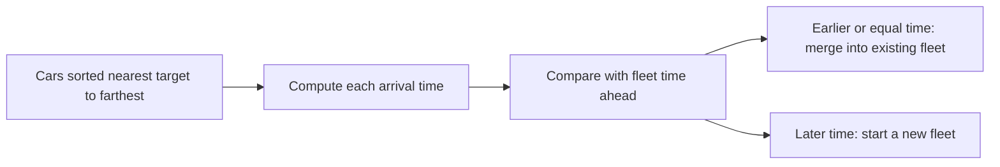
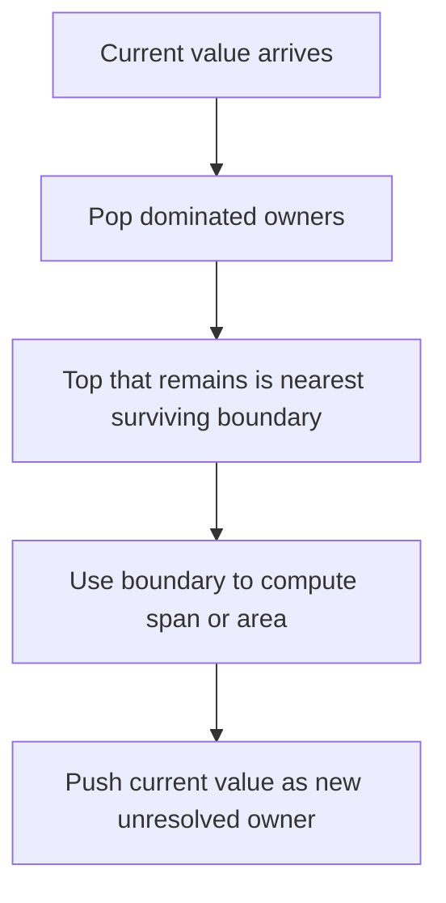
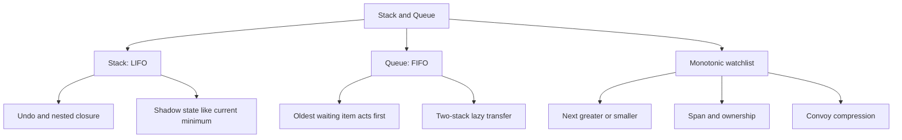
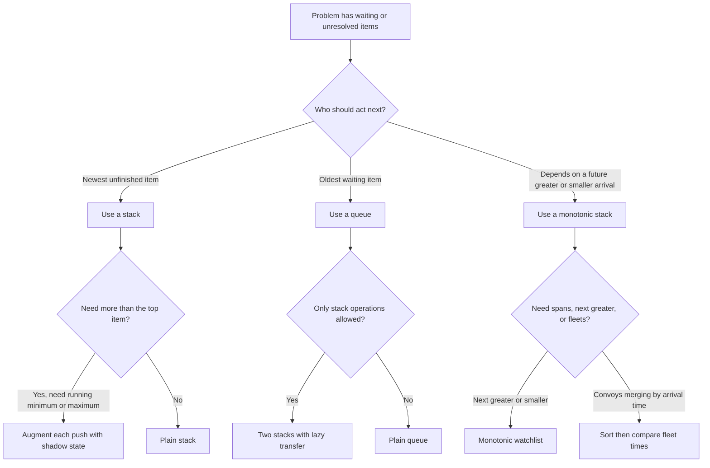

## 1. Overview

Stacks and queues are the first data structures where the order of access is the whole algorithm. If the newest unfinished thing must act next, use a stack. If the oldest waiting thing must act next, use a queue. Once that choice is right, a lot of "design" problems become almost mechanical.

This topic sits on top of [Arrays & Strings](/fundamentals/arrays-strings), [Hash Maps & Sets](/fundamentals/hash-maps), [Two Pointers](/fundamentals/two-pointers), [Sliding Window](/fundamentals/sliding-window), and [Linked Lists](/fundamentals/linked-lists): you already know how to scan once, preserve an invariant, and let a small amount of state replace repeated work.

The three building-block levels cover plain order discipline (LIFO vs FIFO), augmented structures that remember extra information or reverse lazily, and monotonic watchlists that settle "who gets resolved next?" problems in one pass. On your current path, the existing linked study guide here is [Implement Queue using Stacks](/dsa/problems/232).

## 2. Core Concept & Mental Model

Picture a busy theater lobby. There is a **plate shelf** behind the snack counter, a **ticket line** at the front desk, and a **bouncer's watchlist** by the exit. The shelf serves the most recently placed plate first, the line serves the earliest arrival first, and the watchlist keeps only the unresolved guests who still matter.

That is the whole topic. A shelf is last-in, first-out. A line is first-in, first-out. A watchlist is a shelf kept in a deliberate order so one new arrival can settle many older unresolved arrivals at once.

### Understanding the Analogy

#### The Setup

You are running the lobby. Plates come off the kitchen pass and get stacked on the shelf. Guests arrive and join the ticket line. Some situations are more subtle: a guest on the watchlist is waiting for someone taller, faster, warmer, or later to appear. The only thing that determines correctness is who gets served or resolved first.

#### The Plate Shelf and Ticket Line

The plate shelf works because only the top plate is reachable. If you need the freshest unfinished thing, that restriction is perfect, not a limitation. Undo histories, bracket matching, and expression evaluation all want the most recent unresolved item first.

The ticket line solves the opposite problem. When fairness matters, new arrivals must wait behind older ones. Sometimes the line is built directly. Sometimes it is simulated with two shelves: one shelf for arrivals, one shelf for service. When the service shelf runs dry, you pour all arrivals over once, reversing them into oldest-first order.

#### The Bouncer's Watchlist

The watchlist is not just any shelf. It is ordered so the newest arrival can immediately dismiss everyone it has just resolved. If the bouncer is waiting for the next taller guest, then shorter guests at the top of the watchlist leave the moment a taller guest arrives. Each guest joins once and leaves once, so the whole process stays linear.

Without the watchlist, you would re-check every earlier guest again and again. With it, unresolved guests stay in exactly the order that makes the next arrival decisive.

#### Why These Approaches

These structures work because they encode the problem's priority rule directly. A stack says "most recent first." A queue says "oldest first." A monotonic stack says "keep only unresolved candidates in the order that makes future decisions immediate." When the access rule matches the problem's logic, each item is touched a constant number of times instead of being revisited in nested loops.

### How I Think Through This

When I see a problem in this family, the first question I ask is not "what data structure do I know?" but "which unfinished thing should act next?" If the newest unfinished thing should be closed first, that is a stack signal. If the oldest waiting thing must be served first, that is a queue signal. If every new item needs to settle some earlier unresolved items like "next warmer day," "next taller building," or "does this convoy catch the one ahead?," that is a monotonic-stack signal. I also check whether I need more than the plain top or front: if I need the current minimum, or I need FIFO behavior using only stack operations, then I need shadow state or lazy transfer on top of the basic structure.

Take `drop(4), drop(2), lift(), drop(7), peek()`.

:::trace-sq
[
  {
    "structures": [
      { "kind": "stack", "label": "plate shelf", "items": [], "color": "blue" },
      { "kind": "queue", "label": "service view", "items": [], "color": "green" }
    ],
    "action": null,
    "label": "Start with an empty shelf. Nothing is waiting to be served."
  },
  {
    "structures": [
      { "kind": "stack", "label": "plate shelf", "items": [4], "color": "blue", "activeIndices": [0], "pointers": [{ "index": 0, "label": "top" }] },
      { "kind": "queue", "label": "service view", "items": [4], "color": "green", "activeIndices": [0], "pointers": [{ "index": 0, "label": "next" }] }
    ],
    "action": "push",
    "label": "Drop 4. The newest plate is now the next reachable plate."
  },
  {
    "structures": [
      { "kind": "stack", "label": "plate shelf", "items": [4, 2], "color": "blue", "activeIndices": [1], "pointers": [{ "index": 1, "label": "top" }] },
      { "kind": "queue", "label": "service view", "items": [2, 4], "color": "green", "activeIndices": [0], "pointers": [{ "index": 0, "label": "next" }] }
    ],
    "action": "push",
    "label": "Drop 2. The shelf makes the latest arrival, 2, reachable before 4."
  },
  {
    "structures": [
      { "kind": "stack", "label": "plate shelf", "items": [4], "color": "blue", "activeIndices": [0], "pointers": [{ "index": 0, "label": "top" }] },
      { "kind": "queue", "label": "service view", "items": [4], "color": "green", "activeIndices": [0], "pointers": [{ "index": 0, "label": "next" }] }
    ],
    "action": "pop",
    "label": "Lift once. The newest unfinished plate, 2, leaves first."
  },
  {
    "structures": [
      { "kind": "stack", "label": "plate shelf", "items": [4, 7], "color": "blue", "activeIndices": [1], "pointers": [{ "index": 1, "label": "top" }] },
      { "kind": "queue", "label": "service view", "items": [7, 4], "color": "green", "activeIndices": [0], "pointers": [{ "index": 0, "label": "next" }] }
    ],
    "action": "push",
    "label": "Drop 7. It becomes the new top immediately because shelves are last-in, first-out."
  },
  {
    "structures": [
      { "kind": "stack", "label": "plate shelf", "items": [4, 7], "color": "blue", "activeIndices": [1], "pointers": [{ "index": 1, "label": "top" }] },
      { "kind": "queue", "label": "service view", "items": [7, 4], "color": "green", "activeIndices": [0], "pointers": [{ "index": 0, "label": "next" }] }
    ],
    "action": "peek",
    "label": "Peek. The answer is whatever sits on top: 7. The whole decision came from the order rule, not from searching."
  }
]
:::

---

## 3. Building Blocks

### Level 1: Order Discipline

**Why this level matters**
Before stack and queue problems get clever, they get strict. The first skill is recognizing which end is allowed to act. If that rule is wrong, every later optimization is built on the wrong behavior. Level 1 is about making LIFO and FIFO feel inevitable instead of memorized.

**How to think about it**
Use the plate shelf when the freshest unfinished thing should close first. That is why stacks power undo, bracket matching, and nested structure problems: the most recent opener is the one that must be closed next. Use the ticket line when fairness matters and earlier arrivals must leave first. The key is to stop thinking about "an array I can access anywhere" and start thinking about "a structure that intentionally hides everything except the correct next item."

The shelf and the line look similar when they have only one item. The difference appears the moment several items are waiting. On a shelf, every new arrival jumps in front of older unfinished work. In a line, every new arrival waits behind older work. That one rule determines the whole trace.

**Walking through it**
Ticket events: `ARRIVE Ana, ARRIVE Ben, SERVE, ARRIVE Cam, SERVE`.

:::trace-sq
[
  {
    "structures": [
      { "kind": "queue", "label": "ticket line", "items": [], "color": "green" }
    ],
    "action": null,
    "label": "The line starts empty."
  },
  {
    "structures": [
      { "kind": "queue", "label": "ticket line", "items": ["Ana"], "color": "green", "activeIndices": [0], "pointers": [{ "index": 0, "label": "front" }, { "index": 0, "label": "back" }] }
    ],
    "action": "enqueue",
    "label": "Ana arrives. With one guest, front and back are the same spot."
  },
  {
    "structures": [
      { "kind": "queue", "label": "ticket line", "items": ["Ana", "Ben"], "color": "green", "activeIndices": [0, 1], "pointers": [{ "index": 0, "label": "front" }, { "index": 1, "label": "back" }] }
    ],
    "action": "enqueue",
    "label": "Ben arrives behind Ana. The line preserves arrival order."
  },
  {
    "structures": [
      { "kind": "queue", "label": "ticket line", "items": ["Ben"], "color": "green", "activeIndices": [0], "pointers": [{ "index": 0, "label": "front" }, { "index": 0, "label": "back" }] }
    ],
    "action": "dequeue",
    "label": "Serve once. Ana leaves because she has waited the longest."
  },
  {
    "structures": [
      { "kind": "queue", "label": "ticket line", "items": ["Ben", "Cam"], "color": "green", "activeIndices": [0, 1], "pointers": [{ "index": 0, "label": "front" }, { "index": 1, "label": "back" }] }
    ],
    "action": "enqueue",
    "label": "Cam arrives, but cannot jump ahead of Ben."
  },
  {
    "structures": [
      { "kind": "queue", "label": "ticket line", "items": ["Cam"], "color": "green", "activeIndices": [0], "pointers": [{ "index": 0, "label": "front" }, { "index": 0, "label": "back" }] }
    ],
    "action": "dequeue",
    "label": "Serve again. Ben leaves next because he is now at the front."
  }
]
:::

**The one thing to get right**
Do not mix the service ends. A stack pushes and pops from the same end. A queue adds at the back and removes from the front. If you accidentally remove a queue item from the back, newer arrivals cut in line and the output is silently wrong.

**Visualization**
The trace above is the whole idea made visible: the reachable item changes only because the service rule changes.

:::stackblitz{step=1 total=3 exercises="step1-exercise1-problem.ts,step1-exercise2-problem.ts,step1-exercise3-problem.ts" solutions="step1-exercise1-solution.ts,step1-exercise2-solution.ts,step1-exercise3-solution.ts"}

> "Stack = newest unfinished thing first. Queue = oldest waiting thing first."

**→ Bridge to Level 2**
Plain shelves and lines only answer "what is next?" Level 2 exists because many problems ask for more: the current minimum, or FIFO behavior built out of stack-only operations without redoing all the work each time.

### Level 2: Shadow State and Lazy Transfer

**Why this level matters**
Some stack and queue problems are really invariant problems wearing a data-structure costume. A plain stack cannot tell you the current minimum in O(1) unless you store extra information as items arrive. A plain stack also cannot act like a queue unless you delay and batch the reversal work. Level 2 is where stacks stop being containers and start carrying carefully chosen metadata.

**How to think about it**
For a minimum-tracking shelf, every plate carries a shadow badge: "what is the lowest plate among everything beneath me, including me?" Then the top plate already knows the current answer. No scanning is needed on the way back down, because the answer was recorded on the way up.

For a queue built from shelves, separate arrival from service. New guests pile onto the arrival shelf. Guests are served from the service shelf. Only when the service shelf is empty do you pour the whole arrival shelf over. That one reversal reveals the oldest guest first. The rule is lazy on purpose: if the service shelf already has guests ready to serve, pouring again would break FIFO order and waste work.

**Walking through it**
Desk events: `ARRIVE Ana, ARRIVE Ben, FRONT, SERVE, ARRIVE Cam, SERVE`.

:::trace-sq
[
  {
    "structures": [
      { "kind": "stack", "label": "arrival shelf", "items": [], "color": "blue" },
      { "kind": "stack", "label": "service shelf", "items": [], "color": "orange" },
      { "kind": "queue", "label": "line view", "items": [], "color": "green" }
    ],
    "action": null,
    "label": "Both shelves start empty, so the effective line is empty too."
  },
  {
    "structures": [
      { "kind": "stack", "label": "arrival shelf", "items": ["Ana"], "color": "blue", "activeIndices": [0], "pointers": [{ "index": 0, "label": "top" }] },
      { "kind": "stack", "label": "service shelf", "items": [], "color": "orange" },
      { "kind": "queue", "label": "line view", "items": ["Ana"], "color": "green", "activeIndices": [0], "pointers": [{ "index": 0, "label": "front" }, { "index": 0, "label": "back" }] }
    ],
    "action": "enqueue",
    "label": "Ana arrives. New guests always land on the arrival shelf."
  },
  {
    "structures": [
      { "kind": "stack", "label": "arrival shelf", "items": ["Ana", "Ben"], "color": "blue", "activeIndices": [1], "pointers": [{ "index": 1, "label": "top" }] },
      { "kind": "stack", "label": "service shelf", "items": [], "color": "orange" },
      { "kind": "queue", "label": "line view", "items": ["Ana", "Ben"], "color": "green", "activeIndices": [0, 1], "pointers": [{ "index": 0, "label": "front" }, { "index": 1, "label": "back" }] }
    ],
    "action": "enqueue",
    "label": "Ben arrives. He is newer, so he sits above Ana on the arrival shelf, but still behind her in line view."
  },
  {
    "structures": [
      { "kind": "stack", "label": "arrival shelf", "items": [], "color": "blue" },
      { "kind": "stack", "label": "service shelf", "items": ["Ben", "Ana"], "color": "orange", "activeIndices": [1], "pointers": [{ "index": 1, "label": "top" }] },
      { "kind": "queue", "label": "line view", "items": ["Ana", "Ben"], "color": "green", "activeIndices": [0], "pointers": [{ "index": 0, "label": "front" }, { "index": 1, "label": "back" }] }
    ],
    "action": "transfer",
    "label": "Front is requested while the service shelf is empty, so pour everything over once. The oldest guest, Ana, rises to the top of the service shelf."
  },
  {
    "structures": [
      { "kind": "stack", "label": "arrival shelf", "items": [], "color": "blue" },
      { "kind": "stack", "label": "service shelf", "items": ["Ben", "Ana"], "color": "orange", "activeIndices": [1], "pointers": [{ "index": 1, "label": "top" }] },
      { "kind": "queue", "label": "line view", "items": ["Ana", "Ben"], "color": "green", "activeIndices": [0], "pointers": [{ "index": 0, "label": "front" }, { "index": 1, "label": "back" }] }
    ],
    "action": "peek",
    "label": "Front is now just the top of the service shelf: Ana."
  },
  {
    "structures": [
      { "kind": "stack", "label": "arrival shelf", "items": [], "color": "blue" },
      { "kind": "stack", "label": "service shelf", "items": ["Ben"], "color": "orange", "activeIndices": [0], "pointers": [{ "index": 0, "label": "top" }] },
      { "kind": "queue", "label": "line view", "items": ["Ben"], "color": "green", "activeIndices": [0], "pointers": [{ "index": 0, "label": "front" }, { "index": 0, "label": "back" }] }
    ],
    "action": "dequeue",
    "label": "Serve once. Ana leaves from the service shelf, and Ben becomes the front."
  },
  {
    "structures": [
      { "kind": "stack", "label": "arrival shelf", "items": ["Cam"], "color": "blue", "activeIndices": [0], "pointers": [{ "index": 0, "label": "top" }] },
      { "kind": "stack", "label": "service shelf", "items": ["Ben"], "color": "orange", "activeIndices": [0], "pointers": [{ "index": 0, "label": "top" }] },
      { "kind": "queue", "label": "line view", "items": ["Ben", "Cam"], "color": "green", "activeIndices": [0, 1], "pointers": [{ "index": 0, "label": "front" }, { "index": 1, "label": "back" }] }
    ],
    "action": "enqueue",
    "label": "Cam arrives, but stays on the arrival shelf because Ben is still ready to serve."
  },
  {
    "structures": [
      { "kind": "stack", "label": "arrival shelf", "items": ["Cam"], "color": "blue", "activeIndices": [0], "pointers": [{ "index": 0, "label": "top" }] },
      { "kind": "stack", "label": "service shelf", "items": [], "color": "orange" },
      { "kind": "queue", "label": "line view", "items": ["Cam"], "color": "green", "activeIndices": [0], "pointers": [{ "index": 0, "label": "front" }, { "index": 0, "label": "back" }] }
    ],
    "action": "dequeue",
    "label": "Serve again. Ben leaves first. Cam will not be transferred until the service shelf runs empty."
  }
]
:::

**The one thing to get right**
Transfer only when the service shelf is empty. If you pour new arrivals onto a non-empty service shelf, newer guests leapfrog older guests and FIFO order breaks immediately. The same mindset applies to minimum stacks: record the shadow minimum when each plate arrives, not later when you need it.

**Visualization**
The trace makes the invariant visible: front items live on the service shelf, brand-new arrivals wait untouched on the arrival shelf, and a full pour happens only at the boundary where the service shelf empties.

:::stackblitz{step=2 total=3 exercises="step2-exercise1-problem.ts,step2-exercise2-problem.ts,step2-exercise3-problem.ts" solutions="step2-exercise1-solution.ts,step2-exercise2-solution.ts,step2-exercise3-solution.ts"}

> "Record answers on the way in, and reverse lazily only at the boundary where you must."

**→ Bridge to Level 3**
Level 2 lets you answer top, front, and minimum efficiently. Level 3 exists because some problems are not about serving the next item at all. They are about keeping a watchlist of unresolved items until one future arrival settles them.

### Level 3: Monotonic Watchlists

**Why this level matters**
Problems like daily temperatures, stock span, car fleets, and many skyline questions look quadratic at first because each item seems to need to compare against many later items. A monotonic stack compresses all unresolved work into one ordered watchlist. Each new arrival settles whatever it can settle immediately, and the rest stay waiting.

**How to think about it**
Imagine the bouncer keeps a watchlist of guests still waiting for someone taller to arrive. The watchlist is arranged so the most recently waiting guest is checked first, because that guest is the easiest to resolve. When a taller guest appears, everyone shorter at the top leaves the watchlist one by one because their answer has finally arrived.

The word *monotonic* means the watchlist stays sorted in one direction. For "next greater" problems, it is usually decreasing: each new unresolved value is smaller than the one beneath it. That invariant is what makes one future arrival able to settle several older items in a single burst. The critical mechanic is that settling is a while-loop, not a single comparison.

**Walking through it**
Temperatures: `[73, 71, 74, 72, 76]`. Each day waits for the next warmer day.

:::trace-sq
[
  {
    "structures": [
      { "kind": "queue", "label": "days ahead", "items": ["73", "71", "74", "72", "76"], "color": "green", "activeIndices": [0], "pointers": [{ "index": 0, "label": "today" }] },
      { "kind": "stack", "label": "watchlist", "items": [], "color": "purple" }
    ],
    "action": null,
    "label": "Start at day 0. No unresolved days yet."
  },
  {
    "structures": [
      { "kind": "queue", "label": "days ahead", "items": ["73", "71", "74", "72", "76"], "color": "green", "activeIndices": [0], "pointers": [{ "index": 0, "label": "today" }] },
      { "kind": "stack", "label": "watchlist", "items": ["73@0"], "color": "purple", "activeIndices": [0], "pointers": [{ "index": 0, "label": "top" }] }
    ],
    "action": "push",
    "label": "Day 0 waits on the watchlist because no warmer day has appeared yet."
  },
  {
    "structures": [
      { "kind": "queue", "label": "days ahead", "items": ["73", "71", "74", "72", "76"], "color": "green", "activeIndices": [1], "pointers": [{ "index": 1, "label": "today" }] },
      { "kind": "stack", "label": "watchlist", "items": ["73@0", "71@1"], "color": "purple", "activeIndices": [1], "pointers": [{ "index": 1, "label": "top" }] }
    ],
    "action": "push",
    "label": "71 is cooler than 73, so it can sit on top of the decreasing watchlist unresolved."
  },
  {
    "structures": [
      { "kind": "queue", "label": "days ahead", "items": ["73", "71", "74", "72", "76"], "color": "green", "activeIndices": [2], "pointers": [{ "index": 2, "label": "today" }] },
      { "kind": "stack", "label": "watchlist", "items": ["74@2"], "color": "purple", "activeIndices": [0], "pointers": [{ "index": 0, "label": "top" }] }
    ],
    "action": "pop",
    "label": "74 arrives. It settles 71 first, then 73, because both are shorter and stacked at the top. Their wait lengths are now known."
  },
  {
    "structures": [
      { "kind": "queue", "label": "days ahead", "items": ["73", "71", "74", "72", "76"], "color": "green", "activeIndices": [3], "pointers": [{ "index": 3, "label": "today" }] },
      { "kind": "stack", "label": "watchlist", "items": ["74@2", "72@3"], "color": "purple", "activeIndices": [1], "pointers": [{ "index": 1, "label": "top" }] }
    ],
    "action": "push",
    "label": "72 cannot settle 74, so it joins the watchlist on top as another unresolved day."
  },
  {
    "structures": [
      { "kind": "queue", "label": "days ahead", "items": ["73", "71", "74", "72", "76"], "color": "green", "activeIndices": [4], "pointers": [{ "index": 4, "label": "today" }] },
      { "kind": "stack", "label": "watchlist", "items": ["76@4"], "color": "purple", "activeIndices": [0], "pointers": [{ "index": 0, "label": "top" }] }
    ],
    "action": "pop",
    "label": "76 arrives and settles 72, then 74, in one burst. One new arrival can resolve many older waiters because the watchlist stayed ordered."
  },
  {
    "structures": [
      { "kind": "queue", "label": "days ahead", "items": ["73", "71", "74", "72", "76"], "color": "green", "activeIndices": [4], "pointers": [{ "index": 4, "label": "today" }] },
      { "kind": "stack", "label": "watchlist", "items": ["76@4"], "color": "purple", "activeIndices": [0], "pointers": [{ "index": 0, "label": "top" }] }
    ],
    "action": "done",
    "label": "Scan ends. 76 never finds a warmer future day, so it stays unresolved with answer 0."
  }
]
:::

**The one thing to get right**
When a resolving arrival shows up, keep settling with a while-loop until the watchlist invariant is restored. Using a single if-statement leaves older resolved items trapped underneath the top, producing answers that are too large or still zero when they should already be known.

**Visualization**
The watchlist trace shows the real gain: each day enters once, leaves once, and unresolved days stay arranged so the next decisive arrival can clean up several at once.

:::stackblitz{step=3 total=3 exercises="step3-exercise1-problem.ts,step3-exercise2-problem.ts,step3-exercise3-problem.ts" solutions="step3-exercise1-solution.ts,step3-exercise2-solution.ts,step3-exercise3-solution.ts"}

> "Monotonic stack = unresolved waiters kept in the one order that makes future arrivals decisive."

## 4. Key Patterns

**Pattern: Convoy Compression**

**When to use**: objects move toward the same destination, faster ones may catch slower ones, and the question is how many final groups remain. Keywords: "car fleet," "arrival groups," "convoys merge," "who catches up before the target?"

**How to think about it**: sort by starting position from closest to the destination back to farthest. Compute each arrival time. Walk backward and keep a stack of fleet times. If a new car would arrive sooner than or equal to the fleet ahead, it merges into that fleet and does not create a new group. If it would arrive later, it forms a new fleet. The stack stores only unresolved arrival-time boundaries, not every car interaction.

**Complexity**: Time O(n log n) because of sorting, Space O(n) in the explicit stack version or O(1) extra if you only track the last fleet time.

**Pattern: Range Ownership**

**When to use**: each value needs to know the nearest greater or smaller boundary to the left or right, often to compute spans, visibility, or how wide a contribution extends. Keywords: "stock span," "next greater element," "previous smaller," "visible buildings," "how far does this bar own?"

**How to think about it**: instead of asking every element to scan outward, let the monotonic stack remember only the candidates that still own unresolved territory. When a new value arrives, it strips ownership away from values it dominates and reveals the nearest surviving boundary underneath. Spans and areas fall out of those ownership boundaries directly.

**Complexity**: Time O(n), Space O(n).

---

## 5. Decision Framework

**Concept Map**

**Complexity table**

| Technique | Core operations | Time | Space | Notes |
| --- | --- | --- | --- | --- |
| Plain stack | `push`, `pop`, `peek` | O(1) | O(n) | LIFO access |
| Plain queue | `enqueue`, `dequeue`, `front` | O(1) | O(n) | FIFO access |
| Min stack | push, pop, current min | O(1) | O(n) | Store shadow minimum per arrival |
| Queue via two stacks | enqueue, dequeue, front | Amortized O(1) | O(n) | Each item moves shelves at most once |
| Monotonic stack | push + while-pop | O(n) total | O(n) | Each item enters and leaves once |
| Convoy compression | sort + monotonic compare | O(n log n) | O(n) | Sorting dominates |

**Decision tree**

**Recognition signals table**

| Problem keywords | Technique |
| --- | --- |
| "undo", "nested", "matching opener", "evaluate from most recent" | Stack |
| "serve in arrival order", "oldest first", "waiting line" | Queue |
| "queue using stacks", "lazy transfer", "amortized O(1)" | Two-stack queue |
| "current minimum at every step", "min stack", "max stack" | Augmented stack with shadow state |
| "next warmer", "next taller", "previous smaller", "stock span" | Monotonic stack |
| "cars merge before target", "arrival groups", "fleet count" | Sort + convoy compression |

**When NOT to use**

Do not force a stack or queue when arbitrary middle access matters. If the problem needs random lookup by value, a hash map is usually the missing tool. If the question is about a contiguous range with both boundaries moving, sliding window is a better fit. If comparisons halve the search space, binary search is the right model, not a waiting-line model.

## 6. Common Gotchas & Edge Cases

- Mixing the service end. What goes wrong: a queue accidentally behaves like a stack. Why it is tempting: arrays let you push and pop from the same side easily. Fix: name the front and back explicitly and trace two or three arrivals on paper before coding.
- Reversing too often in a two-stack queue. What goes wrong: newer arrivals leap ahead or performance degrades. Why it is tempting: every `front` or `serve` feels like it should "prepare" the structure. Fix: transfer only when the service shelf is empty.
- Forgetting shadow state on push. What goes wrong: `getMin()` or `getMax()` quietly turns into O(n) scans. Why it is tempting: the plain stack already stores the values. Fix: attach the current best value at insertion time so the top item already knows the answer.
- Using `if` instead of `while` in monotonic stack problems. What goes wrong: only the top waiter gets settled, leaving older resolved waiters stuck underneath. Why it is tempting: one comparison feels sufficient. Fix: keep popping until the invariant is restored.
- Storing values when you really need positions. What goes wrong: you know which future value resolved something, but you cannot compute distance or span. Why it is tempting: values are easier to read than indices. Fix: store indices whenever the answer depends on how far apart two items are.

Edge cases to check:

- Empty input.
- Single item.
- All items identical.
- Strictly increasing sequence.
- Strictly decreasing sequence.
- Repeated queries on an empty stack or queue.

Debugging tips:

- Print the stack or queue after every operation for one tiny example.
- For monotonic stacks, print the unresolved watchlist as indices plus values, not values alone.
- In two-stack queues, print both shelves separately; most bugs are obvious once you see whether the service shelf was filled too early.
- When answers involve distances, print both the stored index and the current index before assigning the result.
