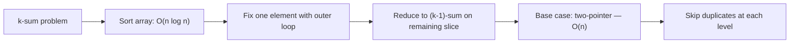
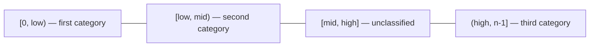
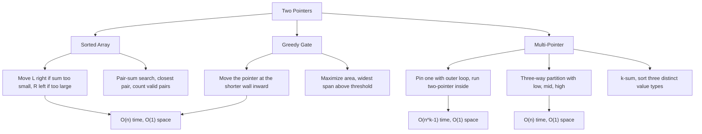
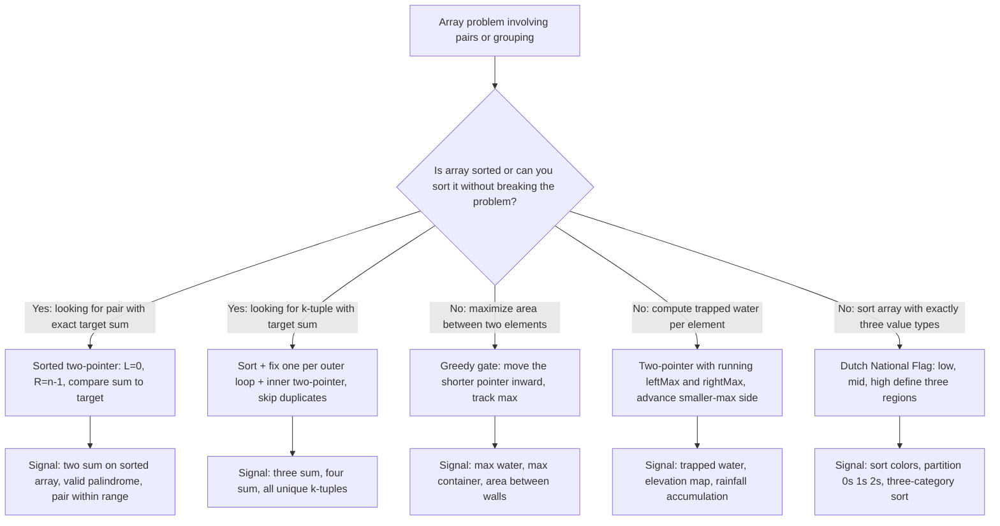

## 1. Overview

Two pointers is the pattern that breaks the O(n²) barrier for problems about pairs, ranges, or ordered comparisons in arrays. Once an array is sorted — or the structure of the problem guarantees useful order — you can use two pointers converging from opposite ends to eliminate entire halves of the search space per step, finishing in O(n).

From Arrays & Strings, you know the basic shape: `L` starts at `0`, `R` at `n−1`, they walk inward. This guide digs into _why each pointer move is provably safe_, then introduces two new settings where the same convergence logic applies: maximizing area between walls (greedy gate advancement), and reducing k-sum problems to the pair-sum case you already know (pinning one pointer).

By the end of Levels 1–3, you will have three distinct tools: sorted-pair targeting, greedy gate advancement, and multi-pointer reduction.

## 2. Core Concept & Mental Model

### The Two Surveyors

Picture a mountain valley with stone walls of varying heights at every position. Two water engineers — a **left surveyor** starting at the valley entrance and a **right surveyor** starting at the far end — are sent to find the best site for a reservoir.

- The **valley floor** is your array. Each position holds a wall of some height.
- The **left surveyor** stands at the leftmost wall, the **right surveyor** at the rightmost.
- **Water level** between them equals the _shorter_ wall — water spills over the low side.
- **Reservoir area** = min(left height, right height) × distance between them.

Every step, one surveyor takes one step inward. Each step provably eliminates one wall from further consideration — and since each wall can only be eliminated once, the whole survey takes O(n) steps.

### Understanding the Analogy

#### The Setup

The two surveyors stand at opposite ends of the valley with notebooks. They can only walk inward — no jumping, no backtracking. At each step they compare their walls. The comparison dictates who moves.

#### The Decision Rules

When searching for a target sum in a sorted valley: if the pair sums too low, the left surveyor steps right (larger values lie to their right in a sorted valley). If it sums too high, the right surveyor steps left. Each move eliminates an entire row of the "try every pair" grid. When maximizing reservoir area: **the shorter surveyor steps inward.**

Moving the taller surveyor inward can only _hurt_ — the water level stays limited by the shorter wall while the width shrinks. Moving the shorter surveyor is the only action that could possibly improve the area.

#### Why These Approaches

A nested loop checks every pair: `n × n = n²` total comparisons. Two surveyors check at most `n` pairs — each step eliminates one wall permanently. That is where the O(n) comes from. The trick only works because the array's structure (sorted order, or the greedy gate argument) guarantees that the skipped pairs can never be better than what is already tracked.

#### How I Think Through This

When I see a problem about finding a pair (or triplet) in an array, the first question I ask is: **is the array sorted, or can I sort it without losing what the problem needs?**

If yes, two pointers is my primary tool. I set `L = 0, R = n − 1`, and at each step I ask: **"does the current pair overshoot or undershoot my target?"** That comparison dictates exactly which pointer moves — `L` right if the sum is too small, `R` left if too large — and the whole scan runs in `O(n)`.

When there is no scalar target but instead an optimization objective, I look for the _constraining boundary_: in container problems the shorter wall limits the water, in trapping rain water the side with the smaller running maximum is the constraint.

Take `[1, 4, 6, 8, 10]` with target 14.

:::trace-lr
[
{"chars":["1","4","6","8","10"],"L":0,"R":4,"action": null,"label":"`L=0` (value 1), `R=4` (value 10). `Sum = 1+10 = 11 < 14`. \n Every pair with `left=1` is too small — move `L` right."},
{"chars":["1","4","6","8","10"],"L":1,"R":4,"action":"match","label":"`L=1` (value 4), `R=4` (value 10). `Sum = 4 + 10 = 14 = target`. \n Found ✓ — two steps eliminated a 5×5 grid of pair candidates."}
]
:::

---

## 3. Building Blocks — Progressive Learning

### Level 1: Converging on a Target

#### Why this level matters

Searching a sorted array for a pair with a given sum is `O(n²)` with a nested loop: fix one element, scan the rest.

Two pointers turns this into O(n) by using sorted order as an elimination oracle. Every time the sum is too small, every pair involving the current left element paired with anything to the left of `R` is also too small — discard all of them by moving `L` right. Every time the sum is too large, move `R` left. Each step eliminates one element permanently.

#### How to think about it

Set `L = 0`, `R = n − 1`. At each step, `nums[L] + nums[R]` gives a sum.

Three outcomes:

- the sum equals the target (found);
- the sum is below the target (move `L` right — `nums[L]` is too small to pair with even the largest remaining candidate);
- the sum is above (move `R` left — `nums[R]` is too large).

The correctness of each move depends entirely on sorted order. On an unsorted array, the guarantee breaks — use a hash set instead.

#### Walking through it

Sorted array `[2, 3, 5, 8, 11]`, target = 16.

:::trace-lr
[
{"chars":["2","3","5","8","11"],"L":0,"R":4,"action":null,"label":"Start: `L=0` (value 2), `R=4` (value 11). `Sum = 2+11 = 13 < 16.` \n Every pair with left=2 and any element to the left of `R` is `<= 13` — move `L` right."},
{"chars":["2","3","5","8","11"],"L":1,"R":4,"action":null,"label":"`L=1` (value 3), `R=4` (value 11). `Sum = 3+11 = 14 < 16`. \n Still too small — move `L` right."},
{"chars":["2","3","5","8","11"],"L":2,"R":4,"action":null,"label":"`L=2 `(value 5), `R=4` (value 11). `Sum = 5+11 = 16 = target`. \n Pair found!"},
{"chars":["2","3","5","8","11"],"L":2,"R":4,"action":"match","label":"`5 + 11 = 16` at indices (2, 4) ✓"}
]
:::

#### The one thing to get right

The entire proof depends on sorted order. When you move L right because the sum is too small, you are saying: "No pair involving `nums[L]` and any right partner can reach the target — because `nums[R]` is the largest remaining candidate and it already makes the sum too small." **This is only true if the array is sorted.**

Applying this pattern to an unsorted array produces silently wrong results, not a crash — verify sorted order before using it.

:::stackblitz{step=1 total=3 exercises="step1-exercise1-problem.ts,step1-exercise2-problem.ts,step1-exercise3-problem.ts" solutions="step1-exercise1-solution.ts,step1-exercise2-solution.ts,step1-exercise3-solution.ts"}

> **Mental anchor**: "Sorted array = sorted oracle. Each pointer move provably eliminates an entire row or column from the pair grid."

**→ Bridge to Level 2**: When there is a scalar target, pointer direction is clear: overshoot moves R left, undershoot moves L right. But what if there is no target — only an objective to _maximize_? The decision rule changes: you move the pointer at the _constraining boundary_, not the one that overshoots a number.

---

### Level 2: Greedy Gate Operators

**Why this level matters**

Container problems have no target to compare against — only an area formula to maximize: `min(height[L], height[R]) × (R − L)`. When you move a pointer inward, width decreases by 1. To compensate, the new minimum height must increase. But only the _shorter_ wall limits the minimum: moving the taller wall inward cannot raise the minimum (the shorter wall still caps it), so the area can only stay the same or drop. Moving the shorter wall is the only action that could possibly improve the area. This greedy argument is provably correct — not a heuristic.

**How to think about it**

At each step, compare `height[L]` and `height[R]`. Move the pointer at the _shorter_ wall. The greedy proof: if `height[L] <= height[R]` and we move L, the pair `(L, R−1)` that we skip has area at most `height[L] × (R−1−L)`. That is strictly less than the area we already computed: `height[L] × (R−L)`. So the skipped pair is provably not better — we can discard it safely and move on.

**Walking through it**

Heights: `[3, 1, 5, 2, 4]`. Left surveyor at index 0 (height 3), right at index 4 (height 4).

:::trace-lr
[
{"chars":["3","1","5","2","4"],"L":0,"R":4,"action":null,"label":"Area = min(3,4) x 4 = 12. Left wall (h=3) is shorter — it is the gate. Move L right."},
{"chars":["3","1","5","2","4"],"L":1,"R":4,"action":null,"label":"Area = min(1,4) x 3 = 3. Left wall (h=1) is still the shorter gate — move L right."},
{"chars":["3","1","5","2","4"],"L":2,"R":4,"action":null,"label":"Area = min(5,4) x 2 = 8. Right wall (h=4) is now the shorter gate — move R left."},
{"chars":["3","1","5","2","4"],"L":2,"R":3,"action":null,"label":"Area = min(5,2) x 1 = 2. Right wall (h=2) is gate — move R left."},
{"chars":["3","1","5","2","4"],"L":2,"R":2,"action":"done","label":"L >= R — loop ends. Maximum area = 12 (recorded at step 1) ✓"}
]
:::

**The one thing to get right**

When `height[L] === height[R]`, either pointer is equivalent to move — the skipped pair on the other side has the same height limit and strictly smaller width, so it cannot be better. Pick one convention (move L on ties) and never branch. Adding an `if equal, try both` branch does not improve correctness and breaks the O(n) guarantee.

:::stackblitz{step=2 total=3 exercises="step2-exercise1-problem.ts,step2-exercise2-problem.ts,step2-exercise3-problem.ts" solutions="step2-exercise1-solution.ts,step2-exercise2-solution.ts,step2-exercise3-solution.ts"}

> **Mental anchor**: "The shorter gate limits the water. Moving the taller gate inward is always worse. Move the shorter side — always."

**→ Bridge to Level 3**: Levels 1 and 2 use exactly two pointers. Some problems require three or more values: find all unique triplets summing to zero, or sort an array with three distinct values in one pass. The key insight is to _pin one element_ and reduce the multi-pointer problem to the two-pointer case you already know.

### Level 3: Pinning One Pointer

**Why this level matters**

3Sum — find all unique triplets summing to zero — is O(n³) by brute force. Once you sort the array, you can fix one element at position `i` and run a standard Level 1 two-pointer on the subarray `[i+1, n−1]`, looking for pairs summing to `-nums[i]`. The outer loop runs n times; the inner two-pointer is O(n) per call — total O(n²). The same "pin one, run two-pointer" reduction generalizes to any k-sum problem. A second three-pointer technique — Dutch National Flag — uses a `low`, `mid`, and `high` to partition an array into three regions in a single pass, each element processed exactly once.

**How to think about it**

Sort the array once. For each position `i`, the remaining problem is a pair-sum search on `[i+1, n−1]` with target `-nums[i]`. Run Level 1 exactly. The only new ingredient is duplicate skipping: after recording a valid triplet, advance both L and R past any repeated values before doing the final step — otherwise the same triplet appears multiple times.

For three-way partition, maintain `low`, `mid`, and `high`. The invariant: `[0, low)` is the first category, `[low, mid)` is the second, `[mid, high]` is unclassified, `(high, n−1]` is the third. The `mid` pointer processes one element per step: a first-category value at `mid` swaps with `low` and advances both; a second-category value just advances `mid`; a third-category value swaps with `high` and retreats `high` — `mid` does _not_ advance because the swapped element has not been classified yet.

**Walking through it**

3Sum on `[-4, -1, -1, 0, 1, 2]` (already sorted). Fix `i = 1` (value −1). Inner two-pointer looks for pairs summing to `0 − (−1) = 1` in the subarray starting at index 2.

:::trace-lr
[
{"chars":["-4","-1","-1","0","1","2"],"L":2,"R":5,"action":null,"label":"Fix i=1 (value -1). L=2 (-1), R=5 (2). Sum = -1+2 = 1 = target. Triplet found: [-1,-1,2]."},
{"chars":["-4","-1","-1","0","1","2"],"L":2,"R":5,"action":"match","label":"Record [-1,-1,2]. No duplicates at L or R. Advance: L->3, R->4."},
{"chars":["-4","-1","-1","0","1","2"],"L":3,"R":4,"action":null,"label":"L=3 (0), R=4 (1). Sum = 0+1 = 1 = target. Triplet found: [-1,0,1]."},
{"chars":["-4","-1","-1","0","1","2"],"L":3,"R":4,"action":"match","label":"Record [-1,0,1]. Advance: L->4, R->3."},
{"chars":["-4","-1","-1","0","1","2"],"L":4,"R":3,"action":"done","label":"L >= R — inner loop done for i=1. Triplets: [-1,-1,2] and [-1,0,1] ✓"}
]
:::

**The one thing to get right**

After recording a triplet, advance both L and R past _all_ repeated values before doing the final `L++; R--`. If `nums[L] === nums[L+1]`, keep incrementing L. Same for R going left. Skipping even one step of duplicate-skipping causes the same triplet to be recorded again under different indices. The outer loop also needs a duplicate check: `if (i > 0 && nums[i] === nums[i-1]) continue`.

:::stackblitz{step=3 total=3 exercises="step3-exercise1-problem.ts,step3-exercise2-problem.ts,step3-exercise3-problem.ts" solutions="step3-exercise1-solution.ts,step3-exercise2-solution.ts,step3-exercise3-solution.ts"}

> **Mental anchor**: "k-Sum = sort + pin one + two-pointer on the rest. Reduce one variable at a time until you are back to the pair case."

## 4. Key Patterns

### Pattern: Multi-Sum Reduction (k-Sum)

**When to use**: the problem asks for all k-tuples (k >= 3) summing to a target, and sorting is allowed (original indices are not needed). Keywords: "all unique triplets", "three numbers sum to target", "four numbers sum to target".

**How to think about it**: sort once, then apply a chain of outer loops — each loop fixes one more element and reduces the k-sum to a (k−1)-sum. The innermost case is always a two-pointer. The duplicate-skipping logic must be applied at every level: skip the outer element if it is the same as the previous one, and skip inner duplicates after recording a valid tuple. Getting duplicate skipping right is the hardest part — draw it out on paper before coding.

**Complexity**: Time O(n^(k-1)) — for 3Sum that is O(n²). Space O(k) for the recursion stack plus output size.

### Pattern: Three-Way Partition (Dutch National Flag)

**When to use**: sort an array in-place that contains exactly three distinct values, in one pass with O(1) extra space. Keywords: "sort colors", "sort 0s 1s 2s", "partition into three groups", "three categories".

**How to think about it**: define three regions with pointers `low`, `mid`, and `high`. The invariant holds at every step: `[0, low)` contains the first category, `[low, mid)` contains the second, `[mid, high]` is unclassified (shrinking), and `(high, n−1]` contains the third. The algorithm terminates when `mid > high` — the unclassified region is empty. The critical rule: when you swap a third-category element from `mid` to `high`, do not advance `mid` — the element now at `mid` arrived from the unclassified region and has not been classified yet.

**Complexity**: Time O(n) — each element is processed exactly once. Space O(1).

---

## 5. Decision Framework

**Concept Map**

**Complexity Table**

| Operation                   | Time  | Space      | Notes                                      |
| --------------------------- | ----- | ---------- | ------------------------------------------ |
| Sorted pair-sum (find one)  | O(n)  | O(1)       | Requires sorted input                      |
| Sorted pair-sum (count all) | O(n)  | O(1)       | Each pointer moves at most n times total   |
| Closest pair sum            | O(n)  | O(1)       | Track running best; requires sorted input  |
| Container max area          | O(n)  | O(1)       | No sort needed                             |
| Trapping rain water         | O(n)  | O(1)       | Two-pointer with running max on both sides |
| 3Sum (all unique triplets)  | O(n²) | O(1) extra | O(n log n) sort + O(n) per outer step      |
| Three-way partition         | O(n)  | O(1)       | Single pass, three regions                 |

**Decision Tree**

**Recognition Signals**

| Problem keywords                               | Technique                                                    |
| ---------------------------------------------- | ------------------------------------------------------------ |
| "sorted array", "two numbers sum to target"    | Sorted pair-sum (Level 1)                                    |
| "all unique triplets", "three sum zero"        | Sort + pin one + two-pointer (Level 3)                       |
| "max water between bars", "container"          | Greedy gate movement (Level 2)                               |
| "trapped water", "rain water", "elevation map" | Two-pointer with running max                                 |
| "sort colors", "0s 1s 2s", "three categories"  | Dutch National Flag (Level 3)                                |
| "closest pair sum"                             | Sorted pair-sum, track min-distance running best             |
| "count pairs with sum less than target"        | Sorted pair-sum with bulk counting (count += R - L on match) |

**When NOT to use two pointers**

- Array is **unsorted** and you need a pair sum without sorting → use a hash set for O(n) lookup. Two pointers on an unsorted array is not correct.
- You need to **preserve original indices** in the output (like the classic Two Sum problem) → use a hash map with index tracking. Sorting destroys original positions.
- Problem involves **cross-array pairs** (one element from each of two separate arrays) → nested iteration or binary search, not converging pointers.
- Finding a **subarray** of a given sum or length → sliding window, not converging pointers.

---

## 6. Common Gotchas & Edge Cases

**Gotcha 1: Applying sorted-array two-pointer to an unsorted array**

The sorted-array guarantee breaks silently. Moving L right when the sum is too small assumes that `nums[R]` is the largest remaining candidate — this is only true when the array is sorted. On an unsorted array, you get incorrect answers without any crash or error signal.

Why it is tempting: the algorithm visits something at every step and terminates correctly — it just visits the wrong pairs.

Fix: always sort first, or switch to a hash-set approach (`complement = target - nums[i]`) for problems where original indices matter or sorting is prohibited.

**Gotcha 2: Moving the wrong pointer in the greedy gate**

Moving the taller pointer inward guarantees the area decreases or stays the same — the shorter wall still limits the water level, and the width shrank. You will never find the maximum this way.

Why it is tempting: "the taller side seems like it has room to improve." The insight is the opposite: the taller side is _not_ the constraint; the shorter side is.

Fix: always move the pointer at `Math.min(height[L], height[R])`. On equal heights, pick either (they are equivalent).

**Gotcha 3: Forgetting duplicate skipping in 3Sum**

The result contains duplicate triplets — the same set of values recorded under different indices.

Why it is tempting: the base two-pointer algorithm works without it. Duplicates feel like a correctness detail to handle "later."

Fix: two places. Outer loop: `if (i > 0 && nums[i] === nums[i-1]) continue`. Inner loop: after recording a triplet, `while (L < R && nums[L] === nums[L+1]) L++` and `while (L < R && nums[R] === nums[R-1]) R--`, then `L++; R--`.

**Gotcha 4: Loop condition L <= R instead of L < R**

When `L === R`, you are comparing an element with itself. For pair-sum, `nums[L] + nums[R]` becomes `2 × nums[L]`, which spuriously matches a target equal to twice that value.

Fix: always use `while (L < R)`. The loop stops before any self-pairing occurs.

**Gotcha 5: Advancing mid after a Dutch National Flag swap with high**

When `arr[mid]` is a third-category element and you swap it with `arr[high]`, the element that arrives at `mid` came from the unclassified region — it has not been categorized yet. Advancing `mid` skips it without classification.

Fix: after swapping with `high`, decrement `high` only. Do not touch `mid`. The loop re-examines the element now sitting at `mid` on the next iteration.

**Edge cases to always check**

- Empty array `[]`: L=0, R=-1, `while (L < R)` never executes. Return 0 or empty result.
- Single element `[x]`: L=0, R=0, loop never executes. Return 0 or false.
- Two elements: one iteration, then `L === R`, loop exits cleanly.
- All elements identical `[3,3,3,3]`: 3Sum dedup must fire; container area = h × (n-1) correctly.
- Already sorted: two-pointer still correct — it is a trivially valid input.
- Negative numbers: the "sum too small / too large" logic works identically with negatives.

**Debugging tips**

- Converging two-pointer: print `(L, R, nums[L], nums[R], currentSum)` at each step to trace the elimination path.
- Greedy gate: print `(L, R, area, maxSoFar)` at each step — confirm max is tracked across all visited pairs.
- 3Sum: print `i, nums[i], L, R, sum` inside the inner loop. Print the result array after each `push` to confirm deduplication.
- Dutch National Flag: print `(low, mid, high, arr)` at each step — the four regions should shrink cleanly with no overlap.
