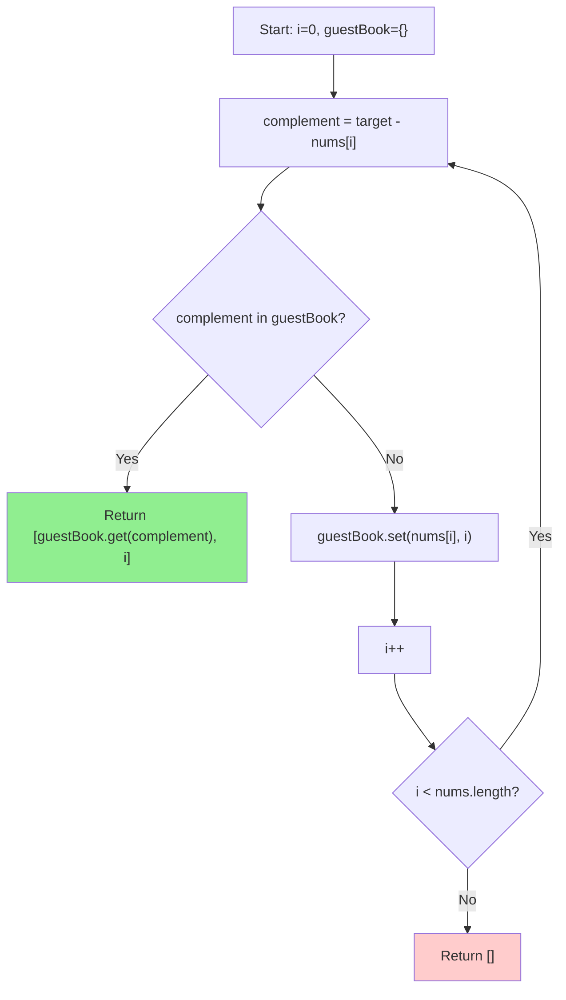

# Two Sum - Mental Model

## The Problem

Given an array of integers `nums` and an integer `target`, return indices of the two numbers such that they add up to `target`. You may assume that each input would have exactly one solution, and you may not use the same element twice. You can return the answer in any order.

**Example 1:**
```
Input: nums = [2,7,11,15], target = 9
Output: [0,1]
```

**Example 2:**
```
Input: nums = [3,2,4], target = 6
Output: [1,2]
```

**Example 3:**
```
Input: nums = [3,3], target = 6
Output: [0,1]
```

## The Party Guest Book Analogy

Picture a party where every guest has a number printed on their name tag. Your job as the host is to find two guests whose name-tag numbers add up to the party's magic number — the target. Guests arrive one at a time, joining the line in order, and you greet each one at the door.

Here is the key insight: when a new guest arrives, you do not need to walk the entire party room comparing them to every person already seated. Instead, you ask one pointed question — "what number would I need to pair with this guest to hit the magic sum?" That answer is the complement: target minus the current guest's number. Then you flip open your guest book and look it up in an instant.

The guest book is your secret weapon. It is not a list you scan linearly — it is a lookup table. You write each guest's name-tag number alongside the seat they are sitting in, and later you can ask "is number 7 in here?" and get an immediate answer with their seat number, or "not yet." This instant recall is what makes the whole approach efficient.

The loop is a simple rhythm: check, then record. For every guest who walks in, first consult the book. If their complement is waiting, you have your pair — announce both seats and the party is complete. If not, write this guest into the book and move to the next arrival. The guest who comes second in any pair will always find their partner because the first was already recorded.

## Understanding the Analogy

### The Setup

You are standing at the entrance of the party with a completely empty guest book. Guests arrive in a fixed order — you cannot rearrange them or skip ahead. Each has a number on their name tag. The magic sum is fixed: it is the `target`. Your goal is to name two seats (positions in the arrival line) whose guests' name-tag numbers add up to the magic sum.

The constraint is that one guest cannot pair with themselves — you need two different seats. And there is always exactly one valid pair somewhere in the line.

### The Guest Book

The guest book stores one entry per arrival: the guest's name-tag number points to their seat. When you want to know if guest number 7 has arrived, you open the book and look up "7" directly — no scanning, no counting, just an immediate answer.

Why does this matter? Without the book, you would have to compare each new arrival against every person already seated. For ten guests that is manageable; for ten thousand, it becomes unbearable. The book trades a small amount of memory for the ability to answer "have I seen this number?" in constant time, no matter how many guests are recorded.

### Why This Approach

The naive approach scans every pair: for each guest, walk back through all previous arrivals and check each one. That is fine for small parties but grows quadratically — one hundred guests means nearly five thousand comparisons. The guest book makes it linear: each arrival triggers exactly one lookup and at most one write. The entire line is processed in a single sweep. You pay for the book (memory), but you eliminate every redundant comparison (time).

## How I Think Through This

I'm looking for two indices whose values in `nums` sum to `target`. I open a HashMap called `guestBook` that maps each value to its index. As I scan left to right with loop variable `i`, I compute `complement = target - nums[i]` — that's the exact name-tag number I need to find in the book. The invariant that keeps everything correct is **check before you write**: I always consult the book before recording the current guest, which means a number can only be found if someone else with that value arrived earlier at a different seat. If `guestBook.has(complement)` is true, I return `[guestBook.get(complement)!, i]` — the stored seat and the current seat. If not, I write `guestBook.set(nums[i], i)` and keep going. The problem guarantees exactly one valid answer, so the loop always finds it before exhausting the list.

Take `[3, 2, 4]`, target = 6.

:::trace-map
[
  {"input": [3,2,4], "currentI": -1, "map": [], "highlight": null, "action": null, "label": "guestBook = {}. First guest approaches the door."},
  {"input": [3,2,4], "currentI": 0, "map": [], "highlight": 3, "action": "miss", "label": "i=0: complement=6−3=3. Book empty — miss.", "vars": [{"name": "complement", "value": 3}]},
  {"input": [3,2,4], "currentI": 0, "map": [[3,0]], "highlight": 3, "action": "insert", "label": "No match. Write guest 3 → seat 0.", "vars": [{"name": "complement", "value": 3}]},
  {"input": [3,2,4], "currentI": 1, "map": [[3,0]], "highlight": 4, "action": "miss", "label": "i=1: complement=6−2=4. No guest 4 yet — miss.", "vars": [{"name": "complement", "value": 4}]},
  {"input": [3,2,4], "currentI": 1, "map": [[3,0],[2,1]], "highlight": 4, "action": "insert", "label": "No match. Write guest 2 → seat 1.", "vars": [{"name": "complement", "value": 4}]},
  {"input": [3,2,4], "currentI": 2, "map": [[3,0],[2,1]], "highlight": 2, "action": "found", "label": "i=2: complement=6−4=2. Guest 2 at seat 1! Return [1, 2] ✓", "vars": [{"name": "complement", "value": 2}]}
]
:::

---

## Building the Algorithm

Each step introduces one concept from the guest book, then a StackBlitz embed to try it.

### Step 1: The Guest Book Scan

For each guest who arrives, ask: "what name-tag number would complete the magic sum with mine?" That number is the complement — `target - nums[i]`. Consult the guest book instantly: if the complement is already recorded, you have the pair and return both seats. If not, write the current guest into the book so future arrivals can find them. One pass, two beats per guest: look up, then record.

The trace follows `[2, 7, 11, 15]` with target `9`. Watch guest 2 arrive (miss, then recorded), and then guest 7 arrive and instantly find guest 2 waiting in the book.

:::trace-map
[
  {"input": [2,7,11,15], "currentI": -1, "map": [], "highlight": null, "action": null, "label": "Guest book is open. Guests begin arriving."},
  {"input": [2,7,11,15], "currentI": 0, "map": [], "highlight": 7, "action": "miss", "label": "Guest 2 seeks complement 9−2=7. Book is empty — miss.", "vars": [{"name": "complement", "value": 7}]},
  {"input": [2,7,11,15], "currentI": 0, "map": [[2,0]], "highlight": 2, "action": "insert", "label": "No partner yet. Write guest 2 at seat 0.", "vars": [{"name": "complement", "value": 7}]},
  {"input": [2,7,11,15], "currentI": 1, "map": [[2,0]], "highlight": 2, "action": "found", "label": "Guest 7 seeks complement 9−7=2. Guest 2 is at seat 0! Found the pair!", "vars": [{"name": "complement", "value": 2}]},
  {"input": [2,7,11,15], "currentI": -2, "map": [[2,0]], "highlight": 2, "action": "done", "label": "Return [0, 1] — seats of guest 2 and guest 7. ✓"}
]
:::

:::stackblitz{file="step1-problem.ts" step=1 total=1 solution="step1-solution.ts"}

## The Guest Book at a Glance



## Tracing through an Example

Using `nums = [3, 2, 4]`, target = `6`:

| Step | Guest Position (i) | Name Tag (nums[i]) | Complement (6−nums[i]) | Guest Book | Match? | Action |
|------|---|---|---|---|---|---|
| Start | — | — | — | {} | — | Open empty book |
| i=0 | 0 | 3 | 3 | {} | No | Miss → record {3: 0} |
| i=1 | 1 | 2 | 4 | {3: 0} | No | Miss → record {3: 0, 2: 1} |
| i=2 | 2 | 4 | 2 | {3: 0, 2: 1} | Yes — seat 1 | Return [1, 2] ✓ |

---

## Common Misconceptions

**"I need to build the full guest book first, then search it in a second pass"** — This double-pass intuition is natural but unnecessary. Because you check before you write, the guest who arrives second in any pair always finds the first guest already recorded. There is no need for a second loop — the pair announces itself the moment the second half walks in.

**"What if the same number appears twice — won't the second one overwrite the first?"** — It will never get the chance. When the duplicate arrives, its complement is itself. You check the book first and find the earlier arrival there — so you return immediately, before any overwrite happens. The `[3, 3]` example proves this: `i=1` finds `3` at seat 0 and returns `[0, 1]` without touching the book.

**"I need a guard like `guestBook.get(complement) !== i` to avoid pairing a guest with themselves"** — You do not. The check-before-write order already prevents this. When you consult the book at index `i`, you have not yet written `nums[i]` into it. A number can only be found if someone else with that value arrived earlier. No extra guard is needed.

**"Sorting the array first would make it easier to find complements"** — Sorting destroys the original positions, which are exactly what you need to return. The guest book makes sorting unnecessary: O(1) lookups let you find any complement without rearranging anything. Sorting would add O(n log n) cost and require remapping every index back to its original seat.

---

## Complete Solution

:::stackblitz{file="solution.ts" step=1 total=1 solution="solution.ts"}
