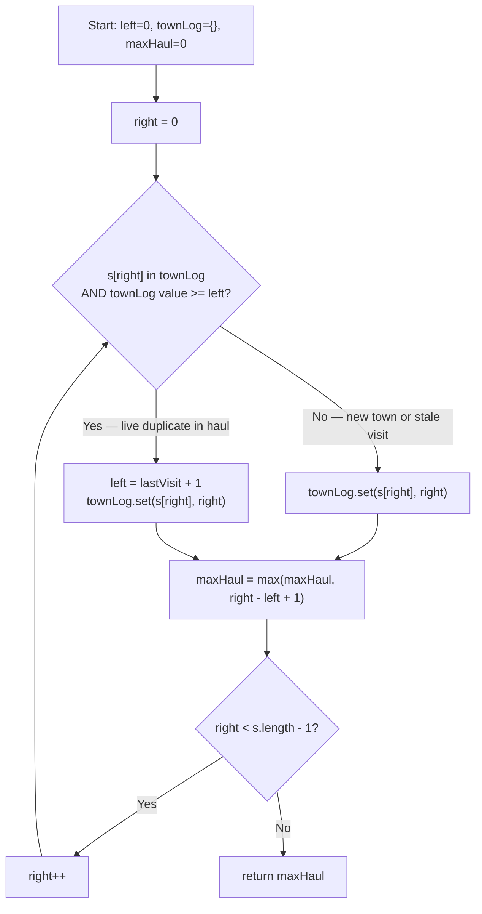

# Longest Substring Without Repeating Characters - Mental Model

## The Problem

Given a string `s`, find the length of the longest substring without duplicate characters.

**Example 1:**
```
Input: s = "abcabcbb"
Output: 3
```

**Example 2:**
```
Input: s = "bbbbb"
Output: 1
```

**Example 3:**
```
Input: s = "pwwkew"
Output: 3
```

## The Road Trip Souvenir Analogy

Imagine you're on a long road trip, driving through a series of towns. Each town has a name — and you collect one souvenir from each town you pass. Your personal rule: your active souvenir haul can only contain **one souvenir per town**. No duplicates allowed. At the end of the trip, you want to know: what's the biggest haul of unique town souvenirs you held at one time?

As you drive, you keep a **travel log** — a notebook where you write down the last mile marker where you visited each town. This lets you answer instantly: "Have I been to Oakville before, and if so, was it recent enough to still be in my active haul?"

When you roll into a town you've visited before, you don't just drop that one souvenir — you jump your haul-start forward to the mile marker just past your last visit. Everything collected before that point is behind you. You keep driving forward, building the biggest unique haul you can.

The insight that makes this efficient: you never need to re-examine old souvenirs one by one. The travel log tells you exactly where the conflict started, so you can leap your haul-start there in one move. This collapses what would be an O(n²) search into a single O(n) pass.

## Understanding the Analogy

### The Setup

You are driving a one-way road. Towns appear in sequence — some names repeat, some don't, and you have no way to know what's coming. Your active souvenir haul is the span of towns between your haul-start and your current position. You can only hold one souvenir per town name. Your goal: find the maximum size that haul ever reaches before the road ends.

### The Travel Log and the Haul Jump

Before you can decide whether a town conflicts with your haul, you need to know when you last visited it. The **travel log** is a Map from town name to the mile marker (index) of its most recent visit. Every time you arrive at a town, you write the current mile marker into the log — whether you've been there before or not. The log always reflects the *most recent* visit.

When you arrive at a town already in the log, there are two possibilities. If the last visit is behind your haul-start, the conflict is stale — that souvenir is no longer in your haul, and you can safely continue. But if the last visit is at or after your haul-start, the duplicate is live inside your haul. You must jump your haul-start to one mile past that last visit. This is the **haul jump**: a single, precise leap that clears the duplicate without touching anything else.

The `max(left, lastVisit + 1)` wrinkle exists for the stale case: if a town's last log entry is before your current haul-start, the naive jump would move haul-start backwards — into territory you've already cleared. The `max` ensures haul-start only ever moves forward.

### Why This Approach

A brute-force approach checks every possible substring, scanning for duplicates inside each one — O(n²) or worse. The travel log eliminates that inner scan. The Map gives you O(1) access to the last-seen position of any character. Combined with the haul-start pointer, you maintain the invariant that the window [left, right] is always duplicate-free, and you never revisit territory behind left. Every character in the string is touched exactly once, giving O(n) time and O(k) space where k is the character set size.

## How I Think Through This

I maintain three things: `left` (where my active haul starts), `townLog` (the Map from town name to last-seen index), and `maxHaul` (the biggest window I've ever seen). I scan with `right` from index 0 to the end of the string, one town at a time.

At each town `s[right]`, I check the travel log. If this town is in the log **and** the last visit index is at or after `left`, I have a live duplicate — I jump `left` to `townLog.get(s[right]) + 1`. Then regardless of whether I jumped, I update the log (`townLog.set(s[right], right)`) and compute `maxHaul = Math.max(maxHaul, right - left + 1)`. I return `maxHaul` when `right` reaches the end.

Take `"abcab"`.

:::trace-lr
[
  {"chars": ["a","b","c","a","b"], "L": 0, "R": 0, "action": null, "label": "Mile 0 — town 'a': not in log. Record a→0. Active haul: [a]. Size: 1"},
  {"chars": ["a","b","c","a","b"], "L": 0, "R": 1, "action": null, "label": "Mile 1 — town 'b': not in log. Record b→1. Active haul: [a,b]. Size: 2"},
  {"chars": ["a","b","c","a","b"], "L": 0, "R": 2, "action": null, "label": "Mile 2 — town 'c': not in log. Record c→2. Active haul: [a,b,c]. Size: 3 ← new max"},
  {"chars": ["a","b","c","a","b"], "L": 1, "R": 3, "action": "mismatch", "label": "Mile 3 — town 'a': repeat! Log shows last visit at mile 0 (inside haul). Jump haul-start to mile 1. Record a→3. Size: 3"},
  {"chars": ["a","b","c","a","b"], "L": 2, "R": 4, "action": "mismatch", "label": "Mile 4 — town 'b': repeat! Log shows last visit at mile 1 (inside haul). Jump haul-start to mile 2. Record b→4. Size: 3"},
  {"chars": ["a","b","c","a","b"], "L": 2, "R": 4, "action": "done", "label": "Road ends. Maximum haul ever: 3 unique towns"}
]
:::

---

## Building the Algorithm

Each step introduces one concept from the Road Trip analogy, then a StackBlitz embed to try it.

### Step 1: Building the Travel Log

Before you can spot a repeat, you need to know when you last visited each town. The travel log — a `Map<string, number>` from town name to last-seen index — answers that question in O(1). On every arrival, you write the current mile marker into the log. This is the foundation everything else rests on.

For strings with no repeated towns, the haul-start never needs to move: every new town extends the haul, and the log just grows. The maximum haul is the full length of the road.

:::trace-map
[
  {"input": ["a","b","c"], "currentI": -1, "map": [], "highlight": null, "action": null, "label": "Start: travel log is empty. Haul-start at mile 0."},
  {"input": ["a","b","c"], "currentI": 0, "map": [["a",0]], "highlight": "a", "action": "insert", "label": "Mile 0 — town 'a': new entry. Log: {a→0}. Haul size: 1"},
  {"input": ["a","b","c"], "currentI": 1, "map": [["a",0],["b",1]], "highlight": "b", "action": "insert", "label": "Mile 1 — town 'b': new entry. Log: {a→0, b→1}. Haul size: 2"},
  {"input": ["a","b","c"], "currentI": 2, "map": [["a",0],["b",1],["c",2]], "highlight": "c", "action": "insert", "label": "Mile 2 — town 'c': new entry. Log: {a→0, b→1, c→2}. Haul size: 3"},
  {"input": ["a","b","c"], "currentI": -2, "map": [["a",0],["b",1],["c",2]], "highlight": null, "action": "done", "label": "Road ends. Max haul: 3"}
]
:::

:::stackblitz{file="step1-problem.ts" step=1 total=2 solution="step1-solution.ts"}

<details>
<summary>Hints & gotchas</summary>

- **Log update is always unconditional**: You write `townLog.set(s[right], right)` on every iteration — even when no jump happens. The log must always reflect the *most recent* visit, not just the first.
- **maxHaul formula**: The window size at any point is `right - left + 1`. Don't forget the `+ 1` — both endpoints are inclusive.
- **Empty string**: When `s` is empty, the for loop never runs and `maxHaul` stays 0. That's the correct return value — no scaffolding needed.

</details>

### Step 2: The Haul Jump

Now add the logic that makes the algorithm handle repeats. When you arrive at a town already in the log, check whether the logged mile marker is at or after `left`. If it is, the duplicate is live inside your haul — jump `left` to `lastVisit + 1`. If the logged mile is before `left`, the conflict is stale (that souvenir is already behind you) — don't touch `left`.

This is the haul jump, and it's the heart of the sliding window. After any potential jump, update the log and measure the window. One forward pass, no rewinding.

:::trace-lr
[
  {"chars": ["a","b","c","a","b","c","b","b"], "L": 0, "R": 0, "action": null, "label": "Mile 0 — 'a': new. Log a→0. Haul: 1"},
  {"chars": ["a","b","c","a","b","c","b","b"], "L": 0, "R": 1, "action": null, "label": "Mile 1 — 'b': new. Log b→1. Haul: 2"},
  {"chars": ["a","b","c","a","b","c","b","b"], "L": 0, "R": 2, "action": null, "label": "Mile 2 — 'c': new. Log c→2. Haul: 3 ← max"},
  {"chars": ["a","b","c","a","b","c","b","b"], "L": 1, "R": 3, "action": "mismatch", "label": "Mile 3 — 'a': repeat at mile 0 (in haul). Jump left to 1. Log a→3. Haul: 3"},
  {"chars": ["a","b","c","a","b","c","b","b"], "L": 2, "R": 4, "action": "mismatch", "label": "Mile 4 — 'b': repeat at mile 1 (in haul). Jump left to 2. Log b→4. Haul: 3"},
  {"chars": ["a","b","c","a","b","c","b","b"], "L": 3, "R": 5, "action": "mismatch", "label": "Mile 5 — 'c': repeat at mile 2 (in haul). Jump left to 3. Log c→5. Haul: 3"},
  {"chars": ["a","b","c","a","b","c","b","b"], "L": 5, "R": 6, "action": "mismatch", "label": "Mile 6 — 'b': repeat at mile 4 (in haul). Jump left to 5. Log b→6. Haul: 2"},
  {"chars": ["a","b","c","a","b","c","b","b"], "L": 7, "R": 7, "action": "mismatch", "label": "Mile 7 — 'b': repeat at mile 6 (in haul). Jump left to 7. Log b→7. Haul: 1"},
  {"chars": ["a","b","c","a","b","c","b","b"], "L": 7, "R": 7, "action": "done", "label": "Road ends. Maximum haul: 3"}
]
:::

:::stackblitz{file="step2-problem.ts" step=2 total=2 solution="step2-solution.ts"}

<details>
<summary>Hints & gotchas</summary>

- **The stale log check**: The condition is `townLog.has(s[right]) && townLog.get(s[right])! >= left`. Without the `>= left` guard, a character seen before your current haul-start (e.g. in `"dvdf"` when you reach the second `d`) would push `left` backwards — shrinking the window instead of maintaining it.
- **`left` only moves forward**: Use `left = Math.max(left, townLog.get(s[right])! + 1)` as a safe alternative to the conditional. It naturally avoids the backwards-jump problem.
- **Update the log after the jump**: The log entry for `s[right]` must be updated to `right` — not to `left`, not skipped. The fresh entry is what prevents a false positive on the next encounter.
- **`dvdf` test case**: Try `"dvdf"` → 3 to verify the stale-log check. When you reach the second `d` at index 3, the first `d` is at index 0 which is behind `left` (which is 1 after processing `v`). Your haul-start should NOT jump backward.

</details>

---

## Road Trip at a Glance



---

## Tracing through an Example

Input: `"abcabcbb"` → expected output: `3`

| Step | Right (R) | Town | Left (L) | Last Log Entry | Live Duplicate? | Haul Jump | Log Update | Max Haul |
|------|-----------|------|----------|----------------|-----------------|-----------|------------|----------|
| Start | — | — | 0 | — | — | — | {} | 0 |
| 1 | 0 | 'a' | 0 | — | No | none | {a→0} | 1 |
| 2 | 1 | 'b' | 0 | — | No | none | {a→0, b→1} | 2 |
| 3 | 2 | 'c' | 0 | — | No | none | {a→0, b→1, c→2} | 3 |
| 4 | 3 | 'a' | 0 | a→0, 0 >= 0 | Yes | left = 1 | {a→3, b→1, c→2} | 3 |
| 5 | 4 | 'b' | 1 | b→1, 1 >= 1 | Yes | left = 2 | {a→3, b→4, c→2} | 3 |
| 6 | 5 | 'c' | 2 | c→2, 2 >= 2 | Yes | left = 3 | {a→3, b→4, c→5} | 3 |
| 7 | 6 | 'b' | 3 | b→4, 4 >= 3 | Yes | left = 5 | {a→3, b→6, c→5} | 3 |
| 8 | 7 | 'b' | 5 | b→6, 6 >= 5 | Yes | left = 7 | {a→3, b→7, c→5} | 3 |
| Done | — | — | 7 | — | — | — | — | **3** |

---

## Common Misconceptions

**"When I find a duplicate, I should move left one step at a time until the duplicate is gone."** — This works but misses the point of the travel log. Moving one step at a time is O(n²) in the worst case (e.g., `"abcabcabc..."`). The log tells you exactly where the conflict started, so you can leap there in one move. The jump is the whole reason you keep the log at all.

**"I only need to update the log when I find a new town — existing entries can stay put."** — The log must be updated on every visit, including revisits. If you leave an old mile marker in place, the next time you encounter that town you'll think you visited it even earlier, causing an incorrect (or backwards) haul jump.

**"The condition `townLog.has(s[right])` is enough to decide whether to jump."** — Not quite. A town could be in the log from a visit that's now behind your haul-start. That log entry is stale — the souvenir is gone. You must also check `townLog.get(s[right])! >= left` before jumping, or use `Math.max(left, lastVisit + 1)` to make the guard implicit.

**"I should clear the log when I jump."** — No. The log is a *travel history*, not a snapshot of your current haul. Entries before `left` remain in the log as historical records; they just won't trigger a live-duplicate jump because their indices are below `left`. Clearing the log would be O(n) work on each jump and would lose valid history.

**"The answer for `'bbbbb'` should be 5 because there are 5 characters."** — The rule is no repeated characters inside the window. Every 'b' after the first is a live duplicate. Each arrival forces `left` to jump one step ahead of `right`, keeping the window at size 1. The maximum unique haul is 1.

---

## Complete Solution

:::stackblitz{file="solution.ts" step=2 total=2 solution="solution.ts"}
