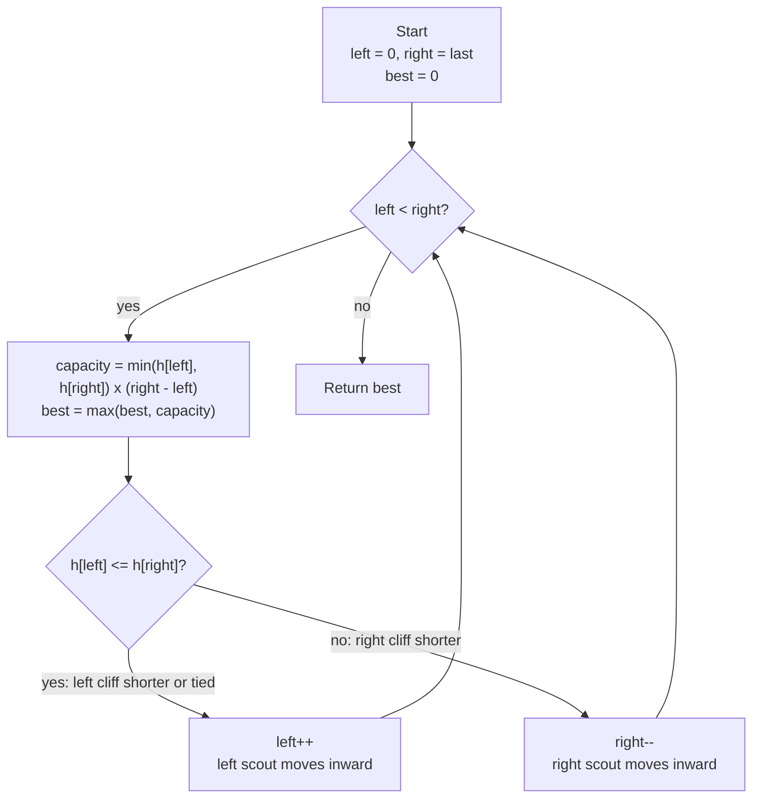

# Container With Most Water - Mental Model

## The Problem

You are given an integer array `height` of length `n`. There are `n` vertical lines drawn such that the two endpoints of the `i`th line are `(i, 0)` and `(i, height[i])`. Find two lines that together with the x-axis form a container, such that the container contains the most water. Return the maximum amount of water a container can store. Notice that you may not slant the container.

**Example 1:**
```
Input: height = [1,8,6,2,5,4,8,3,7]
Output: 49
```

**Example 2:**
```
Input: height = [1,1]
Output: 1
```

## The Canyon Scout Analogy

Imagine you're a geologist scouting a canyon for the perfect natural reservoir site. Along the canyon floor you have a row of cliff faces, each recorded as a number representing the height of that wall. You need to select two of these walls to form the sides of a reservoir. The water inside can only rise as high as the shorter of the two walls — above that it spills over. The basin's capacity is that water level times the horizontal distance between the two walls.

Your challenge: which two walls should you pick to trap the most water?

You station two scouts — one at the leftmost cliff, one at the rightmost. This gives you the widest possible basin. You record the capacity. Then the scouts hike inward, one step at a time, always moving the scout standing at the shorter wall. The reasoning: moving the taller scout inward can only hurt — the basin gets narrower while the water level is still capped by the shorter wall that didn't move. Moving the shorter scout is the only action with any chance of improvement, because the next wall might be taller enough to compensate for the reduced width.

The scouts keep squeezing inward, recording capacity at each position, until they finally meet. The best reading they recorded is the answer.

## Understanding the Analogy

### The Setup

You have a row of `n` canyon walls. The scouts start at opposite ends: the left scout at wall 0, the right scout at wall `n − 1`. This starting position gives the widest possible survey span — maximum width, though not necessarily the optimal water level.

The scouts track one running record: the best basin capacity seen so far. Every time they take a new measurement, they update the record if the new reading beats it. When the scouts finally meet, the record holds the answer.

### The Shorter Wall Rule

When the scouts stand at two walls of different heights, the water level is dictated by the shorter wall — water spills over anything lower. Moving the taller scout inward reduces the basin's width while doing nothing to raise the water level (the shorter wall still caps it). The result can only be equal or worse.

Moving the shorter scout inward also reduces the width, but now there's an opportunity: the next wall might be taller. A taller wall on that side raises the water level, which could more than compensate for the reduced distance. It might not — but it's the only move that has any chance of finding a better basin.

When both walls are exactly the same height, moving either scout is safe. Both walls are equally the "shorter" constraint; moving one leaves the search no worse off than moving the other.

### Why This Approach

The two-scout strategy works because every inward step provably eliminates a wall from contention. When the left scout at `h[left]` is the shorter wall, every pairing of that scout with a wall further right than the current right scout has the same water level cap (`h[left]`) but less width — strictly worse. So the left scout moves on. The argument is symmetric for the right scout.

This means the scouts examine at most `n − 1` basins total (one per step), instead of the `n(n−1)/2` pairs a brute-force search would require. That's the leap from O(n²) to O(n).

## How I Think Through This

I place two scouts: `left` at index 0 and `right` at `height.length - 1`. The widest possible basin is already in front of me. I initialize `best` to 0 to track the largest capacity found so far.

While `left` is still to the left of `right`, I measure the current basin: the water level is `Math.min(height[left], height[right])` — water spills over the shorter wall — and the width is `right - left`. Multiplying gives the capacity; I update `best` if it's larger. Then comes the one decision: if `height[left] <= height[right]`, the left scout moves right (`left++`); otherwise the right scout moves left (`right--`). When the scouts finally meet, `best` holds the answer.

Take `[1, 8, 6, 7]`.

:::trace-lr
[
  {"chars": ["1","8","6","7"], "L": 0, "R": 3, "action": null, "label": "Left cliff h=1, right cliff h=7. Capacity = min(1,7)×3 = 3. Best=3. Left is shorter — left scout moves inward."},
  {"chars": ["1","8","6","7"], "L": 1, "R": 3, "action": "mismatch", "label": "Left cliff h=8, right cliff h=7. Capacity = min(8,7)×2 = 14. Best=14. Right is shorter — right scout moves inward."},
  {"chars": ["1","8","6","7"], "L": 1, "R": 2, "action": "mismatch", "label": "Left cliff h=8, right cliff h=6. Capacity = min(8,6)×1 = 6. Best stays 14. Right is shorter — right scout moves inward."},
  {"chars": ["1","8","6","7"], "L": 1, "R": 1, "action": "done", "label": "Scouts meet. Best basin: capacity 14."}
]
:::

---

## Building the Algorithm

Each step introduces one concept from the Canyon Scout approach, then a StackBlitz embed to try it.

### Step 1: The First Measurement

Before any hiking can begin, the scouts need to take their starting positions. The left scout stands at wall 0 — the very first cliff. The right scout stands at wall `n − 1` — the very last. This is the widest possible basin, and the scouts' first measurement.

For two-wall inputs, this starting measurement is the only measurement. The scouts are already at the extremes with nowhere left to hike. Whatever capacity they read here is the answer.

:::trace-lr
[
  {"chars": ["3","1"], "L": 0, "R": 1, "action": null, "label": "Left scout at cliff h=3, right scout at cliff h=1. Water level = min(3,1) = 1. Width = 1. Capacity = 1."},
  {"chars": ["3","1"], "L": 0, "R": 1, "action": "done", "label": "Only two walls — scouts are already meeting. Return 1."}
]
:::

:::stackblitz{file="step1-problem.ts" step=1 total=2 solution="step1-solution.ts"}

<details>
<summary>Hints & gotchas</summary>

- **Width is the gap, not the count**: The width between wall `L` and wall `R` is `R − L`, not `R − L + 1`. The horizontal distance between index 0 and index 1 is 1 unit, not 2.
- **Water level is the minimum**: The water level is `Math.min(height[left], height[right])` — water can't rise above the shorter wall or it spills over.
- **Step 1 scope**: Just place the scouts at the extremes and return the one measurement from that position. No loop yet.

</details>

### Step 2: The Scout Squeeze

Now add the hiking loop. While the two scouts haven't met (`left < right`), measure the current basin, update `best`, and move the shorter-wall scout one step inward. The scouts hike toward each other until they meet — and the best reading along the way is the answer.

:::trace-lr
[
  {"chars": ["1","8","6","7"], "L": 0, "R": 3, "action": null, "label": "Left h=1, right h=7. Capacity=3. Best=3. Left is shorter — L++."},
  {"chars": ["1","8","6","7"], "L": 1, "R": 3, "action": "mismatch", "label": "Left h=8, right h=7. Capacity=14. Best=14. Right is shorter — R--."},
  {"chars": ["1","8","6","7"], "L": 1, "R": 2, "action": "mismatch", "label": "Left h=8, right h=6. Capacity=6. Best stays 14. Right is shorter — R--."},
  {"chars": ["1","8","6","7"], "L": 1, "R": 1, "action": "done", "label": "Scouts meet. Return 14."}
]
:::

:::stackblitz{file="step2-problem.ts" step=2 total=2 solution="step2-solution.ts"}

<details>
<summary>Hints & gotchas</summary>

- **Track the best, not the last**: The final measurement is rarely the answer. Update `best = Math.max(best, capacity)` on every iteration, not just at the end.
- **Move the shorter-wall scout**: If `height[left] <= height[right]`, move `left++`. Otherwise `right--`. Getting this backwards sends the scouts away from the better basins.
- **Equal walls**: When `height[left] === height[right]`, either scout can move — `left++` is the conventional choice. The answer won't be missed because the best basin between two equal walls has already been recorded.
- **Loop exits, not returns**: The scouts hike until `left === right`. They can't measure a single-wall basin, so the loop condition is `left < right` — exit without a final measurement, then return `best`.

</details>

## Canyon Scout at a Glance



## Tracing through an Example

Using `height = [1, 8, 6, 7]`:

| Step | Left Scout (left) | Left Wall h[left] | Right Scout (right) | Right Wall h[right] | Water Level | Width | Capacity | Best | Move |
|------|---|---|---|---|---|---|---|---|---|
| Start | 0 | 1 | 3 | 7 | 1 | 3 | 3 | 3 | left++ (left shorter) |
| 1 | 1 | 8 | 3 | 7 | 7 | 2 | 14 | 14 | right-- (right shorter) |
| 2 | 1 | 8 | 2 | 6 | 6 | 1 | 6 | 14 | right-- (right shorter) |
| Done | 1 | 8 | 1 | 8 | — | 0 | — | — | left === right, return 14 |

---

## Common Misconceptions

**"I should move the taller scout inward — the taller wall is what limits the water"** — The taller wall isn't the bottleneck; the shorter one is. Water can only rise as high as the shorter wall before it spills over. Moving the taller scout keeps the same water level cap (the shorter wall didn't move) and reduces the width — a strict loss. Only moving the shorter scout has any chance of raising the water level.

**"I need to check every pair to guarantee I find the optimal one"** — The Shorter Wall Rule proves that every inward step eliminates an entire column of pairs from contention. When the left scout is the shorter wall, every pairing of that scout with anything further right than the current right scout is guaranteed to be worse — same water level cap, less width. Those pairs can be safely skipped.

**"Width is R − L + 1, counting both walls"** — Width is the horizontal gap between the walls, not the count of walls. The gap between index 0 and index 3 is 3 units, not 4. Use `right - left`, not `right - left + 1`.

**"The starting position (widest span) is always a strong candidate and should be special-cased"** — The starting span is maximum width, but the water level is capped by the shorter of the two outermost walls. A narrower span with two tall walls can easily outperform the widest span. It is just the first measurement — no different in logic from any other.

**"When both walls are equal I should stop — that must be the peak"** — Equal walls just mean the water level is capped by that shared height. Moving one scout inward might reveal a taller wall that produces a larger basin at the reduced width. Record the measurement, move on, and let `best` decide.

---

## Complete Solution

:::stackblitz{file="solution.ts" step=2 total=2 solution="solution.ts"}
