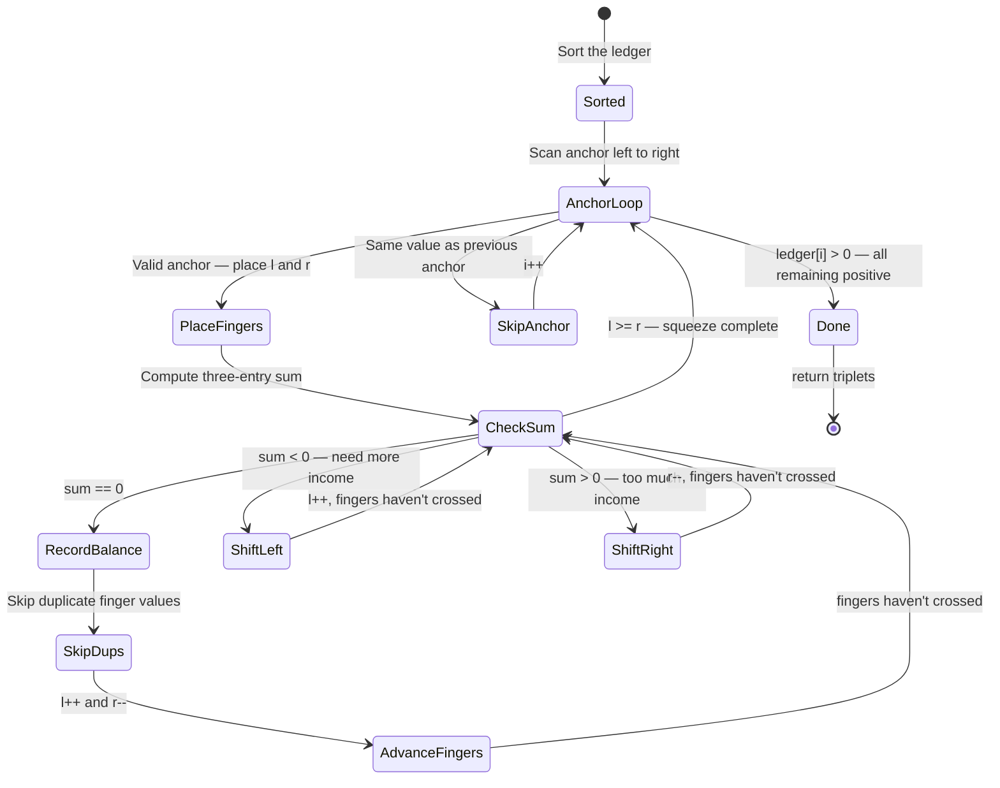

# 3Sum - Mental Model

## The Problem

Given an integer array `nums`, return all the triplets `[nums[i], nums[j], nums[k]]` such that `i != j`, `i != k`, and `j != k`, and `nums[i] + nums[j] + nums[k] == 0`. Notice that the solution set must not contain duplicate triplets.

**Example 1:**
```
Input: nums = [-1,0,1,2,-1,-4]
Output: [[-1,-1,2],[-1,0,1]]
```

**Example 2:**
```
Input: nums = [0,1,1]
Output: []
```

**Example 3:**
```
Input: nums = [0,0,0]
Output: [[0,0,0]]
```

## The Zero-Balance Ledger Analogy

Imagine you're an accountant reviewing a company's transaction ledger. Each entry is either a positive number (income received) or a negative number (expense paid). Your task: find every combination of exactly three entries whose values add up to precisely zero — a perfect three-way balance where the income exactly cancels the expenses.

The first thing a smart accountant does before searching is sort the ledger — arranging entries from the largest expense (most negative) on the left to the largest income (most positive) on the right. This ordering is what makes efficient searching possible. With entries sorted, moving rightward always means more income (larger values), and moving leftward always means more expense (smaller values).

With the ledger sorted, you work through it as the **anchor**. You pin one entry at a time — starting with the largest expense — and ask: given this anchor, which two other entries together offset it to zero? Rather than checking every possible pair, you place one finger on the entry just after the anchor (the next-least-negative available) and another finger at the far right (the largest income). If the three entries sum to too much negative, you need more income: shift the left finger rightward to a larger value. If they sum to too much positive, you have too much income: shift the right finger leftward to a smaller value. The fingers squeeze inward until they meet, at which point every useful pairing for this anchor has been tested.

Each time you find a perfect balance, you record the triplet. But here's the accountant's discipline: if two adjacent entries have the same value, they produce identical triplets — so you skip over duplicates to keep the results clean.

## Understanding the Analogy

### The Setup

You have a shuffled list of transaction amounts. After sorting, the largest expenses sit at the left end, the largest incomes at the right end, and zero-values are in the middle. You need every group of three entries — one anchor and two finger positions — that nets to exactly zero.

You will work through the ledger from left to right, assigning each entry in turn as the anchor. Two reading fingers — left and right — squeeze through the remaining entries. Every time the fingers cross, you advance the anchor one position and start a fresh squeeze.

### The Anchor and the Two Fingers

The anchor is a fixed commitment: you've decided to include this specific entry in every triplet you consider during this round. The left finger starts just one position to the right of the anchor (the smallest available remaining entry), and the right finger starts at the far end of the ledger (the largest available entry).

Now comes the squeeze logic. Sum the three values. If the sum is negative — you're short — the left finger is pointing at a value that's too small or too negative. Shift it rightward to find something larger. If the sum is positive — you've overshot — the right finger is pointing at a value that's too big. Shift it leftward to find something smaller. If the sum is exactly zero, record the triplet, then advance both fingers inward (they've found their match; no point re-examining those exact values).

The anchor has one early-exit rule: if the anchor value is positive, stop the entire search. The ledger is sorted, so every entry to the right of a positive anchor is also positive. Three positive numbers can never sum to zero — there's nothing left to find.

### Why This Approach

A brute-force search would check every triplet: three nested loops, O(n³). Sorting plus the two-finger squeeze brings this down to O(n²): one O(n log n) sort, then for each of the n anchor positions, an inner scan that costs O(n) in total (the fingers only move inward, never outward). The sorted order is what makes the squeeze decisive — at every step, you know with certainty which direction improves the sum, so no step is wasted.

## How I Think Through This

I sort a copy of `nums` into `ledger`, then initialize `triplets` as an empty results array. I scan the anchor index `i` from left to right, stopping two positions before the end (I need at least two entries to the right for the fingers to work). The first thing I check for each anchor: if `ledger[i] > 0`, I break immediately — from here on everything is positive and no triplet can balance. If `i > 0` and `ledger[i]` equals `ledger[i - 1]`, I skip — this anchor value was already fully explored on the previous round.

With a valid anchor at `ledger[i]`, I place the left finger at `l = i + 1` and the right finger at `r = ledger.length - 1`. I then squeeze: compute `sum = ledger[i] + ledger[l] + ledger[r]`. If `sum === 0`, I push the triplet, then skip over any duplicate left-finger values and duplicate right-finger values before advancing both fingers inward. If `sum < 0` (too much expense), `l++`. If `sum > 0` (too much income), `r--`. The loop ends when `l` meets `r`.

Take `[-4, -1, -1, 0, 1, 2]` (sorted from `[-1, 0, 1, 2, -1, -4]`). Anchor `i = 1` (value `−1`):

:::trace-lr
[
  {"chars": ["-4","-1","-1","0","1","2"], "L": 2, "R": 5, "action": "match", "label": "Anchor pinned at index 1 (value −1, shown grey). Left finger on index 2 (value −1), right finger on index 5 (value 2). Sum = −1+(−1)+2 = 0. Balance found — record [−1,−1,2]."},
  {"chars": ["-4","-1","-1","0","1","2"], "L": 3, "R": 4, "action": "match", "label": "Both fingers squeeze inward. Left finger on index 3 (value 0), right finger on index 4 (value 1). Sum = −1+0+1 = 0. Balance again — record [−1,0,1]."},
  {"chars": ["-4","-1","-1","0","1","2"], "L": 4, "R": 3, "action": "done", "label": "Both fingers advance. Left finger (4) has crossed right finger (3). Squeeze complete for this anchor."}
]
:::

---

## Building the Algorithm

Each step introduces one concept from the Zero-Balance Ledger, then a StackBlitz embed to try it.

### Step 1: Sort the Ledger and Pin the Anchor

Before any squeezing can happen, the accountant sorts the ledger. This is the step that makes everything else possible — without a sorted order, you cannot know which direction improves a sum.

With the ledger sorted, you scan the anchor from left to right. For each anchor position, two things can short-circuit the search before any fingers are placed. First, if the anchor entry is positive, every remaining entry to its right is also positive — three positive numbers can never cancel, so you stop the entire search. Second, if the anchor's value is identical to the previous anchor, you would find the exact same set of triplets again — so you skip.

When neither short-circuit fires, you've identified a valid anchor. The outer loop's job is done for this position; the inner squeeze (step 2) picks up from here. For now, think only about what conditions make an anchor worth exploring.

:::stackblitz{file="step1-problem.ts" step=1 total=2 solution="step1-solution.ts"}

<details>
<summary>Hints & gotchas</summary>

- **Sort a copy, not the original**: `[...nums].sort((a, b) => a - b)` — the numeric comparator is required; JavaScript's default `.sort()` treats numbers as strings and will order `10` before `2`.
- **Stop vs skip**: When the anchor is positive, use `break` (nothing further can work). When the anchor duplicates the previous, use `continue` (this anchor is useless but later ones may not be).
- **Loop bound**: The anchor loop should run while `i < ledger.length - 2` — you need at least two entries remaining to the right for the fingers to operate.

</details>

### Step 2: The Squeeze

With the anchor pinned, place two fingers on what remains: the left finger starts just after the anchor (`l = i + 1`), the right finger starts at the far end (`r = ledger.length - 1`). Now squeeze.

Each iteration computes the three-entry sum. A perfect zero means you've found a balance — record the triplet and advance both fingers inward. But before advancing, skip over any repeated values: if the entry to the right of the left finger is the same value, the next sum would be identical — slide past it. Do the same on the right side. This keeps your results free of duplicate triplets.

When the sum is negative, the left finger is pointing at a value that's too small — shift it rightward. When the sum is positive, the right finger is pointing at a value that's too large — shift it leftward. Keep squeezing until the fingers cross.

:::trace-lr
[
  {"chars": ["-4","-1","-1","0","1","2"], "L": 2, "R": 5, "action": "match", "label": "Anchor −1. Left finger on −1 (index 2), right on 2 (index 5). Sum=0 — record [−1,−1,2]. Skip left dups (none), skip right dups (none). Advance both."},
  {"chars": ["-4","-1","-1","0","1","2"], "L": 3, "R": 4, "action": "match", "label": "Left finger on 0 (index 3), right on 1 (index 4). Sum=0 — record [−1,0,1]. Advance both."},
  {"chars": ["-4","-1","-1","0","1","2"], "L": 4, "R": 3, "action": "done", "label": "Fingers crossed — inner squeeze done for anchor −1. Move to next anchor."}
]
:::

:::stackblitz{file="step2-problem.ts" step=2 total=2 solution="step2-solution.ts"}

<details>
<summary>Hints & gotchas</summary>

- **Where the inner loop lives**: The `while (l < r)` loop goes inside the outer `for` loop, after the two short-circuit checks. Each anchor gets a fresh `l = i + 1` and `r = ledger.length - 1`.
- **Dedup after recording**: Skip duplicate left values with `while (l < r && ledger[l] === ledger[l + 1]) l++`, then do the same on the right before the final `l++; r--`. The guard `l < r` prevents the pointers from crossing during the skip.
- **Move one direction only**: When `sum < 0`, only `l++`. When `sum > 0`, only `r--`. Never move both at once for a non-zero sum.
- **Dedup is only for matches**: The duplicate-skipping inner while-loops run only inside the `sum === 0` branch. For `sum < 0` or `sum > 0`, you just move the single appropriate finger.

</details>

---

## The Zero-Balance Ledger at a Glance



## Tracing through an Example

Input: `[-1, 0, 1, 2, -1, -4]` → sorted: `[-4, -1, -1, 0, 1, 2]`

| Phase | Anchor Entry | Left Finger (l) | Right Finger (r) | Left Value | Right Value | 3-Entry Sum | Decision | Balance Sheet |
|-------|-------------|-----------------|-----------------|------------|-------------|------------|----------|---------------|
| Start | i=0, val=−4 | l=1 | r=5 | −1 | 2 | −3 | Too low → l++ | [] |
| | i=0, val=−4 | l=2 | r=5 | −1 | 2 | −3 | Too low → l++ | [] |
| | i=0, val=−4 | l=3 | r=5 | 0 | 2 | −2 | Too low → l++ | [] |
| | i=0, val=−4 | l=4 | r=5 | 1 | 2 | −1 | Too low → l++ | [] |
| | i=0, val=−4 | l=5 | r=5 | — | — | — | l≥r → next anchor | [] |
| | i=1, val=−1 | l=2 | r=5 | −1 | 2 | 0 | Balance! record, skip dups, l++ r-- | [[−1,−1,2]] |
| | i=1, val=−1 | l=3 | r=4 | 0 | 1 | 0 | Balance! record, l++ r-- | [[−1,−1,2],[−1,0,1]] |
| | i=1, val=−1 | l=4 | r=3 | — | — | — | l≥r → next anchor | |
| | i=2, val=−1 | — | — | — | — | — | Dup anchor (same as i=1) → skip | |
| | i=3, val=0 | l=4 | r=5 | 1 | 2 | 3 | Too high → r-- | |
| | i=3, val=0 | l=4 | r=4 | — | — | — | l≥r → next anchor | |
| Done | i=4 would be val=1 | — | — | — | — | — | anchor > 0 → break | [[−1,−1,2],[−1,0,1]] |

---

## Common Misconceptions

**"I can sort the original array in place without worrying about indices"** — The sort changes index positions, so returning triplet values rather than indices is fine here. But sorting in place mutates the caller's data. Sort a copy (`[...nums].sort(...)`) to keep the function pure and avoid surprising the caller.

**"I need to skip duplicates by comparing to already-recorded triplets"** — Checking the growing result array for duplicates is O(n) per insertion and quickly becomes expensive. The sorted ledger makes dedup free: after recording a match, skip over consecutive equal values on both sides before advancing the fingers. The sorted order guarantees that any duplicate value sits adjacent to the current position.

**"When the sum equals zero, I advance only one finger"** — When you find a balance, both entries — left and right — are consumed. Advancing only one means you will try the same consumed entry again with a new partner, producing a sum that cannot be zero (you just used the only partner that worked), wasting an iteration. Always advance both fingers inward after a match.

**"The outer loop runs all the way to the end of the array"** — You need at least two entries to the right of the anchor for the fingers to operate. The loop bound is `i < ledger.length - 2`, not `i < ledger.length`. An anchor at the second-to-last position leaves only one entry for both fingers — impossible.

**"I should use `continue` when the anchor is positive"** — Use `break`, not `continue`. The ledger is sorted, so once an anchor is positive, every subsequent anchor is also positive. There is nothing useful to the right. `continue` would wastefully test all remaining positive anchors; `break` ends the search immediately.

## Complete Solution

:::stackblitz{file="solution.ts" step=2 total=2 solution="solution.ts"}
