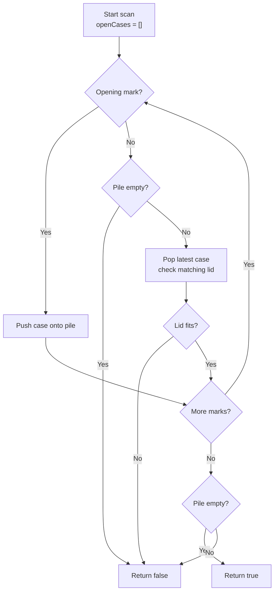

# Valid Parentheses - Mental Model

## The Problem

Given a string `s` containing just the characters `'('`, `')'`, `'{'`, `'}'`, `'['` and `']'`, determine if the input string is valid. An input string is valid if open brackets are closed by the same type of brackets, open brackets are closed in the correct order, and every close bracket has a corresponding open bracket of the same type.

**Example 1:**
```
Input: s = "()"
Output: true
```

**Example 2:**
```
Input: s = "()[]{}"
Output: true
```

**Example 3:**
```
Input: s = "(]"
Output: false
```

**Example 4:**
```
Input: s = "([)]"
Output: false
```

**Example 5:**
```
Input: s = "{[]}"
Output: true
```

## The Nested Storage Cases Analogy

Picture a warehouse where you pack fragile items inside storage cases. A round item goes into a round case `(`, a square item goes into a square case `[`, and a crate item goes into a crate case `{`. Every time you open a new case, you place it on the top of a pile because that is the case you are actively working inside right now.

Closing marks are the lids. When a lid arrives, it cannot close some older case buried deeper in the pile. It must close the case that is currently on top. If the newest open case was square, only a square lid fits. If you try to place a round lid on top of a square case, the packing order is broken immediately.

That top-of-pile rule is the whole reason a stack fits this problem so naturally. The most recently opened case is always the first one that must be closed. Last opened, first closed.

So the job is simple to say but strict to execute: walk through the packing instructions from left to right, stack every newly opened case, and whenever a lid appears, make sure it seals the case sitting on top of the pile. At the end, the pile must be empty. If any case is still open, the packing job is incomplete.

## Understanding the Analogy

### The Setup

You are reading a packing log one symbol at a time. Some symbols mean "open a new case." Others mean "place a lid." The order in the log cannot be rearranged, and you are not allowed to peek ahead and fix mistakes later. You must decide in the moment whether the warehouse process is still valid.

The warehouse pile matters because nested cases behave like rooms inside rooms. If you opened a round case, then inside it opened a square case, you must seal the square one before you can return to the round one. The current workspace is always the case on top of the pile.

### The Open-Case Pile

The pile stores every case that has been opened but not yet sealed. Opening a new case means placing it on top. Sealing a case means removing the top one. If a lid arrives when the pile is empty, that means a worker is trying to seal a case that was never opened.

The matching rule is equally important. A lid is not just "some closing action." Each lid belongs to one specific case shape. The newest open case determines which lid is acceptable next. Nothing deeper in the pile is allowed to vote.

### Why This Approach

Without the pile, you would lose track of which unfinished case is currently active. You might know how many cases are open, but not which shape is on top. That is exactly why a plain counter is not enough: `([)]` has balanced counts, but the lids arrive in the wrong order.

The stack keeps only the unfinished cases and always exposes the one that matters most. Every symbol causes one small action: push an opening case, or check and pop a matching lid. That gives a single left-to-right pass with O(n) time and O(n) worst-case extra space when everything opens before anything closes.

## How I Think Through This

I scan `s` from left to right while keeping a stack named `openCases`. Each opening mark gets pushed because that case is now the active unfinished one. Each closing mark means I need to inspect the latest open case only. The invariant is: **`openCases[openCases.length - 1]` is always the only case the next lid is allowed to close**. If a closing mark appears when the stack is empty, or if it does not match the kind of case on top, I return `false` immediately. If I finish the scan and the stack is empty, every case was closed in the right order, so I return `true`.

Take `"([{}])"`.

:::trace-sq
[
  {
    "structures": [
      { "kind": "stack", "label": "openCases", "items": [], "color": "blue" }
    ],
    "action": null,
    "label": "Setup: the warehouse pile starts empty."
  },
  {
    "structures": [
      { "kind": "stack", "label": "openCases", "items": ["("], "color": "blue", "activeIndices": [0], "pointers": [{ "index": 0, "label": "top" }] }
    ],
    "action": "push",
    "label": "Read `(`: open a round case and place it on the pile."
  },
  {
    "structures": [
      { "kind": "stack", "label": "openCases", "items": ["(", "["], "color": "blue", "activeIndices": [1], "pointers": [{ "index": 1, "label": "top" }] }
    ],
    "action": "push",
    "label": "Read `[`: open a square case inside the round one."
  },
  {
    "structures": [
      { "kind": "stack", "label": "openCases", "items": ["(", "[", "{"], "color": "blue", "activeIndices": [2], "pointers": [{ "index": 2, "label": "top" }] }
    ],
    "action": "push",
    "label": "Read `{`: open a crate case inside the square case."
  },
  {
    "structures": [
      { "kind": "stack", "label": "openCases", "items": ["(", "["], "color": "blue", "activeIndices": [1], "pointers": [{ "index": 1, "label": "top" }] }
    ],
    "action": "pop",
    "label": "Read `}`: the top case is `{`, so the crate lid fits and that case leaves the pile."
  },
  {
    "structures": [
      { "kind": "stack", "label": "openCases", "items": ["("], "color": "blue", "activeIndices": [0], "pointers": [{ "index": 0, "label": "top" }] }
    ],
    "action": "pop",
    "label": "Read `]`: now the square case is on top, so the square lid fits next."
  },
  {
    "structures": [
      { "kind": "stack", "label": "openCases", "items": [], "color": "blue" }
    ],
    "action": "done",
    "label": "Read `)`: the round lid closes the last open case. Empty pile means valid packing."
  }
]
:::

---

## Building the Algorithm

Each step introduces one rule from the storage-case pile, then a StackBlitz embed to try it.

### Step 1: Stack the Open Cases

Start with the pile itself. Whenever you see an opening mark, place that case on top of `openCases`. Whenever you see a lid, the pile must not be empty, because some case has to be available to close. At this stage, we only teach the nesting order: newest case closes first. We are not yet checking whether the lid shape is the correct one.

That makes this step a pure pile-discipline exercise. The learner should ask: "Can I maintain the active unfinished cases so a lid always removes the latest one?"

:::trace-sq
[
  {
    "structures": [
      { "kind": "stack", "label": "openCases", "items": [], "color": "blue" }
    ],
    "action": null,
    "label": "Start with an empty pile."
  },
  {
    "structures": [
      { "kind": "stack", "label": "openCases", "items": ["("], "color": "blue", "activeIndices": [0], "pointers": [{ "index": 0, "label": "top" }] }
    ],
    "action": "push",
    "label": "Read `(`: place a new case on top."
  },
  {
    "structures": [
      { "kind": "stack", "label": "openCases", "items": ["(", "["], "color": "blue", "activeIndices": [1], "pointers": [{ "index": 1, "label": "top" }] }
    ],
    "action": "push",
    "label": "Read `[`: nested case, so it becomes the new top."
  },
  {
    "structures": [
      { "kind": "stack", "label": "openCases", "items": ["("], "color": "blue", "activeIndices": [0], "pointers": [{ "index": 0, "label": "top" }] }
    ],
    "action": "pop",
    "label": "Read `]`: for now, any lid removes the newest open case."
  },
  {
    "structures": [
      { "kind": "stack", "label": "openCases", "items": [], "color": "blue" }
    ],
    "action": "pop",
    "label": "Read `)`: the last open case leaves the pile too."
  }
]
:::

:::stackblitz{file="step1-problem.ts" step=1 total=2 solution="step1-solution.ts"}

<details>
  <summary>Hints & gotchas</summary>

  - **Top case only**: a lid never reaches past the top of the pile to close an older case.
  - **Empty pile check**: if a lid arrives and `openCases` is empty, the warehouse log is broken immediately.
  - **End-of-log rule**: if any cases remain on the pile after the scan, the job is unfinished.
</details>

### Step 2: Match the Latest Lid

Now add the shape check. The top case does not merely need some lid; it needs its own lid. When a closing mark arrives, remove the latest open case and verify that the lid belongs to that exact shape.

This is the moment the false positives disappear. In step 1, `([)]` looked acceptable because the pile depth went up and down correctly. Step 2 fixes that by enforcing that a square case must receive a square lid before the round case underneath can be touched.

:::trace-sq
[
  {
    "structures": [
      { "kind": "stack", "label": "openCases", "items": ["(", "["], "color": "blue", "activeIndices": [1], "pointers": [{ "index": 1, "label": "top" }] }
    ],
    "action": null,
    "label": "Before reading `)`, the newest unfinished case is `[`."
  },
  {
    "structures": [
      { "kind": "stack", "label": "openCases", "items": ["("], "color": "blue", "activeIndices": [0], "pointers": [{ "index": 0, "label": "top" }] }
    ],
    "action": "peek",
    "label": "Pop the latest case to inspect it: the warehouse expects `]` next."
  },
  {
    "structures": [
      { "kind": "stack", "label": "openCases", "items": ["("], "color": "blue", "activeIndices": [0], "pointers": [{ "index": 0, "label": "top" }] }
    ],
    "action": "done",
    "label": "Actual lid is `)`, which does not fit `[`. Reject the log immediately."
  }
]
:::

:::stackblitz{file="step2-problem.ts" step=2 total=2 solution="step2-solution.ts"}

<details>
  <summary>Hints & gotchas</summary>

  - **Balanced counts are not enough**: `([)]` opens two and closes two, but the wrong lid arrives for the top case.
  - **Compare against the popped case**: the newest unfinished case decides what closing mark is legal next.
  - **Do not forget the final empty-pile check**: even perfect matches in the middle do not help if some cases never get sealed.
</details>

## The Storage Cases at a Glance



---

## Common Misconceptions

**"If the number of opening and closing marks is balanced, the packing log must be valid."** Balanced counts only tell you how many cases were opened and closed. They do not tell you whether the newest open case got the correct lid. The right mental model is a pile of unfinished cases, not a scoreboard.

**"Any closing mark can just remove the top case as long as the pile is not empty."** That misses the shape rule. A square case cannot be sealed by a round lid just because it is the newest one. The correct mental model is that each case on the pile is waiting for one specific lid.

**"I should search deeper in the pile for a case that matches the current lid."** That would let a worker close an older outer case while a newer inner case is still open, which breaks nesting. The correct mental model is that only the top case is reachable.

**"Once I survive the scan, the string is valid."** Not if unfinished cases remain on the pile. The correct mental model is a completely sealed warehouse: valid means no loose lids and no open cases left behind.

## Complete Solution

:::stackblitz{file="solution.ts" step=2 total=2 solution="solution.ts"}
