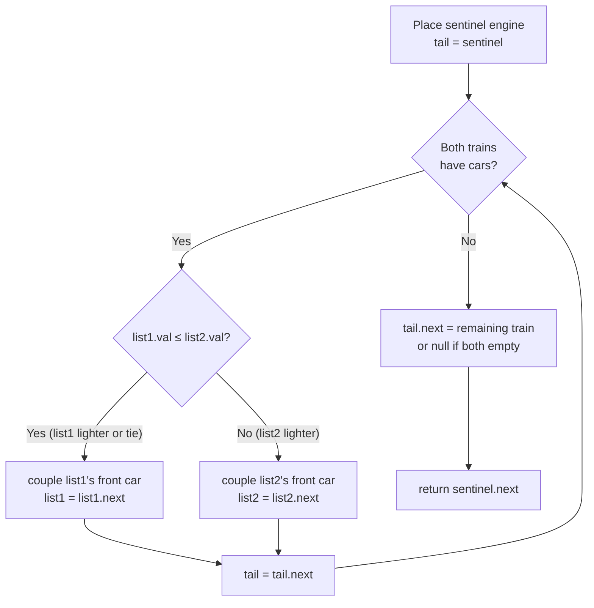

# Merge Two Sorted Lists - Mental Model

## The Problem

You are given the heads of two sorted linked lists `list1` and `list2`. Merge the two lists into one sorted list. The list should be made by splicing together the nodes of the first two lists. Return the head of the merged linked list.

**Example 1:**
```
Input: list1 = [1,2,4], list2 = [1,3,4]
Output: [1,1,2,3,4,4]
```

**Example 2:**
```
Input: list1 = [], list2 = []
Output: []
```

**Example 3:**
```
Input: list1 = [], list2 = [0]
Output: [0]
```

## The Train Merger Analogy

Imagine two freight trains pulling into a switching yard. Both have been carefully pre-sorted: the lightest cargo car is at the front of each train, and every car behind it is heavier than the one before. Your job as the yard conductor is to build one unified train where all cars — from both trains — remain sorted lightest to heaviest.

You stand at the coupling station with a hook in hand. You look at the front car of each incoming train and always couple whichever car is lighter onto your growing merged train. That car disconnects from its original train, hooks onto your merged train, and that train's next car rolls forward to the front. You repeat: compare the two front cars, couple the lighter, advance one train. When one train runs completely out of cars, you just couple the remaining cars from the other train directly — they're already sorted and linked, so the whole tail connects in one move.

Before you couple the very first real cargo car, you place a **sentinel engine** — a lightweight placeholder locomotive — at the head of your emerging merged train. It carries no cargo; it is just a fixed point to attach the first coupling. Every coupling after that simply extends from the tail of the merged train. When the merge is complete, you detach the sentinel engine and return everything behind it as the head of the merged cargo train.

The sentinel engine is the key insight. Without it, you would need to handle the first coupling as a special case — "is this the very first car? If so, set it as the new head." With it, every coupling is identical: you always just extend from whatever node `tail` is pointing to. One pattern, zero special cases.

## Understanding the Analogy

### The Setup

Two freight trains pull in, each pre-sorted from lightest to heaviest. You have an empty staging track where the merged train will form, and a coupling hook — a `tail` pointer — that tracks the last car coupled onto it. Both trains shrink by one car each time you pull from them. The merged train grows by one car each time.

You don't know how long each train is. The comparison loop runs until one of them runs out entirely. At that point, the remaining train (however many cars it still has) is already sorted — you just couple it wholesale onto the tail.

### The Sentinel Engine

The first coupling creates a subtle problem: `tail` is supposed to point to the last car on the merged train, but when you're coupling the very first car, there is no merged train yet. You'd need a conditional: "if the merged train is empty, set this as the head; otherwise, extend from tail."

The sentinel engine eliminates this entirely. You place an empty placeholder node at position zero. Now `tail` is always valid — it always points to something real. Every coupling is `tail.next = chosenCar; tail = tail.next`. After the merge, `sentinel.next` is the first real cargo car — the head you return. The sentinel itself is discarded.

### Why This Approach

Each coupling looks at exactly two nodes — the current front of each train — and makes one O(1) decision. There are exactly `m + n` total cars, so the loop runs at most `m + n` times. The whole merge is O(m + n) time and O(1) extra space (only the sentinel is allocated; every node was already part of one of the input trains).

The alternative — loading both trains into an array and sorting — ignores the fact that both inputs are already sorted. Sorting costs O((m+n) log(m+n)), which wastes the pre-sorted property. Walking the two sorted trains together converts that free property directly into linear time.

---

## How I Think Through This

I begin by placing the sentinel engine and setting `tail = sentinel`. That gives me a valid coupling point before I've touched a single real car. Then I enter a loop that runs as long as both trains have cars: I compare `list1.val` and `list2.val`, couple the lighter car onto `tail.next`, advance the pointer on that train only, then advance `tail` to the node I just coupled. Each iteration couples exactly one car.

When the loop exits — because one train (or both) has run out — I set `tail.next = list1 !== null ? list1 : list2`. This hitches the remaining chain from whichever train still has cargo, or null if both are exhausted. Then I return `sentinel.next`: the first real car behind the placeholder.

Take `list1 = [1, 2, 4]`, `list2 = [1, 3, 4]`.

:::trace-lr
[
  {"chars":["1","2","4","↓","1","3","4"],"L":0,"R":4,"action":null,"label":"Sentinel placed, tail=sentinel. Compare list1 front (1) vs list2 front (1)."},
  {"chars":["1","2","4","↓","1","3","4"],"L":1,"R":4,"action":"match","label":"1 ≤ 1 → couple list1's car 1. list1 advances to 2."},
  {"chars":["1","2","4","↓","1","3","4"],"L":1,"R":5,"action":"mismatch","label":"2 > 1 → couple list2's car 1. list2 advances to 3."},
  {"chars":["1","2","4","↓","1","3","4"],"L":3,"R":6,"action":"done","label":"...3 more couplings. list1 exhausted → tail.next = list2's remaining [4]. Merged: [1,1,2,3,4,4] ✓"}
]
:::

## Building the Algorithm

Each step introduces one concept from the Train Merger, then a StackBlitz embed to try it.

### Step 1: The Sentinel Engine and the Empty Train Gate

Before any coupling happens, place the sentinel engine and set the coupling hook (`tail`) at that placeholder. The structural frame of the algorithm is: a `while` loop that runs as long as both trains have cars, and a tail attachment after the loop for any remaining cars.

When both input trains are empty, the loop never runs and `tail.next` gets `null`. When one train is empty at the start, the loop skips entirely and the non-empty train attaches directly to the sentinel. These are the only cases this step handles on its own.

:::stackblitz{file="step1-problem.ts" step=1 total=2 solution="step1-solution.ts"}

<details>
<summary>Hints & gotchas</summary>

- **What to return**: You create `sentinel` but return `sentinel.next` — not `sentinel`. The sentinel engine has no cargo; only what comes behind it.
- **Empty train cases**: The while condition `list1 !== null && list2 !== null` means the loop never runs if either input is null. The tail attachment still fires, correctly returning the non-null train (or null if both are empty).
- **Where tail starts**: `tail` begins at `sentinel`, not at `list1` or `list2`. It always points to the last node of the *merged* train.

</details>

### Step 2: The Coupling Decision

Now fill in the loop body. Each iteration, compare the two front cars. Couple the lighter one onto `tail.next`. Advance that train's pointer to its next car. Then advance `tail` to the car just coupled.

:::trace-lr
[
  {"chars":["1","2","4","↓","1","3","4"],"L":0,"R":4,"action":null,"label":"Sentinel placed. list1 head=1, list2 head=1."},
  {"chars":["1","2","4","↓","1","3","4"],"L":1,"R":4,"action":"match","label":"1 ≤ 1 → couple list1's car 1. list1 → 2. tail advances."},
  {"chars":["1","2","4","↓","1","3","4"],"L":1,"R":5,"action":"mismatch","label":"2 > 1 → couple list2's car 1. list2 → 3. tail advances."},
  {"chars":["1","2","4","↓","1","3","4"],"L":2,"R":5,"action":"match","label":"2 < 3 → couple list1's car 2. list1 → 4. tail advances."},
  {"chars":["1","2","4","↓","1","3","4"],"L":2,"R":6,"action":"mismatch","label":"4 > 3 → couple list2's car 3. list2 → 4. tail advances."},
  {"chars":["1","2","4","↓","1","3","4"],"L":3,"R":6,"action":"done","label":"4 ≤ 4 → couple list1's car 4. list1 exhausted → tail.next = list2's remaining [4]. Merged: [1,1,2,3,4,4] ✓"}
]
:::

:::stackblitz{file="step2-problem.ts" step=2 total=2 solution="step2-solution.ts"}

<details>
<summary>Hints & gotchas</summary>

- **Advance only one train**: After coupling, only the train you pulled from advances — `list1 = list1.next` or `list2 = list2.next`, never both. The other train's front car waits for the next comparison.
- **Always advance tail**: After setting `tail.next`, do `tail = tail.next` every iteration. Forgetting this means every new car overwrites the same `tail.next` slot and you return only the last-coupled node.
- **Tie-breaking**: `list1.val <= list2.val` takes from list1 on a tie. This is correct — both values are equal, so either is fine. Just pick a side consistently.
- **No null checks inside the loop**: The while condition `list1 !== null && list2 !== null` guarantees both are non-null when the body runs. No extra guards needed inside.

</details>

## Train Merger at a Glance



## Tracing through an Example

Input: `list1 = [1, 2, 4]`, `list2 = [1, 3, 4]`

| Step | list1 Front | list1.val | list2 Front | list2.val | Lighter Car | Action | Merged Train |
|------|------------|-----------|------------|-----------|-------------|--------|--------------|
| Start | node(1) | 1 | node(1) | 1 | — | Place sentinel; tail = sentinel | [] |
| 1 | node(1) | 1 | node(1) | 1 | list1 (tie) | Couple list1's 1; list1→node(2); tail→node(1) | [1] |
| 2 | node(2) | 2 | node(1) | 1 | list2 | Couple list2's 1; list2→node(3); tail→node(1) | [1,1] |
| 3 | node(2) | 2 | node(3) | 3 | list1 | Couple list1's 2; list1→node(4); tail→node(2) | [1,1,2] |
| 4 | node(4) | 4 | node(3) | 3 | list2 | Couple list2's 3; list2→node(4); tail→node(3) | [1,1,2,3] |
| 5 | node(4) | 4 | node(4) | 4 | list1 (tie) | Couple list1's 4; list1→null; tail→node(4) | [1,1,2,3,4] |
| Done | null | — | node(4) | 4 | — | list1 null; tail.next = list2's [4] | [1,1,2,3,4,4] |

---

## Common Misconceptions

**"I need to handle the case where list1 is longer than list2 separately"** — The single tail attachment `tail.next = list1 !== null ? list1 : list2` covers all length combinations in one line. Whichever train still has cars gets hitched wholesale. If both are exhausted, the expression evaluates to null. No separate branching needed.

**"The sentinel engine wastes memory — I should track the merged head separately"** — Without the sentinel, you'd need a conditional for the very first coupling: "if the merged train is empty, set this as the head; otherwise extend from tail." That's extra state to manage on every iteration. The sentinel is one allocation that eliminates that complexity entirely and is discarded immediately after.

**"I need to copy node values into new nodes for the merged list"** — Linked list merging re-points `.next` pointers. You don't create new nodes; you reuse the input nodes directly. Each coupled node just has its `.next` re-assigned to fit the merged order.

**"I should advance both list1 and list2 after each comparison"** — Only the train you just pulled from advances. If you advance both, the other train loses its unconsidered front car. One comparison, one car coupled, one train advances.

**"The remaining tail after the loop needs a separate loop to traverse"** — The remaining cars are already sorted and linked together. `tail.next = list1 !== null ? list1 : list2` attaches the entire remaining chain in O(1). No loop needed — just one pointer assignment.

---

## Complete Solution

:::stackblitz{file="solution.ts" step=2 total=2 solution="solution.ts"}
