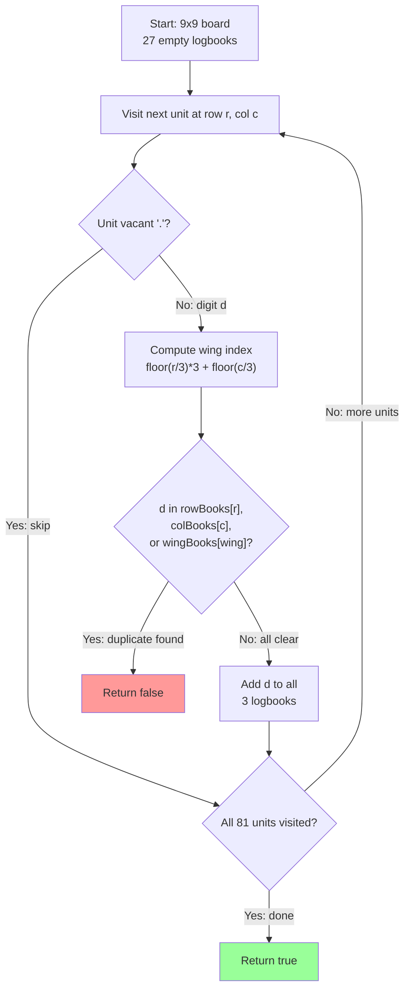

# Valid Sudoku — Mental Model

## The Problem

Determine if a 9 x 9 Sudoku board is valid. Only the filled cells need to be validated according to the following rules:

1. Each row must contain the digits `1-9` without repetition.
2. Each column must contain the digits `1-9` without repetition.
3. Each of the nine `3 x 3` sub-boxes of the grid must contain the digits `1-9` without repetition.

**Note:** A Sudoku board (partially filled) could be valid but is not necessarily solvable. Only the filled cells need to be validated according to the mentioned rules.

**Example 1:**

```
Input: board =
[["5","3",".",".","7",".",".",".","."],
 ["6",".",".","1","9","5",".",".","."],
 [".","9","8",".",".",".",".","6","."],
 ["8",".",".",".","6",".",".",".","3"],
 ["4",".",".","8",".","3",".",".","1"],
 ["7",".",".",".","2",".",".",".","6"],
 [".","6",".",".",".",".","2","8","."],
 [".",".",".",".","1","9",".",".","5"],
 [".",".",".",".","8",".",".","7","9"]]
Output: true
```

**Example 2:**

```
Input: board =
[["8","3",".",".","7",".",".",".","."],
 ["6",".",".","1","9","5",".",".","."],
 [".","9","8",".",".",".",".","6","."],
 ["8",".",".",".","6",".",".",".","3"],
 ...same remaining rows...]
Output: false
```

## The Three Logbooks Analogy

Imagine you are a building inspector visiting a nine-by-nine apartment complex. The complex is arranged in a grid: nine floors of nine units each. Some units have a resident identified by a number from 1 to 9; others are vacant, marked with a dot. Your job is to verify that no two residents sharing the same **floor**, the same **column position**, or the same **wing** have identical numbers.

The key word is _three_. Every unit in this building simultaneously belongs to three communities: its floor, its column, and the wing it sits in. Wings are nine rectangular districts you get by dividing the building into a three-by-three arrangement of three-by-three blocks — nine wings total, each containing exactly nine units. A resident number that appears twice on the same floor is a violation. A number that appears twice in the same column is also a violation. A number that appears twice in the same wing is a violation too. You must catch all three kinds in a single walk through the building.

Your tool is a set of logbooks — one per floor, one per column, one per wing. That is 27 logbooks total, all starting empty. When you visit an occupied unit, you check all three relevant logbooks before writing anything down. If any logbook already shows that number, you have found a duplicate and the board is invalid. If all three are clear, you record the number in each and move to the next unit.

## Understanding the Analogy

### The Setup

You arrive at the building with an empty clipboard. The building has 81 units in a nine-by-nine arrangement. Some units are occupied with a resident numbered 1 through 9; others are vacant and you can ignore them entirely. Your task is not to solve any puzzle — you are only checking whether the _current_ occupancy is legal. You set up 27 logbooks before beginning your walk: nine for the floors (Floor 0 through Floor 8), nine for the columns (Column 0 through Column 8), and nine for the wings (Wing 0 through Wing 8). Every logbook starts empty.

### The Wing Numbering System

Each unit sits in exactly one of nine wings. Wings are arranged like a 3×3 grid of districts, numbered left to right, top to bottom:

```
Wing 0 | Wing 1 | Wing 2
Wing 3 | Wing 4 | Wing 5
Wing 6 | Wing 7 | Wing 8
```

Given a unit on floor `r` and column `c`, you find its wing by asking two questions: which tier of wings is it in (top, middle, or bottom tier)? And which column section is it in (left, center, or right section)?

- Divide `r` by 3 and round down to get the tier (0, 1, or 2).
- Multiply by 3 to get that tier's starting wing number.
- Then divide `c` by 3 and round down to get the column section offset (0, 1, or 2).

**Add them together: `wingIndex = floor(r/3) × 3 + floor(c/3)`.**

- A unit at row 0, column 0 lands in Wing 0 (tier 0, section 0).
- A unit at row 5, column 7 lands in Wing 5 (tier 1, section 2 → 1×3+2=5).
- A unit at row 8, column 8 lands in Wing 8 (tier 2, section 2 → 2×3+2=8).

> The formula always produces a number between 0 and 8.

## The Pattern Behind the Formula: 2D → 1D Flattening

The formula `Math.floor(r/3) * 3 + Math.floor(c/3)` is an instance of a general pattern: **converting a 2D coordinate into a single 1D index**.

The universal formula is:

```
index = row * width + col
```

The index is just "how many cells came before this one?"

Two things come before cell:

- `(row, col)` every cell in the rows above it, and every cell to its left in the same row.

**Above**

The rows above contain `row * width` cells total — because each row has exactly `width` cells, and there are `row` complete rows above you (same logic as 3 bags × 4 apples = 12 apples).

**Left**

The cells to the left number `col`.

> Add them together: `row * width + col`.

In the cluster formula, the "grid" is the **3×3 arrangement of clusters**, so `width = 3`:

```
row-band  = Math.floor(r / 3)   ← which row in the cluster grid (0, 1, or 2)
col-band  = Math.floor(c / 3)   ← which col in the cluster grid (0, 1, or 2)
clusterId = row-band * 3 + col-band
```

### The problem that makes this click: 74. Search a 2D Matrix

That problem has you binary search a sorted `m × n` matrix by treating it as a flat array of `m * n` elements. At each midpoint you convert the 1D index back to a 2D cell:

```typescript
const row = Math.floor(mid / n);
const col = mid % n;
```

This is the **reverse** direction — 1D → 2D. The same formula, rearranged:

| Direction | Formula                                  | Used in                   |
| --------- | ---------------------------------------- | ------------------------- |
| 2D → 1D   | `row * width + col`                      | Valid Sudoku (cluster ID) |
| 1D → 2D   | `row = idx / width`, `col = idx % width` | Search a 2D Matrix        |

Working through 074 forces you to understand why `row * n + col` uniquely identifies any cell. Once that's in your head, the cluster formula in 036 isn't a new thing to memorize — it's the same pattern applied to a 3×3 grid of clusters.

---

### Why This Approach

The brute-force alternative would be three separate scans — once for rows, once for columns, once for boxes — each checking for duplicates. That works but multiplies the code and the passes. The three-logbooks approach handles all three constraint types in a single walk. Each unit is visited exactly once; checking three small sets costs O(1) per unit. Because the board is always 9×9, the total work is O(81) = O(1) in practice. The 27 sets are constant space.

## How I Think Through This

I start by creating three families of logbooks: `rowBooks` (9 Sets), `colBooks` (9 Sets), and `wingBooks` (9 Sets). Each Set will track which resident numbers have appeared in that community. All 27 logbooks start empty.

I then walk every unit with a nested loop over rows 0–8 and columns 0–8. For each unit, the first question is: is it vacant?

If `board[r][c]` equals `'.'`, I skip it entirely — vacant units never cause a violation.

For occupied units,

- I compute `wingIdx = floor(r/3) * 3 + floor(c/3)`,
- check whether the resident number already appears in `rowBooks[r]`, `colBooks[c]`, or `wingBooks[wingIdx]`, and return `false` immediately if any check fires.

Otherwise I add the number to all three logbooks and continue. After all 81 units pass without a violation, I return `true`.

Take a board where `(0,0)='8'`, `(1,0)='6'`, `(2,2)='8'`, and all other cells `'.'`.

:::trace-map
[
{"input": ["8","6","8"], "currentI": -1, "map": [], "highlight": null, "action": null, "label": "Begin inspection. All 27 logbooks empty.", "vars": [{"name": "unit", "value": "(0,0)"}]},
{"input": ["8","6","8"], "currentI": 0, "map": [["R0:8",null],["C0:8",null],["W0:8",null]], "highlight": "R0:8", "action": "insert", "label": "Unit (0,0)='8'. Wing 0. All three logbooks clear — record '8' in Floor 0, Column 0, Wing 0.", "vars": [{"name": "unit", "value": "(0,0)"}]},
{"input": ["8","6","8"], "currentI": 1, "map": [["R0:8",null],["C0:8",null],["W0:8",null],["R1:6",null],["C0:6",null],["W0:6",null]], "highlight": "R1:6", "action": "insert", "label": "Unit (1,0)='6'. Wing 0. All three logbooks clear — record '6' in Floor 1, Column 0, Wing 0.", "vars": [{"name": "unit", "value": "(1,0)"}]},
{"input": ["8","6","8"], "currentI": 2, "map": [["R0:8",null],["C0:8",null],["W0:8",null],["R1:6",null],["C0:6",null],["W0:6",null]], "highlight": "W0:8", "action": "found", "label": "Unit (2,2)='8'. Wing 0 (floor(2/3) x 3 + floor(2/3) = 0). Check Wing 0 logbook — '8' already recorded! Duplicate in Wing 0 → return false.", "vars": [{"name": "unit", "value": "(2,2)"}]}
]
:::

---

## Building the Algorithm

Each step introduces one concept from the building inspector's workflow, then a StackBlitz embed to try it.

### Step 1: Setting Up the Twenty-Seven Logbooks

Before the inspector takes a single step into the building, they prepare three families of logbooks: one logbook for each of the nine floors, one for each of the nine columns, and one for each of the nine wings. Every logbook starts empty and ready to record the first resident number it encounters.

In this step you also establish the inspection loop — the nested walk through every row and column — and the gate condition: if a unit is vacant (`'.'`), skip it. No check needed, no recording needed. With this in place, a fully vacant building correctly returns `true` without ever consulting a logbook.

:::stackblitz{file="step1-problem.ts" step=1 total=2 solution="step1-solution.ts"}

<details>
<summary>Hints & gotchas</summary>

- **Three families, nine in each**: `Array.from({length: 9}, () => new Set<string>())` creates a family of nine empty Sets in one line — do this three times.
- **Nested loop order matters**: Outer loop iterates rows 0–8, inner loop iterates columns 0–8. This visits every cell exactly once.
- **Skip vacant units early**: When `board[r][c] === '.'`, use `continue` to jump straight to the next iteration — checking logbooks for an empty cell causes false positives.
- **Return true at the end**: After the nested loops complete without returning false, the board has passed all checks — return `true` here.

</details>

### Step 2: The Inspection Walk

With the logbooks prepared and the loop structure in place, the inspector is ready for the actual check. For each occupied unit, three things must happen in order: compute the wing index, check all three logbooks for the resident's number, then record the number in all three logbooks.

The critical rule is **check before you record**. The inspector reads all three books before writing in any of them. If the same number appears in the same row, column, or wing twice, you need to catch it the second time it arrives — which only works if the first occurrence was already in the book when the second one is checked.

:::trace-map
[
{"input": ["5","3","5"], "currentI": -1, "map": [], "highlight": null, "action": null, "label": "Logbooks ready. Inspection walk begins."},
{"input": ["5","3","5"], "currentI": 0, "map": [["R0:5",null],["C0:5",null],["W0:5",null]], "highlight": "R0:5", "action": "insert", "label": "Unit (0,0)='5'. Wing 0. Check R0, C0, W0 — all clear. Record '5' in all three logbooks."},
{"input": ["5","3","5"], "currentI": 1, "map": [["R0:5",null],["C0:5",null],["W0:5",null],["R0:3",null],["C1:3",null],["W0:3",null]], "highlight": "R0:3", "action": "insert", "label": "Unit (0,1)='3'. Wing 0. All three logbooks clear. Record '3' in Floor 0, Column 1, Wing 0."},
{"input": ["5","3","5"], "currentI": 2, "map": [["R0:5",null],["C0:5",null],["W0:5",null],["R0:3",null],["C1:3",null],["W0:3",null]], "highlight": "R0:5", "action": "found", "label": "Unit (0,8)='5'. Wing 2. Check Floor 0 logbook — '5' already recorded! Duplicate in Row 0 → return false."}
]
:::

:::stackblitz{file="step2-problem.ts" step=2 total=2 solution="step2-solution.ts"}

<details>
<summary>Hints & gotchas</summary>

- **Wing index formula**: `Math.floor(r / 3) * 3 + Math.floor(c / 3)` — compute this for every non-vacant unit, right before the check.
- **Check all three in one condition**: `if (rowBooks[r].has(d) || colBooks[c].has(d) || wingBooks[wingIdx].has(d)) return false` — if any of the three fires, the board is invalid.
- **Record in all three after the check passes**: Call `.add(d)` on `rowBooks[r]`, `colBooks[c]`, and `wingBooks[wingIdx]`. Forgetting even one means a future duplicate in that dimension goes undetected.
- **`d` is a string**: `board[r][c]` is already a string (`"5"`, `"3"`, etc.). Store it as-is in the Sets — no conversion needed.

</details>

## The Building Inspector at a Glance



## Tracing through an Example

Using a board where `(0,0)='5'`, `(0,1)='3'`, `(1,0)='6'`, `(2,0)='5'` — all other cells `'.'`. The column-0 duplicate `'5'` is detected at unit `(2,0)`.

| Step  | Unit     | Resident | Wing | Floor Book | Column Book        | Wing Book | Outcome                                   |
| ----- | -------- | -------- | ---- | ---------- | ------------------ | --------- | ----------------------------------------- |
| Start | —        | —        | —    | all empty  | all empty          | all empty | 27 logbooks initialized                   |
| 1     | (0, 0)   | "5"      | 0    | R0: miss   | C0: miss           | W0: miss  | Record "5" → R0:{5}, C0:{5}, W0:{5}       |
| 2     | (0, 1)   | "3"      | 0    | R0: miss   | C1: miss           | W0: miss  | Record "3" → R0:{5,3}, C1:{3}, W0:{5,3}   |
| 3     | (0, 2–8) | "."      | —    | —          | —                  | —         | Skip all vacant                           |
| 4     | (1, 0)   | "6"      | 0    | R1: miss   | C0: miss           | W0: miss  | Record "6" → R1:{6}, C0:{5,6}, W0:{5,3,6} |
| 5     | (1, 1–8) | "."      | —    | —          | —                  | —         | Skip all vacant                           |
| 6     | (2, 0)   | "5"      | 0    | R2: miss   | **C0: found "5"!** | —         | Duplicate in Column 0 → **return false**  |
| Done  | —        | —        | —    | —          | —                  | —         | Return false                              |

---

## Common Misconceptions

**"I can scan each row separately, then each column, then each box — three passes"** — Three separate passes is correct but unnecessary. The three-logbooks method catches all violations simultaneously in one walk. The insight is that each cell's row index, column index, and wing index are all computable on the spot, so you can check and record in all three logbooks in a single visit. Three passes is the naive interpretation; one pass is what the logbooks make possible.

**"The wing index can just be `r + c` or some simple sum"** — Simple addition does not carve the board into nine non-overlapping 3×3 blocks. The formula `floor(r/3) × 3 + floor(c/3)` works because `floor(r/3)` collapses three adjacent rows into a single tier value (0, 1, or 2), and multiplying by 3 ensures the tiers produce base values 0, 3, and 6. Adding `floor(c/3)` selects the exact wing within that tier. Any simpler formula will produce the wrong groupings.

**"I only need to check the logbook I'm most worried about"** — A duplicate can violate the row rule, the column rule, or the box rule independently. Two `'5'`s at `(0,0)` and `(3,0)` are in different rows and different wings but share Column 0. Checking only the wing logbook would miss that violation entirely. All three logbooks must be checked for every occupied unit.

**"Empty cells should be `'0'` or some numeric sentinel"** — The problem uses the string `'.'` to represent empty cells. Testing `board[r][c] === '.'` is the correct gate. If you check for `'0'` instead, you will either skip nothing (leaving `'.'` cells to be treated as residents) or fail on valid boards.

**"The board must be completely filled to be valid"** — The problem explicitly states that partially filled boards can be valid. A board with only a handful of filled cells is perfectly valid as long as none of them conflict. The algorithm only checks cells that are already occupied; it makes no judgement about whether the puzzle is solvable.

## Complete Solution

:::stackblitz{file="solution.ts" step=2 total=2 solution="solution.ts"}
