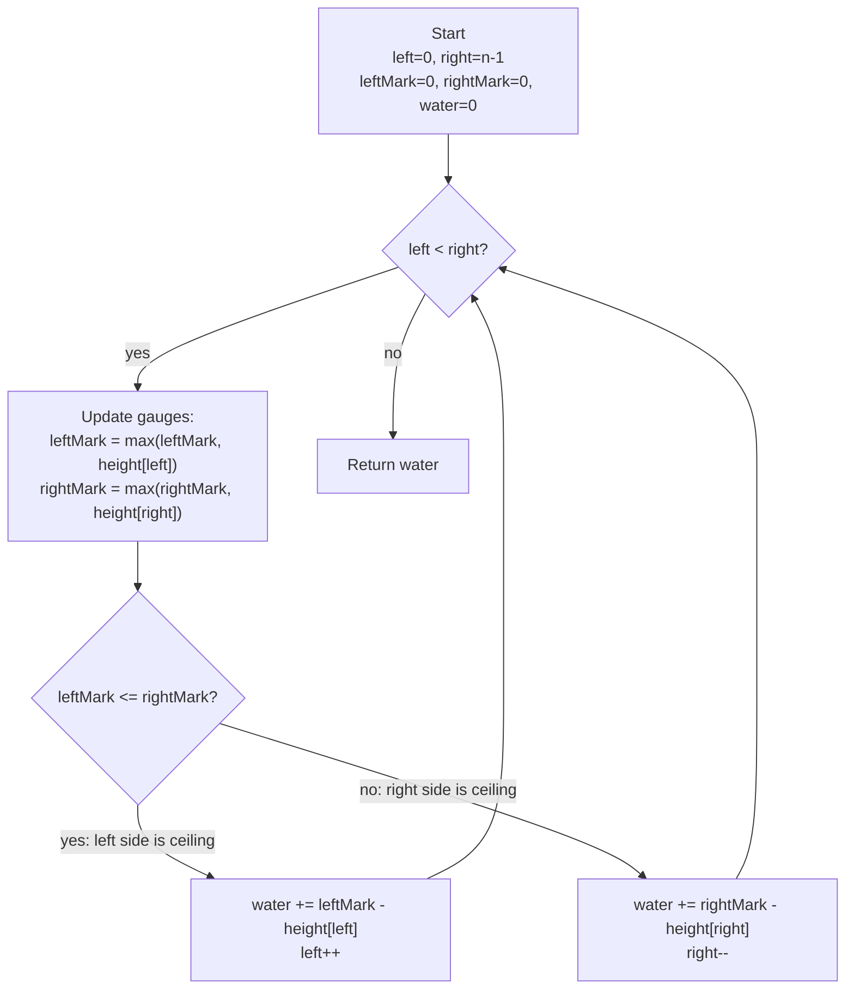

# Trapping Rain Water - Mental Model

## The Problem

Given `n` non-negative integers representing an elevation map where the width of each bar is 1, compute how much water it can trap after raining.

**Example 1:**
```
Input: height = [0,1,0,2,1,0,1,3,2,1,2,1]
Output: 6
```

**Example 2:**
```
Input: height = [4,2,0,3,2,5]
Output: 9
```

## The Flood Surveyor Analogy

Imagine a team of two flood surveyors hired to measure how much rainwater collects across a rugged terrain. The terrain is a cross-section of canyon walls — some tall, some short, all in a row. After a rainstorm, water pools in the valleys, held back by the surrounding walls on both sides.

Each surveyor carries a high-water mark gauge — a measuring stick they update whenever they pass a wall taller than any they've seen before. One surveyor starts at the leftmost wall; the other starts at the rightmost. They walk inward toward each other, measuring the water depth at each position they visit.

The key rule: the surveyor whose gauge reads lower is the one who measures and steps inward. Why? Because the water level at any position is capped by the lower surrounding wall. If your gauge (the maximum wall behind you) is lower than the other surveyor's gauge, your side is the ceiling. You already know exactly how deep the water is at your feet — it's your gauge height minus the ground you're standing on. The far side is already at least as tall as the other gauge, so it isn't the constraint. Measure your water and step inward.

The two surveyors keep trading steps inward until they meet. When they do, the total accumulated water depth is the answer.

## Understanding the Analogy

### The Setup

The terrain is a row of walls of varying heights. After rain, water fills every valley, held back by the tallest reachable walls on each side. We want the total volume of trapped water.

Two surveyors start at opposite ends: the left surveyor at index 0, the right surveyor at the last index. Each gauge begins at zero — they haven't measured any walls yet. As each surveyor steps inward, they update their gauge if the wall at their current position is the tallest seen from their direction so far.

### The High-Water Mark Gauges

Each surveyor's gauge tracks the tallest wall seen from their starting end up to and including their current position. The left gauge (`leftMark`) is the running maximum from the left; the right gauge (`rightMark`) is the running maximum from the right.

At any position, the actual water ceiling is the lower of the two gauges. Think of it as a bathtub: water can only rise as high as the shorter surrounding wall before it spills over. If the left gauge reads 4 meters and the right gauge reads 5 meters, the water at the left surveyor's feet can only rise to 4 meters — the left wall would let it escape before it could ever reach 5.

The critical insight: whichever surveyor has the lower gauge knows their calculation is exact right now. They don't need to see the rest of the far side — the far gauge already guarantees that side is at least as high as its recorded value, which is higher than their own gauge. Their gauge is the binding constraint, so they calculate and step inward.

### Why This Approach

A brute-force scan left and right from every position costs O(n²). Pre-computing prefix-max and suffix-max arrays gets to O(n) time but uses O(n) extra space.

The two-surveyor approach achieves O(n) time and O(1) space. At every step, the surveyor with the lower gauge has enough information to act — no full arrays needed, just the running maximum on each side. The two gauges together always guarantee that the measuring surveyor's calculation is exact, because the other side is already at least as high.

## How I Think Through This

I initialize two surveyors: `left` at index 0 and `right` at `height.length - 1`. Both gauges (`leftMark`, `rightMark`) start at 0. `water` starts at 0.

On each step, I update both gauges to include the walls at their current positions. Then I check whose gauge is lower. If `leftMark <= rightMark`, the left gauge is the ceiling — I add `leftMark - height[left]` to `water` and step `left` inward. Otherwise `rightMark` is the ceiling — I add `rightMark - height[right]` and step `right` inward. The loop runs until the surveyors meet.

Take `[4, 2, 0, 3, 2, 5]`.

:::trace-lr
[
  {"chars": ["4","2","0","3","2","5"], "L": 0, "R": 5, "action": null, "label": "leftMark=4, rightMark=5. 4<=5 → left is ceiling. water+=4-4=0. L moves in."},
  {"chars": ["4","2","0","3","2","5"], "L": 1, "R": 5, "action": "mismatch", "label": "leftMark=max(4,2)=4, rightMark=5. 4<=5 → left is ceiling. water+=4-2=2. Total=2. L moves in."},
  {"chars": ["4","2","0","3","2","5"], "L": 2, "R": 5, "action": "mismatch", "label": "leftMark=max(4,0)=4, rightMark=5. 4<=5 → left is ceiling. water+=4-0=4. Total=6. L moves in."},
  {"chars": ["4","2","0","3","2","5"], "L": 3, "R": 5, "action": "mismatch", "label": "leftMark=max(4,3)=4, rightMark=5. 4<=5 → left is ceiling. water+=4-3=1. Total=7. L moves in."},
  {"chars": ["4","2","0","3","2","5"], "L": 4, "R": 5, "action": "mismatch", "label": "leftMark=max(4,2)=4, rightMark=5. 4<=5 → left is ceiling. water+=4-2=2. Total=9. L moves in."},
  {"chars": ["4","2","0","3","2","5"], "L": 5, "R": 5, "action": "done", "label": "Surveyors meet. Return 9."}
]
:::

---

## Building the Algorithm

Each step introduces one concept from the Flood Surveyor approach, then a StackBlitz embed to try it.

### Step 1: The Left Surveyor Measures

The left surveyor's job: update the left gauge to the running maximum, then — when the left gauge is the lower ceiling (`leftMark <= rightMark`) — add the water depth at this position and step inward. When the left gauge is higher, the right surveyor should step inward (the right branch is a stub for now).

For inputs where the right wall is always at least as tall as anything on the left side, the left surveyor handles every measurement and the loop terminates correctly.

:::trace-lr
[
  {"chars": ["2","0","1","0","3"], "L": 0, "R": 4, "action": null, "label": "leftMark=2, rightMark=3. 2<=3 → left measures: water+=2-2=0. L moves in."},
  {"chars": ["2","0","1","0","3"], "L": 1, "R": 4, "action": "mismatch", "label": "leftMark=max(2,0)=2, rightMark=3. 2<=3 → water+=2-0=2. Total=2. L moves in."},
  {"chars": ["2","0","1","0","3"], "L": 2, "R": 4, "action": "mismatch", "label": "leftMark=max(2,1)=2, rightMark=3. 2<=3 → water+=2-1=1. Total=3. L moves in."},
  {"chars": ["2","0","1","0","3"], "L": 3, "R": 4, "action": "mismatch", "label": "leftMark=max(2,0)=2, rightMark=3. 2<=3 → water+=2-0=2. Total=5. L moves in."},
  {"chars": ["2","0","1","0","3"], "L": 4, "R": 4, "action": "done", "label": "Surveyors meet. Return 5."}
]
:::

:::stackblitz{file="step1-problem.ts" step=1 total=2 solution="step1-solution.ts"}

<details>
<summary>Hints & gotchas</summary>

- **Update the gauge before measuring**: `leftMark = Math.max(leftMark, height[left])` before adding water — otherwise a tall wall incorrectly appears to trap water on itself.
- **Water can't be negative**: If `height[left]` equals `leftMark`, the surveyor is standing on the tallest wall they've seen — `leftMark - height[left]` is 0. The formula handles this naturally with no special case.
- **The right stub**: For Step 1, when `leftMark > rightMark`, just `right--` — no water calculation yet. The right surveyor earns that logic in Step 2.
- **Empty input**: `left = 0`, `right = -1`. The `while (left < right)` condition is immediately false — return 0 without entering the loop.

</details>

### Step 2: The Right Surveyor Completes the Survey

Now the right surveyor gets their turn. When `rightMark < leftMark`, the right gauge is the ceiling — water at `right` is `rightMark - height[right]`, then `right` steps inward. With both branches in place, every valley position is measured exactly once and the total is correct.

:::trace-lr
[
  {"chars": ["0","1","0","2","1","0","1","3","2","1","2","1"], "L": 0, "R": 11, "action": null, "label": "leftMark=0, rightMark=1. 0<=1 → left measures: water+=0-0=0. L→1."},
  {"chars": ["0","1","0","2","1","0","1","3","2","1","2","1"], "L": 1, "R": 11, "action": "mismatch", "label": "leftMark=1, rightMark=1. 1<=1 → water+=1-1=0. L→2."},
  {"chars": ["0","1","0","2","1","0","1","3","2","1","2","1"], "L": 2, "R": 11, "action": "mismatch", "label": "leftMark=1, rightMark=1. 1<=1 → water+=1-0=1. Total=1. L→3."},
  {"chars": ["0","1","0","2","1","0","1","3","2","1","2","1"], "L": 3, "R": 11, "action": "mismatch", "label": "leftMark=2, rightMark=1. 2>1 → right measures: water+=1-1=0. R→10."},
  {"chars": ["0","1","0","2","1","0","1","3","2","1","2","1"], "L": 3, "R": 10, "action": "mismatch", "label": "leftMark=2, rightMark=2. 2<=2 → left measures: water+=2-2=0. L→4."},
  {"chars": ["0","1","0","2","1","0","1","3","2","1","2","1"], "L": 4, "R": 10, "action": "mismatch", "label": "leftMark=2, rightMark=2. 2<=2 → left measures: water+=2-1=1. Total=2. L→5."},
  {"chars": ["0","1","0","2","1","0","1","3","2","1","2","1"], "L": 5, "R": 10, "action": "mismatch", "label": "leftMark=2, rightMark=2. 2<=2 → left measures: water+=2-0=2. Total=4. L→6."},
  {"chars": ["0","1","0","2","1","0","1","3","2","1","2","1"], "L": 6, "R": 10, "action": "mismatch", "label": "leftMark=2, rightMark=2. 2<=2 → left measures: water+=2-1=1. Total=5. L→7."},
  {"chars": ["0","1","0","2","1","0","1","3","2","1","2","1"], "L": 7, "R": 10, "action": "mismatch", "label": "leftMark=3, rightMark=2. 3>2 → right measures: water+=2-2=0. R→9."},
  {"chars": ["0","1","0","2","1","0","1","3","2","1","2","1"], "L": 7, "R": 9, "action": "mismatch", "label": "leftMark=3, rightMark=2. 3>2 → right measures: water+=2-1=1. Total=6. R→8."},
  {"chars": ["0","1","0","2","1","0","1","3","2","1","2","1"], "L": 7, "R": 8, "action": "mismatch", "label": "leftMark=3, rightMark=2. 3>2 → right measures: water+=2-2=0. R→7."},
  {"chars": ["0","1","0","2","1","0","1","3","2","1","2","1"], "L": 7, "R": 7, "action": "done", "label": "Surveyors meet. Return 6."}
]
:::

:::stackblitz{file="step2-problem.ts" step=2 total=2 solution="step2-solution.ts"}

<details>
<summary>Hints & gotchas</summary>

- **Mirror of the left branch**: The right branch is the exact same pattern flipped — update `rightMark`, add `rightMark - height[right]`, then `right--`.
- **`else`, not `else if`**: The two branches cover all cases. If `leftMark <= rightMark` is false, `rightMark < leftMark` is always true — a plain `else` is correct and simpler.
- **Who measures, who steps**: Only the surveyor with the lower gauge both measures AND steps. The surveyor with the higher gauge steps only when their gauge becomes the lower one — their higher reading is what made the other surveyor's calculation exact.

</details>

## Flood Surveyor at a Glance



---

## Tracing through an Example

Using `height = [4, 2, 0, 3, 2, 5]` → expected output: 9

| Step | Left Surveyor (left) | h[left] | Right Surveyor (right) | h[right] | Left Gauge (leftMark) | Right Gauge (rightMark) | Ceiling Side | Water Added | Total Water |
|------|---|---|---|---|---|---|---|---|---|
| Start | 0 | 4 | 5 | 5 | 0→4 | 0→5 | left (4<=5) | 4-4=0 | 0 |
| 1 | 1 | 2 | 5 | 5 | 4 | 5 | left (4<=5) | 4-2=2 | 2 |
| 2 | 2 | 0 | 5 | 5 | 4 | 5 | left (4<=5) | 4-0=4 | 6 |
| 3 | 3 | 3 | 5 | 5 | 4 | 5 | left (4<=5) | 4-3=1 | 7 |
| 4 | 4 | 2 | 5 | 5 | 4 | 5 | left (4<=5) | 4-2=2 | 9 |
| Done | 5 | — | 5 | — | — | — | — | — | return 9 |

---

## Common Misconceptions

**"I need to scan the whole array before I can calculate water at any position"** — Each surveyor only needs the maximum wall on their own side so far. Because the surveyor with the lower gauge is always the bottleneck, the exact heights on the far side don't matter — only that the far gauge is at least as high as the low gauge. The two-surveyor strategy calculates on the fly with no full pre-scan required.

**"Updating the gauge before subtracting means a tall wall appears to trap water on top of itself"** — Updating first (`leftMark = Math.max(leftMark, height[left])`) is exactly right. If the current wall is taller than the previous gauge, `leftMark - height[left]` evaluates to 0 — no water collects on top of a tall wall. No special case needed; the formula handles it.

**"When both gauges are equal I should move both surveyors"** — Only one surveyor moves per step. When `leftMark === rightMark`, the condition `leftMark <= rightMark` is true, so the left surveyor moves. One step at a time guarantees every position is visited exactly once — never skipped, never double-counted.

**"The position where the surveyors meet still needs to be measured"** — When `left === right`, both surveyors occupy the same position. A single pillar with no walls on either side can't trap water. The loop condition `left < right` correctly excludes this phantom measurement.

**"Water depth should use the max of the two gauges, not the min"** — Water is capped by the shorter surrounding wall, not the taller one. Using the maximum would calculate "water needed to reach the taller wall" — which doesn't exist, because the shorter wall lets it spill first. The correct formula is `min(leftMark, rightMark) - height[i]`. In the two-surveyor algorithm, the measuring surveyor always has the lower gauge, so `mark - height[i]` implicitly applies the minimum.

---

## Complete Solution

:::stackblitz{file="solution.ts" step=2 total=2 solution="solution.ts"}
