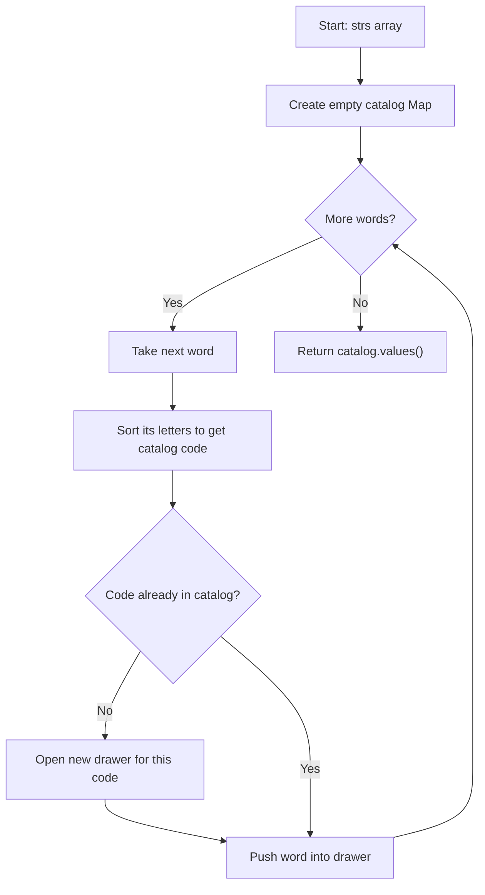

# Group Anagrams - Mental Model

## The Problem

Given an array of strings `strs`, group the anagrams together. You can return the answer in any order.

An **anagram** is a word or phrase formed by rearranging the letters of a different word or phrase, using all the original letters exactly once.

**Example 1:**
```
Input: strs = ["eat","tea","tan","ate","nat","bat"]
Output: [["bat"],["nat","tan"],["ate","eat","tea"]]
```

**Example 2:**
```
Input: strs = [""]
Output: [[""]]
```

**Example 3:**
```
Input: strs = ["a"]
Output: [["a"]]
```

## The Museum Archive Analogy

Every major museum receives artifacts from dozens of different expeditions. Each expedition labels things differently — one team writes "Roman Lamp," another writes "Roman Lamp (terracotta)," a third just "Lamp, Roman." But the curator doesn't sort by the label. She sorts by the **catalog code**: a standardized description generated by alphabetizing the artifact's defining features. Two artifacts with identical feature inventories — regardless of how they were labeled at the dig site — end up in the same archival drawer.

That's exactly what happens with anagram grouping. The words "eat," "tea," and "ate" look different on the surface, but when you alphabetize their letters you always get the same code: `"aet"`. The code erases the arrangement, leaving only the inventory. Words that are anagrams share the same code. Words that aren't, don't.

The archive is a HashMap that maps each code to its drawer — a list of all words that produced that code. As you process each word, you compute its code, look up (or open) its drawer, and drop the word in. When you're done, each drawer contains exactly one anagram group.

## Understanding the Analogy

### The Setup

A museum curator receives a crate of artifacts (the `strs` array). Her job: sort them into drawers so every artifact in a given drawer is interchangeable — same letter inventory, different arrangements. When she's done, she hands back all the drawers.

She can't use the artifact labels directly because the same inventory can arrive under many different names. Instead, she needs a system that converts any label into its canonical form: an unambiguous code that will be identical for all rearrangements of the same letters.

### The Catalog Code

The catalog code is the artifact's letters sorted alphabetically. "eat" → "aet". "tea" → "aet". "tan" → "ant". "bat" → "abt". Any two words that are anagrams of each other produce the same catalog code — because they have the same letters and sorting always produces the same ordering.

This is the crucial insight: **sorting is a normalizing function**. It doesn't matter in what order the letters arrived; sort them and you always get the canonical form. The catalog code becomes the HashMap key, and every anagram family has exactly one key.

### Why This Approach

You could compare every word against every other word to detect anagrams — but that's O(n²). The catalog code reduces the problem to a single pass: for each word, compute a key in O(k log k) where k is the word length, then do an O(1) HashMap lookup. The total cost is O(n · k log k). Each word is touched exactly once, and each group builds itself automatically as you scan.

---

## How I Think Through This

I scan through every word in `strs`. For each word, I generate its catalog code by sorting its letters — `word.split('').sort().join('')`. I look up that code in a `catalog` HashMap. If the code has no drawer yet, I create one: an empty array stored under that key. Then I push the current word into that drawer. No word ever compares itself against another; the HashMap handles every grouping decision automatically.

After processing every word, I call `Array.from(catalog.values())` to collect all the drawers and return them. The empty string gets code `""` — a perfectly valid key. A single-letter word gets its own letter as a code. No special cases needed.

Take `["eat","tea","tan","ate","nat","bat"]`.

:::trace-map
[
  {"input":["eat","tea","tan","ate","nat","bat"],"currentI":0,"map":[],"highlight":null,"action":null,"label":"Start: empty catalog. Begin scanning.","vars":[{"name":"code","value":"—"}]},
  {"input":["eat","tea","tan","ate","nat","bat"],"currentI":0,"map":[["aet","eat"]],"highlight":"aet","action":"insert","label":"'eat' → sort → 'aet'. New code → open drawer, add 'eat'.","vars":[{"name":"code","value":"aet"}]},
  {"input":["eat","tea","tan","ate","nat","bat"],"currentI":1,"map":[["aet","eat,tea"]],"highlight":"aet","action":"update","label":"'tea' → sort → 'aet'. Drawer exists → add 'tea'.","vars":[{"name":"code","value":"aet"}]},
  {"input":["eat","tea","tan","ate","nat","bat"],"currentI":2,"map":[["aet","eat,tea"],["ant","tan"]],"highlight":"ant","action":"insert","label":"'tan' → sort → 'ant'. New code → open drawer, add 'tan'.","vars":[{"name":"code","value":"ant"}]},
  {"input":["eat","tea","tan","ate","nat","bat"],"currentI":3,"map":[["aet","eat,tea,ate"],["ant","tan"]],"highlight":"aet","action":"update","label":"'ate' → sort → 'aet'. Drawer exists → add 'ate'.","vars":[{"name":"code","value":"aet"}]},
  {"input":["eat","tea","tan","ate","nat","bat"],"currentI":4,"map":[["aet","eat,tea,ate"],["ant","tan,nat"]],"highlight":"ant","action":"update","label":"'nat' → sort → 'ant'. Drawer exists → add 'nat'.","vars":[{"name":"code","value":"ant"}]},
  {"input":["eat","tea","tan","ate","nat","bat"],"currentI":5,"map":[["aet","eat,tea,ate"],["ant","tan,nat"],["abt","bat"]],"highlight":"abt","action":"insert","label":"'bat' → sort → 'abt'. New code → open drawer, add 'bat'.","vars":[{"name":"code","value":"abt"}]},
  {"input":["eat","tea","tan","ate","nat","bat"],"currentI":-2,"map":[["aet","eat,tea,ate"],["ant","tan,nat"],["abt","bat"]],"highlight":null,"action":"done","label":"Scan complete. Return all 3 drawers.","vars":[{"name":"code","value":"—"}]}
]
:::

---

## Building the Algorithm

Each step introduces one concept from the Museum Archive, then a StackBlitz embed to try it.

### Step 1: The Catalog Code

Before the archive can group anything, the curator needs to generate catalog codes. The code is simple to compute: take the word, split it into individual letters, sort them alphabetically, and join them back. "eat" → `["e","a","t"]` → `["a","e","t"]` → `"aet"`.

Write a `catalogCode(word: string): string` function. When two words are anagrams, your function must return the exact same string for both. When they're not anagrams, it must return different strings.

:::stackblitz{file="step1-problem.ts" step=1 total=2 solution="step1-solution.ts"}

### Step 2: The Full Archive Scan

Now build the archive. Create a `catalog` HashMap. For each word in `strs`: compute its catalog code, look up (or create) its drawer, and push the word in. When every word has been filed, return all the drawer contents.

Two questions to answer before opening the editor: how do you open a new drawer the first time you encounter a code? And how do you extract all the groups from the map when you're done?

:::trace-map
[
  {"input":["eat","tea","tan"],"currentI":0,"map":[],"highlight":null,"action":null,"label":"Smaller example. Catalog empty.","vars":[{"name":"code","value":"—"}]},
  {"input":["eat","tea","tan"],"currentI":0,"map":[["aet","eat"]],"highlight":"aet","action":"insert","label":"'eat' → 'aet'. No drawer → create [], push 'eat'.","vars":[{"name":"code","value":"aet"}]},
  {"input":["eat","tea","tan"],"currentI":1,"map":[["aet","eat,tea"]],"highlight":"aet","action":"update","label":"'tea' → 'aet'. Drawer exists → push 'tea'.","vars":[{"name":"code","value":"aet"}]},
  {"input":["eat","tea","tan"],"currentI":2,"map":[["aet","eat,tea"],["ant","tan"]],"highlight":"ant","action":"insert","label":"'tan' → 'ant'. No drawer → create [], push 'tan'.","vars":[{"name":"code","value":"ant"}]},
  {"input":["eat","tea","tan"],"currentI":-2,"map":[["aet","eat,tea"],["ant","tan"]],"highlight":null,"action":"done","label":"Done. catalog.values() → [['eat','tea'], ['tan']].","vars":[{"name":"code","value":"—"}]}
]
:::

:::stackblitz{file="step2-problem.ts" step=2 total=2 solution="step2-solution.ts"}

---

## Group Anagrams at a Glance



---

## Tracing through an Example

Input: `strs = ["eat","tea","tan","ate","nat","bat"]`

| Step | Word (i) | Catalog Code | New Drawer? | Action | Catalog State |
|------|----------|--------------|-------------|--------|---------------|
| Start | — | — | — | initialize | {} |
| 1 | "eat" (0) | "aet" | Yes | open + push | {aet:["eat"]} |
| 2 | "tea" (1) | "aet" | No | push | {aet:["eat","tea"]} |
| 3 | "tan" (2) | "ant" | Yes | open + push | {aet:["eat","tea"], ant:["tan"]} |
| 4 | "ate" (3) | "aet" | No | push | {aet:["eat","tea","ate"], ant:["tan"]} |
| 5 | "nat" (4) | "ant" | No | push | {aet:["eat","tea","ate"], ant:["tan","nat"]} |
| 6 | "bat" (5) | "abt" | Yes | open + push | {aet:["eat","tea","ate"], ant:["tan","nat"], abt:["bat"]} |
| Done | — | — | — | return values | [["eat","tea","ate"],["tan","nat"],["bat"]] |

---

## Common Misconceptions

**"I need to compare each word against every other word to detect anagrams."** — That's O(n²) and unnecessary. The catalog code gives every anagram family a shared key, so no word ever looks at another directly. The HashMap routes each word to its group automatically in a single pass.

**"Sorting the letters changes the word — I should build a frequency count instead."** — Both approaches produce a valid key, but sorting is simpler. A frequency map requires encoding counts into a comparable string like `"a2e1t1"`. The sorted string is a cleaner canonical form and works directly as a HashMap key without extra encoding.

**"The output order matters — I need to return groups in a specific sequence."** — The problem explicitly says "you can return the answer in any order," and the order of words within each group doesn't matter either. The HashMap's insertion order determines what you get back, and that's fine.

**"I need a special case for empty strings or single-character words."** — No special cases needed. The empty string sorts to `""` — a valid HashMap key. A single-character word sorts to itself. The general algorithm handles both without branching.

**"I should sort the entire input array first, then scan for adjacent anagrams."** — Sorting `strs` alphabetically would interleave words from different families (since "ate" and "bat" are adjacent alphabetically but aren't anagrams). The catalog code approach needs no pre-sorting — it groups by fingerprint, not by position.

---

## Complete Solution

:::stackblitz{file="solution.ts" step=2 total=2 solution="solution.ts"}
