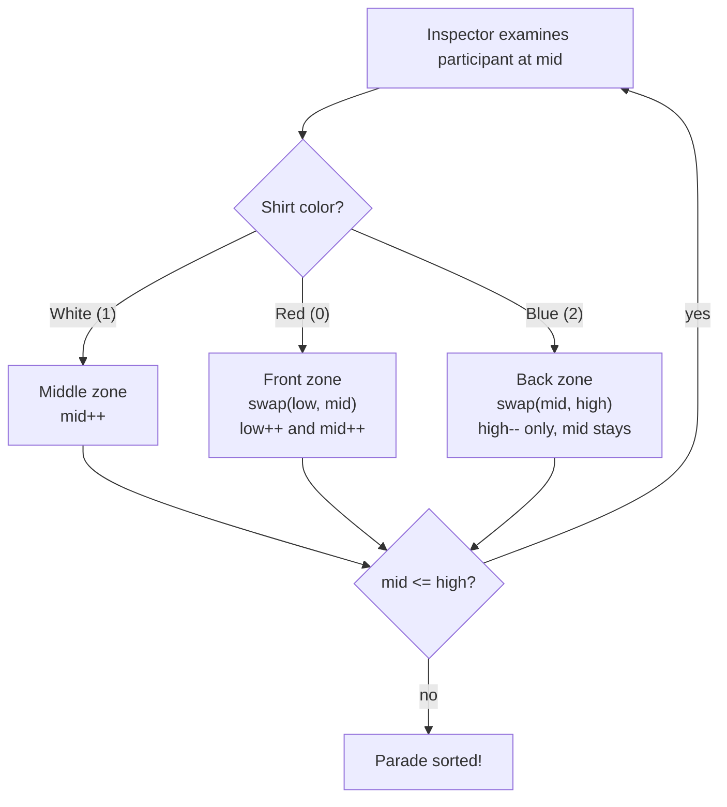

# Sort Colors — Mental Model

## The Problem

Given an array `nums` with `n` objects colored red, white, or blue, sort them **in-place** so that objects of the same color are adjacent, with the colors in the order red, white, and blue. We will use the integers `0`, `1`, and `2` to represent the color red, white, and blue, respectively. You must solve this problem without using the library's sort function.

**Example 1:**
```
Input: nums = [2,0,2,1,1,0]
Output: [0,0,1,1,2,2]
```

**Example 2:**
```
Input: nums = [2,0,1]
Output: [0,1,2]
```

## The Parade Organizer Analogy

Imagine you're organizing a tricolor parade where participants wear red (0), white (1), or blue (2) shirts. They've all arrived in a random order, and you need to arrange them so all reds are at the front, whites in the middle, and blues at the back — in a single walk down the line.

You plant three flags in the lineup. The **Red Flag** (`low`) marks the left boundary of the unsorted middle — everything to its left is a confirmed red-shirt participant already in place. The **Inspector** (`mid`) is your moving official who walks the line examining each person one at a time. The **Blue Flag** (`high`) marks the right boundary — everything to its right is a confirmed blue-shirt participant already in place.

Between the Red Flag and the Inspector lies the **confirmed white zone** — people who've been examined and belong in the middle. Between the Inspector and the Blue Flag lies the **unknown zone** — people who haven't been examined yet. The Inspector's job is to shrink that unknown zone to zero.

As the Inspector examines each participant, they make one of three decisions: white-shirts stay where they are (Inspector advances), red-shirts get escorted to the front (swap with the Red Flag position, both flags advance), and blue-shirts get escorted to the back (swap with the Blue Flag position, the Blue Flag retreats). The parade is sorted when the unknown zone is empty — when the Inspector has passed the Blue Flag.

## Understanding the Analogy

### The Setup

The parade lineup starts in total disorder. All participants are in the unknown zone. The Red Flag and Inspector both start at position 0, and the Blue Flag starts at the last position. These three officials define four zones that are maintained throughout: confirmed reds on the far left, confirmed whites just right of the Red Flag, the unknown zone in the middle, and confirmed blues on the far right.

### The Four Zones

At any moment during the parade organization, these four zones are perfectly maintained:

- **Positions 0 to low−1**: confirmed red — participants already escorted to the front
- **Positions low to mid−1**: confirmed white — participants examined and left in the middle
- **Positions mid to high**: unknown — participants not yet examined by the Inspector
- **Positions high+1 to n−1**: confirmed blue — participants already escorted to the back

The Inspector only ever moves forward (`mid++`) or stays. The Red Flag only moves forward (`low++`). The Blue Flag only moves backward (`high--`). Their movements shrink the unknown zone from both ends.

### Why This Approach

A naive approach would count the 0s, 1s, and 2s first, then overwrite the array — correct, but two passes. This single-pass approach achieves O(n) time and O(1) space in one pass by maintaining the four-zone invariant at every step. The invariant is the key: because you always know exactly what's in each zone, you never need to revisit an element. The tricky part — and the source of most bugs — is understanding *why* you don't advance `mid` after a blue swap, but you do after a red swap. That asymmetry comes directly from the invariant.

## How I Think Through This

I set up three positions: `low = 0` (where the next red should land), `mid = 0` (where the Inspector starts), and `high = nums.length - 1` (where the next blue should land). The loop runs while `mid <= high` — as long as there's an unknown zone to process.

Inside the loop I look at `nums[mid]`. White (1) is already in the right zone — just advance `mid`. Red (0) gets swapped to `low`: I swap `nums[low]` and `nums[mid]`, then advance *both* `low` and `mid`. I can safely advance `mid` because whatever came from `low` back to `mid` was in the confirmed white zone, so it's definitely white and needs no re-inspection. Blue (2) gets swapped to `high`: I swap `nums[mid]` and `nums[high]`, then retreat `high` — but I do *not* advance `mid`. The element that just landed at `mid` came from the unknown zone and hasn't been examined yet. It could be anything.

Take `[2,0,2,1,1,0]`.

:::trace-lr
[
  {"chars": ["2","0","2","1","1","0"], "L": 0, "R": 5, "action": null, "label": "low=0 | All 6 positions are unknown. Inspector and Red Flag both at 0, Blue Flag at 5."},
  {"chars": ["0","0","2","1","1","2"], "L": 0, "R": 4, "action": "mismatch", "label": "low=0 | Blue (2) at mid=0. Swap with high=5 — a red (0) arrives at mid. Blue Flag retreats to 4. Inspector stays — that incoming 0 hasn't been examined!"},
  {"chars": ["0","0","2","1","1","2"], "L": 1, "R": 4, "action": "match", "label": "low=1, mid=1 | Red (0) at mid=0. Swap with Red Flag (same spot — no change). Red Flag and Inspector both advance."},
  {"chars": ["0","0","2","1","1","2"], "L": 2, "R": 4, "action": "match", "label": "low=2, mid=2 | Red (0) at mid=1. Swap with Red Flag (same spot). Both advance again."},
  {"chars": ["0","0","1","1","2","2"], "L": 2, "R": 3, "action": "mismatch", "label": "low=2 | Blue (2) at mid=2. Swap with high=4 — a white (1) arrives. Blue Flag retreats to 3. Inspector stays."},
  {"chars": ["0","0","1","1","2","2"], "L": 3, "R": 3, "action": "match", "label": "low=2, mid=3 | White (1) at mid=2. Already in the right zone — Inspector advances."},
  {"chars": ["0","0","1","1","2","2"], "L": 4, "R": 3, "action": "done", "label": "low=2, mid=4 | White (1) at mid=3. Inspector advances past Blue Flag — unknown zone is empty. Parade sorted!"}
]
:::

---

## Building the Algorithm

Each step introduces one concept from the Parade Organizer analogy, then a StackBlitz embed to try it.

### Step 1: Plant the Three Flags

Before the Inspector can examine anyone, you plant the three flags. Red Flag (`low`) and Inspector (`mid`) both start at 0 — the confirmed-white zone is initially zero-width. Blue Flag (`high`) starts at the last position.

With the flags in place, the Inspector walks as long as `mid <= high` — while the unknown zone is non-empty. The simplest case is white (1): a white-shirt participant is already in the right zone between `low` and `mid`, so the Inspector just steps forward: `mid++`.

:::trace-lr
[
  {"chars": ["1","1","1"], "L": 0, "R": 2, "action": null, "label": "low=0, mid=0, high=2 | Flags planted. All three positions are unknown."},
  {"chars": ["1","1","1"], "L": 1, "R": 2, "action": "match", "label": "low=0, mid=1 | White (1) at mid=0. Already in the middle zone — Inspector advances."},
  {"chars": ["1","1","1"], "L": 2, "R": 2, "action": "match", "label": "low=0, mid=2 | White (1) at mid=1. Inspector advances."},
  {"chars": ["1","1","1"], "L": 3, "R": 2, "action": "done", "label": "low=0, mid=3 | White (1) at mid=2. Inspector advances past Blue Flag — done!"}
]
:::

:::stackblitz{file="step1-problem.ts" step=1 total=3 solution="step1-solution.ts"}

<details>
<summary>Hints & gotchas</summary>

- **Loop condition**: The unknown zone exists while `mid <= high`. When `mid > high`, the Inspector has passed the Blue Flag — the unknown zone is empty and every participant is in their correct section.
- **Why mid starts at 0**: Red Flag and Inspector start together — the confirmed-white zone has zero width initially. As whites are found, `mid` advances while `low` stays, widening that zone.
- **The `void` function**: `sortColors` mutates the array in-place and returns nothing. Your tests must call it and then read `nums` back — not try to return its return value directly.

</details>

### Step 2: The Red Escort

When the Inspector spots a red-shirt participant (0), they belong at the front. Swap them with whoever is standing at the Red Flag position (`low`). Then advance *both* the Red Flag and the Inspector: `low++; mid++`.

Why advance both? The person who moved from `low` back to `mid` came from the confirmed-white zone (`low..mid-1`). Every element there is a white shirt. So that person is definitely white and doesn't need re-inspection — the Inspector can safely move past them.

:::trace-lr
[
  {"chars": ["0","1","0","1"], "L": 0, "R": 3, "action": null, "label": "low=0, mid=0, high=3 | Only reds and whites — no blues. Unknown zone: all 4 positions."},
  {"chars": ["0","1","0","1"], "L": 1, "R": 3, "action": "match", "label": "low=1, mid=1 | Red (0) at mid=0. Swap with low=0 (same spot — no-op). Red Flag and Inspector both advance."},
  {"chars": ["0","1","0","1"], "L": 1, "R": 3, "action": "match", "label": "low=1, mid=2 | White (1) at mid=1. Inspector advances."},
  {"chars": ["0","0","1","1"], "L": 2, "R": 3, "action": "match", "label": "low=2, mid=3 | Red (0) at mid=2. Swap with low=1 — red goes front, white comes back to mid. Both advance."},
  {"chars": ["0","0","1","1"], "L": 2, "R": 3, "action": "done", "label": "low=2, mid=4 | White (1) at mid=3. Inspector advances past Blue Flag — done!"}
]
:::

:::stackblitz{file="step2-problem.ts" step=2 total=3 solution="step2-solution.ts"}

<details>
<summary>Hints & gotchas</summary>

- **Why the swap is safe**: When a red comes back to `low`'s old position, you know for certain the element at `low` was white — it was in the confirmed-white zone. After the swap, `mid` holds a white shirt: `mid++` is always safe.
- **Both pointers always move**: Every red swap advances both `low` and `mid`. This differs from the blue case (step 3), where only one pointer moves.
- **Swap when `low === mid`**: When the confirmed-white zone is empty, `low === mid`. The swap is a no-op, but both pointers still advance — that's correct. The first red you encounter bootstraps the confirmed-red zone.

</details>

### Step 3: The Blue Escort

When the Inspector spots a blue-shirt participant (2), they belong at the back. Swap them with whoever is at the Blue Flag position (`high`). Then retreat the Blue Flag: `high--`.

**Here is the critical asymmetry from step 2:** you do *not* advance `mid`. The person who just landed at `mid` came from the unknown zone — they haven't been examined. They could be red, white, or blue. The Inspector must look at them before moving on. The unknown zone still shrinks (because `high` retreated), but the Inspector holds position.

:::trace-lr
[
  {"chars": ["2","0","2","1","1","0"], "L": 0, "R": 5, "action": null, "label": "low=0, mid=0, high=5 | Full mix. Three officials in position."},
  {"chars": ["0","0","2","1","1","2"], "L": 0, "R": 4, "action": "mismatch", "label": "low=0 | Blue (2) at mid=0. Swap with high=5 — red (0) arrives. Blue Flag retreats to 4. Inspector stays — that 0 needs examining!"},
  {"chars": ["0","0","2","1","1","2"], "L": 1, "R": 4, "action": "match", "label": "low=1, mid=1 | Red (0) at mid=0. Swap with low. Both advance."},
  {"chars": ["0","0","2","1","1","2"], "L": 2, "R": 4, "action": "match", "label": "low=2, mid=2 | Red (0) at mid=1. Swap with low. Both advance."},
  {"chars": ["0","0","1","1","2","2"], "L": 2, "R": 3, "action": "mismatch", "label": "low=2 | Blue (2) at mid=2. Swap with high=4 — white (1) arrives. Blue Flag retreats to 3. Inspector stays."},
  {"chars": ["0","0","1","1","2","2"], "L": 3, "R": 3, "action": "match", "label": "low=2, mid=3 | White (1) at mid=2. Just advance."},
  {"chars": ["0","0","1","1","2","2"], "L": 4, "R": 3, "action": "done", "label": "low=2, mid=4 | White (1) at mid=3. Advance. Inspector past Blue Flag — parade fully sorted!"}
]
:::

:::stackblitz{file="step3-problem.ts" step=3 total=3 solution="step3-solution.ts"}

<details>
<summary>Hints & gotchas</summary>

- **The key asymmetry**: Red swaps return a *guaranteed white* to `mid` (from the confirmed-white zone), so `mid++` is safe. Blue swaps return an *unknown* element to `mid` (from the unexamined zone), so `mid` must stay.
- **The loop still terminates**: Even though `mid` doesn't advance on blue swaps, `high` decreases by 1. The unknown zone always shrinks. Eventually `mid > high`.
- **Consecutive blues**: If a blue swap produces another blue at `mid`, the Inspector will swap it away next iteration. No special-casing needed — the algorithm handles any run of blues correctly.
- **All three cases must be covered**: The `if/else if/else` (or equivalent) needs branches for 0, 1, and 2. A common mistake is writing `if (0) ... else if (2) ... ` and forgetting the white (1) branch falls through to undefined behavior.

</details>

---

## The Parade at a Glance



---

## Tracing through an Example

Input: `nums = [2,0,2,1,1,0]`

| Step | Inspector (mid) | Red Flag (low) | Blue Flag (high) | nums[mid] | Color | Action | Array State |
|------|---|---|---|---|---|---|---|
| Start | 0 | 0 | 5 | 2 | Blue | swap(0,5) → 0 arrives at mid. high=4. mid stays. | [0,0,2,1,1,2] |
| 2 | 0 | 0 | 4 | 0 | Red | swap(low=0, mid=0) → no-op. low=1, mid=1. | [0,0,2,1,1,2] |
| 3 | 1 | 1 | 4 | 0 | Red | swap(low=1, mid=1) → no-op. low=2, mid=2. | [0,0,2,1,1,2] |
| 4 | 2 | 2 | 4 | 2 | Blue | swap(2,4) → 1 arrives at mid. high=3. mid stays. | [0,0,1,1,2,2] |
| 5 | 2 | 2 | 3 | 1 | White | mid=3. | [0,0,1,1,2,2] |
| 6 | 3 | 2 | 3 | 1 | White | mid=4. | [0,0,1,1,2,2] |
| Done | 4 | 2 | 3 | — | — | mid(4) > high(3) → exit loop | [0,0,1,1,2,2] |

---

## Common Misconceptions

**"I should advance `mid` after every swap"** — The blue swap is different from the red swap. When you swap a blue to `high`, the element coming back to `mid` is from the unexamined zone — you have no idea what color it is. Advancing `mid` would skip its inspection and potentially misplace it. Only red swaps guarantee a white shirt returns to `mid`, making `mid++` safe.

**"The algorithm needs two passes — count first, then sort"** — The three-flag invariant eliminates any need for a counting pass. Because each zone's boundaries are always correct, you know exactly what to do with every element you encounter. Maintaining the invariant is equivalent to sorting — no separate phase needed.

**"When `low === mid`, I should skip the swap since it's a no-op"** — Adding this special case complicates the code and doesn't save work. The swap of identical indices is harmless, and both `low++` and `mid++` still need to happen to grow the confirmed zones. Let the no-op swap happen naturally.

**"Consecutive blue swaps will loop forever"** — Even though `mid` doesn't advance on a blue swap, `high` retreats by 1 with every blue swap. The unknown zone shrinks with every iteration regardless of the element's color. The loop always terminates.

**"A single-element array needs a special case"** — With one element, `mid=0` and `high=0`. The loop runs once: white just advances `mid` past `high`; red swaps in-place and advances both; blue swaps in-place and retreats `high` below `mid`. All three cases exit cleanly on the next iteration check. No special handling needed.

---

## Complete Solution

:::stackblitz{file="solution.ts" step=3 total=3 solution="solution.ts"}
