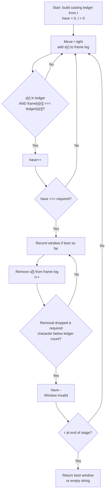

# 76. Minimum Window Substring — Mental Model

## The Problem

Given two strings `s` and `t` of lengths `m` and `n`, return the minimum window substring of `s` such that every character in `t` (including duplicates) is included in the window. If there is no such substring, return the empty string `""`.

**Example 1:**
```
Input: s = "ADOBECODEBANC", t = "ABC"
Output: "BANC"
```

**Example 2:**
```
Input: s = "a", t = "a"
Output: "a"
```

**Example 3:**
```
Input: s = "a", t = "aa"
Output: ""
```

## The Director's Viewfinder Analogy

Imagine you're a film director on a long stage shoot. The stage has dozens of actors standing in a fixed line from left to right — they can't move. Your casting director has handed you a **casting sheet** listing all the required actors for the next shot (this is `t`). Some actors are needed multiple times for different roles (duplicates matter).

You hold up your **viewfinder** — a rectangular frame that shows a contiguous section of the stage. Your job is to find the tightest possible framing that still captures every required actor. Too wide and the shot costs extra; too narrow and you miss someone.

The key insight: you never need to restart from scratch. You widen the viewfinder from the right to pull in more actors until everyone on the casting sheet is in frame. Then — and only then — you tighten from the left to eliminate actors you don't need, shrinking the frame until removing one more would drop a required actor. That's your candidate for the minimum shot. If a contracted window misses someone, you widen again from the right to recapture them, then contract again. You keep this rhythm — widen, contract, record — until you've scanned the entire stage.

## Understanding the Analogy

### The Setup

The stage is the string `s` — a fixed sequence of actors standing left to right. The casting sheet is `t` — a list of required actors, with duplicates meaning "you need this actor for two separate roles." Your viewfinder is defined by two marks on the stage floor: a **left boundary** `l` and a **right boundary** `r`. Any actor between (and including) those marks is "in frame."

Before filming, you build two reference documents. The **casting ledger** records exactly how many of each required actor you need — it's derived from `t` and never changes. The **frame log** tracks how many of each actor is currently visible in your viewfinder — it updates every time you widen or tighten. A third running tally, `have`, counts how many unique actor requirements are fully satisfied in the current frame. When `have` equals `required` (the number of distinct actors on the casting sheet), the shot is valid.

### The Ledger and the Frame Log

The casting ledger (`need` map) is built once from `t`. If `t = "ABC"`, the ledger reads: A×1, B×1, C×1. If `t = "AABC"`, it reads: A×2, B×1, C×1 — you need two actors playing "A" roles.

The frame log (`window` map) tracks every actor currently between `l` and `r`. Crucially, it tracks extras and irrelevant actors too — an actor who isn't on the casting sheet still appears in the frame log, but never affects `have`.

The `have` counter only increments when the frame log count for a required actor **exactly reaches** the casting ledger count for that actor. If you need A×2 and your frame has A×1, `have` doesn't go up. When the frame reaches A×2, `have` increments. If the frame later has A×3 (an extra), `have` stays the same — you already counted A as satisfied.

### Why This Approach

A brute force scan would check every possible substring. For a string of length `m`, there are O(m²) substrings, and checking each takes O(m) time — cubic overall. The viewfinder approach is linear. You move `l` and `r` in one direction only, each at most `m` steps. Every actor is "entered" at most once (when `r` passes them) and "exited" at most once (when `l` passes them). The ledger-vs-frame comparison is O(1) per step. Total: O(m + n).

The two-pointer rhythm works because adding an actor on the right can only help (never hurt) the validity of the window, and removing an actor on the left can only hurt (never help). This monotonic property means we never need to backtrack.

## How I Think Through This

I start by building the casting ledger from `t` — a frequency map of required characters — and noting `required = ledger.size`, the number of unique characters to satisfy. I initialize `have = 0`, `l = 0`, and an empty frame log.

Then I walk `r` from left to right. For each actor `s[r]`, I add them to the frame log. If they're on the casting sheet and their frame count just reached the ledger count, `have` goes up. I keep widening until `have === required` — the shot is valid.

Once the shot is valid, I record its length (and boundaries if it's the best so far) and start contracting from the left. I remove `s[l]` from the frame log. If removing them drops a ledger-required character below its needed count, `have` decreases and the shot is invalid — I stop contracting and widen again. Otherwise the shot is still valid with a smaller frame, so I record the new (smaller) length and keep contracting. I repeat this widen-contract rhythm until `r` reaches the end of the stage.

Take `s = "ADOBECODEBANC"`, `t = "ABC"`:

:::trace-lr
[
  {"chars": ["A","D","O","B","E","C","O","D","E","B","A","N","C"], "L": 0, "R": 0, "action": null, "label": "Widen: pull in A — frame={A:1}, have=1/3"},
  {"chars": ["A","D","O","B","E","C","O","D","E","B","A","N","C"], "L": 0, "R": 1, "action": null, "label": "Widen: pull in D — not on sheet, have=1/3"},
  {"chars": ["A","D","O","B","E","C","O","D","E","B","A","N","C"], "L": 0, "R": 2, "action": null, "label": "Widen: pull in O — not on sheet, have=1/3"},
  {"chars": ["A","D","O","B","E","C","O","D","E","B","A","N","C"], "L": 0, "R": 3, "action": null, "label": "Widen: pull in B — frame={A:1,B:1}, have=2/3"},
  {"chars": ["A","D","O","B","E","C","O","D","E","B","A","N","C"], "L": 0, "R": 4, "action": null, "label": "Widen: pull in E — not on sheet, have=2/3"},
  {"chars": ["A","D","O","B","E","C","O","D","E","B","A","N","C"], "L": 0, "R": 5, "action": "match", "label": "Widen: pull in C — have=3/3! Valid shot: 'ADOBEC' (length 6)"},
  {"chars": ["A","D","O","B","E","C","O","D","E","B","A","N","C"], "L": 1, "R": 5, "action": "mismatch", "label": "Contract: remove A — A:0 < need:1, have=2/3. Invalid! Stop contracting."},
  {"chars": ["A","D","O","B","E","C","O","D","E","B","A","N","C"], "L": 1, "R": 9, "action": null, "label": "Widen R to 9: pull in O,D,E,B — have still 2/3 (missing A)"},
  {"chars": ["A","D","O","B","E","C","O","D","E","B","A","N","C"], "L": 1, "R": 10, "action": "match", "label": "Widen: pull in A — have=3/3! Valid shot: 'DOBECODEBA' (length 10)"},
  {"chars": ["A","D","O","B","E","C","O","D","E","B","A","N","C"], "L": 5, "R": 10, "action": "match", "label": "Contract L past D,O,B,E: remove non-essentials. Window 'CODEBA' (length 6), tied for best"},
  {"chars": ["A","D","O","B","E","C","O","D","E","B","A","N","C"], "L": 6, "R": 10, "action": "mismatch", "label": "Contract: remove C — C:0 < need:1, have=2/3. Invalid! Widen again."},
  {"chars": ["A","D","O","B","E","C","O","D","E","B","A","N","C"], "L": 6, "R": 12, "action": "match", "label": "Widen: R=11 (N) then R=12 (C) — have=3/3! Window 'ODEBANC'"},
  {"chars": ["A","D","O","B","E","C","O","D","E","B","A","N","C"], "L": 9, "R": 12, "action": "match", "label": "Contract L past O,D,E: remove non-essentials. Window 'BANC' (length 4) — new best!"},
  {"chars": ["A","D","O","B","E","C","O","D","E","B","A","N","C"], "L": 10, "R": 12, "action": "done", "label": "Contract: remove B — B:0 < need:1, have=2/3. Invalid. R at end — done. Return 'BANC'."}
]
:::

---

## Building the Algorithm

Each step introduces one concept from the Director's Viewfinder, then a StackBlitz embed to try it.

### Step 1: Building the Casting Ledger

Before you can judge whether a shot is valid, you need the casting ledger: a frequency map of every character in `t`. Then you need the frame log (a second map) and a `have` counter to track how many unique requirements are currently satisfied in the viewfinder.

The expansion logic is the core gate: as you slide `r` right, you add each actor to the frame log. If that actor is on the casting sheet *and* their frame count just reached (not exceeded — exactly reached) the ledger count, `have` goes up. When `have === required`, the shot is valid and you've found a window.

In step 1, find the *first* valid window — no contraction yet. If `t` has characters that never appear in `s`, no valid window exists and you return `""`.

:::stackblitz{file="step1-problem.ts" step=1 total=2 solution="step1-solution.ts"}

<details>
<summary>Hints & gotchas</summary>

- **Unique-character count, not total**: `required` should be `need.size` (number of distinct characters in t), not `t.length`. You satisfy a requirement for a character type exactly once, even if t has three of them.
- **Exact threshold for `have`**: Only increment `have` when `window.get(c) === need.get(c)` — not `>=`. If the frame already had A×2 and you add a third A, `have` must not double-count.
- **Characters not in t**: Characters not on the casting sheet still go into the frame log — you track all actors in the viewfinder, not just the required ones. But they never affect `have`.
- **Return early on first valid**: For step 1, return the window string `s.slice(l, r + 1)` as soon as `have === required`. Don't return `l` and `r` as numbers — return the actual substring.

</details>

### Step 2: Tightening the Frame

Once the viewfinder captures all required actors, start contracting from the left. Remove `s[l]` from the frame log and increment `l`. If that removal drops a ledger-required character below its needed count, `have` decreases and the shot is invalid — stop contracting and begin widening again. If the shot stays valid, record the window length (and update the best if it's smaller), then keep contracting.

This contraction lives in a `while (have === required)` loop inside the `for` loop over `r`. The result tracks the best window boundaries `[resL, resR]` and `resLen`.

:::stackblitz{file="step2-problem.ts" step=2 total=2 solution="step2-solution.ts"}

<details>
<summary>Hints & gotchas</summary>

- **Record before removing**: Update the best window size *inside* the `while` loop, before you remove the left actor. You're recording the valid window, then trying to shrink it.
- **Threshold on removal too**: When removing `s[l]`, decrement `have` only when `window.get(leftChar) < need.get(leftChar)` — after decrementing the window count. Use `need.has(leftChar)` as the gate before checking.
- **`Infinity` sentinel**: Initialize `resLen = Infinity`. At the end, if `resLen` is still `Infinity`, no valid window was ever found — return `""`. Otherwise return `s.slice(resL, resR + 1)`.
- **`l` keeps moving**: After the while loop exits (window invalid), `l` has already been incremented past the actor that broke validity. Don't reset it. Continue expanding `r` from where you left off.

</details>

---

## Director's Viewfinder at a Glance



---

## Tracing through an Example

Full trace of `minWindow("ADOBECODEBANC", "ABC")`. Casting ledger: `{A:1, B:1, C:1}`, `required = 3`.

| Step | Right Boundary (r) | Actor s[r] | Left Boundary (l) | have | Action | Best Window |
|------|--------------------|------------|-------------------|------|--------|-------------|
| Start | -1 | — | 0 | 0 | Initialize | — |
| 1 | 0 | A | 0 | 1 | Widen — A×1 meets ledger A×1, have++ | — |
| 2 | 1 | D | 0 | 1 | Widen — D not on sheet | — |
| 3 | 2 | O | 0 | 1 | Widen — O not on sheet | — |
| 4 | 3 | B | 0 | 2 | Widen — B×1 meets ledger B×1, have++ | — |
| 5 | 4 | E | 0 | 2 | Widen — E not on sheet | — |
| 6 | 5 | C | 0 | 3 | Widen — C×1 meets ledger C×1, have++ | "ADOBEC" (len 6) |
| 7 | 5 | C | 1 | 2 | Contract — remove A (A:0 < need:1), have-- | "ADOBEC" (len 6) |
| 8 | 6 | O | 1 | 2 | Widen — O not on sheet | "ADOBEC" (len 6) |
| 9 | 7 | D | 1 | 2 | Widen — D not on sheet | "ADOBEC" (len 6) |
| 10 | 8 | E | 1 | 2 | Widen — E not on sheet | "ADOBEC" (len 6) |
| 11 | 9 | B | 1 | 2 | Widen — B×2, already satisfied, have stays | "ADOBEC" (len 6) |
| 12 | 10 | A | 1 | 3 | Widen — A×1 meets ledger A×1, have++ | "ADOBEC" (len 6) |
| 13 | 10 | A | 2 | 3 | Contract — remove D (not on sheet). [2,10]="OBECODEBA" (len 9) | "ADOBEC" (len 6) |
| 14 | 10 | A | 3 | 3 | Contract — remove O (not on sheet). [3,10]="BECODEBA" (len 8) | "ADOBEC" (len 6) |
| 15 | 10 | A | 4 | 3 | Contract — remove B (B:1 ≥ need:1, still ok). [4,10]="ECODEBA" (len 7) | "ADOBEC" (len 6) |
| 16 | 10 | A | 5 | 3 | Contract — remove E (not on sheet). [5,10]="CODEBA" (len 6) | "ADOBEC" (tied) |
| 17 | 10 | A | 6 | 2 | Contract — remove C (C:0 < need:1), have-- | "ADOBEC" (len 6) |
| 18 | 11 | N | 6 | 2 | Widen — N not on sheet | "ADOBEC" (len 6) |
| 19 | 12 | C | 6 | 3 | Widen — C×1 meets ledger C×1, have++ | "ADOBEC" (len 6) |
| 20 | 12 | C | 7 | 3 | Contract — remove O (not on sheet). [7,12]="DEBANC" (len 6) | "ADOBEC" (tied) |
| 21 | 12 | C | 8 | 3 | Contract — remove D (not on sheet). [8,12]="EBANC" (len 5) | "EBANC" (len 5) |
| 22 | 12 | C | 9 | 3 | Contract — remove E (not on sheet). [9,12]="BANC" (len 4) | "BANC" (len 4) |
| 23 | 12 | C | 10 | 2 | Contract — remove B (B:0 < need:1), have-- | "BANC" (len 4) |
| Done | — | — | — | — | r reached end. Return best window | **"BANC"** |

---

## Common Misconceptions

**"I should use `t.length` as the `required` count, not `need.size`"** — This counts every character including duplicates: if `t = "AAB"`, `t.length` is 3 but there are only 2 distinct actor types (A and B). The casting ledger has 2 entries, so `required = need.size = 2`. Using `t.length` would mean `have` must reach 3, which it never can since each character type is counted at most once toward `have`.

**"Once I add an actor to the frame, `have` should always go up"** — Only increment `have` when the frame count for a character *exactly reaches* the ledger count. If you need A×2 and your frame has A×1, the A requirement isn't met yet. If your frame goes from A×2 to A×3 (an extra), the requirement was already counted — `have` must not increase again. Otherwise you'd count A as "satisfied" multiple times.

**"I should reset `l = 0` after each contraction breaks the window"** — The left boundary only ever moves forward. Once you've contracted past an actor, they're no longer in the running for the minimum window's left edge — any future minimum window starts at or after the current `l`. Resetting `l` would revisit actors already eliminated and destroy the linear time complexity.

**"I should compare window sizes after both loops finish"** — Record the best window *inside* the contraction loop, each time `have === required`. By the time you exit the loop (window just became invalid), you've already recorded the last valid configuration. The final answer is whatever the running minimum captured during the entire scan.

**"If a character appears in both s and t but more times in t than s, I'll find an empty string"** — Correct. If `t = "AA"` but `s = "A"`, the frame can never reach A×2, `have` stays at 0, and you return `""`. The ledger requirement is never fully met, so the result sentinel `resLen = Infinity` never updates, and you return the empty string.

---

## Complete Solution

:::stackblitz{file="solution.ts" step=2 total=2 solution="solution.ts"}
