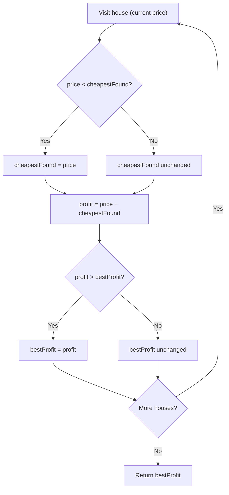

# Best Time to Buy and Sell Stock — Mental Model

## The Problem

You are given an array `prices` where `prices[i]` is the price of a given stock on the `i`th day. You want to maximize your profit by choosing a single day to buy one stock and choosing a different day in the future to sell that stock. Return the maximum profit you can achieve from this transaction. If you cannot achieve any profit, return `0`.

**Example 1:**

```
Input: prices = [7,1,5,3,6,4]
Output: 5
Explanation: Buy on day 2 (price = 1) and sell on day 5 (price = 6), profit = 6 - 1 = 5.
```

**Example 2:**

```
Input: prices = [7,6,4,3,1]
Output: 0
Explanation: In this case, no transaction is done, i.e., max profit = 0.
```

## The Garage Sale Scout Analogy

Imagine you're a garage sale scout driving through a neighborhood on a Saturday morning. Every house on the street has a price tag on the same type of item — a vintage lamp. Your plan: buy one lamp at the cheapest price you see, then sell it later for the biggest profit.

The critical rule of garage sales: you walk the street in order and can never go back. Once you've passed a house, you can't buy from it retroactively — but you already know its price and can factor it in. This is exactly the stock problem's constraint: you must buy _before_ you sell.

As you walk the street, you carry two sticky notes in your pocket. The first tracks the **cheapest price seen so far** — your best possible buy opportunity at any given moment. The second tracks the **best profit you could have made** if you'd bought at that cheapest price and sold at the best subsequent house. Every house you visit, you check both notes and update them if warranted.

By the time you reach the end of the street, your second sticky note holds the answer.

## Understanding the Analogy

### The Setup

You have a street of houses, each with a price tag. You walk from house 1 to house N in order, and at any house you could have bought the item earlier and sold it here. Your goal is to find the buy-house and sell-house pairing that maximizes the difference.

The constraint — walk forward only — means you never need to look backward. If you've been tracking the cheapest price seen so far, you already have the best possible buy price for any house you're standing at right now.

### The Two Sticky Notes

You carry two sticky notes:

**Sticky Note 1: "Cheapest Found"** starts at an impossibly high number (infinity). Whenever you see a price lower than what's on this note, you cross it out and write the new price. This note always holds the cheapest lamp price seen on your walk so far.

**Sticky Note 2: "Best Profit"** starts at `0`. At every house, you ask: "If I had bought at the cheapest price I've seen and sold right here, what's my profit?" That profit is `currentPrice − cheapestFound`. If it beats what's on this note, you update it.

> **The key insight**: you never need to compare every possible buy-sell pair. You walk once, and the two sticky notes do all the bookkeeping.

### Why This Approach

A naive approach checks every possible buy-sell pair — that's O(n²). But it misses the core insight: you only ever want to buy at the _cheapest_ price seen before your current position. There is no reason to consider buying at any other price.

This is why a single forward pass works. Your "cheapest found" note compresses all prior history into one number. At each new house, that single number is all you need to compute the best possible profit ending at this house.

## How I Think Through This

This is a **two-pointer** problem. `L` is the buy pointer (the index of the cheapest price seen so far) and `R` is the sell pointer (the current day scanning forward). At each step, `R` advances. If `prices[R] < prices[L]`, there's a cheaper buy available — move `L` to `R`. Otherwise, compute the profit `prices[R] − prices[L]` and update the best.

In code, you don't need to track the indices explicitly — just the value at `L` (`cheapestFound`) and the running best profit. But the two-pointer mental model is what makes the invariant clear: `L` always points to the cheapest buy opportunity before `R`, so the profit at any `R` is always optimal given what's come before.

Take `[7, 1, 5, 3, 6, 4]`.

:::trace-lr
[
{"chars": ["7","1","5","3","6","4"], "L": 0, "R": 0, "action": null, "label": "House 1: $7. First house — cheapestFound = 7. Profit = $7 − $7 = $0. bestProfit = $0."},
{"chars": ["7","1","5","3","6","4"], "L": 1, "R": 1, "action": "match", "label": "House 2: $1 < $7. New cheapest! cheapestFound = 1. Profit = $1 − $1 = $0. bestProfit = $0."},
{"chars": ["7","1","5","3","6","4"], "L": 2, "R": 2, "action": "match", "label": "House 3: $5. Profit = $5 − $1 = $4. New best! bestProfit = $4."},
{"chars": ["7","1","5","3","6","4"], "L": 3, "R": 3, "action": null, "label": "House 4: $3. Profit = $3 − $1 = $2. No improvement. bestProfit stays $4."},
{"chars": ["7","1","5","3","6","4"], "L": 4, "R": 4, "action": "match", "label": "House 5: $6. Profit = $6 − $1 = $5. New best! bestProfit = $5."},
{"chars": ["7","1","5","3","6","4"], "L": 5, "R": 5, "action": "done", "label": "House 6: $4. Profit = $4 − $1 = $3. No improvement. Return bestProfit = $5."}
]
:::

---

## Building the Algorithm

Each step introduces one concept from the Garage Sale Scout, then a StackBlitz embed to try it.

### Step 1: Tracking the Cheapest Buy

Before you can calculate any profit, you need to know your best possible buy price at any given house. That's your "cheapest found" sticky note. Your job in this step: walk through every house, and whenever you find a price cheaper than anything you've seen before, update the note.

You start with `cheapestFound = Infinity` — an impossibly high starting value so the first house always wins the comparison. You also initialize `bestProfit = 0` — the minimum possible answer, since you can always choose not to transact. The profit calculation comes in Step 2; for now, just make the cheapest-tracking work.

Which inputs produce the right answer with only this step? Any case where the correct profit is `0`: an empty street, a single house, or a street where prices only drop.

:::trace-lr
[
{"chars": ["7","1","5","3","6","4"], "L": 0, "R": 0, "action": null, "label": "House 1: $7. First house — cheapestFound = 7."},
{"chars": ["7","1","5","3","6","4"], "L": 1, "R": 1, "action": "match", "label": "House 2: $1 < $7. New cheapest! cheapestFound = 1."},
{"chars": ["7","1","5","3","6","4"], "L": 2, "R": 2, "action": null, "label": "House 3: $5 > $1. cheapestFound stays 1."},
{"chars": ["7","1","5","3","6","4"], "L": 3, "R": 3, "action": null, "label": "House 4: $3 > $1. cheapestFound stays 1."},
{"chars": ["7","1","5","3","6","4"], "L": 4, "R": 4, "action": null, "label": "House 5: $6 > $1. cheapestFound stays 1."},
{"chars": ["7","1","5","3","6","4"], "L": 5, "R": 5, "action": "done", "label": "House 6: $4 > $1. cheapestFound = 1. Return bestProfit = 0 (no sells computed yet)."}
]
:::

:::stackblitz{file="step1-problem.ts" step=1 total=2 solution="step1-solution.ts"}

<details>
<summary>Hints & gotchas</summary>

- **Starting value for cheapestFound**: Use `Infinity`, not `prices[0]`. Starting at `Infinity` lets your loop begin at index `0` and the first price always wins the comparison cleanly — no special-casing needed for the first element.
- **Why return 0 for edge cases**: An empty array or single price has no valid buy-then-sell pair. Your `bestProfit = 0` initialization handles both cases automatically — the loop either never runs or produces a `0` profit.
- **The decreasing case passes by accident (on purpose)**: For `[7, 6, 4, 3, 1]`, your cheapest-tracking code finds `cheapestFound = 1`, but since no profit is calculated in Step 1, `bestProfit` stays `0` — which is exactly the correct answer.

</details>

### Step 2: Calculating the Best Profit

Now comes the sell side of the scout's decision. At every house, after updating your cheapest-found note, you ask: "What if I sold right here?" Your profit would be `currentPrice − cheapestFound`. If that beats your current best profit, update the second sticky note.

The key: do the cheapest-update _first_, then calculate profit. This ordering guarantees you never buy and sell on the same day — because when you update `cheapestFound` to the current price, the profit becomes exactly `0`, which never beats a positive `bestProfit`.

:::trace-lr
[
{"chars": ["7","1","5","3","6","4"], "L": 0, "R": 0, "action": null, "label": "House 1: $7. cheapestFound=7. Profit=$7−$7=$0. bestProfit stays $0."},
{"chars": ["7","1","5","3","6","4"], "L": 1, "R": 1, "action": null, "label": "House 2: $1 — new cheapest! cheapestFound=1. Profit=$1−$1=$0. bestProfit stays $0."},
{"chars": ["7","1","5","3","6","4"], "L": 2, "R": 2, "action": "match", "label": "House 3: $5. Profit=$5−$1=$4. New best! bestProfit=$4."},
{"chars": ["7","1","5","3","6","4"], "L": 3, "R": 3, "action": null, "label": "House 4: $3. Profit=$3−$1=$2. No improvement. bestProfit stays $4."},
{"chars": ["7","1","5","3","6","4"], "L": 4, "R": 4, "action": "match", "label": "House 5: $6. Profit=$6−$1=$5. New best! bestProfit=$5."},
{"chars": ["7","1","5","3","6","4"], "L": 5, "R": 5, "action": "done", "label": "House 6: $4. Profit=$4−$1=$3. No improvement. Return bestProfit=$5."}
]
:::

:::stackblitz{file="step2-problem.ts" step=2 total=2 solution="step2-solution.ts"}

<details>
<summary>Hints & gotchas</summary>

- **Order matters**: Update `cheapestFound` before calculating profit. If you reverse the order, you might calculate a negative profit on a new-cheapest day.
- **You don't need an `else`**: You can always calculate profit, even on a new-cheapest day. `price − price = 0` never hurts `bestProfit`. One `if` for the cheapest update plus an unconditional profit check is the cleanest pattern.
- **`bestProfit = 0` is your floor**: If no profitable trade exists (prices only fall), every profit calculation is `≤ 0`, so `bestProfit` stays `0` — the correct answer, with no extra handling needed.
- **Don't return early when you find a new cheapest**: A common mistake is skipping the profit check on days when `cheapestFound` updates. Both operations happen every iteration — just in order.

</details>

## The Garage Sale Scout at a Glance



## Tracing through an Example

Full trace of `maxProfit([7, 1, 5, 3, 6, 4])`, expected output `5`.

| Step  | House (i) | Price | cheapestFound | Today's Profit | bestProfit | Action                         |
| ----- | --------- | ----- | ------------- | -------------- | ---------- | ------------------------------ |
| Start | —         | —     | ∞             | —              | 0          | Initialize                     |
| 0     | 0         | 7     | 7             | 0              | 0          | $7 < ∞ — new cheapest          |
| 1     | 1         | 1     | 1             | 0              | 0          | $1 < $7 — new cheapest         |
| 2     | 2         | 5     | 1             | 4              | 4          | $5 − $1 = $4 — new best profit |
| 3     | 3         | 3     | 1             | 2              | 4          | $3 − $1 = $2 — no improvement  |
| 4     | 4         | 6     | 1             | 5              | 5          | $6 − $1 = $5 — new best profit |
| 5     | 5         | 4     | 1             | 3              | 5          | $4 − $1 = $3 — no improvement  |
| Done  | —         | —     | 1             | —              | 5          | Return 5                       |

---

## Common Misconceptions

**"I need to track both the buy day and the sell day to compute the answer."** — You don't. The return value is a profit number, not a pair of days. `cheapestFound` (a single price) and `bestProfit` (a single profit) are all you need. The specific indices are irrelevant.

**"I should reset my cheapest-found note when prices start rising."** — Never reset it. `cheapestFound` is cumulative — it holds the absolute lowest price from day 0 to today. Resetting it when prices rise would cause you to miss earlier cheap buy opportunities that are still valid.

**"When I find a new cheapest price, I should skip the profit check."** — No. Even on a new-cheapest day, you calculate `price − cheapestFound`. The result is `0`, which never hurts `bestProfit`. Both operations happen every iteration, in order. Separating them into an if/else introduces a subtle bug.

**"The brute force (check every pair) is safer because it's easier to verify."** — It finds the right answer but costs O(n²). The scout's insight collapses the problem: you only ever need to know the cheapest price seen _before_ your current position. One note, one pass.

**"I need a special case for empty input or a single price."** — You don't. `bestProfit = 0` combined with `for...of` over an empty array handles both automatically — the loop body never executes, and `0` is returned.

## Complete Solution

:::stackblitz{file="solution.ts" step=2 total=2 solution="solution.ts"}
