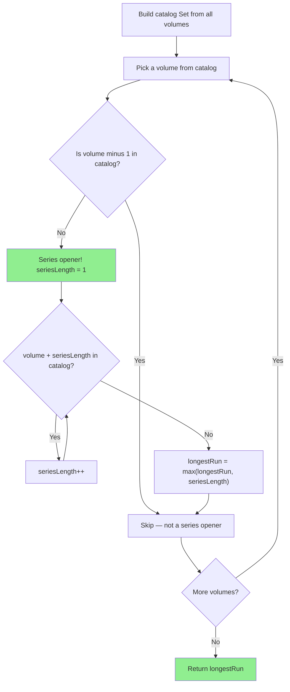

# Longest Consecutive Sequence - Mental Model

## The Problem

Given an unsorted array of integers `nums`, return the length of the longest consecutive elements sequence. You must write an algorithm that runs in `O(n)` time.

**Example 1:**
```
Input: nums = [100,4,200,1,3,2]
Output: 4
```

**Example 2:**
```
Input: nums = [0,3,7,2,5,8,4,6,0,1]
Output: 9
```

**Example 3:**
```
Input: nums = [1]
Output: 1
```

## The Used Bookshop Analogy

Imagine you run a tiny used bookshop. Throughout the week customers donate individual volumes from various numbered series — Volume 4 of one series, Volume 1 of another, Volume 100 of something else. The books arrive in no particular order and sit in a jumbled pile. Your goal at the end of the day is to find out which series you have the longest consecutive run for — maybe you have Volumes 1, 2, 3, and 4 of a fantasy series, while another sits alone as just Volume 200.

Here is the key insight: you cannot count a consecutive run by reading through the pile in order (the pile is unsorted). What you need first is a **catalog** — a master index where you can instantly answer "do I have Volume 7 of any series?" That catalog is a Set, and it turns every membership question into a millisecond lookup, no matter how many books you own.

Once the catalog is ready, you apply the **Series Opener Rule**: only start counting a series from its first volume. If you have Volume 3, you check whether you also have Volume 2. If you do, then Volume 3 is not a series opener — it belongs to a run that started earlier, and you should let that earlier volume do the counting. Only when a volume has **no predecessor in your catalog** do you begin walking forward.

This single rule — only count from series openers — is what collapses a potentially quadratic algorithm into a linear one. Every volume participates in exactly one count: either it is the opener and drives the tally, or it is skipped because its predecessor already started the count. No volume is measured twice.

## Understanding the Analogy

### The Setup

You have a jumbled pile of donated books. Each book has a number printed on its spine — its position in whatever series it belongs to. Multiple series may be represented: a 4-volume fantasy run, a lone encyclopedia volume, a pair from a biography set. You do not know in advance how many series there are, how long any run is, or which volumes are represented. The pile is unsorted and may contain duplicates.

Your goal: find the length of the longest unbroken sequence of consecutive spine numbers.

### The Catalog and the Series Opener Rule

Before you can answer "is Volume 7 on the shelf?", you build the catalog: flip through the entire pile once and note every spine number in a master index. Duplicates collapse automatically — if two donors gave you Volume 3, the catalog simply confirms "Volume 3: yes." This first pass is O(n), touching each book exactly once.

With the catalog built, you apply the Series Opener Rule: a book is a series opener if and only if the catalog does not contain the preceding volume. Volume 1 is an opener because there is no Volume 0 in your collection. Volume 4 is only an opener if Volume 3 is absent. Volume 200 is an opener if Volume 199 is missing.

From each opener, you walk forward — does Volume N+1 exist in the catalog? N+2? N+3? — until you reach a gap. The count of consecutive hits is that series run's length.

### Why This Approach

Without the catalog, every "does this volume exist?" question forces a linear scan through the pile — O(n) per question, and with up to O(n) questions, you hit O(n²) total. Sorting would help with the scan but introduces O(n log n) overhead. The catalog flips every lookup to O(1). The Series Opener Rule ensures you ask at most one chain of questions per series, and the total length of all chains is at most n (each volume is visited once as an opener's expansion). Two O(n) passes — build catalog, walk starters — keeps the whole algorithm O(n).

## How I Think Through This

I hold `longestRun` starting at 0 and build `catalog` — a Set from all values in `nums` in one pass. This costs O(n) and deduplicates automatically.

Then I iterate over every volume in the catalog. For each volume, I ask: is `volume - 1` in the catalog? If yes, I skip — some earlier book is already responsible for this series. If no, this volume is a series opener and I record it as a run of length 1, then update `longestRun`.

In the second phase I extend each opener. For every series opener I found, I walk forward checking `volume + 1`, `volume + 2`... until the catalog says "not here." That walk gives me the full chain length.

Take `[100, 4, 200, 1, 3, 2]`.

:::trace-map
[
  {"input": [100,4,200,1,3,2], "currentI": -1, "map": [], "highlight": null, "action": null, "label": "Pile received. Building the catalog — register every volume."},
  {"input": [100,4,200,1,3,2], "currentI": 0, "map": [[100,null]], "highlight": 100, "action": "insert", "label": "Register Volume 100."},
  {"input": [100,4,200,1,3,2], "currentI": 1, "map": [[100,null],[4,null]], "highlight": 4, "action": "insert", "label": "Register Volume 4."},
  {"input": [100,4,200,1,3,2], "currentI": 2, "map": [[100,null],[4,null],[200,null]], "highlight": 200, "action": "insert", "label": "Register Volume 200."},
  {"input": [100,4,200,1,3,2], "currentI": 3, "map": [[100,null],[4,null],[200,null],[1,null]], "highlight": 1, "action": "insert", "label": "Register Volume 1."},
  {"input": [100,4,200,1,3,2], "currentI": 4, "map": [[100,null],[4,null],[200,null],[1,null],[3,null]], "highlight": 3, "action": "insert", "label": "Register Volume 3."},
  {"input": [100,4,200,1,3,2], "currentI": 5, "map": [[100,null],[4,null],[200,null],[1,null],[3,null],[2,null]], "highlight": 2, "action": "insert", "label": "Register Volume 2. Catalog complete."},
  {"input": [100,4,200,1,3,2], "currentI": 0, "map": [[100,null],[4,null],[200,null],[1,null],[3,null],[2,null]], "highlight": null, "action": "miss", "label": "Volume 100: predecessor 99 absent → opener. Record run = 1.", "vars": [{"name": "longestRun", "value": 1}]},
  {"input": [100,4,200,1,3,2], "currentI": 1, "map": [[100,null],[4,null],[200,null],[1,null],[3,null],[2,null]], "highlight": 3, "action": "found", "label": "Volume 4: predecessor 3 present → skip.", "vars": [{"name": "longestRun", "value": 1}]},
  {"input": [100,4,200,1,3,2], "currentI": 2, "map": [[100,null],[4,null],[200,null],[1,null],[3,null],[2,null]], "highlight": null, "action": "miss", "label": "Volume 200: predecessor 199 absent → opener. Run = 1.", "vars": [{"name": "longestRun", "value": 1}]},
  {"input": [100,4,200,1,3,2], "currentI": 3, "map": [[100,null],[4,null],[200,null],[1,null],[3,null],[2,null]], "highlight": null, "action": "miss", "label": "Volume 1: predecessor 0 absent → opener! Expand: 2 ✓ 3 ✓ 4 ✓ 5 ✗ → run = 4!", "vars": [{"name": "longestRun", "value": 4}]},
  {"input": [100,4,200,1,3,2], "currentI": 4, "map": [[100,null],[4,null],[200,null],[1,null],[3,null],[2,null]], "highlight": 2, "action": "found", "label": "Volume 3: predecessor 2 present → skip.", "vars": [{"name": "longestRun", "value": 4}]},
  {"input": [100,4,200,1,3,2], "currentI": 5, "map": [[100,null],[4,null],[200,null],[1,null],[3,null],[2,null]], "highlight": 1, "action": "found", "label": "Volume 2: predecessor 1 present → skip.", "vars": [{"name": "longestRun", "value": 4}]},
  {"input": [100,4,200,1,3,2], "currentI": -2, "map": [[100,null],[4,null],[200,null],[1,null],[3,null],[2,null]], "highlight": null, "action": "done", "label": "Scan complete. Return longestRun = 4. ✓"}
]
:::

---

## Building the Algorithm

Each step introduces one concept from the bookshop, then a StackBlitz embed to try it.

### Step 1: Building the Catalog and Finding Series Openers

Every book in the pile gets registered in the catalog first — one pass, O(n). With the full catalog in hand, you can answer "does Volume N exist?" in constant time.

Then the scan begins. Walk every volume in the catalog and ask one question: does the predecessor volume exist? If the catalog shows it does, you are looking at a mid-series book — skip it. If the predecessor is absent, this volume starts a fresh series. Record it as the start of a run of length 1 and update `longestRun`.

After this step alone, you can correctly answer "what is the longest chain?" for any input where no two volumes are consecutive — the answer is 1 if the array is non-empty, 0 if empty. The expansion into longer chains comes next.

:::trace-map
[
  {"input": [100,4,200,1,3,2], "currentI": -1, "map": [[100,null],[4,null],[200,null],[1,null],[3,null],[2,null]], "highlight": null, "action": null, "label": "Catalog registered. Scanning for series openers.", "vars": [{"name": "longestRun", "value": 0}]},
  {"input": [100,4,200,1,3,2], "currentI": 0, "map": [[100,null],[4,null],[200,null],[1,null],[3,null],[2,null]], "highlight": null, "action": "miss", "label": "Vol 100: predecessor 99 absent → opener. longestRun = max(0,1) = 1.", "vars": [{"name": "longestRun", "value": 1}]},
  {"input": [100,4,200,1,3,2], "currentI": 1, "map": [[100,null],[4,null],[200,null],[1,null],[3,null],[2,null]], "highlight": 3, "action": "found", "label": "Vol 4: predecessor 3 present → skip.", "vars": [{"name": "longestRun", "value": 1}]},
  {"input": [100,4,200,1,3,2], "currentI": 2, "map": [[100,null],[4,null],[200,null],[1,null],[3,null],[2,null]], "highlight": null, "action": "miss", "label": "Vol 200: predecessor 199 absent → opener. longestRun stays 1.", "vars": [{"name": "longestRun", "value": 1}]},
  {"input": [100,4,200,1,3,2], "currentI": 3, "map": [[100,null],[4,null],[200,null],[1,null],[3,null],[2,null]], "highlight": null, "action": "miss", "label": "Vol 1: predecessor 0 absent → opener. longestRun stays 1. (expansion not yet implemented)", "vars": [{"name": "longestRun", "value": 1}]},
  {"input": [100,4,200,1,3,2], "currentI": 4, "map": [[100,null],[4,null],[200,null],[1,null],[3,null],[2,null]], "highlight": 2, "action": "found", "label": "Vol 3: predecessor 2 present → skip.", "vars": [{"name": "longestRun", "value": 1}]},
  {"input": [100,4,200,1,3,2], "currentI": 5, "map": [[100,null],[4,null],[200,null],[1,null],[3,null],[2,null]], "highlight": 1, "action": "found", "label": "Vol 2: predecessor 1 present → skip.", "vars": [{"name": "longestRun", "value": 1}]},
  {"input": [100,4,200,1,3,2], "currentI": -2, "map": [[100,null],[4,null],[200,null],[1,null],[3,null],[2,null]], "highlight": null, "action": "done", "label": "Scan complete. For disjoint inputs, this already gives the right answer."}
]
:::

:::stackblitz{file="step1-problem.ts" step=1 total=2 solution="step1-solution.ts"}

<details>
<summary>Hints & gotchas</summary>

- **Iterate the catalog, not the original pile**: If you loop over the original array and it contains duplicates, you will identify the same series opener twice and double-count. The catalog (a Set) collapses duplicates automatically — every spine number appears exactly once, so the scan stays honest.
- **The predecessor check is a subtraction, not a search**: You are not looking for "the previous element in the array" — you are checking whether spine number `volume - 1` is registered anywhere in the catalog. The array's order is irrelevant.
- **Return 0 for an empty catalog**: If no books were donated, `longestRun` stays at its initial value and the loop never runs. No special case needed.

</details>

### Step 2: Expanding Each Opener into Its Full Chain

Finding the opener is only half the job. Once you know a volume starts a fresh series, you need to measure how long that series runs. Walk forward through spine numbers — is the next volume in the catalog? And the one after that? Keep counting until you hit a gap.

The total work across all expansions is O(n) because each volume in the catalog is "walked through" at most once — as part of exactly one opener's forward sweep. The scan only ever starts from an opener, so no volume is counted from two different starting points.

:::trace-map
[
  {"input": [100,4,200,1,3,2], "currentI": -1, "map": [[100,null],[4,null],[200,null],[1,null],[3,null],[2,null]], "highlight": null, "action": null, "label": "Resuming from Step 1. Openers identified: 100, 200, 1. Now expanding each.", "vars": [{"name": "longestRun", "value": 0}]},
  {"input": [100,4,200,1,3,2], "currentI": 0, "map": [[100,null],[4,null],[200,null],[1,null],[3,null],[2,null]], "highlight": null, "action": "miss", "label": "Opener 100: expand. 101 absent. seriesLength = 1. longestRun = 1.", "vars": [{"name": "longestRun", "value": 1}]},
  {"input": [100,4,200,1,3,2], "currentI": 2, "map": [[100,null],[4,null],[200,null],[1,null],[3,null],[2,null]], "highlight": null, "action": "miss", "label": "Opener 200: expand. 201 absent. seriesLength = 1. longestRun stays 1.", "vars": [{"name": "longestRun", "value": 1}]},
  {"input": [100,4,200,1,3,2], "currentI": 3, "map": [[100,null],[4,null],[200,null],[1,null],[3,null],[2,null]], "highlight": 2, "action": "found", "label": "Opener 1: expand. Vol 2 present. seriesLength = 2.", "vars": [{"name": "longestRun", "value": 1}]},
  {"input": [100,4,200,1,3,2], "currentI": 3, "map": [[100,null],[4,null],[200,null],[1,null],[3,null],[2,null]], "highlight": 3, "action": "found", "label": "Continue. Vol 3 present. seriesLength = 3.", "vars": [{"name": "longestRun", "value": 1}]},
  {"input": [100,4,200,1,3,2], "currentI": 3, "map": [[100,null],[4,null],[200,null],[1,null],[3,null],[2,null]], "highlight": 4, "action": "found", "label": "Continue. Vol 4 present. seriesLength = 4.", "vars": [{"name": "longestRun", "value": 1}]},
  {"input": [100,4,200,1,3,2], "currentI": 3, "map": [[100,null],[4,null],[200,null],[1,null],[3,null],[2,null]], "highlight": null, "action": "miss", "label": "Vol 5 absent. Chain ends. longestRun = max(1, 4) = 4.", "vars": [{"name": "longestRun", "value": 4}]},
  {"input": [100,4,200,1,3,2], "currentI": -2, "map": [[100,null],[4,null],[200,null],[1,null],[3,null],[2,null]], "highlight": null, "action": "done", "label": "All openers expanded. Return longestRun = 4. ✓"}
]
:::

:::stackblitz{file="step2-problem.ts" step=2 total=2 solution="step2-solution.ts"}

<details>
<summary>Hints & gotchas</summary>

- **The expansion variable must track your current position, not just the count**: You need to know which spine number to look up next. A separate `currentVolume` variable that increments alongside `seriesLength` lets you ask "does `currentVolume + 1` exist?" If you only track the count, you have lost your place in the series.
- **The outer loop runs over the catalog; the inner loop runs over consecutive spine numbers starting from the opener**: These are two different loops over two different things. The outer loop is "which opener are we starting from?"; the inner loop is "how far does this particular series stretch?"
- **You are not modifying the catalog during expansion**: The catalog stays fixed throughout. You read from it; you never write to it in the scan phase. Every `catalog.has(...)` call is a read.

</details>

## The Bookshop at a Glance



## Tracing through an Example

Using `nums = [100, 4, 200, 1, 3, 2]`, catalog = `{100, 4, 200, 1, 3, 2}`:

| Step | Current Volume | Predecessor Check | In Catalog? | Series Opener? | Series Length | longestRun |
|------|---|---|---|---|---|---|
| Start | — | — | — | — | — | 0 |
| vol=100 | 100 | 99 | No | Yes | 1 (101 absent) | 1 |
| vol=4 | 4 | 3 | Yes | No | skip | 1 |
| vol=200 | 200 | 199 | No | Yes | 1 (201 absent) | 1 |
| vol=1 | 1 | 0 | No | Yes | 4 (2,3,4 present; 5 absent) | 4 |
| vol=3 | 3 | 2 | Yes | No | skip | 4 |
| vol=2 | 2 | 1 | Yes | No | skip | 4 |
| Done | — | — | — | — | — | return 4 |

---

## Common Misconceptions

**"I should sort the array first to find consecutive runs easily"** — Sorting is O(n log n) and defeats the O(n) requirement. The catalog makes sorting unnecessary: instead of putting books in order to find neighbors, you look up any neighbor directly in constant time.

**"I need to iterate over `nums` in the scan loop, not the catalog"** — The difference is duplicates. If `nums` contains `[1, 1, 2, 3]`, iterating over `nums` causes you to identify the same opener twice and run the same expansion count twice. Iterating over the catalog (a Set) means each spine number is visited exactly once.

**"Starting the count from Volume 3 would find the same series as starting from Volume 1"** — It finds the same series but measures only part of it. If you start from Volume 3 with `[1, 2, 3, 4]` in your catalog, you count 3→4 and record length 2. You miss the full 1→2→3→4 chain. The Series Opener Rule prevents this.

**"The inner while loop makes this O(n²) because it runs for every element"** — The inner loop only runs from series openers, and the total steps across all expansions equals the total number of elements (each volume is walked through at most once). The work is O(n) total, just distributed unevenly across iterations.

**"An empty array should return -1 or throw"** — Return 0. The outer loop never executes, so `longestRun` stays at its initial value of 0. No special case needed.

---

## Complete Solution

:::stackblitz{file="solution.ts" step=2 total=2 solution="solution.ts"}
