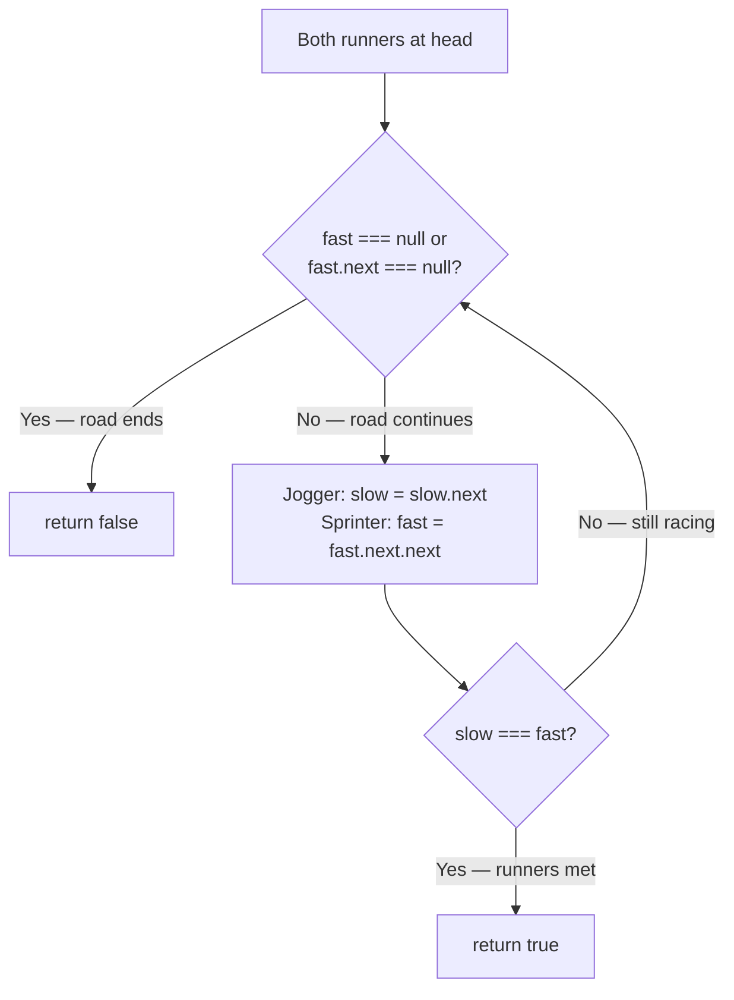

# Linked List Cycle - Mental Model

## The Problem

Given the `head` of a linked list, return `true` if the linked list has a cycle in it, otherwise, return `false`.

There is a cycle in a linked list if there is some node in the list that can be reached again by continuously following the `next` pointer. Internally, `pos` is used to denote the index of the node that tail's `next` pointer is connected to. Note that `pos` is not passed as a parameter.

**Example 1:**
```
Input: head = [3,2,0,-4], pos = 1
Output: true
Explanation: There is a cycle in the linked list, where the tail connects to the 1st node (0-indexed).
```

**Example 2:**
```
Input: head = [1,2], pos = 0
Output: true
Explanation: There is a cycle in the linked list, where the tail connects to the 0th node.
```

**Example 3:**
```
Input: head = [1], pos = -1
Output: false
Explanation: There is no cycle in the linked list.
```

## The Circular Track Analogy

Imagine two runners starting together at the same spot on what might be a circular running track or a straight road. One runner jogs at a steady pace, moving one step at a time. The other is a sprinter who covers two steps with every stride. Both start at the same point and keep moving forward.

If the road is straight and has a finish line, the sprinter reaches it first. They look back — the jogger is still approaching — and no one ever catches anyone. The sprinter hits null (the end) and stops.

But if the path curves back on itself — if the track loops around — something interesting happens. The sprinter, being faster, eventually laps the jogger. On a circular track, no matter where they start or how big the loop is, the sprinter will always catch the jogger from behind. Two runners on an infinite loop, moving at different speeds, are guaranteed to share the same spot.

The insight is this: a straight road means the fast runner escapes to the end; a circular road means the fast runner keeps lapping and must eventually coincide with the slow runner. Whether the linked list has a cycle is the same question as whether two runners on that path will ever stand at the same node.

## Understanding the Analogy

### The Setup

Two runners stand at the starting line — the head of the linked list. The jogger takes one step per stride; the sprinter takes two. Both move forward along the path. At each lap we check whether they've arrived at the same node.

The only question is whether the path ends (straight road → the sprinter reaches null and we return false) or loops (circular track → the sprinter catches the jogger and we return true).

### The Race Condition

The sprinter can only run if there is road ahead. Before each stride, we verify two things: the sprinter is not standing on null (no road at all), and the next step ahead of the sprinter is not null (we need two steps of road because the sprinter covers two steps per stride).

If either condition fails, we've confirmed the road ends — return false. We check the sprinter, not the jogger, because the sprinter is always at least as far ahead. If the sprinter can't continue, the jogger certainly hasn't looped back.

### Why This Approach

Naively, you might mark every node you've visited (put a flag at each checkpoint) and return true if you ever revisit a flagged checkpoint. That works but requires O(n) extra space for the flags.

The two-runner approach uses O(1) space — just two pointer variables. It works because of a mathematical guarantee: on a circular track, a runner moving at speed 2 gains exactly one position on a runner at speed 1 each lap. When the sprinter has lapped the full cycle length worth of distance past the jogger, they share the same node. This is guaranteed to happen within at most n laps once the sprinter has entered the loop.

---

## How I Think Through This

I initialize `slow = head` and `fast = head`, placing both runners at the starting line. Then I enter a loop that continues only while the sprinter has at least two steps of road ahead: `fast !== null && fast.next !== null`. Inside the loop, I advance the jogger by one step and the sprinter by two. After each advance I check whether `slow === fast` — if they've landed on the same node, I immediately return `true`. If the loop terminates naturally (sprinter hit a dead end), I return `false`.

Take `head = [3,2,0,-4]` with the tail connecting back to index 1.

:::trace-lr
[
  {"chars":["3","2","0","-4"],"L":0,"R":0,"action":null,"label":"Both runners start at index 0 (val=3). Tail of the list loops back to index 1."},
  {"chars":["3","2","0","-4"],"L":1,"R":2,"action":null,"label":"Lap 1: Jogger → index 1 (val=2). Sprinter → index 2 (val=0). Different nodes — keep running."},
  {"chars":["3","2","0","-4"],"L":2,"R":1,"action":"mismatch","label":"Lap 2: Jogger → index 2 (val=0). Sprinter → index 3 → (cycle) → index 1 (val=2). Sprinter lapped through the loop!"},
  {"chars":["3","2","0","-4"],"L":3,"R":3,"action":"match","label":"Lap 3: Jogger → index 3 (val=-4). Sprinter → index 2 → index 3 (val=-4). Same node — cycle confirmed! Return true."}
]
:::

---

## Building the Algorithm

Each step introduces one concept from the Circular Track, then a StackBlitz embed to try it.

### Step 1: The Starting Line

Before the race begins, place both runners at the starting line — `slow = head`, `fast = head`. Then define the race condition: keep running as long as the sprinter has at least two steps of road ahead (`fast !== null && fast.next !== null`). When that condition fails, the road has ended — return `false`.

Step 1 handles only the cases where the loop never runs: an empty list (head is null, sprinter can't start) and a single-node list with no self-link (fast.next is null immediately). Both correctly return false.

:::stackblitz{file="step1-problem.ts" step=1 total=2 solution="step1-solution.ts"}

<details>
<summary>Hints & gotchas</summary>

- **Why check `fast.next !== null`**: Inside the loop you'll call `fast.next.next`. If `fast.next` is null, that access crashes. The loop condition guards it.
- **Don't check `slow`**: The jogger is always at or behind the sprinter. If the sprinter can still run, the jogger definitely can too — no separate null check needed.
- **Return placement**: `return false` goes *after* the while loop — it's what you return when the sprinter reaches the finish line (null), confirming no cycle.

</details>

### Step 2: The Race

Now add the race body. Each lap: advance the jogger one step (`slow = slow.next`), advance the sprinter two steps (`fast = fast.next.next`). Then check if they've landed at the same node (`slow === fast`). If they have — the path is circular, return `true`.

:::trace-lr
[
  {"chars":["3","2","0","-4"],"L":0,"R":0,"action":null,"label":"Race begins. Both at index 0. Tail connects back to index 1."},
  {"chars":["3","2","0","-4"],"L":1,"R":2,"action":null,"label":"Lap 1: Jogger → 1, Sprinter → 2. Different nodes — keep running."},
  {"chars":["3","2","0","-4"],"L":2,"R":1,"action":"mismatch","label":"Lap 2: Jogger → 2, Sprinter → 3 → (cycle) → 1. Sprinter lapped through the loop!"},
  {"chars":["3","2","0","-4"],"L":3,"R":3,"action":"match","label":"Lap 3: Jogger → 3, Sprinter → 2 → 3. Same node — cycle confirmed → return true."}
]
:::

:::stackblitz{file="step2-problem.ts" step=2 total=2 solution="step2-solution.ts"}

<details>
<summary>Hints & gotchas</summary>

- **Advance first, then check**: Both runners start at `head`. Checking `slow === fast` before any movement would return `true` immediately on any non-empty list. Always advance first, then compare.
- **Use `===` not `.val ===`**: Two different nodes can hold the same value. You're checking if both pointers point to the *same object* (same node in memory), not the same number.
- **The sprinter's two-step**: `fast = fast.next.next` — the while condition already guarantees `fast.next !== null`, so accessing `fast.next` is safe. The result of `fast.next.next` can be null — that's fine, it just means the sprinter hits the end on the next loop check.

</details>

## The Circular Track at a Glance



## Tracing through an Example

Input: `[3, 2, 0, -4]`, tail connects back to index 1 (the `2` node)

| Lap | Jogger (slow) | Jogger val | Sprinter (fast) | Sprinter val | Same node? | Action |
|-----|--------------|-----------|----------------|-------------|-----------|--------|
| Start | index 0 | 3 | index 0 | 3 | — | Both placed at head |
| 1 | index 1 | 2 | index 2 | 0 | No | Advance both; still racing |
| 2 | index 2 | 0 | index 1 | 2 | No | Sprinter looped back through the tail |
| 3 | index 3 | -4 | index 3 | -4 | Yes | Same node — return true |

---

## Common Misconceptions

**"If the sprinter is ahead, they can never catch the jogger"** — This is true on a straight road, but a circular track changes everything. The sprinter doesn't slow down to meet the jogger — they lap them. The sprinter keeps gaining one position per lap until they've gone all the way around the loop and arrived at the same node from behind.

**"I should check `slow === fast` before advancing the runners"** — Both runners start at `head`. Checking before any movement would return `true` immediately for any non-empty input. The check must happen after both runners have taken their strides.

**"I need `fast !== null && fast.next !== null && fast.next.next !== null`"** — The third check is redundant. Inside the loop you write `fast = fast.next.next`. That reads `fast.next` first (already guarded by `fast.next !== null`), then reads `.next` on the result. The result can be null — that just means the sprinter reaches the finish on the *next* iteration's while check, not a crash.

**"A cycle must loop back to the very first node"** — The cycle can reconnect at any interior node. In example 1, the tail connects back to index 1, not index 0. The two-runner method detects this regardless, because on any closed loop the sprinter will eventually lap the jogger no matter where the loop begins.

**"I should compare `slow.val === fast.val` to detect the meeting"** — Two different nodes can hold the same value. You're asking whether both pointers reference the *same node object*, not whether they're reading the same number. Use reference equality (`slow === fast`) on the pointers themselves.

---

## Complete Solution

:::stackblitz{file="solution.ts" step=2 total=2 solution="solution.ts"}
