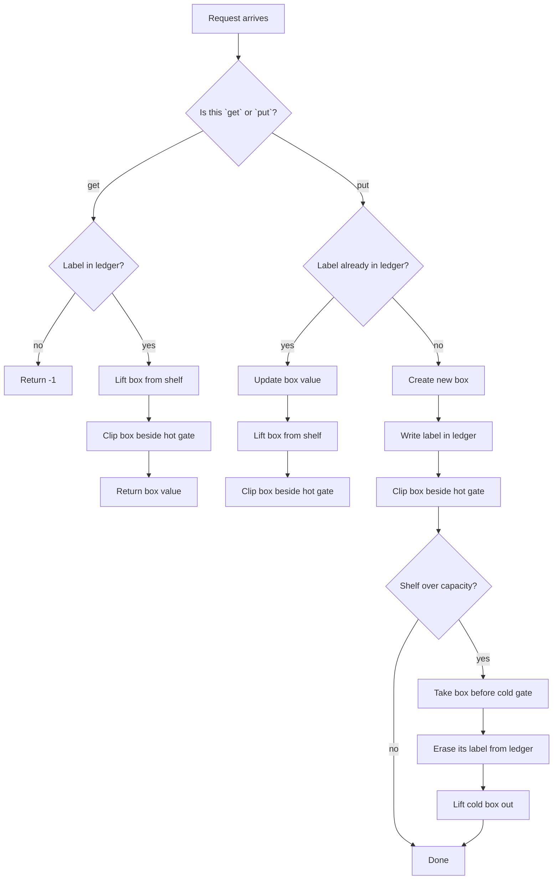

# LRU Cache - Mental Model

## The Problem

Design a data structure that follows the constraints of a Least Recently Used (LRU) cache.

Implement the `LRUCache` class:

- `LRUCache(int capacity)` Initialize the LRU cache with positive size `capacity`.
- `int get(int key)` Return the value of the `key` if the key exists, otherwise return `-1`.
- `void put(int key, int value)` Update the value of the `key` if the `key` exists. Otherwise, add the `key-value` pair to the cache. If the number of keys exceeds the `capacity` from this operation, evict the least recently used key.

The functions `get` and `put` must each run in `O(1)` average time complexity.

**Example 1:**
```
Input:
["LRUCache", "put", "put", "get", "put", "get", "put", "get", "get", "get"]
[[2], [1, 1], [2, 2], [1], [3, 3], [2], [4, 4], [1], [3], [4]]
Output:
[null, null, null, 1, null, -1, null, -1, 3, 4]
```

## The Hot Shelf Analogy

Imagine a tiny workshop shelf that can only hold a few tool boxes. The foreman wants the boxes he touched most recently to stay on the **hot shelf** right by his hands. The box he has ignored the longest belongs at the cold end, ready to be thrown out if space runs out.

The workshop needs two things at the same time. First, it needs a **ledger** so the foreman can instantly find a box by its label without scanning the whole shelf. Second, it needs a **physical shelf order** so it always knows which box is hottest and which one is coldest. The ledger answers "where is box 7?" The shelf answers "which box gets evicted next?"

That means every box lives in two worlds at once. In the ledger, each label points straight to its box. On the shelf, each box is connected to its warmer neighbor and its colder neighbor, so any touched box can be lifted out and moved to the hot end without disturbing the rest of the row.

The key insight is simple: **every touch reheats a box**. A successful `get` reheats it. A `put` for an existing label reheats it. A new `put` creates a fresh hot box. If the shelf is full, the coldest untouched box at the far end is the one that leaves.

## Understanding the Analogy

### The Setup

The workshop has a strict shelf limit. Once every slot is full, any new arrival forces one old box out. But the foreman is not allowed to stand there reading labels from left to right every time he needs something. That would be too slow.

So the workshop keeps a paper ledger by the shelf. The moment the foreman hears "bring me box 3," he looks up label 3 in the ledger and gets his hand directly onto the right box. No shelf scan. No guessing.

### The Ledger and the Shelf Rails

The ledger alone is not enough. It can find a box instantly, but it cannot tell which box has gone coldest over time. For that, the shelf itself has rails connecting the boxes from hot to cold.

The hot end sits right beside the foreman. The cold end sits by the discard bin. Every time a box is touched, it is unclipped from wherever it currently sits and snapped back onto the hot end. That makes the shelf order a live history of recent use.

Two permanent shelf stoppers make the rail work cleanly: one at the hot entrance and one at the cold exit. They are not real boxes anyone asks for. They just guarantee that every real box always has something on each side when it is clipped in or lifted out, so there are no awkward edge cases at the ends.

### Why This Approach

If the workshop used only a shelf, then finding box 42 would require a walk along the row. If it used only a ledger, it could find boxes quickly but would have no constant-time way to know which forgotten box should be evicted next.

The ledger plus the rail solves both problems at once. The ledger gives direct lookup. The rail gives direct reheating and direct eviction. A touch becomes: find the box in the ledger, unclip it, and snap it onto the hot end. An overflow becomes: grab the box nearest the cold exit and remove its label from the ledger. Everything important stays O(1).

## How I Think Through This

I think of `boxesByLabel` as the paper ledger and the linked shelf as the physical hot-to-cold order. The invariant is: the box right after `hotGate` is the most recently used real box, and the box right before `coldGate` is the eviction target. The gates themselves are just permanent shelf stoppers that make clipping operations uniform.

For `get(key)`, I first ask the ledger whether that label exists. If it does not, I return `-1` immediately. If it does, I take the recorded shelf node, lift that box out of its current slot, and snap it back beside `hotGate`. The value comes back with it, and the shelf order now reflects that this box was just touched.

For `put(key, value)`, there are two paths. If the label already exists, I update that box's contents and reheat it by moving it to the hot end. If the label is new, I build a new box, write it into the ledger, snap it onto the hot end, and then check capacity. If the shelf has overflowed, I remove the box just before `coldGate` because that is the coldest untouched one.

Take `capacity = 2` with operations `put(1,1), put(2,2), get(1), put(3,3)`.

:::trace-ll
[
  {"nodes":[{"val":"HOT"},{"val":"1:1"},{"val":"2:2"},{"val":"COLD"}],"pointers":[{"index":1,"label":"recent","color":"green"},{"index":2,"label":"evict","color":"orange"}],"action":null,"label":"After `put(1,1)` and `put(2,2)`, box 2 is hottest and box 1 is coldest."},
  {"nodes":[{"val":"HOT"},{"val":"2:2"},{"val":"1:1"},{"val":"COLD"}],"pointers":[{"index":1,"label":"recent","color":"green"},{"index":2,"label":"evict","color":"orange"}],"action":"found","label":"`get(1)` finds box 1 in the ledger, then reheats it onto the hot end. Now box 2 is coldest."},
  {"nodes":[{"val":"HOT"},{"val":"3:3"},{"val":"1:1"},{"val":"COLD"}],"pointers":[{"index":1,"label":"recent","color":"green"},{"index":2,"label":"evict","color":"orange"}],"action":"done","label":"`put(3,3)` adds a fresh hot box. Shelf overflows, so cold box 2 is evicted. Remaining order: 3 hot, 1 cold."}
]
:::

---

## Building the Algorithm

Each step introduces one part of the Hot Shelf, then a StackBlitz embed to try it.

### Step 1: Build the Shelf Rails and the Ledger

Before the cache can behave like an LRU cache, it needs the workshop hardware. That means a ledger from label to shelf node, plus a doubly linked shelf with a hot gate and a cold gate.

This step teaches the core shelf moves: clip a box onto the hot end, lift a box out of the row, and look up a label in O(1). With those mechanics, the cache can already handle simple cases where capacity is never exceeded. A new `put` makes a fresh hot box, an existing `put` updates the box and reheats it, and `get` can find a value. We are not evicting yet, so the tests stay within shelf capacity.

:::trace-ll
[
  {"nodes":[{"val":"HOT"},{"val":"COLD"}],"pointers":[{"index":0,"label":"hotGate","color":"green"},{"index":1,"label":"coldGate","color":"orange"}],"action":null,"label":"The shelf starts with two permanent gates and no real boxes between them."},
  {"nodes":[{"val":"HOT"},{"val":"1:10"},{"val":"COLD"}],"pointers":[{"index":1,"label":"box","color":"blue"},{"index":1,"label":"recent","color":"green"}],"action":"rewire","label":"A new box clips in right after the hot gate. It is automatically the hottest box."},
  {"nodes":[{"val":"HOT"},{"val":"1:15"},{"val":"COLD"}],"pointers":[{"index":1,"label":"box","color":"blue"},{"index":1,"label":"recent","color":"green"}],"action":"found","label":"Updating the same label changes the box contents and keeps it on the hot end."}
]
:::

:::stackblitz{file="step1-problem.ts" step=1 total=2 solution="step1-solution.ts"}

<details>
  <summary>Hints & gotchas</summary>

- **The gates are not real cache entries**: they exist only so every insert and removal has neighbors on both sides.
- **The ledger must store nodes, not just values**: the shelf move needs a direct handle on the exact box to lift out.
- **Reheating means move, not duplicate**: if a label already exists, update that same box and clip it back to the hot end.
</details>

### Step 2: Reheat on Every Touch and Evict the Cold Box

Now the shelf becomes a true LRU cache. Every successful touch must reheat the box. That means `get` cannot be "just read from the ledger" anymore; it also has to move the box to the hot end. Existing-label `put` does the same after updating the value.

For new labels, clip the new box onto the hot end, then check whether the shelf is now too crowded. If it is, the cold box is the one sitting immediately before `coldGate`. Lift that box out, erase its label from the ledger, and the shelf is valid again.

:::trace-ll
[
  {"nodes":[{"val":"HOT"},{"val":"2:2"},{"val":"1:1"},{"val":"COLD"}],"pointers":[{"index":1,"label":"recent","color":"green"},{"index":2,"label":"evict","color":"orange"}],"action":null,"label":"Initial full shelf at capacity 2: box 2 is hot, box 1 is cold."},
  {"nodes":[{"val":"HOT"},{"val":"1:1"},{"val":"2:2"},{"val":"COLD"}],"pointers":[{"index":1,"label":"recent","color":"green"},{"index":2,"label":"evict","color":"orange"}],"action":"rewire","label":"`get(1)` reheats box 1 by moving it beside the hot gate. Box 2 becomes the cold target."},
  {"nodes":[{"val":"HOT"},{"val":"3:3"},{"val":"1:1"},{"val":"2:2"},{"val":"COLD"}],"pointers":[{"index":1,"label":"recent","color":"green"},{"index":3,"label":"evict","color":"orange"}],"action":"rewire","label":"`put(3,3)` first clips the new box onto the hot end, which temporarily overfills the shelf."},
  {"nodes":[{"val":"HOT"},{"val":"3:3"},{"val":"1:1"},{"val":"COLD"}],"pointers":[{"index":1,"label":"recent","color":"green"},{"index":2,"label":"evict","color":"orange"}],"action":"done","label":"Evict the box before the cold gate: label 2 leaves the shelf and is erased from the ledger."}
]
:::

:::stackblitz{file="step2-problem.ts" step=2 total=2 solution="step2-solution.ts"}

<details>
  <summary>Hints & gotchas</summary>

- **A successful `get` is a touch**: reading a box reheats it, so the shelf order must change.
- **Evict after the insert**: adding first makes the new box hottest immediately; then remove the cold box if capacity was exceeded.
- **The eviction target is not "the smallest key"**: it is the box closest to `coldGate`, regardless of label or value.
</details>

## The Hot Shelf at a Glance



---

## Common Misconceptions

**"The map alone is the cache."** — The ledger can tell you where a labeled box is, but it cannot tell you which untouched box has gone coldest. The correct mental model is: the ledger finds boxes; the shelf order decides eviction.

**"A `get` should not change the structure because it only reads."** — On the hot shelf, reading a box is still touching it with the foreman's hand. The correct mental model is: every successful touch reheats the box and moves it to the hot end.

**"I can evict before I insert the new box."** — That treats the new box like it has not been touched yet, which is backwards. The correct mental model is: the arriving box is immediately hottest, so clip it onto the hot end first, then discard the cold box if the shelf overflowed.

**"I can store values in the ledger and search the shelf only when I need to move something."** — The moment you search the shelf, you lose O(1) behavior. The correct mental model is: each ledger entry must point directly to the physical box node so lift-and-clip stays constant time.

## Complete Solution

:::stackblitz{file="solution.ts" step=2 total=2 solution="solution.ts"}
