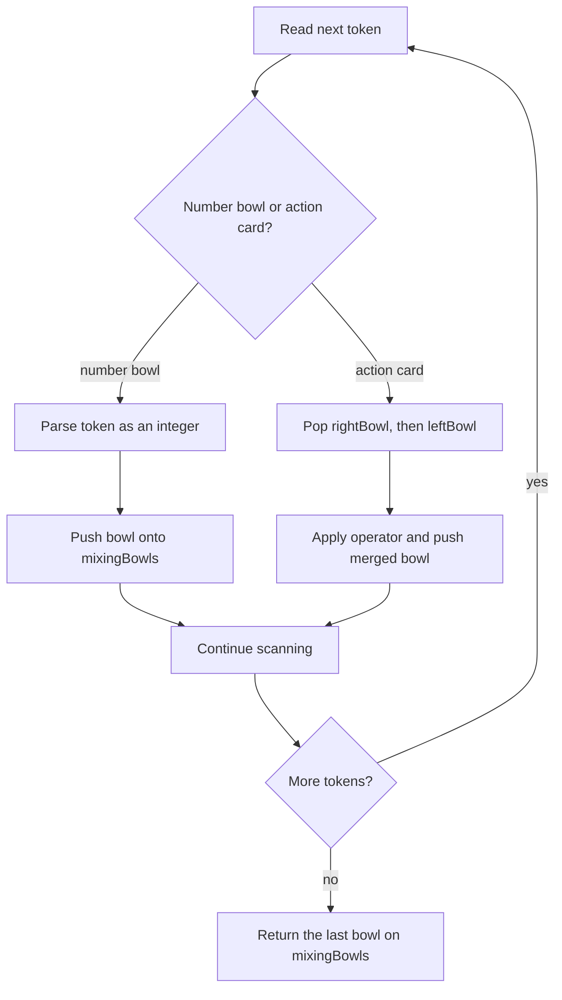

# Evaluate Reverse Polish Notation - Mental Model

## The Problem

You are given an array of strings `tokens` that represents an arithmetic expression in a Reverse Polish Notation. Evaluate the expression and return an integer that represents the value of the expression. Note that valid operators are `'+'`, `'-'`, `'*'`, and `'/'`. Each operand may be an integer or another expression. The division between two integers always truncates toward zero. There will not be any division by zero. The input represents a valid arithmetic expression in a reverse polish notation. The answer and all intermediate calculations can be represented in a 32-bit integer.

**Example 1:**
```
Input: tokens = ["2","1","+","3","*"]
Output: 9
```

**Example 2:**
```
Input: tokens = ["4","13","5","/","+"]
Output: 6
```

**Example 3:**
```
Input: tokens = ["10","6","9","3","+","-11","*","/","*","17","+","5","+"]
Output: 22
```

## The Mixing Bowls and Action Cards Analogy

Imagine a cooking show where every token arrives as either a **prepared bowl** or an **action card**. A number token means, "Place this bowl on the counter." An operator token means, "Take the two bowls most recently placed on the counter, combine them in this specific way, and put the new bowl back."

The counter is not spread out like a table of steps. It is a vertical stack of bowls. That matters because Reverse Polish Notation never asks you to hunt around for older ingredients. It always says: use the latest two ready bowls.

So the puzzle is really about keeping the counter disciplined. Number tokens add fresh bowls. Action cards shrink two bowls into one. By the time the show ends, exactly one finished bowl should remain on the counter, and that bowl is the answer.

## Understanding the Analogy

### The Setup

The host reads the recipe from left to right. Some cards are bowls already filled with a number. Those go straight onto the counter. Other cards are instructions like "add," "subtract," "multiply," or "divide." Those cards do not create a new ingredient from nowhere. They act on bowls that are already waiting.

Because the recipe is written in postfix form, the counter never needs parentheses or precedence rules. The order is baked into the stack itself. Whenever an action card appears, the correct bowls are simply the two bowls on top.

### The Two-Bowl Rule

Every action card consumes exactly two bowls. The most recently placed bowl is the **right bowl**, and the bowl just under it is the **left bowl**. That order is easy to miss, but it is the whole reason subtraction and division work correctly. If the host pulls the bowls in the wrong order, the recipe changes.

After the host combines those two bowls, the counter receives one replacement bowl containing the result. So an action card always reduces the bowl stack by one: two bowls leave, one bowl returns.

### Why This Approach

Trying to evaluate postfix notation without a stack is like trying to cook while repeatedly reshuffling the entire counter. You would keep searching for which ingredients are "ready" and which operation should apply next.

The bowl stack removes that confusion. Each token is handled once. Number tokens are stacked once. Each action card pops two bowls and pushes one result bowl. That keeps the process linear and makes the correct evaluation order feel mechanical instead of mysterious.

## How I Think Through This

I scan `tokens` from left to right with one stack named `mixingBowls`. If `token` is a number, I parse it and push that bowl onto `mixingBowls`. If `token` is an operator, I pop `rightBowl` first, then `leftBowl`, apply the operator in that left-right order, and push the merged bowl back. The invariant is: **after processing token `i`, `mixingBowls` contains every unfinished sub-expression in the exact order the next action card needs them**.

When the scan ends, every action card has already collapsed its two latest bowls into one result bowl. That means the counter should hold exactly one bowl, so I return `mixingBowls[mixingBowls.length - 1]`.

Take `["2","1","+","3","*"]`.

:::trace-sq
[
  {
    "structures": [
      { "kind": "stack", "label": "mixingBowls", "items": [], "color": "blue", "emptyLabel": "no bowls yet" }
    ],
    "action": null,
    "label": "The counter starts empty before the host reads any recipe cards."
  },
  {
    "structures": [
      { "kind": "stack", "label": "mixingBowls", "items": [2], "color": "blue", "activeIndices": [0], "pointers": [{ "index": 0, "label": "top" }] }
    ],
    "action": "push",
    "label": "Read `2`: place a prepared bowl with value `2` on the counter."
  },
  {
    "structures": [
      { "kind": "stack", "label": "mixingBowls", "items": [2, 1], "color": "blue", "activeIndices": [1], "pointers": [{ "index": 1, "label": "top" }] }
    ],
    "action": "push",
    "label": "Read `1`: another prepared bowl lands on top of the first bowl."
  },
  {
    "structures": [
      { "kind": "stack", "label": "mixingBowls", "items": [3], "color": "blue", "activeIndices": [0], "pointers": [{ "index": 0, "label": "top" }] }
    ],
    "action": "pop",
    "label": "Read `+`: the host lifts the right bowl `1`, then the left bowl `2`, adds them, and returns one bowl with value `3`."
  },
  {
    "structures": [
      { "kind": "stack", "label": "mixingBowls", "items": [3, 3], "color": "blue", "activeIndices": [1], "pointers": [{ "index": 1, "label": "top" }] }
    ],
    "action": "push",
    "label": "Read `3`: place one more prepared bowl on top, ready for the next action card."
  },
  {
    "structures": [
      { "kind": "stack", "label": "mixingBowls", "items": [9], "color": "blue", "activeIndices": [0], "pointers": [{ "index": 0, "label": "top" }] }
    ],
    "action": "done",
    "label": "Read `*`: combine the top two bowls `3` and `3` into one finished bowl `9`. The last bowl is the answer."
  }
]
:::

---

## Building the Algorithm

Each step introduces one part of the cooking-show workflow, then a StackBlitz embed to try it.

### Step 1: Stack the Prepared Bowls

Start with the simplest version of the counter: if a token is a number, turn it into a bowl and stack it. This step is about trusting the physical setup before you handle any action cards.

The learner should ask, "Can I read a postfix recipe and keep every prepared bowl in arrival order, with the newest bowl always on top?"

:::trace-sq
[
  {
    "structures": [
      { "kind": "stack", "label": "mixingBowls", "items": [], "color": "blue", "emptyLabel": "no bowls yet" }
    ],
    "action": null,
    "label": "Start with an empty counter."
  },
  {
    "structures": [
      { "kind": "stack", "label": "mixingBowls", "items": [7], "color": "blue", "activeIndices": [0], "pointers": [{ "index": 0, "label": "top" }] }
    ],
    "action": "push",
    "label": "Read `7`: one prepared bowl becomes the entire stack."
  },
  {
    "structures": [
      { "kind": "stack", "label": "mixingBowls", "items": [-7], "color": "blue", "activeIndices": [0], "pointers": [{ "index": 0, "label": "top" }] }
    ],
    "action": "push",
    "label": "Negative-number bowls like `-7` are still just bowls. They are not action cards."
  }
]
:::

:::stackblitz{file="step1-problem.ts" step=1 total=2 solution="step1-solution.ts"}

<details>
  <summary>Hints & gotchas</summary>

  - **Bowls vs action cards**: only the exact symbols `+`, `-`, `*`, and `/` are action cards. A token like `-11` is already a prepared bowl.
  - **Newest bowl on top**: the stack is the whole point. Do not flatten it into a running total.
  - **Step 1 is intentionally narrow**: the only tests here are recipes that are already finished as soon as their single bowl is placed.
</details>

### Step 2: Play the Action Cards

Now teach the host what an action card does. When `token` is an operator, lift the top bowl as `rightBowl`, lift the next bowl as `leftBowl`, combine them in that left-right order, and place the result bowl back onto the counter.

That order is the key insight. Addition and multiplication hide mistakes because they are symmetric. Subtraction and division expose whether you really respected the counter.

:::trace-sq
[
  {
    "structures": [
      { "kind": "stack", "label": "mixingBowls", "items": [4, 13, 5], "color": "blue", "activeIndices": [2, 1], "pointers": [{ "index": 2, "label": "right" }, { "index": 1, "label": "left" }] }
    ],
    "action": null,
    "label": "Before reading `/`, the latest two ready bowls are `13` on top and `5` just beneath it."
  },
  {
    "structures": [
      { "kind": "stack", "label": "mixingBowls", "items": [4, 2], "color": "blue", "activeIndices": [1], "pointers": [{ "index": 1, "label": "top" }] }
    ],
    "action": "pop",
    "label": "Read `/`: lift right bowl `5`, then left bowl `13`, compute `13 / 5`, truncate toward zero, and return bowl `2`."
  },
  {
    "structures": [
      { "kind": "stack", "label": "mixingBowls", "items": [6], "color": "blue", "activeIndices": [0], "pointers": [{ "index": 0, "label": "top" }] }
    ],
    "action": "done",
    "label": "Read `+`: combine left bowl `4` and right bowl `2` into one final bowl `6`."
  }
]
:::

:::stackblitz{file="step2-problem.ts" step=2 total=2 solution="step2-solution.ts"}

<details>
  <summary>Hints & gotchas</summary>

  - **Pop order matters**: the first pop is the right bowl, not the left bowl.
  - **Division rule**: use truncation toward zero for the returned bowl, so `Math.trunc(left / right)` matches the recipe.
  - **One card shrinks the counter**: an action card always removes two bowls and returns one.
</details>

## The Counter at a Glance



---

## Common Misconceptions

**"The first bowl I pop should be the left operand."** That flips the recipe for subtraction and division. On this counter, the top bowl is the right bowl because it arrived later; the bowl beneath it is the left bowl.

**"A token with a minus sign must be the subtraction card."** Not when it has digits attached. `-11` is a prepared bowl already filled with a negative value. Only the single token `-` is the subtraction card.

**"I should apply normal infix precedence rules."** The postfix recipe already encoded the cooking order. The counter decides everything by stack position, so there is no extra precedence work left to do.

**"Division should floor downward."** The show uses truncation toward zero, not floor. A negative bowl divided by a positive bowl must move back toward zero, not farther away from it.

## Complete Solution

:::stackblitz{file="solution.ts" step=2 total=2 solution="solution.ts"}
