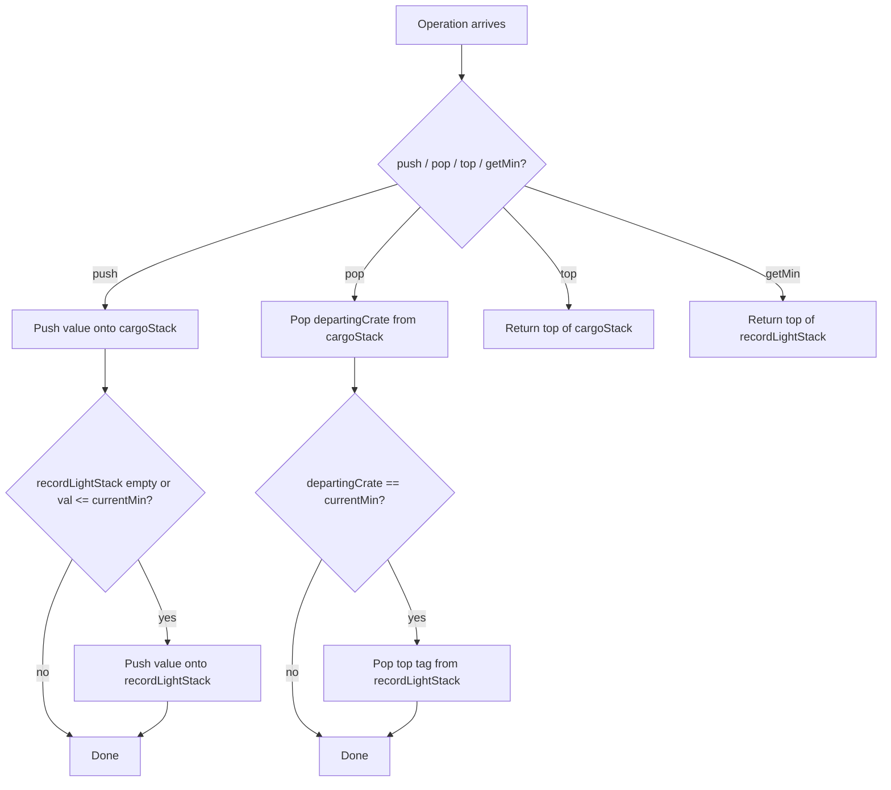

# Min Stack - Mental Model

## The Problem

Design a stack that supports push, pop, top, and retrieving the minimum element in constant time.

Implement the `MinStack` class:

- `MinStack()` initializes the stack object.
- `void push(int val)` pushes the element `val` onto the stack.
- `void pop()` removes the element on the top of the stack.
- `int top()` gets the top element of the stack.
- `int getMin()` retrieves the minimum element in the stack.

You must implement a solution with `O(1)` time complexity for each function.

**Example 1:**
```
Input:
["MinStack","push","push","push","getMin","pop","top","getMin"]
[[],[-2],[0],[-3],[],[],[],[]]
Output:
[null,null,null,null,-3,null,0,-2]
```

## The Cargo Stack and Record-Light Tags Analogy

Imagine a loading dock where crates are piled into one vertical cargo stack. The workers follow normal stack rules: the most recently loaded crate is the first one they can remove. That makes `push`, `pop`, and `top` feel natural, because they only care about the crate at the top of the pile.

But the foreman has one extra demand: at any moment, without rummaging through the whole pile, he wants to know which crate in the entire stack is the lightest. If the dock crew had to dig through every crate each time he asked, the operation would be too slow.

So the dock keeps a second, thinner stack beside the real one: a stack of **record-light tags**. A tag is placed there only when a newly loaded crate is at least as light as every crate already in the pile. The top tag always names the current lightest crate on the dock.

That means the dock runs on two synchronized piles. The cargo stack stores everything. The tag stack stores only the moments when the minimum stayed the same or got even smaller. When the top cargo crate leaves, its matching tag leaves too if it was one of those record-light crates.

## Understanding the Analogy

### The Setup

The dock crew can only touch the top crate of the real pile. They cannot pluck a crate out of the middle, and they cannot reorder the stack. Every new arrival lands on top, and every removal takes from the same place.

The foreman, though, is not asking "what is on top?" He is asking "what is the lightest crate anywhere in the pile right now?" That is a whole-stack question, but he still wants the answer instantly, as if it were just another top-of-stack question.

### The Record-Light Tag Stack

The side pile solves that mismatch. Whenever a crate arrives that ties or beats the current lightest crate, the dock writes its weight onto a fresh record-light tag and places that tag on the tag stack. If a heavier crate arrives, no new tag is needed, because the lightest crate has not changed.

The tie rule matters. If the dock sees two crates with weight `2`, both need tags. Otherwise, when one `2` leaves, the dock would forget that another equally light crate is still in the cargo pile. The tag stack is not just tracking new lows. It is tracking the history of who is currently allowed to claim "lightest."

When a crate is removed from the cargo stack, the dock compares it to the top record-light tag. If the departing crate matches that tag, the top tag leaves too. That keeps both piles synchronized: the tag stack never describes a crate that is no longer actually on the dock.

### Why This Approach

If the dock kept only the cargo pile, `getMin()` would require a full scan. If it kept only one current minimum number, pops would be a disaster, because removing the lightest crate would force another full scan to discover the next lightest one.

The shadow tag stack avoids that rescan. Every crate is pushed once onto the cargo pile. Some crates are also pushed onto the tag pile. Every crate is popped once, and a tagged crate may cause one matching tag pop. That keeps every operation constant time while preserving the true minimum after every change.

## How I Think Through This

I treat `cargoStack` as the real pile of crates and `recordLightStack` as the side pile of minimum tags. For `push(val)`, I always place `val` onto `cargoStack`. Then I ask whether `recordLightStack` is empty or whether `val <= currentMin`. If yes, I also place `val` onto `recordLightStack`. The invariant is: **the top of `recordLightStack` is always the lightest crate still present in `cargoStack`**.

For `pop()`, I remove the top crate from `cargoStack` and store it in `departingCrate`. If `departingCrate === recordLightStack[recordLightStack.length - 1]`, I pop the top tag too because that record-light crate just left the dock. Then `top()` is just the top of `cargoStack`, and `getMin()` is just the top of `recordLightStack`.

Take `push(-2), push(0), push(-3), getMin(), pop(), top(), getMin()`.

:::trace-sq
[
  {
    "structures": [
      { "kind": "stack", "label": "cargoStack", "items": [], "color": "blue", "emptyLabel": "no crates" },
      { "kind": "stack", "label": "recordLightStack", "items": [], "color": "green", "emptyLabel": "no tags" }
    ],
    "action": null,
    "label": "Setup: both the real crate pile and the record-light tag pile start empty."
  },
  {
    "structures": [
      { "kind": "stack", "label": "cargoStack", "items": [-2], "color": "blue", "activeIndices": [0], "pointers": [{ "index": 0, "label": "top" }] },
      { "kind": "stack", "label": "recordLightStack", "items": [-2], "color": "green", "activeIndices": [0], "pointers": [{ "index": 0, "label": "min" }] }
    ],
    "action": "push",
    "label": "Push `-2`: the first crate is automatically the lightest, so both piles get `-2`."
  },
  {
    "structures": [
      { "kind": "stack", "label": "cargoStack", "items": [-2, 0], "color": "blue", "activeIndices": [1], "pointers": [{ "index": 1, "label": "top" }] },
      { "kind": "stack", "label": "recordLightStack", "items": [-2], "color": "green", "activeIndices": [0], "pointers": [{ "index": 0, "label": "min" }] }
    ],
    "action": "push",
    "label": "Push `0`: it lands on the cargo pile, but it is heavier than the current record-light crate, so no new tag is needed."
  },
  {
    "structures": [
      { "kind": "stack", "label": "cargoStack", "items": [-2, 0, -3], "color": "blue", "activeIndices": [2], "pointers": [{ "index": 2, "label": "top" }] },
      { "kind": "stack", "label": "recordLightStack", "items": [-2, -3], "color": "green", "activeIndices": [1], "pointers": [{ "index": 1, "label": "min" }] }
    ],
    "action": "push",
    "label": "Push `-3`: this crate beats the old record light, so the side pile gets a fresh `-3` tag."
  },
  {
    "structures": [
      { "kind": "stack", "label": "cargoStack", "items": [-2, 0, -3], "color": "blue", "activeIndices": [2], "pointers": [{ "index": 2, "label": "top" }] },
      { "kind": "stack", "label": "recordLightStack", "items": [-2, -3], "color": "green", "activeIndices": [1], "pointers": [{ "index": 1, "label": "min" }] }
    ],
    "action": "peek",
    "label": "Get min: the top record-light tag already says `-3`, so the foreman gets the answer instantly."
  },
  {
    "structures": [
      { "kind": "stack", "label": "cargoStack", "items": [-2, 0], "color": "blue", "activeIndices": [1], "pointers": [{ "index": 1, "label": "top" }] },
      { "kind": "stack", "label": "recordLightStack", "items": [-2], "color": "green", "activeIndices": [0], "pointers": [{ "index": 0, "label": "min" }] }
    ],
    "action": "pop",
    "label": "Pop: the departing crate is `-3`, which matches the top tag, so both piles remove their top item."
  },
  {
    "structures": [
      { "kind": "stack", "label": "cargoStack", "items": [-2, 0], "color": "blue", "activeIndices": [1], "pointers": [{ "index": 1, "label": "top" }] },
      { "kind": "stack", "label": "recordLightStack", "items": [-2], "color": "green", "activeIndices": [0], "pointers": [{ "index": 0, "label": "min" }] }
    ],
    "action": "peek",
    "label": "Top: the top cargo crate is now `0`."
  },
  {
    "structures": [
      { "kind": "stack", "label": "cargoStack", "items": [-2, 0], "color": "blue", "activeIndices": [1], "pointers": [{ "index": 1, "label": "top" }] },
      { "kind": "stack", "label": "recordLightStack", "items": [-2], "color": "green", "activeIndices": [0], "pointers": [{ "index": 0, "label": "min" }] }
    ],
    "action": "done",
    "label": "Get min again: the top tag has rolled back to `-2`, which is the current lightest crate."
  }
]
:::

---

## Building the Algorithm

Each step introduces one part of the dock system, then a StackBlitz embed to try it.

### Step 1: Keep the Cargo Stack Honest

Start by building the real crate pile itself. `push(val)` should place a crate on top, `pop()` should remove the top crate, and `top()` should show the crate currently sitting highest on the dock.

This first step is deliberately about the physical stack rule only: last loaded, first removed. The learner should ask, "Can I make the real pile behave correctly before I add the foreman's side pile of record-light tags?"

:::trace-sq
[
  {
    "structures": [
      { "kind": "stack", "label": "cargoStack", "items": [], "color": "blue", "emptyLabel": "no crates" }
    ],
    "action": null,
    "label": "Start with an empty cargo pile."
  },
  {
    "structures": [
      { "kind": "stack", "label": "cargoStack", "items": [5], "color": "blue", "activeIndices": [0], "pointers": [{ "index": 0, "label": "top" }] }
    ],
    "action": "push",
    "label": "Push `5`: the first crate becomes the top of the pile."
  },
  {
    "structures": [
      { "kind": "stack", "label": "cargoStack", "items": [5, 7], "color": "blue", "activeIndices": [1], "pointers": [{ "index": 1, "label": "top" }] }
    ],
    "action": "push",
    "label": "Push `7`: newer crates always sit above older ones."
  },
  {
    "structures": [
      { "kind": "stack", "label": "cargoStack", "items": [5], "color": "blue", "activeIndices": [0], "pointers": [{ "index": 0, "label": "top" }] }
    ],
    "action": "pop",
    "label": "Pop: remove the newest crate first, so `5` becomes visible again."
  }
]
:::

:::stackblitz{file="step1-problem.ts" step=1 total=2 solution="step1-solution.ts"}

<details>
  <summary>Hints & gotchas</summary>

  - **Real pile first**: do not think about the minimum yet; make sure the cargo pile itself obeys LIFO exactly.
  - **`top()` is just a glance**: the foreman looks at the top crate without removing it.
  - **No middle access**: the only crate you can remove is the one currently highest in the stack.
</details>

### Step 2: Add the Record-Light Tag Stack

Now give the foreman his side pile. Every push still goes onto `cargoStack`, but a push also goes onto `recordLightStack` when the arriving crate ties or beats the current lightest weight. Every pop still removes from `cargoStack`, but if the departing crate matches the top tag, the matching tag must leave as well.

That one synchronization rule is what makes `getMin()` trivial. The learner should ask, "What extra history do I need to preserve so the current lightest crate is always waiting on top of a shadow stack?"

:::trace-sq
[
  {
    "structures": [
      { "kind": "stack", "label": "cargoStack", "items": [4, 2], "color": "blue", "activeIndices": [1], "pointers": [{ "index": 1, "label": "top" }] },
      { "kind": "stack", "label": "recordLightStack", "items": [4, 2], "color": "green", "activeIndices": [1], "pointers": [{ "index": 1, "label": "min" }] }
    ],
    "action": null,
    "label": "The dock has already seen a new record light at `2`, so both piles currently end with `2`."
  },
  {
    "structures": [
      { "kind": "stack", "label": "cargoStack", "items": [4, 2, 2], "color": "blue", "activeIndices": [2], "pointers": [{ "index": 2, "label": "top" }] },
      { "kind": "stack", "label": "recordLightStack", "items": [4, 2, 2], "color": "green", "activeIndices": [2], "pointers": [{ "index": 2, "label": "min" }] }
    ],
    "action": "push",
    "label": "Push another `2`: ties count too, so the side pile also records this duplicate minimum."
  },
  {
    "structures": [
      { "kind": "stack", "label": "cargoStack", "items": [4, 2], "color": "blue", "activeIndices": [1], "pointers": [{ "index": 1, "label": "top" }] },
      { "kind": "stack", "label": "recordLightStack", "items": [4, 2], "color": "green", "activeIndices": [1], "pointers": [{ "index": 1, "label": "min" }] }
    ],
    "action": "pop",
    "label": "Pop one `2`: because the departing crate matches the top tag, one matching tag leaves too."
  },
  {
    "structures": [
      { "kind": "stack", "label": "cargoStack", "items": [4, 2], "color": "blue", "activeIndices": [1], "pointers": [{ "index": 1, "label": "top" }] },
      { "kind": "stack", "label": "recordLightStack", "items": [4, 2], "color": "green", "activeIndices": [1], "pointers": [{ "index": 1, "label": "min" }] }
    ],
    "action": "peek",
    "label": "Get min: the current lightest crate is still `2` because another tagged `2` remains in the dock."
  }
]
:::

:::stackblitz{file="step2-problem.ts" step=2 total=2 solution="step2-solution.ts"}

<details>
  <summary>Hints & gotchas</summary>

  - **Tie weights matter**: use `<=`, not just `<`, when deciding whether a new record-light tag is needed.
  - **Pop in sync**: compare the departing cargo crate to the top tag before forgetting it.
  - **The side pile stores history, not every crate**: only weights that were current minima when they arrived belong there.
</details>

## The Dock at a Glance



---

## Common Misconceptions

**"I can keep one `currentMin` variable and update it on pushes."** That works only until the lightest crate leaves the dock. The correct mental model is a side pile of record-light tags that remembers earlier minima waiting underneath.

**"I only need to tag a strictly smaller crate."** That loses track of tied lightest crates. The correct mental model is that every crate tying the current record light gets its own tag, so one pop does not erase a surviving twin.

**"`getMin()` should scan the whole cargo pile because the minimum might be anywhere."** That would make the foreman walk the entire dock every time he asks. The correct mental model is that the answer has already been pre-positioned on top of the shadow tag stack.

**"When I pop a crate, the tag pile does not need to know."** Then the side pile can keep advertising a crate that has already left the dock. The correct mental model is two synchronized stacks: if a departing crate owns the top tag, both tops must leave together.

## Complete Solution

:::stackblitz{file="solution.ts" step=2 total=2 solution="solution.ts"}
