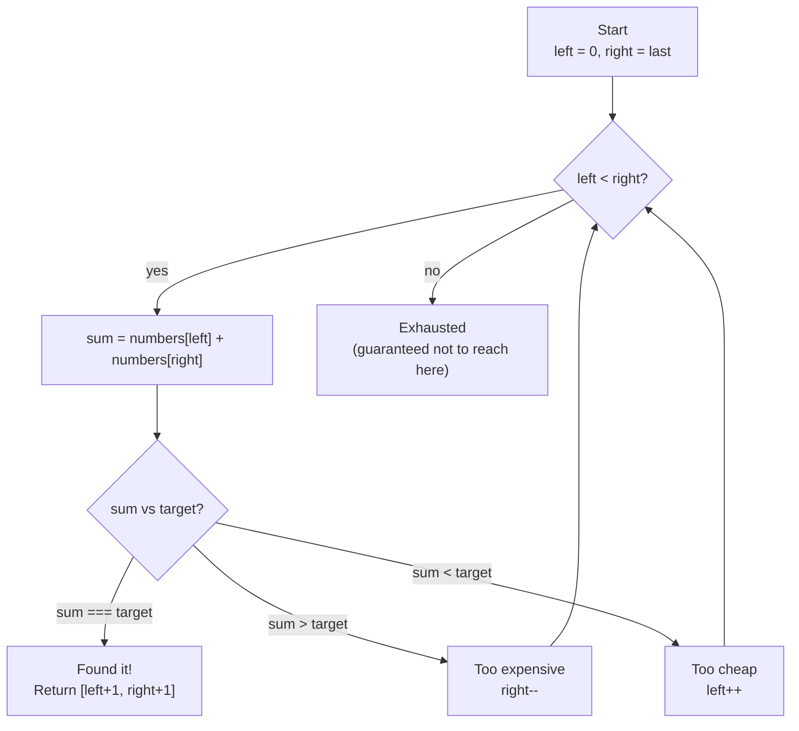

# Two Sum II - Mental Model

## The Problem

Given a 1-indexed array of integers `numbers` that is already sorted in non-decreasing order, find two numbers such that they add up to a specific `target` number. Let these two numbers be `numbers[index1]` and `numbers[index2]` where `1 <= index1 < index2 <= numbers.length`. Return the indices of the two numbers, `index1` and `index2`, added by one as an integer array `[index1, index2]` of length 2. The tests are generated such that there is exactly one solution. You may not use the same element twice. Your solution must use only constant extra space.

**Example 1:**
```
Input: numbers = [2,7,11,15], target = 9
Output: [1,2]
```

**Example 2:**
```
Input: numbers = [2,3,4], target = 6
Output: [1,3]
```

**Example 3:**
```
Input: numbers = [-1,0], target = -1
Output: [1,2]
```

## The Gift Card Squeeze Analogy

Imagine you're at a clearance sale where every item on the rack is arranged strictly from cheapest to most expensive — a $2 scarf on the far left, a $90 jacket on the far right, with everything in between in perfect price order. You have a gift card loaded with exactly the target amount and you need to spend every cent of it on exactly two items.

You have two hands. You start with your left hand resting on the cheapest item and your right hand on the most expensive. You look at the combined price tag on both. If those two items together cost more than your gift card, you need to bring the total down — and the only lever you have is your right hand. Move it one step left to the next cheaper item and check again. If they cost less than your gift card, you need to bring the total up — move your left hand one step right to the next more expensive item.

You keep squeezing inward, one hand at a time, until the two items in your hands cost exactly what's on the gift card. Because the rack is sorted, every move you make is the only logical move — there's no guessing, no backtracking.

The beauty of the sorted rack is that every wrong answer points you in exactly one direction. An unsorted rack would force you to check every possible pair, like flipping through a pile of receipts. The sorted rack turns a blind search into a guided squeeze.

## Understanding the Analogy

### The Setup

The rack holds `n` items arranged from cheapest to most expensive. You need to find two of them whose combined price equals the gift card amount exactly. The problem guarantees there's always exactly one such pair — so the squeeze will always succeed.

You start by placing your left hand at position 0 (the cheapest) and your right hand at position `n − 1` (the most expensive). These two starting positions give you the widest possible price range: the minimum and maximum sum you could ever achieve with any pair. Every future move brings those hands closer together, narrowing the search.

### The Hands

Your left hand always tracks the cheapest item currently under consideration. Your right hand always tracks the most expensive. Their combined price tells you everything you need to know about which direction to move next.

If the combined price exceeds the gift card, the item in your right hand is too expensive for this pairing — no left-hand item can fix that because every option to its right is also too expensive. Move your right hand one step left.

If the combined price falls short, the item in your left hand is too cheap for this pairing — no right-hand item can fix that because every option to its left is also too cheap. Move your left hand one step right.

If the combined price matches exactly: you've found the pair. Return the 1-indexed positions of both hands.

### Why This Approach

The sorted order means every move eliminates an entire class of candidates. Moving your right hand left doesn't just skip one item — it rules out every combination involving the item you just left behind, because everything to its left is cheaper and would only push the sum further down. The same logic applies in reverse when you move your left hand right.

A brute-force search of every pair would take O(n²) time. The Gift Card Squeeze takes O(n) — in the worst case, each hand moves at most `n` steps total, and each step definitively eliminates at least one candidate. No HashMap needed (unlike the unsorted Two Sum), because the sorted order itself is the index.

## How I Think Through This

I initialize two hands: `left` starting at index 0 and `right` starting at the last index. Inside a loop that runs while `left < right`, I compute the sum of the two items currently in my hands. If the sum equals the target, I return `[left + 1, right + 1]` — adding 1 to convert from 0-indexed positions to the 1-indexed answer the problem requires. If the sum is too large, I decrement `right`. If it's too small, I increment `left`.

The loop terminates either by finding the answer (guaranteed by the problem) or when the hands cross — which the problem says can't happen since a solution always exists.

Take `[2, 7, 11, 15]`, target = 18.

:::trace-lr
[
  {"chars": ["2","7","11","15"], "L": 0, "R": 3, "action": null, "label": "Left hand on $2 (cheapest), right hand on $15 (most expensive). Sum = 2 + 15 = 17"},
  {"chars": ["2","7","11","15"], "L": 1, "R": 3, "action": "mismatch", "label": "$17 < $18 — too cheap. Left hand moves right to $7. Sum = 7 + 15 = 22"},
  {"chars": ["2","7","11","15"], "L": 1, "R": 2, "action": "mismatch", "label": "$22 > $18 — too expensive. Right hand moves left to $11. Sum = 7 + 11 = 18"},
  {"chars": ["2","7","11","15"], "L": 1, "R": 2, "action": "match", "label": "$18 === $18 — perfect match! Return [2, 3] (1-indexed)"}
]
:::

---

## Building the Algorithm

Each step introduces one concept from the Gift Card Squeeze, then a StackBlitz embed to try it.

### Step 1: The Starting Positions

Before any squeezing can happen, you need to place your hands on the rack. Your left hand goes to the leftmost item — the cheapest thing on the rack, index 0. Your right hand goes to the rightmost — the most expensive, index `numbers.length - 1`.

Once placed, check the combined price of the two items in your hands. If the sum equals the target immediately, you got lucky: the cheapest and most expensive items together are exactly the gift card amount. Return their 1-indexed positions right away.

When the first pair already matches — like `[-1, 0]` with target `-1` — both hands land on the answer without any movement at all.

:::trace-lr
[
  {"chars": ["-1","0"], "L": 0, "R": 1, "action": null, "label": "Left hand: cheapest at $-1. Right hand: most expensive at $0. Sum = -1 + 0 = -1"},
  {"chars": ["-1","0"], "L": 0, "R": 1, "action": "match", "label": "-1 === -1 — immediate match! Return [1, 2] (1-indexed)"}
]
:::

:::stackblitz{file="step1-problem.ts" step=1 total=2 solution="step1-solution.ts"}

<details>
<summary>Hints & gotchas</summary>

- **1-indexed return**: The problem asks for 1-indexed positions. If `left = 0` and `right = 3`, the answer is `[1, 4]`, not `[0, 3]`.
- **While condition**: The hands move inward — the loop keeps going as long as `left < right`. When they cross, the search space is exhausted.
- **Step 1 scope**: For now, only handle the case where the first pair is already a match. Leave the "what if it doesn't match?" case for step 2.

</details>

### Step 2: The Squeeze

Now add the logic for when the first pair doesn't match. After computing the sum, three outcomes are possible: the sum equals the target (found it — already handled in step 1), the sum is too high (right hand moves left), or the sum is too low (left hand moves right).

Wrap everything in a `while (left < right)` loop so the hands keep squeezing until they find the match. On each iteration, the loop makes exactly one decisive move — eliminating all pairs involving the item just left behind.

Take `[2, 3, 4]`, target = 6. The first pair ($2 + $4 = $6) matches immediately — but use `[2, 7, 11, 15]`, target = 18 to see the squeeze in action:

:::trace-lr
[
  {"chars": ["2","7","11","15"], "L": 0, "R": 3, "action": null, "label": "Left=$2, right=$15. Sum=17 < 18 — too cheap"},
  {"chars": ["2","7","11","15"], "L": 1, "R": 3, "action": "mismatch", "label": "Left hand right to $7. Sum=22 > 18 — too expensive"},
  {"chars": ["2","7","11","15"], "L": 1, "R": 2, "action": "mismatch", "label": "Right hand left to $11. Sum=18 === 18 — match!"},
  {"chars": ["2","7","11","15"], "L": 1, "R": 2, "action": "match", "label": "Return [2, 3] (1-indexed)"}
]
:::

:::stackblitz{file="step2-problem.ts" step=2 total=2 solution="step2-solution.ts"}

<details>
<summary>Hints & gotchas</summary>

- **Three-way branch**: The `if/else if/else` structure covers exactly three outcomes: `sum === target`, `sum > target`, `sum < target`. All three must be handled inside the loop.
- **Which hand moves**: When `sum > target`, move `right--` (cheaper alternative). When `sum < target`, move `left++` (pricier alternative). Getting these backwards is the most common mistake.
- **The guarantee**: The problem promises exactly one solution, so the loop will always find a match before the hands cross. You don't need a fallback return — but TypeScript requires one, so `return []` at the end is fine as dead code.

</details>

---

## Gift Card Squeeze at a Glance



---

## Tracing through an Example

Using `numbers = [2, 7, 11, 15]`, target = `18`:

| Step | Left Hand (left) | Left Price | Right Hand (right) | Right Price | Combined Cost | vs Gift Card ($18) | Move |
|------|---|---|---|---|---|---|---|
| Start | 0 | $2 | 3 | $15 | $17 | too cheap ($1 short) | left++ |
| 1 | 1 | $7 | 3 | $15 | $22 | too expensive ($4 over) | right-- |
| 2 | 1 | $7 | 2 | $11 | $18 | exact match! | return [2, 3] |

---

## Common Misconceptions

**"I need to check every pair since I might miss the answer by moving too fast"** — Each move provably eliminates all other pairs involving the item just left behind. If `right` is at $15 and the sum is too cheap, no left-hand item can fix that — every item to the left of `left` is even cheaper. The squeeze eliminates entire columns or rows of the hypothetical pair grid in a single step.

**"I should move both hands when the sum doesn't match"** — Moving one hand is enough because the sorted order guarantees exactly one direction is productive. Moving both would skip over potential answers. Each step moves exactly one hand, one position.

**"The return values should be 0-indexed like in Two Sum I"** — This problem is explicitly 1-indexed (the problem statement says so and the examples confirm it). Add 1 to each pointer before returning: `[left + 1, right + 1]`.

**"I need a HashMap like the original Two Sum"** — The sorted order makes the HashMap unnecessary. HashMap trades space for the ability to look up complements in an unsorted array. Here, the sorted order gives you that directional certainty for free, in O(1) space.

**"The loop might run forever if there's no solution"** — The problem guarantees exactly one solution exists, so the hands will always find the match before crossing. The `while (left < right)` condition also acts as a natural terminator if a solution somehow didn't exist.

---

## Complete Solution

:::stackblitz{file="solution.ts" step=2 total=2 solution="solution.ts"}
