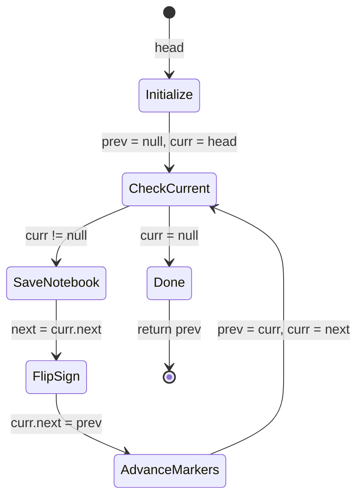

# Reverse Linked List - Mental Model

## The Problem

Given the head of a singly linked list, reverse the list, and return the reversed list.

**Example 1:**
```
Input: head = [1,2,3,4,5]
Output: [5,4,3,2,1]
```

**Example 2:**
```
Input: head = [1,2]
Output: [2,1]
```

**Example 3:**
```
Input: head = []
Output: []
```

## The Road Crew Analogy

Imagine a city district built as a series of one-way streets. Each intersection has a sign pointing to the next intersection in line — you can only travel in one direction. The city planner decides to reverse the direction of the entire route: every sign must now point the opposite way.

A road crew is dispatched. They walk along the route from the very beginning, stopping at each intersection. At every stop, the crew follows the same three-step routine: **note the sign** (write down where it currently points before changing anything), **flip the sign** (redirect it to point back toward where they just came from), and **advance** (move forward to the next intersection they wrote down).

In this analogy, each intersection is a node in the linked list, and each sign is the `next` pointer connecting nodes. The crew carries three things as they walk: a **notebook** (`next` variable — saves where the current sign points before the flip), a **flag at the previous intersection** (`prev`), and their **current position** (`curr`). Without the notebook, flipping a sign would erase the only record of where the crew needs to go next — they'd be stranded.

When the crew finishes — when there's no current intersection left to process — the flag at the previous intersection marks what was the old last stop, now the *first* stop on the reversed route. That flag is the new head.

## Understanding the Analogy

### The Setup

The crew starts at the edge of town — before any intersection exists. There's no "previous intersection" yet because the crew hasn't visited one. This starting state is `prev = null`. Their current position (`curr`) begins at the very first intersection, which is `head`.

If the district has no intersections at all (empty list), the crew has nothing to do. `curr` is already null, the while loop never starts, and `prev` — still null — is the correct return value. An empty reversed list is still empty.

### The Three Tools

The notebook (`next`) is the most critical tool the crew carries. Before flipping any sign, the crew writes down where that sign currently points. The instant the sign is flipped, the original "next intersection" information is gone from the node — it now points backward. The notebook entry (`next = curr.next`) is the only thing that tells the crew where to walk after the flip.

The previous-intersection flag (`prev`) starts as null — nothing is behind the crew at the start of the route. After flipping a sign, the crew raises the flag at their current position before stepping forward. The flag always marks "the last intersection whose sign I just fixed." When the final intersection is processed, `prev` holds that node, which is now the new head.

The crew's current position (`curr`) advances each iteration by reading from the notebook. The notebook entry must be saved *before* the flip, and `curr = next` uses that saved value to step forward. The order is non-negotiable: save, flip, advance.

### Why This Approach

Flipping signs one at a time is the only safe approach when each intersection only knows about the *next* one — there's no way to jump to the end and work backwards. The crew must walk forward while simultaneously redirecting all signs backward.

The three-tool dance makes this possible without losing the route. The notebook preserves the path forward, the flag preserves the path backward, and `curr` keeps the crew moving. By the time the crew reaches the end of the route, every sign has been flipped and `prev` holds the last intersection — the new first stop.

---

## How I Think Through This

I start with two markers: `prev = null` (the edge of town — where the reversed chain begins, and what the new tail will point to) and `curr = head` (the first intersection). The while loop runs as long as there's an intersection to process (`curr !== null`). When `curr` falls off the end, `prev` holds the last-processed node, which is now the new head — I return `prev`.

At each intersection I follow three steps in strict order: save the notebook entry (`next = curr.next`) before touching anything, flip the sign (`curr.next = prev`), then advance both markers — `prev` moves to where I am, `curr` moves to what I wrote in the notebook.

Take `[1→2→3]`.

:::trace-lr
[
  {"chars":["null","1","2","3"],"L":0,"R":1,"action":null,"label":"prev=null, curr=node 1. Crew at first intersection, notebook empty."},
  {"chars":["null","1","2","3"],"L":1,"R":2,"action":null,"label":"Saved next=node 2. Flipped node 1's sign ← to null. Advance: prev=node 1, curr=node 2."},
  {"chars":["null","1","2","3"],"L":2,"R":3,"action":null,"label":"Saved next=node 3. Flipped node 2's sign ← to node 1. Advance: prev=node 2, curr=node 3."},
  {"chars":["null","1","2","3"],"L":3,"R":3,"action":"done","label":"Saved next=null. Flipped node 3's sign ← to node 2. curr=null — loop ends. Return prev=node 3 (new head) ✓"}
]
:::

---

## Building the Algorithm

Each step introduces one concept from the Road Crew, then a StackBlitz embed to try it.

### Step 1: Setting Up the Road Markers

Before the crew takes a single step, they establish their starting position. `prev` is set to `null` — there is no previous intersection at the start, and null is exactly what the final node's `next` will need to point to after the reversal. `curr` is set to `head`.

With this setup and the loop shell in place, one case is already handled: an empty city district. If `head` is null, `curr` starts as null, the while loop never executes, and `prev` (still null) is returned — the reversed empty list is correctly null.

:::stackblitz{file="step1-problem.ts" step=1 total=2 solution="step1-solution.ts"}

<details>
<summary>Hints & gotchas</summary>

- **Why prev starts as null**: The first intersection becomes the new *last* after reversal — its `next` must point to null (end of list). Starting `prev = null` means the very first flip sets `firstNode.next = null`, which is exactly right.
- **curr = head, not head.next**: The crew begins *at* the first intersection, not one past it. Starting at `head.next` would skip the first node, losing it from the reversed list entirely.
- **Return prev, not curr or head**: Once the loop ends, `curr` is null. `prev` is the new head — it's the last intersection the crew processed and now points to everything behind it in reversed order.

</details>

### Step 2: The Three-Step Sign-Flipping Dance

Now the crew's routine kicks in. At every intersection, three things happen in strict order:

1. **Open the notebook** (`next = curr.next`) — record where the current sign points *before* touching it
2. **Flip the sign** (`curr.next = prev`) — redirect the current node's pointer back to the previous one
3. **Advance both markers** (`prev = curr`, `curr = next`) — the crew steps forward using the notebook entry

The notebook step is non-negotiable. The instant the sign is flipped, the link to the next intersection no longer exists in the node. Only the notebook preserves it. When `curr` becomes null — when the crew walks off the end of the route — the loop ends and `prev` holds the new head.

:::trace-lr
[
  {"chars":["null","1","2"],"L":0,"R":1,"action":null,"label":"prev=null, curr=node 1. Ready to flip first sign."},
  {"chars":["null","1","2"],"L":1,"R":2,"action":null,"label":"Saved next=node 2. Flipped: 1→null. Advance: prev=node 1, curr=node 2."},
  {"chars":["null","1","2"],"L":2,"R":2,"action":"done","label":"Saved next=null. Flipped: 2→node 1. curr=null — done. Return prev=node 2 (new head) ✓"}
]
:::

:::stackblitz{file="step2-problem.ts" step=2 total=2 solution="step2-solution.ts"}

<details>
<summary>Hints & gotchas</summary>

- **Order is everything**: Save the notebook entry (`next = curr.next`) BEFORE flipping (`curr.next = prev`). Reversing this order destroys the only record of where to go next — the crew gets stranded.
- **Three variables, not two**: With only `prev` and `curr`, after `curr.next = prev` there's no way to advance `curr`. The notebook variable (`next`) is what makes the advance possible after the flip.
- **Advancing prev and curr separately**: `prev = curr` first, then `curr = next`. If you try to combine them or swap the order, one of the markers gets lost.
- **Single-node lists work automatically**: The loop runs once — notebook=null, flip points the node to null (unchanged), advance makes prev=node and curr=null. Loop ends, return prev=the node ✓.

</details>

---

## The Road Crew at a Glance



---

## Tracing through an Example

Input: `head = [1→2→3→4→5]`

| Step | Notebook (next) | prev | curr | Sign Flipped | Reversed Chain So Far |
|------|----------------|------|------|--------------|----------------------|
| Start | — | null | node 1 | — | 1→2→3→4→5 |
| i=1 | node 2 | node 1 | node 2 | 1→null | null←1  2→3→4→5 |
| i=2 | node 3 | node 2 | node 3 | 2→node 1 | null←1←2  3→4→5 |
| i=3 | node 4 | node 3 | node 4 | 3→node 2 | null←1←2←3  4→5 |
| i=4 | node 5 | node 4 | node 5 | 4→node 3 | null←1←2←3←4  5 |
| i=5 | null | node 5 | null | 5→node 4 | null←1←2←3←4←5 |
| Done | — | node 5 | null | — | return node 5 (new head) |

---

## Common Misconceptions

**"I can flip and advance at the same time using `curr = curr.next`"** — Once you flip `curr.next = prev`, the link to the next intersection is gone from that node. Calling `curr = curr.next` after the flip hands you `prev`, not the next unprocessed intersection — the crew would walk backward in circles. The notebook (`next = curr.next`) must be written before the flip, and `curr = next` uses that saved value.

**"I should return `curr` at the end"** — When the loop ends, `curr` is null — the crew walked off the edge of the route. `prev` is the last intersection they processed, which is now the first intersection on the reversed route. Always return `prev`.

**"I need a dummy/sentinel node to handle edge cases"** — No extra node is needed. Starting `prev = null` naturally handles the empty list (loop never runs, return null) and the single-node list (one flip sets the node's next to null, loop ends). Null itself is the correct terminal value.

**"Two pointers are enough — I don't need a third variable"** — With only `prev` and `curr`, flipping `curr.next = prev` destroys the only link to the next intersection. There's no way to advance `curr` afterward. The notebook variable is the minimum required to preserve the forward path while building the backward one.

**"The reversal is built from the end — the last node should be processed first"** — The reversal is built forward, one flip at a time. The crew starts at node 1 and works toward node 5. After processing node 1, it points to null. After node 2, it points to node 1. By the time the crew finishes walking forward, every arrow has been redirected — the chain is fully reversed.

---

## Complete Solution

:::stackblitz{file="solution.ts" step=2 total=2 solution="solution.ts"}
