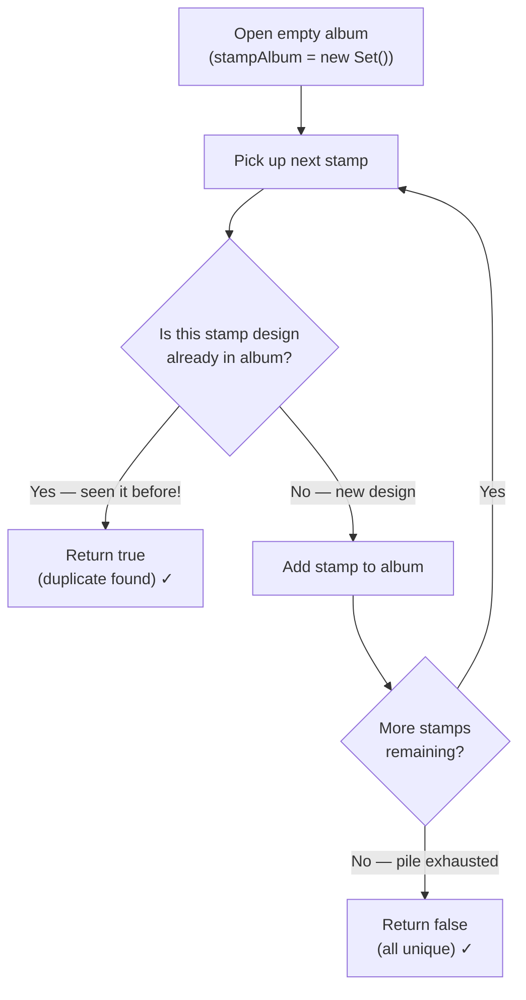

# Contains Duplicate - Mental Model

## The Problem

Given an integer array `nums`, return `true` if any value appears **at least twice** in the array, and return `false` if every element is distinct.

**Example 1:**

```
Input: nums = [1,2,3,1]
Output: true
```

**Example 2:**

```
Input: nums = [1,2,3,4]
Output: false
```

**Example 3:**

```
Input: nums = [1,1,1,3,3,4,3,2,4,2]
Output: true
```

## The Stamp Collector's Album Analogy

Imagine a stamp collector sitting at a desk with a towering pile of stamps to sort. They have a single open album page in front of them — empty at first. Their job: scan through the pile and answer one question: does any stamp design appear more than once?

They work through the pile one stamp at a time. For each stamp they pick up, they glance at the album page. If the design is already mounted in the album, they've found their answer — a duplicate — and they stop immediately. If the design isn't there yet, they mount it and move on to the next stamp. If they reach the end of the pile without finding a match, every stamp was unique.

The album is your **Set** — a collection that stores each design exactly once and lets you check membership in an instant. The pile of stamps is your **array**. The act of checking the album before adding is the heart of the algorithm.

## Understanding the Analogy

### The Setup

The collector faces a pile of stamps in unknown order — no sorting, no hints about which designs repeat. Their goal is not to count how many duplicates exist, just to detect whether even one exists. As soon as a duplicate is confirmed, the work is done.

They have two physical tools: the stamp pile (the array) and the album (the Set). They work left to right through the pile, examining one stamp at a time.

### The Album — One Slot Per Design

The album is the key instrument. It stores each design exactly once — there's no room for a second copy of the same design. Its superpower: checking "is this design already here?" is instantaneous, no matter how many designs are already mounted. That's what makes a Set so valuable over, say, a sorted list you'd scan linearly.

When the collector adds a stamp to the album, they are making a permanent record of "I've seen this design." Every future stamp they pick up gets checked against this growing record.

### Why This Approach

The naive alternative would be to compare every stamp against every other stamp in the pile — for each stamp, check all the ones before it. That works, but the work grows dramatically as the pile grows. A pile of a thousand stamps would require nearly half a million comparisons.

The album approach does one check and one add per stamp, always. The album grows, but each individual check stays instant. That's the trade: a little memory (the album) buys enormous speed.

## How I Think Through This

I start by recognizing this problem wants a single boolean answer: has any number appeared before in this scan? I use two things: `stampAlbum`, a Set that acts as my memory of what I've seen, and `stamp`, each number I'm currently examining. The one invariant I maintain is: every number from the start of the array up to (but not including) the current position is already recorded in `stampAlbum`. At each step I ask: is `stamp` already in `stampAlbum`? If yes, I return `true` immediately — no need to check the rest of the pile. If no, I add `stamp` to `stampAlbum` and continue. If the loop ends without ever returning, every number was unique and I return `false`.

Take `[1, 2, 3, 1]`.

:::trace-ps
[
{"nums":[1,2,3,1],"result":[0,0,0,0],"currentI":-1,"pass":"forward","accumulator":0,"accName":"album","label":"Open the album — no stamp designs recorded yet. Album: {}"},
{"nums":[1,2,3,1],"result":[1,0,0,0],"currentI":0,"pass":"forward","accumulator":1,"accName":"album","label":"Stamp 1: not in album → mount it. Album: {1}"},
{"nums":[1,2,3,1],"result":[1,1,0,0],"currentI":1,"pass":"forward","accumulator":2,"accName":"album","label":"Stamp 2: not in album → mount it. Album: {1, 2}"},
{"nums":[1,2,3,1],"result":[1,1,1,0],"currentI":2,"pass":"forward","accumulator":3,"accName":"album","label":"Stamp 3: not in album → mount it. Album: {1, 2, 3}"},
{"nums":[1,2,3,1],"result":[1,1,1,0],"currentI":3,"pass":"forward","accumulator":3,"accName":"album","label":"Stamp 1: already in album! → return true ✓"},
{"nums":[1,2,3,1],"result":[1,1,1,0],"currentI":-1,"pass":"done","accumulator":0,"accName":"","label":"Done — duplicate detected, returned true ✓"}
]
:::

---

## Building the Algorithm

Each step introduces one concept from the Stamp Collector's Album, then a StackBlitz embed to try it.

### Step 1: Open the Album

Before examining any stamps, the collector opens a fresh, empty album page. This is where all future discoveries will be recorded. Without the album, there's nothing to check against — every stamp would feel "new" and the collector would have no way to detect a repeat.

In code terms: initialize a Set to track everything we've seen so far, and establish the default answer of `false`. Until a duplicate is found, the answer is always "no duplicates yet."

:::stackblitz{file="step1-problem.ts" step=1 total=2 solution="step1-solution.ts"}

### Step 2: Examine Each Stamp and Check for Duplicates

Now the collector works through the pile stamp by stamp. For each stamp they pick up, the decision is the same: is this design already in the album? If yes — duplicate found, stop and return `true`. If no — mount it in the album and continue to the next stamp.

Here's the decision at each stamp:



The critical detail: the check (`stampAlbum.has(stamp)`) must come **before** the add (`stampAlbum.add(stamp)`). If you add first, you'd always find the current stamp in the album — you just put it there — and you'd return `true` even for a pile with no duplicates.

:::stackblitz{file="step2-problem.ts" step=2 total=2 solution="step2-solution.ts"}

## Tracing through an Example

Using `nums = [1, 2, 3, 1]`:

:::trace-ps
[
{"nums":[1,2,3,1],"result":[0,0,0,0],"currentI":-1,"pass":"forward","accumulator":0,"accName":"album","label":"Open the album — no stamp designs recorded yet. Album: {}"},
{"nums":[1,2,3,1],"result":[1,0,0,0],"currentI":0,"pass":"forward","accumulator":1,"accName":"album","label":"Stamp 1: not in album → mount it. Album: {1}"},
{"nums":[1,2,3,1],"result":[1,1,0,0],"currentI":1,"pass":"forward","accumulator":2,"accName":"album","label":"Stamp 2: not in album → mount it. Album: {1, 2}"},
{"nums":[1,2,3,1],"result":[1,1,1,0],"currentI":2,"pass":"forward","accumulator":3,"accName":"album","label":"Stamp 3: not in album → mount it. Album: {1, 2, 3}"},
{"nums":[1,2,3,1],"result":[1,1,1,0],"currentI":3,"pass":"forward","accumulator":3,"accName":"album","label":"Stamp 1: already in album! → return true ✓"},
{"nums":[1,2,3,1],"result":[1,1,1,0],"currentI":-1,"pass":"done","accumulator":0,"accName":"","label":"Done — duplicate detected, returned true ✓"}
]
:::

| Step  | Current Stamp | Album Before Check | In Album? | Action           | Album After |
| ----- | ------------- | ------------------ | --------- | ---------------- | ----------- |
| Start | —             | {}                 | —         | Open empty album | {}          |
| 1     | 1             | {}                 | No        | Add 1 to album   | {1}         |
| 2     | 2             | {1}                | No        | Add 2 to album   | {1, 2}      |
| 3     | 3             | {1, 2}             | No        | Add 3 to album   | {1, 2, 3}   |
| 4     | 1             | {1, 2, 3}          | **Yes**   | Return true ✓    | —           |

---

## Common Misconceptions

**"I should sort the array first, then check adjacent elements"** — Sorting works but costs O(n log n) time. The album approach scans the pile once at O(n). The whole point of trading space (the album) for time is to avoid that sorting cost. A Set gives instant lookups that sorting tries to approximate through adjacency.

**"I need to add the stamp to the album before checking it"** — This is backwards. If you call `stampAlbum.add(stamp)` before `stampAlbum.has(stamp)`, you'll always find the current stamp in the album (you just put it there!) and return `true` even when all values are distinct. Check first, then add.

**"The album approach uses too much memory — isn't that wasteful?"** — The album grows at most to the size of the input array (if all elements are unique). That's O(n) space — the same order as storing the input itself. This trade is standard and expected: a small fixed cost per element eliminates a quadratic scan.

**"I should return false as soon as I add a new stamp"** — Every add means "this was a new design," but that says nothing about the rest of the pile. The only time to return `false` is after the entire pile is exhausted with no duplicates found.

**"I can use an object/map instead of a Set"** — You can, but a Set is the right tool when you only care about membership ("is this value present?"), not associated data ("what count does this value have?"). A Set communicates intent precisely: we're tracking existence, nothing more.

## Complete Solution

:::stackblitz{file="solution.ts" step=2 total=2 solution="solution.ts"}
