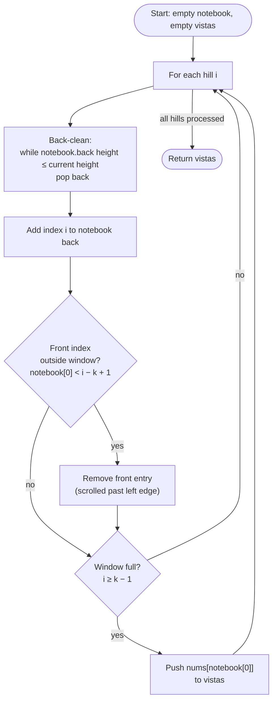

# Sliding Window Maximum - Mental Model

## The Problem

You are given an array of integers `nums`, there is a sliding window of size `k` which is moving from the very left of the array to the very right. You can only see the `k` numbers in the window. Each time the sliding window moves right by one position, return the max sliding window.

**Example 1:**
```
Input: nums = [1,3,-1,-3,5,3,6,7], k = 3
Output: [3,3,5,5,6,7]
Explanation:
Window position                Max
[1  3  -1] -3  5  3  6  7      3
 1 [3  -1  -3] 5  3  6  7      3
 1  3 [-1  -3   5] 3  6  7     5
 1  3  -1 [-3   5  3] 6  7     5
 1  3  -1  -3  [5  3   6] 7    6
 1  3  -1  -3   5 [3   6  7]   7
```

**Example 2:**
```
Input: nums = [1], k = 1
Output: [1]
```

## The Hillside Scout Analogy

You're a scout stationed on a hilltop with a telescope that shows exactly k hills at a time. As you pan the telescope from left to right across a vast mountain range, your job is to report the tallest peak visible in your current view.

The naive approach is obvious: every time you move the telescope, scan all k visible hills and find the tallest. But you're a seasoned scout — you maintain a small **notebook of peak candidates**. The insight? If a tall mountain enters your view from the right, every shorter mountain already in your notebook becomes irrelevant forever. While that tall mountain is in the window, it will always beat any shorter hill to its left. So you cross them out immediately.

Your notebook always lists candidate peak indices from the front (tallest, entered longest ago) to the back (most recently added). The front entry is always your current answer — the tallest hill in view. When the telescope pans right, you update the notebook in two ways: erase shorter candidates from the back that the new hill surpasses, and drop from the front any peak that has scrolled past the telescope's left edge.

This is the **monotonic decreasing deque**: a list of indices whose corresponding heights are always decreasing from front to back, maintained cheaply by pruning as you go. Each hill index enters and exits the notebook at most once — so the total work across the entire mountain range is O(n), no matter how wide the telescope.

## Understanding the Analogy

### The Setup

You have a row of hills. Your telescope shows exactly k consecutive hills. You start at the leftmost position and slide one step right until the right edge reaches the end of the range. At each position, report the height of the tallest hill in view.

The challenge: sliding the telescope shifts both edges simultaneously — a new hill enters from the right while one hill disappears from the left. If you re-scanned all k hills each time, you'd repeat enormous effort for every step.

### The Scout's Notebook

The notebook stores only hill *indices* — not heights directly. You can always look up the height by checking the hill at that index. The notebook obeys one strict rule: reading the heights at the stored indices from front to back always gives a decreasing sequence. This rule means the front is always the tallest, so you never need to search for the maximum.

When you pan the telescope one step to the right and index i comes into view:

1. **Erase from the back**: Any entry at the back of the notebook whose hill height is ≤ the height at index i gets crossed out. A shorter hill to the left can never beat a taller hill to its right while both are in the same window — so there's no reason to keep the shorter one.
2. **Add the new hill**: Write index i at the back of the notebook.
3. **Check the front**: If the front entry's index is now outside the left edge of the telescope (its index < i − k + 1), that peak has scrolled out of view — erase it from the front.
4. **Read the answer**: Once you've seen at least k hills, the front entry is the tallest in the current window.

### Why This Approach

A naive scan inspects k hills per window position — O(k·n) total. The notebook approach is O(n): every hill index is added exactly once and removed at most once (either from the back when a taller arrival crosses it out, or from the front when it scrolls outside). No hill ever sits in the notebook and later gets rescanned. The decreasing invariant is the guarantee that lets you always trust the front entry as the answer.

## How I Think Through This

I initialize an empty notebook (a double-ended queue of indices) and an empty vistas list. I scan every index i left to right. For each new hill at index i, I first clean the back: while the notebook isn't empty and the height at the back entry is less than or equal to the current hill's height, pop that back entry — it can never be the max while this taller hill is in the window. Then I push index i onto the back.

After the back is clean and i is added, I check the front: if the front entry's index has slipped to the left of the current window start (its index < i − k + 1), that peak scrolled out of view — remove it. Now the notebook is fully current: decreasing heights, all indices inside the window. If the window is full (i ≥ k − 1), I push the height at the notebook's front entry into vistas.

Take `[3,1,2], k=2`.

:::trace-lr
[
  {"chars": ["3","1","2"], "L": 0, "R": 0, "action": null, "label": "i=0: Hill 3 enters. Notebook empty — add index 0. Notebook: [0→3]. Need k=2 hills; only 1 in view so far."},
  {"chars": ["3","1","2"], "L": 0, "R": 1, "action": "match", "label": "i=1: Hill 1 arrives. Back: 3 > 1 — keep index 0. Add index 1. Notebook: [0,1→3,1]. Front: index 0 ≥ window start 0 — still in view. Window full! Report height 3."},
  {"chars": ["3","1","2"], "L": 1, "R": 2, "action": "done", "label": "i=2: Hill 2 arrives. Back: 1 ≤ 2 — drop index 1. 3 > 2 — stop. Add index 2. Notebook: [0,2→3,2]. Front: index 0 < window start 1 — SCROLLED OUT! Drop it. Notebook: [2→2]. Report height 2."}
]
:::

---

## Building the Algorithm

Each step introduces one concept from the hillside scout, then a StackBlitz embed to try it.

### Step 1: The Candidates Notebook

The core of this algorithm is the notebook itself — a list of hill indices whose heights are always decreasing from front to back. Every time a new hill at index i arrives, you erase any back entries with heights ≤ the new hill's height (they'll never be the maximum while this taller hill is in the window), then add index i to the back.

Once that invariant holds, the front of the notebook is always the tallest candidate in the current window. When i reaches k−1 (the window is full), report the height at notebook front.

For now, don't worry about front-cleaning — test only inputs where every hill remains inside the window throughout (single-window inputs where the array length equals k).

:::trace-lr
[
  {"chars": ["1","3","2","4"], "L": 0, "R": 0, "action": null, "label": "i=0: Hill 1. Empty notebook — add index 0. Notebook: [0→1]."},
  {"chars": ["1","3","2","4"], "L": 0, "R": 1, "action": null, "label": "i=1: Hill 3 arrives. 1 ≤ 3 — drop index 0 (shorter, can never win while 3 is here). Add index 1. Notebook: [1→3]."},
  {"chars": ["1","3","2","4"], "L": 0, "R": 2, "action": null, "label": "i=2: Hill 2 arrives. 3 > 2 — keep index 1. Add index 2. Notebook: [1,2→3,2]."},
  {"chars": ["1","3","2","4"], "L": 0, "R": 3, "action": "done", "label": "i=3: Hill 4 arrives. 2 ≤ 4 — drop index 2. 3 ≤ 4 — drop index 1. Add index 3. Notebook: [3→4]. Window full (i=3≥k−1=3). Report height 4."}
]
:::

:::stackblitz{file="step1-problem.ts" step=1 total=2 solution="step1-solution.ts"}

<details>
<summary>Hints & gotchas</summary>

- **Store indices, not heights**: The notebook holds index values. You look up heights as `nums[notebook[back]]`. You'll need the index later to check whether an entry has scrolled out of the window.
- **≤ not <**: Cross out back entries whose height is less than *or equal to* the new arrival. An older hill of equal height will never be the unique maximum while a newer, equal hill is in the same window — drop it.
- **The notebook is always decreasing**: After pushing index i, `nums[notebook[0]] >= nums[notebook[1]] >= ...` always holds. If it doesn't, the back-cleaning loop has a bug.

</details>

### Step 2: The Telescope's Left Edge

As the telescope pans right, the leftmost hill eventually scrolls out of view. After you've added the new hill to the notebook, check the front: if `notebook[0] < i - k + 1`, that peak's index is now to the left of the window's start — remove it from the front.

There's at most one stale entry per step (the window shifts by exactly one each iteration), so a single `if` is enough — no while loop needed for front-cleaning.

:::trace-lr
[
  {"chars": ["3","1","2"], "L": 0, "R": 0, "action": null, "label": "i=0: Hill 3. Add index 0. Notebook: [0→3]. Not full."},
  {"chars": ["3","1","2"], "L": 0, "R": 1, "action": null, "label": "i=1: Hill 1. Back-clean: 3>1 keep. Add 1. Notebook: [0,1→3,1]. Front check: 0 ≥ window start 0 — in view. Window full: report height 3."},
  {"chars": ["3","1","2"], "L": 1, "R": 2, "action": "done", "label": "i=2: Hill 2. Back-clean: 1≤2 drop index 1; 3>2 stop. Add 2. Notebook: [0,2→3,2]. Front check: 0 < window start 1 — SCROLLED OUT! Remove index 0. Notebook: [2→2]. Report height 2."}
]
:::

:::stackblitz{file="step2-problem.ts" step=2 total=2 solution="step2-solution.ts"}

<details>
<summary>Hints & gotchas</summary>

- **Front-clean after adding, before recording**: The order is: back-clean → push i → front-clean → record. If you front-clean before pushing, you might accidentally remove the entry you just added (though this is hard to trigger, the ordering is a common source of off-by-one confusion).
- **One `if`, not a `while`**: The window moves exactly one step per iteration, so at most one front entry becomes stale per step. A while loop is not wrong, but it signals a misunderstanding of the invariant.
- **Window-full check is i ≥ k−1**: The first full window is complete at index k−1 (0-indexed). Don't start recording at index k.

</details>

## The Scout's Notebook at a Glance



## Tracing through an Example

Full trace of `nums = [1,3,-1,-3,5,3,6,7]`, k = 3.

| Step | Telescope Tip (i) | New Hill | Back-Clean Action | Notebook (indices→heights) | Window Start | Front Stale? | Window Full? | Vista Recorded |
|------|---|---|---|---|---|---|---|---|
| Start | — | — | — | [] | — | — | — | — |
| i=0 | 0 | 1 | none | [0→1] | 0 | no | no | — |
| i=1 | 1 | 3 | drop 0 (1≤3) | [1→3] | 0 | no | no | — |
| i=2 | 2 | -1 | none (3>-1) | [1,2→3,-1] | 0 | 1≥0: no | yes | **3** |
| i=3 | 3 | -3 | none (-1>-3) | [1,2,3→3,-1,-3] | 1 | 1≥1: no | yes | **3** |
| i=4 | 4 | 5 | drop 3(-3≤5), drop 2(-1≤5), drop 1(3≤5) | [4→5] | 2 | 4≥2: no | yes | **5** |
| i=5 | 5 | 3 | none (5>3) | [4,5→5,3] | 3 | 4≥3: no | yes | **5** |
| i=6 | 6 | 6 | drop 5(3≤6), drop 4(5≤6) | [6→6] | 4 | 6≥4: no | yes | **6** |
| i=7 | 7 | 7 | drop 6(6≤7) | [7→7] | 5 | 7≥5: no | yes | **7** |
| Done | — | — | — | — | — | — | — | **[3,3,5,5,6,7]** |

---

## Common Misconceptions

**"Store the hill heights in the notebook, not their index positions"** — Heights don't let you determine whether an entry has scrolled past the telescope's left edge. You need the *index* to compare against the window boundary `i − k + 1`. Store indices; look up heights as `nums[notebook[entry]]`.

**"You need a while loop to clean the front too"** — The window moves exactly one position per iteration, so at most one entry becomes stale per step. A single `if` is sufficient. Using a while loop for front-cleaning suggests confusing it with back-cleaning, where multiple short hills can cascade out at once.

**"Equal-height hills don't need to be crossed out"** — If an older hill has the same height as the new arrival, the older one should still be dropped. Once the new (equal-height) hill is inside the window, the older one will never be uniquely the maximum while the newer one is also present. Keeping it wastes a notebook slot and can cause the front to stay stale longer than it should.

**"The notebook holds at most k entries"** — This is approximately true but can briefly be wrong before front-cleaning: you add a new entry before removing a stale front entry. The notebook can momentarily have one extra entry. Code that assumes a hard cap of k will break on this boundary.

**"Front-cleaning should happen before back-cleaning"** — If you clean the front first and then add the new hill, the new hill's index is never cross-checked against the window boundary for the current step. Always do: back-clean → add → front-clean → record.

## Complete Solution

:::stackblitz{file="solution.ts" step=2 total=2 solution="solution.ts"}
