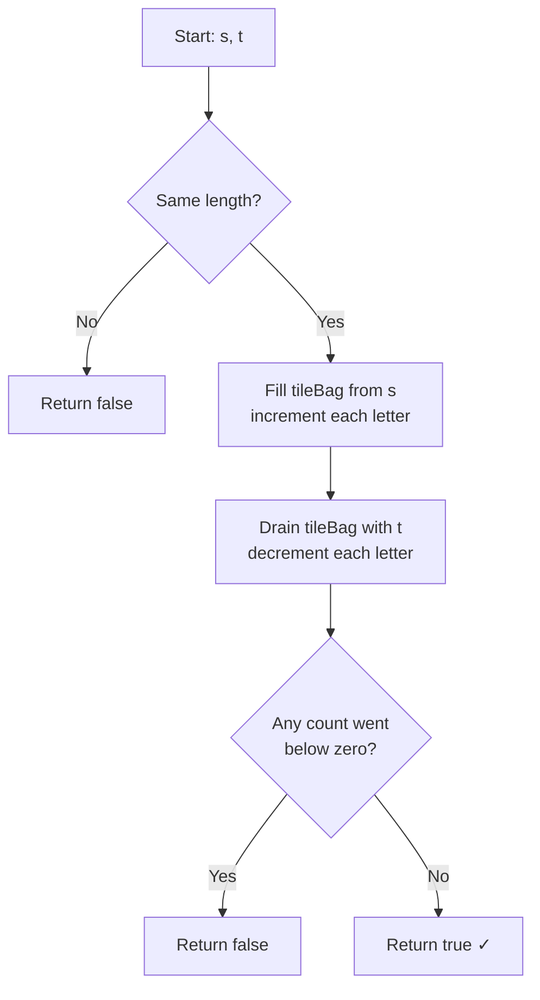

# Valid Anagram - Mental Model

## The Problem

Given two strings `s` and `t`, return `true` if `t` is an anagram of `s`, and `false` otherwise.

An **anagram** is a word or phrase formed by rearranging the letters of a different word or phrase, using all the original letters exactly once.

**Example 1:**
```
Input: s = "anagram", t = "nagaram"
Output: true
```

**Example 2:**
```
Input: s = "rat", t = "car"
Output: false
```

---

## The Scrabble Tile Bag Analogy

You and a friend each pull out a Scrabble tile bag. Your bag spells `s`. Their bag spells `t`. The question is deceptively simple: are both bags carrying exactly the same tiles? Not the same arrangement — the same inventory. Same letters, same counts.

Here's how you verify it. Pour your tiles onto the table and count them by letter: two `a`s, one `n`, one `g`, one `r`, one `m`. You now have a tally sheet — a record of every tile in the bag and how many there are. Now take each tile from your friend's bag and cross it off the tally. If you ever try to cross off a tile that's already at zero, your friend is playing a letter you don't have. The bags are different. If you cross off every single tile and the tally zeros out perfectly, the bags are identical: an anagram.

The tally sheet is a HashMap. Filling it from `s` counts the tiles. Draining it with `t` verifies them. Together, they answer whether both bags hold the exact same inventory.

---

## Understanding the Analogy

### The Setup

Two bags of Scrabble tiles. The bags might be the same size or different sizes. If they're different sizes — different numbers of tiles — you know immediately they can't match. No amount of rearranging changes how many tiles you have.

If the sizes do match, you open both bags and run the tally check. Your goal is to confirm that `t` uses every tile from `s` exactly once, in any order.

### The Tile Tally

The tally sheet (`tileBag` HashMap) maps each letter to its current count. When you add a tile, its count goes up by one. When you pull a tile, its count goes down by one.

There's one rule that makes the drain work: you can only pull a tile that's currently in the bag. If your friend has a letter whose tally entry sits at zero, they're trying to play a tile that wasn't in your bag — or they've already used up all copies of it. Either way, the bags don't match. Return false immediately instead of waiting until the end.

### Why This Approach

The sorting approach also works: sort both strings alphabetically and compare them. If they match, it's an anagram. But sorting costs O(n log n). The tile bag approach is O(n) — one pass to fill the tally, one pass to drain it, each letter touched exactly once. No reordering needed, just counting.

---

## How I Think Through This

Before touching any tiles, I do a quick sanity check: do `s` and `t` have the same length? If not, `t` can't possibly be an anagram — a seven-tile word can't rearrange into a six-tile word. I return false immediately.

If the lengths match, I scan through `s` with a `tileBag` HashMap, incrementing the count for each letter. Then I scan through `t` and decrement the count for each letter encountered. If any decrement would take a count to zero and I'm asking for another, `t` has a letter `s` doesn't — return false. After processing all of `t` without hitting a miss, every tile was accounted for. Return true.

Take `"anagram"`, `"nagaram"`.

:::trace-map
[
  {"input":["a","n","a","g","r","a","m"],"currentI":0,"map":[],"highlight":null,"action":null,"label":"Filling the tile bag from 'anagram'."},
  {"input":["a","n","a","g","r","a","m"],"currentI":0,"map":[["a",1]],"highlight":"a","action":"insert","label":"'a' → drop in bag. a=1."},
  {"input":["a","n","a","g","r","a","m"],"currentI":1,"map":[["a",1],["n",1]],"highlight":"n","action":"insert","label":"'n' → insert. a=1, n=1."},
  {"input":["a","n","a","g","r","a","m"],"currentI":2,"map":[["a",2],["n",1]],"highlight":"a","action":"update","label":"'a' again → update. a=2, n=1."},
  {"input":["a","n","a","g","r","a","m"],"currentI":6,"map":[["a",3],["n",1],["g",1],["r",1],["m",1]],"highlight":"m","action":"insert","label":"Bag full: a=3, n=1, g=1, r=1, m=1. Now draining with 'nagaram'."},
  {"input":["n","a","g","a","r","a","m"],"currentI":0,"map":[["a",3],["n",0],["g",1],["r",1],["m",1]],"highlight":"n","action":"found","label":"Pull 'n' → n: 1→0. Tile accounted for."},
  {"input":["n","a","g","a","r","a","m"],"currentI":6,"map":[["a",0],["n",0],["g",0],["r",0],["m",0]],"highlight":"m","action":"found","label":"Pull 'm' → all counts at zero. Bag empty."},
  {"input":["n","a","g","a","r","a","m"],"currentI":-2,"map":[["a",0],["n",0],["g",0],["r",0],["m",0]],"highlight":null,"action":"done","label":"Every tile accounted for. Return true ✓"}
]
:::

---

## Building the Algorithm

Each step introduces one concept from the Scrabble Tile Bag, then a StackBlitz embed to try it.

### Step 1: The Tile Count Check

Before opening any bags, answer the one question that costs nothing: do both bags have the same number of tiles? An anagram rearranges tiles — it never creates or destroys them. If the lengths of `s` and `t` differ, you can call it off before counting a single letter.

What single condition lets you return false immediately, before building the tally?

:::stackblitz{file="step1-problem.ts" step=1 total=2 solution="step1-solution.ts"}

### Step 2: Fill and Drain the Bag

Scan `s` and fill the bag — each letter increments its count. Then scan `t` and drain it — each letter decrements its count. If any decrement would take a count below zero, `t` is asking for a tile that isn't there. Return false immediately. If you drain all of `t` without a miss, every tile matched — return true.

:::trace-map
[
  {"input":["r","a","t"],"currentI":0,"map":[],"highlight":null,"action":null,"label":"Filling tile bag from 'rat'."},
  {"input":["r","a","t"],"currentI":0,"map":[["r",1]],"highlight":"r","action":"insert","label":"'r' → r=1."},
  {"input":["r","a","t"],"currentI":1,"map":[["r",1],["a",1]],"highlight":"a","action":"insert","label":"'a' → a=1."},
  {"input":["r","a","t"],"currentI":2,"map":[["r",1],["a",1],["t",1]],"highlight":"t","action":"insert","label":"'t' → t=1. Bag full: r=1, a=1, t=1. Now draining 'car'."},
  {"input":["c","a","r"],"currentI":0,"map":[["r",1],["a",1],["t",1]],"highlight":"c","action":"miss","label":"Pull 'c' — not in bag! Count would go negative. Return false."},
  {"input":["c","a","r"],"currentI":-2,"map":[["r",1],["a",1],["t",1]],"highlight":null,"action":"done","label":"'c' has no tile in the bag. Not an anagram. ✓"}
]
:::

:::stackblitz{file="step2-problem.ts" step=2 total=2 solution="step2-solution.ts"}

---

## Valid Anagram at a Glance



---

## Tracing through an Example

Input: `s = "anagram"`, `t = "nagaram"`

| Step | Phase | Letter | Tile Count Before | Action | Tile Bag State |
|------|-------|--------|------------------|--------|----------------|
| Start | — | — | — | initialize | {} |
| 1 | Fill (s) | a | 0 | insert → a=1 | {a:1} |
| 2 | Fill (s) | n | 0 | insert → n=1 | {a:1, n:1} |
| 3 | Fill (s) | a | 1 | update → a=2 | {a:2, n:1} |
| 4 | Fill (s) | g | 0 | insert → g=1 | {a:2, n:1, g:1} |
| 5 | Fill (s) | r | 0 | insert → r=1 | {a:2, n:1, g:1, r:1} |
| 6 | Fill (s) | a | 2 | update → a=3 | {a:3, n:1, g:1, r:1} |
| 7 | Fill (s) | m | 0 | insert → m=1 | {a:3, n:1, g:1, r:1, m:1} |
| 8 | Drain (t) | n | 1 | pull → n=0 | {a:3, n:0, g:1, r:1, m:1} |
| 9 | Drain (t) | a | 3 | pull → a=2 | {a:2, n:0, g:1, r:1, m:1} |
| 10 | Drain (t) | g | 1 | pull → g=0 | {a:2, n:0, g:0, r:1, m:1} |
| 11 | Drain (t) | a | 2 | pull → a=1 | {a:1, n:0, g:0, r:1, m:1} |
| 12 | Drain (t) | r | 1 | pull → r=0 | {a:1, n:0, g:0, r:0, m:1} |
| 13 | Drain (t) | a | 1 | pull → a=0 | {a:0, n:0, g:0, r:0, m:1} |
| 14 | Drain (t) | m | 1 | pull → m=0 | {a:0, n:0, g:0, r:0, m:0} |
| Done | — | — | — | all counts zero → return true | {a:0, n:0, g:0, r:0, m:0} |

---

## Common Misconceptions

**"I need to build a tally from both strings and then compare the two maps."** — You could, but one bag is enough. Fill the bag from `s`, then drain it with `t`. If both words have the same tiles, the bag empties exactly. Two tallies and a comparison step costs twice the space for no benefit.

**"I should wait until the drain finishes to check for mismatches."** — The moment any count would go below zero, you already know the answer: not an anagram. Return false immediately. Continuing to drain after a miss wastes work and makes the logic harder to reason about. Short-circuit as soon as you try to pull a missing tile.

**"Strings with the same letters but different counts are still anagrams."** — An anagram uses all the original tiles exactly once. `"aab"` and `"abb"` share the letters a and b, but the tile counts differ: `a=2, b=1` vs `a=1, b=2`. The bag check catches this the moment it tries to pull a second `b` from a bag that only had one.

**"The length check is optional — the bag check catches everything."** — Technically true, but the length check is O(1) and saves the entire O(n) tally operation for any mismatched-length pair. It also makes the intent explicit: before counting a single tile, you verify the bags could possibly match. It's a free early exit that doubles as documentation.

**"Sorting both strings and comparing is equivalent."** — Correct in output, but O(n log n) vs O(n). Sorting requires rearranging every character; the tile bag only counts them. For large strings the difference matters, and the bag approach is easier to reason about directly.

---

## Complete Solution

:::stackblitz{file="solution.ts" step=2 total=2 solution="solution.ts"}
