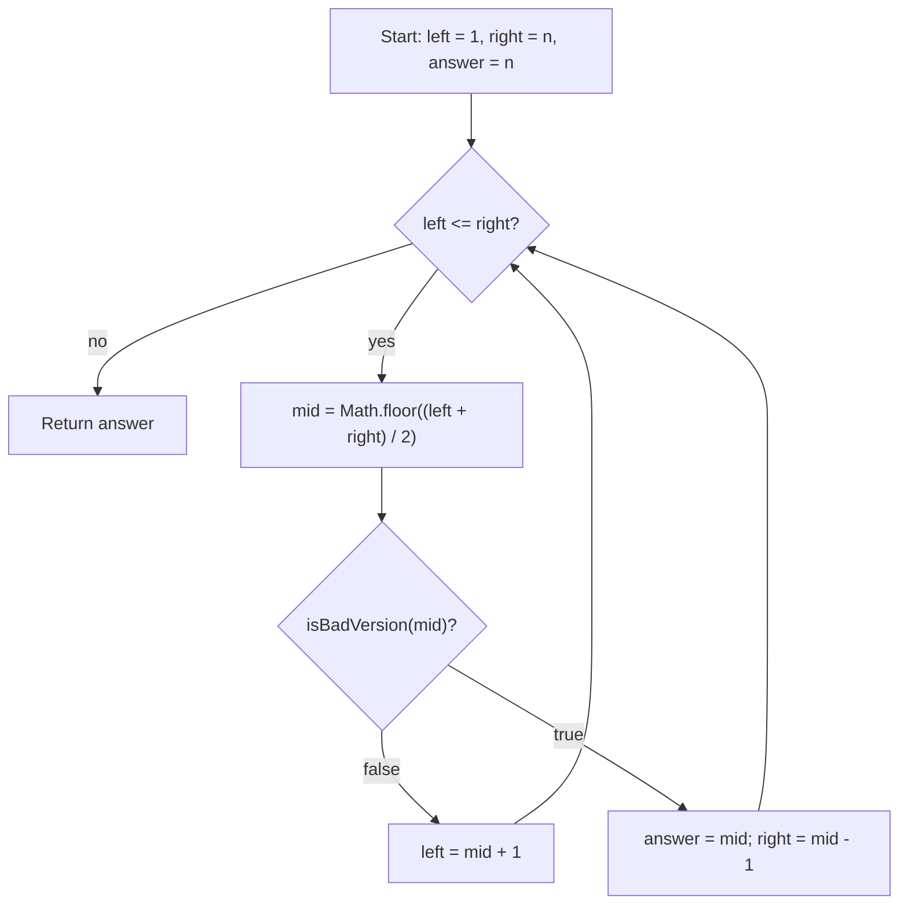

# First Bad Version - Mental Model

## The Problem

You are a product manager and currently leading a team to develop a new product. Unfortunately, the latest version of your product fails the quality check. Since each version is developed based on the previous version, all the versions after a bad version are also bad.

Suppose you have `n` versions `[1, 2, ..., n]` and you want to find out the first bad one, which causes all the following ones to be bad.

You are given an API `isBadVersion(version)` which returns whether `version` is bad. Implement a function to find the first bad version. You should minimize the number of calls to the API.

**Example 1:**
```
Input: n = 5, bad = 4
Output: 4
Explanation:
call isBadVersion(3) -> false
call isBadVersion(5) -> true
call isBadVersion(4) -> true
Then 4 is the first bad version.
```

**Example 2:**
```
Input: n = 1, bad = 1
Output: 1
```

## The Recall Fence Analogy

Imagine product versions lined up behind a quality-control fence, numbered from `1` through `n`. Everything before the defect point is safe to ship. The moment the defect appears, that version and every version after it belong on the recall side of the fence.

So the real question is not "which version is bad?" The moment you see any bad version, you already know many are bad. The real question is: where does the fence start? Which version is the first one standing on the recall side?

That turns the search into a boundary hunt. Every inspection at the midpoint tells you which side of the fence the midpoint stands on. If the midpoint is still good, the fence must be farther right. If the midpoint is bad, the fence is at that midpoint or somewhere to its left.

## Understanding the Analogy

### The Setup

The versions are ordered by time, and the badness is monotone. Once one version fails, every later version also fails. That is the whole reason Binary Search works here.

So I start with the widest live range where the fence could begin: `left = 1` and `right = n`. I also keep `answer = n` as the current earliest confirmed bad version. That fallback works because the prompt guarantees at least one bad version exists.

### Inspecting the Fence

When I inspect the midpoint, there are only two useful outcomes.

If `isBadVersion(mid)` is `false`, then the midpoint is still on the safe side. That proves the fence must start strictly after `mid`, so the left boundary jumps to `mid + 1`.

If `isBadVersion(mid)` is `true`, then the midpoint is already on the recall side. That means `mid` is a valid candidate for the first bad version, so I record `answer = mid` and keep squeezing left by moving `right = mid - 1`.

### Why This Approach

A linear scan would inspect versions one by one until it hit the first failure. That works, but it can take `O(n)` API calls.

Binary Search uses the monotone fence instead. Every midpoint inspection cuts away half of the remaining possibilities. That reduces the search to `O(log n)` API calls, which is exactly what "minimize the number of calls" is asking for.

## How I Think Through This

I translate the prompt into: "find the first version where `isBadVersion(version)` becomes true." `left` and `right` surround the part of the version line where that first true value could still live. `answer` stores the earliest bad version I have certified so far.

Inside the loop, I inspect `mid`. If `isBadVersion(mid)` is false, then every version up to `mid` is still good, so the fence must be farther right and I move `left` to `mid + 1`. If `isBadVersion(mid)` is true, then `mid` is on the bad side, so I record `answer = mid` and keep searching left by moving `right` to `mid - 1`.

When the boundaries cross, there is no uncertainty left. Every earlier possible fence position has been disproved, and `answer` holds the first version on the recall side.

Take `n = 5`, where version `4` is the first bad version.

:::trace-bs
[
  {"values":[1,2,3,4,5],"left":0,"mid":2,"right":4,"action":"check","label":"Clamp the full version line. Probe version 3. It is still good, so the fence must start to the right."},
  {"values":[1,2,3,4,5],"left":3,"mid":3,"right":4,"action":"check","label":"Now probe version 4. It is bad, so version 4 becomes the earliest certified recall candidate."},
  {"values":[1,2,3,4,5],"left":3,"mid":3,"right":2,"action":"candidate","label":"Record answer = 4 and squeeze left. There is no room left for an earlier bad version to survive."},
  {"values":[1,2,3,4,5],"left":3,"mid":null,"right":2,"action":"done","label":"The boundaries cross. The earliest certified bad version is still 4, so return 4."}
]
:::

---

## Building the Algorithm

### Step 1: Certify the First Bad Probe

Start with the Binary Search shell for the version line: `left = 1`, `right = n`, and `answer = n`.

For this first step, keep the rule narrow. Probe the midpoint once. If that midpoint is already bad, record it as `answer` and return it immediately. If that midpoint is still good, return the fallback `answer` for now. This teaches the key idea that a bad midpoint certifies a candidate boundary, while a good midpoint proves nothing on the recall side yet.

Take `n = 7`, where version `4` is the first bad version.

:::trace-bs
[
  {"values":[1,2,3,4,5,6,7],"left":0,"mid":3,"right":6,"action":"check","label":"Step 1 probes the midpoint at version 4."},
  {"values":[1,2,3,4,5,6,7],"left":0,"mid":3,"right":6,"action":"candidate","label":"Because version 4 is already bad, it becomes the first certified candidate and Step 1 returns 4 immediately."}
]
:::

:::stackblitz{file="step1-problem.ts" step=1 total=2 solution="step1-solution.ts"}

<details>
  <summary>Hints & gotchas</summary>

- **Start at version 1, not index 0**: the prompt numbers versions from `1` through `n`.
- **A bad midpoint is only a certified candidate**: Step 1 returns it immediately just to isolate that idea before the full squeeze logic arrives.
- **Keep the fallback answer**: `answer = n` is safe because the prompt guarantees there is at least one bad version.
</details>

### Step 2: Squeeze Left to the First Bad Version

Now complete the boundary search. A good midpoint proves the fence starts later, so move `left = mid + 1`.

A bad midpoint proves something subtler: `mid` works, but there might still be an earlier bad version. So record `answer = mid`, then move `right = mid - 1` and keep squeezing left until no earlier candidate survives.

That is the full first-true Binary Search loop. When the live range empties, `answer` is the first version where the API flips from good to bad.

Take `n = 8`, where version `6` is the first bad version.

:::trace-bs
[
  {"values":[1,2,3,4,5,6,7,8],"left":0,"mid":3,"right":7,"action":"check","label":"Probe version 4. It is still good, so the fence must start to the right."},
  {"values":[1,2,3,4,5,6,7,8],"left":4,"mid":5,"right":7,"action":"check","label":"Probe version 6. It is bad, so record 6 as the current earliest certified candidate."},
  {"values":[1,2,3,4,5,6,7,8],"left":4,"mid":4,"right":4,"action":"check","label":"Squeeze left and probe version 5. It is still good, so the fence cannot start before 6."},
  {"values":[1,2,3,4,5,6,7,8],"left":5,"mid":null,"right":4,"action":"done","label":"The boundaries cross. The earliest certified bad version is 6, so return 6."}
]
:::

:::stackblitz{file="step2-problem.ts" step=2 total=2 solution="step2-solution.ts"}

<details>
  <summary>Hints & gotchas</summary>

- **Do not stop at the first bad midpoint**: it proves a candidate, not necessarily the first bad version.
- **Bad means squeeze left**: save `mid` into `answer`, then search the earlier half.
- **Good means squeeze right**: if `mid` is still good, every version up to it is ruled out.
</details>

## Recall Fence at a Glance



## Common Misconceptions

- **"As soon as I find one bad version, I can return it"**: not yet. A bad midpoint only proves the fence is at `mid` or earlier. The correct mental model is to record it as a candidate and keep squeezing left.
- **"This is normal exact-hit Binary Search"**: it is a boundary search instead. You are not looking for a known value; you are looking for the first version where the API flips to true.
- **"If a midpoint is good, I should keep it in range"**: no. A good midpoint proves that version and everything before it cannot be the first bad version, so the next live range must start at `mid + 1`.
- **"`answer` should start at `-1`"**: the prompt guarantees a bad version exists, so `n` is a better fallback candidate because version `n` must be bad if everything after the first bad version is also bad.

## Complete Solution

:::stackblitz{file="solution.ts" step=2 total=2 solution="solution.ts"}
