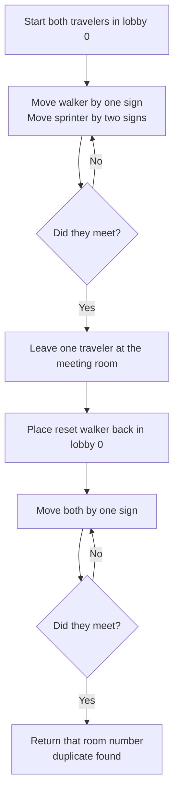

# Find the Duplicate Number - Mental Model

## The Problem

Given an array of integers `nums` containing `n + 1` integers where each integer is in the range `[1, n]` inclusive, there is only one repeated number in `nums`, return this repeated number.

You must solve the problem without modifying the array `nums` and using only constant extra space.

**Example 1:**
```
Input: nums = [1,3,4,2,2]
Output: 2
```

**Example 2:**
```
Input: nums = [3,1,3,4,2]
Output: 3
```

**Example 3:**
```
Input: nums = [3,3,3,3,3]
Output: 3
```

## The Hallway Sign Analogy

Imagine a strange building with rooms numbered `1` through `n`, plus a lobby labeled `0`. Inside every room and in the lobby, there is exactly one sign pointing to another room number. If you stand in room `i`, the sign tells you the next room to walk to: `nums[i]`.

Because every sign points only to rooms `1` through `n`, nobody can ever leave the building. And because there are `n + 1` sign-posting spots but only `n` real destination rooms, at least two different spots must send you into the same room. That room is the duplicate number.

Once two hallways merge into the same room, everyone following signs after that merge shares the same path. A shared path inside a closed building must eventually loop. So this array is really a hidden one-way hallway system with a cycle, and the duplicate room number is the entrance to that cycle.

The whole trick is to stop thinking about the array as "numbers in boxes" and start thinking about it as "rooms with one-way signs." Then Floyd's cycle detection becomes natural: first prove there is a loop by letting a walker and a sprinter move through the hallways, then find the loop entrance by restarting one walker from the lobby.

## Understanding the Analogy

### The Setup

You start in the lobby. The lobby's sign sends you to your first room. From there, every room sends you to exactly one next room. No sign ever points back to the lobby and no sign ever points outside the valid room numbers, so once you enter the numbered rooms you stay in the hallway system forever.

Somewhere in that system, two different hallways merge into the same room. That merge room is special: it is the reason one room number appears twice in the instruction cards. After the merge, every traveler follows the same downstream hallway layout. That shared downstream path eventually curls into a loop.

### The Walker, the Sprinter, and the Reset Walker

To prove you are inside a loop, send in two travelers from the lobby. The walker follows one sign per beat. The sprinter follows two signs per beat. In a one-way hallway system with a loop, the sprinter must eventually lap the walker and meet them somewhere inside the carousel.

That first meeting point is not necessarily the merge room. It is just a room somewhere on the loop. To find the true duplicate room, place a reset walker back in the lobby while leaving the original walker at the meeting room. Then move both one sign per beat. They will meet exactly at the loop entrance, which is the duplicate number.

### Why This Approach

You are forbidden from rearranging room labels and forbidden from keeping a guestbook of every visited room. Sorting would rewrite the building layout; a Set would store extra memory. The hallway view avoids both problems.

This approach uses only a few traveler positions, so the extra space stays constant. It also never changes any sign. The power comes from the hallway structure itself: duplicate room numbers create a merge, the merge creates a loop, and the loop entrance is exactly the answer we need.

## How I Think Through This

I treat `nums` as a hallway map where `nums[i]` is the room reached from position `i`. I prime the race by setting `slow = nums[0]` and `fast = nums[nums[0]]`, which means both travelers leave the lobby before the loop check even begins. Then I keep moving `slow = nums[slow]` and `fast = nums[nums[fast]]` while `slow !== fast`. The invariant is that both travelers always stay on valid room labels, because every sign points into `1..n`. When they meet, I know I am somewhere inside the loop.

Then I create `finder = 0`, putting a fresh traveler back in the lobby. Now both `finder` and `slow` move one sign per beat. One starts before the loop and one starts inside it, but the hallway distances line up so they collide at the loop entrance. That entrance room number is the duplicate, so I return `finder` (or `slow`, since they are equal there).

Take `[1,3,4,2,2]`.

:::trace-ll
[
  {"nodes":[{"val":"0→1"},{"val":"1→3"},{"val":"3→2"},{"val":"2→4"},{"val":"4→2"}],"pointers":[{"index":0,"label":"slow","color":"blue"},{"index":0,"label":"fast","color":"orange"}],"action":null,"label":"Both travelers start in the lobby hallway at 0→1. Each node shows the next sign to follow."},
  {"nodes":[{"val":"0→1"},{"val":"1→3"},{"val":"3→2"},{"val":"2→4"},{"val":"4→2"}],"pointers":[{"index":1,"label":"slow","color":"blue"},{"index":2,"label":"fast","color":"orange"}],"action":null,"label":"Beat 1: slow follows one sign to 1→3. fast follows two signs: 0 → 1 → 3, landing at 3→2."},
  {"nodes":[{"val":"0→1"},{"val":"1→3"},{"val":"3→2"},{"val":"2→4"},{"val":"4→2"}],"pointers":[{"index":2,"label":"slow","color":"blue"},{"index":4,"label":"fast","color":"orange"}],"action":null,"label":"Beat 2: slow moves to 3→2. fast moves 3 → 2 → 4, landing at 4→2."},
  {"nodes":[{"val":"0→1"},{"val":"1→3"},{"val":"3→2"},{"val":"2→4"},{"val":"4→2"}],"pointers":[{"index":3,"label":"slow","color":"blue"},{"index":4,"label":"fast","color":"orange"}],"action":null,"label":"Beat 3: slow reaches 2→4. fast goes 4 → 2 → 4 and stays on the carousel."},
  {"nodes":[{"val":"0→1"},{"val":"1→3"},{"val":"3→2"},{"val":"2→4"},{"val":"4→2"}],"pointers":[{"index":4,"label":"slow","color":"blue"},{"index":4,"label":"fast","color":"orange"}],"action":"found","label":"Beat 4: slow reaches 4→2. fast goes 4 → 2 → 4 and meets slow inside the loop."}
]
:::

---

## Building the Algorithm

Each step introduces one hallway insight, then a StackBlitz embed to try it.

### Step 1: Force a Meeting Inside the Carousel

Before you can find the duplicate room, you first need proof that you are trapped in a loop. Send the walker and the sprinter out from the lobby. The walker follows one sign. The sprinter follows two. In any hallway system with a loop, the faster traveler must eventually catch the slower one somewhere inside the carousel.

This step stops as soon as the two travelers meet and returns that meeting room. That is not always the duplicate yet, but it is enough to solve special cases where the meeting room and the loop entrance happen to be the same room.

:::trace-ll
[
  {"nodes":[{"val":"0→2"},{"val":"1→2"},{"val":"2→2"},{"val":"3→2"},{"val":"4→2"}],"pointers":[{"index":0,"label":"slow","color":"blue"},{"index":0,"label":"fast","color":"orange"}],"action":null,"label":"Every hallway funnels travelers toward room 2, so the carousel is obvious."},
  {"nodes":[{"val":"0→2"},{"val":"1→2"},{"val":"2→2"},{"val":"3→2"},{"val":"4→2"}],"pointers":[{"index":2,"label":"slow","color":"blue"},{"index":2,"label":"fast","color":"orange"}],"action":"found","label":"After one beat, both travelers land at 2→2. The meeting room is immediate in this special case."}
]
:::

:::stackblitz{file="step1-problem.ts" step=1 total=2 solution="step1-solution.ts"}

<details>
  <summary>Hints & gotchas</summary>

  - **Prime the first move before the `while` loop**: set `slow = nums[0]` and `fast = nums[nums[0]]` first, so the loop compares real hallway positions instead of the fake shared lobby.
  - **The sprinter follows two signs, not one big jump**: use `nums[nums[fast]]`, because the second sign depends on where the first sign sends you.
  - **This meeting room is only "somewhere on the carousel"**: it proves the loop exists, but it does not yet prove you found the duplicate room.
</details>

### Step 2: Walk Back to the Carousel Entrance

Now that one traveler is parked somewhere on the carousel, place a reset walker back in the lobby. Move the parked traveler and the reset walker one sign per beat. They will meet at the first room where the hallway system merges into the loop.

That entrance room is the duplicate number. It is the room reached by two different incoming hallways, which is exactly what "repeated number" means in this building.

:::trace-ll
[
  {"nodes":[{"val":"0→1"},{"val":"1→3"},{"val":"3→2"},{"val":"2→4"},{"val":"4→2"}],"pointers":[{"index":0,"label":"finder","color":"green"},{"index":4,"label":"slow","color":"blue"}],"action":null,"label":"finder resets to the lobby hallway. slow stays parked at the meeting hallway 4→2."},
  {"nodes":[{"val":"0→1"},{"val":"1→3"},{"val":"3→2"},{"val":"2→4"},{"val":"4→2"}],"pointers":[{"index":1,"label":"finder","color":"green"},{"index":3,"label":"slow","color":"blue"}],"action":null,"label":"Beat 1: finder goes 0 → 1, landing at 1→3. slow goes 4 → 2, landing at 2→4."},
  {"nodes":[{"val":"0→1"},{"val":"1→3"},{"val":"3→2"},{"val":"2→4"},{"val":"4→2"}],"pointers":[{"index":2,"label":"finder","color":"green"},{"index":4,"label":"slow","color":"blue"}],"action":null,"label":"Beat 2: finder goes 1 → 3, landing at 3→2. slow goes 2 → 4, landing at 4→2."},
  {"nodes":[{"val":"0→1"},{"val":"1→3"},{"val":"3→2"},{"val":"2→4"},{"val":"4→2"}],"pointers":[{"index":3,"label":"finder","color":"green"},{"index":3,"label":"slow","color":"blue"}],"action":"found","label":"Beat 3: finder goes 3 → 2 and slow goes 4 → 2. They meet at the entrance hallway 2→4, so the duplicate room is 2."}
]
:::

:::stackblitz{file="step2-problem.ts" step=2 total=2 solution="step2-solution.ts"}

<details>
  <summary>Hints & gotchas</summary>

  - **The reset walker starts in the lobby, not at `nums[0]`**: the lobby is part of the hallway story and keeps the distance relationship correct.
  - **Both travelers now move one sign per beat**: the fast-vs-slow race is over once the carousel meeting is found.
  - **Return the room label where they meet**: that label is the loop entrance, which is also the repeated number.
</details>

## The Hallway Signs at a Glance



## Tracing through an Example

Using `nums = [1, 3, 4, 2, 2]`:

| Phase | Walker (slow) | Sprinter / Finder | Sign Followed | Action | Resulting Insight |
| ----- | ------------- | ----------------- | ------------- | ------ | ----------------- |
| Start | Lobby `0` | Lobby `0` | `0 -> 1` exists | initialize race | Both travelers begin at the lobby |
| Race 1 | Room `1` | Room `3` | Walker: `0 -> 1`, Sprinter: `0 -> 1 -> 3` | move | Different rooms, keep racing |
| Race 2 | Room `3` | Room `4` | Walker: `1 -> 3`, Sprinter: `3 -> 2 -> 4` | move | Still different |
| Race 3 | Room `2` | Room `4` | Walker: `3 -> 2`, Sprinter: `4 -> 2 -> 4` | move | Sprinter stays on the loop |
| Race 4 | Room `4` | Room `4` | Walker: `2 -> 4`, Sprinter: `4 -> 2 -> 4` | meet | Carousel meeting found |
| Reset Start | Finder at Lobby `0` | Parked walker at Room `4` | `0 -> 1` and `4 -> 2` next | reset | Ready to walk toward the entrance |
| Entrance 1 | Finder at Room `1` | Walker at Room `2` | Finder: `0 -> 1`, Walker: `4 -> 2` | move | Not the entrance yet |
| Entrance 2 | Finder at Room `3` | Walker at Room `4` | Finder: `1 -> 3`, Walker: `2 -> 4` | move | Still separated |
| Entrance 3 | Finder at Room `2` | Walker at Room `2` | Finder: `3 -> 2`, Walker: `4 -> 2` | meet | Loop entrance is room `2` |
| Done | Room `2` | Room `2` | — | return | Duplicate number is `2` |

---

## Common Misconceptions

**"The duplicate is the first room where the two travelers meet."** That first meeting only tells you both travelers are on the carousel somewhere. The duplicate is the carousel entrance, so you still need the reset walker to walk back to the doorway.

**"This is an array problem, so I should mark visited boxes or sort the numbers."** In the hallway view, marking rooms needs a guestbook and sorting rewires the signs. The correct mental model is to follow the existing one-way signs without altering them and without storing the whole journey.

**"The lobby does not matter because valid rooms are only `1` through `n`."** The lobby is the clean starting tile that feeds you into the hallway system. Starting the reset walker there is what aligns the final one-step walk to the carousel entrance.

**"The duplicate means there are two identical rooms."** There is still only one room with that number. The duplication is in the incoming hallways: two different places send you into the same room, creating the merge that becomes the loop entrance.

## Complete Solution

:::stackblitz{file="solution.ts" step=2 total=2 solution="solution.ts"}
