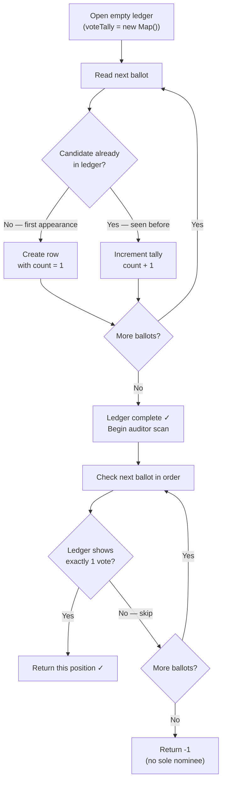

# First Unique Character in a String - Mental Model

## The Problem

Given a string `s`, find the first non-repeating character in it and return its index. If it does not exist, return `-1`.

**Example 1:**

```
Input: s = "leetcode"
Output: 0
```

**Example 2:**

```
Input: s = "loveleetcode"
Output: 2
```

**Example 3:**

```
Input: s = "aabb"
Output: -1
```

## The Election Ballot Counter Analogy

Imagine a small town holding a local election. Voters submit paper ballots, each naming a single candidate — one letter per ballot. The ballots pile up in a ballot box in the exact order they were cast. After all votes are in, the election commission needs to find the very first ballot position where a candidate received exactly one vote. That candidate is the "sole nominee," and their position in the box is the answer.

To find this, the commission works in two separate passes through the ballot box. In the first pass, a vote counter tallies every ballot: each one is read, and a mark is added to a ledger for that candidate. By the end, the ledger knows every candidate's total vote count. In the second pass, an auditor opens the ballot box again and scans from the very first ballot forward, stopping the moment they find a candidate whose ledger entry says exactly one vote. That ballot's position is returned. If no candidate has exactly one vote, the answer is -1.

The two-pass structure is the heart of the approach. During the tally, a candidate might have received only one vote so far — but another ballot for them could be sitting later in the box. The commission can never call a "sole nominee" mid-count. Only after all ballots are tallied can the ledger be trusted. The second pass translates that trust into a final answer.

## Understanding the Analogy

### The Setup

The ballot box holds ballots in the exact order they were cast. A ballot is a single letter — the name of the candidate. The commission wants the position (index) of the very first ballot for a candidate who received exactly one vote total. "First" means earliest in the box, not alphabetically or by any other ranking. If no such candidate exists, the answer is `-1`.

The commission has two tools: a ledger (the frequency Map) where tally marks are recorded, and the ballot box itself (the string), which can be opened twice.

### The Ledger — One Row Per Candidate

The ledger has one row per unique candidate, with a count of how many votes they received. When the vote counter reads a ballot, they find the candidate's row and add one tally mark. If the candidate has no row yet, they create one starting at `1`.

The ledger can be consulted in an instant: "how many votes did candidate `e` receive?" is a single lookup, not a sequential search.

That's the power of a Map — each key maps directly to its value in O(1) time, regardless of how many entries the ledger holds.

### Why This Approach

A naive approach might try to find the answer in a single pass: mark a candidate's position when you first see them, but un-mark it if you see them again.

This requires tracking which positions to invalidate as new ballots arrive — complex, error-prone, and hard to reason about.

The ledger-first approach sidesteps all of this. After one full tally pass, the ledger is complete and authoritative. The second pass is a clean, straightforward scan.

An even slower approach would compare every ballot against every other ballot, confirming uniqueness by exhaustion. For a box of `n` ballots, that's roughly `n²` comparisons. The two-pass approach stays linear: one pass to count, one pass to find. Trading a small amount of memory (the ledger) for a dramatic improvement in speed.

## How I Think Through This

The problem asks for the index of the first character with a total count of exactly 1 across the entire string. I use `voteTally`, a Map from each character to its total count across the whole string, and `i`, the position I'm examining in the second pass. The core rule: I build the tally completely before I make any decision. In the first pass I read every ballot and update `voteTally` — no peeking at results yet. In the second pass I walk `i` from 0 to the end and return `i` the moment `voteTally.get(s[i]) === 1`. If the entire second pass finds nothing, I return -1.

Take `"leetcode"`.

:::trace-map
[
  {"input": ["l","e","e","t","c","o","d","e"], "currentI": -1, "map": [], "highlight": null, "action": null, "label": "First pass: open empty ledger. Begin counting all ballots."},
  {"input": ["l","e","e","t","c","o","d","e"], "currentI": 0, "map": [["l",1]], "highlight": "l", "action": "insert", "label": "Read 'l' — new candidate, count 1."},
  {"input": ["l","e","e","t","c","o","d","e"], "currentI": 1, "map": [["l",1],["e",1]], "highlight": "e", "action": "insert", "label": "Read 'e' — new candidate, count 1."},
  {"input": ["l","e","e","t","c","o","d","e"], "currentI": 2, "map": [["l",1],["e",2]], "highlight": "e", "action": "update", "label": "Read 'e' again — increment to e:2."},
  {"input": ["l","e","e","t","c","o","d","e"], "currentI": 7, "map": [["l",1],["e",3],["t",1],["c",1],["o",1],["d",1]], "highlight": "e", "action": "update", "label": "First pass complete: { l:1, e:3, t:1, c:1, o:1, d:1 }."},
  {"input": ["l","e","e","t","c","o","d","e"], "currentI": 0, "map": [["l",1],["e",3],["t",1],["c",1],["o",1],["d",1]], "highlight": "l", "action": "found", "label": "Second pass, i=0: s[0]='l', tally=1 → sole nominee! Return 0 ✓"}
]
:::

---

## Building the Algorithm

Each step introduces one concept from the Election Ballot Counter, then a StackBlitz embed to try it.

### Step 1: Tally All the Votes

Before the auditor can scan anything, the vote counter needs to complete the ledger. Every ballot in the box must be read and tallied — no shortcuts, no early exits. A candidate who has only one vote at position 3 might receive another vote at position 97, so the tally must be finished before any decision is made.

The vote counter's process is the same for every ballot: if this candidate has no row in the ledger yet, open one with count 1. If they already have a row, add one more tally mark. Nothing is returned or decided here — just counting.

:::trace-map
[
{"input": ["l","e","e","t","c","o","d","e"], "currentI": 0, "map": [], "highlight": null, "action": null, "label": "Vote counter opens the ballot box. Ledger is empty."},
{"input": ["l","e","e","t","c","o","d","e"], "currentI": 0, "map": [["l",1]], "highlight": "l", "action": "insert", "label": "Reads 'l' — new candidate, open row with count 1."},
{"input": ["l","e","e","t","c","o","d","e"], "currentI": 1, "map": [["l",1],["e",1]], "highlight": "e", "action": "insert", "label": "Reads 'e' — new candidate, open row with count 1."},
{"input": ["l","e","e","t","c","o","d","e"], "currentI": 2, "map": [["l",1],["e",2]], "highlight": "e", "action": "update", "label": "Reads 'e' — already in ledger, add tally mark → e: 2."},
{"input": ["l","e","e","t","c","o","d","e"], "currentI": 3, "map": [["l",1],["e",2],["t",1]], "highlight": "t", "action": "insert", "label": "Reads 't' — new candidate, open row with count 1."},
{"input": ["l","e","e","t","c","o","d","e"], "currentI": 4, "map": [["l",1],["e",2],["t",1],["c",1]], "highlight": "c", "action": "insert", "label": "Reads 'c' — new candidate, open row with count 1."},
{"input": ["l","e","e","t","c","o","d","e"], "currentI": 5, "map": [["l",1],["e",2],["t",1],["c",1],["o",1]], "highlight": "o", "action": "insert", "label": "Reads 'o' — new candidate, open row with count 1."},
{"input": ["l","e","e","t","c","o","d","e"], "currentI": 6, "map": [["l",1],["e",2],["t",1],["c",1],["o",1],["d",1]], "highlight": "d", "action": "insert", "label": "Reads 'd' — new candidate, open row with count 1."},
{"input": ["l","e","e","t","c","o","d","e"], "currentI": 7, "map": [["l",1],["e",3],["t",1],["c",1],["o",1],["d",1]], "highlight": "e", "action": "update", "label": "Reads 'e' — already in ledger, add tally mark → e: 3."},
{"input": ["l","e","e","t","c","o","d","e"], "currentI": -2, "map": [["l",1],["e",3],["t",1],["c",1],["o",1],["d",1]], "highlight": null, "action": "done", "label": "Ledger complete. Every candidate's vote count is now known."}
]
:::

:::stackblitz{file="step1-problem.ts" step=1 total=2 solution="step1-solution.ts"}

### Step 2: Find the First Sole Nominee

With the ledger complete, the auditor opens the ballot box from position 0 and checks each ballot in order. For each ballot they check exactly one thing: does the candidate's ledger entry show exactly 1 vote? If yes, this is the sole nominee — return this position immediately. If no, advance to the next ballot. If the entire box is scanned without finding a sole nominee, return -1.

The scan must go in original ballot order — left to right — because "first" means earliest position in the box, not smallest vote count or alphabetical order.

:::trace-lr
[
{"chars": ["l","o","v","e","l","e","e","t","c","o","d","e"], "L": 0, "R": 0, "action": null, "label": "Auditor checks 'l': ledger shows 2 votes — not a sole nominee, advance"},
{"chars": ["l","o","v","e","l","e","e","t","c","o","d","e"], "L": 1, "R": 1, "action": null, "label": "Auditor checks 'o': ledger shows 2 votes — not a sole nominee, advance"},
{"chars": ["l","o","v","e","l","e","e","t","c","o","d","e"], "L": 2, "R": 2, "action": "match", "label": "Auditor checks 'v': ledger shows 1 vote — sole nominee! Return index 2 ✓"},
{"chars": ["l","o","v","e","l","e","e","t","c","o","d","e"], "L": 2, "R": 2, "action": "done", "label": "Done — first sole nominee found at position 2 ✓"}
]
:::

:::stackblitz{file="step2-problem.ts" step=2 total=2 solution="step2-solution.ts"}

---

## The Ballot Counter at a Glance

Two passes through the same ballot box — one to count, one to find:



---

## Tracing through an Example

Using `s = "loveleetcode"` → expected output: `2`

**First Pass — Vote Counter fills the ledger** (`l`, `o`, `v`, `e`, `l`, `e`, `e`, `t`, `c`, `o`, `d`, `e`):

| Ballot (s[i]) | Old Count | New Count | Ledger Change    |
| ------------- | --------- | --------- | ---------------- |
| 'l'           | —         | 1         | l added          |
| 'o'           | —         | 1         | o added          |
| 'v'           | —         | 1         | v added          |
| 'e'           | —         | 1         | e added          |
| 'l'           | 1         | 2         | l repeated       |
| 'e'           | 1         | 2         | e repeated       |
| 'e'           | 2         | 3         | e repeated again |
| 't'           | —         | 1         | t added          |
| 'c'           | —         | 1         | c added          |
| 'o'           | 1         | 2         | o repeated       |
| 'd'           | —         | 1         | d added          |
| 'e'           | 3         | 4         | e repeated again |

Ledger complete: `{ l:2, o:2, v:1, e:4, t:1, c:1, d:1 }`

**Second Pass — Auditor scans for first sole nominee:**

| Position (i) | Ballot (s[i]) | Auditor (Vote Count)                        | Sole Nominee? | Action                          |
| ------------ | ------------- | ------------------------------------------- | ------------- | ------------------------------- |
| Start        | —             | Ledger: {l:2, o:2, v:1, e:4, t:1, c:1, d:1} | —             | Open ballot box at position 0   |
| 0            | 'l'           | 2                                           | No            | Not a sole nominee — advance    |
| 1            | 'o'           | 2                                           | No            | Not a sole nominee — advance    |
| 2            | 'v'           | 1                                           | **Yes**       | Sole nominee found — return 2 ✓ |
| Done         | —             | —                                           | —             | return 2                        |

---

## Common Misconceptions

**"I should try to find the unique character in a single pass"** — During the tally, you can never be certain a candidate has only one vote total, because more ballots for them might be waiting later in the box. A character that appears unique at position 3 might receive a repeat at position 97. The ledger must be complete before any decision is made — the two-pass structure is mandatory, not optional.

**"I can sort the string to find unique characters faster"** — Sorting destroys position information, which is exactly what this problem asks for. Even if you could identify unique characters after sorting, you'd have no way to know which one appeared first in the original string. The ledger approach preserves original order for the auditor scan.

**"I should return the character itself, not its index"** — The problem asks for the index (position in the ballot box), not the character. When the auditor finds a sole nominee at position `i`, they return `i`, not `s[i]`.

**"If two characters both appear once, I should return the one that comes first alphabetically"** — "First" always means earliest position in the original string, not alphabetical order. The auditor scans left to right in ballot-box order and stops at the first sole nominee they encounter — position wins, not alphabet.

**"I need to check if the character at each position is unique compared only to what came before it"** — Uniqueness is global across the entire string. A character with no repeats before it might still have a repeat coming later. This is exactly why the counting pass must complete before the scanning pass begins — you need the full picture before making any calls.

---

## Complete Solution

:::stackblitz{file="solution.ts" step=2 total=2 solution="solution.ts"}
