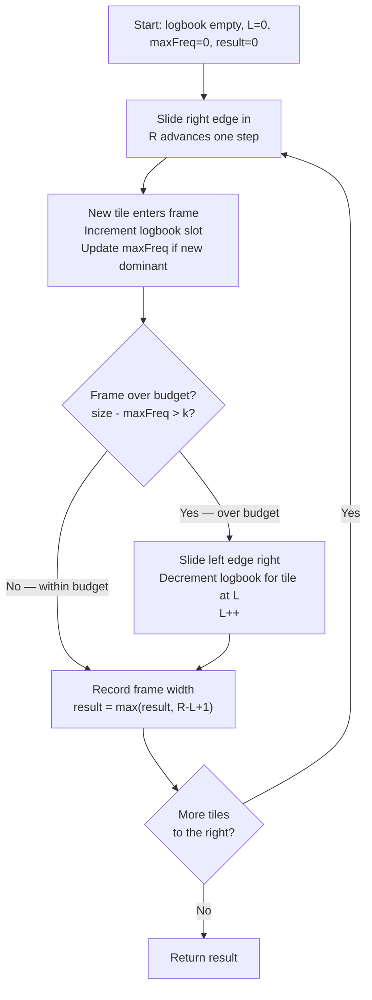

# Longest Repeating Character Replacement - Mental Model

## The Problem

You are given a string `s` and an integer `k`. You can choose any character of the string and change it to any other uppercase English character. You can perform this operation at most `k` times. Return the length of the longest substring containing the same letter you can get after performing the above operations.

**Example 1:**
```
Input: s = "ABAB", k = 2
Output: 4
Explanation: Replace the two 'A's with two 'B's or vice versa.
```

**Example 2:**
```
Input: s = "AABABBA", k = 1
Output: 4
Explanation: Replace the one 'A' in the middle with 'B' and form "AABBBBA".
The answer is 4.
```

## The Paint Crew Frame Analogy

Imagine a long wall covered in colored tiles — each tile painted one of 26 colors, one letter per tile. A paint crew arrives with a sliding wooden frame. They can position this frame anywhere on the wall, and their job is to make every tile inside the frame the same color. They have a paint budget: at most `k` tiles can be repainted. The crew wants to find the widest section of wall they can make uniform.

The crew's strategy is elegant: inside any frame position, they always keep whichever color appears most often — the **dominant color** — and repaint everything else. If the frame holds 7 tiles and the dominant color covers 5 of them, they only need to repaint 2 tiles (the minority colors). The formula is simple: `tiles to repaint = frame size − dominant color count`. As long as that number stays ≤ k, the frame is valid.

The frame has two edges. The **right edge** slides steadily forward, bringing each new tile into view one at a time. Whenever the budget would be exceeded — when repainting every non-dominant tile would cost more than k — the **left edge** slides one step to the right, shrinking the frame just enough to restore the budget. The crew never needs to shrink by more than one step at a time, because they only care about finding a frame *at least as wide* as the best they've seen so far.

One clever quirk: the crew never bothers to recalculate the dominant color count downward when they slide the left edge. Once a dominant count of N is established, they only want to find a frame where the dominant count is *higher* than N — so if shrinking causes the dominant count to drop, that's fine; they'll simply wait for the right edge to advance until a better dominant count is found.

## Understanding the Analogy

### The Setup

The wall is the string. Each tile is a character. The frame is the sliding window — defined by a left edge L and a right edge R. The crew slides R from the leftmost tile to the rightmost, pulling each tile into the frame one at a time. At every position, they ask: "Can we repaint the minority tiles within our k-tile budget?" If yes, the frame stays or grows. If no, the left edge slides one step right.

The crew's logbook has one entry per color (26 slots): how many tiles of each color are currently inside the frame. The `dominant color count` (`maxFreq`) is the highest number in the logbook — the color they'd keep if they committed to painting right now.

### The Dominant Color Count

The dominant color count is the key to everything. It tells the crew the *minimum* number of repaints needed for any given frame: `frame size − maxFreq`. This works because no matter which color you pick, keeping the most popular color requires the fewest changes.

Here's the crucial subtlety: `maxFreq` never shrinks. Once the crew has seen a frame where the dominant color covered, say, 5 tiles, they will never update `maxFreq` below 5 — even if the left edge slides and that dominant color's count drops. Why? Because the crew only wants to grow the frame, not shrink it. If shrinking would reduce the dominant count, the frame becomes "as wide as before but with a weaker dominant" — not interesting. They'll only update `maxFreq` upward when a new, stronger dominant color count is found.

### Why This Approach

Without the frame, we'd have to check every possible substring — O(n²) pairs of start and end positions. The frame eliminates that: once we know the frame at [L, R] is invalid, we don't need to check [L, R+1], [L, R+2], and so on with the same L — we slide L forward. And because `maxFreq` is monotonically non-decreasing, we're always seeking a frame *at least as large as the widest valid frame found so far*. The frame never unnecessarily shrinks below its maximum valid width.

## How I Think Through This

I initialize a 26-slot frequency logbook (all zeros), a left edge L at position 0, a running dominant count `maxFreq` at 0, and a best-width `result` at 0. Then I slide the right edge R from left to right across the string. For each new tile at R, I increment its slot in the logbook and update `maxFreq` if this new count beats the current dominant.

After updating the logbook, I check the budget: `(R - L + 1) - maxFreq`. If that number exceeds k, the frame is too wide — I decrement the left tile's logbook slot and slide L one step right. Whether or not I shrank, the frame is now at most as wide as the widest valid frame seen so far, so I record `R - L + 1` as a candidate for the best width.

Take `"ABAB"`, k=2.

:::trace-lr
[
  {"chars": ["A","B","A","B"], "L": 0, "R": 0, "action": "match", "label": "R=0: 'A' enters. Dominant count = 1 (A). Repaints needed: 1-1=0. Budget: 2. Valid. Width=1."},
  {"chars": ["A","B","A","B"], "L": 0, "R": 1, "action": "match", "label": "R=1: 'B' enters. Dominant count still 1 (A or B, tied). Repaints: 2-1=1. Budget: 2. Valid. Width=2."},
  {"chars": ["A","B","A","B"], "L": 0, "R": 2, "action": "match", "label": "R=2: 'A' enters. Dominant count = 2 (A). Repaints: 3-2=1. Budget: 2. Valid. Width=3."},
  {"chars": ["A","B","A","B"], "L": 0, "R": 3, "action": "done", "label": "R=3: 'B' enters. Dominant count = 2 (A or B, tied). Repaints: 4-2=2. Exactly at budget! Width=4. Done — return 4."}
]
:::

---

## Building the Algorithm

Each step introduces one concept from the Paint Crew Frame, then a StackBlitz embed to try it.

### Step 1: Tracking the Dominant Color

The crew's first task is setting up the logbook and sliding the right edge forward. For each new tile at R, they flip open the logbook, add a tally to that color's slot, and ask: "Does this beat our dominant count?" If so, `maxFreq` goes up.

At this point, the crew records a valid frame width only when the budget check passes: `frame size − maxFreq ≤ k`. If the budget is exceeded, they simply skip — they haven't learned to slide the left edge yet, so they just move on. For inputs where the frame never exceeds budget (k is large enough, or the string is already uniform), this partial solution gets the right answer.

:::trace-lr
[
  {"chars": ["A","A","B","B"], "L": 0, "R": 0, "action": "match", "label": "R=0: 'A' enters. Logbook: {A:1}. Dominant=1. Repaints needed: 1-1=0 ≤ 2. Valid! Width=1."},
  {"chars": ["A","A","B","B"], "L": 0, "R": 1, "action": "match", "label": "R=1: 'A' enters. Logbook: {A:2}. Dominant=2. Repaints: 2-2=0 ≤ 2. Valid! Width=2."},
  {"chars": ["A","A","B","B"], "L": 0, "R": 2, "action": "match", "label": "R=2: 'B' enters. Logbook: {A:2, B:1}. Dominant=2. Repaints: 3-2=1 ≤ 2. Valid! Width=3."},
  {"chars": ["A","A","B","B"], "L": 0, "R": 3, "action": "done", "label": "R=3: 'B' enters. Logbook: {A:2, B:2}. Dominant=2. Repaints: 4-2=2 ≤ 2. Exactly at budget! Width=4. Done — return 4."}
]
:::

:::stackblitz{file="step1-problem.ts" step=1 total=2 solution="step1-solution.ts"}

<details>
<summary>Hints & gotchas</summary>

- **The 26-slot logbook**: The frequency array is indexed by `charCode - 65` (subtracting `'A'.charCodeAt(0)`). `'A'` → 0, `'B'` → 1, ..., `'Z'` → 25.
- **Dominant count is a running max**: `maxFreq` is updated with `Math.max(maxFreq, freq[ci])` each time a new tile enters — it only ever goes up in this step.
- **The gate condition**: The budget check is `windowSize - maxFreq <= k`, where `windowSize = R - L + 1` and `L` stays at 0 for now. Only record result when this condition holds.
- **What tests pass here**: Only inputs where the frame never needs to shrink — strings like `"AAAA"` with k=0, or `"AABB"` with k=2. Inputs like `"BAAAB"` with k=0 will give wrong answers until step 2.

</details>

### Step 2: The Budget Reset

Now the crew learns to slide the left edge. When a new tile pushes the budget over — `frame size − maxFreq > k` — the crew removes the leftmost tile from the frame: they decrement its slot in the logbook and advance L by one. After this potential slide, the frame is guaranteed to be no wider than the best width seen so far, so they always record `R - L + 1` as a candidate (no `if` needed — the frame is valid by construction).

The key insight: the left edge slides by at most one step per right-edge advance. The crew never needs to chase L multiple steps to restore the budget, because the frame only grew by one tile (R advanced by one). So the frame can be at most one tile too wide.

:::trace-lr
[
  {"chars": ["A","A","B","A","B","B","A"], "L": 0, "R": 0, "action": "match", "label": "R=0: 'A'. Dominant=1. Repaints: 1-1=0 ≤ 1. Valid. Width=1."},
  {"chars": ["A","A","B","A","B","B","A"], "L": 0, "R": 1, "action": "match", "label": "R=1: 'A'. Dominant=2. Repaints: 2-2=0 ≤ 1. Valid. Width=2."},
  {"chars": ["A","A","B","A","B","B","A"], "L": 0, "R": 2, "action": "match", "label": "R=2: 'B'. Dominant=2. Repaints: 3-2=1 ≤ 1. Just fits! Width=3."},
  {"chars": ["A","A","B","A","B","B","A"], "L": 0, "R": 3, "action": "match", "label": "R=3: 'A'. Dominant=3. Repaints: 4-3=1 ≤ 1. Valid. Width=4. New best!"},
  {"chars": ["A","A","B","A","B","B","A"], "L": 0, "R": 4, "action": "mismatch", "label": "R=4: 'B'. Dominant=3. Repaints: 5-3=2 > 1. Over budget! Slide left edge."},
  {"chars": ["A","A","B","A","B","B","A"], "L": 1, "R": 4, "action": "match", "label": "L slides to 1. Frame='ABAB', size=4. Still width=4. Result unchanged."},
  {"chars": ["A","A","B","A","B","B","A"], "L": 1, "R": 5, "action": "mismatch", "label": "R=5: 'B'. Dominant=3. Repaints: 5-3=2 > 1. Over budget again!"},
  {"chars": ["A","A","B","A","B","B","A"], "L": 2, "R": 5, "action": "match", "label": "L slides to 2. Frame='BABB', size=4. Still width=4."},
  {"chars": ["A","A","B","A","B","B","A"], "L": 2, "R": 6, "action": "mismatch", "label": "R=6: 'A'. Dominant=3. Repaints: 5-3=2 > 1. Slide left edge one more time."},
  {"chars": ["A","A","B","A","B","B","A"], "L": 3, "R": 6, "action": "done", "label": "L slides to 3. Frame='ABBA', size=4. Final result = 4."}
]
:::

:::stackblitz{file="step2-problem.ts" step=2 total=2 solution="step2-solution.ts"}

<details>
<summary>Hints & gotchas</summary>

- **`if` not `while`**: Use `if (windowSize - maxFreq > k)` not `while`. The frame can only be one tile too wide (R advanced by one), so one slide is always enough.
- **`maxFreq` never decreases**: After sliding L, don't recalculate `maxFreq` downward. This is intentional — the crew only cares about frames at least as wide as the current best. An overestimated `maxFreq` is a feature: it prevents the frame from shrinking unnecessarily.
- **Result is always recorded**: After the optional slide, `result = Math.max(result, R - L + 1)` runs unconditionally. The frame is either valid (didn't need to shrink) or just-valid (shrank by one). No `if` guard needed here.
- **Updating the logbook on slide**: When L advances, decrement `freq[s.charCodeAt(L - 1) - 65]` — using the old L before incrementing, or `freq[s.charCodeAt(L) - 65]--; L++;`.

</details>

---

## The Paint Crew Frame at a Glance



---

## Tracing through an Example

Full trace of `"AABABBA"`, k=1 using the complete algorithm:

| Step | Right Edge (R) | New Tile | Dominant Count (maxFreq) | Left Edge (L) | Frame Size | Repaints (size−max) | Slide? | Best Width |
|------|---------------|----------|--------------------------|---------------|------------|---------------------|--------|------------|
| Start | — | — | 0 | 0 | 0 | — | — | 0 |
| 1 | 0 | A | 1 | 0 | 1 | 0 | no | 1 |
| 2 | 1 | A | 2 | 0 | 2 | 0 | no | 2 |
| 3 | 2 | B | 2 | 0 | 3 | 1 | no | 3 |
| 4 | 3 | A | 3 | 0 | 4 | 1 | no | 4 |
| 5 | 4 | B | 3 | 0→1 | 5→4 | 2 | yes (remove A at 0) | 4 |
| 6 | 5 | B | 3 | 1→2 | 5→4 | 2 | yes (remove A at 1) | 4 |
| 7 | 6 | A | 3 | 2→3 | 5→4 | 2 | yes (remove B at 2) | 4 |
| Done | — | — | — | 3 | — | — | — | return 4 |

---

## Common Misconceptions

**"I should use `while` to keep shrinking until the window is valid."** — A `while` loop could shrink the frame down to a tiny window, erasing the progress we've made. The key insight is that we only advance R by one step at a time, so the frame can be at most one tile too wide — one slide always restores the budget. Using `while` gives correct answers but wastes work undoing perfectly good frame width.

**"I need to recalculate `maxFreq` after sliding the left edge."** — This feels necessary but it isn't. `maxFreq` is a high-water mark: once the crew has found a dominant color covering N tiles, they only want frames where the dominant covers *more* than N tiles. If sliding L drops the actual dominant count below `maxFreq`, that's fine — the budget check `size - maxFreq > k` will remain false (since `maxFreq` is still large), preventing the frame from shrinking further. The frame stays "frozen" at its current width until a better dominant count appears.

**"The dominant color inside my frame must stay the same character as the frame slides."** — Not at all. When the left edge slides, a different character might become dominant. The crew doesn't care which color is dominant — they only track the count. `maxFreq` is just a number; which letter it represents can change from step to step.

**"The window size decreases after every invalid frame."** — The left edge slides at most once per right-edge advance (using `if`, not `while`), so `R - L + 1` stays the same or grows after each right-edge step. The frame is monotonically non-shrinking. This is the elegant property that makes `maxFreq` a valid lazy estimate.

**"I need the `if (budget <= k)` guard around result tracking."** — In step 1, yes. But once the sliding logic is in place, the frame is always at a valid-or-better width when we record the result — the slide already handled the only invalid case. Recording unconditionally with `result = Math.max(result, R - L + 1)` is both correct and simpler.

---

## Complete Solution

:::stackblitz{file="solution.ts" step=2 total=2 solution="solution.ts"}
