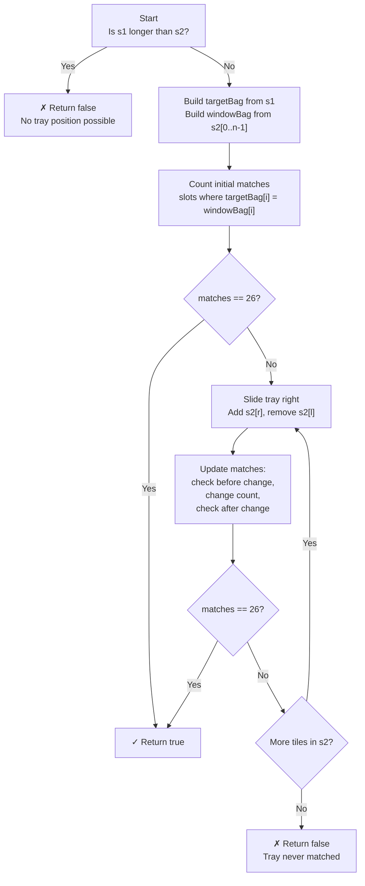

# Permutation in String - Mental Model

## The Problem

Given two strings `s1` and `s2`, return `true` if `s2` contains a permutation of `s1`, or `false` otherwise. In other words, return `true` if one of `s1`'s permutations is a substring of `s2`.

**Example 1:**
```
Input: s1 = "ab", s2 = "eidbaooo"
Output: true
Explanation: s2 contains one permutation of s1 ("ba").
```

**Example 2:**
```
Input: s1 = "ab", s2 = "eidboaoo"
Output: false
```

## The Tile Inspector Analogy

Imagine you work at a Scrabble factory quality control desk. Your job: given a sealed reference bag of tiles (`s1`), determine whether any consecutive section of a long conveyor belt of tiles (`s2`) contains exactly those same tiles — same letters, same counts, any order.

You have an inspector's tray exactly the size of the reference bag. You place it at the start of the belt and slide it one tile at a time. Each time you slide, one tile enters from the right and one falls off the left. You never need to recount everything from scratch — you just adjust for the two tiles that changed.

The clever trick is your running **agreement tally**: instead of comparing all 26 letter-types on every slide, you track how many of the 26 slots currently agree between the tray and the reference bag. When all 26 agree — your tray has found a match.

## Understanding the Analogy

### The Setup

You have a sealed reference bag from `s1`. You know exactly how many of each letter it contains. You also have an inspector's tray that holds exactly `len(s1)` tiles at a time. The tray starts at the beginning of the belt, filled with the first `len(s1)` tiles of `s2`.

Your question is simple: does any position of this tray, as it slides across the belt, produce a tray that matches the reference bag exactly?

### The Agreement Tally

Here's why counting to 26 beats comparing everything: there are exactly 26 possible letter types in the English alphabet. For each letter, you compare "how many are in the reference bag?" against "how many are in the tray right now?" If both counts agree for all 26 letters, the tray is a permutation of the bag.

You maintain a single number — `matches` — that counts how many of the 26 letter-types currently agree. You start by computing this for the initial tray position. Then as you slide, you only update `matches` for the two tiles that changed (the one entering on the right, the one leaving on the left).

The critical rule: when you're about to change a tile's count, check if it was previously matching. If it was, you're about to break that match — decrement `matches`. After you change the count, check if it's matching again. If it is, increment `matches`.

### Why This Approach

A naive approach would check every possible window by regenerating both frequency counts and comparing all 26 slots each time — O(26) comparisons per slide. The sliding window keeps all that state alive. The `matches` counter takes it further: each slide becomes O(1) regardless of window size, because you only update two slots out of 26.

More importantly: you don't need to find *which* permutation. You just need to know whether the tray and the bag have the same tiles. A frequency count is exactly this — a "bag fingerprint" that ignores order.

## How I Think Through This

I need to check if any window of size `len(s1)` in `s2` is an anagram of `s1`. I start by building two frequency arrays: `targetBag` (counts for `s1`) and `windowBag` (counts for the first `len(s1)` chars of `s2`). Then I count `matches` — how many of the 26 letter-types agree between these two arrays. If `matches === 26` right at the start, I can return `true` immediately.

Then I slide the window from left to right across `s2`. For each new position, I bring in the tile at index `r` (adding it to `windowBag`) and remove the tile at index `l = r - len(s1)` (removing it from `windowBag`). Before each change I check if that tile type was currently matching — if so, this change will break the match (`matches--`). After the change I check again — if the new count happens to equal the target, the match is restored (`matches++`). After both updates, if `matches === 26`, I return `true`.

Take `s1 = "ab"`, `s2 = "eidba"`:

:::trace-lr
[
  {"chars": ["e","i","d","b","a"], "L": 0, "R": 1, "action": "mismatch", "label": "Initial tray 'ei': {e:1,i:1} vs target {a:1,b:1} — 22/26 slots agree (a,b,e,i all disagree), not a match"},
  {"chars": ["e","i","d","b","a"], "L": 1, "R": 2, "action": "mismatch", "label": "Slide: remove 'e', add 'd' — tray {i:1,d:1} — 22/26 agree, still no match"},
  {"chars": ["e","i","d","b","a"], "L": 2, "R": 3, "action": "mismatch", "label": "Slide: remove 'i', add 'b' — b now matches (1=1), i now matches (0=0) — 24/26"},
  {"chars": ["e","i","d","b","a"], "L": 3, "R": 4, "action": "match", "label": "Slide: remove 'd', add 'a' — a matches (1=1), d matches (0=0) — 26/26 ✓ return true!"}
]
:::

---

## Building the Algorithm

Each step introduces one concept from the tile inspector analogy, then a StackBlitz embed to try it immediately.

### Step 1: Sealing the Reference Bag

Before sliding anything, you need to set up the two tile inventories. Build `targetBag` — the sealed reference from `s1` — by counting each letter's frequency. Then build the initial `windowBag` by counting the first `len(s1)` tiles of `s2`.

With both bags in hand, count `matches`: loop through all 26 letter-types, and for each one where `targetBag[i] === windowBag[i]`, increment `matches`. If they immediately agree on all 26, you're done.

One special case: if the reference bag is larger than the entire belt (`s1.length > s2.length`), there's no valid tray position at all — return `false` immediately.

:::trace-map
[
  {"input": ["a","b"], "currentI": -1, "map": [], "highlight": null, "action": null, "label": "Start: empty reference bag — building targetBag from s1"},
  {"input": ["a","b"], "currentI": 0, "map": [["a",1]], "highlight": "a", "action": "insert", "label": "Count 'a': targetBag[a] = 1"},
  {"input": ["a","b"], "currentI": 1, "map": [["a",1],["b",1]], "highlight": "b", "action": "insert", "label": "Count 'b': targetBag[b] = 1. Reference bag sealed. Now build windowBag from first 2 tiles of s2."}
]
:::

:::stackblitz{file="step1-problem.ts" step=1 total=2 solution="step1-solution.ts"}

<details>
<summary>Hints & gotchas</summary>

- **Array vs Map**: Use a fixed array of 26 slots (`new Array(26).fill(0)`) rather than a Map. Every letter index is `charCode - 'a'.charCodeAt(0)`. This makes the "count 26 agreements" loop a simple `for (let i = 0; i < 26; i++)`.
- **The 26-agreement threshold**: You're not comparing just the letters that appear in `s1` — you're comparing all 26 slots. Letters absent from both bags both have count 0, so they agree too. That's why "all 26 agree" equals a permutation match.
- **Belt shorter than bag**: Check `s1.length > s2.length` at the very top and return `false` immediately — otherwise your initial window loop will try to read beyond `s2`.

</details>

### Step 2: Sliding the Inspector's Tray

Now the tray slides. For each new right index `r` (starting at `s1.length`), the left index is `l = r - s1.length`. You bring tile `s2[r]` into the tray and evict tile `s2[l]`.

For each tile change, the update rule is the same: **check before, change, check after**.

- *Before* adding `s2[r]`: if `windowBag[r] === targetBag[r]`, that match is about to break — `matches--`
- Add `s2[r]` to `windowBag`
- *After* adding: if `windowBag[r] === targetBag[r]`, a match was just formed — `matches++`

Apply the same before/after pattern when removing `s2[l]`. After both updates, if `matches === 26`, the tray is a permutation — return `true`.

:::trace-lr
[
  {"chars": ["e","i","d","b","a"], "L": 0, "R": 1, "action": "mismatch", "label": "Step 1 built initial tray 'ei' with matches=22. Now slide the tray."},
  {"chars": ["e","i","d","b","a"], "L": 1, "R": 2, "action": "mismatch", "label": "Add 'd' (0→1, was 0=0 ✓ so matches--, now 1≠0 no ++). Remove 'e' (1→0, was 1≠0 no --, now 0=0 ✓ so matches++). Net: 22."},
  {"chars": ["e","i","d","b","a"], "L": 2, "R": 3, "action": "mismatch", "label": "Add 'b' (0→1, was 0≠1 no --, now 1=1 ✓ so matches++→23). Remove 'i' (1→0, was 1≠0 no --, now 0=0 ✓ so matches++→24). Net: 24."},
  {"chars": ["e","i","d","b","a"], "L": 3, "R": 4, "action": "match", "label": "Add 'a' (0→1, was 0≠1 no --, now 1=1 ✓ so matches++→25). Remove 'd' (1→0, was 1≠0 no --, now 0=0 ✓ so matches++→26). 26/26 → true!"}
]
:::

:::stackblitz{file="step2-problem.ts" step=2 total=2 solution="step2-solution.ts"}

<details>
<summary>Hints & gotchas</summary>

- **Check before, change, check after** — this is the core pattern. For `windowBag[c]++`: if `windowBag[c] === targetBag[c]` before the increment, that agreement is about to break (`matches--`); after the increment, check again (`if (windowBag[c] === targetBag[c]) matches++`). The same sequence applies for decrement.
- **Why 22 initial matches?** When the window starts on letters not in `s1`, both bags have 0 for most slots — those 0=0 agreements count too. If `s1.length` is 2, roughly 24 slots are both-zero, but the specific 4 letters that appear in window/target may differ. Don't be surprised when `matches` starts high.
- **Don't forget `return false`** — after the loop exhausts all windows, the tray never matched. You need to return `false` at the very end.
- **Left index formula**: `l = r - s1.length`. When `r` is `s1.length` (first slide), `l = 0` — the leftmost tile falls off exactly as the new right tile enters.

</details>

---

## The Tile Inspector at a Glance



---

## Tracing through an Example

Full trace of `checkInclusion("ab", "eidba")` — target bag: `{a:1, b:1}`, all other slots 0.

| Step | Tray Position | Added Tile | Removed Tile | windowBag (changed slots) | matches | Return? |
|------|--------------|------------|--------------|--------------------------|---------|---------|
| Init | e,i (L=0, R=1) | — | — | e:1, i:1 | 22 | — |
| r=2 | i,d (L=1, R=2) | 'd' (0→1) | 'e' (1→0) | d:1, i:1 | 22 | — |
| r=3 | d,b (L=2, R=3) | 'b' (0→1) | 'i' (1→0) | b:1, d:1 | 24 | — |
| r=4 | b,a (L=3, R=4) | 'a' (0→1) | 'd' (1→0) | a:1, b:1 | 26 | true |

The tray at position 3→4 holds `{a:1, b:1}` — exactly matching the reference bag.

---

## Common Misconceptions

**"I should sort the current window and compare it to a sorted s1"** — Sorting a window on each slide costs O(n log n) per position and forces you to rebuild from scratch rather than reuse prior work. The tile tray analogy shows why sorting isn't needed: you only care about *counts*, not order. Two bags with the same tile counts are identical, no sorting required.

**"I should compare all 26 frequency slots on every slide"** — Comparing all 26 slots is O(26) = O(1), so it *works*, but the `matches` counter is more elegant: you update only the 2 slots that changed each slide, keeping each slide O(1) with smaller constant. More importantly, thinking in terms of "how many slots agree" is the mental model — it makes the before/after update rule feel natural.

**"I only need to track letters that appear in s1"** — The 26-slot approach works because *all* 26 slots must agree, including letters that appear in neither bag. A slot where both have 0 is an agreement. If you only tracked letters in s1, you'd miss cases where the window has extra letters that inflate the count.

**"The window size can change"** — The tray is always exactly `s1.length` wide. You always add exactly one tile and remove exactly one tile per slide. The window never shrinks or grows; it just translates right by one position.

**"I check if the tile's count changed, not if it matched"** — The trigger for updating `matches` is not "did the count change?" (it always does). The trigger is "did the equality relationship with the target cross a boundary?" Before the change: was `windowBag[c] === targetBag[c]`? If yes, equality is about to break (`matches--`). After the change: is `windowBag[c] === targetBag[c]`? If yes, equality was just formed (`matches++`).

---

## Complete Solution

:::stackblitz{file="solution.ts" step=2 total=2 solution="solution.ts"}
