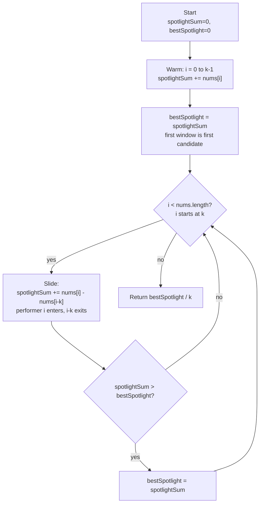

# Maximum Average Subarray I - Mental Model

## The Problem

You are given an integer array `nums` consisting of `n` elements, and an integer `k`. Find a contiguous subarray whose length is equal to `k` that has the maximum average value and return this value. Any answer with a calculation error less than `10^-5` will be accepted.

**Example 1:**
```
Input: nums = [1,12,-5,-6,50,3], k = 4
Output: 12.75000
```

**Example 2:**
```
Input: nums = [5], k = 1
Output: 5.00000
```

## The Stage Spotlight Analogy

Imagine a talent show where performers stand in a long row on stage. A spotlight shines down, always illuminating exactly `k` consecutive performers. You're the judge, and at each position you record the total score of the `k` performers currently lit. After the spotlight finishes sweeping the stage, you award the prize to the average score of whichever window was brightest.

The naive approach would be to recount all `k` performers' scores from scratch every time the spotlight moves. But that's wasteful — most of the performers don't change! When the spotlight slides one step to the right, only one performer enters the light from the right edge and one walks off into the dark from the left edge. Everything in between stays exactly the same.

So you keep a running total. When the spotlight shifts right by one step: add the incoming performer's score, subtract the outgoing performer's score. Your total updates in O(1). By the time the spotlight reaches the end of the row, you've found the brightest window without ever re-summing the whole group.

## Understanding the Analogy

### The Setup

There are `n` performers in a row, each with a score. The spotlight has a fixed width: it covers exactly `k` consecutive performers. You can't change the spotlight's width — `k` is a given constraint. You need to find the average score of the best possible `k`-wide position.

The spotlight starts at the leftmost position (covering performers 0 through k-1). From there it slides right one step at a time until it reaches the rightmost possible position (covering performers n-k through n-1). You need to track the highest sum seen along the way, then convert it to an average at the end.

### The Two-Phase Sweep

There are two distinct phases. First, the spotlight warms up: it starts dark and you add the first k performers one by one until all k slots are lit. This gives the initial `spotlightSum`. Before any sliding begins, this is already the best you've seen — so `bestSpotlight` starts here.

Second, the spotlight slides. For each new position from k onward, one performer enters the right edge (index `i`) and the performer at the left edge falls out (index `i - k`). The net change to `spotlightSum` is just those two numbers. After each slide, if the new sum beats `bestSpotlight`, you update it.

When the spotlight has swept past the last position, `bestSpotlight / k` is the winning average.

### Why This Approach

Re-summing k elements at every position costs O(k) per step, totalling O(n × k). For large k this is painfully slow. The sliding approach maintains the running `spotlightSum` so each step costs O(1) — the total work is O(n) regardless of k.

The key insight that makes sliding work: consecutive windows of size k share k-1 elements. Only the one element that enters and the one that exits differ. Tracking the delta instead of the full sum turns an O(k) operation into O(1).

## How I Think Through This

I start by warming the spotlight. I loop from `i = 0` to `i < k`, adding `nums[i]` to `spotlightSum`. When the loop ends, `spotlightSum` holds the sum of the first k performers. I set `bestSpotlight = spotlightSum` — this is the first candidate for the best window.

Then I slide. I loop from `i = k` to `i < nums.length`. On each step, `spotlightSum` gains `nums[i]` (incoming performer) and loses `nums[i - k]` (outgoing performer). After the update, if `spotlightSum > bestSpotlight`, I update `bestSpotlight`. The window always contains exactly k performers — that's the invariant the single subtraction maintains. When the loop ends, I return `bestSpotlight / k`.

Take `[1, 12, -5, -6, 50, 3]`, k=4.

:::trace-lr
[
  {"chars": ["1","12","-5","-6","50","3"], "L": 0, "R": 0, "action": null, "label": "Warming: add 1. spotlightSum=1."},
  {"chars": ["1","12","-5","-6","50","3"], "L": 0, "R": 1, "action": null, "label": "Warming: add 12. spotlightSum=13."},
  {"chars": ["1","12","-5","-6","50","3"], "L": 0, "R": 2, "action": null, "label": "Warming: add -5. spotlightSum=8."},
  {"chars": ["1","12","-5","-6","50","3"], "L": 0, "R": 3, "action": "match", "label": "Warming done: add -6. spotlightSum=2. bestSpotlight=2."},
  {"chars": ["1","12","-5","-6","50","3"], "L": 1, "R": 4, "action": "match", "label": "Slide: +50 -1 → spotlightSum=51. New best! bestSpotlight=51."},
  {"chars": ["1","12","-5","-6","50","3"], "L": 2, "R": 5, "action": "done", "label": "Slide: +3 -12 → spotlightSum=42. No change. Return 51/4=12.75."}
]
:::

---

## Building the Algorithm

Each step introduces one concept from the Stage Spotlight approach, then a StackBlitz embed to try it.

### Step 1: Warm the Spotlight

Before the spotlight can slide, it must first light up. You add the scores of the first k performers one by one until all k slots are filled. The moment all k slots are lit, you have your initial `spotlightSum` — and before any sliding begins, that sum is the best you've seen. Set `bestSpotlight = spotlightSum` and return `bestSpotlight / k`.

For arrays of exactly length k, the spotlight covers the whole row. There's nowhere to slide — the warmup sum is the only candidate, and the warmup answer is already complete.

:::trace-lr
[
  {"chars": ["2","4","6"], "L": 0, "R": 0, "action": null, "label": "Warming: add 2. spotlightSum=2."},
  {"chars": ["2","4","6"], "L": 0, "R": 1, "action": null, "label": "Warming: add 4. spotlightSum=6."},
  {"chars": ["2","4","6"], "L": 0, "R": 2, "action": "done", "label": "Warming done: add 6. spotlightSum=12. bestSpotlight=12. Return 12/3=4."}
]
:::

:::stackblitz{file="step1-problem.ts" step=1 total=2 solution="step1-solution.ts"}

<details>
<summary>Hints & gotchas</summary>

- **Two separate loops**: The warmup is a `for (let i = 0; i < k; i++)` loop. The sliding in Step 2 is a separate `for (let i = k; i < nums.length; i++)` loop. Don't try to combine them — they serve different purposes.
- **Set bestSpotlight immediately after warming**: `bestSpotlight = spotlightSum` happens once, right after the warmup loop. Don't wait to set it inside the sliding loop — if the array is exactly length k, the sliding loop never runs.
- **Return average, not sum**: The final return is `bestSpotlight / k`. The problem asks for average score, not total score.

</details>

### Step 2: Slide the Spotlight

Now the spotlight moves. Starting at index k, for each new position the spotlight shifts one step right: the performer at index `i` enters the light and the performer at index `i - k` exits. The spotlight sum changes by exactly those two values. After each shift, check if the new sum beats `bestSpotlight`.

The window never changes size — it always holds exactly k performers. The single add-and-subtract is what preserves this invariant across every slide.

:::trace-lr
[
  {"chars": ["1","12","-5","-6","50","3"], "L": 0, "R": 3, "action": "match", "label": "After warming: spotlightSum=2. bestSpotlight=2."},
  {"chars": ["1","12","-5","-6","50","3"], "L": 1, "R": 4, "action": "match", "label": "Slide i=4: +nums[4]=50, -nums[0]=1. spotlightSum=51. bestSpotlight=51."},
  {"chars": ["1","12","-5","-6","50","3"], "L": 2, "R": 5, "action": "done", "label": "Slide i=5: +nums[5]=3, -nums[1]=12. spotlightSum=42. No change. Return 51/4=12.75."}
]
:::

:::stackblitz{file="step2-problem.ts" step=2 total=2 solution="step2-solution.ts"}

<details>
<summary>Hints & gotchas</summary>

- **The exiting performer's index**: When you're at position `i`, the performer who exits is at index `i - k`, not `i - 1`. Off by one here means the spotlight drifts — it would cover k+1 or k-1 elements instead of exactly k.
- **One expression, one operation**: `spotlightSum += nums[i] - nums[i - k]` does both the add and subtract in one line. Two separate lines work too, but the combined form makes it clear that the window size never changes.
- **Update bestSpotlight after the slide, not before**: Compute the new `spotlightSum` first, then `if (spotlightSum > bestSpotlight) bestSpotlight = spotlightSum`. Checking before updating would compare the previous window's sum.

</details>

## Spotlight at a Glance



---

## Tracing through an Example

Using `nums = [1, 12, -5, -6, 50, 3]`, `k = 4` → expected output: 12.75

| Phase | Position (i) | Incoming Performer | Exiting Performer | Spotlight Sum | Best Sum | Action |
|-------|---|---|---|---|---|---|
| Warm | 0 | nums[0]=1 | — | 1 | — | add 1 |
| Warm | 1 | nums[1]=12 | — | 13 | — | add 12 |
| Warm | 2 | nums[2]=-5 | — | 8 | — | add -5 |
| Warm | 3 | nums[3]=-6 | — | 2 | 2 | warmup done; bestSpotlight=2 |
| Slide | 4 | nums[4]=50 | nums[0]=1 | 51 | 51 | new best |
| Slide | 5 | nums[5]=3 | nums[1]=12 | 42 | 51 | no change |
| Done | — | — | — | — | 51 | return 51/4=12.75 |

---

## Common Misconceptions

**"I should re-sum the k elements from scratch at each position"** — Recomputing from scratch costs O(k) per step, making the total O(n×k). Consecutive windows share k-1 performers. Only one performer enters and one exits per slide — tracking the net change with `spotlightSum += nums[i] - nums[i-k]` does the same update in O(1).

**"The exiting performer is at index i-1, the one just behind the window"** — When the window slides from position `[L, L+k-1]` to `[L+1, L+k]`, the performer who exits is at the old left edge `L = i-k`, not at the right edge. Using `i-1` drops the wrong performer and the spotlight grows wider on every slide.

**"I only need to track the sum inside the loop — I can compute the average at each step"** — Dividing by k at every step is valid but wasteful. Since k is constant, the window with the largest sum also has the largest average. Track `bestSpotlight` as a sum throughout and divide by k exactly once at the end.

**"The spotlight covers the whole array when k equals nums.length, so the answer is obvious"** — The warmup phase handles this correctly without any special case. When k equals n, the sliding loop condition `i < nums.length` is never true (since `i` starts at k = n), so the loop never runs. The warmup sum is the answer, and the return `bestSpotlight / k` is correct.

**"I should initialize bestSpotlight to 0 so it's always a valid floor"** — Initializing to 0 is wrong when all scores are negative — the empty window (sum 0) doesn't correspond to any valid k-wide position. Set `bestSpotlight = spotlightSum` immediately after the warmup. The first k-wide window is the first valid candidate; any window found later is compared against it.

---

## Complete Solution

:::stackblitz{file="solution.ts" step=2 total=2 solution="solution.ts"}
