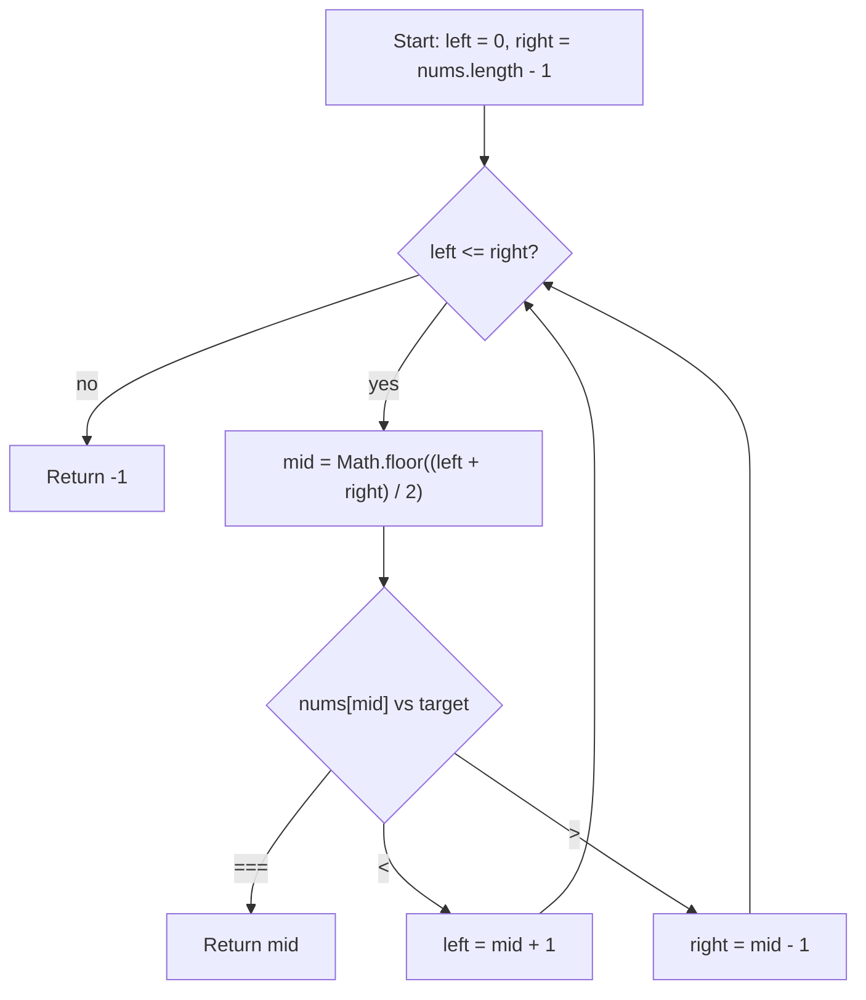

# Binary Search - Mental Model

## The Problem

Given an array of integers `nums` which is sorted in ascending order, and an integer `target`, write a function to search `target` in `nums`. If `target` exists, then return its index. Otherwise, return `-1`.

You must write an algorithm with `O(log n)` runtime complexity.

**Example 1:**
```
Input: nums = [-1,0,3,5,9,12], target = 9
Output: 4
Explanation: 9 exists in nums and its index is 4
```

**Example 2:**
```
Input: nums = [-1,0,3,5,9,12], target = 2
Output: -1
Explanation: 2 does not exist in nums so return -1
```

## The Surveyor's Calibration Rail Analogy

Imagine a surveyor standing over a long numbered rail with marks placed in sorted order from smallest to largest. She is not allowed to walk mark by mark checking each one. Instead, she places a left clamp and a right clamp around the part of the rail where the answer could still live.

Once the clamps are in place, she lowers a probe onto the midpoint between them. That one probe tells her much more than "what is the middle value?" If the midpoint is too small, then every mark to the left is also too small. If the midpoint is too large, then every mark to the right is also too large.

So the real power of the probe is elimination. Each probe certifies that one entire half of the rail is impossible. The surveyor does not search faster by luck. She searches faster because sorted order lets her throw away half the remaining rail every time.

## Understanding the Analogy

### The Setup

The rail is already sorted. That is the only reason the clamps and probe work. If the marks were shuffled, seeing a midpoint that was too small would tell you nothing about the values to its left or right.

So the surveyor starts with the widest live range possible: the left clamp at index `0`, and the right clamp at index `nums.length - 1`. The invariant is simple: if the target exists, it must still be somewhere between those two clamps.

### The Midpoint Probe

At each step, the surveyor probes the midpoint between the live clamps. There are only three possible outcomes.

If the midpoint is exactly the target, the job is done. If the midpoint is too small, then the left half is disproved, including that midpoint itself, so the left clamp jumps to `mid + 1`. If the midpoint is too large, then the right half is disproved, including that midpoint itself, so the right clamp jumps to `mid - 1`.

That is the mental model to remember: the midpoint does not just inspect one position. It proves that half the remaining rail can no longer contain the answer.

### Why This Approach

A linear scan would check values one by one and take `O(n)` time in the worst case. Binary Search does something stronger. Every comparison cuts the remaining live range roughly in half.

That means after one probe, only half the rail survives. After two probes, only a quarter survives. After three, only an eighth. The work grows with how many times you can halve the rail, which is why the runtime becomes `O(log n)`.

## How I Think Through This

I think in terms of a live range, not a wandering index. `left` and `right` are the clamps that surround every position where the target could still exist. As long as `left <= right`, there is still rail left to probe, so I compute `mid` and inspect `nums[mid]`.

If `nums[mid] === target`, I return `mid` immediately because the probe landed exactly on the mark I wanted. If `nums[mid] < target`, the midpoint and everything to its left are ruled out, so I move `left` to `mid + 1`. If `nums[mid] > target`, the midpoint and everything to its right are ruled out, so I move `right` to `mid - 1`.

When the clamps cross, the live range is empty. That means every possible position has already been disproved, so the target is not in the array and the answer must be `-1`.

Take `nums = [-1, 0, 3, 5, 9, 12]`, `target = 9`.

:::trace-bs
[
  {"values":[-1,0,3,5,9,12],"left":0,"mid":2,"right":5,"action":"check","label":"Clamp the whole rail first. Probe index 2, value 3. Too small, so index 0 through 2 are no longer alive."},
  {"values":[-1,0,3,5,9,12],"left":3,"mid":4,"right":5,"action":"discard-left","label":"Move the left clamp to index 3. Probe index 4, value 9. This midpoint matches the target."},
  {"values":[-1,0,3,5,9,12],"left":3,"mid":4,"right":5,"action":"found","label":"Found it. The surveyor returns index 4."}
]
:::

---

## Building the Algorithm

### Step 1: Set the Clamps and Probe the Midpoint

Start by building the live range. Put `left` at the first index and `right` at the last index. As long as `left <= right`, there is still a real search range, so calculate the midpoint and inspect it.

This first step teaches one core skill: how to place the clamps and probe the middle correctly. If the midpoint already equals the target, return its index immediately. Otherwise, for now, stop and return `-1`. That keeps the step narrow: learn the live-range shell and the exact-hit check before teaching how to discard half the rail.

Use a case where the first probe wins right away, like `[-1, 0, 3, 5, 9]` with target `3`. The midpoint lands on the answer immediately, so the surveyor never needs to move a clamp.

:::trace-bs
[
  {"values":[-1,0,3,5,9],"left":0,"mid":2,"right":4,"action":"check","label":"Step 1 sets the full live range and probes the midpoint at index 2."},
  {"values":[-1,0,3,5,9],"left":0,"mid":2,"right":4,"action":"found","label":"The midpoint value is 3, which matches the target immediately, so return index 2."}
]
:::

:::stackblitz{file="step1-problem.ts" step=1 total=2 solution="step1-solution.ts"}

<details>
  <summary>Hints & gotchas</summary>

- **The live range is inclusive**: both `left` and `right` are still possible answers, so the loop condition is `left <= right`.
- **Probe the middle of the live range**: compute `mid` from `left` and `right`, not from the full array every time.
- **Keep this step narrow**: only handle the exact-hit midpoint case here. The "too small" and "too large" moves belong to step 2.
</details>

### Step 2: Discard the Impossible Half

Now teach the real squeeze. Once the midpoint is not the target, its comparison tells you which half of the live rail must be impossible.

If `nums[mid] < target`, the probe landed too far left on the rail, so the next live range must start at `mid + 1`. If `nums[mid] > target`, the probe landed too far right, so the next live range must end at `mid - 1`.

That is the complete binary-search loop: probe the midpoint, either return the answer or move one clamp past the disproved half, then repeat until the clamps cross. If the live range empties, return `-1`.

Take `nums = [-1, 0, 3, 5, 9, 12]`, `target = 2`.

:::trace-bs
[
  {"values":[-1,0,3,5,9,12],"left":0,"mid":2,"right":5,"action":"check","label":"Probe index 2, value 3. Too large, so the right half from index 2 through 5 is disproved."},
  {"values":[-1,0,3,5,9,12],"left":0,"mid":0,"right":1,"action":"discard-right","label":"Move the right clamp to index 1. Probe index 0, value -1. Too small, so the left half through index 0 is disproved."},
  {"values":[-1,0,3,5,9,12],"left":1,"mid":1,"right":1,"action":"discard-left","label":"Now only index 1 is alive. Probe value 0. Still too small, so move the left clamp past it."},
  {"values":[-1,0,3,5,9,12],"left":2,"mid":null,"right":1,"action":"done","label":"The clamps have crossed. The live range is empty, so the target is not in the rail and the answer is -1."}
]
:::

:::stackblitz{file="step2-problem.ts" step=2 total=2 solution="step2-solution.ts"}

<details>
  <summary>Hints & gotchas</summary>

- **Always discard the midpoint itself**: use `mid + 1` or `mid - 1`, never `mid`, or the range may stop shrinking.
- **Only one clamp moves per probe**: midpoint too small means move `left`; midpoint too large means move `right`.
- **Crossed clamps mean failure**: once `left > right`, there is no live range left and the answer must be `-1`.
</details>

---

## Calibration Rail at a Glance



## Common Misconceptions

- **"Binary Search means jump around until you get lucky"**: the probe is not guessing. Each comparison proves that one entire half of the rail is impossible, so the live range keeps shrinking for a reason.
- **"If the midpoint is too small, move `left = mid`"**: that leaves the disproved midpoint inside the live range. The correct mental model is that the midpoint itself has already been checked, so the next live range must start at `mid + 1`.
- **"The loop should stop at `left < right`"**: with an inclusive live range, a single remaining position still matters. `left <= right` is the correct condition because one live mark is still worth probing.
- **"Once I miss the midpoint once, I should return `-1`"**: a missed midpoint only disproves half the rail. The surveyor keeps searching the surviving half until the clamps actually cross.

## Complete Solution

:::stackblitz{file="solution.ts" step=2 total=2 solution="solution.ts"}
