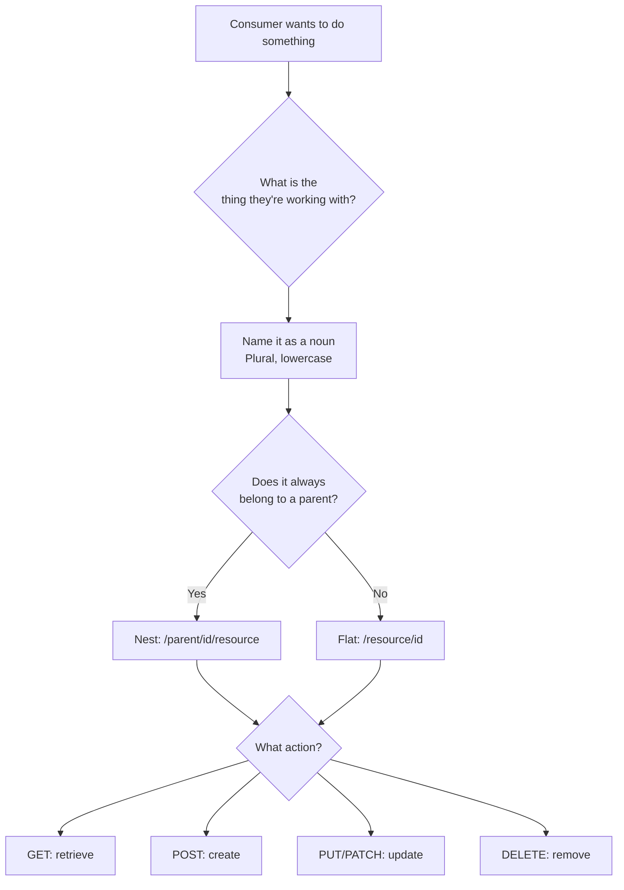
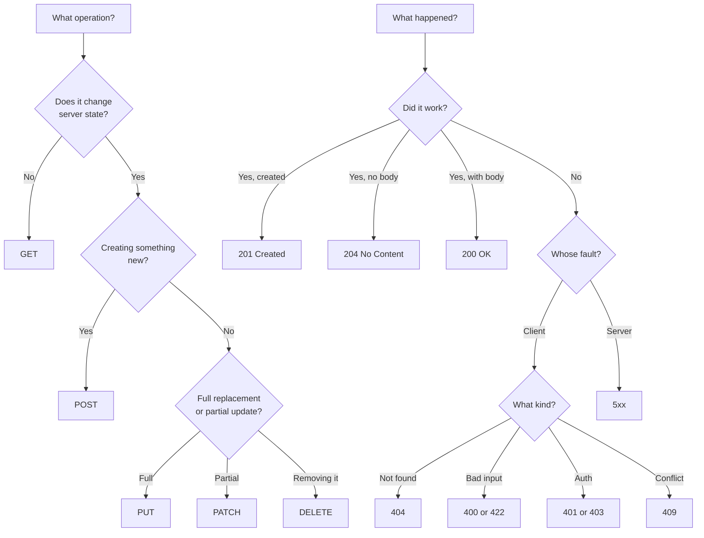
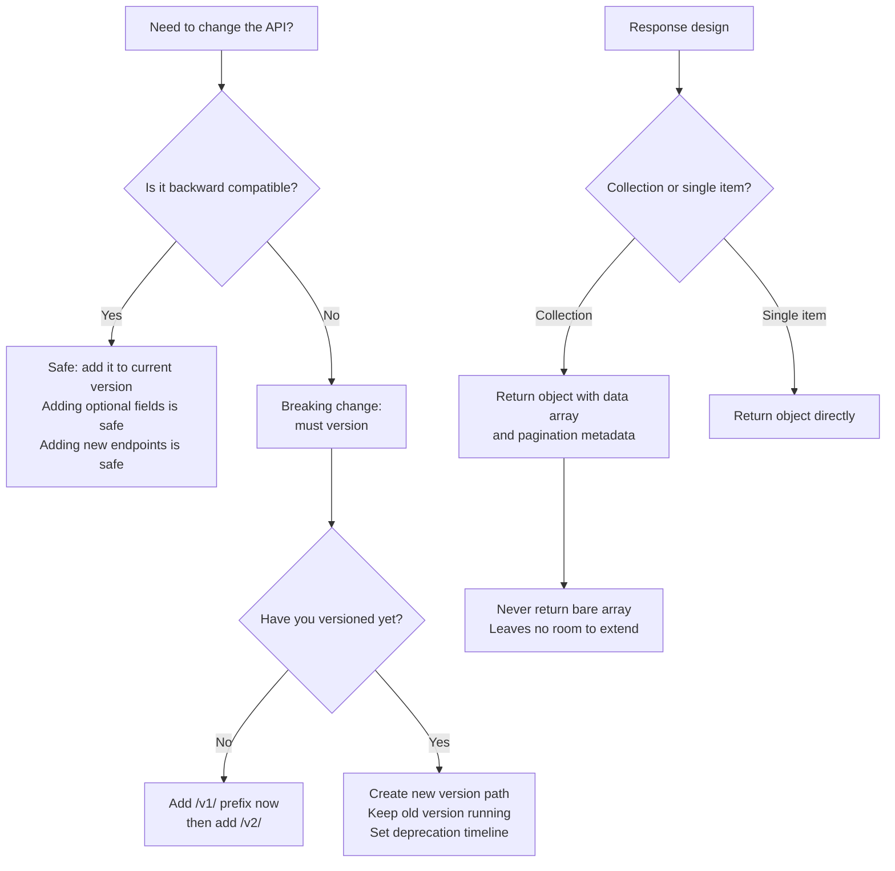
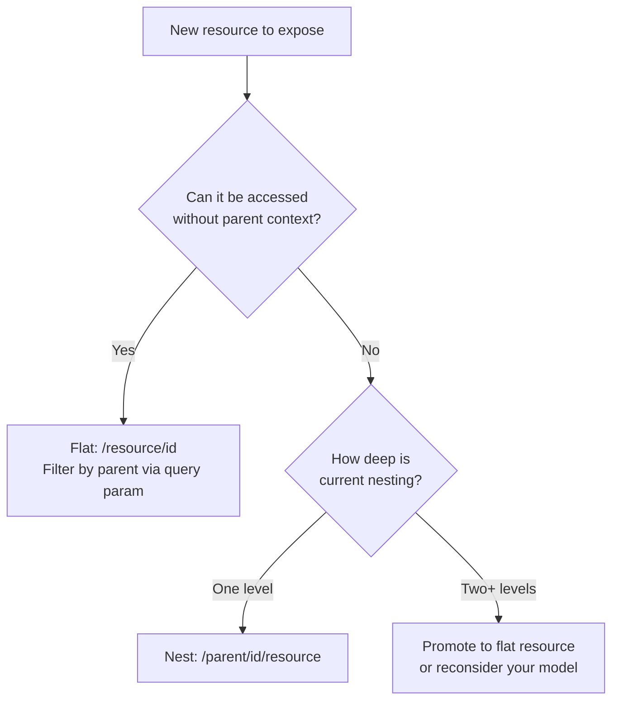
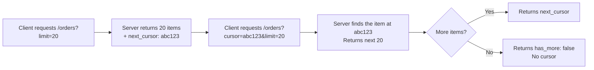
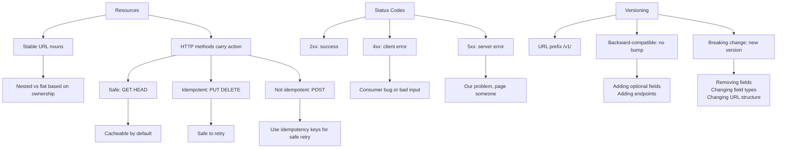
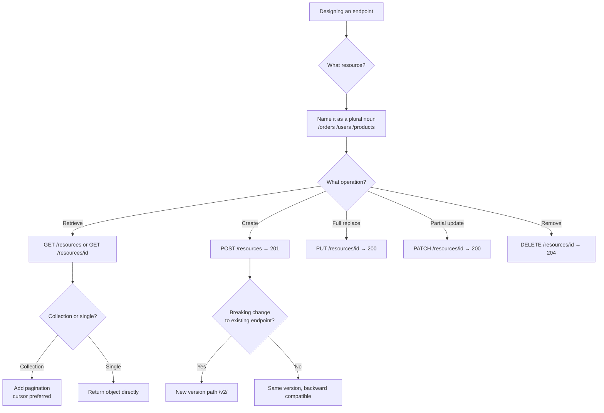

# API Design

## 1. Overview

API design is the practice of defining how systems and clients communicate — what endpoints exist, what they accept, and what they return. It happens before you write a single line of implementation code. You've already interacted with APIs as a consumer: every time you tap "place order" in an app, you're hitting an endpoint someone designed. A well-designed API makes the right thing obvious and the wrong thing hard to do. A poorly designed one forces every consumer to learn its quirks and paper over its gaps.

Getting the surface area right early matters more than implementation. APIs, once released, are difficult to change without breaking consumers. Design is the high-leverage moment.

## 2. Core Concept & Mental Model

An API is a contract between you and your consumers. Design for the consumer, not the implementation.

A contract is a binding agreement. If you sign a lease, you can't unilaterally change the terms mid-month. An API has the same property. The moment consumers start relying on your endpoint shape — the URL, the fields, the error format — those become obligations. Breaking them silently is a broken contract.

The analogy is a restaurant menu. The menu is the API. The kitchen is the implementation. When a customer reads "grilled salmon with lemon butter," they're reading a contract: they'll receive salmon, it will be grilled, lemon butter will be present. The kitchen might change the chef, the supplier, or the cooking technique — and that's fine. But if the salmon arrives raw or without lemon butter, the contract is broken. The customer doesn't care about the kitchen. They care about what was promised.

Your consumers are the customers. They read your API documentation (the menu). They order confidently based on what's described. How your service works internally — which database, which cache, which service calls — is the kitchen. Keep the menu accurate. Never change what you've promised without telling them.

The best APIs have two properties:
- **The right thing is obvious** — a new developer can pick up your API and do the most common thing correctly without reading docs
- **The wrong thing is hard** — it takes deliberate effort to misuse the API

When you design from the implementation outward ("I have a `processOrder` function, so I'll expose `/processOrder`"), you break both properties. When you design from the consumer inward ("What is the consumer trying to do? Place an order. What should that look like from their perspective?"), you get an API that matches how people think.

## 3. Building Blocks

### Level 1: Resource Modeling

#### Why this level matters

Before you think about HTTP methods, headers, or status codes, you need to decide what your API exposes. The most common mistake in API design is exposing implementation details as endpoints: `/getUser`, `/createOrder`, `/updateInventory`. These URLs describe what the server does, not what the consumer is working with. They're the wrong starting point.

REST — the dominant API style — organizes endpoints around **resources**: the nouns of your system. Once you model resources correctly, the methods and URLs follow naturally. Get the nouns wrong and every subsequent decision is fighting against the model.

#### How to think about it

A resource is a thing your API exposes — something a consumer can create, retrieve, update, or delete. Resources map closely to your data model entities: orders, users, products, payments. Each resource lives at a stable URL. The URL names the thing; the HTTP method says what you're doing with it.

The rule is: **URLs are nouns, HTTP methods are verbs.** `GET /orders/42` means "give me order 42." `DELETE /orders/42` means "cancel order 42." The noun is `/orders/42`. The verb is `GET` or `DELETE`. You never need `/getOrder/42` or `/cancelOrder/42` — the method carries the verb.

Nested URLs express ownership. `/users/5/orders` means "orders belonging to user 5." Nesting communicates that one resource lives inside the context of another. The rule is: nest when access always requires the parent. If you'd only ever look at orders in the context of a user, nest them. If orders can be accessed globally (by order ID alone), keep them flat at `/orders/{id}`.

#### Walking through it

Design the API for the yogurt ordering system from Step 1. The data model has: Customers, Orders, OrderItems, Flavors, Toppings.

Starting with the consumer's perspective:
- A customer needs to browse flavors: `GET /flavors`
- A customer places an order: `POST /orders`
- A customer checks their order status: `GET /orders/{id}`
- An employee updates the order status: `PATCH /orders/{id}`
- A customer sees their order history: `GET /users/{id}/orders`

Notice what's **not** here: `/createOrder`, `/getOrderStatus`, `/updateOrderStatus`. The verbs are gone. The nouns remain. The resources are `flavors`, `orders`, and `users/{id}/orders`. The methods carry the action.

#### The one thing to get right

Name resources in the plural form, use nouns exclusively in URLs, and let HTTP methods be the only verbs. If you catch yourself putting an action word in a URL — `/activate`, `/send`, `/process` — pause and ask: "What is the resource I'm acting on, and which HTTP method expresses this action?"



### Level 2: HTTP Methods & Status Codes

#### Why this level matters

HTTP methods aren't just labels. They carry semantic meaning that clients, proxies, caches, and load balancers rely on. When you use `GET` for a mutation, you're not just making an unusual choice — you're breaking contracts that infrastructure components depend on. Browsers cache GET requests aggressively. A proxy might retry a GET it never should have retried. A monitoring tool might prefetch your delete endpoint. Understanding what each method actually means is the difference between an API that behaves predictably and one that produces mysterious bugs in production.

Status codes carry the same weight. A `200` response is a contract: "everything worked." A `404` says "this resource doesn't exist." A `409` says "there's a conflict you need to resolve." Consumers branch their code on these codes. If you return `200` with an error message in the body, every consumer has to parse the body to know if the call succeeded. That's work you pushed onto them.

#### How to think about it

HTTP methods have two important properties:

- **Safe**: the operation doesn't change server state. Calling it once or a hundred times leaves the world the same. `GET` and `HEAD` are safe. `POST`, `PUT`, `PATCH`, `DELETE` are not.
- **Idempotent**: calling the operation multiple times produces the same result as calling it once. `GET`, `PUT`, and `DELETE` are idempotent. `POST` is not. `PATCH` may or may not be, depending on implementation.

Why does this matter? Because the internet is unreliable. Requests time out. Clients retry. Load balancers reroute. When a request fails mid-flight, the client needs to know: "Is it safe to retry?" If the method is idempotent, yes. If it's `POST`, the answer is "it depends on whether it was received."

Status codes group into ranges: `2xx` = success, `3xx` = redirect, `4xx` = client error (you did something wrong), `5xx` = server error (we did something wrong). The distinction between 4xx and 5xx matters for on-call alerts. A spike in `4xx` suggests bad client behavior or a bad deployment. A spike in `5xx` wakes someone up.

The codes that trip people up:
- `200 OK` — worked, here's data
- `201 Created` — resource created, usually includes `Location` header pointing to the new resource
- `204 No Content` — worked, no body (common for DELETE)
- `400 Bad Request` — client sent malformed input
- `401 Unauthorized` — not authenticated (no valid credentials)
- `403 Forbidden` — authenticated but not allowed (wrong permissions)
- `404 Not Found` — resource doesn't exist
- `409 Conflict` — state conflict (e.g., duplicate creation, stale update)
- `422 Unprocessable Entity` — input is syntactically valid but semantically wrong (business rule violation)
- `429 Too Many Requests` — rate limited
- `500 Internal Server Error` — unhandled server failure

#### Walking through it

In the yogurt ordering system:

- `GET /orders/42` — returns order data with `200`. If the order doesn't exist: `404`.
- `POST /orders` — creates an order, returns `201` with `Location: /orders/99` in the header. If required fields are missing: `400`. If the customer is over their order limit: `422`.
- `PATCH /orders/42` — updates status. Returns `200` with updated order or `204` if no body needed. If the order is already fulfilled and can't be changed: `409`.
- `DELETE /orders/42` — cancels. Returns `204`. If it's already shipped and can't be cancelled: `409`.

Notice the cancel case. You might be tempted to expose `/orders/42/cancel` as a separate endpoint. But `DELETE /orders/42` communicates the same intent more cleanly, and `409` handles "can't cancel" gracefully. The menu stays clean.

#### The one thing to get right

Never use `GET` for anything that changes state. Never return `200` when an operation failed. The first breaks infrastructure contracts. The second makes every consumer write defensive parsing code that could have been a simple status code check.



### Level 3: Request/Response Design & Versioning

#### Why this level matters

The URL and method get the consumer to the right endpoint. The request body, query parameters, and response shape are where the actual contract lives. A poorly shaped response forces consumers to adapt — wrapping fields, parsing nested structures, guessing what nulls mean. A poorly thought-out versioning strategy means the first breaking change requires every consumer to update or breaks silently.

Versioning is the most deferred decision in API design and the most painful when you finally need it. By the time you need to make a breaking change, you have consumers in production. The question is never "will I need to version?" It's "how do I version when the time comes?"

#### How to think about it

**Request design** has a few key dimensions:

- **Path parameters** for resource identity: `/orders/42`
- **Query parameters** for filtering, pagination, and sorting: `GET /orders?status=pending&limit=20&cursor=abc`
- **Request body** for create/update payloads
- **Headers** for cross-cutting concerns: authentication (`Authorization`), content type (`Content-Type`), client version

**Response shape** should be consistent. Every successful response and every error should follow the same envelope. Consumers branch on status code; the body should match the contract they expect for that code. For collections, always return an object with a `data` array — never a bare array. This leaves room to add pagination metadata without a breaking change.

**Versioning strategies** vary in where they put the version:

- **URL versioning** (`/v1/orders`) — explicit and obvious, the most common approach. Breaking changes become a new path. Old clients keep working on `/v1`. New clients opt into `/v2`.
- **Header versioning** (`Accept: application/vnd.api+json;version=2`) — keeps URLs clean, but less visible. API gateways can route on headers, but it's harder to test with a browser.
- **Query parameter versioning** (`/orders?version=2`) — easy to add but feels like a crutch. Versions should be a fundamental routing concern, not a filter.

The rule: version from day one, even if you only have `v1`. It costs nothing to add `/v1/` and everything to retrofit it after consumers are in production.

**Backward-compatible changes** are safe to make without a version bump: adding optional fields to responses, adding new optional request fields, adding new endpoints. **Breaking changes** require a new version: removing or renaming fields, changing field types, changing URL structure, changing required fields.

#### Walking through it

The yogurt ordering API:

`GET /v1/orders?status=pending&limit=20&cursor=abc123` returns:

```
{
  "data": [...orders...],
  "pagination": {
    "next_cursor": "xyz789",
    "has_more": true
  }
}
```

If you later need to rename `status` to `state` in the order object — that's a breaking change. Consumers reading `order.status` will find `undefined`. That's `v2`. Launch `/v2/orders` with the new shape. Keep `/v1/orders` alive until your consumers migrate.

The pagination design above is intentional. Cursor-based pagination (`next_cursor`) handles live data better than offset pagination (`?page=2`). With offset, if a row is inserted between page 1 and page 2, you skip it or see it twice. With a cursor pointing to the last-seen item, you always pick up where you left off, regardless of insertions.

#### The one thing to get right

Establish your versioning convention on the first endpoint. Add `/v1/` to every URL from the start. When you need `/v2/`, you'll thank yourself. Design response envelopes to be extensible — return objects with named arrays, not bare arrays, so metadata can be added without a breaking change.



## 4. Key Patterns

### Pattern: Resource Nesting vs. Flat Resources

#### When to use it

Nesting (`/users/5/orders`) signals that a resource is scoped to its parent and only makes sense in that context. Flat resources (`/orders/42`) signal that the resource has global identity and can be addressed directly.

Use nesting when:
- The child resource has no meaningful identity outside the parent (a cart item outside a cart is meaningless)
- Access control is always scoped to the parent (a user can only see their own orders)
- The URL communicates an important ownership relationship

Use flat resources when:
- The resource has a globally unique ID and is useful across contexts
- Consumers need to access the resource without the parent context
- You're building read-heavy APIs where the parent context is already known

#### How to think about it

A useful test: "Would I ever want to GET this resource without knowing the parent?" If the answer is yes, keep it flat and use query parameters for filtering: `GET /orders?user_id=5`. If you always need the parent to make the request meaningful, nest it.

Avoid deep nesting beyond two levels (`/organizations/1/teams/2/members` is already pushing it). Deep nesting is a sign that a resource has grown its own identity and should be promoted to a flat resource.



### Pattern: Cursor-Based Pagination

#### When to use it

Every list endpoint that returns more data than fits in a single response needs pagination. The question is which kind.

Offset pagination (`?page=2&per_page=20`) is simple but breaks on live data. If an item is inserted or deleted between requests, page 2 will have a gap or duplicate. Use it only for stable, rarely-updated data or when approximate results are acceptable.

Cursor pagination (`?cursor=abc123&limit=20`) is the right choice for live feeds, activity timelines, and any list where insertions or deletions are common. The cursor points to the last-seen item; the server returns everything after that point.

#### How to think about it

Think of cursor pagination as a bookmark. You read through a book, put a bookmark in, come back later, and pick up exactly where you left off — even if pages were added before your bookmark. Offset pagination is like saying "give me page 3" — if pages were added, page 3 now contains different content.

The cursor itself is typically opaque to the consumer: a base64-encoded timestamp or ID. The consumer doesn't need to interpret it, only pass it back. The server decodes it to find the position.



## 5. Decision Framework





| Concern | Option A | Option B | When to prefer A | When to prefer B |
|---|---|---|---|---|
| Versioning location | URL prefix `/v1/` | Request header | Public APIs, easy to test, most common | Internal APIs where URL cleanliness matters |
| Pagination type | Offset `?page=N` | Cursor `?cursor=X` | Stable data, simple implementation | Live feeds, activity lists, insert-heavy |
| Nesting depth | Nested `/parent/id/child` | Flat `/child?parent_id=X` | Child has no identity outside parent | Child is globally addressable |
| Partial vs full update | `PATCH` partial | `PUT` full replace | Most update operations | When full document replacement is correct |
| Error detail | Status code only | Status + error body | Internal simple APIs | Public APIs, developer-facing services |

## 6. Common Gotchas

### Gotcha 1: Verbs in URLs

#### What goes wrong

You expose `/api/createUser`, `/api/deleteOrder`, `/api/activateAccount`. New developers can't guess what endpoints exist. SDK generators fail. Documentation tools produce inconsistent output. The API grows in every direction as each developer adds their own action URL.

#### Why it's tempting

Action-oriented naming matches how you think about implementation: "I need to write a function that creates a user, so the endpoint is `createUser`."

#### How to fix it

Name the resource, let the method carry the verb. `POST /users` creates a user. `DELETE /orders/{id}` deletes an order. For state transitions like "activate account," use `PATCH /accounts/{id}` with `{"status": "active"}` in the body — or, if the transition is complex, a sub-resource: `POST /accounts/{id}/activation`.

### Gotcha 2: Using GET for mutations

#### What goes wrong

You expose `GET /orders?action=cancel` or `GET /deleteUser?id=5` because it's easy to test in a browser. A health-check crawler hits your service. Browser prefetch fires. A proxy caches the response and your "delete" never reaches the server. Your monitoring dashboard accidentally cancels orders.

#### Why it's tempting

GET requests are easy to test in a browser or with curl. POST requires a body.

#### How to fix it

`GET` must never change state. Use `POST`, `PUT`, `PATCH`, or `DELETE` for anything that mutates. Every major HTTP client handles these methods trivially.

### Gotcha 3: Ignoring idempotency on POST

#### What goes wrong

A client submits an order. The response times out. The client retries. The order is created twice. The customer is charged twice.

#### Why it's tempting

"The client should just not retry." But networks fail. Mobile apps reconnect. Load balancers time out.

#### How to fix it

Accept an `Idempotency-Key` header on mutating endpoints. On the first request with a given key, process the operation and store the result. On subsequent requests with the same key, return the stored result without re-processing. Stripe, PayPal, and every payment API does this. The key is client-generated (usually a UUID) and is the consumer's way of saying "this is the same logical request."

### Gotcha 4: Returning 200 with error bodies

#### What goes wrong

Your API returns `{"success": false, "error": "User not found"}` with a `200 OK` status. Every consumer has to parse the body to determine if the call succeeded. Middleware that logs `4xx` errors misses these failures. Client libraries that retry on `500` never see the error.

#### Why it's tempting

It feels more "flexible" to have a consistent response envelope with a success flag.

#### How to fix it

Status codes are the success/failure signal. Reserve `2xx` for success. Use `4xx` for client errors. Use `5xx` for server errors. You can include a structured error body with a message and error code — but the HTTP status code must match the outcome.

### Gotcha 5: Returning bare arrays

#### What goes wrong

Your list endpoint returns `[{...}, {...}]` directly. Six months later you need to add pagination metadata. Changing the response to `{"data": [...], "pagination": {...}}` is a breaking change. Every consumer parsing `response[0]` breaks.

#### Why it's tempting

Arrays are simpler. The consumer asked for a list; give them a list.

#### How to fix it

Always wrap collection responses in an object. Even if you don't need pagination today, structure every list response as `{"data": [...]}` from day one. Adding `"pagination"` later becomes a backward-compatible change. Reversing a bare array is a version bump.
