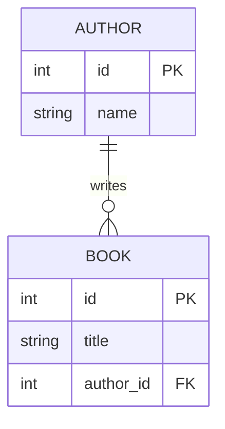
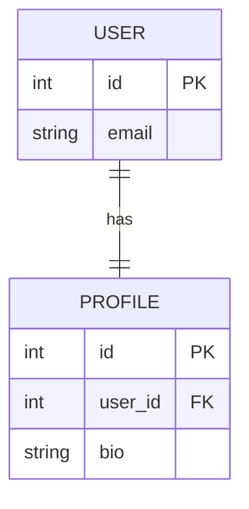
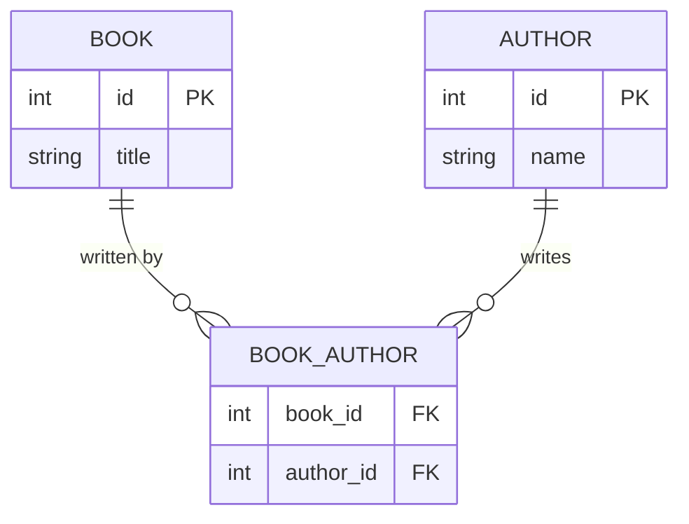
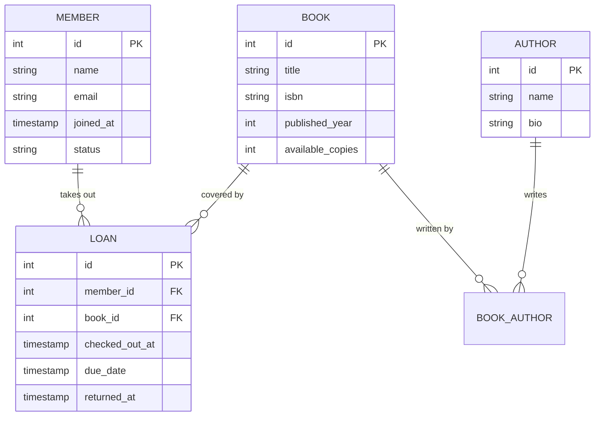
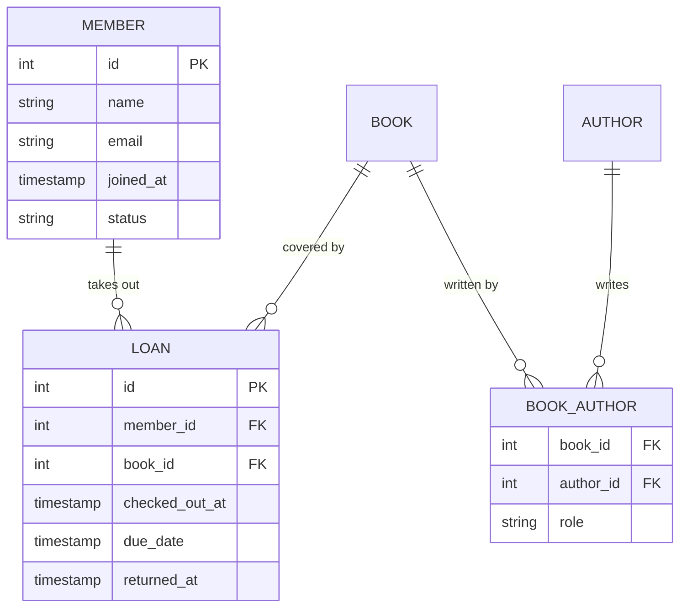
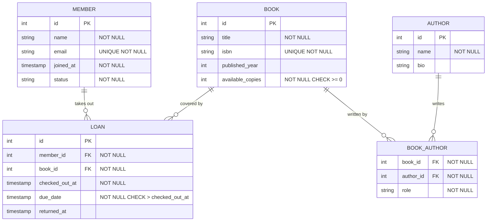
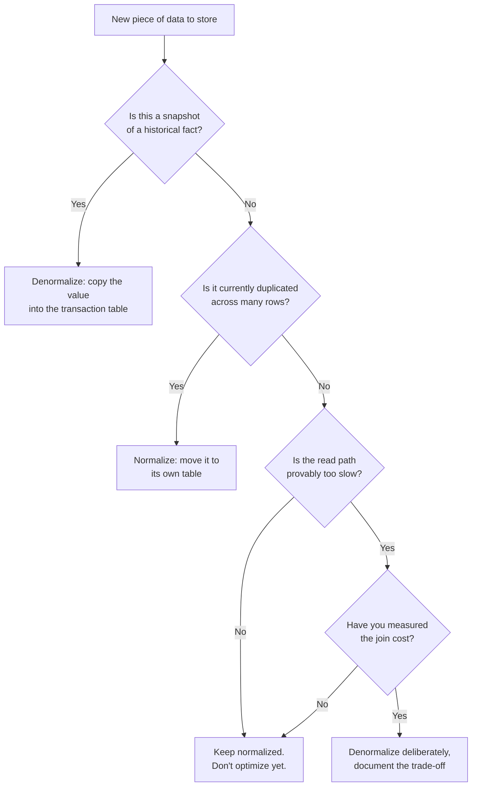
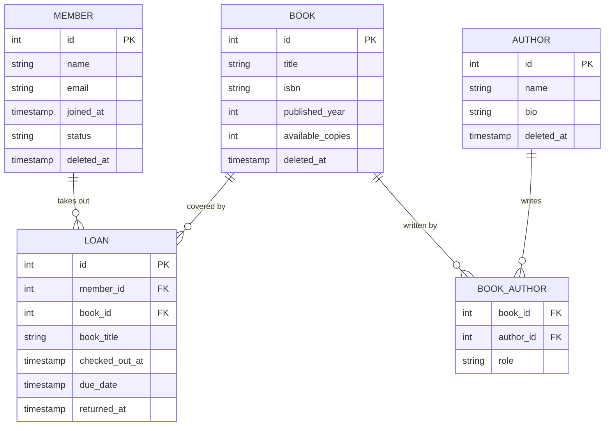

# Data Modeling & Schema Design

## 1. Overview

Data modeling is the practice of deciding what information your system needs to store, how to structure it, and what rules govern its shape. It happens before you think about scale, before you choose a database engine, and before you write a single query. You already do this every time you design a JSON response — you're choosing fields, nesting, and types. A schema makes that structure explicit and enforces it at the database level.

Getting the model right early is one of the highest-leverage decisions you can make. A poorly modeled schema is painful to change once data exists in it, and no amount of caching or indexing recovers a fundamentally broken data shape.

## 2. Core Concept & Mental Model

Every system is just entities and relationships. Before you think about scale, think about what you're storing and why.

An entity is a thing your system cares about — something you'd want a row in a table for. A relationship is how two entities connect. That's the entire model. Everything else — constraints, indexes, normalization — is refinement on top of this foundation.

Take a public library. What are the things it needs to know about? There are **Books** on the shelves. There are **Members** who hold library cards. Members take out **Loans** — a record that a specific member borrowed a specific book on a specific day, due back by a specific date. Books are written by **Authors**, and a book can have multiple authors. Each of those is an entity — a noun the system needs to track. The relationships are the verbs: a member _takes out_ loans, a loan _covers_ a book, a book _is written by_ authors.

Before you draw a single box or write a single line, you should be able to say out loud: "What are the things? How do they relate?" If you can answer that clearly, the rest is mechanics.

### Prerequisites: Core Concepts

Before diving into schema design, you need to know three fundamental database mechanics. These are how relational databases actually work.

#### Table

A table is a named collection of related data, organized into rows and columns. Each row represents one instance of the thing you're tracking. A `Member` table has one row per library member. A `Book` table has one row per book in the catalog. Think of it like a spreadsheet: the table is the sheet, each row is a record, each column is an attribute.

#### Primary Key (PK)

Every table needs a primary key — a column (or combination of columns) that uniquely identifies each row. No two rows can have the same primary key value. It's how you distinguish "this book" from "that book." In practice, it's usually an `id` column with auto-incrementing integers, but it can be any column that's guaranteed to be unique.

Example: In the `Book` table, `id` is the primary key. Book with id=42 is always the same book, forever.

#### Foreign Key (FK)

A foreign key is a column in one table that references the primary key of another table. It's the mechanism that creates relationships. It's how you say "this Loan row belongs to Member 5" or "this Loan is for Book 42."

Foreign keys enforce referential integrity: you can't create a Loan with a `member_id` that doesn't exist in the Member table. The database prevents orphaned records.

A table can have multiple foreign keys. Each one expresses a different relationship. The `Loan` table has two: `member_id` (references `Member.id`) and `book_id` (references `Book.id`). A single Loan row links to one Member and one Book. If you needed to track which librarian processed the checkout, you'd add a third foreign key `librarian_id`. The rule is simple: one foreign key per relationship you need to express.

### Terminology Clarifications

Database design uses several terms that are often confused. Here's what they actually mean.

#### Entity

An entity is the conceptual "thing" — before databases, before tables, before any code. It's what you identify when you ask "what does this system need to track?" In a library, Book, Member, and Author are entities. They're nouns. Entities exist in your head and on paper before you build anything.

#### Entity vs. Table: The key difference

Don't use "entity" and "table" interchangeably. An **entity** is the concept. A **table** is how you implement it in a database. One entity = one table (usually). You design entities when you're thinking. You build tables when you're implementing.

When someone says "we need to model the Member entity," they mean "we need to figure out what a Member is and what we need to track about it." When they say "create the Member table," they mean "actually build it in the database."

#### Data Model

A data model is your complete design — all the entities you've identified, all their attributes, and how they relate. It's the blueprint before code. When you say "design a data model for a library," you're answering: "What entities exist? What do we track about each? How do they connect?"

The data model is independent of any specific database technology. You could implement the same data model in PostgreSQL, MongoDB, or even a spreadsheet. The model is the thinking; the database is the implementation.

#### Schema

A schema is the actual database structure — the SQL definition of all your tables, columns, data types, primary keys, foreign keys, and constraints. It's the blueprint _as implemented_ in a specific database.

Schema = Tables + Columns + Data Types + Keys + Constraints.

You design a data model (thinking). You implement it as a schema (actual code).

#### "Model" in different contexts

"Model" has different meanings depending on where you hear it:

- In Rails or Django, a "Model" is an application-layer object that represents a database table and often includes business logic.
- In database design, "model" refers to the conceptual structure (data model, entity-relationship model).

In this guide, "model" refers to the design thinking, not application code. Don't confuse a Rails Model with a database data model — they're different things.

## How to Read Mermaid ER Diagrams

The diagrams in this guide use Mermaid's entity-relationship (ER) notation. The symbols show cardinality — how many rows on each side of a relationship.

#### Cardinality symbols

The symbols at each end of a line show "how many":

**One-to-many** — One row on the left, many on the right:

Read left-to-right: "One Author writes **zero or more** Books."

**One-to-one** — Exactly one on each side:

Read left-to-right: "One User **has exactly one** Profile."

**Many-to-many** — Many on both sides (through a junction table):

Read: "One Book is written by zero or more BookAuthor rows" AND "One Author writes zero or more BookAuthor rows."

## 3. Building Blocks

### Level 1: Entities and Attributes

#### Why this level matters

Every other design decision flows from correctly identifying your entities. If you model the wrong things as entities — or miss entities entirely — you'll be adding tables and migrating data under pressure later. Getting entities right is about asking: "Is this thing independent enough to have its own identity, or is it just a property of something else?"

#### How to think about it

An entity is a thing that exists on its own and needs to be tracked across time. A Book is an entity — it has a title, an ISBN, a publication year, and it can be borrowed independently of any particular member. "Hardcover" is not an entity; it's an attribute of a book. The test: does this thing need its own identifier, or does it just describe another thing?

Attributes are the properties of an entity. They live in columns on the entity's table. They're facts about the entity that don't need their own table. A Member has a name, an email, and a join date. Those are attributes, not entities.

#### Walking through it

Start with the library system. The entities are:

- **Book** — exists independently, has a title and ISBN, can be borrowed by many members over time
- **Member** — a card-holding patron, has contact info, can have many active loans
- **Loan** — the record of a borrowing event, created at checkout, tied to one member and one book
- **Author** — exists independently of any particular book, can write multiple books

Now attributes for each. A Book has `title`, `isbn`, `published_year`, `available_copies`. A Member has `name`, `email`, `joined_at`, `status` (tracking account state: active, suspended, closed). A Loan has `checked_out_at`, `due_date`, `returned_at`. An Author has `name`, `bio`.

Notice the difference: **Member.status is explicit** — an actual column on the table, tracking the member's account state. But **Loan doesn't need an explicit status column** — its status is implicit. Whether a loan is "active" or "returned" is determined by checking if `returned_at` is null. The status describes the state of the Loan but doesn't need its own entity or column.

#### The one thing to get right

Ask whether the thing needs its own ID and whether you'd want to look it up independently. If yes, it's an entity. If it's just a descriptor of another entity, it's an attribute.

:::evaluator
Think of a university course registration system. Identify at least 3 entities and list 2–3 attributes for each. Then explain: why would 'department name' be an attribute rather than its own entity in most designs?
:::

### Level 2: Relationships

#### Why this level matters

Once you have entities, you need to model how they connect. The type of relationship — one-to-many versus many-to-many — determines whether a foreign key is enough or whether you need a third table. Modeling a many-to-many as a one-to-many is one of the most common schema mistakes, and it shows up immediately in interview questions.

#### How to think about it

There are three relationship types. One-to-one means each row in table A links to exactly one row in table B. One-to-many means one row in A links to many rows in B — a member to their loans. Many-to-many means rows in A can relate to many rows in B and vice versa — a single book can have many authors, and a single author can write many books.

Many-to-many relationships require a \*junction table\*\* (also called an associative table or join table). The junction table sits between the two entities and holds one row per pairing. It often carries data of its own — not just the two foreign keys, but attributes of the relationship itself.

#### Walking through it

The library system demonstrates one-to-many and many-to-many relationships. These are the most common in practice:

- Member to Loan: **one-to-many**. One member has many loans over time. Loan gets a `member_id` foreign key.
- Book to Loan: **one-to-many**. One book has many loan events over its lifetime. Loan gets a `book_id` foreign key.
- Book to Author: **many-to-many**. A book can have multiple authors (co-authors, editors), and an author can write many books.

That last one requires a junction table: `BookAuthor`. It has `book_id` and `author_id` as foreign keys. Critically, it also carries `role` — was this person the primary author, a co-author, or an editor? That's not a property of the book or the author alone; it's a property of the relationship between them. The junction table is the right home for it.

#### The one thing to get right

When you see many-to-many, reach for a junction table immediately. Don't try to jam multiple foreign keys into one column or store a comma-separated list. The junction table also gives you a natural place to hang relationship-level attributes like `role` or `contribution_type`.

#### One-to-one relationships: When they appear

One-to-one relationships exist but are less common in most systems. They're the right choice when one entity _always_ has exactly one counterpart, and that counterpart doesn't naturally belong as an attribute.

Common patterns:

- **User to UserProfile**: A user account has exactly one profile with extended info (bio, avatar, preferences). Could live as attributes on User, but separating them keeps the core user table lean and lets different services own different data.

- **Employee to Employment**: An employee entity might be reused across contexts, but employment records (salary, department, hire date) are specific to one job assignment. One-to-one lets you track the relationship without duplicating employee identity.

- **Account to Settings**: A user account has one settings record with preferences. Separating settings keeps the account table stable while settings evolve frequently.

#### The key test for one-to-one

Ask three questions:

1. **Does every row in the primary entity always have exactly one related row?** Not "can have," but "always will have." Every User has exactly one UserProfile. Every Employee has exactly one Employment. If it's optional, it's not truly one-to-one.

2. **Would a row in the related entity ever exist without its counterpart?** An orphaned UserProfile with no User is meaningless. An orphaned Employment record with no Employee is meaningless. If you can imagine the related entity standing alone as valid, it's not truly one-to-one.

3. **Is the relationship stable and permanent?** One-to-one works when the pairing never changes. User-to-UserProfile is stable. But if you might later need "Employee to CurrentEmployment" (because an employee can have employment history), then one-to-one is the wrong choice. Start with a separate entity and one-to-many.

#### What "orphaned" means

An orphaned row is a record with a foreign key pointing to something that doesn't exist — or in one-to-one's case, a record in the related table with no counterpart in the primary table.

Example: You use one-to-one for User → UserProfile. You hard-delete a User. Now the UserProfile row exists with no User. It's orphaned. If you find yourself with orphaned rows, your design is broken.

#### When NOT to use one-to-one

- **"This might become one-to-many later"** → Don't use it. Start with a separate entity and one-to-many. Converting one-to-one to one-to-many after data exists is painful.
- **The related entity can exist without the primary entity** → Not one-to-one. It's a separate entity with a many-to-one relationship.
- **The relationship is optional** → If a User *might not have* a Profile, it's not one-to-one. Use a nullable foreign key in the User table or allow null relationships.
- **You're just trying to keep tables "lean"** → If the only reason is table width, denormalize it into attributes instead. Don't create a separate table.

#### When one-to-one is genuinely right

- The two entities represent different concerns or lifecycles. User (auth) vs. UserProfile (public identity). Account (billing) vs. Settings (preferences).
- Different teams own the data. The auth team manages User, the profile team manages UserProfile.
- One entity changes frequently while the other is mostly stable. Account table rarely changes; Settings table updates constantly.
- You need to query them together rarely. If you're always joining them, maybe they should be one table.

:::evaluator
A library allows members to borrow books. A single book can be borrowed many times over its lifetime, and a member can have multiple active loans. What relationship type exists between Member and Book through Loan? Walk through the tables and columns you'd need, including any data that belongs on the relationship itself.
:::

### Level 3: Constraints and Integrity

#### Why this level matters

A schema without constraints is just a suggestion. Application code can enforce rules, but it runs in multiple processes, gets deployed with bugs, and can be bypassed by direct database writes. Constraints are promises the database keeps on your behalf, no matter how the data gets in. They're the last line of defense and the most reliable one.

#### How to think about it

There are four constraint types worth knowing:

- **Not-null** — this field must always have a value. A loan must have a `checked_out_at` timestamp.
- **Unique** — no two rows can have the same value for this field (or combination of fields). A book's ISBN must be unique.
- **Foreign key** — this field must reference a row that actually exists in the other table. A loan's `member_id` must point to a real member.
- **Check constraint** — a custom rule the value must satisfy. `due_date` must be after `checked_out_at`. Available copies must be >= 0.

#### Walking through it

In the library system, constraints do real work:

- `BOOK.isbn` is unique and not-null — no two books share an ISBN, and every book must have one.
- `LOAN.member_id` and `LOAN.book_id` are not-null foreign keys — you can't create a loan that references a non-existent member or book.
- `LOAN.due_date` has a check constraint: `due_date > checked_out_at`. You can't create a loan due before it was checked out.
- `BOOK_AUTHOR (book_id, author_id)` has a composite unique constraint — you can't link the same author to the same book twice.
- `BOOK.available_copies` has a check constraint: `available_copies >= 0`. You can't go into negative inventory.

That last one is subtle but important. Without it, a race condition in your checkout code could briefly produce a negative count. The database constraint makes that impossible.

#### The one thing to get right

Don't put constraints only in your application layer. The database outlasts your application code. Every schema invariant you care about should be expressed as a constraint.

:::evaluator
You're designing the Loan table (checkout_date, due_date, return_date, member_id, book_id). Name two constraints you'd add and explain why each should live at the database level rather than only in application code.
:::

## 4. Key Patterns

### Pattern: Normalization vs Denormalization

#### What normalization means in practice

Normalization is the direct result of the work in Levels 1 and 2. You identified `Author` as its own entity (Level 1), and you created a foreign key relationship between `Book` and `Author` (Level 2). The author's name lives in exactly one place: the `AUTHOR` table. The `BOOK` table only stores `author_id`, not the author's name.

Result: If Stephen King changes how he wants his name displayed, you update the `AUTHOR` table once. Every query that joins `BOOK` to `AUTHOR` automatically sees the new name.

#### What denormalization means in practice

Denormalization is copying data into multiple tables to avoid joins. Instead of storing only `author_id` on `BOOK`, you also store `author_name`. Now you can display a book and its author without joining tables.

Result: Faster reads, because the data is already there. But now the author's name exists in two places. If you update `AUTHOR.name` and forget to update `BOOK.author_name`, the data is inconsistent.

#### When you'd normalize (the default)

Start here. Keep Author as a separate entity with a foreign key relationship. When you query books by an author, you join `BOOK` to `AUTHOR`. This is the design from Levels 1-2, and it should be your default.

Example: "Find all books by author_id = 42" — just query `BOOK WHERE author_id = 42`. No duplication.

#### When you'd denormalize (only when justified)

Denormalization is a deliberate trade-off: slower writes and sync problems in exchange for faster reads. Use it only in these cases:

1. **Capturing a historical snapshot** — The `LOAN` table stores `book_title` in addition to `book_id`. Why? Because the book's title might change later, or the book might be deleted. The loan record needs to remember what the book was called *at checkout time*. This isn't optional data duplication; it's a business requirement.

2. **You've measured the join and it's slow** — You have evidence that the normalized query (joining `BOOK` to `AUTHOR`) is a bottleneck. Only then, copy `author_name` onto `BOOK` to avoid the join. But document why and what breaks if you don't keep it in sync.

3. **The data rarely changes** — If the `AUTHOR` table is updated once per year but read constantly, denormalization might make sense.

Never denormalize just because tables feel "wide" or to keep design "simple." Start normalized. Only denormalize when you have a specific problem and evidence it solves it.

### Pattern: Soft Deletes

#### What it is

Instead of deleting a row, you set a `deleted_at` timestamp. The row stays in the database, invisible to normal queries but available for auditing, recovery, or historical reference.

#### Why it matters

Hard deletes are permanent. In the library, if you delete a Book record and then a member asks about their borrowing history, the old loan records still exist but the book they reference is gone. The data becomes orphaned and confusing.

Soft deletes let you "remove" a book from the catalog while keeping the history intact. Setting `BOOK.deleted_at` hides it from the browse UI while preserving the loan records that reference it.

#### What it costs

Every query on a soft-deleted table needs a `WHERE deleted_at IS NULL` clause, or you'll accidentally show deleted records. This is easy to forget. The fix is to use a database view or ORM scope that applies the filter automatically. But be aware the rows are still there, still counted in table size, and still need to be filtered at query time.

#### When to use it

Use soft deletes when the data has regulatory or audit requirements, when deleted records are referenced by other tables, or when "undo" is a product requirement. Skip it for truly ephemeral data like session tokens or rate-limit counters.

## 5. Decision Framework

Use this flowchart when deciding whether to normalize or denormalize a piece of data.

Here is the full library catalog schema, showing how all the pieces connect.

## 6. Common Gotchas

### Gotcha 1: Missing the junction table

#### What goes wrong

You need to record that a book has multiple authors, so you add `author_id_1`, `author_id_2` to the Book table. Then a third co-author arrives and you need a migration. Querying all books by a specific author now requires checking three columns.

#### Why it's tempting

Junction tables feel like overhead when you're starting out. "I'll just add another column for now."

#### How to fix it

As soon as you see a many-to-many, draw the junction table first. It's always the right call, and adding it later after data exists is painful.

### Gotcha 2: Enforcing invariants only in application code

#### What goes wrong

You validate that a loan's `due_date` must be after `checked_out_at` in your API handler. Then a data migration script runs without going through the API — and suddenly you have loans where the due date precedes checkout. Your application assumes the data is clean; it isn't.

#### Why it's tempting

It's faster to write a quick if-check in your code than to think through database constraints.

#### How to fix it

Every invariant you care about — not-null, uniqueness, referential integrity, business rules — should be expressed as a database constraint. Think of application validation as a UX layer. Think of database constraints as the actual guarantee.

### Gotcha 3: Premature denormalization

#### What goes wrong

You anticipate that joining `LOAN` to `BOOK` will be slow, so you copy `book_title` and `book_isbn` directly onto `LOAN` before you've built or measured anything. Later, a book title is corrected and now old loans show the wrong title for the wrong reason (not historical accuracy — just a bug).

#### Why it's tempting

Joins feel expensive before you've measured them. Denormalized reads feel clean.

#### How to fix it

Start normalized. Measure the actual query. Join performance on indexed foreign keys is fast. Denormalize only when you have evidence the join is the bottleneck, or when you genuinely need a historical snapshot.

### Gotcha 4: Forgetting soft delete filters

#### What goes wrong

You add `deleted_at` to `BOOK`. You filter it in the browse endpoint. But you forget to filter it in the admin search, the "books by author" query, and the recommendation engine. Deleted books start appearing in unexpected places.

#### Why it's tempting

Adding the column feels like the hard part. The filter seems obvious.

#### How to fix it

Treat soft-deletable tables as requiring a default scope. Use a database view or ORM default that always applies `WHERE deleted_at IS NULL`. Any query that intentionally needs deleted records opts out explicitly.

### Gotcha 5: Orphaned records from hard deletes

#### What goes wrong

You hard-delete a Member who closes their account. Their Loan records still exist but now reference a non-existent member_id. Queries that join through `member_id` break or return nulls silently.

#### Why it's tempting

"They closed their account, so delete everything" feels clean.

#### How to fix it

Use foreign key constraints with appropriate `ON DELETE` behavior. `ON DELETE RESTRICT` prevents deleting a member while they have loans. `ON DELETE SET NULL` nulls out the reference. `ON DELETE CASCADE` deletes the loans too. Choose deliberately based on your data retention requirements.
