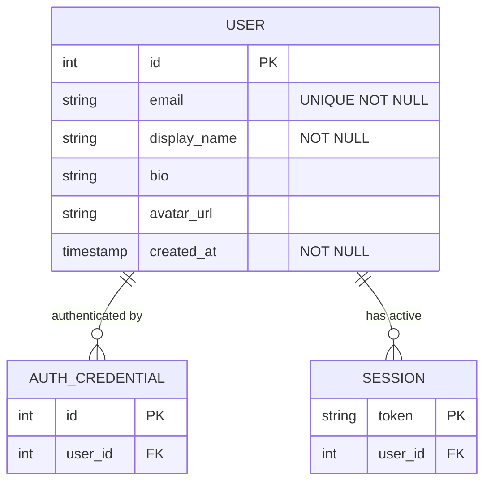
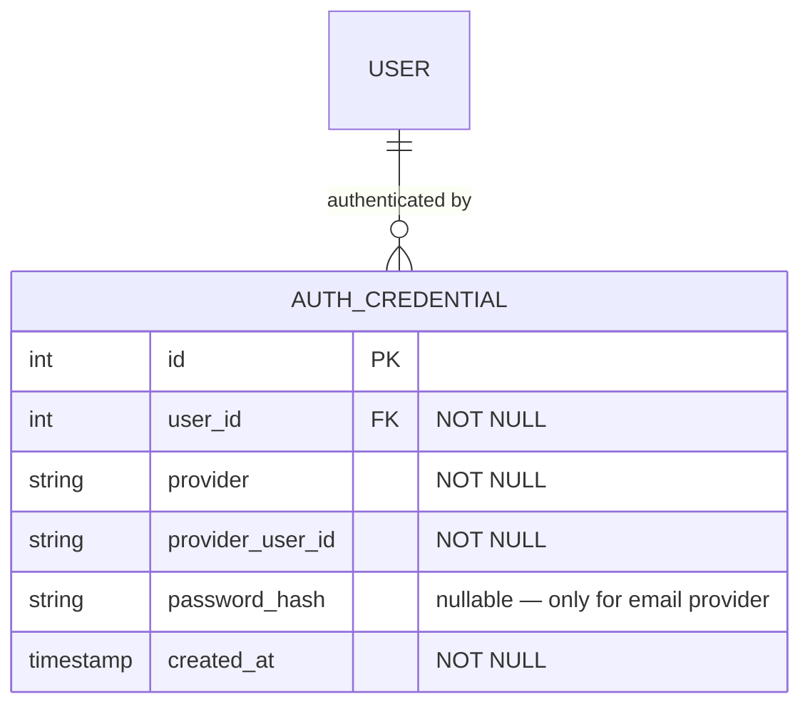
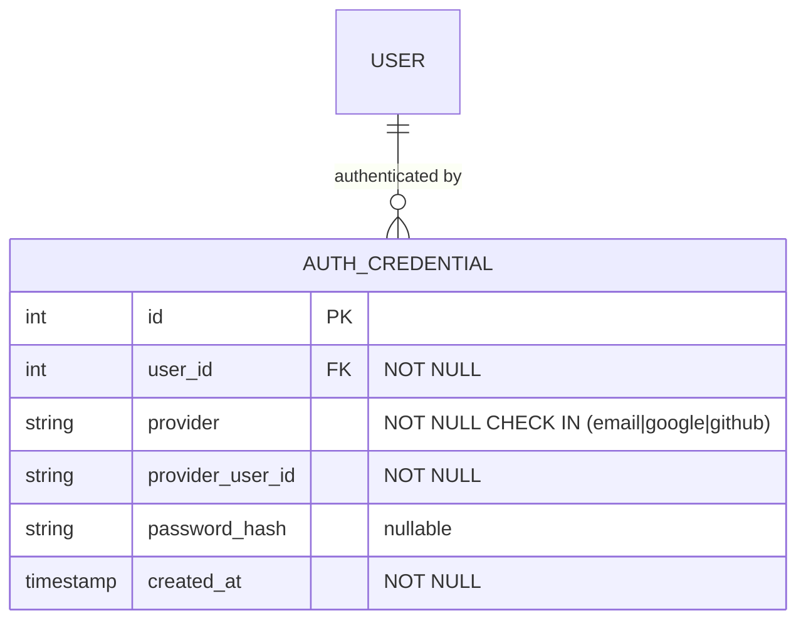
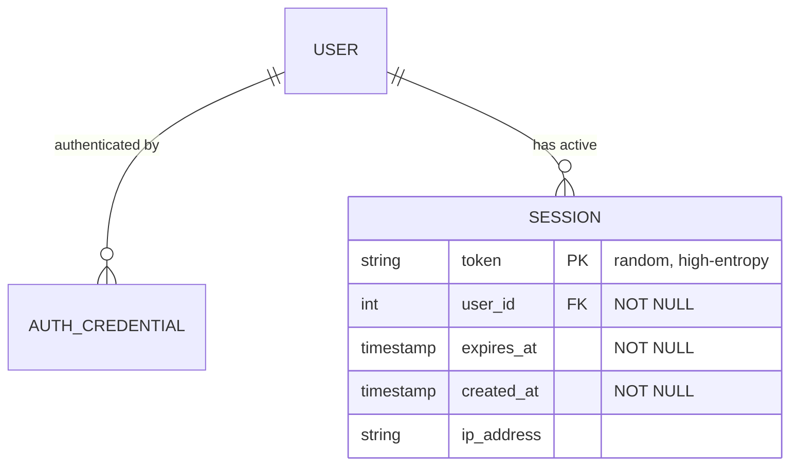
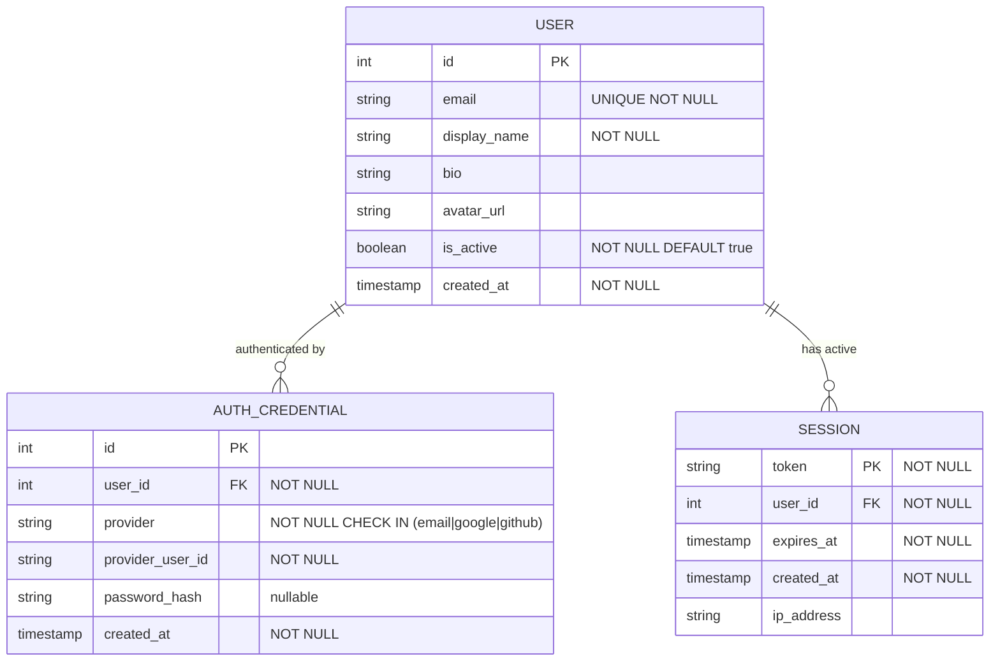

---
stepQuestions:
  - 'A new user registers with email and password. Which tables get rows inserted, and in what order? What would you store in each row?'
  - 'A user signs in with Google for the first time — their email matches an existing email/password account. Should the system automatically link the accounts? What constraint in your schema prevents the Google identity from being claimed by two different users?'
  - 'The auth_credentials table has two uniqueness constraints: UNIQUE(user_id, provider) and UNIQUE(provider, provider_user_id). What specific problem does each one prevent?'
  - "Name two constraints you'd enforce at the database level on the sessions table. Why shouldn't they live only in application code?"
  - "A user clicks 'log out everywhere.' Describe the exact operation — what gets changed or deleted, and what does the system know after it completes?"
---

## How to Approach This

### The Core Insight

Most candidates model a "User" as one big table with a `password_hash` column and maybe a `google_id` column bolted on. That design works until a user wants to link a second auth method — at which point you're adding more nullable columns for every new provider.

The real insight is that **identity and authentication are separate concerns**. A user record says _who you are_. An authentication credential says _how you prove it_. They change for different reasons and at different times: your display name changes when you update your profile; your credentials change when you reset your password or add Google Sign-In. Conflating them into one table treats two independent concepts as one.

### The Mental Model

Think of a hotel check-in desk.

When you arrive, the front desk creates a **guest record** — your name, loyalty number, room preferences. That record is _who you are_ to the hotel. Then separately, they hand you a **key card**. The key card is a credential: it proves you're authorized to access room 412. If you lose it, they deactivate it and issue a new one without touching your guest record.

Now imagine you have a corporate card on file. The front desk can also look you up by swiping that card — it maps to the same guest record. You're still the same guest. There are just two ways to prove it's you. And critically: the same corporate card cannot be registered to two different guests. One card, one guest.

That's your schema: a `users` table (the guest registry), an `auth_credentials` table (the key cards — one row per authentication method per user), and a `sessions` table (the active cards currently checked out).

> This is the principle from the Data Modeling guide: things that change at different rates and for different reasons belong in different tables. Profile data, auth methods, and active sessions all have independent lifecycles.

### How to Decompose This in an Interview

Before drawing anything, ask yourself:

1. **What is a "user" in this system?** — Is it the person, or the set of ways they can log in? These should be different things.
2. **What happens when someone adds a second auth method?** — If your schema requires adding a new column per provider, the model is wrong.
3. **What does "log out everywhere" touch?** — The answer tells you whether sessions belong as a column on `users` or as their own table.

## Building the Design

### Step 1: Identify the Core Entities

Think of the database as a set of filing cabinets, one per kind of thing. Before connecting anything, decide what drawers you need.

The test from the Data Modeling guide: _would you ever need to look this up independently, or update it without touching the others?_ You'd update a display name without touching credentials. You'd expire a session without touching either. These are different drawers.

The entities:

- **User** — the person. Stores identity and profile data: email, display name, bio, avatar. This is the anchor everything else points to.
- **AuthCredential** — one row per authentication method per user. Stores the proof: a password hash for email login, or an OAuth provider ID for Google/GitHub. Multiple rows per user.
- **Session** — one active login. Created on authentication, destroyed on logout or expiry.

:::evaluator
A new user registers with email and password. Which tables get rows inserted, and in what order? What would you store in each row?
:::

### Step 2: Model the Auth Credential Table

The `auth_credentials` table is the key design decision. Think of it as a **registry of keys to the same lock** — each row answers: "by what method, and with what proof, can this specific user log in?"

The method is the `provider` field: `email`, `google`, `github`. The proof is provider-specific:

- For email: a `password_hash` (bcrypt or Argon2 — never a fast hash, never plaintext)
- For OAuth: the provider's user ID, returned after the OAuth flow completes

For the email provider, store the email address as `provider_user_id`. This keeps login lookups consistent across providers: "find the credential where `provider = 'email'` and `provider_user_id = 'user@example.com'`."

`password_hash` is nullable because OAuth credentials have no password. Rather than a separate `oauth_credentials` table, use one table with a nullable column and a `provider` discriminator. The provider field tells you which columns are relevant for a given row.

> From the Data Modeling guide: represent variants in one table with a discriminator field when the structure is mostly shared, rather than creating separate tables per variant. This keeps lookups simple — one table, one query pattern.

:::evaluator
A user signs in with Google for the first time — their email matches an existing email/password account. Should the system automatically link the accounts? What constraint prevents the Google identity from being claimed by two different users?
:::

### Step 3: Model the Multi-Provider Constraints

This is the tricky part. The `auth_credentials` table needs two independent uniqueness guarantees — each preventing a different failure.

**Problem 1: A user accidentally creates two Google credentials.**
Without a constraint, clicking "Connect Google" twice creates duplicate rows. Both would match during login, causing ambiguous results.

The fix: `UNIQUE (user_id, provider)`. A user can have at most one credential per provider. One guest, one corporate card.

**Problem 2: The same Google account gets linked to two users.**
Without a constraint, Alice signs in with Google and gets linked to User #1. Later, a second account claims the same Google identity and gets linked to User #2. Now Google Sign-In is ambiguous — which user does this Google account belong to?

The fix: `UNIQUE (provider, provider_user_id)`. A provider identity can map to at most one user. One corporate card, one guest.

These two constraints enforce the complete invariant: each user has at most one credential per provider, and each provider identity belongs to at most one user.

Constraints not visible in the diagram:

- `UNIQUE (user_id, provider)`
- `UNIQUE (provider, provider_user_id)`

> From the Data Modeling guide: composite unique constraints enforce business rules at the relationship level — not just "this column is unique" but "this combination is unique." Both constraints here are relationship-level rules, not attribute-level rules.

:::evaluator
The auth_credentials table has two uniqueness constraints. What specific problem does each one prevent? What goes wrong if you only have one of them?
:::

### Step 4: Add Sessions

Now add the `sessions` table. A session is a **temporary proof of prior authentication** — it lets the user continue without re-entering credentials until it expires.

Think of a session like a timed wristband at an amusement park. The wristband gets you on rides without showing your ticket each time. When it expires, you need a new one. If you leave, it's deactivated. The park's guest database doesn't change — the guest still exists.

**Token as PK.** The token (a random string — UUIDv4 or a cryptographically random value) is the primary key. Looking up a session _is_ looking it up by token.

**`expires_at` not-null.** Every session must expire. Sessions without expiry never clean up. This is both a security property and a data hygiene rule.

**"Log out everywhere"** is `DELETE FROM sessions WHERE user_id = :id`. One operation. All sessions gone. The user record and credentials are untouched.

**Multi-device login is free.** Each device gets its own row. You don't need to design for it — the table structure handles it naturally.

> From the Data Modeling guide: when a concept can have multiple instances per user (multiple active sessions), it belongs in its own table. Storing a session as a column on `users` limits the user to one active session and makes "log out everywhere" a field update — which is the wrong model.

:::evaluator
Name two constraints you'd enforce at the database level on the sessions table. Why shouldn't they live only in application code?
:::

### Step 5: Design the Key API Endpoints

With the schema solid, map the authentication lifecycle to endpoints.

The key insight: authentication has two phases — **credential verification** (is this really you?) and **session issuance** (here's your token). Separating them in the API makes the flow explicit and testable.

| Method   | Path                    | What it does                                              |
| -------- | ----------------------- | --------------------------------------------------------- |
| `POST`   | `/auth/register`        | Create user + email auth_credential, return session token |
| `POST`   | `/auth/login`           | Verify credential, create session, return token           |
| `POST`   | `/auth/oauth/callback`  | Exchange OAuth code, look up or create user, return token |
| `DELETE` | `/auth/session`         | Invalidate current session (log out)                      |
| `DELETE` | `/auth/sessions`        | Invalidate all sessions (log out everywhere)              |
| `GET`    | `/users/me`             | Return current user's profile                             |
| `PATCH`  | `/users/me`             | Update profile fields                                     |
| `POST`   | `/users/me/credentials` | Link a new auth provider to an existing account           |

The last endpoint — `POST /users/me/credentials` — is only accessible to authenticated users. This prevents an attacker from claiming an OAuth identity on your behalf.

## The Complete Schema

Constraints not visible in the diagram:

- `AUTH_CREDENTIAL`: `UNIQUE (user_id, provider)` + `UNIQUE (provider, provider_user_id)`
- `SESSION.token`: cryptographically random — not a sequential integer
- `SESSION.expires_at`: must be in the future at creation (application-layer check)

## Trade-offs

### Where to store the user's email

**Option A: Email on `users` only** — canonical for notifications and display; `auth_credentials` stores `provider_user_id` separately for the email provider (slight duplication). Getting the user's email for a password reset doesn't require joining through credentials.

**Option B: Email only on `auth_credentials`** — no duplication. But getting the notification email requires `JOIN auth_credentials WHERE provider = 'email'`, which breaks for OAuth-only users.

**Recommendation:** Keep `email` on `users` as the contact/notification address. Let `auth_credentials.provider_user_id` hold the login identifier per provider. They serve different purposes and shouldn't share a column.

### Session storage: database rows vs. self-contained JWT

**Database-backed sessions** (this schema): revocable instantly. "Log out everywhere" is a DELETE. Requires a database lookup on every authenticated request to validate the token.

**Self-contained JWT**: stateless — the token carries its own claims, no lookup needed. But you can't revoke a JWT before expiry. "Log out everywhere" requires a token blacklist, which reintroduces a database lookup.

**Recommendation:** Database-backed sessions for Phase 1. They're revocable, simpler to reason about, and the lookup cost is negligible at this scale. JWTs are an optimization for later.

### OAuth account linking: auto-link by email vs. explicit linking

When a Google sign-in returns an email that matches an existing account, should the system automatically link them?

**Auto-link**: convenient, but dangerous — an attacker who controls the email address can take over the account.

**Explicit link**: the user must be logged in to link a new provider. Safer, requires one extra step.

**Recommendation:** Require explicit linking via `POST /users/me/credentials`. Auto-linking by email is a well-known account takeover vector.

## Common Mistakes

### Mistake 1: Storing password_hash directly on the users table

Adding `password_hash`, `google_id`, `github_id` as columns on `users`. Works for one provider. Adding a second requires a schema change. Adding a third, another. The schema grows with every new OAuth integration.

**Fix:** `auth_credentials` table with a `provider` discriminator. Adding GitHub support means inserting rows, not altering tables.

### Mistake 2: Missing UNIQUE(provider, provider_user_id)

Only adding `UNIQUE(user_id, provider)` prevents duplicate credentials within a user but doesn't prevent the same Google account from being linked to two different users. Under concurrent sign-ins, both users could claim the same Google identity.

**Fix:** Both constraints. They prevent different problems and you need both.

### Mistake 3: Sessions as a column on users

`users.session_token` or `users.current_token`. Now a user can only be logged in on one device. "Log out everywhere" is a single column update — which sounds convenient, but also means every device using the old token is immediately invalidated with no way to distinguish between them.

**Fix:** `sessions` table. One row per active session. Multi-device login is a natural consequence of the data model, not a special feature.

### Mistake 4: Storing the password itself, or using a fast hash

Storing the raw password or hashing it with MD5/SHA-256. Fast hashes are brute-forceable with a GPU in hours or days.

**Fix:** Note explicitly in the schema that `password_hash` stores the output of a slow, salted hash (bcrypt, scrypt, Argon2). This is a schema-level design decision even if the algorithm is an implementation detail. Calling it out in an interview demonstrates security awareness.

## Key Takeaways

1. **The hotel key card is your mental model** — a guest record (User) is separate from the key cards (AuthCredentials) used to access it; one guest can have multiple key cards, but each key card belongs to exactly one guest
2. **Separate identity from authentication** — `users` stores who you are; `auth_credentials` stores how you prove it; mixing them into one table makes multi-provider auth awkward and grows with every new provider
3. **Two uniqueness constraints, two different guarantees** — `UNIQUE(user_id, provider)` prevents a user from having duplicate credentials; `UNIQUE(provider, provider_user_id)` prevents an OAuth identity from being claimed by multiple users
4. **Sessions are rows, not columns** — a `sessions` table makes multi-device login natural and "log out everywhere" a simple bulk delete
5. **Revocability is a schema decision** — database-backed sessions can be invalidated instantly; this is decided at schema design time, not implementation time
6. **Password security belongs in the schema conversation** — `password_hash` should explicitly use a slow hash (bcrypt/Argon2); noting this in a design interview demonstrates that security is a first-class concern
