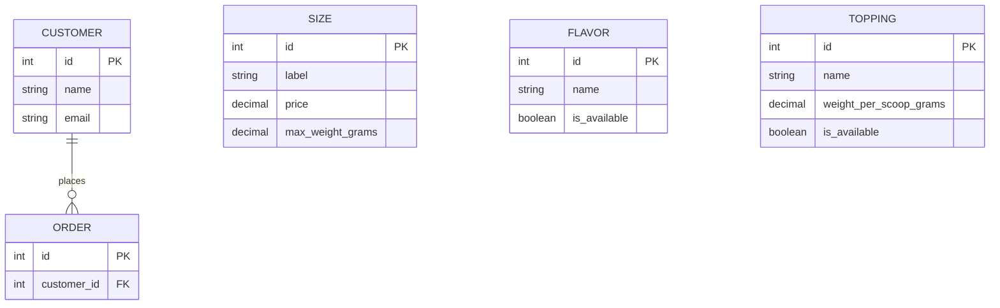
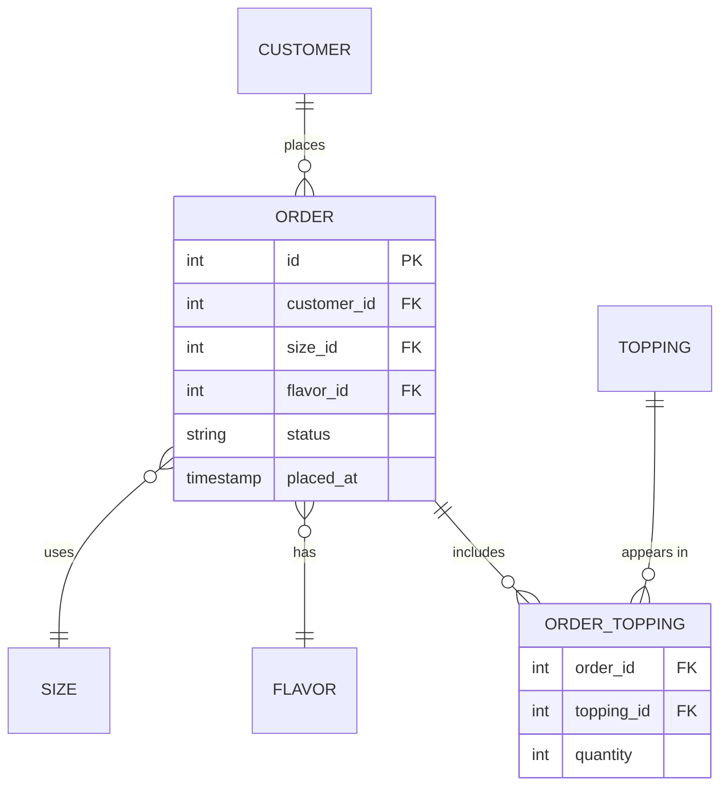
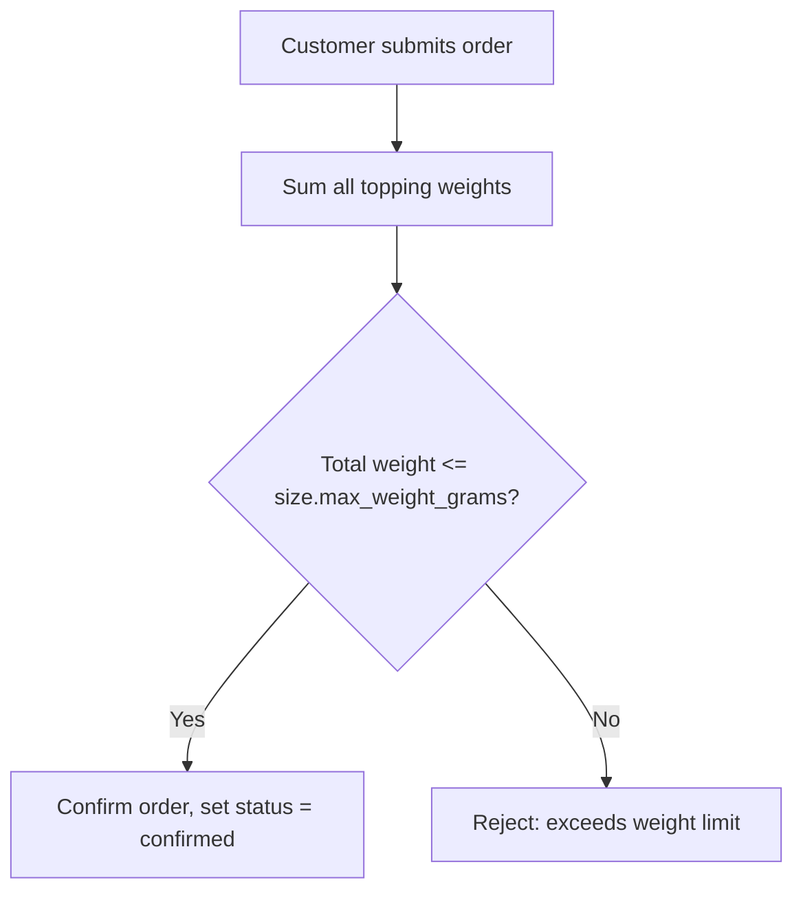
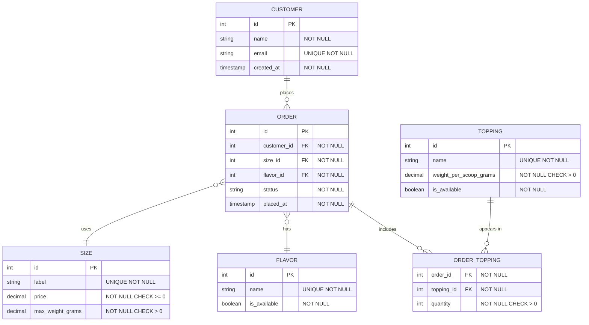

# Design a Yogurt Ordering System — Walkthrough

## How to Approach This

### The Core Insight

This scenario is fundamentally about modeling a **customizable transaction**. The tricky part isn't the basic order — it's the fact that toppings are variable (any number, any combination) and weight-constrained. That constraint means the relationship between Order and Topping can't be a simple list: it needs to carry data of its own.

Most candidates correctly identify the basic entities but miss the junction table or model the weight constraint wrong. Getting both right is what separates a solid answer from a great one.

### The Mental Model

Before drawing any boxes, imagine you're a server at the yogurt shop with a notepad.

What do you write down to remember a customer's order accurately? You'd jot the cup size, the flavor they chose, and then a list of toppings — "2 scoops of strawberries, 1 scoop of mochi." You've instinctively separated _choices from a menu_ (sizes, flavors, toppings as catalog items) from _the order itself_ (the transaction, tied to a specific customer). That separation is where your entities come from.

Now look at "2 scoops of strawberries." That quantity — 2 — isn't a property of strawberries in general. It isn't a property of this order in general either. It's a property of the relationship between _this order_ and _strawberries_. A grocery receipt works the same way: a line item is not an entry in the store's product catalog, and it's not the receipt header. It's the record of this product appearing on this receipt, with its own quantity.

That's your junction table — and that's the insight most candidates miss.

> This is the same principle from the Data Modeling guide: `BookAuthor.role` isn't a property of the Book or the Author. It belongs on the relationship between them. Quantity works exactly the same way here.

### How to Decompose This in an Interview

Before drawing anything, ask yourself three questions:

1. **What are the nouns?** — These become your entities.
2. **How do they connect?** — These determine your relationship types and whether you need junction tables.
3. **What rules must always hold?** — These become your constraints.

Don't start with the API. Don't start with scale. Start with the data shape, because every other decision depends on it.

## Building the Design

### Step 1: Identify the Core Entities

Think of the database as a filing cabinet with labeled drawers. Each drawer holds one kind of thing. Before you can file anything, you need to decide what drawers exist — and what distinguishes a drawer from a note inside one.

The test from the Data Modeling guide: _does this thing need its own identifier, and would you want to look it up independently?_ Size, Flavor, and Topping all pass — you'd want to query "what sizes do we currently offer?" or "which toppings are in stock?" completely independently of any order.

Read the requirements and extract the nouns:

- **Size** — small, medium, large. Has a fixed price and a max weight. Lives on a menu. An entity.
- **Flavor** — the base yogurt type. One per order. Lives on a menu. An entity.
- **Topping** — an add-on. Has a weight per scoop. Lives on a menu. An entity.
- **Order** — the core transaction. Ties a customer to their choices. An entity.

What about Customer? The brief says "customers place orders" but doesn't ask you to design authentication or user management. In an interview, flag this — ask whether to include it. For this design, include a minimal `Customer` table to anchor the order.

:::evaluator
Looking at the requirements, list the entities you'd define for this system. Give 2–3 attributes for each. Which entity is the 'core transaction' that everything else connects to?
:::

### Step 2: Model the Relationships

Now connect the entities. Think of relationships as the **verbs between your nouns** — and the verb tells you the cardinality.

**Customer → Order**: One-to-many. A customer _places_ many orders. Order gets a `customer_id` foreign key.

**Order → Size**: Many-to-one. Many orders can _use_ the same size. Order gets a `size_id` foreign key.

**Order → Flavor**: Many-to-one. An order _has_ exactly one flavor. This constraint is worth calling out — the brief specifies it. Order gets a `flavor_id` foreign key. Making it not-null enforces the rule at the database level.

**Order → Topping**: This is the tricky one. It's **many-to-many** — an order can have multiple toppings, and each topping can appear on many orders.

Many-to-many always requires a junction table. But here's the part most candidates miss: the junction table needs to **carry data of its own**.

Think of a grocery receipt. Each line item is not a product in the store's catalog, and it's not the receipt header — it's the record of _this product appearing on this receipt_, with its own quantity and its own price at time of purchase. `ORDER_TOPPING` is that line item. It needs `quantity` because that's a fact about the relationship between this order and this topping — not a fact about either one in isolation.

:::evaluator
Walk through each relationship in this system. Which one requires a junction table? What columns would that table have, and why does it need to carry its own data?
:::

### Step 3: Model the Weight Constraint

This is the key design challenge. The max weight comes from Size; the actual weight comes from toppings. The data lives in three different places. How do you enforce the rule?

Think of a postal scale. The maximum package weight is stamped on the box — that's `SIZE.max_weight_grams`. Each item you put in the box has its own weight — that's `TOPPING.weight_per_scoop_grams`. The number of items you put in is `ORDER_TOPPING.quantity`. You can't know whether the package is overweight until you load everything in and put it on the scale.

That final check can't happen at box-design time. It can only happen **when the customer is ready to ship** — when they're done adding toppings and explicitly finalize the order. That moment is the `POST /orders/:id/confirm` endpoint.

**Where the data lives:**

- `SIZE.max_weight_grams` — the ceiling for this order
- `TOPPING.weight_per_scoop_grams` — weight contribution per scoop
- `ORDER_TOPPING.quantity` — how many scoops added

**The check:** Before confirming, the application sums `quantity × weight_per_scoop_grams` across all `ORDER_TOPPING` rows for that order and compares against `SIZE.max_weight_grams`.

This is an **application-layer check**, not a database constraint. There's no single-column expression that can sum across related rows — the database can't express this rule natively. That's not a weakness; it's by design. Call it out explicitly: "the weight check lives in the confirm endpoint."

:::evaluator
The maximum allowed weight comes from Size, but the actual weight comes from toppings. Where in the system does this constraint get enforced, and why is it an application-layer check rather than a database constraint?
:::

### Step 4: Add Constraints

With the schema clear, layer in the database-level constraints.

Think of constraints as **building codes**. You could build a house without them, relying on every contractor to remember the rules. But contractors change, migration scripts get written in a hurry, and admin tools bypass the API. Constraints are what get checked even when application code doesn't.

The Data Modeling guide draws this line clearly: _application validation is a UX layer; database constraints are the actual guarantee._

- `ORDER.flavor_id` — **not-null**. Every order must have a flavor. The database won't let you create a flavorless order.
- `ORDER.size_id` — **not-null**. Every order must have a size.
- `CUSTOMER.email` — **unique + not-null**. No duplicate registrations.
- `ORDER_TOPPING.quantity` — **check `> 0`**. Can't add zero scoops. If the customer removes a topping, delete the row — don't set quantity to zero.
- `ORDER_TOPPING (order_id, topping_id)` — **composite unique**. Can't add the same topping twice. If the customer wants more scoops of the same topping, update quantity instead.
- `TOPPING.weight_per_scoop_grams` — **check `> 0`**. Weight must be positive.

:::evaluator
Name two constraints you'd add to the OrderTopping table and explain why each should live at the database level rather than only in application code.
:::

### Step 5: Design the Key API Endpoints

With the schema solid, the API follows naturally. Map each user action to an endpoint.

The key insight is that **"finalizing an order" is a distinct moment** from "adding a topping." Think of it like a retail transaction: the customer is browsing until they're not. The moment they hand over payment is a state transition. Until that moment, nothing is committed.

`POST /orders/:id/confirm` is that moment. It's where:

1. The weight check runs
2. The order status changes from `pending` to `confirmed`
3. The customer can no longer add or remove toppings (enforced by the state machine)

Separating confirmation from topping-addition makes the weight check **explicit, testable, and visible** in your API spec. If you ran the weight check on every topping add, you'd get confusing behavior — rejecting a valid topping because it temporarily exceeds the limit before another topping is removed.

| Method   | Path                              | What it does                                           |
| -------- | --------------------------------- | ------------------------------------------------------ |
| `POST`   | `/orders`                         | Create a new order (size + flavor, status = `pending`) |
| `POST`   | `/orders/:id/toppings`            | Add a topping to an order (with quantity)              |
| `DELETE` | `/orders/:id/toppings/:toppingId` | Remove a topping                                       |
| `POST`   | `/orders/:id/confirm`             | Validate weight, set status = `confirmed`              |
| `PATCH`  | `/orders/:id/status`              | Employee updates status (e.g., `ready`, `completed`)   |
| `GET`    | `/orders/:id`                     | Customer views their order and status                  |

## The Complete Schema

## Trade-offs

### Where to enforce the weight check

**Option A: Application layer only** — The confirm endpoint sums weights and rejects if over limit. Simple to implement and test. But if data can be inserted outside the API (migrations, admin tools), the constraint can be violated silently.

**Option B: Database trigger** — A trigger runs on every `ORDER_TOPPING` insert and rejects the row if it would push the order over its size limit. Consistent across all write paths, but triggers are invisible in application code, hard to test, and create surprising behavior.

**Recommendation:** Application layer check at confirmation time, with a `status` state machine that prevents toppings from being added to confirmed orders. Simple, explicit, and testable — and the state machine closes the "bypass the check" loophole.

### Status field: string enum vs separate table

**String enum** (`pending`, `in_progress`, `ready`, `completed`) is simple and sufficient. A separate `OrderStatus` table adds joins for no benefit at this scale.

**Recommendation:** String enum with a check constraint or the valid values documented in your API spec.

## Common Mistakes

### Mistake 1: Missing the junction table

Adding `topping_id_1`, `topping_id_2`, `topping_id_3` columns to `ORDER`. Now you can't add a fourth topping without a schema migration, and querying all toppings on an order requires checking three separate columns.

**Fix:** `ORDER_TOPPING` junction table, always. As soon as you see many-to-many, the junction table is the answer.

### Mistake 2: Forgetting that `ORDER_TOPPING.quantity` belongs on the junction

Treating quantity as a fixed property of the Topping (a topping always adds one scoop) or a running total on the Order. Neither is right — quantity is a fact about _this topping on this order_, which means it lives on the relationship.

**Fix:** `quantity` lives on `ORDER_TOPPING`. Think of the receipt line item.

### Mistake 3: Storing `ORDER.total_weight` and trying to keep it in sync

Storing a derived value that changes every time a topping is added or removed. Now you have two sources of truth and they can drift.

**Fix:** Compute weight at confirmation time from `ORDER_TOPPING.quantity × TOPPING.weight_per_scoop_grams`. Don't store what can be recomputed.

### Mistake 4: Storing flavor as a string on Order

Setting `ORDER.flavor = 'vanilla'` instead of `ORDER.flavor_id FK → FLAVOR`. Now renaming a flavor requires updating every order row, and you can't add new fields to flavors (like `is_seasonal`) without a bigger migration.

**Fix:** Foreign key to a `FLAVOR` table. Store the ID, not the name.

:::evaluator
Design the API endpoint for a customer finalizing their order. What method and path? What happens at this endpoint that doesn't happen when toppings are added?
:::

## Key Takeaways

1. **The server's notepad is your data model** — before drawing entities, ask what you'd actually write down to remember this transaction accurately. The natural groupings are your entities.
2. **Many-to-many always needs a junction table** — and the junction table often carries relationship-level data (quantity, role, price at time of purchase). Think: receipt line item.
3. **The weight constraint is a business rule, not a database constraint** — enforce it in the application at the right moment (confirmation), not as a trigger nobody can see
4. **The confirm action is a state transition** — separating "add toppings" from "confirm order" makes the weight check explicit, testable, and impossible to bypass
5. **Constraints are building codes** — application validation is a UX layer; database constraints are the actual guarantee, even when code has bugs
6. **Foreign keys over strings** — `flavor_id` gives you a single source of truth and lets the Flavor table evolve independently
