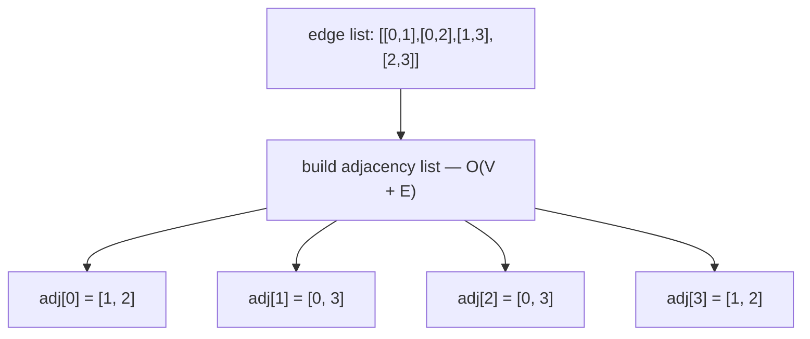
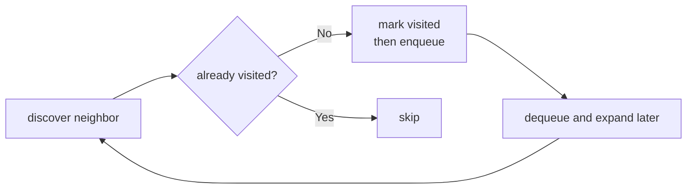
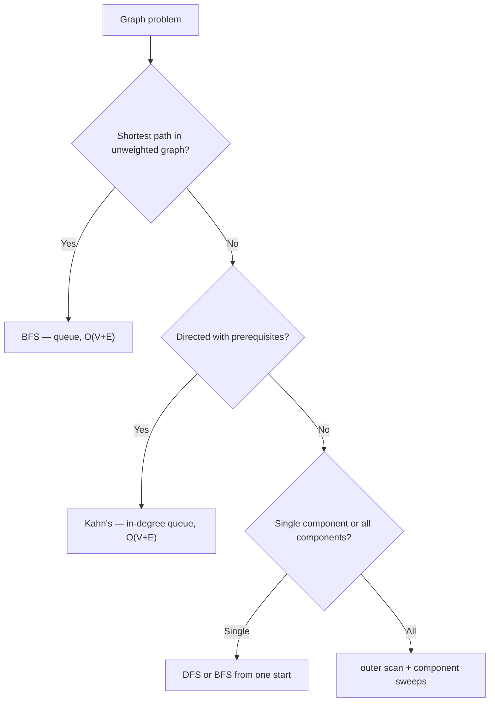
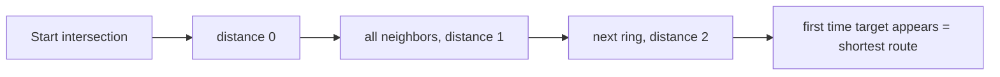
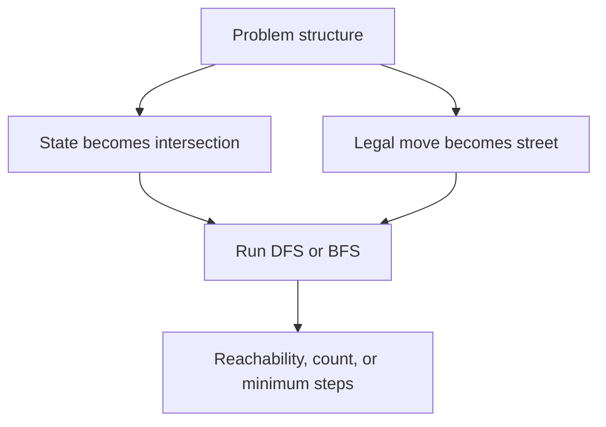
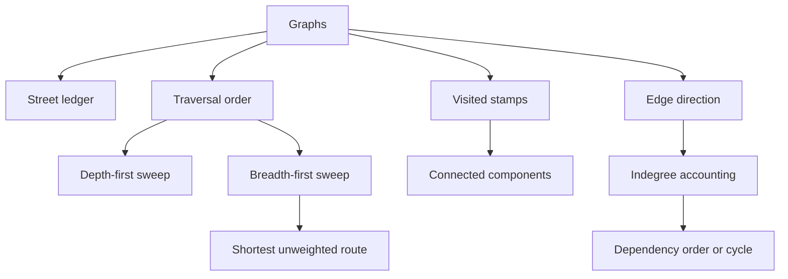
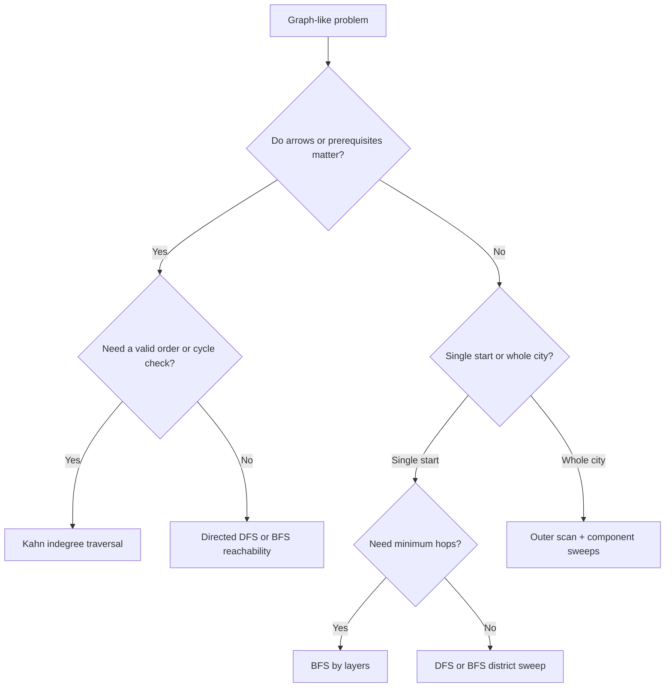

## Overview

Graphs are what arrays and trees turn into once the structure stops being a single line or a single rooted hierarchy. The brute-force trap is easy to fall into: from every intersection, try every road again and again, and the city explodes into repeated work. Graph thinking fixes that by turning the map into a ledger of neighbors plus a rule for when a street has already been accounted for.

You already know how arrays give you indexed storage, how hash maps remember what you have seen, and how stacks and queues change visit order. Graphs fuse those ideas into one system. This guide builds that in three stages: **Draw the Street Ledger**, **Sweep Every District**, and **Respect One-Way Streets**.

## Core Concept & Mental Model

### The City Map

A **node** is the basic unit of a graph — a location, a state, or an entity. Nodes have no inherent order; what matters is what they connect to. In the city map, a node is an intersection: a place you can stand.

An **edge** is a connection between two nodes. Edges can be **undirected** (the connection works both ways) or **directed** (the connection only works one way). In the city map, edges are streets — some run both ways, some are one-way arrows.

A graph is **unweighted** when edges simply exist or don't — every connection is treated equally, with no associated cost. A graph is **weighted** when each edge carries a numeric value (distance, time, fee). Most of the problems in this guide use unweighted graphs. BFS finds the shortest path only in unweighted graphs; weighted shortest paths require different algorithms (Dijkstra's, Bellman-Ford). In the city map, an unweighted street just connects two intersections. A weighted street has a travel time posted on it.

An **adjacency list** is the standard way to store a graph in code. Rather than keeping a flat edge list you have to scan repeatedly, each node gets its own list of neighbors. Building it is O(V + E). Looking up a node's neighbors is O(degree). In the city map, it is the street ledger: each intersection has a list of the streets leaving it.

A **visited set** tracks which nodes have already been processed so traversal never revisits them. Without it, traversal on any graph with cycles loops forever. This is the core invariant that makes graph traversal linear instead of exponential. In the city map, it is the stamp sheet: once an intersection is stamped, you do not send another expedition there.

A **connected component** is a maximal set of nodes where every node is reachable from every other. A graph can have one component or many — if it has more than one, no edge crosses the gap. In the city map, a component is a district: all the intersections reachable from one starting point.

**In-degree** is the count of directed edges pointing *into* a node. Each edge `A → B` adds 1 to B's in-degree. A node with in-degree 0 has no incoming edges — nothing points to it, so nothing needs to happen before it. In dependency graphs (course prerequisites, build steps, install order), a node's in-degree is the number of tasks that must finish before this one can start. Those tasks are its **prerequisites**. When all prerequisites are done, in-degree drops to zero and the node becomes safe to process. In the city map, in-degree counts the one-way arrows arriving at an intersection.

A **queue or stack** determines the order in which nodes are expanded. A queue (FIFO) gives BFS: nodes are processed level by level. A stack (LIFO) gives DFS: traversal goes as deep as possible before backtracking. In the city map, it is the dispatch line — the queue of intersections waiting to be explored.

### The Adjacency List

Graphs are usually given as an edge list: `[[0,1],[1,2],[2,3]]`. Scanning that list every time you need a node's neighbors costs O(E) per lookup. The adjacency list fixes this: build it once in O(V + E), then each neighbor lookup takes O(degree) time.

For an undirected graph, each edge `[a, b]` produces two entries — push `b` into `adj[a]` and push `a` into `adj[b]`. For a directed graph, only push `b` into `adj[from]`.



### Mark at Discovery, Not at Dispatch

The visited set works correctly only if nodes are marked when they enter the queue or stack — at discovery time — not when they are removed and processed. Marking at dispatch (pop time) lets the same node be enqueued once per incoming edge before it is ever processed. On any graph with multiple paths to the same node this produces duplicate work. On cyclic graphs it produces an infinite loop.

The fix is one line earlier: mark the node before pushing it, not after popping it.



### BFS, DFS, and Kahn's Algorithm

The same mark-and-expand loop powers three different traversal algorithms. The difference is the data structure driving the expansion and what the algorithm is trying to answer.

**BFS** uses a queue — FIFO — so it processes nodes in order of their discovery distance from the start. Every node at distance `d` is processed before any node at distance `d + 1`. This level-by-level guarantee is why BFS finds the shortest path in unweighted graphs: the first time a target node is dequeued, it was reached by the fewest possible edges.

**DFS** uses a stack — LIFO, or equivalently recursion — so it goes as deep as possible before backtracking. No shortest-path guarantee, but DFS is simpler to implement recursively and works well for reachability, cycle detection, and connected components.

**Kahn's algorithm** is a BFS variant for directed graphs with dependencies. Rather than starting from one node, it initializes the queue with every node whose in-degree is zero — nothing is blocking them yet. Processing a node decrements the in-degree of each of its neighbors; any neighbor that reaches zero joins the queue. If the total processed count equals `n`, the graph is acyclic and the order is valid. If any nodes remain unprocessed, they are locked in a cycle.



### How I Think Through This

Before I touch code, I ask one question: **am I finding what is reachable from one node, counting or measuring components across the whole graph, or ordering nodes in a directed graph that may have cycles?**

**When the problem gives me a start node:** One BFS or DFS sweep handles it. The only discipline is marking nodes at discovery, not dispatch, and keeping the queue or stack fed until it empties.

**When the graph may have multiple components:** One traversal from one node only covers one component. I add an outer loop over every node: if a node is already visited, skip it; if not, launch a full sweep from it. Each launch means I found a new component.

**When edges are directed and create dependencies:** I shift from reachability thinking to ordering thinking. Nodes with in-degree zero are safe to process immediately — nothing upstream is blocking them. Kahn's algorithm maintains that invariant as it processes each node and decrements the in-degrees of its neighbors. Processed count equal to `n` means the graph is a valid DAG. Less than `n` means a cycle is blocking the remainder.

The building blocks below work through those three situations.

**Scenario 1 — BFS from one start node**

**Graph:** undirected, unweighted
**Input:** `n = 5`, `edges = [[0,1],[0,2],[1,3],[2,3]]`, `start = 0`

Node 4 is isolated — no edges connect it. Nodes 0–3 form one component. Node 3 is reachable by two paths (0→1→3 and 0→2→3), but the visited set ensures node 3 is only enqueued once regardless of how many edges point to it.

:::trace-graph
[
  {
    "nodes": [
      {"id": "A", "label": "0", "x": 18, "y": 48, "tone": "current", "badge": "start"},
      {"id": "B", "label": "1", "x": 40, "y": 24, "tone": "frontier"},
      {"id": "C", "label": "2", "x": 40, "y": 66, "tone": "frontier"},
      {"id": "D", "label": "3", "x": 66, "y": 48, "tone": "default"},
      {"id": "E", "label": "4", "x": 86, "y": 48, "tone": "muted"}
    ],
    "edges": [
      {"from": "A", "to": "B", "tone": "active"},
      {"from": "A", "to": "C", "tone": "active"},
      {"from": "B", "to": "D", "tone": "queued"},
      {"from": "C", "to": "D", "tone": "default"}
    ],
    "facts": [
      {"name": "queue", "value": "[0]", "tone": "orange"},
      {"name": "visited", "value": "{0}", "tone": "green"}
    ],
    "action": "visit",
    "label": "Start at 0. Mark visited, enqueue neighbors 1 and 2."
  },
  {
    "nodes": [
      {"id": "A", "label": "0", "x": 18, "y": 48, "tone": "visited"},
      {"id": "B", "label": "1", "x": 40, "y": 24, "tone": "visited"},
      {"id": "C", "label": "2", "x": 40, "y": 66, "tone": "visited"},
      {"id": "D", "label": "3", "x": 66, "y": 48, "tone": "current", "badge": "once"},
      {"id": "E", "label": "4", "x": 86, "y": 48, "tone": "muted"}
    ],
    "edges": [
      {"from": "A", "to": "B", "tone": "traversed"},
      {"from": "A", "to": "C", "tone": "traversed"},
      {"from": "B", "to": "D", "tone": "active"},
      {"from": "C", "to": "D", "tone": "traversed"}
    ],
    "facts": [
      {"name": "queue", "value": "[3]", "tone": "orange"},
      {"name": "visited", "value": "{0,1,2,3}", "tone": "green"}
    ],
    "action": "mark",
    "label": "3 discovered via 1, marked visited. When 2's neighbor check reaches 3, it is already visited — skip. 3 enters the queue exactly once."
  },
  {
    "nodes": [
      {"id": "A", "label": "0", "x": 18, "y": 48, "tone": "done"},
      {"id": "B", "label": "1", "x": 40, "y": 24, "tone": "done"},
      {"id": "C", "label": "2", "x": 40, "y": 66, "tone": "done"},
      {"id": "D", "label": "3", "x": 66, "y": 48, "tone": "done"},
      {"id": "E", "label": "4", "x": 86, "y": 48, "tone": "muted"}
    ],
    "edges": [
      {"from": "A", "to": "B", "tone": "traversed"},
      {"from": "A", "to": "C", "tone": "traversed"},
      {"from": "B", "to": "D", "tone": "traversed"},
      {"from": "C", "to": "D", "tone": "traversed"}
    ],
    "facts": [
      {"name": "visited", "value": "{0,1,2,3}", "tone": "green"},
      {"name": "unreachable", "value": "{4}", "tone": "muted"}
    ],
    "action": "done",
    "label": "Queue empty. {0,1,2,3} are reachable from node 0. Node 4 is isolated — BFS from 0 never reaches it."
  }
]
:::

**Scenario 2 — Multiple components, outer scan**

**Graph:** undirected, unweighted
**Input:** `n = 5`, `edges = [[0,1],[0,2],[3,4]]`

No edge crosses between {0,1,2} and {3,4} — two separate components. The outer scan loops over all nodes 0–4. It skips any node already visited. When it reaches 3 and finds it unvisited, that signals a new component. Each launch of the inner BFS covers exactly one component.

:::trace-graph
[
  {
    "nodes": [
      {"id": "A", "label": "0", "x": 14, "y": 42, "tone": "current", "badge": "start"},
      {"id": "B", "label": "1", "x": 32, "y": 24, "tone": "default"},
      {"id": "C", "label": "2", "x": 32, "y": 62, "tone": "default"},
      {"id": "D", "label": "3", "x": 64, "y": 42, "tone": "default"},
      {"id": "E", "label": "4", "x": 80, "y": 58, "tone": "default"}
    ],
    "edges": [
      {"from": "A", "to": "B", "tone": "default"},
      {"from": "A", "to": "C", "tone": "default"},
      {"from": "D", "to": "E", "tone": "default"}
    ],
    "facts": [
      {"name": "districts", "value": 1, "tone": "purple"},
      {"name": "queue", "value": "[0]", "tone": "orange"},
      {"name": "visited", "value": "{0}", "tone": "green"}
    ],
    "action": "queue",
    "label": "Outer scan starts at 0. It's unvisited — district 1 begins. Mark 0 and enqueue it."
  },
  {
    "nodes": [
      {"id": "A", "label": "0", "x": 14, "y": 42, "tone": "visited"},
      {"id": "B", "label": "1", "x": 32, "y": 24, "tone": "frontier"},
      {"id": "C", "label": "2", "x": 32, "y": 62, "tone": "frontier"},
      {"id": "D", "label": "3", "x": 64, "y": 42, "tone": "default"},
      {"id": "E", "label": "4", "x": 80, "y": 58, "tone": "default"}
    ],
    "edges": [
      {"from": "A", "to": "B", "tone": "active"},
      {"from": "A", "to": "C", "tone": "active"},
      {"from": "D", "to": "E", "tone": "default"}
    ],
    "facts": [
      {"name": "districts", "value": 1, "tone": "purple"},
      {"name": "queue", "value": "[1, 2]", "tone": "orange"},
      {"name": "visited", "value": "{0, 1, 2}", "tone": "green"}
    ],
    "action": "expand",
    "label": "Dequeue 0. Neighbors 1 and 2 are unvisited — mark both and enqueue. The visited set ensures neither can be enqueued again."
  },
  {
    "nodes": [
      {"id": "A", "label": "0", "x": 14, "y": 42, "tone": "done"},
      {"id": "B", "label": "1", "x": 32, "y": 24, "tone": "done"},
      {"id": "C", "label": "2", "x": 32, "y": 62, "tone": "done"},
      {"id": "D", "label": "3", "x": 64, "y": 42, "tone": "default"},
      {"id": "E", "label": "4", "x": 80, "y": 58, "tone": "default"}
    ],
    "edges": [
      {"from": "A", "to": "B", "tone": "traversed"},
      {"from": "A", "to": "C", "tone": "traversed"},
      {"from": "D", "to": "E", "tone": "default"}
    ],
    "facts": [
      {"name": "districts", "value": 1, "tone": "purple"},
      {"name": "queue", "value": "[]", "tone": "orange"},
      {"name": "visited", "value": "{0, 1, 2}", "tone": "green"}
    ],
    "action": "mark",
    "label": "Dequeue 1 and 2. Each has only node 0 as a neighbor, already visited — skip. Queue empties. Component {0,1,2} is complete."
  },
  {
    "nodes": [
      {"id": "A", "label": "0", "x": 14, "y": 42, "tone": "done"},
      {"id": "B", "label": "1", "x": 32, "y": 24, "tone": "done"},
      {"id": "C", "label": "2", "x": 32, "y": 62, "tone": "done"},
      {"id": "D", "label": "3", "x": 64, "y": 42, "tone": "current", "badge": "new"},
      {"id": "E", "label": "4", "x": 80, "y": 58, "tone": "default"}
    ],
    "edges": [
      {"from": "A", "to": "B", "tone": "traversed"},
      {"from": "A", "to": "C", "tone": "traversed"},
      {"from": "D", "to": "E", "tone": "default"}
    ],
    "facts": [
      {"name": "districts", "value": 2, "tone": "purple"},
      {"name": "outer scan", "value": "first unstamped = 3", "tone": "blue"},
      {"name": "queue", "value": "[3]", "tone": "orange"}
    ],
    "action": "queue",
    "label": "Outer scan resumes: 1 and 2 are visited, skip. Node 3 is unvisited — second district begins. Mark 3 and enqueue."
  },
  {
    "nodes": [
      {"id": "A", "label": "0", "x": 14, "y": 42, "tone": "done"},
      {"id": "B", "label": "1", "x": 32, "y": 24, "tone": "done"},
      {"id": "C", "label": "2", "x": 32, "y": 62, "tone": "done"},
      {"id": "D", "label": "3", "x": 64, "y": 42, "tone": "visited"},
      {"id": "E", "label": "4", "x": 80, "y": 58, "tone": "frontier"}
    ],
    "edges": [
      {"from": "A", "to": "B", "tone": "traversed"},
      {"from": "A", "to": "C", "tone": "traversed"},
      {"from": "D", "to": "E", "tone": "active"}
    ],
    "facts": [
      {"name": "districts", "value": 2, "tone": "purple"},
      {"name": "queue", "value": "[4]", "tone": "orange"},
      {"name": "visited", "value": "{0,1,2,3,4}", "tone": "green"}
    ],
    "action": "expand",
    "label": "Dequeue 3. Neighbor 4 is unvisited — mark and enqueue. All 5 nodes are now stamped."
  },
  {
    "nodes": [
      {"id": "A", "label": "0", "x": 14, "y": 42, "tone": "done"},
      {"id": "B", "label": "1", "x": 32, "y": 24, "tone": "done"},
      {"id": "C", "label": "2", "x": 32, "y": 62, "tone": "done"},
      {"id": "D", "label": "3", "x": 64, "y": 42, "tone": "done"},
      {"id": "E", "label": "4", "x": 80, "y": 58, "tone": "done"}
    ],
    "edges": [
      {"from": "A", "to": "B", "tone": "traversed"},
      {"from": "A", "to": "C", "tone": "traversed"},
      {"from": "D", "to": "E", "tone": "traversed"}
    ],
    "facts": [
      {"name": "final districts", "value": 2, "tone": "green"}
    ],
    "action": "done",
    "label": "Dequeue 4. Neighbor 3 is already visited — skip. Queue empties. Outer scan finds no more unvisited nodes. 2 districts total."
  }
]
:::

**Scenario 3 — Directed graph, Kahn's topological sort**

**Graph:** directed, unweighted
**Input:** `n = 4`, `edges = [[0,1],[0,2],[1,3],[2,3]]` (directed: `[from, to]`)

To start, count how many arrows point *into* each node: node 0 has none, nodes 1 and 2 each have one, and node 3 has two. Kahn's puts every node with zero incoming arrows into the queue first — that's only node 0, since nothing needs to happen before it.

When node 0 is processed, its two outgoing arrows are removed. That frees nodes 1 and 2 — they now have zero incoming arrows and join the queue. Once both are processed, node 3's two incoming arrows are gone and it becomes the last node ready to go.

The trace labels the nodes I, L, B, and D (Install, Lint, Build, Deploy) — a realistic CI pipeline: I must run first to get dependencies in place, then L and B can run in parallel since neither depends on the other, and D only ships once both pass.

The cycle check comes from what happens when the queue runs dry too early. If the graph still has unprocessed nodes but none of them have `indegree === 0`, then none are safe to process next. That can only happen if the remaining nodes are still blocking one another through a directed loop. In the failure trace below, node 0 is processed, but nodes 1, 2, and 3 stay stuck with incoming arrows from each other. The queue empties, `processed` stops at 1, and `processed !== n` becomes the proof that a cycle survived.

:::trace-graph
[
  {
    "nodes": [
      {"id": "Install", "label": "I", "x": 16, "y": 50, "tone": "frontier", "badge": "0 in"},
      {"id": "Lint", "label": "L", "x": 40, "y": 26, "tone": "default", "badge": "1 in"},
      {"id": "Build", "label": "B", "x": 40, "y": 66, "tone": "default", "badge": "1 in"},
      {"id": "Deploy", "label": "D", "x": 72, "y": 50, "tone": "default", "badge": "2 in"}
    ],
    "edges": [
      {"from": "Install", "to": "Lint", "tone": "queued", "directed": true},
      {"from": "Install", "to": "Build", "tone": "queued", "directed": true},
      {"from": "Lint", "to": "Deploy", "tone": "default", "directed": true},
      {"from": "Build", "to": "Deploy", "tone": "default", "directed": true}
    ],
    "facts": [
      {"name": "ready now", "value": "[Install]", "tone": "orange"},
      {"name": "remaining arrows", "value": 4, "tone": "blue"}
    ],
    "action": "queue",
    "label": "Install has no incoming arrows — nothing blocks it. The CI pipeline must start here."
  },
  {
    "nodes": [
      {"id": "Install", "label": "I", "x": 16, "y": 50, "tone": "visited"},
      {"id": "Lint", "label": "L", "x": 40, "y": 26, "tone": "frontier", "badge": "0 in"},
      {"id": "Build", "label": "B", "x": 40, "y": 66, "tone": "frontier", "badge": "0 in"},
      {"id": "Deploy", "label": "D", "x": 72, "y": 50, "tone": "default", "badge": "2 in"}
    ],
    "edges": [
      {"from": "Install", "to": "Lint", "tone": "traversed", "directed": true},
      {"from": "Install", "to": "Build", "tone": "traversed", "directed": true},
      {"from": "Lint", "to": "Deploy", "tone": "queued", "directed": true},
      {"from": "Build", "to": "Deploy", "tone": "queued", "directed": true}
    ],
    "facts": [
      {"name": "ready now", "value": "[Lint, Build]", "tone": "orange"},
      {"name": "order so far", "value": "[Install]", "tone": "green"}
    ],
    "action": "expand",
    "label": "Processing Install removes its arrows. Lint and Build both drop to zero incoming arrows — neither depends on the other, so they can run in parallel."
  },
  {
    "nodes": [
      {"id": "Install", "label": "I", "x": 16, "y": 50, "tone": "done"},
      {"id": "Lint", "label": "L", "x": 40, "y": 26, "tone": "done"},
      {"id": "Build", "label": "B", "x": 40, "y": 66, "tone": "done"},
      {"id": "Deploy", "label": "D", "x": 72, "y": 50, "tone": "answer", "badge": "0 in"}
    ],
    "edges": [
      {"from": "Install", "to": "Lint", "tone": "traversed", "directed": true},
      {"from": "Install", "to": "Build", "tone": "traversed", "directed": true},
      {"from": "Lint", "to": "Deploy", "tone": "traversed", "directed": true},
      {"from": "Build", "to": "Deploy", "tone": "traversed", "directed": true}
    ],
    "facts": [
      {"name": "valid order", "value": "[Install, Lint, Build, Deploy]", "tone": "green"}
    ],
    "action": "done",
    "label": "Once Lint and Build finish, Deploy drops to zero and ships. All nodes processed — no dependency cycle."
  }
]
:::

---

## Building Blocks: Progressive Learning

### Level 1: Adjacency List and Single-Source BFS

The input is an edge list — every connection as a pair `[a, b]`. Scanning the full edge list every time you need a node's neighbors costs O(E) per step. For a graph with ten thousand edges, that's ten thousand scans repeated for every node you visit. The adjacency list converts this once: walk every edge and record each endpoint in the other's neighbor bucket. Build cost is O(V + E); after that, each neighbor lookup is O(degree). In the city map, this is the street ledger — each intersection already knows its own roads.

Graph traversal is local: at any node, the only thing that matters is its immediate neighbors. The adjacency list delivers those in constant time. The other essential piece is the visited set — a boolean array, one slot per node. Without it, any graph with a cycle would loop forever, re-enqueuing the same nodes indefinitely. The visited set makes each node a one-time entry: mark it the moment you discover it, and any future arrival is a no-op.

To run a BFS, build the adjacency list, allocate the visited array, push the start node, and mark it visited immediately — before the loop, not inside it. Then loop: dequeue a node, and for each neighbor check the visited array. If unvisited, mark it and enqueue it right there. That one-line-earlier mark is what keeps duplicates out of the queue. When the queue empties, every node that was marked is reachable from the start.

`n = 5`, `edges = [[0,1],[0,2],[1,3],[2,3],[3,4]]`, `start = 0`

:::trace-graph
[
  {
    "nodes": [
      {"id": "0", "label": "0", "x": 16, "y": 50, "tone": "current", "badge": "start"},
      {"id": "1", "label": "1", "x": 38, "y": 24, "tone": "frontier"},
      {"id": "2", "label": "2", "x": 38, "y": 66, "tone": "frontier"},
      {"id": "3", "label": "3", "x": 64, "y": 50, "tone": "default"},
      {"id": "4", "label": "4", "x": 86, "y": 50, "tone": "default"}
    ],
    "edges": [
      {"from": "0", "to": "1", "tone": "active"},
      {"from": "0", "to": "2", "tone": "active"},
      {"from": "1", "to": "3", "tone": "default"},
      {"from": "2", "to": "3", "tone": "default"},
      {"from": "3", "to": "4", "tone": "default"}
    ],
    "facts": [
      {"name": "street ledger", "value": "0:[1,2]", "tone": "blue"},
      {"name": "dispatch line", "value": "[0]", "tone": "orange"}
    ],
    "action": "visit",
    "label": "The ledger turns road scanning into neighbor lookup. From 0, the next legal expansions are 1 and 2."
  },
  {
    "nodes": [
      {"id": "0", "label": "0", "x": 16, "y": 50, "tone": "visited"},
      {"id": "1", "label": "1", "x": 38, "y": 24, "tone": "visited"},
      {"id": "2", "label": "2", "x": 38, "y": 66, "tone": "visited"},
      {"id": "3", "label": "3", "x": 64, "y": 50, "tone": "current", "badge": "new"},
      {"id": "4", "label": "4", "x": 86, "y": 50, "tone": "default"}
    ],
    "edges": [
      {"from": "0", "to": "1", "tone": "traversed"},
      {"from": "0", "to": "2", "tone": "traversed"},
      {"from": "1", "to": "3", "tone": "active"},
      {"from": "2", "to": "3", "tone": "traversed"},
      {"from": "3", "to": "4", "tone": "queued"}
    ],
    "facts": [
      {"name": "stamped", "value": "{0,1,2,3}", "tone": "green"},
      {"name": "dispatch line", "value": "[3]", "tone": "orange"}
    ],
    "action": "mark",
    "label": "Intersection 3 is stamped the first time it is discovered. The second road into 3 does not create duplicate work."
  },
  {
    "nodes": [
      {"id": "0", "label": "0", "x": 16, "y": 50, "tone": "done"},
      {"id": "1", "label": "1", "x": 38, "y": 24, "tone": "done"},
      {"id": "2", "label": "2", "x": 38, "y": 66, "tone": "done"},
      {"id": "3", "label": "3", "x": 64, "y": 50, "tone": "done"},
      {"id": "4", "label": "4", "x": 86, "y": 50, "tone": "answer", "badge": "last"}
    ],
    "edges": [
      {"from": "0", "to": "1", "tone": "traversed"},
      {"from": "0", "to": "2", "tone": "traversed"},
      {"from": "1", "to": "3", "tone": "traversed"},
      {"from": "2", "to": "3", "tone": "traversed"},
      {"from": "3", "to": "4", "tone": "traversed"}
    ],
    "facts": [
      {"name": "reachable district", "value": "{0,1,2,3,4}", "tone": "green"}
    ],
    "action": "done",
    "label": "When the dispatch line empties, the stamped set is exactly the reachable district from 0."
  }
]
:::

#### **Exercise 1**

Every step of graph traversal needs to know a node's neighbors. Scanning the full edge list each time costs O(E) per lookup — on a graph with many nodes, that compounds traversal from O(V + E) to O(V × E). The adjacency list eliminates that: build it once in O(V + E), and each neighbor lookup costs only O(degree).

You're given `n` nodes (labeled `0` to `n-1`) and a flat edge list like `[[0,1],[0,2],[1,3]]`. The goal is a structure where `adj[node]` gives you all of that node's neighbors directly, without scanning the whole edge list.

Start by allocating `n` empty arrays — one bucket per node:

```typescript
const adj: number[][] = Array.from({ length: n }, () => []);
```

Then walk every edge. For each `[a, b]`, `b` is a neighbor of `a`. Because this graph is undirected, the reverse is also true. What does the push into `adj[b]` look like?

:::stackblitz{step=1 total=3 exercises="step1-exercise1-problem.ts" solutions="step1-exercise1-solution.ts"}

#### **Exercise 2**

Reachability is the foundation of graph problems: "are these two users connected?", "can this packet reach its destination?", "which cells belong to this island?" all reduce to the same sweep. The visited set and the mark-at-discovery rule are what keep that sweep from looping forever on cyclic graphs — getting those two invariants right is the foundation everything else in this guide builds on.

You're given `n` nodes, a road list, and a `start` intersection. The goal is to return every intersection reachable from `start`.

The BFS loop needs three pieces of state before it starts: a visited array, a queue seeded with `start`, and a result collector. The order of operations at setup matters — start must be marked visited before the loop, not inside it.

```typescript
const visited = new Array(n).fill(false);
const queue = [start];
visited[start] = true;  // mark at enqueue time, not dequeue
const result: number[] = [];
```

The loop itself has a fixed shape: pull one node off the front, record it, then look at its neighbors. You do not need to decide what to do with neighbors yet — just get the loop running first.

```typescript
while (queue.length > 0) {
  const node = queue.shift();
  result.push(node);
  // expand neighbors here
}
```

For each neighbor, the question is one check: has it been visited? If not, two things happen — in a specific order. What is the right order, and why does it matter?

:::stackblitz{step=1 total=3 exercises="step1-exercise2-problem.ts" solutions="step1-exercise2-solution.ts"}

#### **Exercise 3**

"List everything reachable" rarely appears in interviews on its own — "can I get from A to B?" is the real question behind routing, prerequisite checking, and access control. Early termination also matters: once the target is found, continuing the sweep wastes time that compounds badly on large graphs.

You're given `n` nodes, a road list, a `start` intersection, and a `target` — the destination you want to reach. The goal is to return `true` if `target` is reachable from `start`, `false` otherwise.

The loop shape is identical to Exercise 2. One line is added: after dequeuing a node, check whether it is the target before expanding neighbors. If it matches, you are done.

```typescript
const node = queue.shift();
if (node === target) return true;
// neighbor expansion same as Exercise 2
```

If the queue empties without a match, what do you return?

:::stackblitz{step=1 total=3 exercises="step1-exercise3-problem.ts" solutions="step1-exercise3-solution.ts"}

> **Mental anchor**: One district sweep needs three things only: a street ledger, a stamp sheet, and a rule that every intersection enters the line once.

**→ Bridge to Level 2**: Level 1 assumes the city is one connected place from the chosen start. The moment the map contains multiple disconnected districts, one perfect sweep is still only one district, so you need an outer scan that knows when to launch a fresh traversal.

### Level 2: Connected Components

Level 1 covers every node reachable from a single start — one component, fully swept. But a disconnected graph has multiple components, and BFS from node 0 never reaches the others. You need a way to cover every component exactly once.

The solution is an outer loop over every node `0` to `n - 1`, paired with the same visited set from Level 1. When the outer loop reaches a node that is already marked, a prior BFS already covered its entire component — skip it. When it reaches a node that is still unvisited, that node belongs to a component no sweep has touched yet. Launch a full BFS from it, let it mark every reachable node, then continue the outer loop. The visited set is shared across all launches, so no node is ever swept twice. Each launch corresponds to exactly one component — count it.

`n = 6`, `edges = [[0,1],[1,2],[3,4]]`

:::trace-graph
[
  {
    "nodes": [
      {"id": "0", "label": "0", "x": 14, "y": 42, "tone": "current", "badge": "start"},
      {"id": "1", "label": "1", "x": 30, "y": 26, "tone": "default"},
      {"id": "2", "label": "2", "x": 30, "y": 58, "tone": "default"},
      {"id": "3", "label": "3", "x": 58, "y": 42, "tone": "default"},
      {"id": "4", "label": "4", "x": 76, "y": 42, "tone": "default"},
      {"id": "5", "label": "5", "x": 88, "y": 65, "tone": "default"}
    ],
    "edges": [
      {"from": "0", "to": "1", "tone": "default"},
      {"from": "1", "to": "2", "tone": "default"},
      {"from": "3", "to": "4", "tone": "default"}
    ],
    "facts": [
      {"name": "districts", "value": 1, "tone": "purple"},
      {"name": "queue", "value": "[0]", "tone": "orange"},
      {"name": "visited", "value": "{0}", "tone": "green"}
    ],
    "action": "queue",
    "label": "Outer scan starts at 0. It's unvisited — district 1 begins. Mark and enqueue."
  },
  {
    "nodes": [
      {"id": "0", "label": "0", "x": 14, "y": 42, "tone": "visited"},
      {"id": "1", "label": "1", "x": 30, "y": 26, "tone": "frontier"},
      {"id": "2", "label": "2", "x": 30, "y": 58, "tone": "default"},
      {"id": "3", "label": "3", "x": 58, "y": 42, "tone": "default"},
      {"id": "4", "label": "4", "x": 76, "y": 42, "tone": "default"},
      {"id": "5", "label": "5", "x": 88, "y": 65, "tone": "default"}
    ],
    "edges": [
      {"from": "0", "to": "1", "tone": "active"},
      {"from": "1", "to": "2", "tone": "default"},
      {"from": "3", "to": "4", "tone": "default"}
    ],
    "facts": [
      {"name": "districts", "value": 1, "tone": "purple"},
      {"name": "queue", "value": "[1]", "tone": "orange"},
      {"name": "visited", "value": "{0, 1}", "tone": "green"}
    ],
    "action": "expand",
    "label": "Dequeue 0. Neighbor 1 is unvisited — mark and enqueue."
  },
  {
    "nodes": [
      {"id": "0", "label": "0", "x": 14, "y": 42, "tone": "done"},
      {"id": "1", "label": "1", "x": 30, "y": 26, "tone": "visited"},
      {"id": "2", "label": "2", "x": 30, "y": 58, "tone": "frontier"},
      {"id": "3", "label": "3", "x": 58, "y": 42, "tone": "default"},
      {"id": "4", "label": "4", "x": 76, "y": 42, "tone": "default"},
      {"id": "5", "label": "5", "x": 88, "y": 65, "tone": "default"}
    ],
    "edges": [
      {"from": "0", "to": "1", "tone": "traversed"},
      {"from": "1", "to": "2", "tone": "active"},
      {"from": "3", "to": "4", "tone": "default"}
    ],
    "facts": [
      {"name": "districts", "value": 1, "tone": "purple"},
      {"name": "queue", "value": "[2]", "tone": "orange"},
      {"name": "visited", "value": "{0, 1, 2}", "tone": "green"}
    ],
    "action": "expand",
    "label": "Dequeue 1. Neighbor 0 already visited — skip. Neighbor 2 is unvisited — mark and enqueue."
  },
  {
    "nodes": [
      {"id": "0", "label": "0", "x": 14, "y": 42, "tone": "done"},
      {"id": "1", "label": "1", "x": 30, "y": 26, "tone": "done"},
      {"id": "2", "label": "2", "x": 30, "y": 58, "tone": "done"},
      {"id": "3", "label": "3", "x": 58, "y": 42, "tone": "current", "badge": "new"},
      {"id": "4", "label": "4", "x": 76, "y": 42, "tone": "default"},
      {"id": "5", "label": "5", "x": 88, "y": 65, "tone": "default"}
    ],
    "edges": [
      {"from": "0", "to": "1", "tone": "traversed"},
      {"from": "1", "to": "2", "tone": "traversed"},
      {"from": "3", "to": "4", "tone": "default"}
    ],
    "facts": [
      {"name": "districts", "value": 2, "tone": "purple"},
      {"name": "outer scan", "value": "first unstamped = 3", "tone": "blue"},
      {"name": "queue", "value": "[3]", "tone": "orange"}
    ],
    "action": "queue",
    "label": "Dequeue 2. Neighbor 1 already visited — skip. Queue empties. Component {0,1,2} done. Outer scan advances past 1 and 2, finds 3 unvisited — district 2 begins."
  },
  {
    "nodes": [
      {"id": "0", "label": "0", "x": 14, "y": 42, "tone": "done"},
      {"id": "1", "label": "1", "x": 30, "y": 26, "tone": "done"},
      {"id": "2", "label": "2", "x": 30, "y": 58, "tone": "done"},
      {"id": "3", "label": "3", "x": 58, "y": 42, "tone": "done"},
      {"id": "4", "label": "4", "x": 76, "y": 42, "tone": "done"},
      {"id": "5", "label": "5", "x": 88, "y": 65, "tone": "current", "badge": "solo"}
    ],
    "edges": [
      {"from": "0", "to": "1", "tone": "traversed"},
      {"from": "1", "to": "2", "tone": "traversed"},
      {"from": "3", "to": "4", "tone": "traversed"}
    ],
    "facts": [
      {"name": "districts", "value": 3, "tone": "purple"},
      {"name": "outer scan", "value": "first unstamped = 5", "tone": "blue"}
    ],
    "action": "expand",
    "label": "Dequeue 3, discover 4. Dequeue 4, neighbor 3 already visited. Component {3,4} done. Outer scan finds 5 unvisited — district 3. Node 5 has no roads, but it is still its own district."
  },
  {
    "nodes": [
      {"id": "0", "label": "0", "x": 14, "y": 42, "tone": "done"},
      {"id": "1", "label": "1", "x": 30, "y": 26, "tone": "done"},
      {"id": "2", "label": "2", "x": 30, "y": 58, "tone": "done"},
      {"id": "3", "label": "3", "x": 58, "y": 42, "tone": "done"},
      {"id": "4", "label": "4", "x": 76, "y": 42, "tone": "done"},
      {"id": "5", "label": "5", "x": 88, "y": 65, "tone": "answer", "badge": "3"}
    ],
    "edges": [
      {"from": "0", "to": "1", "tone": "traversed"},
      {"from": "1", "to": "2", "tone": "traversed"},
      {"from": "3", "to": "4", "tone": "traversed"}
    ],
    "facts": [
      {"name": "final districts", "value": 3, "tone": "green"}
    ],
    "action": "done",
    "label": "Outer scan finds no more unvisited nodes. 3 districts total — including the isolated intersection."
  }
]
:::

> [!TIP]
> In disconnected-graph problems, the inner traversal does not change. Almost every bug comes from the outer scan: either forgetting to skip stamped intersections or forgetting that an isolated node is still a full district.

#### **Exercise 1**

Real graphs are almost never fully connected. Social networks have isolated users, road maps have disconnected regions, dependency graphs have independent modules. A single BFS from one node answers one island and silently ignores the rest — no error, just a quiet miss. The outer scan is what ensures every node gets visited exactly once across all components, not just the one you started on.

You're given `n` nodes and an edge list that may describe multiple disconnected components. The goal is to count how many components exist.

The BFS from Level 1 does not change. What changes is the frame around it — an outer loop that scans every node and decides whether to launch a fresh sweep:

```typescript
for (let i = 0; i < n; i++) {
  if (visited[i]) continue;  // already covered by a previous sweep
  // what happens when you find an unvisited node?
}
```

Each time you reach an unvisited node, that is a new component. Launch the full BFS from it. The BFS will mark everything reachable, so the next iteration of the outer loop will skip all of those nodes automatically.

:::stackblitz{step=2 total=3 exercises="step2-exercise1-problem.ts" solutions="step2-exercise1-solution.ts"}

#### **Exercise 2**

Knowing a component exists tells you nothing about its size — and size is what most real questions care about. "What is the largest island?", "which subnet has the most machines?", "how big is the biggest cluster?" all need a count per component, not just a total. Measuring during the sweep rather than after is the pattern for any per-component metric: it costs nothing extra since you're already visiting every node.

You're given the same input as Exercise 1. The goal is to return the size of the largest component.

Add a counter inside the BFS and increment it each time you dequeue a node — dequeue, not enqueue, because each node is processed exactly once.

```typescript
let size = 0;
while (queue.length > 0) {
  const node = queue.shift();
  size++;  // count here — after pulling from queue
  // neighbor expansion same as Level 1
}
```

After each sweep finishes, how do you decide whether this component is larger than any you've seen before?

:::stackblitz{step=2 total=3 exercises="step2-exercise2-problem.ts" solutions="step2-exercise2-solution.ts"}

#### **Exercise 3**

A single running maximum tells you how big the biggest group is, but it loses the rest of the picture. Problems that ask "return all component sizes sorted", "how many groups have at least k members?", or "are all components the same size?" need the full distribution — a max discards that. Collecting all sizes gives you the flexibility to answer any of those questions after a single pass.

You're given the same input as Exercise 2. Instead of returning the largest size, return all component sizes sorted in ascending order.

The outer loop and size-counting BFS are unchanged. What replaces `largest = Math.max(largest, size)`?

:::stackblitz{step=2 total=3 exercises="step2-exercise3-problem.ts" solutions="step2-exercise3-solution.ts"}

> **Mental anchor**: A new district is not "an unstamped road," it is "the first unstamped intersection the outer scan finds."

**→ Bridge to Level 3**: Level 2 still treats every road as symmetric. Once streets become one-way, reachability is no longer enough. The map starts encoding prerequisites, and the next question becomes which intersections are safe to dispatch before others.

### Level 3: Directed Graphs and Topological Order

Level 2 handled undirected graphs — edges that work both ways. Directed graphs break that symmetry: an edge `A → B` means B depends on A, not the reverse. BFS reachability no longer answers the useful question: in what order can you safely process all nodes respecting those dependencies? Scanning every edge on every pass to check "is this node unblocked yet?" is O(E) per node at worst — the same repeated-scan problem the adjacency list was built to avoid.

A node is safe to process the moment all of its predecessors have been processed. In-degree is the count of edges currently pointing into a node — think of it as a prerequisites-remaining counter. When it reaches zero, the node is unblocked. Each time you process a node, you consume one incoming arrow for each of its neighbors, decrementing their counts. Any neighbor that hits zero joins the ready queue immediately.

The trace below shows the prerequisite countdown for node 3 across `edges = [[0,1],[0,2],[1,3],[2,3]]`. Nodes 0, 1, and 2 have already been seeded or freed by earlier steps — watch how node 3's in-degree drops each time a predecessor finishes.

:::trace-graph
[
  {
    "nodes": [
      {"id": "0", "label": "0", "x": 12, "y": 50, "tone": "done"},
      {"id": "1", "label": "1", "x": 40, "y": 24, "tone": "current", "badge": "processing"},
      {"id": "2", "label": "2", "x": 40, "y": 72, "tone": "frontier"},
      {"id": "3", "label": "3", "x": 78, "y": 50, "tone": "default", "badge": "in: 2"}
    ],
    "edges": [
      {"from": "0", "to": "1", "tone": "traversed", "directed": true},
      {"from": "0", "to": "2", "tone": "traversed", "directed": true},
      {"from": "1", "to": "3", "tone": "active", "directed": true},
      {"from": "2", "to": "3", "tone": "default", "directed": true}
    ],
    "facts": [
      {"name": "indegree[3]", "value": 2, "tone": "blue"},
      {"name": "queue", "value": "[1, 2]", "tone": "orange"}
    ],
    "action": "visit",
    "label": "Node 1 is processing. Both arrows into node 3 are still pending — it needs two predecessors to finish before it can start."
  },
  {
    "nodes": [
      {"id": "0", "label": "0", "x": 12, "y": 50, "tone": "done"},
      {"id": "1", "label": "1", "x": 40, "y": 24, "tone": "done"},
      {"id": "2", "label": "2", "x": 40, "y": 72, "tone": "current", "badge": "processing"},
      {"id": "3", "label": "3", "x": 78, "y": 50, "tone": "default", "badge": "in: 1"}
    ],
    "edges": [
      {"from": "0", "to": "1", "tone": "traversed", "directed": true},
      {"from": "0", "to": "2", "tone": "traversed", "directed": true},
      {"from": "1", "to": "3", "tone": "traversed", "directed": true},
      {"from": "2", "to": "3", "tone": "active", "directed": true}
    ],
    "facts": [
      {"name": "indegree[3]", "value": 1, "tone": "blue"},
      {"name": "queue", "value": "[2]", "tone": "orange"}
    ],
    "action": "mark",
    "label": "Node 1 done — indegree[3] drops from 2 to 1. One prerequisite cleared, one remaining. Node 2 now processing."
  },
  {
    "nodes": [
      {"id": "0", "label": "0", "x": 12, "y": 50, "tone": "done"},
      {"id": "1", "label": "1", "x": 40, "y": 24, "tone": "done"},
      {"id": "2", "label": "2", "x": 40, "y": 72, "tone": "done"},
      {"id": "3", "label": "3", "x": 78, "y": 50, "tone": "frontier", "badge": "in: 0"}
    ],
    "edges": [
      {"from": "0", "to": "1", "tone": "traversed", "directed": true},
      {"from": "0", "to": "2", "tone": "traversed", "directed": true},
      {"from": "1", "to": "3", "tone": "traversed", "directed": true},
      {"from": "2", "to": "3", "tone": "traversed", "directed": true}
    ],
    "facts": [
      {"name": "indegree[3]", "value": 0, "tone": "green"},
      {"name": "status", "value": "ready — joins queue", "tone": "green"}
    ],
    "action": "done",
    "label": "Node 2 done — indegree[3] drops to 0. All prerequisites cleared. Node 3 joins the queue and can now be processed."
  }
]
:::

The adjacency list is built the same way as Level 1 — walk every edge, record neighbors — with two differences: edges are directed, so only push `b` into `adj[a]`, no reverse entry. And while walking each edge, increment `indegree[b]`. That second array is the only new piece of state. Seeding the queue differs from Level 1: instead of one starting node, scan all nodes and enqueue every one whose in-degree is already zero.

The loop introduces two counters not present in Level 1. `head` is an index into the queue that replaces `.shift()` — calling `.shift()` costs O(n) per call because the array shifts every element left; `queue[head++]` reads one slot and advances the pointer in O(1). `processed` increments once per dequeued node, tracking how many nodes were successfully unblocked. After the loop, `processed === n` means every node was freed and the graph is acyclic. If `processed < n`, some nodes were never enqueued — their in-degree never reached zero because they are all waiting on each other, forming a cycle.

`n = 4`, `edges = [[0,1],[0,2],[1,3],[2,3]]` (directed: `[from, to]`)

:::trace-graph
[
  {
    "nodes": [
      {"id": "0", "label": "0", "x": 14, "y": 50, "tone": "frontier", "badge": "0 in"},
      {"id": "1", "label": "1", "x": 40, "y": 26, "tone": "default", "badge": "1 in"},
      {"id": "2", "label": "2", "x": 40, "y": 66, "tone": "default", "badge": "1 in"},
      {"id": "3", "label": "3", "x": 74, "y": 50, "tone": "default", "badge": "2 in"}
    ],
    "edges": [
      {"from": "0", "to": "1", "tone": "queued", "directed": true},
      {"from": "0", "to": "2", "tone": "queued", "directed": true},
      {"from": "1", "to": "3", "tone": "default", "directed": true},
      {"from": "2", "to": "3", "tone": "default", "directed": true}
    ],
    "facts": [
      {"name": "head", "value": 0, "tone": "purple"},
      {"name": "processed", "value": 0, "tone": "blue"},
      {"name": "queue", "value": "[0]", "tone": "orange"},
      {"name": "order", "value": "[]", "tone": "default"}
    ],
    "action": "queue",
    "label": "Only node 0 has in-degree 0. It seeds the queue. head=0 points to it, processed=0 — nothing has run yet."
  },
  {
    "nodes": [
      {"id": "0", "label": "0", "x": 14, "y": 50, "tone": "visited"},
      {"id": "1", "label": "1", "x": 40, "y": 26, "tone": "frontier", "badge": "0 in"},
      {"id": "2", "label": "2", "x": 40, "y": 66, "tone": "frontier", "badge": "0 in"},
      {"id": "3", "label": "3", "x": 74, "y": 50, "tone": "default", "badge": "2 in"}
    ],
    "edges": [
      {"from": "0", "to": "1", "tone": "traversed", "directed": true},
      {"from": "0", "to": "2", "tone": "traversed", "directed": true},
      {"from": "1", "to": "3", "tone": "queued", "directed": true},
      {"from": "2", "to": "3", "tone": "queued", "directed": true}
    ],
    "facts": [
      {"name": "head", "value": 1, "tone": "purple"},
      {"name": "processed", "value": 1, "tone": "blue"},
      {"name": "queue", "value": "[0, 1, 2]", "tone": "orange"},
      {"name": "order", "value": "[0]", "tone": "green"}
    ],
    "action": "expand",
    "label": "queue[head++] dequeues node 0 — head advances to 1, processed becomes 1. Decrementing node 0's neighbors drops indegree[1] and indegree[2] to 0. Both join the queue."
  },
  {
    "nodes": [
      {"id": "0", "label": "0", "x": 14, "y": 50, "tone": "done"},
      {"id": "1", "label": "1", "x": 40, "y": 26, "tone": "done"},
      {"id": "2", "label": "2", "x": 40, "y": 66, "tone": "done"},
      {"id": "3", "label": "3", "x": 74, "y": 50, "tone": "answer", "badge": "0 in"}
    ],
    "edges": [
      {"from": "0", "to": "1", "tone": "traversed", "directed": true},
      {"from": "0", "to": "2", "tone": "traversed", "directed": true},
      {"from": "1", "to": "3", "tone": "traversed", "directed": true},
      {"from": "2", "to": "3", "tone": "traversed", "directed": true}
    ],
    "facts": [
      {"name": "head", "value": 4, "tone": "purple"},
      {"name": "processed", "value": 4, "tone": "blue"},
      {"name": "processed === n", "value": "4 === 4", "tone": "green"},
      {"name": "order", "value": "[0,1,2,3]", "tone": "green"}
    ],
    "action": "done",
    "label": "Nodes 1, 2, and 3 each process in turn. head reaches 4, processed reaches 4. processed === n — every node was unblocked. No cycle, order is valid."
  }
]
:::

When `processed < n`, the queue runs dry before every node is reached — some nodes had in-degrees that never hit zero because they were waiting on each other. `n = 4`, `edges = [[0,1],[1,2],[2,3],[3,1]]` (directed: `[from, to]`)

:::trace-graph
[
  {
    "nodes": [
      {"id": "0", "label": "0", "x": 12, "y": 50, "tone": "frontier", "badge": "0 in"},
      {"id": "1", "label": "1", "x": 50, "y": 20, "tone": "default", "badge": "2 in"},
      {"id": "2", "label": "2", "x": 82, "y": 50, "tone": "default", "badge": "1 in"},
      {"id": "3", "label": "3", "x": 50, "y": 75, "tone": "default", "badge": "1 in"}
    ],
    "edges": [
      {"from": "0", "to": "1", "tone": "queued", "directed": true},
      {"from": "1", "to": "2", "tone": "default", "directed": true},
      {"from": "2", "to": "3", "tone": "default", "directed": true},
      {"from": "3", "to": "1", "tone": "default", "directed": true}
    ],
    "facts": [
      {"name": "head", "value": 0, "tone": "purple"},
      {"name": "processed", "value": 0, "tone": "blue"},
      {"name": "queue", "value": "[0]", "tone": "orange"}
    ],
    "action": "queue",
    "label": "Only node 0 has in-degree 0. The chain 1→2→3→1 is a cycle — every node in it has at least one incoming arrow and none can start first."
  },
  {
    "nodes": [
      {"id": "0", "label": "0", "x": 12, "y": 50, "tone": "done"},
      {"id": "1", "label": "1", "x": 50, "y": 20, "tone": "default", "badge": "1 in"},
      {"id": "2", "label": "2", "x": 82, "y": 50, "tone": "default", "badge": "1 in"},
      {"id": "3", "label": "3", "x": 50, "y": 75, "tone": "default", "badge": "1 in"}
    ],
    "edges": [
      {"from": "0", "to": "1", "tone": "traversed", "directed": true},
      {"from": "1", "to": "2", "tone": "default", "directed": true},
      {"from": "2", "to": "3", "tone": "default", "directed": true},
      {"from": "3", "to": "1", "tone": "default", "directed": true}
    ],
    "facts": [
      {"name": "head", "value": 1, "tone": "purple"},
      {"name": "processed", "value": 1, "tone": "blue"},
      {"name": "queue", "value": "[0]", "tone": "orange"}
    ],
    "action": "expand",
    "label": "Dequeue node 0. processed becomes 1. Its neighbor is node 1 — indegree[1] drops from 2 to 1, but not to 0. Nothing new joins the queue. head=1 equals queue.length=1 — the loop ends."
  },
  {
    "nodes": [
      {"id": "0", "label": "0", "x": 12, "y": 50, "tone": "done"},
      {"id": "1", "label": "1", "x": 50, "y": 20, "tone": "muted", "badge": "stuck"},
      {"id": "2", "label": "2", "x": 82, "y": 50, "tone": "muted", "badge": "stuck"},
      {"id": "3", "label": "3", "x": 50, "y": 75, "tone": "muted", "badge": "stuck"}
    ],
    "edges": [
      {"from": "0", "to": "1", "tone": "traversed", "directed": true},
      {"from": "1", "to": "2", "tone": "default", "directed": true},
      {"from": "2", "to": "3", "tone": "default", "directed": true},
      {"from": "3", "to": "1", "tone": "default", "directed": true}
    ],
    "facts": [
      {"name": "head", "value": 1, "tone": "purple"},
      {"name": "processed", "value": 1, "tone": "blue"},
      {"name": "processed < n", "value": "1 < 4", "tone": "orange"}
    ],
    "action": "done",
    "label": "Queue exhausted with processed=1 and n=4. Nodes 1, 2, and 3 were never unblocked — each is waiting on a predecessor that is also waiting. That shortfall is the cycle signal."
  }
]
:::

#### **Exercise 1**

Dependency graphs appear everywhere — course prerequisites, package managers, build systems. The challenge is that "which node is safe to process now?" changes after every step: completing a node may unblock several others. Without a way to track this incrementally, you'd rescan all edges on every iteration to find newly ready nodes, costing O(V × E). The in-degree array is what eliminates that: one decrement per edge is enough to unlock the next ready nodes, keeping the whole algorithm at O(V + E).

You're given `n` nodes and a directed edge list. The goal is to detect whether a valid processing order exists — that is, whether the graph contains a cycle.

Edges are directed, so you only push one direction into the adjacency list. You also need a second array — `indegree` — that tracks how many edges point into each node.

```typescript
const indegree = new Array(n).fill(0);
for (const [from, to] of edges) {
  adj[from].push(to);  // directed: no reverse entry
  indegree[to]++;      // one more arrow pointing into "to"
}
```

Before the loop starts, seed the queue with every node whose `indegree` is 0 — nothing is blocking them. The loop uses a `head` index to pull from the front without the O(n) cost of `.shift()`, and a `processed` counter that increments once per dequeued node:

```typescript
let head = 0;
let processed = 0;

while (head < queue.length) {
  const node = queue[head++];
  processed++;
  // decrement neighbors here
}
```

Inside the neighbor loop, decrement `indegree[neighbor]`. If a neighbor hits 0, it joins the queue. After the loop ends, `processed` tells you how many nodes were successfully unblocked — how do you use that to decide whether a cycle exists?

:::stackblitz{step=3 total=3 exercises="step3-exercise1-problem.ts" solutions="step3-exercise1-solution.ts"}

#### **Exercise 2**

Knowing that a valid order exists is useful, but knowing what that order is is what systems actually need. Package managers produce an install sequence. Course schedulers produce a curriculum. Build pipelines produce a step list. The collected topological order is the deliverable — the list downstream systems consume, not just a boolean.

You're given `n` nodes and a directed edge list. The goal is to return the nodes in a valid topological order, or an empty array if a cycle exists.

The setup — directed adjacency list, in-degree array, zero-in-degree seed — is identical to Exercise 1. The only difference is what you track during the loop: instead of just counting processed nodes, collect them in the order they are dequeued.

```typescript
const order: number[] = [];
// inside the loop, alongside your indegree decrement:
order.push(node);
```

At the end, the length of `order` tells you whether a cycle blocked any nodes. What do you return in each case?

:::stackblitz{step=3 total=3 exercises="step3-exercise2-problem.ts" solutions="step3-exercise2-solution.ts"}

#### **Exercise 3**

A sequential topological order is one valid execution sequence, but it doesn't tell you which steps could run simultaneously. In real systems — CI pipelines, parallel build graphs, multi-stage deployments — the goal is to minimize total wall-clock time by identifying which nodes share no dependencies at the same moment. Wave-based processing exposes exactly that structure: every node in a wave has in-degree 0 at the same moment, can execute in parallel with the others in that wave, and the number of waves is the minimum number of sequential stages the dependency structure requires.

You're given `n` nodes and a directed edge list. The goal is to return the nodes grouped into waves — each wave containing every node that became ready at the same step.

Instead of processing one node per loop iteration, process all currently-ready nodes as a group.

```typescript
let current = /* nodes with indegree 0 at the start */;

while (current.length > 0) {
  // record this wave, then compute the next one
  const next: number[] = [];
  for (const node of current) {
    // decrement neighbors — if any hit 0, add to next
  }
  current = next;
}
```

The outer `while` loop advances one wave at a time. After it finishes, check whether all nodes were processed before returning your waves.

:::stackblitz{step=3 total=3 exercises="step3-exercise3-problem.ts" solutions="step3-exercise3-solution.ts"}

> **Mental anchor**: In a one-way city, zero incoming arrows means "safe now," and processed count tells you whether a hidden loop survived.

## Key Patterns

### Pattern: Shortest Route in an Unweighted City

**When to use**: the problem asks for the minimum number of streets, hops, or moves in an unweighted graph. Recognition phrases include "fewest moves," "minimum edges," "shortest path in an unweighted network," and "what is the first time we can reach the target?"

**How to think about it**: the city map now cares about distance, not just reachability. BFS works because it expands the city in rings. Every intersection pulled from the queue belongs to the earliest possible ring in which it could have been discovered. That means the first time the target is stamped, you already know its minimum hop count.



**Complexity**: Time O(V + E), Space O(V), because each intersection is enqueued once and each street is inspected when its source is expanded.

### Pattern: The Graph Hidden Inside Another Structure

**When to use**: the input is not literally called a graph, but you can move from one state to another by a fixed rule. Recognition phrases include "grid of land cells," "word transformation," "state machine," "minimum moves on a board," and "neighbors differ by one legal move."

**How to think about it**: the graph is still there, just implicit. A cell, word, or board state is an intersection, and a legal move generates streets on demand. You do not need to prebuild every edge if neighbor generation is cheap. The same traversal rules survive: stamp once, expand legal neighbors, and let the problem's structure decide whether you want one district, all districts, or shortest route layers.



**Complexity**: Usually Time O(number of reachable states × neighbors per state), Space O(number of stamped states). The exact constants depend on how expensive it is to generate neighbors.

---

## Decision Framework

**Concept Map**



**Complexity table**

| Technique | Time | Space | Why |
|-----------|------|-------|-----|
| Build adjacency list | O(V + E) | O(V + E) | Every road is recorded once or twice depending on direction |
| DFS/BFS from one start | O(V + E) | O(V) | Each reachable intersection is stamped once |
| Connected components scan | O(V + E) | O(V) | Outer scan plus one sweep per district |
| Unweighted shortest path BFS | O(V + E) | O(V) | Queue explores the graph in distance layers |
| Kahn topological order | O(V + E) | O(V) | Every arrow reduces one indegree exactly once |

**Decision tree**



**Recognition signals table**

| Problem signal | Technique |
|----------------|-----------|
| "reachable from start", "same network", "flood this area" | Single DFS/BFS sweep |
| "how many groups", "count provinces", "separate districts" | Outer scan + connected components |
| "fewest moves", "minimum hops", "nearest target" | BFS layers |
| "must happen before", "dependency order", "cycle in prerequisites" | Kahn indegree traversal |
| "grid or word states with legal moves" | Treat it as an implicit graph, then choose DFS or BFS |

**When NOT to use**: do not force graph traversal onto problems where the structure is really a contiguous window, a sorted array, or a tree with a fixed root and parent-child meaning. If the input already has a stronger structure that removes arbitrary connections, use that narrower technique first.

## Common Gotchas & Edge Cases

**Gotcha 1: Forgetting the reverse street in an undirected map**

Your traversal quietly misses half the city because one side of each two-way road was never written into the ledger. The bug usually appears on maps where the only route to a district uses the missing reverse street.

Why it is tempting: the road list already "looks symmetric," so it feels like one append should be enough.

Fix: for every undirected road `[a, b]`, append `b` to `ledger[a]` and `a` to `ledger[b]`.

**Gotcha 2: Stamping too late**

The same intersection enters the dispatch line multiple times, and on cyclic maps the queue or stack grows with duplicates even though the answer might still look almost correct.

Why it is tempting: it feels natural to stamp only when you pop an intersection for work.

Fix: stamp at discovery time, right before pushing into the queue or stack. That guarantees one scheduled visit per intersection.

**Gotcha 3: Restarting the same district during component counting**

Your district count becomes too large because the outer scan launches a new sweep from an intersection that was already covered by a previous sweep.

Why it is tempting: the inner traversal is correct, so it is easy to forget the outer loop needs its own skip rule.

Fix: in the outer scan, `continue` immediately when an intersection is already stamped.

**Gotcha 4: Treating a directed problem like an undirected one**

A dependency order appears valid even though it violates prerequisites, or a cycle slips through because direction was discarded.

Why it is tempting: the same pair representation `[from, to]` is used in both graph types.

Fix: keep directed edges one-way in the ledger, track indegrees, and verify that the processed count matches `n`.

**Edge cases to always check**

- Empty graph or `n = 0`: return the neutral answer immediately.
- Single intersection with no roads: it is reachable from itself, it counts as one district, and it is a valid topological order of length one.
- Duplicate roads: visited logic should prevent repeated scheduling even if the ledger contains repeated neighbors.
- Self-loop `u -> u`: this is an immediate directed cycle.
- Isolated intersections mixed with larger districts: component counting must include the isolated ones.

**Debugging tips**

- Print the built street ledger first. If the neighbors are wrong, every later traversal bug is downstream noise.
- During DFS or BFS, print the dispatch line plus the stamped set after each expansion. Duplicates usually show up there first.
- For component problems, print the outer-loop index whenever you launch a new sweep. If launches happen inside an already stamped district, the count bug is in the scan logic.
- For topological problems, print the indegree array after each processed node. A node that never drops to zero usually points to the blocking cycle or to a missed decrement.
