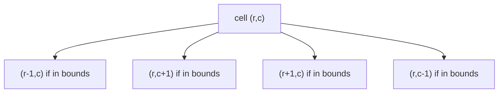
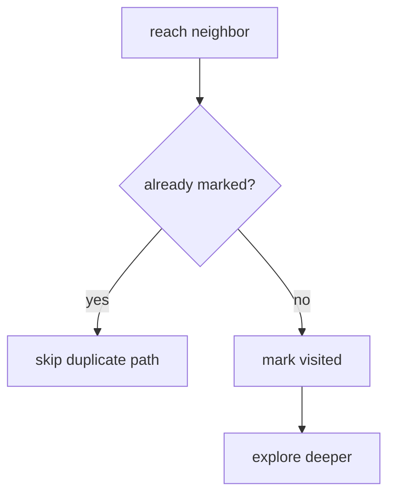
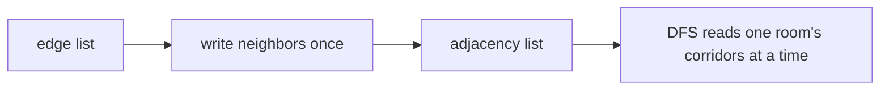
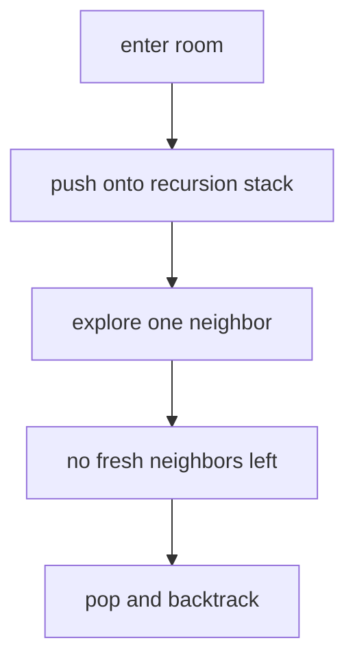
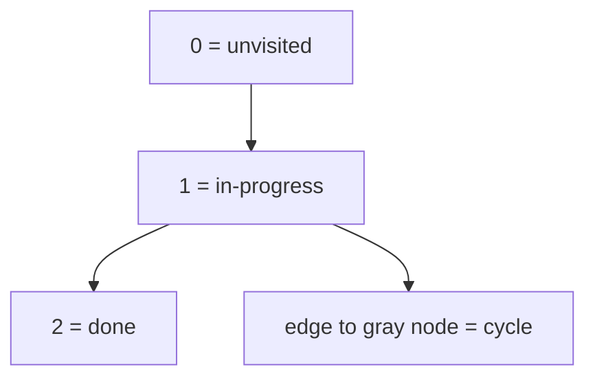
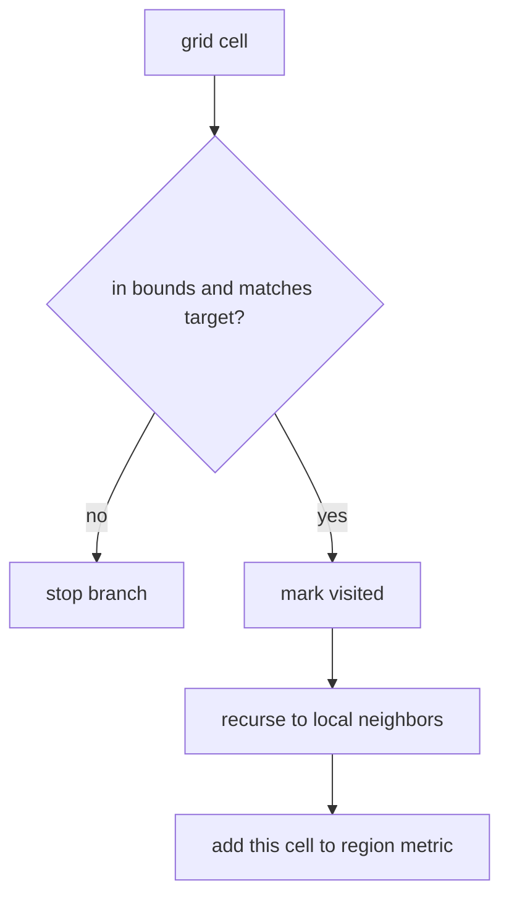
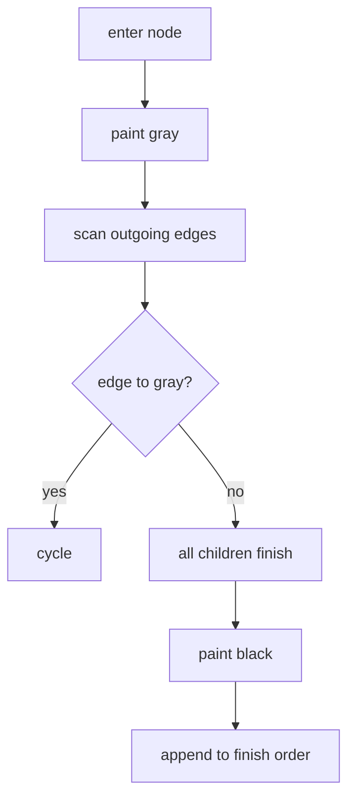
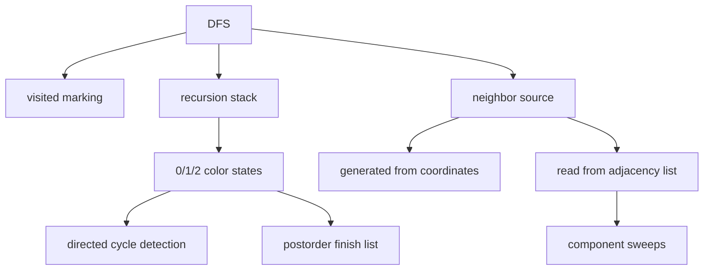
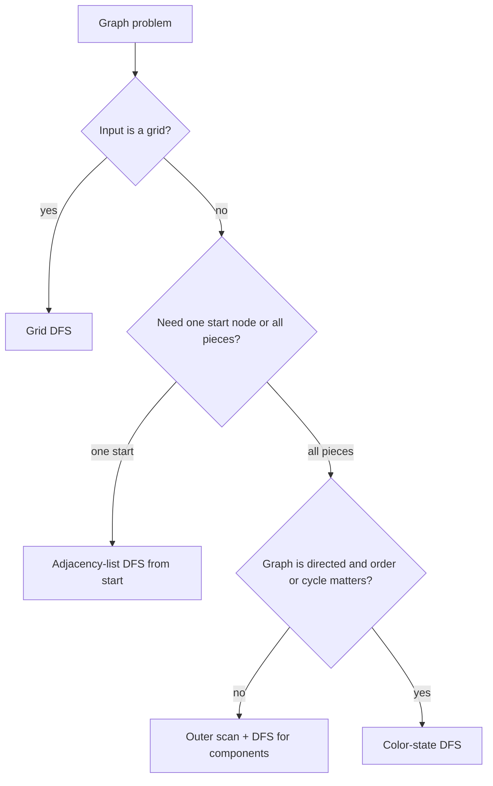

## Overview

Graphs stop looking like arrays the moment one value can point to many others, and they stop looking like trees the moment paths can reconnect or loop back on themselves. DFS breaks that barrier by giving you one disciplined rule: from where you stand, keep going deeper until you cannot, then backtrack without losing your place.

You already know recursion from the earlier recursion guide and you already know how a grid can be indexed like a 2D array. This guide adds the graph layer on top: first a grid where neighbors come from row and column movement, then an explicit adjacency list for general graphs, then directed DFS with color states to detect cycles and produce a safe processing order. We will build that in three stages: **Grid DFS**, **Adjacency-List DFS**, and **Directed DFS with Colors**.

## Core Concept & Mental Model

### The Maze Explorer

Picture a maze explorer carrying chalk and a spool of rope. Every intersection they reach gets a chalk mark so they never treat the same spot as unexplored twice. The rope records the path they took, so when a corridor dead-ends they can backtrack to the last unfinished choice instead of starting over from the entrance.

- **maze room or cell** -> node
- **corridor** -> edge
- **chalk mark** -> visited state
- **rope path** -> recursion stack
- **room map** -> adjacency list
- **blocked loop** -> directed cycle

The efficiency claim is simple: each room gets claimed once, each corridor is examined a constant number of times, and each backtrack step happens only because some earlier forward step put rope there in the first place. That is why DFS runs in O(V + E) on an explicit graph and O(rows × cols) on a grid.

### Grid DFS

A grid is a graph even when the problem never says the word "graph." Each cell is a node, and the movement rule, usually up, right, down, left, defines the possible edges. You do not build an adjacency list because the neighbor formula already exists in the row and column arithmetic.

In the maze explorer picture, this is a maze drawn on square floor tiles where each tile can open into the four orthogonal tiles beside it.

### The Visited Mark

DFS is not "just recurse on neighbors." The visited mark is the invariant that turns recursion into a graph algorithm instead of an infinite loop. The moment a node becomes part of the current exploration, you mark it visited. Every later edge that reaches the same node sees that mark and skips duplicate work.

In the maze, the chalk mark is not decoration. It is the proof that a corridor leading back to a known room should not spawn a second expedition.

### The Adjacency List

Once the graph is no longer a grid, you need a stored map of neighbors. An adjacency list gives every node its own outgoing neighbor bucket. Building it once costs O(V + E). After that, DFS can ask "where can I go next from here?" in time proportional to the current node's degree instead of rescanning the whole edge list.

In the maze picture, the adjacency list is the explorer's room map. Each room lists the corridors that leave it. Undirected graphs write both directions. Directed graphs write only the outgoing arrow.

### The Recursion Stack

DFS goes deep because every recursive call pauses the current room, pushes a new room onto the call stack, and continues from there. When a branch finishes, returning from the call pops that room and resumes the unfinished parent room.

In the maze, the rope is that stack. Going deeper lays out more rope. Backtracking follows the rope back to the last room that still has an unexplored corridor.

### Color States for Directed DFS

On a directed graph, a plain visited boolean is enough for reachability but not for cycle detection. You need three states: unvisited `0`, in-progress `1`, and done `2`. Entering a node paints it in-progress. Finishing all outgoing neighbors paints it done. If DFS sees an edge to another in-progress node, it found a back edge, which means a directed cycle.

In the maze, white rooms have not been entered, gray rooms are on the rope right now, and black rooms are completely cleared. A corridor from one gray room to another gray room means the explorer found a loop inside the active path.

### How I Think Through This

Before I touch code, I ask one question: **what exactly am I exploring from each place, and what state proves I should not explore it again?**

**When the input is a grid:** the neighbors are generated, not stored. My job is to guard the bounds checks, reject blocked cells, mark the current cell immediately, then recurse in the fixed direction order.

**When the input is a general graph:** I first make sure the adjacency list exists, because DFS needs a direct neighbor lookup. Then I decide whether I care about one start node or every connected component in the whole graph.

**When the graph is directed and the question involves dependencies or cycles:** a boolean visited set is not enough. I switch to color states so I can tell the difference between "already finished safely" and "still active on the current recursion path."

The building blocks below work through those three situations in order.

**Scenario 1 — Grid flood fill**

**Graph:** implicit grid, orthogonal neighbors  
**Input:** `grid = [[1,1,0],[1,1,0],[0,1,1]]`, `start = (0,0)`

The key observation is that every recursive step comes from the same fixed four-direction rule. No adjacency list exists because the graph is encoded directly in the grid shape.

:::trace-graph
[
  {
    "nodes": [
      {"id": "A", "label": "(0,0)", "x": 18, "y": 24, "tone": "current", "badge": "start"},
      {"id": "B", "label": "(0,1)", "x": 42, "y": 24, "tone": "frontier"},
      {"id": "C", "label": "(1,0)", "x": 18, "y": 54, "tone": "frontier"},
      {"id": "D", "label": "(1,1)", "x": 42, "y": 54, "tone": "default"},
      {"id": "E", "label": "(2,1)", "x": 42, "y": 84, "tone": "default"},
      {"id": "F", "label": "(2,2)", "x": 66, "y": 84, "tone": "default"}
    ],
    "edges": [
      {"from": "A", "to": "B", "tone": "active"},
      {"from": "A", "to": "C", "tone": "queued"},
      {"from": "B", "to": "D", "tone": "default"},
      {"from": "C", "to": "D", "tone": "default"},
      {"from": "D", "to": "E", "tone": "default"},
      {"from": "E", "to": "F", "tone": "default"}
    ],
    "facts": [
      {"name": "stack", "value": "[(0,0)]", "tone": "orange"},
      {"name": "visited", "value": "{(0,0)}", "tone": "green"},
      {"name": "area", "value": 1, "tone": "blue"}
    ],
    "action": "visit",
    "label": "Enter (0,0), mark it immediately, and start exploring orthogonal neighbors."
  },
  {
    "nodes": [
      {"id": "A", "label": "(0,0)", "x": 18, "y": 24, "tone": "visited"},
      {"id": "B", "label": "(0,1)", "x": 42, "y": 24, "tone": "current"},
      {"id": "C", "label": "(1,0)", "x": 18, "y": 54, "tone": "frontier"},
      {"id": "D", "label": "(1,1)", "x": 42, "y": 54, "tone": "frontier"},
      {"id": "E", "label": "(2,1)", "x": 42, "y": 84, "tone": "default"},
      {"id": "F", "label": "(2,2)", "x": 66, "y": 84, "tone": "default"}
    ],
    "edges": [
      {"from": "A", "to": "B", "tone": "traversed"},
      {"from": "A", "to": "C", "tone": "queued"},
      {"from": "B", "to": "D", "tone": "active"},
      {"from": "C", "to": "D", "tone": "default"},
      {"from": "D", "to": "E", "tone": "default"},
      {"from": "E", "to": "F", "tone": "default"}
    ],
    "facts": [
      {"name": "stack", "value": "[(0,0),(0,1)]", "tone": "orange"},
      {"name": "visited", "value": "{(0,0),(0,1)}", "tone": "green"},
      {"name": "area", "value": 2, "tone": "blue"}
    ],
    "action": "expand",
    "label": "DFS goes deeper before coming back. The active path is the current recursion stack."
  },
  {
    "nodes": [
      {"id": "A", "label": "(0,0)", "x": 18, "y": 24, "tone": "done"},
      {"id": "B", "label": "(0,1)", "x": 42, "y": 24, "tone": "done"},
      {"id": "C", "label": "(1,0)", "x": 18, "y": 54, "tone": "done"},
      {"id": "D", "label": "(1,1)", "x": 42, "y": 54, "tone": "done"},
      {"id": "E", "label": "(2,1)", "x": 42, "y": 84, "tone": "done"},
      {"id": "F", "label": "(2,2)", "x": 66, "y": 84, "tone": "done"}
    ],
    "edges": [
      {"from": "A", "to": "B", "tone": "traversed"},
      {"from": "A", "to": "C", "tone": "traversed"},
      {"from": "B", "to": "D", "tone": "traversed"},
      {"from": "C", "to": "D", "tone": "traversed"},
      {"from": "D", "to": "E", "tone": "traversed"},
      {"from": "E", "to": "F", "tone": "traversed"}
    ],
    "facts": [
      {"name": "stack", "value": "[]", "tone": "orange"},
      {"name": "visited", "value": "all 6 cells", "tone": "green"},
      {"name": "area", "value": 6, "tone": "blue"}
    ],
    "action": "done",
    "label": "When every recursive branch finishes, DFS has claimed the full reachable region."
  }
]
:::

**Scenario 2 — DFS from one start node**

**Graph:** undirected adjacency list  
**Input:** `n = 6`, `edges = [[0,1],[0,2],[1,3],[2,4],[4,5]]`, `start = 0`

The key observation is that the adjacency list turns "where can I go next?" into a direct lookup. DFS no longer generates neighbors by coordinate math, it reads them from the current node's bucket.

:::trace-graph
[
  {
    "nodes": [
      {"id": "A", "label": "0", "x": 18, "y": 48, "tone": "current", "badge": "start"},
      {"id": "B", "label": "1", "x": 36, "y": 22, "tone": "frontier"},
      {"id": "C", "label": "2", "x": 36, "y": 76, "tone": "frontier"},
      {"id": "D", "label": "3", "x": 58, "y": 22, "tone": "default"},
      {"id": "E", "label": "4", "x": 58, "y": 76, "tone": "default"},
      {"id": "F", "label": "5", "x": 80, "y": 76, "tone": "default"}
    ],
    "edges": [
      {"from": "A", "to": "B", "tone": "active"},
      {"from": "A", "to": "C", "tone": "queued"},
      {"from": "B", "to": "D", "tone": "default"},
      {"from": "C", "to": "E", "tone": "default"},
      {"from": "E", "to": "F", "tone": "default"}
    ],
    "facts": [
      {"name": "stack", "value": "[0]", "tone": "orange"},
      {"name": "visited", "value": "{0}", "tone": "green"},
      {"name": "order", "value": "[0]", "tone": "blue"}
    ],
    "action": "visit",
    "label": "Start at 0, mark it, and recursively follow the first neighbor in its adjacency list."
  },
  {
    "nodes": [
      {"id": "A", "label": "0", "x": 18, "y": 48, "tone": "visited"},
      {"id": "B", "label": "1", "x": 36, "y": 22, "tone": "current"},
      {"id": "C", "label": "2", "x": 36, "y": 76, "tone": "frontier"},
      {"id": "D", "label": "3", "x": 58, "y": 22, "tone": "frontier"},
      {"id": "E", "label": "4", "x": 58, "y": 76, "tone": "default"},
      {"id": "F", "label": "5", "x": 80, "y": 76, "tone": "default"}
    ],
    "edges": [
      {"from": "A", "to": "B", "tone": "traversed"},
      {"from": "A", "to": "C", "tone": "queued"},
      {"from": "B", "to": "D", "tone": "active"},
      {"from": "C", "to": "E", "tone": "default"},
      {"from": "E", "to": "F", "tone": "default"}
    ],
    "facts": [
      {"name": "stack", "value": "[0,1]", "tone": "orange"},
      {"name": "visited", "value": "{0,1}", "tone": "green"},
      {"name": "order", "value": "[0,1]", "tone": "blue"}
    ],
    "action": "expand",
    "label": "DFS keeps diving until a node has no fresh neighbors left, then unwinds."
  },
  {
    "nodes": [
      {"id": "A", "label": "0", "x": 18, "y": 48, "tone": "done"},
      {"id": "B", "label": "1", "x": 36, "y": 22, "tone": "done"},
      {"id": "C", "label": "2", "x": 36, "y": 76, "tone": "done"},
      {"id": "D", "label": "3", "x": 58, "y": 22, "tone": "done"},
      {"id": "E", "label": "4", "x": 58, "y": 76, "tone": "done"},
      {"id": "F", "label": "5", "x": 80, "y": 76, "tone": "done"}
    ],
    "edges": [
      {"from": "A", "to": "B", "tone": "traversed"},
      {"from": "A", "to": "C", "tone": "traversed"},
      {"from": "B", "to": "D", "tone": "traversed"},
      {"from": "C", "to": "E", "tone": "traversed"},
      {"from": "E", "to": "F", "tone": "traversed"}
    ],
    "facts": [
      {"name": "stack", "value": "[]", "tone": "orange"},
      {"name": "visited", "value": "{0,1,2,3,4,5}", "tone": "green"},
      {"name": "order", "value": "[0,1,3,2,4,5]", "tone": "blue"}
    ],
    "action": "done",
    "label": "The final visitation order depends on neighbor order, but every reachable node is still visited exactly once."
  }
]
:::

**Scenario 3 — Directed cycle detection with colors**

**Graph:** directed adjacency list  
**Input:** `n = 4`, `edges = [[0,1],[1,2],[2,1],[2,3]]`

The key observation is that seeing a previously visited node is not enough to prove a cycle in a directed graph. Only an edge into another in-progress node proves that DFS has looped back into its active path.

:::trace-graph
[
  {
    "nodes": [
      {"id": "A", "label": "0", "x": 18, "y": 48, "tone": "current"},
      {"id": "B", "label": "1", "x": 42, "y": 24, "tone": "frontier"},
      {"id": "C", "label": "2", "x": 66, "y": 48, "tone": "frontier"},
      {"id": "D", "label": "3", "x": 90, "y": 72, "tone": "default"}
    ],
    "edges": [
      {"from": "A", "to": "B", "directed": true, "tone": "active"},
      {"from": "B", "to": "C", "directed": true, "tone": "default"},
      {"from": "C", "to": "B", "directed": true, "tone": "blocked"},
      {"from": "C", "to": "D", "directed": true, "tone": "default"}
    ],
    "facts": [
      {"name": "colors", "value": "[1,0,0,0]", "tone": "purple"},
      {"name": "stack", "value": "[0]", "tone": "orange"}
    ],
    "action": "visit",
    "label": "Entering node 0 paints it gray, meaning in-progress on the current DFS path."
  },
  {
    "nodes": [
      {"id": "A", "label": "0", "x": 18, "y": 48, "tone": "visited"},
      {"id": "B", "label": "1", "x": 42, "y": 24, "tone": "current"},
      {"id": "C", "label": "2", "x": 66, "y": 48, "tone": "frontier"},
      {"id": "D", "label": "3", "x": 90, "y": 72, "tone": "default"}
    ],
    "edges": [
      {"from": "A", "to": "B", "directed": true, "tone": "traversed"},
      {"from": "B", "to": "C", "directed": true, "tone": "active"},
      {"from": "C", "to": "B", "directed": true, "tone": "blocked"},
      {"from": "C", "to": "D", "directed": true, "tone": "default"}
    ],
    "facts": [
      {"name": "colors", "value": "[1,1,0,0]", "tone": "purple"},
      {"name": "stack", "value": "[0,1]", "tone": "orange"}
    ],
    "action": "expand",
    "label": "Entering 1 paints it gray too. Gray means active, not finished."
  },
  {
    "nodes": [
      {"id": "A", "label": "0", "x": 18, "y": 48, "tone": "visited"},
      {"id": "B", "label": "1", "x": 42, "y": 24, "tone": "blocked"},
      {"id": "C", "label": "2", "x": 66, "y": 48, "tone": "current"},
      {"id": "D", "label": "3", "x": 90, "y": 72, "tone": "default"}
    ],
    "edges": [
      {"from": "A", "to": "B", "directed": true, "tone": "traversed"},
      {"from": "B", "to": "C", "directed": true, "tone": "traversed"},
      {"from": "C", "to": "B", "directed": true, "tone": "blocked"},
      {"from": "C", "to": "D", "directed": true, "tone": "default"}
    ],
    "facts": [
      {"name": "colors", "value": "[1,1,1,0]", "tone": "purple"},
      {"name": "stack", "value": "[0,1,2]", "tone": "orange"}
    ],
    "action": "cycle",
    "label": "From 2, the edge back to gray node 1 is a back edge. That proves a directed cycle immediately."
  }
]
:::

---

## Building Blocks: Progressive Learning

### Level 1: Grid DFS

A grid DFS problem usually arrives disguised as a matrix problem: start at one cell, spread to matching neighbors, and do not count or recolor the same region twice. The brute-force mistake is to restart a fresh search from scratch every time you need the size or shape of a region. On a 200 by 200 grid, repeatedly rediscovering the same land can turn a linear scan into a mess of repeated work.

The exploitable property is that every cell already knows its possible neighbors from geometry alone. Up, right, down, and left are the only candidate moves, so you never need to build a separate graph structure. The only real decisions are whether a candidate cell stays in bounds, whether it belongs to the region you care about, and whether DFS has already claimed it.

Mechanically, start by rejecting bad states: out of bounds, blocked value, or already visited. If the cell is valid, mark it immediately before exploring any neighbor. Then recurse in a fixed direction order so the traversal is predictable. Each recursive call returns after finishing one branch, which lets the current call continue with the next direction. That same shape powers flood fill, counting reachable cells, and measuring connected area.

`grid = [[1,1,0],[1,1,0],[0,1,1]]`, `start = (0,0)`

:::trace-graph
[
  {
    "nodes": [
      {"id": "A", "label": "(0,0)", "x": 18, "y": 24, "tone": "current"},
      {"id": "B", "label": "(0,1)", "x": 42, "y": 24, "tone": "frontier"},
      {"id": "C", "label": "(1,0)", "x": 18, "y": 54, "tone": "frontier"},
      {"id": "D", "label": "(1,1)", "x": 42, "y": 54, "tone": "default"},
      {"id": "E", "label": "(2,1)", "x": 42, "y": 84, "tone": "default"},
      {"id": "F", "label": "(2,2)", "x": 66, "y": 84, "tone": "default"}
    ],
    "edges": [
      {"from": "A", "to": "B", "tone": "active"},
      {"from": "A", "to": "C", "tone": "queued"},
      {"from": "B", "to": "D", "tone": "default"},
      {"from": "C", "to": "D", "tone": "default"},
      {"from": "D", "to": "E", "tone": "default"},
      {"from": "E", "to": "F", "tone": "default"}
    ],
    "facts": [
      {"name": "stack", "value": "[(0,0)]", "tone": "orange"},
      {"name": "visited", "value": "{(0,0)}", "tone": "green"},
      {"name": "area", "value": 1, "tone": "blue"}
    ],
    "action": "visit",
    "label": "Mark the start cell first. Every later recursive branch trusts that mark."
  },
  {
    "nodes": [
      {"id": "A", "label": "(0,0)", "x": 18, "y": 24, "tone": "visited"},
      {"id": "B", "label": "(0,1)", "x": 42, "y": 24, "tone": "current"},
      {"id": "C", "label": "(1,0)", "x": 18, "y": 54, "tone": "frontier"},
      {"id": "D", "label": "(1,1)", "x": 42, "y": 54, "tone": "frontier"},
      {"id": "E", "label": "(2,1)", "x": 42, "y": 84, "tone": "default"},
      {"id": "F", "label": "(2,2)", "x": 66, "y": 84, "tone": "default"}
    ],
    "edges": [
      {"from": "A", "to": "B", "tone": "traversed"},
      {"from": "A", "to": "C", "tone": "queued"},
      {"from": "B", "to": "D", "tone": "active"},
      {"from": "C", "to": "D", "tone": "default"},
      {"from": "D", "to": "E", "tone": "default"},
      {"from": "E", "to": "F", "tone": "default"}
    ],
    "facts": [
      {"name": "stack", "value": "[(0,0),(0,1)]", "tone": "orange"},
      {"name": "visited", "value": "{(0,0),(0,1)}", "tone": "green"},
      {"name": "area", "value": 2, "tone": "blue"}
    ],
    "action": "expand",
    "label": "Go deeper first, then come back. Backtracking is just the recursive return path."
  },
  {
    "nodes": [
      {"id": "A", "label": "(0,0)", "x": 18, "y": 24, "tone": "done"},
      {"id": "B", "label": "(0,1)", "x": 42, "y": 24, "tone": "done"},
      {"id": "C", "label": "(1,0)", "x": 18, "y": 54, "tone": "done"},
      {"id": "D", "label": "(1,1)", "x": 42, "y": 54, "tone": "done"},
      {"id": "E", "label": "(2,1)", "x": 42, "y": 84, "tone": "done"},
      {"id": "F", "label": "(2,2)", "x": 66, "y": 84, "tone": "done"}
    ],
    "edges": [
      {"from": "A", "to": "B", "tone": "traversed"},
      {"from": "A", "to": "C", "tone": "traversed"},
      {"from": "B", "to": "D", "tone": "traversed"},
      {"from": "C", "to": "D", "tone": "traversed"},
      {"from": "D", "to": "E", "tone": "traversed"},
      {"from": "E", "to": "F", "tone": "traversed"}
    ],
    "facts": [
      {"name": "stack", "value": "[]", "tone": "orange"},
      {"name": "visited", "value": "all 6 cells", "tone": "green"},
      {"name": "area", "value": 6, "tone": "blue"}
    ],
    "action": "done",
    "label": "When every branch returns, the reachable region has been fully explored exactly once."
  }
]
:::

#### **Exercise 1**

Flood fill is the simplest place to learn the DFS shape because the answer is visible directly in the grid. You're given a grid, a starting cell, and a replacement value. Recolor the full connected region that matches the starting cell's original value, using DFS to spread only through orthogonal neighbors.

:::stackblitz{step=1 total=3 exercises="step1-exercise1-problem.ts" solutions="step1-exercise1-solution.ts"}

#### **Exercise 2**

Counting reachable cells matters when the region itself is the answer rather than the recolored picture. You're given a `0/1` grid and a starting cell. Return how many land cells with value `1` belong to that start cell's connected region, and treat water or an out-of-bounds start as size zero.

:::stackblitz{step=1 total=3 exercises="step1-exercise2-problem.ts" solutions="step1-exercise2-solution.ts"}

#### **Exercise 3**

The next jump is to measure every region without rewalking the whole grid from scratch for each one. You're given a `0/1` grid. Return the area of the largest connected land region by launching DFS only from cells that have not already been claimed.

:::stackblitz{step=1 total=3 exercises="step1-exercise3-problem.ts" solutions="step1-exercise3-solution.ts"}

> **Mental anchor**: Mark the cell when you enter it, then let the four directions do the rest.

**→ Bridge to Level 2**: Level 1 works because the grid itself gives you the neighbor rule for free. The moment the input becomes an arbitrary graph, there is no row and column arithmetic to lean on, so you need an adjacency list before DFS can move.

### Level 2: Adjacency-List DFS

Level 1 gave you generated neighbors from geometry. Now the problem changes shape: the input is a general graph, which means neighbors have to be stored explicitly. The brute-force mistake is to keep rescanning the full edge list from every node just to rediscover who connects to whom. On a graph with ten thousand edges, that repeated scanning buries the actual traversal inside avoidable lookup work.

The exploitable property is that a graph's structure can be normalized once into an adjacency list. After that build step, each DFS call reads only the current node's neighbor bucket. The recursive mechanics stay familiar: mark the current node, record it if the problem wants an order, then recurse on each unseen neighbor. The new capability is not deeper recursion, it is flexible traversal over any graph shape.

When the question shifts from one start node to the whole graph, add an outer loop. Each time that loop finds an unvisited node, you have discovered a new connected component and should launch one full DFS from it. The inner recursion is the same pattern from the start-node version. The outer scan is what turns local reachability into full-graph component counting.

`n = 7`, `edges = [[0,1],[0,2],[1,3],[4,5]]`, `start = 0`

:::trace-graph
[
  {
    "nodes": [
      {"id": "A", "label": "0", "x": 16, "y": 44, "tone": "current", "badge": "start"},
      {"id": "B", "label": "1", "x": 34, "y": 22, "tone": "frontier"},
      {"id": "C", "label": "2", "x": 34, "y": 66, "tone": "frontier"},
      {"id": "D", "label": "3", "x": 56, "y": 22, "tone": "default"},
      {"id": "E", "label": "4", "x": 72, "y": 52, "tone": "muted"},
      {"id": "F", "label": "5", "x": 88, "y": 52, "tone": "muted"},
      {"id": "G", "label": "6", "x": 88, "y": 18, "tone": "muted"}
    ],
    "edges": [
      {"from": "A", "to": "B", "tone": "active"},
      {"from": "A", "to": "C", "tone": "queued"},
      {"from": "B", "to": "D", "tone": "default"},
      {"from": "E", "to": "F", "tone": "muted"}
    ],
    "facts": [
      {"name": "stack", "value": "[0]", "tone": "orange"},
      {"name": "visited", "value": "{0}", "tone": "green"},
      {"name": "components", "value": 0, "tone": "purple"}
    ],
    "action": "visit",
    "label": "A single DFS from node 0 can only see its own connected piece of the graph."
  },
  {
    "nodes": [
      {"id": "A", "label": "0", "x": 16, "y": 44, "tone": "visited"},
      {"id": "B", "label": "1", "x": 34, "y": 22, "tone": "current"},
      {"id": "C", "label": "2", "x": 34, "y": 66, "tone": "frontier"},
      {"id": "D", "label": "3", "x": 56, "y": 22, "tone": "frontier"},
      {"id": "E", "label": "4", "x": 72, "y": 52, "tone": "muted"},
      {"id": "F", "label": "5", "x": 88, "y": 52, "tone": "muted"},
      {"id": "G", "label": "6", "x": 88, "y": 18, "tone": "muted"}
    ],
    "edges": [
      {"from": "A", "to": "B", "tone": "traversed"},
      {"from": "A", "to": "C", "tone": "queued"},
      {"from": "B", "to": "D", "tone": "active"},
      {"from": "E", "to": "F", "tone": "muted"}
    ],
    "facts": [
      {"name": "stack", "value": "[0,1]", "tone": "orange"},
      {"name": "visited", "value": "{0,1}", "tone": "green"},
      {"name": "components", "value": 0, "tone": "purple"}
    ],
    "action": "expand",
    "label": "The inner DFS logic matches Level 1: mark, recurse, backtrack."
  },
  {
    "nodes": [
      {"id": "A", "label": "0", "x": 16, "y": 44, "tone": "done"},
      {"id": "B", "label": "1", "x": 34, "y": 22, "tone": "done"},
      {"id": "C", "label": "2", "x": 34, "y": 66, "tone": "done"},
      {"id": "D", "label": "3", "x": 56, "y": 22, "tone": "done"},
      {"id": "E", "label": "4", "x": 72, "y": 52, "tone": "current", "badge": "new"},
      {"id": "F", "label": "5", "x": 88, "y": 52, "tone": "frontier"},
      {"id": "G", "label": "6", "x": 88, "y": 18, "tone": "default"}
    ],
    "edges": [
      {"from": "A", "to": "B", "tone": "traversed"},
      {"from": "A", "to": "C", "tone": "traversed"},
      {"from": "B", "to": "D", "tone": "traversed"},
      {"from": "E", "to": "F", "tone": "active"}
    ],
    "facts": [
      {"name": "stack", "value": "[4]", "tone": "orange"},
      {"name": "visited", "value": "{0,1,2,3,4}", "tone": "green"},
      {"name": "components", "value": 2, "tone": "purple"}
    ],
    "action": "queue",
    "label": "The outer scan finds node 4 still unvisited, which means a new connected component begins here."
  },
  {
    "nodes": [
      {"id": "A", "label": "0", "x": 16, "y": 44, "tone": "done"},
      {"id": "B", "label": "1", "x": 34, "y": 22, "tone": "done"},
      {"id": "C", "label": "2", "x": 34, "y": 66, "tone": "done"},
      {"id": "D", "label": "3", "x": 56, "y": 22, "tone": "done"},
      {"id": "E", "label": "4", "x": 72, "y": 52, "tone": "done"},
      {"id": "F", "label": "5", "x": 88, "y": 52, "tone": "done"},
      {"id": "G", "label": "6", "x": 88, "y": 18, "tone": "answer"}
    ],
    "edges": [
      {"from": "A", "to": "B", "tone": "traversed"},
      {"from": "A", "to": "C", "tone": "traversed"},
      {"from": "B", "to": "D", "tone": "traversed"},
      {"from": "E", "to": "F", "tone": "traversed"}
    ],
    "facts": [
      {"name": "stack", "value": "[]", "tone": "orange"},
      {"name": "visited", "value": "{0,1,2,3,4,5,6}", "tone": "green"},
      {"name": "components", "value": 3, "tone": "purple"}
    ],
    "action": "done",
    "label": "Node 6 is isolated, so the outer scan counts it as a one-node component of its own."
  }
]
:::

#### **Exercise 1**

The first explicit-graph skill is to make the DFS walk visible. You're given an adjacency list and a start node. Return the nodes in the exact order a recursive DFS visits them, honoring the neighbor order already stored in each bucket.

:::stackblitz{step=2 total=3 exercises="step2-exercise1-problem.ts" solutions="step2-exercise1-solution.ts"}

#### **Exercise 2**

Reachability is often the real question hiding behind the traversal. You're given `n`, an undirected edge list, and a start node. Build the adjacency list, run DFS once, and return every reachable node in visitation order so you can see the full claimed region from that start.

:::stackblitz{step=2 total=3 exercises="step2-exercise2-problem.ts" solutions="step2-exercise2-solution.ts"}

#### **Exercise 3**

Component counting is what you need when one DFS is not enough. You're given `n` and an undirected edge list. Return how many connected components the graph contains by combining the same DFS helper with an outer scan over every node.

:::stackblitz{step=2 total=3 exercises="step2-exercise3-problem.ts" solutions="step2-exercise3-solution.ts"}

> **Mental anchor**: Build the room map once, then let each unmarked room start exactly one DFS.

**→ Bridge to Level 3**: Level 2 can tell you what is reachable, but it cannot distinguish a safe finished node from a node that is still active higher on the call stack. Directed cycle questions need that extra state, which is where color marking comes in.

### Level 3: Directed DFS with Colors

Level 2 gave you a boolean answer to "have I ever seen this node?" Directed dependency problems need a stronger question: "is this node still active on my current recursion path, or has it already finished safely?" Without that distinction, DFS cannot reliably detect cycles or produce a trustworthy processing order.

The exploitable property is that directed DFS naturally has three moments in a node's life. Before entry the node is unvisited. During recursive exploration it is in-progress. After every outgoing edge has been handled it is done. That is why the color array uses `0`, `1`, and `2`. An edge into color `1` means you looped back into the active stack, so the graph contains a directed cycle. An edge into color `2` is harmless because that node has already been fully processed.

Mechanically, paint the node gray on entry, recurse through outgoing neighbors, and paint it black only after all children finish. If a child call reports a cycle, bubble that failure upward immediately. If all outgoing edges finish cleanly, append the node to a postorder list as you turn it black. Reversing that finish order gives a valid processing order for a DAG.

`n = 5`, `edges = [[0,1],[0,2],[1,3],[2,3],[3,4]]`

:::trace-graph
[
  {
    "nodes": [
      {"id": "A", "label": "0", "x": 18, "y": 48, "tone": "current"},
      {"id": "B", "label": "1", "x": 40, "y": 24, "tone": "frontier"},
      {"id": "C", "label": "2", "x": 40, "y": 72, "tone": "frontier"},
      {"id": "D", "label": "3", "x": 68, "y": 48, "tone": "default"},
      {"id": "E", "label": "4", "x": 90, "y": 48, "tone": "default"}
    ],
    "edges": [
      {"from": "A", "to": "B", "directed": true, "tone": "active"},
      {"from": "A", "to": "C", "directed": true, "tone": "queued"},
      {"from": "B", "to": "D", "directed": true, "tone": "default"},
      {"from": "C", "to": "D", "directed": true, "tone": "default"},
      {"from": "D", "to": "E", "directed": true, "tone": "default"}
    ],
    "facts": [
      {"name": "colors", "value": "[1,0,0,0,0]", "tone": "purple"},
      {"name": "stack", "value": "[0]", "tone": "orange"},
      {"name": "finish", "value": "[]", "tone": "blue"}
    ],
    "action": "visit",
    "label": "Gray means the node is active on the current DFS path."
  },
  {
    "nodes": [
      {"id": "A", "label": "0", "x": 18, "y": 48, "tone": "visited"},
      {"id": "B", "label": "1", "x": 40, "y": 24, "tone": "visited"},
      {"id": "C", "label": "2", "x": 40, "y": 72, "tone": "frontier"},
      {"id": "D", "label": "3", "x": 68, "y": 48, "tone": "current"},
      {"id": "E", "label": "4", "x": 90, "y": 48, "tone": "frontier"}
    ],
    "edges": [
      {"from": "A", "to": "B", "directed": true, "tone": "traversed"},
      {"from": "A", "to": "C", "directed": true, "tone": "queued"},
      {"from": "B", "to": "D", "directed": true, "tone": "traversed"},
      {"from": "C", "to": "D", "directed": true, "tone": "default"},
      {"from": "D", "to": "E", "directed": true, "tone": "active"}
    ],
    "facts": [
      {"name": "colors", "value": "[1,1,0,1,0]", "tone": "purple"},
      {"name": "stack", "value": "[0,1,3]", "tone": "orange"},
      {"name": "finish", "value": "[]", "tone": "blue"}
    ],
    "action": "expand",
    "label": "DFS keeps the active chain gray until the deepest child finishes."
  },
  {
    "nodes": [
      {"id": "A", "label": "0", "x": 18, "y": 48, "tone": "visited"},
      {"id": "B", "label": "1", "x": 40, "y": 24, "tone": "visited"},
      {"id": "C", "label": "2", "x": 40, "y": 72, "tone": "frontier"},
      {"id": "D", "label": "3", "x": 68, "y": 48, "tone": "visited"},
      {"id": "E", "label": "4", "x": 90, "y": 48, "tone": "done"}
    ],
    "edges": [
      {"from": "A", "to": "B", "directed": true, "tone": "traversed"},
      {"from": "A", "to": "C", "directed": true, "tone": "queued"},
      {"from": "B", "to": "D", "directed": true, "tone": "traversed"},
      {"from": "C", "to": "D", "directed": true, "tone": "default"},
      {"from": "D", "to": "E", "directed": true, "tone": "traversed"}
    ],
    "facts": [
      {"name": "colors", "value": "[1,1,0,1,2]", "tone": "purple"},
      {"name": "stack", "value": "[0,1,3]", "tone": "orange"},
      {"name": "finish", "value": "[4]", "tone": "blue"}
    ],
    "action": "mark",
    "label": "A node enters the finish list only when all of its outgoing edges are settled."
  },
  {
    "nodes": [
      {"id": "A", "label": "0", "x": 18, "y": 48, "tone": "done"},
      {"id": "B", "label": "1", "x": 40, "y": 24, "tone": "done"},
      {"id": "C", "label": "2", "x": 40, "y": 72, "tone": "done"},
      {"id": "D", "label": "3", "x": 68, "y": 48, "tone": "done"},
      {"id": "E", "label": "4", "x": 90, "y": 48, "tone": "done"}
    ],
    "edges": [
      {"from": "A", "to": "B", "directed": true, "tone": "traversed"},
      {"from": "A", "to": "C", "directed": true, "tone": "traversed"},
      {"from": "B", "to": "D", "directed": true, "tone": "traversed"},
      {"from": "C", "to": "D", "directed": true, "tone": "traversed"},
      {"from": "D", "to": "E", "directed": true, "tone": "traversed"}
    ],
    "facts": [
      {"name": "colors", "value": "[2,2,2,2,2]", "tone": "purple"},
      {"name": "stack", "value": "[]", "tone": "orange"},
      {"name": "finish", "value": "[4,3,1,2,0]", "tone": "blue"}
    ],
    "action": "done",
    "label": "Reversing the finish list gives a valid processing order for this DAG."
  }
]
:::

The failure case is the reason the gray state exists at all.

`n = 4`, `edges = [[0,1],[1,2],[2,1],[2,3]]`

:::trace-graph
[
  {
    "nodes": [
      {"id": "A", "label": "0", "x": 18, "y": 48, "tone": "visited"},
      {"id": "B", "label": "1", "x": 42, "y": 24, "tone": "current"},
      {"id": "C", "label": "2", "x": 66, "y": 48, "tone": "frontier"},
      {"id": "D", "label": "3", "x": 90, "y": 72, "tone": "default"}
    ],
    "edges": [
      {"from": "A", "to": "B", "directed": true, "tone": "traversed"},
      {"from": "B", "to": "C", "directed": true, "tone": "active"},
      {"from": "C", "to": "B", "directed": true, "tone": "blocked"},
      {"from": "C", "to": "D", "directed": true, "tone": "default"}
    ],
    "facts": [
      {"name": "colors", "value": "[1,1,0,0]", "tone": "purple"},
      {"name": "stack", "value": "[0,1]", "tone": "orange"},
      {"name": "finish", "value": "[]", "tone": "blue"}
    ],
    "action": "expand",
    "label": "Node 1 is gray because it is active higher on the current path."
  },
  {
    "nodes": [
      {"id": "A", "label": "0", "x": 18, "y": 48, "tone": "visited"},
      {"id": "B", "label": "1", "x": 42, "y": 24, "tone": "blocked"},
      {"id": "C", "label": "2", "x": 66, "y": 48, "tone": "current"},
      {"id": "D", "label": "3", "x": 90, "y": 72, "tone": "default"}
    ],
    "edges": [
      {"from": "A", "to": "B", "directed": true, "tone": "traversed"},
      {"from": "B", "to": "C", "directed": true, "tone": "traversed"},
      {"from": "C", "to": "B", "directed": true, "tone": "blocked"},
      {"from": "C", "to": "D", "directed": true, "tone": "default"}
    ],
    "facts": [
      {"name": "colors", "value": "[1,1,1,0]", "tone": "purple"},
      {"name": "stack", "value": "[0,1,2]", "tone": "orange"},
      {"name": "finish", "value": "[]", "tone": "blue"}
    ],
    "action": "cycle",
    "label": "The edge from 2 back to gray node 1 is a back edge, so DFS reports a directed cycle immediately."
  }
]
:::

#### **Exercise 1**

Cycle detection is the smallest directed-DFS question that truly needs color states. You're given a directed adjacency list. Return `true` if any directed cycle exists and `false` otherwise, using `0`, `1`, and `2` to separate untouched nodes from active ones and finished ones.

:::stackblitz{step=3 total=3 exercises="step3-exercise1-problem.ts" solutions="step3-exercise1-solution.ts"}

#### **Exercise 2**

Finishing order is what turns DFS into a dependency-ordering tool. You're given a directed adjacency list that may contain multiple disconnected DAG pieces. Return the nodes in the order they finish, appending each node when it turns from in-progress to done.

:::stackblitz{step=3 total=3 exercises="step3-exercise2-problem.ts" solutions="step3-exercise2-solution.ts"}

#### **Exercise 3**

The final extension is to make the active path itself visible when a loop appears. You're given a directed adjacency list with exactly one directed cycle. Return the nodes on that cycle in cycle order by tracking the current recursion path alongside the same color-state DFS.

:::stackblitz{step=3 total=3 exercises="step3-exercise3-problem.ts" solutions="step3-exercise3-solution.ts"}

> **Mental anchor**: Gray means "I am still on the rope." An edge to gray means the rope has looped back on itself.

## Key Patterns

### Pattern: Region Sweeps on Grids

**When to use**: the input is a matrix, movement is local and orthogonal or diagonal, and the question asks for fill, count, area, perimeter, island count, or anything about one connected region of matching cells.

**How to think about it**: reduce the matrix to an implicit graph where each valid cell is a node and each legal move is an edge. DFS is effective here because the neighbor rule is constant and local, so the only state you truly need is the visited mark plus whatever metric the current region is accumulating.

**Complexity**: Time O(rows × cols), Space O(rows × cols) in the worst case for visited state plus recursion depth, because each cell is claimed once.

### Pattern: Dependency Ordering with Postorder DFS

**When to use**: the graph is directed, the problem mentions prerequisites, processing order, safe evaluation order, or cycle detection, and you want a DFS-based alternative to queue-driven topological sorting.

**How to think about it**: a node can only be appended to the finish list after every outgoing dependency has finished. That makes postorder DFS naturally build the reverse of a topological order. The same color array that prevents false reuse also gives the cycle test, because any edge into an in-progress node proves an impossible prerequisite loop.

**Complexity**: Time O(V + E), Space O(V) for colors, recursion stack, and finish order, because each node changes color at most twice and each edge is inspected once.

---

## Decision Framework

**Concept Map**

| Technique | Main Input Form | State You Track | What It Solves | Time | Space |
| --- | --- | --- | --- | --- | --- |
| Grid DFS | `rows x cols` grid | visited cells, recursion stack | flood fill, region count, area | O(rows × cols) | O(rows × cols) worst case |
| DFS from one start | adjacency list + `start` | visited nodes, recursion stack | reachability, visitation order | O(V + E) | O(V) |
| Component sweep DFS | adjacency list | visited nodes, outer loop counter | connected components | O(V + E) | O(V) |
| Directed color DFS | directed adjacency list | colors, recursion stack, finish list | cycle detection, finish order | O(V + E) | O(V) |

**Decision Tree**

| Recognition Signal | Reach For |
| --- | --- |
| "2D grid", "island", "flood fill", "area of region" | Grid DFS |
| "start node", "reachable from X", "visit all neighbors" | DFS from one start |
| "how many groups", "connected components", "some nodes isolated" | Outer scan + DFS |
| "prerequisite", "dependency loop", "safe processing order", "directed cycle" | Color-state DFS |

**When NOT to use**: do not use DFS when the problem specifically asks for the shortest path in an unweighted graph, because DFS does not explore in distance order. That is a BFS problem. Do not use plain boolean visited state for directed dependency questions, because it cannot distinguish a safe finished node from one that is still active on the current path.

## Common Gotchas & Edge Cases

**Gotcha 1: Marking after recursion instead of before**

The symptom is repeated work or an infinite loop on graphs with cycles or two different paths into the same node. A neighbor can re-enter the current node before the original call has finished, because nothing announced ownership yet.

Why it is tempting: it feels natural to "finish" a node and then mark it, the way you might mark a to-do item only after completing it.

Fix: mark the node immediately on entry. In a directed color DFS, set it to `1` on entry and `2` only on exit.

**Gotcha 2: Forgetting the outer scan for components**

The symptom is a correct DFS helper paired with the wrong final answer on disconnected graphs. You visit one region successfully, then quietly ignore every unvisited node in the rest of the graph.

Why it is tempting: many starter examples use one `start` node, so it is easy to assume one DFS should cover the whole graph.

Fix: when the question is about the whole graph, loop over every node and launch DFS only from nodes that remain unvisited.

**Gotcha 3: Treating any previously seen directed node as a cycle**

The symptom is false cycle reports in DAGs where multiple paths converge into the same finished node. Reaching a black node is fine. Reaching a gray node is the actual problem.

Why it is tempting: a boolean visited set worked for reachability, so it feels like it should work for cycle detection too.

Fix: use three colors. Only an edge to color `1` proves a directed cycle.

**Gotcha 4: Letting grid DFS walk into invalid cells**

The symptom is index errors, water cells being counted as land, or the same cell being counted multiple times. This usually happens when the base cases are incomplete or checked in the wrong order.

Why it is tempting: once the recursive shape is visible, the guard rails can feel like boilerplate rather than the core correctness condition.

Fix: reject out-of-bounds, blocked-value, and already-visited states before doing any region work for the current cell.

**Edge cases to always check**

- Empty grid or empty graph should return zero-sized answers, no components, or an empty order without crashing.
- Single cell or single node should still count as one reachable region if it is valid.
- Start node on water or blocked cell should return an empty fill effect or zero reachable area.
- Isolated nodes should still count as their own connected components.
- A directed self-loop like `2 -> 2` is a cycle and should be detected immediately.

**Debugging tips**

- Print the current recursion path to verify that backtracking happens in the order you expect.
- Print the visited set or color array after each entry to confirm nodes are marked early enough.
- On grid problems, print the `(row, col)` pairs each call attempts before the bounds check to catch bad direction logic.
- On directed cycle problems, print both the current node and the neighbor color so you can tell whether a report came from gray or black.
