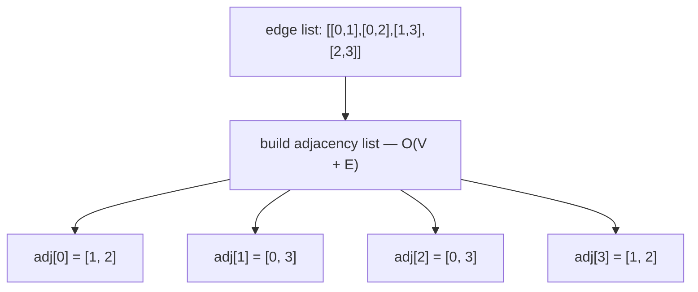
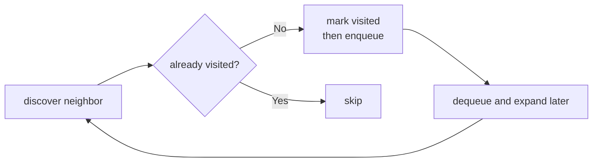
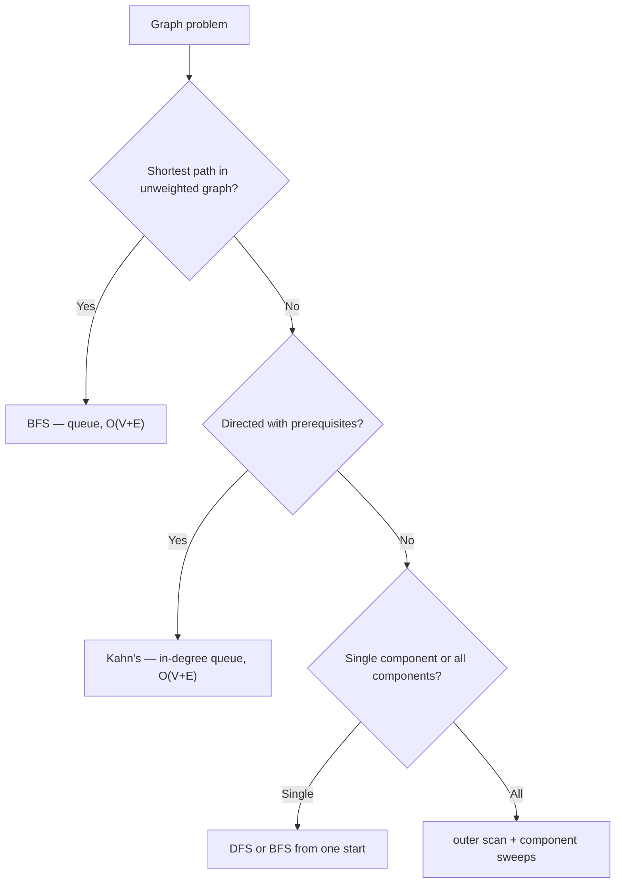
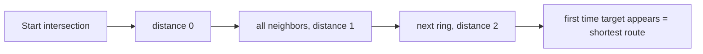
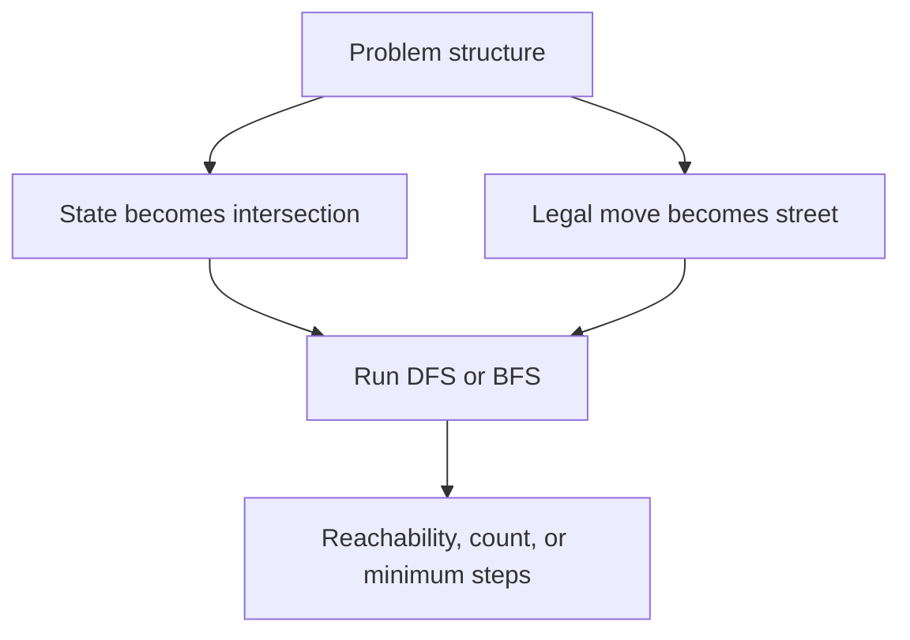
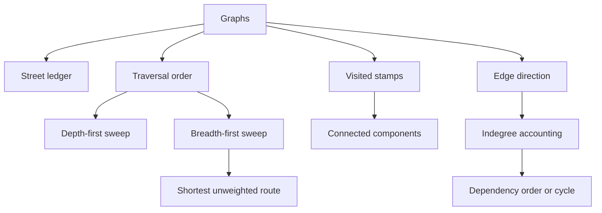
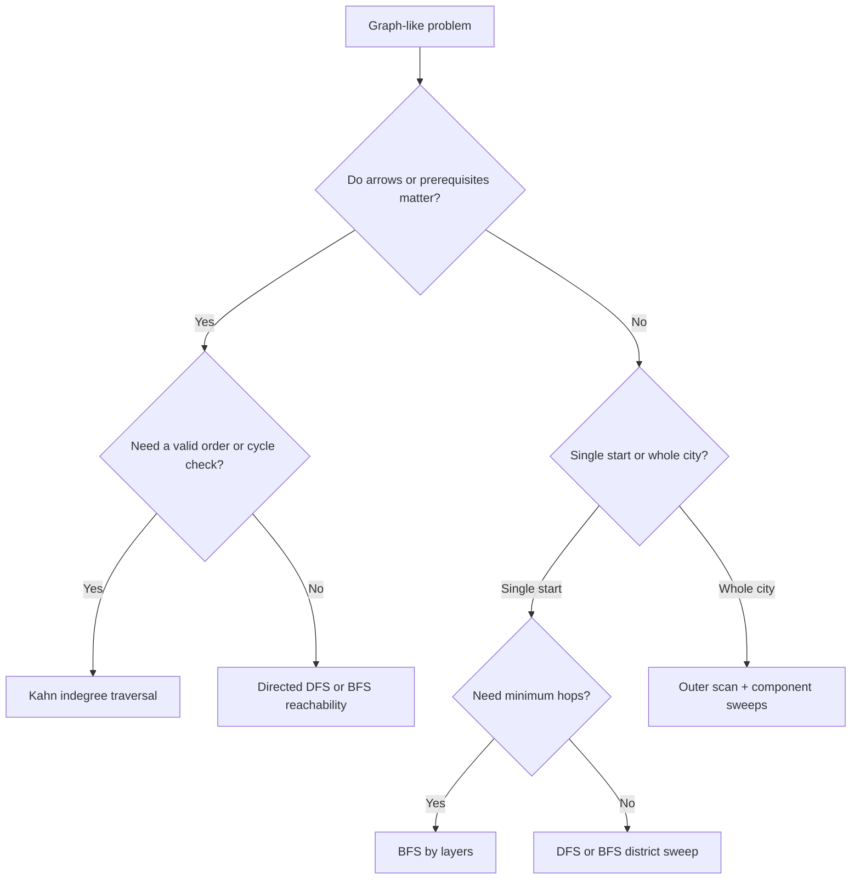

## Overview

Graphs are what arrays and trees turn into once the structure stops being a single line or a single rooted hierarchy. The brute-force trap is easy to fall into: from every intersection, try every road again and again, and the city explodes into repeated work. Graph thinking fixes that by turning the map into a ledger of neighbors plus a rule for when a street has already been accounted for.

You already know how arrays give you indexed storage, how hash maps remember what you have seen, and how stacks and queues change visit order. Graphs fuse those ideas into one system. This guide builds that in three stages: **Draw the Street Ledger**, **Sweep Every District**, and **Respect One-Way Streets**.

## Core Concept & Mental Model

### The City Map

A **node** is the basic unit of a graph — a location, a state, or an entity. Nodes have no inherent order; what matters is what they connect to. In the city map, a node is an intersection: a place you can stand.

An **edge** is a connection between two nodes. Edges can be **undirected** (the connection works both ways) or **directed** (the connection only works one way). In the city map, edges are streets — some run both ways, some are one-way arrows.

A graph is **unweighted** when edges simply exist or don't — every connection is treated equally, with no associated cost. A graph is **weighted** when each edge carries a numeric value (distance, time, fee). Most of the problems in this guide use unweighted graphs. BFS finds the shortest path only in unweighted graphs; weighted shortest paths require different algorithms (Dijkstra's, Bellman-Ford). In the city map, an unweighted street just connects two intersections. A weighted street has a travel time posted on it.

An **adjacency list** is the standard way to store a graph in code. Rather than keeping a flat edge list you have to scan repeatedly, each node gets its own list of neighbors. Building it is O(V + E). Looking up a node's neighbors is O(degree). In the city map, it is the street ledger: each intersection has a list of the streets leaving it.

A **visited set** tracks which nodes have already been processed so traversal never revisits them. Without it, traversal on any graph with cycles loops forever. This is the core invariant that makes graph traversal linear instead of exponential. In the city map, it is the stamp sheet: once an intersection is stamped, you do not send another expedition there.

A **connected component** is a maximal set of nodes where every node is reachable from every other. A graph can have one component or many — if it has more than one, no edge crosses the gap. In the city map, a component is a district: all the intersections reachable from one starting point.

**In-degree** is the count of directed edges pointing *into* a node. Each edge `A → B` adds 1 to B's in-degree. A node with in-degree 0 has no incoming edges — nothing points to it, so nothing needs to happen before it. In dependency graphs (course prerequisites, build steps, install order), a node's in-degree is the number of tasks that must finish before this one can start. Those tasks are its **prerequisites**. When all prerequisites are done, in-degree drops to zero and the node becomes safe to process. In the city map, in-degree counts the one-way arrows arriving at an intersection.

A **queue or stack** determines the order in which nodes are expanded. A queue (FIFO) gives BFS: nodes are processed level by level. A stack (LIFO) gives DFS: traversal goes as deep as possible before backtracking. In the city map, it is the dispatch line — the queue of intersections waiting to be explored.

### The Adjacency List

Graphs are usually given as an edge list: `[[0,1],[1,2],[2,3]]`. Scanning that list every time you need a node's neighbors costs O(E) per lookup. The adjacency list fixes this: build it once in O(V + E), then each neighbor lookup takes O(degree) time.

For an undirected graph, each edge `[a, b]` produces two entries — push `b` into `adj[a]` and push `a` into `adj[b]`. For a directed graph, only push `b` into `adj[from]`.



### Mark at Discovery, Not at Dispatch

The visited set works correctly only if nodes are marked when they enter the queue or stack — at discovery time — not when they are removed and processed. Marking at dispatch (pop time) lets the same node be enqueued once per incoming edge before it is ever processed. On any graph with multiple paths to the same node this produces duplicate work. On cyclic graphs it produces an infinite loop.

The fix is one line earlier: mark the node before pushing it, not after popping it.



### BFS, DFS, and Kahn's Algorithm

The same mark-and-expand loop powers three different traversal algorithms. The difference is the data structure driving the expansion and what the algorithm is trying to answer.

**BFS** uses a queue — FIFO — so it processes nodes in order of their discovery distance from the start. Every node at distance `d` is processed before any node at distance `d + 1`. This level-by-level guarantee is why BFS finds the shortest path in unweighted graphs: the first time a target node is dequeued, it was reached by the fewest possible edges.

**DFS** uses a stack — LIFO, or equivalently recursion — so it goes as deep as possible before backtracking. No shortest-path guarantee, but DFS is simpler to implement recursively and works well for reachability, cycle detection, and connected components.

**Kahn's algorithm** is a BFS variant for directed graphs with dependencies. Instead of seeding from a start node, it seeds the queue with every node whose in-degree is zero — no unresolved prerequisites. Processing a node decrements the in-degree of each of its neighbors. Any neighbor that hits zero joins the queue. If the total number of processed nodes equals `n`, the graph is acyclic and the processing order is valid. If any nodes remain unprocessed, they are locked in a cycle.



### How I Think Through This

Before I touch code, I ask one question: **am I finding what is reachable from one node, counting or measuring components across the whole graph, or ordering nodes in a directed graph that may have cycles?**

**When the problem gives me a start node:** One BFS or DFS sweep handles it. The only discipline is marking nodes at discovery, not dispatch, and keeping the queue or stack fed until it empties.

**When the graph may have multiple components:** One traversal from one node only covers one component. I add an outer loop over every node: if a node is already visited, skip it; if not, launch a full sweep from it. Each launch means I found a new component.

**When edges are directed and create dependencies:** I shift from reachability thinking to ordering thinking. Nodes with in-degree zero are safe to process immediately — nothing upstream is blocking them. Kahn's algorithm maintains that invariant as it processes each node and decrements the in-degrees of its neighbors. Processed count equal to `n` means the graph is a valid DAG. Less than `n` means a cycle is blocking the remainder.

The building blocks below work through those three situations.

**Scenario 1 — BFS from one start node**

**Graph:** undirected, unweighted
**Input:** `n = 5`, `edges = [[0,1],[0,2],[1,3],[2,3]]`, `start = 0`

Node 4 is isolated — no edges connect it. Nodes 0–3 form one component. Node 3 is reachable by two paths (0→1→3 and 0→2→3), but the visited set ensures node 3 is only enqueued once regardless of how many edges point to it.

:::trace-graph
[
  {
    "nodes": [
      {"id": "A", "label": "0", "x": 18, "y": 48, "tone": "current", "badge": "start"},
      {"id": "B", "label": "1", "x": 40, "y": 24, "tone": "frontier"},
      {"id": "C", "label": "2", "x": 40, "y": 66, "tone": "frontier"},
      {"id": "D", "label": "3", "x": 66, "y": 48, "tone": "default"},
      {"id": "E", "label": "4", "x": 86, "y": 48, "tone": "muted"}
    ],
    "edges": [
      {"from": "A", "to": "B", "tone": "active"},
      {"from": "A", "to": "C", "tone": "active"},
      {"from": "B", "to": "D", "tone": "queued"},
      {"from": "C", "to": "D", "tone": "default"}
    ],
    "facts": [
      {"name": "queue", "value": "[0]", "tone": "orange"},
      {"name": "visited", "value": "{0}", "tone": "green"}
    ],
    "action": "visit",
    "label": "Start at 0. Mark visited, enqueue neighbors 1 and 2."
  },
  {
    "nodes": [
      {"id": "A", "label": "0", "x": 18, "y": 48, "tone": "visited"},
      {"id": "B", "label": "1", "x": 40, "y": 24, "tone": "visited"},
      {"id": "C", "label": "2", "x": 40, "y": 66, "tone": "visited"},
      {"id": "D", "label": "3", "x": 66, "y": 48, "tone": "current", "badge": "once"},
      {"id": "E", "label": "4", "x": 86, "y": 48, "tone": "muted"}
    ],
    "edges": [
      {"from": "A", "to": "B", "tone": "traversed"},
      {"from": "A", "to": "C", "tone": "traversed"},
      {"from": "B", "to": "D", "tone": "active"},
      {"from": "C", "to": "D", "tone": "traversed"}
    ],
    "facts": [
      {"name": "queue", "value": "[3]", "tone": "orange"},
      {"name": "visited", "value": "{0,1,2,3}", "tone": "green"}
    ],
    "action": "mark",
    "label": "3 discovered via 1, marked visited. When 2's neighbor check reaches 3, it is already visited — skip. 3 enters the queue exactly once."
  },
  {
    "nodes": [
      {"id": "A", "label": "0", "x": 18, "y": 48, "tone": "done"},
      {"id": "B", "label": "1", "x": 40, "y": 24, "tone": "done"},
      {"id": "C", "label": "2", "x": 40, "y": 66, "tone": "done"},
      {"id": "D", "label": "3", "x": 66, "y": 48, "tone": "done"},
      {"id": "E", "label": "4", "x": 86, "y": 48, "tone": "muted"}
    ],
    "edges": [
      {"from": "A", "to": "B", "tone": "traversed"},
      {"from": "A", "to": "C", "tone": "traversed"},
      {"from": "B", "to": "D", "tone": "traversed"},
      {"from": "C", "to": "D", "tone": "traversed"}
    ],
    "facts": [
      {"name": "visited", "value": "{0,1,2,3}", "tone": "green"},
      {"name": "unreachable", "value": "{4}", "tone": "muted"}
    ],
    "action": "done",
    "label": "Queue empty. {0,1,2,3} are reachable from node 0. Node 4 is isolated — BFS from 0 never reaches it."
  }
]
:::

**Scenario 2 — Multiple components, outer scan**

**Graph:** undirected, unweighted
**Input:** `n = 5`, `edges = [[0,1],[0,2],[3,4]]`

No edge crosses between {0,1,2} and {3,4} — two separate components. The outer scan loops over all nodes 0–4. It skips any node already visited. When it reaches 3 and finds it unvisited, that signals a new component. Each launch of the inner BFS covers exactly one component.

:::trace-graph
[
  {
    "nodes": [
      {"id": "A", "label": "A", "x": 20, "y": 38, "tone": "done"},
      {"id": "B", "label": "B", "x": 42, "y": 38, "tone": "done"},
      {"id": "C", "label": "C", "x": 30, "y": 68, "tone": "done"},
      {"id": "D", "label": "D", "x": 70, "y": 38, "tone": "current", "badge": "new"},
      {"id": "E", "label": "E", "x": 86, "y": 62, "tone": "frontier"}
    ],
    "edges": [
      {"from": "A", "to": "B", "tone": "traversed"},
      {"from": "A", "to": "C", "tone": "traversed"},
      {"from": "D", "to": "E", "tone": "active"}
    ],
    "facts": [
      {"name": "districts counted", "value": 2, "tone": "purple"},
      {"name": "outer scan", "value": "first unstamped = D", "tone": "blue"}
    ],
    "action": "queue",
    "label": "After finishing A-B-C, the outer scan keeps moving. D is the first unstamped intersection, so that means a second district."
  },
  {
    "nodes": [
      {"id": "A", "label": "A", "x": 20, "y": 38, "tone": "done"},
      {"id": "B", "label": "B", "x": 42, "y": 38, "tone": "done"},
      {"id": "C", "label": "C", "x": 30, "y": 68, "tone": "done"},
      {"id": "D", "label": "D", "x": 70, "y": 38, "tone": "visited"},
      {"id": "E", "label": "E", "x": 86, "y": 62, "tone": "current", "badge": "sweep"}
    ],
    "edges": [
      {"from": "A", "to": "B", "tone": "traversed"},
      {"from": "A", "to": "C", "tone": "traversed"},
      {"from": "D", "to": "E", "tone": "active"}
    ],
    "facts": [
      {"name": "dispatch line", "value": "[E]", "tone": "orange"},
      {"name": "stamped", "value": "{A,B,C,D,E}", "tone": "green"}
    ],
    "action": "expand",
    "label": "That second sweep covers D and E. The two districts are counted once each, not once per road."
  },
  {
    "nodes": [
      {"id": "A", "label": "A", "x": 20, "y": 38, "tone": "done"},
      {"id": "B", "label": "B", "x": 42, "y": 38, "tone": "done"},
      {"id": "C", "label": "C", "x": 30, "y": 68, "tone": "done"},
      {"id": "D", "label": "D", "x": 70, "y": 38, "tone": "done"},
      {"id": "E", "label": "E", "x": 86, "y": 62, "tone": "done"}
    ],
    "edges": [
      {"from": "A", "to": "B", "tone": "traversed"},
      {"from": "A", "to": "C", "tone": "traversed"},
      {"from": "D", "to": "E", "tone": "traversed"}
    ],
    "facts": [
      {"name": "final districts", "value": 2, "tone": "green"}
    ],
    "action": "done",
    "label": "The whole city is covered after the outer scan plus two district sweeps."
  }
]
:::

**Scenario 3 — Directed graph, Kahn's topological sort**

**Graph:** directed, unweighted
**Input:** `n = 4`, `edges = [[0,1],[0,2],[1,3],[2,3]]` (directed: `[from, to]`)

In-degrees: node 0 = 0, node 1 = 1, node 2 = 1, node 3 = 2. Kahn's seeds the queue with every node whose in-degree is 0 — only node 0. Processing node 0 removes its two outgoing edges, decrementing nodes 1 and 2 to in-degree 0. Both become ready. When they are processed, node 3 drops to 0 and becomes the final dispatch.

The trace uses task labels (P, C, K, S) to make the dependency relationship easier to read — P must happen before C and K, and both must finish before S.

:::trace-graph
[
  {
    "nodes": [
      {"id": "Prep", "label": "P", "x": 16, "y": 50, "tone": "frontier", "badge": "0 in"},
      {"id": "Cook", "label": "C", "x": 40, "y": 26, "tone": "default", "badge": "1 in"},
      {"id": "Pack", "label": "K", "x": 40, "y": 66, "tone": "default", "badge": "1 in"},
      {"id": "Ship", "label": "S", "x": 72, "y": 50, "tone": "default", "badge": "2 in"}
    ],
    "edges": [
      {"from": "Prep", "to": "Cook", "tone": "queued", "directed": true},
      {"from": "Prep", "to": "Pack", "tone": "queued", "directed": true},
      {"from": "Cook", "to": "Ship", "tone": "default", "directed": true},
      {"from": "Pack", "to": "Ship", "tone": "default", "directed": true}
    ],
    "facts": [
      {"name": "ready now", "value": "[Prep]", "tone": "orange"},
      {"name": "remaining arrows", "value": 4, "tone": "blue"}
    ],
    "action": "queue",
    "label": "Prep has no unfinished incoming arrows, so it is safe to dispatch first."
  },
  {
    "nodes": [
      {"id": "Prep", "label": "P", "x": 16, "y": 50, "tone": "visited"},
      {"id": "Cook", "label": "C", "x": 40, "y": 26, "tone": "frontier", "badge": "0 in"},
      {"id": "Pack", "label": "K", "x": 40, "y": 66, "tone": "frontier", "badge": "0 in"},
      {"id": "Ship", "label": "S", "x": 72, "y": 50, "tone": "default", "badge": "2 in"}
    ],
    "edges": [
      {"from": "Prep", "to": "Cook", "tone": "traversed", "directed": true},
      {"from": "Prep", "to": "Pack", "tone": "traversed", "directed": true},
      {"from": "Cook", "to": "Ship", "tone": "queued", "directed": true},
      {"from": "Pack", "to": "Ship", "tone": "queued", "directed": true}
    ],
    "facts": [
      {"name": "ready now", "value": "[Cook, Pack]", "tone": "orange"},
      {"name": "order so far", "value": "[Prep]", "tone": "green"}
    ],
    "action": "expand",
    "label": "Processing Prep removes its arrows. Cook and Pack now drop to zero incoming arrows and become safe."
  },
  {
    "nodes": [
      {"id": "Prep", "label": "P", "x": 16, "y": 50, "tone": "done"},
      {"id": "Cook", "label": "C", "x": 40, "y": 26, "tone": "done"},
      {"id": "Pack", "label": "K", "x": 40, "y": 66, "tone": "done"},
      {"id": "Ship", "label": "S", "x": 72, "y": 50, "tone": "answer", "badge": "0 in"}
    ],
    "edges": [
      {"from": "Prep", "to": "Cook", "tone": "traversed", "directed": true},
      {"from": "Prep", "to": "Pack", "tone": "traversed", "directed": true},
      {"from": "Cook", "to": "Ship", "tone": "traversed", "directed": true},
      {"from": "Pack", "to": "Ship", "tone": "traversed", "directed": true}
    ],
    "facts": [
      {"name": "valid order", "value": "[Prep, Cook, Pack, Ship]", "tone": "green"}
    ],
    "action": "done",
    "label": "Once Cook and Pack finish, Ship becomes safe. Every intersection is dispatched, so there is no dependency loop."
  }
]
:::

---

## Building Blocks: Progressive Learning

### Level 1: Draw the Street Ledger

Suppose the city says, "Start at intersection 0 and report every place reachable from it." The brute-force instinct is to keep scanning the whole road list every time you stand at a new intersection. On a map with ten thousand roads, that means doing the same lookup work again and again just to rediscover neighboring streets you already saw before.

The exploitable property is that graph movement is local. Once you rewrite the road list into a street ledger, each intersection can answer the only question that matters at that moment: who are my immediate neighbors? Pair that with a stamp sheet, and every neighbor lookup becomes cheap while every repeated arrival becomes harmless because a stamped intersection is skipped immediately.

Mechanically, you first draw the ledger so each intersection points to its outgoing streets. Then you seed the dispatch line with one start intersection, stamp it, and repeatedly pull the next intersection to expand. For each neighbor in its ledger entry, if the neighbor is not stamped yet, you stamp it immediately and add it to the line. The sweep stops when the line empties, and the stamped set is the whole reachable district.

Use intersections `0-1`, `0-2`, `1-3`, `2-3`, `3-4` and start from `0`.

:::trace-graph
[
  {
    "nodes": [
      {"id": "0", "label": "0", "x": 16, "y": 50, "tone": "current", "badge": "start"},
      {"id": "1", "label": "1", "x": 38, "y": 24, "tone": "frontier"},
      {"id": "2", "label": "2", "x": 38, "y": 66, "tone": "frontier"},
      {"id": "3", "label": "3", "x": 64, "y": 50, "tone": "default"},
      {"id": "4", "label": "4", "x": 86, "y": 50, "tone": "default"}
    ],
    "edges": [
      {"from": "0", "to": "1", "tone": "active"},
      {"from": "0", "to": "2", "tone": "active"},
      {"from": "1", "to": "3", "tone": "default"},
      {"from": "2", "to": "3", "tone": "default"},
      {"from": "3", "to": "4", "tone": "default"}
    ],
    "facts": [
      {"name": "street ledger", "value": "0:[1,2]", "tone": "blue"},
      {"name": "dispatch line", "value": "[0]", "tone": "orange"}
    ],
    "action": "visit",
    "label": "The ledger turns road scanning into neighbor lookup. From 0, the next legal expansions are 1 and 2."
  },
  {
    "nodes": [
      {"id": "0", "label": "0", "x": 16, "y": 50, "tone": "visited"},
      {"id": "1", "label": "1", "x": 38, "y": 24, "tone": "visited"},
      {"id": "2", "label": "2", "x": 38, "y": 66, "tone": "visited"},
      {"id": "3", "label": "3", "x": 64, "y": 50, "tone": "current", "badge": "new"},
      {"id": "4", "label": "4", "x": 86, "y": 50, "tone": "default"}
    ],
    "edges": [
      {"from": "0", "to": "1", "tone": "traversed"},
      {"from": "0", "to": "2", "tone": "traversed"},
      {"from": "1", "to": "3", "tone": "active"},
      {"from": "2", "to": "3", "tone": "traversed"},
      {"from": "3", "to": "4", "tone": "queued"}
    ],
    "facts": [
      {"name": "stamped", "value": "{0,1,2,3}", "tone": "green"},
      {"name": "dispatch line", "value": "[3]", "tone": "orange"}
    ],
    "action": "mark",
    "label": "Intersection 3 is stamped the first time it is discovered. The second road into 3 does not create duplicate work."
  },
  {
    "nodes": [
      {"id": "0", "label": "0", "x": 16, "y": 50, "tone": "done"},
      {"id": "1", "label": "1", "x": 38, "y": 24, "tone": "done"},
      {"id": "2", "label": "2", "x": 38, "y": 66, "tone": "done"},
      {"id": "3", "label": "3", "x": 64, "y": 50, "tone": "done"},
      {"id": "4", "label": "4", "x": 86, "y": 50, "tone": "answer", "badge": "last"}
    ],
    "edges": [
      {"from": "0", "to": "1", "tone": "traversed"},
      {"from": "0", "to": "2", "tone": "traversed"},
      {"from": "1", "to": "3", "tone": "traversed"},
      {"from": "2", "to": "3", "tone": "traversed"},
      {"from": "3", "to": "4", "tone": "traversed"}
    ],
    "facts": [
      {"name": "reachable district", "value": "{0,1,2,3,4}", "tone": "green"}
    ],
    "action": "done",
    "label": "When the dispatch line empties, the stamped set is exactly the reachable district from 0."
  }
]
:::

#### **Exercise 1**

You're given `n` nodes (labeled `0` to `n-1`) and a flat edge list like `[[0,1],[0,2],[1,3]]`. The goal is a structure where `adj[node]` gives you all of that node's neighbors directly, without scanning the whole edge list.

Start by allocating `n` empty arrays — one bucket per node:

```typescript
const adj: number[][] = Array.from({ length: n }, () => []);
```

Then walk every edge. For each `[a, b]`, `b` is a neighbor of `a`. Because this graph is undirected, the reverse is also true. What does the push into `adj[b]` look like?

:::stackblitz{step=1 total=3 exercises="step1-exercise1-problem.ts" solutions="step1-exercise1-solution.ts"}

#### **Exercise 2**

The BFS loop needs three pieces of state before it starts: a visited array, a queue seeded with the start node, and a result collector. The order of operations at setup matters — start must be marked visited before the loop, not inside it.

```typescript
const visited = new Array(n).fill(false);
const queue = [start];
visited[start] = true;  // mark at enqueue time, not dequeue
const result: number[] = [];
```

The loop itself has a fixed shape: pull one node off the front, record it, then look at its neighbors. You do not need to decide what to do with neighbors yet — just get the loop running first.

```typescript
while (queue.length > 0) {
  const node = queue.shift();
  result.push(node);
  // expand neighbors here
}
```

For each neighbor, the question is one check: has it been visited? If not, two things happen — in a specific order. What is the right order, and why does it matter?

:::stackblitz{step=1 total=3 exercises="step1-exercise2-problem.ts" solutions="step1-exercise2-solution.ts"}

#### **Exercise 3**

The loop from Exercise 2 does not change. One line is added: after dequeuing a node, check whether it is the target before expanding neighbors. If it matches, you are done.

```typescript
const node = queue.shift();
if (node === target) return true;
// neighbor expansion same as Exercise 2
```

If the queue empties without a match, what do you return?

:::stackblitz{step=1 total=3 exercises="step1-exercise3-problem.ts" solutions="step1-exercise3-solution.ts"}

> **Mental anchor**: One district sweep needs three things only: a street ledger, a stamp sheet, and a rule that every intersection enters the line once.

**→ Bridge to Level 2**: Level 1 assumes the city is one connected place from the chosen start. The moment the map contains multiple disconnected districts, one perfect sweep is still only one district, so you need an outer scan that knows when to launch a fresh traversal.

### Level 2: Sweep Every District

Level 1 gave you a clean way to cover one reachable district. Now the problem changes shape: the city may contain several disconnected districts, and the question asks about the whole map. A brute-force response is to start a fresh traversal from every intersection. That works, but it repeats the same district many times. On a graph with six districts and thousands of intersections, that repeated restarting is the real waste.

The exploitable property is that one traversal already covers an entire district. Once a district sweep finishes, every stamped intersection inside it is globally settled. That means the only starts that matter are the first unstamped intersections you encounter during an outer scan. Each of those starts is proof that you have discovered a brand-new district.

Mechanically, you keep the exact same inner traversal from Level 1. The only new control flow is an outer loop from `0` through `n - 1`. If the current intersection is already stamped, skip it because its district is done. If it is unstamped, increment the district counter, launch one full sweep from it, and let that traversal stamp the entire component before continuing the scan.

Use districts `0-1-2`, `3-4`, and isolated `5`.

:::trace-graph
[
  {
    "nodes": [
      {"id": "0", "label": "0", "x": 14, "y": 42, "tone": "done"},
      {"id": "1", "label": "1", "x": 30, "y": 26, "tone": "done"},
      {"id": "2", "label": "2", "x": 30, "y": 58, "tone": "done"},
      {"id": "3", "label": "3", "x": 58, "y": 42, "tone": "current", "badge": "new"},
      {"id": "4", "label": "4", "x": 76, "y": 42, "tone": "frontier"},
      {"id": "5", "label": "5", "x": 88, "y": 65, "tone": "default"}
    ],
    "edges": [
      {"from": "0", "to": "1", "tone": "traversed"},
      {"from": "1", "to": "2", "tone": "traversed"},
      {"from": "3", "to": "4", "tone": "active"}
    ],
    "facts": [
      {"name": "districts", "value": 2, "tone": "purple"},
      {"name": "outer scan", "value": "first unstamped = 3", "tone": "blue"}
    ],
    "action": "queue",
    "label": "The outer scan skips 0, 1, and 2 because their district is already finished. Hitting 3 means a second district begins."
  },
  {
    "nodes": [
      {"id": "0", "label": "0", "x": 14, "y": 42, "tone": "done"},
      {"id": "1", "label": "1", "x": 30, "y": 26, "tone": "done"},
      {"id": "2", "label": "2", "x": 30, "y": 58, "tone": "done"},
      {"id": "3", "label": "3", "x": 58, "y": 42, "tone": "done"},
      {"id": "4", "label": "4", "x": 76, "y": 42, "tone": "done"},
      {"id": "5", "label": "5", "x": 88, "y": 65, "tone": "current", "badge": "solo"}
    ],
    "edges": [
      {"from": "0", "to": "1", "tone": "traversed"},
      {"from": "1", "to": "2", "tone": "traversed"},
      {"from": "3", "to": "4", "tone": "traversed"}
    ],
    "facts": [
      {"name": "districts", "value": 3, "tone": "purple"},
      {"name": "outer scan", "value": "first unstamped = 5", "tone": "blue"}
    ],
    "action": "expand",
    "label": "Intersection 5 has no roads, but it is still its own district. One empty sweep counts it exactly once."
  },
  {
    "nodes": [
      {"id": "0", "label": "0", "x": 14, "y": 42, "tone": "done"},
      {"id": "1", "label": "1", "x": 30, "y": 26, "tone": "done"},
      {"id": "2", "label": "2", "x": 30, "y": 58, "tone": "done"},
      {"id": "3", "label": "3", "x": 58, "y": 42, "tone": "done"},
      {"id": "4", "label": "4", "x": 76, "y": 42, "tone": "done"},
      {"id": "5", "label": "5", "x": 88, "y": 65, "tone": "answer", "badge": "3"}
    ],
    "edges": [
      {"from": "0", "to": "1", "tone": "traversed"},
      {"from": "1", "to": "2", "tone": "traversed"},
      {"from": "3", "to": "4", "tone": "traversed"}
    ],
    "facts": [
      {"name": "final districts", "value": 3, "tone": "green"}
    ],
    "action": "done",
    "label": "Outer scan plus district sweeps counts all components, including isolated intersections."
  }
]
:::

> [!TIP]
> In disconnected-graph problems, the inner traversal does not change. Almost every bug comes from the outer scan: either forgetting to skip stamped intersections or forgetting that an isolated node is still a full district.

#### **Exercise 1**

The BFS from Level 1 does not change. What changes is the frame around it — an outer loop that scans every node and decides whether to launch a fresh sweep.

```typescript
for (let i = 0; i < n; i++) {
  if (visited[i]) continue;  // already covered by a previous sweep
  // what happens when you find an unvisited node?
}
```

Each time you reach an unvisited node, that is a new component. Launch the full BFS from it. The BFS will mark everything reachable, so the next iteration of the outer loop will skip all of those nodes automatically.

:::stackblitz{step=2 total=3 exercises="step2-exercise1-problem.ts" solutions="step2-exercise1-solution.ts"}

#### **Exercise 2**

The outer loop is identical to Exercise 1. The difference is what you measure during each BFS sweep: the number of nodes visited. Add a counter inside the BFS and increment it each time you dequeue a node — dequeue, not enqueue, because each node is processed exactly once.

```typescript
let size = 0;
while (queue.length > 0) {
  const node = queue.shift();
  size++;  // count here — after pulling from queue
  // neighbor expansion same as Level 1
}
```

After each sweep finishes, how do you decide whether this component is larger than any you've seen before?

:::stackblitz{step=2 total=3 exercises="step2-exercise2-problem.ts" solutions="step2-exercise2-solution.ts"}

#### **Exercise 3**

Same outer loop and same size-counting BFS as Exercise 2. The only change: instead of keeping a single running maximum, push each component's size into an array. Sort the array before returning.

What replaces `largest = Math.max(largest, size)`?

:::stackblitz{step=2 total=3 exercises="step2-exercise3-problem.ts" solutions="step2-exercise3-solution.ts"}

> **Mental anchor**: A new district is not "an unstamped road," it is "the first unstamped intersection the outer scan finds."

**→ Bridge to Level 3**: Level 2 still treats every road as symmetric. Once streets become one-way, reachability is no longer enough. The map starts encoding prerequisites, and the next question becomes which intersections are safe to dispatch before others.

### Level 3: Respect One-Way Streets

Level 2 let you count districts, but it does not tell you how to schedule work when roads are arrows. Imagine package steps where `Prep -> Cook`, `Prep -> Pack`, and both `Cook -> Ship` and `Pack -> Ship`. A brute-force attempt would repeatedly scan every arrow asking, "is this now allowed?" That works, but it burns time rescanning blocked steps that have not changed yet.

The exploitable property is that an intersection with zero unfinished incoming arrows is safe right now. Nothing upstream can still delay it. Instead of guessing a legal order, you track how many incoming arrows each intersection still has. Every time you dispatch a zero-arrow intersection, you remove its outgoing arrows from the ledger. Some neighbors then drop to zero and become newly safe.

Mechanically, you build a directed street ledger plus an indegree count for every intersection. Seed the dispatch line with all intersections whose indegree is zero. Repeatedly pop one, append it to the answer, and subtract one from each outgoing neighbor's indegree. If a neighbor drops to zero, push it into the line. When the line empties, if you processed all intersections, the order is valid. If some intersections remain unprocessed, those intersections are trapped in a cycle of mutual dependency.

Use arrows `0 -> 1`, `0 -> 2`, `1 -> 3`, `2 -> 3`.

:::trace-graph
[
  {
    "nodes": [
      {"id": "0", "label": "0", "x": 14, "y": 50, "tone": "frontier", "badge": "0 in"},
      {"id": "1", "label": "1", "x": 40, "y": 26, "tone": "default", "badge": "1 in"},
      {"id": "2", "label": "2", "x": 40, "y": 66, "tone": "default", "badge": "1 in"},
      {"id": "3", "label": "3", "x": 74, "y": 50, "tone": "default", "badge": "2 in"}
    ],
    "edges": [
      {"from": "0", "to": "1", "tone": "queued", "directed": true},
      {"from": "0", "to": "2", "tone": "queued", "directed": true},
      {"from": "1", "to": "3", "tone": "default", "directed": true},
      {"from": "2", "to": "3", "tone": "default", "directed": true}
    ],
    "facts": [
      {"name": "dispatch line", "value": "[0]", "tone": "orange"},
      {"name": "order", "value": "[]", "tone": "blue"}
    ],
    "action": "queue",
    "label": "Only 0 has no unfinished incoming arrows, so the order must begin there."
  },
  {
    "nodes": [
      {"id": "0", "label": "0", "x": 14, "y": 50, "tone": "visited"},
      {"id": "1", "label": "1", "x": 40, "y": 26, "tone": "frontier", "badge": "0 in"},
      {"id": "2", "label": "2", "x": 40, "y": 66, "tone": "frontier", "badge": "0 in"},
      {"id": "3", "label": "3", "x": 74, "y": 50, "tone": "default", "badge": "2 in"}
    ],
    "edges": [
      {"from": "0", "to": "1", "tone": "traversed", "directed": true},
      {"from": "0", "to": "2", "tone": "traversed", "directed": true},
      {"from": "1", "to": "3", "tone": "queued", "directed": true},
      {"from": "2", "to": "3", "tone": "queued", "directed": true}
    ],
    "facts": [
      {"name": "dispatch line", "value": "[1,2]", "tone": "orange"},
      {"name": "order", "value": "[0]", "tone": "green"}
    ],
    "action": "expand",
    "label": "Removing 0's outgoing arrows frees both 1 and 2. They can be dispatched in either order."
  },
  {
    "nodes": [
      {"id": "0", "label": "0", "x": 14, "y": 50, "tone": "done"},
      {"id": "1", "label": "1", "x": 40, "y": 26, "tone": "done"},
      {"id": "2", "label": "2", "x": 40, "y": 66, "tone": "done"},
      {"id": "3", "label": "3", "x": 74, "y": 50, "tone": "answer", "badge": "0 in"}
    ],
    "edges": [
      {"from": "0", "to": "1", "tone": "traversed", "directed": true},
      {"from": "0", "to": "2", "tone": "traversed", "directed": true},
      {"from": "1", "to": "3", "tone": "traversed", "directed": true},
      {"from": "2", "to": "3", "tone": "traversed", "directed": true}
    ],
    "facts": [
      {"name": "valid order", "value": "[0,1,2,3]", "tone": "green"}
    ],
    "action": "done",
    "label": "After 1 and 2 finish, 3 drops to zero incoming arrows. Processing all nodes means there is no cycle."
  }
]
:::

#### **Exercise 1**

Kahn's setup differs from Levels 1 and 2 in one structural way: edges are directed, so you only push one direction into the adjacency list. You also need a second array — `indegree` — that tracks how many edges point into each node.

```typescript
const indegree = new Array(n).fill(0);
for (const [from, to] of edges) {
  adj[from].push(to);  // directed: no reverse entry
  indegree[to]++;      // one more arrow pointing into "to"
}
```

Before the loop starts, seed the queue with every node whose `indegree` is 0 — nothing is blocking them. Inside the loop, each time you process a node, decrement the indegree of each of its neighbors. If a neighbor hits 0, it becomes ready.

After the loop ends, how do you know whether a cycle exists?

:::stackblitz{step=3 total=3 exercises="step3-exercise1-problem.ts" solutions="step3-exercise1-solution.ts"}

#### **Exercise 2**

The setup is the same as Exercise 1. The only difference is what you track during the loop: instead of just counting processed nodes, collect them in the order they are dequeued.

```typescript
const order: number[] = [];
// inside the loop, alongside your indegree decrement:
order.push(node);
```

At the end, the length of `order` tells you whether a cycle blocked any nodes. What do you return in each case?

:::stackblitz{step=3 total=3 exercises="step3-exercise2-problem.ts" solutions="step3-exercise2-solution.ts"}

#### **Exercise 3**

Instead of processing one node per loop iteration, process all currently-ready nodes as a group — a wave. Every node in a wave has in-degree 0 at the same moment, so they could all run in parallel.

```typescript
let current = /* nodes with indegree 0 at the start */;

while (current.length > 0) {
  // record this wave, then compute the next one
  const next: number[] = [];
  for (const node of current) {
    // decrement neighbors — if any hit 0, add to next
  }
  current = next;
}
```

The outer `while` loop advances one wave at a time. After it finishes, check whether all nodes were processed before returning your waves.

:::stackblitz{step=3 total=3 exercises="step3-exercise3-problem.ts" solutions="step3-exercise3-solution.ts"}

> **Mental anchor**: In a one-way city, zero incoming arrows means "safe now," and processed count tells you whether a hidden loop survived.

## Key Patterns

### Pattern: Shortest Route in an Unweighted City

**When to use**: the problem asks for the minimum number of streets, hops, or moves in an unweighted graph. Recognition phrases include "fewest moves," "minimum edges," "shortest path in an unweighted network," and "what is the first time we can reach the target?"

**How to think about it**: the city map now cares about distance, not just reachability. BFS works because it expands the city in rings. Every intersection pulled from the queue belongs to the earliest possible ring in which it could have been discovered. That means the first time the target is stamped, you already know its minimum hop count.



**Complexity**: Time O(V + E), Space O(V), because each intersection is enqueued once and each street is inspected when its source is expanded.

### Pattern: The Graph Hidden Inside Another Structure

**When to use**: the input is not literally called a graph, but you can move from one state to another by a fixed rule. Recognition phrases include "grid of land cells," "word transformation," "state machine," "minimum moves on a board," and "neighbors differ by one legal move."

**How to think about it**: the graph is still there, just implicit. A cell, word, or board state is an intersection, and a legal move generates streets on demand. You do not need to prebuild every edge if neighbor generation is cheap. The same traversal rules survive: stamp once, expand legal neighbors, and let the problem's structure decide whether you want one district, all districts, or shortest route layers.



**Complexity**: Usually Time O(number of reachable states × neighbors per state), Space O(number of stamped states). The exact constants depend on how expensive it is to generate neighbors.

---

## Decision Framework

**Concept Map**



**Complexity table**

| Technique | Time | Space | Why |
|-----------|------|-------|-----|
| Build adjacency list | O(V + E) | O(V + E) | Every road is recorded once or twice depending on direction |
| DFS/BFS from one start | O(V + E) | O(V) | Each reachable intersection is stamped once |
| Connected components scan | O(V + E) | O(V) | Outer scan plus one sweep per district |
| Unweighted shortest path BFS | O(V + E) | O(V) | Queue explores the graph in distance layers |
| Kahn topological order | O(V + E) | O(V) | Every arrow reduces one indegree exactly once |

**Decision tree**



**Recognition signals table**

| Problem signal | Technique |
|----------------|-----------|
| "reachable from start", "same network", "flood this area" | Single DFS/BFS sweep |
| "how many groups", "count provinces", "separate districts" | Outer scan + connected components |
| "fewest moves", "minimum hops", "nearest target" | BFS layers |
| "must happen before", "dependency order", "cycle in prerequisites" | Kahn indegree traversal |
| "grid or word states with legal moves" | Treat it as an implicit graph, then choose DFS or BFS |

**When NOT to use**: do not force graph traversal onto problems where the structure is really a contiguous window, a sorted array, or a tree with a fixed root and parent-child meaning. If the input already has a stronger structure that removes arbitrary connections, use that narrower technique first.

## Common Gotchas & Edge Cases

**Gotcha 1: Forgetting the reverse street in an undirected map**

Your traversal quietly misses half the city because one side of each two-way road was never written into the ledger. The bug usually appears on maps where the only route to a district uses the missing reverse street.

Why it is tempting: the road list already "looks symmetric," so it feels like one append should be enough.

Fix: for every undirected road `[a, b]`, append `b` to `ledger[a]` and `a` to `ledger[b]`.

**Gotcha 2: Stamping too late**

The same intersection enters the dispatch line multiple times, and on cyclic maps the queue or stack grows with duplicates even though the answer might still look almost correct.

Why it is tempting: it feels natural to stamp only when you pop an intersection for work.

Fix: stamp at discovery time, right before pushing into the queue or stack. That guarantees one scheduled visit per intersection.

**Gotcha 3: Restarting the same district during component counting**

Your district count becomes too large because the outer scan launches a new sweep from an intersection that was already covered by a previous sweep.

Why it is tempting: the inner traversal is correct, so it is easy to forget the outer loop needs its own skip rule.

Fix: in the outer scan, `continue` immediately when an intersection is already stamped.

**Gotcha 4: Treating a directed problem like an undirected one**

A dependency order appears valid even though it violates prerequisites, or a cycle slips through because direction was discarded.

Why it is tempting: the same pair representation `[from, to]` is used in both graph types.

Fix: keep directed edges one-way in the ledger, track indegrees, and verify that the processed count matches `n`.

**Edge cases to always check**

- Empty graph or `n = 0`: return the neutral answer immediately.
- Single intersection with no roads: it is reachable from itself, it counts as one district, and it is a valid topological order of length one.
- Duplicate roads: visited logic should prevent repeated scheduling even if the ledger contains repeated neighbors.
- Self-loop `u -> u`: this is an immediate directed cycle.
- Isolated intersections mixed with larger districts: component counting must include the isolated ones.

**Debugging tips**

- Print the built street ledger first. If the neighbors are wrong, every later traversal bug is downstream noise.
- During DFS or BFS, print the dispatch line plus the stamped set after each expansion. Duplicates usually show up there first.
- For component problems, print the outer-loop index whenever you launch a new sweep. If launches happen inside an already stamped district, the count bug is in the scan logic.
- For topological problems, print the indegree array after each processed node. A node that never drops to zero usually points to the blocking cycle or to a missed decrement.
