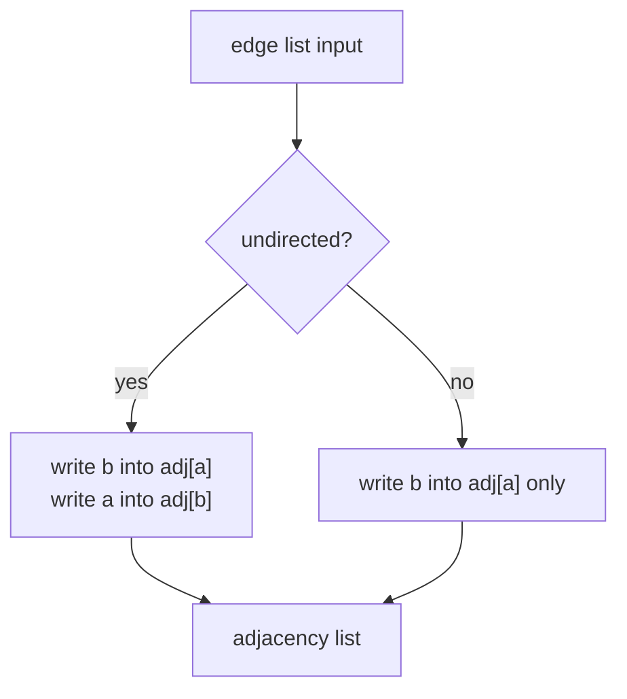
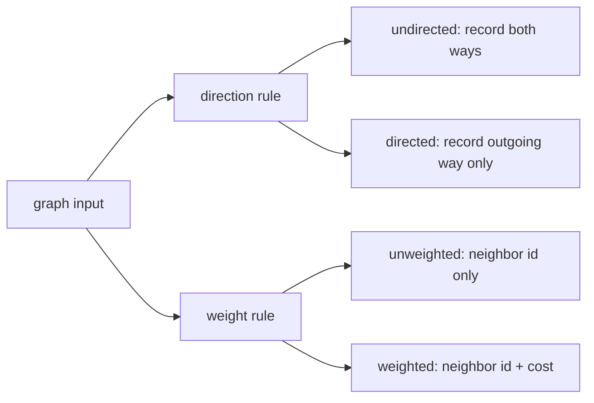
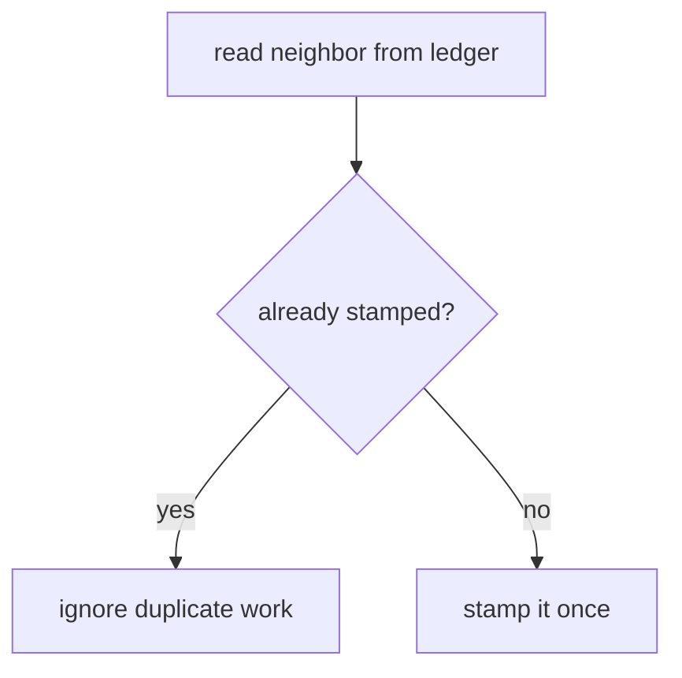
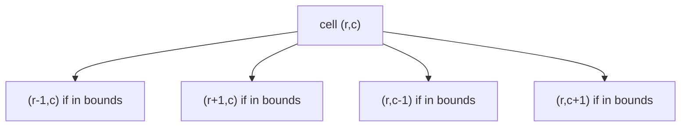
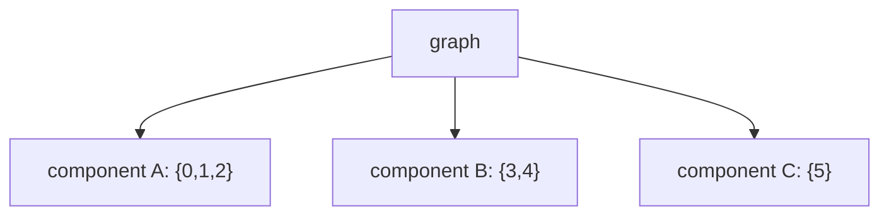
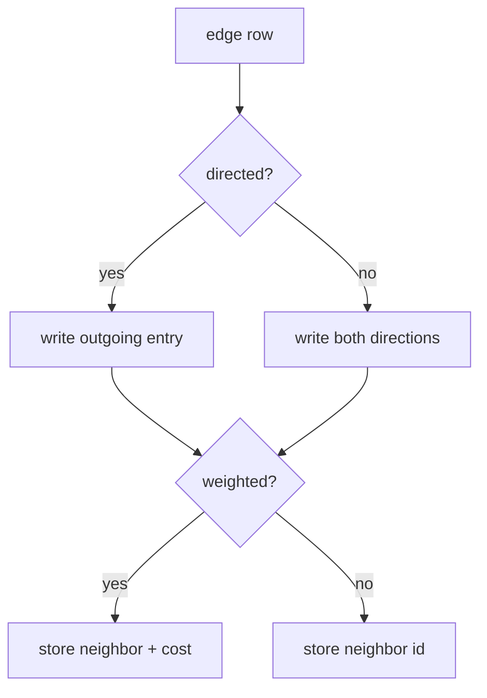
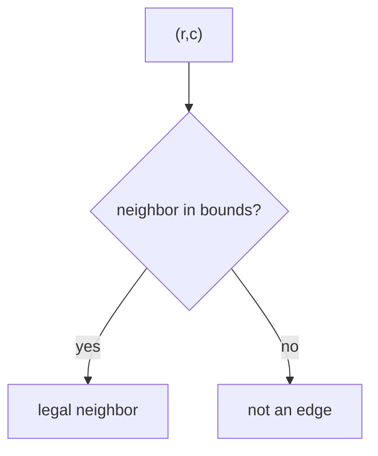
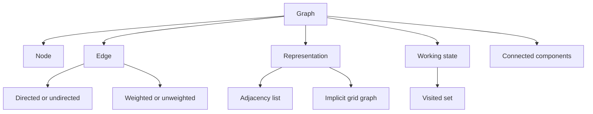
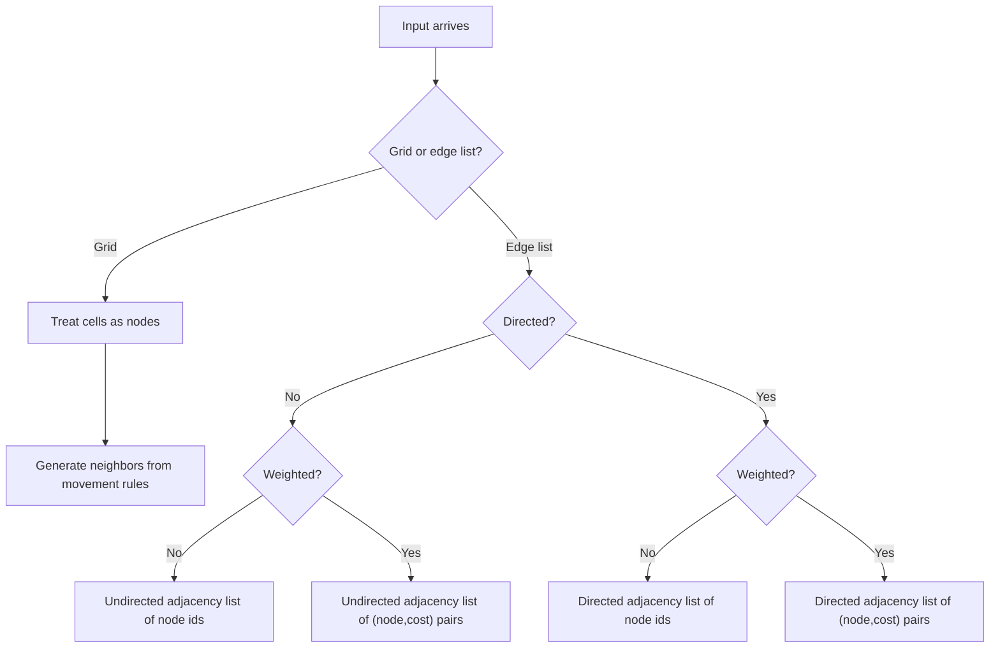

## Overview

Graphs are what you use when the data is no longer a single line like an array or a parent-child hierarchy like a tree. The performance barrier is not "how do I loop faster," it is "how do I describe the connections once so I do not keep rediscovering them." A good graph representation turns a messy map into a predictable lookup structure.

You already know arrays for indexed storage and hash-based sets for remembering what you have seen. This guide adds the graph layer on top of that: how to name the parts, how to store neighbors, and how to recognize components without committing to a traversal strategy yet. We will build that in three stages: **Write the Street Ledger**, **Read the Arrows and Tolls**, and **See Districts Without Walking Them**.

## Core Concept & Mental Model

### The City Map

Picture a city map. Each **node** is an intersection where you can stand. Each **edge** is a road between intersections. Some roads run both ways, some are one-way, and some have a posted toll or travel time. The graph is not the picture itself, it is the rulebook that says which intersections connect and what each connection means.

- **intersection** -> node
- **road** -> edge
- **street ledger** -> adjacency list
- **stamp sheet** -> visited set
- **district** -> connected component
- **city block grid** -> implicit graph

The efficiency claim is simple: once the street ledger is written, you ask "who are this node's neighbors?" directly, instead of rescanning every road in the city each time.

### The Adjacency List

An edge list like `[[0,1],[0,2],[2,3]]` is compact input, but it is poor working memory. If you want the neighbors of node 2, scanning the whole edge list costs O(E). An adjacency list fixes that by giving every node its own neighbor bucket, so building takes O(V + E) and reading one node's neighbors takes O(degree).

In the city map, the adjacency list is the street ledger. Every intersection has a line item listing the roads leaving it. For an undirected road between `a` and `b`, both ledgers change. For a directed road `a -> b`, only `a` records the outgoing road.

### Directed vs. Undirected, Weighted vs. Unweighted

The same node-and-edge idea appears in four common forms, and the input notation tells you which one you are holding.

- **Undirected, unweighted**: `edges = [[0,1],[1,2]]`. The only fact that matters is whether a connection exists, and each edge is symmetric.
- **Directed, unweighted**: `edges = [[0,1],[1,2]]` but now each pair means one-way travel from the first node to the second.
- **Undirected, weighted**: `edges = [[0,1,7],[1,2,3]]`. You still have two-way travel, but each edge carries a cost.
- **Directed, weighted**: `edges = [[0,1,7],[1,2,3]]` and direction plus cost both matter.

In the city map, some roads are two-way neighborhood streets, some are one-way ramps, and some have a toll sign attached. The representation has to preserve exactly those facts and no others.

### The Visited Set

A visited set is not a property of the graph itself. It is a piece of working state you bring with you when you start walking the graph. Its job is to remember which nodes have already been claimed so repeated edges do not create repeated work.

The important idea comes before any DFS or BFS code: the graph can contain cycles and multiple roads into the same node. That means "I have seen this node before" is separate information from "this node exists in the ledger." In the city map, the stamp sheet prevents dispatching another crew to an intersection that has already been claimed.

### Grid as an Implicit Graph

A grid problem often hides a graph without ever saying the word "graph." Each cell is a node. The allowed moves, usually up/down/left/right and sometimes diagonals, define the edges. You usually do not build an explicit adjacency list because the neighbors can be generated from row/column arithmetic in O(1).

In the city map, the grid is a neighborhood of perfectly aligned blocks. You do not need a ledger entry for every curb if the rule "north, south, east, west if still in bounds" already tells you the legal roads.

### Connected Components

A connected component is a maximal group of nodes where every node belongs to the same reachable district. You do not need traversal code to understand the concept. If the graph has no edge crossing between `{0,1,2}` and `{3,4}`, those are two separate components by definition.

The important mental shift is that "one graph" does not imply "one piece." In the city map, a district is everything inside one connected street network. If there is no road between two districts, they stay separate no matter how long you stare at the map.

### How I Think Through This

Before I touch code, I ask one question: **what exactly counts as a node, what exactly counts as an edge, and do I need to store those edges explicitly or can I generate them from structure?**

**When the input is an edge list for a normal graph:** I write the adjacency list once. The first thing I decide is whether each edge should be recorded once or twice, because that is the whole difference between directed and undirected storage.

**When the input adds arrows or costs:** I stop thinking "neighbor list of numbers" and start thinking "what fact must each ledger entry preserve?" One-way travel changes which node owns the entry. Weights change the shape of each entry from a plain node id to a `(neighbor, cost)` pair.

**When the input is a grid:** I do not build roads one by one unless the problem truly needs it. The edges are implied by row and column movement rules, so the representation becomes coordinates plus the movement rule.

The building blocks below work through those three situations before DFS and BFS enter the picture.

**Scenario 1 - Writing an undirected street ledger**

**Graph:** undirected, unweighted
**Input:** `n = 4`, `edges = [[0,1],[0,2],[2,3]]`

The key observation is that each two-way road updates two ledgers. If you forget the reverse write, the stored graph silently changes meaning.

:::trace-graph
[
  {
    "nodes": [
      {"id": "A", "label": "0", "x": 20, "y": 50, "tone": "current"},
      {"id": "B", "label": "1", "x": 42, "y": 24, "tone": "default"},
      {"id": "C", "label": "2", "x": 42, "y": 76, "tone": "default"},
      {"id": "D", "label": "3", "x": 72, "y": 76, "tone": "default"}
    ],
    "edges": [
      {"from": "A", "to": "B", "tone": "active"},
      {"from": "A", "to": "C", "tone": "default"},
      {"from": "C", "to": "D", "tone": "default"}
    ],
    "facts": [
      {"name": "edge", "value": "[0,1]", "tone": "orange"},
      {"name": "adj[0]", "value": "[1]", "tone": "blue"},
      {"name": "adj[1]", "value": "[0]", "tone": "blue"}
    ],
    "action": "mark",
    "label": "Record [0,1]. Because the road is undirected, both ledgers change."
  },
  {
    "nodes": [
      {"id": "A", "label": "0", "x": 20, "y": 50, "tone": "current"},
      {"id": "B", "label": "1", "x": 42, "y": 24, "tone": "default"},
      {"id": "C", "label": "2", "x": 42, "y": 76, "tone": "default"},
      {"id": "D", "label": "3", "x": 72, "y": 76, "tone": "default"}
    ],
    "edges": [
      {"from": "A", "to": "B", "tone": "traversed"},
      {"from": "A", "to": "C", "tone": "active"},
      {"from": "C", "to": "D", "tone": "default"}
    ],
    "facts": [
      {"name": "edge", "value": "[0,2]", "tone": "orange"},
      {"name": "adj[0]", "value": "[1,2]", "tone": "blue"},
      {"name": "adj[2]", "value": "[0]", "tone": "blue"}
    ],
    "action": "mark",
    "label": "Record [0,2]. Node 0 now has two outgoing neighbor entries."
  },
  {
    "nodes": [
      {"id": "A", "label": "0", "x": 20, "y": 50, "tone": "done"},
      {"id": "B", "label": "1", "x": 42, "y": 24, "tone": "done"},
      {"id": "C", "label": "2", "x": 42, "y": 76, "tone": "current"},
      {"id": "D", "label": "3", "x": 72, "y": 76, "tone": "default"}
    ],
    "edges": [
      {"from": "A", "to": "B", "tone": "traversed"},
      {"from": "A", "to": "C", "tone": "traversed"},
      {"from": "C", "to": "D", "tone": "active"}
    ],
    "facts": [
      {"name": "edge", "value": "[2,3]", "tone": "orange"},
      {"name": "adj[2]", "value": "[0,3]", "tone": "blue"},
      {"name": "adj[3]", "value": "[2]", "tone": "blue"}
    ],
    "action": "done",
    "label": "After the last write, the final ledger is [[1,2],[0],[0,3],[2]]."
  }
]
:::

**Scenario 2 - Reading arrows and toll labels**

**Graph:** directed, weighted
**Input:** `n = 4`, `edges = [[0,1,5],[0,2,2],[2,3,7]]`

The key observation is that the ledger entry must preserve both direction and cost. Recording the reverse edge would invent a road that was never present.

:::trace-graph
[
  {
    "nodes": [
      {"id": "A", "label": "0", "x": 18, "y": 48, "tone": "current"},
      {"id": "B", "label": "1", "x": 42, "y": 20, "tone": "default"},
      {"id": "C", "label": "2", "x": 42, "y": 76, "tone": "default"},
      {"id": "D", "label": "3", "x": 74, "y": 76, "tone": "default"}
    ],
    "edges": [
      {"from": "A", "to": "B", "directed": true, "tone": "active", "label": "5"},
      {"from": "A", "to": "C", "directed": true, "tone": "default", "label": "2"},
      {"from": "C", "to": "D", "directed": true, "tone": "default", "label": "7"}
    ],
    "facts": [
      {"name": "entry", "value": "adj[0].push((1,5))", "tone": "blue"},
      {"name": "reverse?", "value": "no", "tone": "purple"}
    ],
    "action": "mark",
    "label": "A directed weighted edge stores one outgoing neighbor plus its cost."
  },
  {
    "nodes": [
      {"id": "A", "label": "0", "x": 18, "y": 48, "tone": "current"},
      {"id": "B", "label": "1", "x": 42, "y": 20, "tone": "default"},
      {"id": "C", "label": "2", "x": 42, "y": 76, "tone": "default"},
      {"id": "D", "label": "3", "x": 74, "y": 76, "tone": "default"}
    ],
    "edges": [
      {"from": "A", "to": "B", "directed": true, "tone": "traversed", "label": "5"},
      {"from": "A", "to": "C", "directed": true, "tone": "active", "label": "2"},
      {"from": "C", "to": "D", "directed": true, "tone": "default", "label": "7"}
    ],
    "facts": [
      {"name": "adj[0]", "value": "[(1,5),(2,2)]", "tone": "blue"},
      {"name": "adj[2]", "value": "[]", "tone": "blue"}
    ],
    "action": "mark",
    "label": "Node 0 owns two outgoing roads. Node 2 still has an empty ledger until its own edge is processed."
  },
  {
    "nodes": [
      {"id": "A", "label": "0", "x": 18, "y": 48, "tone": "done"},
      {"id": "B", "label": "1", "x": 42, "y": 20, "tone": "done"},
      {"id": "C", "label": "2", "x": 42, "y": 76, "tone": "current"},
      {"id": "D", "label": "3", "x": 74, "y": 76, "tone": "default"}
    ],
    "edges": [
      {"from": "A", "to": "B", "directed": true, "tone": "traversed", "label": "5"},
      {"from": "A", "to": "C", "directed": true, "tone": "traversed", "label": "2"},
      {"from": "C", "to": "D", "directed": true, "tone": "active", "label": "7"}
    ],
    "facts": [
      {"name": "adj[2]", "value": "[(3,7)]", "tone": "blue"},
      {"name": "final", "value": "[[(1,5),(2,2)],[],[(3,7)],[]]", "tone": "green"}
    ],
    "action": "done",
    "label": "The finished ledger keeps both facts intact: direction and weight."
  }
]
:::

**Scenario 3 - Treating a grid as an implicit graph**

**Graph:** grid, orthogonal neighbors
**Input:** `grid = [[1,1,0],[0,1,0],[1,0,1]]`, `start = (0,1)`

The key observation is that no explicit edge list is needed. The legal neighbors come from bounds checks and movement rules, and component membership is about which cells belong to the same district if you were to walk them later.

:::trace-graph
[
  {
    "nodes": [
      {"id": "A", "label": "0,0", "x": 24, "y": 24, "tone": "frontier"},
      {"id": "B", "label": "0,1", "x": 50, "y": 24, "tone": "current", "badge": "start"},
      {"id": "C", "label": "0,2", "x": 76, "y": 24, "tone": "muted"},
      {"id": "D", "label": "1,0", "x": 24, "y": 50, "tone": "muted"},
      {"id": "E", "label": "1,1", "x": 50, "y": 50, "tone": "frontier"},
      {"id": "F", "label": "1,2", "x": 76, "y": 50, "tone": "muted"},
      {"id": "G", "label": "2,0", "x": 24, "y": 76, "tone": "default"},
      {"id": "H", "label": "2,1", "x": 50, "y": 76, "tone": "muted"},
      {"id": "I", "label": "2,2", "x": 76, "y": 76, "tone": "default"}
    ],
    "edges": [
      {"from": "B", "to": "A", "tone": "active"},
      {"from": "B", "to": "E", "tone": "active"}
    ],
    "facts": [
      {"name": "neighbors", "value": "[(0,0),(1,1)]", "tone": "blue"},
      {"name": "rule", "value": "up/down/left/right in bounds", "tone": "purple"}
    ],
    "action": "mark",
    "label": "From cell (0,1), only in-bounds orthogonal land neighbors count."
  },
  {
    "nodes": [
      {"id": "A", "label": "0,0", "x": 24, "y": 24, "tone": "visited"},
      {"id": "B", "label": "0,1", "x": 50, "y": 24, "tone": "visited"},
      {"id": "C", "label": "0,2", "x": 76, "y": 24, "tone": "muted"},
      {"id": "D", "label": "1,0", "x": 24, "y": 50, "tone": "muted"},
      {"id": "E", "label": "1,1", "x": 50, "y": 50, "tone": "visited"},
      {"id": "F", "label": "1,2", "x": 76, "y": 50, "tone": "muted"},
      {"id": "G", "label": "2,0", "x": 24, "y": 76, "tone": "default"},
      {"id": "H", "label": "2,1", "x": 50, "y": 76, "tone": "muted"},
      {"id": "I", "label": "2,2", "x": 76, "y": 76, "tone": "default"}
    ],
    "edges": [
      {"from": "B", "to": "A", "tone": "traversed"},
      {"from": "B", "to": "E", "tone": "traversed"}
    ],
    "facts": [
      {"name": "district tag", "value": "component 1", "tone": "green"},
      {"name": "cells", "value": "{(0,0),(0,1),(1,1)}", "tone": "green"}
    ],
    "action": "done",
    "label": "Those three land cells form one connected district. Cells (2,0) and (2,2) belong to different districts."
  }
]
:::

---

## Building Blocks: Progressive Learning

### Level 1: Write the Street Ledger

Most graph problems do not start with the structure you want to work with. They start with raw edge pairs, and the brute-force mistake is to keep rescanning those pairs every time you need a node's neighbors. If a graph has ten thousand roads, that turns one local question into ten thousand checks over and over again. The adjacency list fixes that by paying the O(V + E) construction cost once.

The structural guarantee here is simple: every edge explicitly tells you which nodes touch. That means you can rewrite the input into per-node neighbor buckets without guessing anything. For an undirected graph, each edge contributes two writes. For a directed graph, it contributes one. The whole mechanic is just "initialize `n` empty buckets, then process each edge and update the correct bucket or buckets."

The important discipline is that the ledger stores exactly the neighbors a node can move to later, no more and no less. If you forget the reverse write in an undirected graph, you silently change reachability. If you add a reverse write in a directed graph, you invent a road that does not exist.

`n = 5`, `edges = [[0,1],[0,2],[2,4],[1,3]]`

:::trace-graph
[
  {
    "nodes": [
      {"id": "A", "label": "0", "x": 18, "y": 48, "tone": "current"},
      {"id": "B", "label": "1", "x": 40, "y": 20, "tone": "default"},
      {"id": "C", "label": "2", "x": 40, "y": 76, "tone": "default"},
      {"id": "D", "label": "3", "x": 68, "y": 20, "tone": "default"},
      {"id": "E", "label": "4", "x": 68, "y": 76, "tone": "default"}
    ],
    "edges": [
      {"from": "A", "to": "B", "tone": "active"},
      {"from": "A", "to": "C", "tone": "default"},
      {"from": "C", "to": "E", "tone": "default"},
      {"from": "B", "to": "D", "tone": "default"}
    ],
    "facts": [
      {"name": "edge", "value": "[0,1]", "tone": "orange"},
      {"name": "adj[0]", "value": "[1]", "tone": "blue"},
      {"name": "adj[1]", "value": "[0]", "tone": "blue"}
    ],
    "action": "mark",
    "label": "Process one road at a time and update both endpoints."
  },
  {
    "nodes": [
      {"id": "A", "label": "0", "x": 18, "y": 48, "tone": "current"},
      {"id": "B", "label": "1", "x": 40, "y": 20, "tone": "default"},
      {"id": "C", "label": "2", "x": 40, "y": 76, "tone": "default"},
      {"id": "D", "label": "3", "x": 68, "y": 20, "tone": "default"},
      {"id": "E", "label": "4", "x": 68, "y": 76, "tone": "default"}
    ],
    "edges": [
      {"from": "A", "to": "B", "tone": "traversed"},
      {"from": "A", "to": "C", "tone": "active"},
      {"from": "C", "to": "E", "tone": "default"},
      {"from": "B", "to": "D", "tone": "default"}
    ],
    "facts": [
      {"name": "edge", "value": "[0,2]", "tone": "orange"},
      {"name": "adj[0]", "value": "[1,2]", "tone": "blue"},
      {"name": "adj[2]", "value": "[0]", "tone": "blue"}
    ],
    "action": "mark",
    "label": "Each new road only changes the ledgers of the nodes it touches."
  },
  {
    "nodes": [
      {"id": "A", "label": "0", "x": 18, "y": 48, "tone": "done"},
      {"id": "B", "label": "1", "x": 40, "y": 20, "tone": "done"},
      {"id": "C", "label": "2", "x": 40, "y": 76, "tone": "done"},
      {"id": "D", "label": "3", "x": 68, "y": 20, "tone": "done"},
      {"id": "E", "label": "4", "x": 68, "y": 76, "tone": "done"}
    ],
    "edges": [
      {"from": "A", "to": "B", "tone": "traversed"},
      {"from": "A", "to": "C", "tone": "traversed"},
      {"from": "C", "to": "E", "tone": "traversed"},
      {"from": "B", "to": "D", "tone": "traversed"}
    ],
    "facts": [
      {"name": "final", "value": "[[1,2],[0,3],[0,4],[1],[2]]", "tone": "green"}
    ],
    "action": "done",
    "label": "After all edges are processed, neighbor lookups are direct."
  }
]
:::

#### **Exercise 1**

Why this matters: if you cannot write the street ledger correctly, every later graph question starts on the wrong structure. You're given the number of intersections and a list of two-way roads. Return the adjacency list exactly as it should appear after all roads are recorded. Think in terms of bucket creation first, then one edge causing two writes.

:::stackblitz{step=1 total=3 exercises="step1-exercise1-problem.ts" solutions="step1-exercise1-solution.ts"}

#### **Exercise 2**

Why this matters: node degree is the quickest way to read how busy each intersection is without walking the city. You're given the same undirected road list, and you need to return how many direct roads touch each node. Use the same two-write idea from Exercise 1, but now the output is counts instead of full neighbor buckets.

:::stackblitz{step=1 total=3 exercises="step1-exercise2-problem.ts" solutions="step1-exercise2-solution.ts"}

#### **Exercise 3**

Why this matters: many interview questions first ask whether two nodes share a direct edge before they ask anything about whole-path reachability. You're given an undirected road list and several node-pair queries. Return one boolean per query showing whether the pair shares a direct road, using the ledger rather than rescanning the full edge list for every question.

:::stackblitz{step=1 total=3 exercises="step1-exercise3-problem.ts" solutions="step1-exercise3-solution.ts"}

> **Mental anchor**: An adjacency list is a ledger, not a picture. Each edge rewrites a small local fact so later neighbor lookup is cheap.

**-> Bridge to Level 2**: Level 1 only works when every road is two-way and costless. The next level fixes the concrete failure where arrows and weights matter, because now each ledger entry must preserve more than a plain neighbor id.

### Level 2: Read the Arrows and Tolls

Level 1 gave you a clean way to store plain undirected graphs. Now the input changes shape: some edges are one-way, and some edges carry a weight. If you keep treating every connection as a symmetric neighbor id, the representation is wrong before any algorithm starts. A flight route is not a two-way street, and a toll road without its cost is missing half its meaning.

The exploitable structure is still the same edge-by-edge build pattern. What changes is the exact write rule. Directed edges update only the source node's bucket. Weighted edges store a pair such as `(neighbor, cost)` instead of a plain number. This is also the moment to make room for the visited set mentally: the graph stores what exists, while the visited set stores what work has already been claimed.

That separation matters because duplicate arrivals are normal in graphs. Two different edges can point to the same node. A visited set is the stamp sheet that filters "still new" from "already accounted for." Even before you learn DFS or BFS, you should be able to read a neighbor list and say which entries would produce fresh work and which would be skipped.

`n = 5`, `edges = [[0,1,4],[0,2,1],[2,4,6],[3,4,2]]`

:::trace-graph
[
  {
    "nodes": [
      {"id": "A", "label": "0", "x": 18, "y": 48, "tone": "current"},
      {"id": "B", "label": "1", "x": 40, "y": 20, "tone": "default"},
      {"id": "C", "label": "2", "x": 40, "y": 76, "tone": "default"},
      {"id": "D", "label": "3", "x": 68, "y": 20, "tone": "default"},
      {"id": "E", "label": "4", "x": 68, "y": 76, "tone": "default"}
    ],
    "edges": [
      {"from": "A", "to": "B", "directed": true, "tone": "active", "label": "4"},
      {"from": "A", "to": "C", "directed": true, "tone": "default", "label": "1"},
      {"from": "C", "to": "E", "directed": true, "tone": "default", "label": "6"},
      {"from": "D", "to": "E", "directed": true, "tone": "default", "label": "2"}
    ],
    "facts": [
      {"name": "adj[0]", "value": "[(1,4)]", "tone": "blue"},
      {"name": "reverse write", "value": "no", "tone": "purple"}
    ],
    "action": "mark",
    "label": "A one-way weighted edge records exactly one outgoing entry."
  },
  {
    "nodes": [
      {"id": "A", "label": "0", "x": 18, "y": 48, "tone": "done"},
      {"id": "B", "label": "1", "x": 40, "y": 20, "tone": "default"},
      {"id": "C", "label": "2", "x": 40, "y": 76, "tone": "current"},
      {"id": "D", "label": "3", "x": 68, "y": 20, "tone": "default"},
      {"id": "E", "label": "4", "x": 68, "y": 76, "tone": "default"}
    ],
    "edges": [
      {"from": "A", "to": "B", "directed": true, "tone": "traversed", "label": "4"},
      {"from": "A", "to": "C", "directed": true, "tone": "traversed", "label": "1"},
      {"from": "C", "to": "E", "directed": true, "tone": "active", "label": "6"},
      {"from": "D", "to": "E", "directed": true, "tone": "default", "label": "2"}
    ],
    "facts": [
      {"name": "adj[0]", "value": "[(1,4),(2,1)]", "tone": "blue"},
      {"name": "adj[2]", "value": "[(4,6)]", "tone": "blue"}
    ],
    "action": "mark",
    "label": "Weights live inside the ledger entry, not somewhere off to the side."
  },
  {
    "nodes": [
      {"id": "A", "label": "0", "x": 18, "y": 48, "tone": "visited"},
      {"id": "B", "label": "1", "x": 40, "y": 20, "tone": "visited"},
      {"id": "C", "label": "2", "x": 40, "y": 76, "tone": "visited"},
      {"id": "D", "label": "3", "x": 68, "y": 20, "tone": "current"},
      {"id": "E", "label": "4", "x": 68, "y": 76, "tone": "frontier"}
    ],
    "edges": [
      {"from": "A", "to": "B", "directed": true, "tone": "traversed", "label": "4"},
      {"from": "A", "to": "C", "directed": true, "tone": "traversed", "label": "1"},
      {"from": "C", "to": "E", "directed": true, "tone": "queued", "label": "6"},
      {"from": "D", "to": "E", "directed": true, "tone": "active", "label": "2"}
    ],
    "facts": [
      {"name": "stamped", "value": "{0,1,2,4}", "tone": "green"},
      {"name": "fresh from [4,4,1]", "value": "[]", "tone": "orange"}
    ],
    "action": "done",
    "label": "Once node 4 is stamped, later arrivals to 4 are not fresh work anymore."
  }
]
:::

#### **Exercise 1**

Why this matters: one-way edges are the first place graph notation punishes loose thinking. You're given `n` nodes and a list of directed edges. Return the outgoing-neighbor ledger for each node, and make sure nodes with only incoming edges still keep an empty outgoing bucket.

:::stackblitz{step=2 total=3 exercises="step2-exercise1-problem.ts" solutions="step2-exercise1-solution.ts"}

#### **Exercise 2**

Why this matters: weighted graphs use the same overall shape as unweighted graphs, but each ledger entry has to preserve the cost along with the destination. You're given directed weighted edges and need to build the adjacency list of `(to, weight)` entries in insertion order. The mechanical question is not whether an edge exists, but what exact payload each bucket should store.

:::stackblitz{step=2 total=3 exercises="step2-exercise2-problem.ts" solutions="step2-exercise2-solution.ts"}

#### **Exercise 3**

Why this matters: the visited set exists to separate fresh work from duplicate work before duplicate work spreads. You're given a list of candidate neighbors and a list of nodes that are already stamped. Return only the neighbors that are fresh the first time they appear, in the order they first become eligible.

:::stackblitz{step=2 total=3 exercises="step2-exercise3-problem.ts" solutions="step2-exercise3-solution.ts"}

> **Mental anchor**: The graph stores roads. The visited set stores bookkeeping about work on those roads. Do not mix those jobs.

**-> Bridge to Level 3**: Level 2 can read arrows, weights, and freshness, but it still assumes the graph is written out explicitly. The next level fixes the case where the graph is hidden inside a grid or inside pre-labeled district information.

### Level 3: See Districts Without Walking Them

Level 2 still expects an explicit edge list. Many real interview graphs do not arrive that way. A grid gives you coordinates and movement rules instead of neighbor buckets. Component questions often hand you enough structure to reason about districts directly, even before you choose DFS or BFS to discover them in the wild.

The structural guarantee in a grid is geometry. If movement is orthogonal, each cell has at most four neighbors, and those neighbors come from simple bounds checks. For component summaries, the key property is shared district identity: if two nodes carry the same component tag, they belong to the same connected piece. Counting the size of that piece is then just a counting pass over the labels, not a traversal.

This level matters because it teaches you to separate representation from search. You should be able to say "these cells are neighbors," "these two nodes share a component," and "this component has size 4" without accidentally jumping ahead into a traversal algorithm. That keeps the graph vocabulary clean.

`grid = [[1,1,0],[0,1,0],[1,0,1]]`, `cell = (1,1)`

:::trace-graph
[
  {
    "nodes": [
      {"id": "A", "label": "0,0", "x": 24, "y": 24, "tone": "frontier"},
      {"id": "B", "label": "0,1", "x": 50, "y": 24, "tone": "frontier"},
      {"id": "C", "label": "0,2", "x": 76, "y": 24, "tone": "muted"},
      {"id": "D", "label": "1,0", "x": 24, "y": 50, "tone": "muted"},
      {"id": "E", "label": "1,1", "x": 50, "y": 50, "tone": "current"},
      {"id": "F", "label": "1,2", "x": 76, "y": 50, "tone": "muted"},
      {"id": "G", "label": "2,0", "x": 24, "y": 76, "tone": "default"},
      {"id": "H", "label": "2,1", "x": 50, "y": 76, "tone": "muted"},
      {"id": "I", "label": "2,2", "x": 76, "y": 76, "tone": "default"}
    ],
    "edges": [
      {"from": "E", "to": "B", "tone": "active"},
      {"from": "E", "to": "A", "tone": "muted"},
      {"from": "E", "to": "D", "tone": "muted"},
      {"from": "E", "to": "F", "tone": "muted"},
      {"from": "E", "to": "H", "tone": "muted"}
    ],
    "facts": [
      {"name": "valid neighbors", "value": "[(0,1)]", "tone": "blue"},
      {"name": "blocked/out of bounds", "value": "all others", "tone": "purple"}
    ],
    "action": "mark",
    "label": "The grid itself tells you which coordinates can touch."
  },
  {
    "nodes": [
      {"id": "A", "label": "0", "x": 18, "y": 48, "tone": "visited"},
      {"id": "B", "label": "1", "x": 42, "y": 24, "tone": "visited"},
      {"id": "C", "label": "2", "x": 42, "y": 76, "tone": "default"},
      {"id": "D", "label": "3", "x": 68, "y": 24, "tone": "default"},
      {"id": "E", "label": "4", "x": 68, "y": 76, "tone": "answer"}
    ],
    "edges": [
      {"from": "A", "to": "B", "tone": "traversed"},
      {"from": "C", "to": "E", "tone": "active"},
      {"from": "D", "to": "E", "tone": "active"}
    ],
    "facts": [
      {"name": "component tags", "value": "[7,7,3,3,3]", "tone": "green"},
      {"name": "size of node 4's district", "value": 3, "tone": "orange"}
    ],
    "action": "done",
    "label": "Once district labels are known, same-component checks and component size are direct reads."
  }
]
:::

#### **Exercise 1**

Why this matters: grids hide graph edges behind row and column rules, so you need to generate neighbors instead of storing them up front. You're given a grid plus one cell location. Return all valid orthogonal neighbor coordinates in a fixed order: up, right, down, left.

:::stackblitz{step=3 total=3 exercises="step3-exercise1-problem.ts" solutions="step3-exercise1-solution.ts"}

#### **Exercise 2**

Why this matters: once district labels exist, same-component checks should be constant-time reads, not new graph walks. You're given a component-tag array where `tags[node]` names that node's district. Return whether two nodes belong to the same district by comparing the stored labels directly.

:::stackblitz{step=3 total=3 exercises="step3-exercise2-problem.ts" solutions="step3-exercise2-solution.ts"}

#### **Exercise 3**

Why this matters: component labels become useful only when you can summarize a whole district from them. You're given the same component-tag array plus one target node. Return how many nodes share that target's district by counting matching labels, not by traversing the graph again.

:::stackblitz{step=3 total=3 exercises="step3-exercise3-problem.ts" solutions="step3-exercise3-solution.ts"}

> **Mental anchor**: Sometimes the graph is written explicitly, sometimes the graph is implied. Your first job is to name the neighbors and the districts correctly.

## Key Patterns

### Pattern: Explicit Graph from Edge List

**When to use**: the input gives `n` plus `edges`, `roads`, `flights`, `prereqs`, or any list of node pairs or triples. Recognition signals are "build adjacency list," "neighbors of node x," "direct connection," and any prompt where repeated neighbor lookup will happen.

**How to think about it**: decide the meaning of one edge before you write a single loop. Does one input row create one ledger entry or two? Does each entry need only a neighbor id, or a `(neighbor, weight)` pair? Once that write rule is fixed, the rest is a linear pass over the input.

**Complexity**: Time O(V + E) to build, Space O(V + E) to store. The list size is proportional to the number of nodes plus the number of recorded edge entries.

### Pattern: Implicit Graph from Grid Coordinates

**When to use**: the input is a matrix or board and movement rules define adjacency. Recognition signals are "grid," "island," "neighbors," "up/down/left/right," and "in bounds."

**How to think about it**: the graph is not missing, it is compressed. A cell is a node, and the move rule generates its edges on demand. You store coordinates and a movement rule instead of building every edge explicitly.

**Complexity**: Neighbor generation is O(1) per cell for fixed-direction movement, and explicit storage can often stay O(1) beyond the grid itself because the edges are computed instead of materialized.

---

## Decision Framework

**Concept Map**

**Complexity table**

| Representation task | Time | Space | Why |
| --- | --- | --- | --- |
| Build unweighted adjacency list from edge list | O(V + E) | O(V + E) | Initialize one bucket per node, then record each edge once or twice |
| Build weighted adjacency list from edge list | O(V + E) | O(V + E) | Same shape as unweighted, but each entry stores a pair |
| Read neighbors of one node from adjacency list | O(degree) | O(1) extra | You only inspect that node's bucket |
| Generate orthogonal grid neighbors for one cell | O(1) | O(1) | At most four bounds checks |
| Same-component check from precomputed tags | O(1) | O(1) | Compare two stored labels |
| Component size from precomputed tags | O(V) | O(1) extra | Count matching labels once |

**Decision tree**

**Recognition signals table**

| Prompt language | Reach for |
| --- | --- |
| "neighbors of x", "build graph", "roads/flights/prereqs" | explicit adjacency list |
| "one-way", "depends on", "points to" | directed edges |
| "cost", "time", "distance", "toll" | weighted entries |
| "grid", "matrix", "island", "up/down/left/right" | implicit grid graph |
| "already seen", "do not process twice" | visited set |
| "disconnected pieces", "districts", "islands" | connected components concept |

**When NOT to use**: do not build an explicit adjacency list for every grid by default if the only neighbor rule is local row/column movement, because the grid already encodes the graph. Do not treat weighted or directed inputs like plain undirected edges, because that throws away required meaning.

## Common Gotchas & Edge Cases

**Gotcha 1: Forgetting the reverse write in an undirected graph**

The symptom is that direct-neighbor checks fail in one direction even though the road should be two-way. This shows up on tiny graphs like `[[0,1]]`, where `adj[0]` looks right but `adj[1]` is empty.

Why it is tempting: edge lists only show one pair, so it feels like one write should be enough.

Fix: for undirected inputs, every edge `[a, b]` must update both `adj[a]` and `adj[b]`.

**Gotcha 2: Inventing reverse edges in a directed graph**

The symptom is that dependency-style graphs suddenly look reachable backward when they should not be. A course that depends on another course appears to unlock its prerequisite.

Why it is tempting: Level 1 trains the "two writes per edge" habit, and it is easy to apply it blindly.

Fix: for directed inputs, only the source node records the outgoing edge.

**Gotcha 3: Dropping the weight when the edge carries cost**

The symptom is that you can tell which nodes connect but not what the connection means. Later shortest-path or minimum-cost logic has nothing to read.

Why it is tempting: neighbor ids are simpler to store than pairs.

Fix: make each ledger entry hold both the destination and the weight, such as `(to, cost)`.

**Gotcha 4: Treating a visited set like part of the graph**

The symptom is conceptual confusion about why the same graph can be walked many times with different visited states. Learners start thinking "visited node" is a permanent property of the input.

Why it is tempting: the visited set sits next to the adjacency list during traversal work.

Fix: keep the separation clear. The adjacency list is the city map. The visited set is temporary bookkeeping for one traversal run.

**Gotcha 5: Assuming one graph always means one component**

The symptom is that isolated nodes or disconnected districts disappear from the mental model. Problems about islands, provinces, or districts get undercounted.

Why it is tempting: most toy examples draw one connected picture.

Fix: always allow for multiple components unless the problem states the graph is connected.

**Edge cases to always check**

- `n = 0`, the ledger should be empty and component summaries should return zero-sized answers where appropriate.
- Nodes with no incident edges, because they still need empty buckets in the adjacency list.
- Duplicate edges, because insertion-order exercises should preserve each appearance unless the prompt says to deduplicate.
- Directed nodes with only incoming edges, because their outgoing ledger must still exist as an empty list.
- Grid corners and edges, because they have fewer than four valid orthogonal neighbors.

**Debugging tips**

- Print the adjacency list right after construction and verify one small edge at a time.
- For directed graphs, print `from`, `to`, and the exact bucket you changed to confirm no reverse writes slipped in.
- For weighted graphs, print each stored entry and confirm the cost stayed attached to the correct neighbor.
- For visited-set utilities, print the stamped set before and after each candidate neighbor to see when a duplicate stops being fresh.
- For grid neighbors, print each candidate coordinate before bounds filtering so corner-cell mistakes become obvious.

The next steps split graph walking into two separate strategies: DFS for going deep and BFS for exploring layer by layer. This guide stops before those traversals on purpose, so the representation vocabulary stays clean first.
