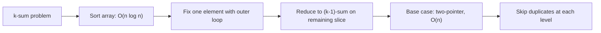
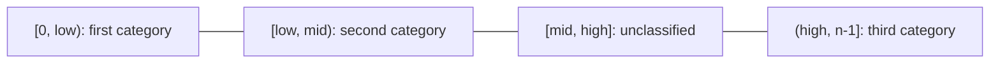
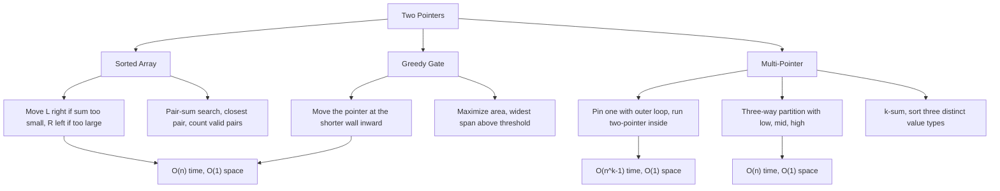
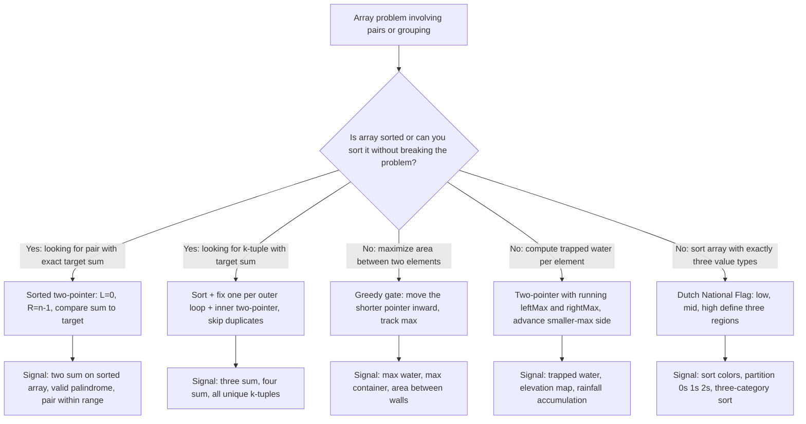

## Overview

Two pointers is the pattern that breaks the O(n²) barrier for problems about pairs, ranges, or ordered comparisons in arrays. Once an array is sorted, or the structure of the problem guarantees useful order, you can use two pointers converging from opposite ends to eliminate entire halves of the search space per step, finishing in O(n).

From Arrays & Strings, you know the basic shape: `L` starts at `0`, `R` at `n−1`, they walk inward. This guide digs into _why each pointer move is provably safe_ — and then extends that same logic to two new problem shapes you haven't seen yet.

By the end of Levels 1, 2, and 3, you will have three distinct tools: sorted-pair targeting, greedy gate advancement, and multi-pointer reduction.

## Core Concept & Mental Model

### The Two Surveyors

Picture a mountain valley with stone walls of varying heights at every position. Two water engineers are sent to find the best site for a reservoir: a **left surveyor** starting at the valley entrance and a **right surveyor** starting at the far end.

- The **valley floor** is your array. Each position holds a wall of some height.
- The **left surveyor** stands at the leftmost wall, the **right surveyor** at the rightmost.
- **Water level** between them equals the _shorter_ wall, and water spills over the low side.
- **Reservoir area** = min(left height, right height) × distance between them.

Every step, one surveyor takes one step inward. Each step provably eliminates one wall from further consideration. Since each wall can only be eliminated once, the whole survey takes O(n) steps.

### Understanding the Analogy

#### The Setup

The two surveyors stand at opposite ends of the valley with notebooks. They can only walk inward. No jumping, no backtracking. At each step they compare their walls. The comparison dictates who moves.

#### The Decision Rules

When searching for a target sum in a sorted valley: if the pair sums too low, the left surveyor steps right (larger values lie to their right in a sorted valley). If it sums too high, the right surveyor steps left. Each move eliminates an entire row of the "try every pair" grid. When maximizing reservoir area: **the shorter surveyor steps inward.**

Moving the taller surveyor inward can only _hurt_: the water level stays limited by the shorter wall while the width shrinks. Moving the shorter surveyor is the only action that could possibly improve the area.

#### Why These Approaches

A nested loop checks every pair: `n × n = n²` total comparisons. Two surveyors check at most `n` pairs, and each step eliminates one wall permanently. That is where the O(n) comes from. The technique only works because the array's structure (sorted order, or the greedy gate argument) guarantees that the skipped pairs can never be better than what is already tracked.

#### How I Think Through This

I think about this in terms of the two surveyors. Before I touch any code, I ask one question: **what does each surveyor know that the other one doesn't?** In a sorted array, the left surveyor knows everything to its left is smaller; the right surveyor knows everything to its right is larger. That asymmetry is what makes the inward walk safe — every step eliminates something provably.

Once I have that framing, two situations fall out naturally:

- **When there is a specific target**: the comparison at each step tells me which surveyor is on the wrong side and needs to move.
- **When there is no target and I am maximizing something**: I look for which surveyor is the _constraint_ — the one currently limiting the result. Moving the constraining side is the only action that can improve things.

The building blocks below work through three distinct situations where that logic plays out differently. Here is a one-step preview of each scenario before the full treatment.

**Scenario 1 — specific target**: `[1, 4, 6, 8, 10]`, target 14. The sum undershoots, so the left surveyor is on the wrong side and moves right.

:::trace-lr
[
{"chars":["1","4","6","8","10"],"L":0,"R":4,"action": null,"label":"`L=0` (value 1), `R=4` (value 10). `Sum = 1+10 = 11 < 14`. \n The left surveyor is too small to reach the target. Move `L` right."},
{"chars":["1","4","6","8","10"],"L":1,"R":4,"action":"match","label":"`L=1` (value 4), `R=4` (value 10). `Sum = 4 + 10 = 14 = target`. Found ✓"}
]
:::

**Scenario 2 — no target, maximize**: `[3, 1, 5, 4]`. No number to hit — only area to maximize. The left wall (h=3) is shorter, so it is the constraint. Moving it is the only action that can improve things.

:::trace-lr
[
{"chars":["3","1","5","4"],"L":0,"R":3,"action":null,"label":"Area = min(3,4) × 3 = 9. Left wall (h=3) is the shorter constraint. Move `L` right."},
{"chars":["3","1","5","4"],"L":1,"R":3,"action":null,"label":"Area = min(1,4) × 2 = 2. Left wall (h=1) is still the constraint. Move `L` right."},
{"chars":["3","1","5","4"],"L":2,"R":3,"action":"done","label":"Area = min(5,4) × 1 = 4. Right wall (h=4) is now the constraint — but L and R are about to cross. Best area was 9."}
]
:::

---

## Building Blocks: Progressive Learning

### Level 1: Converging on a Target

Take `[2, 3, 5, 8, 11]` with a target of 16. The obvious approach is to try every possible pair and check if they sum to 16. That is a nested loop visiting every combination, O(n²). For ten thousand elements you are checking one hundred million pairs. Two pointers collapses that to n steps by exploiting one property the brute force ignores: the array is sorted.

Sorted order gives you a guarantee: every value to the left of any position is smaller, every value to the right is larger. That is what makes it possible to skip entire groups of pairs at once, rather than checking them one by one.

`L` starts at the smallest number (index 0), `R` starts at the largest (index n - 1). Add those two numbers together. If the sum equals the target, done. If it is too small, the number at `L` cannot be part of any valid pair: even paired with the largest remaining number in the array, it still falls short. Move `L` one step right. If the sum is too large, the number at `R` cannot be part of any valid pair: even paired with the smallest remaining number, it still overshoots. Move `R` one step left. Each step eliminates one number permanently, `L` and `R` close in on each other, and the search ends in at most n steps.

Sorted array `[2, 3, 5, 8, 11]`, target = 16.

:::trace-lr
[
{"chars":["2","3","5","8","11"],"L":0,"R":4,"action":null,"label":"Start: `L=0` (value 2), `R=4` (value 11). `Sum = 2+11 = 13 < 16.` \n Every pair with left=2 and any element to the left of `R` is `<= 13`. Move `L` right."},
{"chars":["2","3","5","8","11"],"L":1,"R":4,"action":null,"label":"`L=1` (value 3), `R=4` (value 11). `Sum = 3+11 = 14 < 16`. \n Still too small. Move `L` right."},
{"chars":["2","3","5","8","11"],"L":2,"R":4,"action":null,"label":"`L=2` (value 5), `R=4` (value 11). `Sum = 5+11 = 16 = target`. \n Pair found!"},
{"chars":["2","3","5","8","11"],"L":2,"R":4,"action":"match","label":"`5 + 11 = 16` at indices (2, 4) ✓"}
]
:::

> [!TIP]
> One thing worth noting: this all depends on the array being sorted.
> On an unsorted array the pointer moves are no longer safe, and the algorithm will return wrong answers without any error.

#### **Exercise 1**

A direct application of everything above. The array is sorted, you have a target, and you want to know whether any two numbers sum to it. Set `L` at the start, `R` at the end, apply the loop, and return true the moment a match is found or false when the pointers meet.

:::stackblitz{step=1 total=3 exercises="step1-exercise1-problem.ts" solutions="step1-exercise1-solution.ts"}

#### **Exercise 2**

Removes the guarantee of an exact match. There may be no pair that hits the target precisely, so the goal is to find the closest one instead. The loop structure is identical, but instead of stopping on a match, you track the best sum seen so far. Before the loop, record the first sum as your current best. At each step, check whether the new sum is closer to the target than what you have stored. If it is, update it. The pointers still move by the same rule: too small moves `L` right, too large moves `R` left. When the loop ends, your running best holds the answer.

:::stackblitz{step=1 total=3 exercises="step1-exercise2-problem.ts" solutions="step1-exercise2-solution.ts"}

#### **Exercise 3**

Shifts the goal entirely: count all pairs whose sum falls below a threshold rather than finding one specific pair. The loop runs the same way, but the "too small" case now reveals something more useful. When the sum at `L` and `R` is already below the threshold, every number between those two positions would also form a valid pair with the number at `L`, because the array is sorted and all those middle numbers are smaller than the one at `R`. That is not one valid pair to count, it is `R - L` valid pairs at once. Add that to a running count, move `L` right, and continue.

:::stackblitz{step=1 total=3 exercises="step1-exercise3-problem.ts" solutions="step1-exercise3-solution.ts"}

> **Mental anchor**: "Sorted array = sorted oracle. Each pointer move provably eliminates an entire row or column from the pair grid."

**→ Bridge to Level 2**: When there is a scalar target, pointer direction is clear: overshoot moves R left, undershoot moves L right. But what if there is no target, only an objective to _maximize_? The decision rule changes: you move the pointer at the _constraining boundary_, not the one that overshoots a number.

---

### Level 2: Greedy Gate Operators

Level 1 gave you a number to chase. At every step, the sum comparison told you which pointer to move. Now the problem changes shape: given an array of wall heights, find the two walls that together hold the most water. Water held equals the shorter wall's height times the distance between the walls. There is no target to hit, only an area to maximize.

The Level 1 decision rule does not apply here. You cannot ask whether the result overshoots or undershoots a target, because there is no target. But a different question does the same job: which wall is the constraint right now? The shorter wall determines how high the water can sit. So when you move the taller wall inward, nothing improves: the shorter wall still caps the water, and the width just shrank. Moving the shorter wall is the only action that gives the area a chance to improve. The pair you skip when doing this has the same height limit and a smaller width, so it cannot beat what you already recorded.

`L` starts at the leftmost wall, `R` at the rightmost. At each step, compute the area: the shorter of the two heights times the distance between them. Record it if it beats your current best. Then move whichever pointer is at the shorter wall one step inward. When the two pointers meet, the best area seen across all steps is the answer.

Heights: `[3, 1, 5, 2, 4]`. Left pointer at index 0 (height 3), right at index 4 (height 4).

:::trace-lr
[
{"chars":["3","1","5","2","4"],"L":0,"R":4,"action":null,"label":"Area = min(3,4) x 4 = 12. Left wall (h=3) is shorter. Move L right."},
{"chars":["3","1","5","2","4"],"L":1,"R":4,"action":null,"label":"Area = min(1,4) x 3 = 3. Left wall (h=1) is still shorter. Move L right."},
{"chars":["3","1","5","2","4"],"L":2,"R":4,"action":null,"label":"Area = min(5,4) x 2 = 8. Right wall (h=4) is now shorter. Move R left."},
{"chars":["3","1","5","2","4"],"L":2,"R":3,"action":null,"label":"Area = min(5,2) x 1 = 2. Right wall (h=2) is shorter. Move R left."},
{"chars":["3","1","5","2","4"],"L":2,"R":2,"action":"done","label":"L >= R. Loop ends. Maximum area = 12 (recorded at step 1) ✓"}
]
:::

> [!TIP]
> When both walls are the same height, it does not matter which pointer you move. Either choice leaves behind a pair with the same height limit and a smaller width, which cannot beat what you already recorded. Pick one convention, move `L` on ties, and never branch on it.

#### **Exercise 1**

The core pattern. Find the two walls that hold the most water. Move the shorter wall inward at each step, track the best area seen, and return it when the pointers meet.

:::stackblitz{step=2 total=3 exercises="step2-exercise1-problem.ts" solutions="step2-exercise1-solution.ts"}

#### **Exercise 2**

The same greedy gate applied to a different question: find the widest span where the area is at least a given minimum. Start with `L` and `R` at opposite ends, which is the widest possible span. If that area already meets the minimum, you are done — nothing wider exists. If it does not, move the shorter wall inward by the same logic. The first pair you find that meets the threshold is the widest valid pair, because every pair you passed over was already provably no better.

:::stackblitz{step=2 total=3 exercises="step2-exercise2-problem.ts" solutions="step2-exercise2-solution.ts"}

#### **Exercise 3**

The greedy gate with a minimum distance constraint: the two walls must be at least a required number of positions apart. The logic is unchanged, but the loop now has an additional stopping condition. Once the distance between `L` and `R` drops below the minimum, stop. Any pair narrower than the requirement is invalid regardless of height.

:::stackblitz{step=2 total=3 exercises="step2-exercise3-problem.ts" solutions="step2-exercise3-solution.ts"}

> **Mental anchor**: "The shorter wall limits the water. Moving the taller wall inward is always worse. Move the shorter side, always."

**→ Bridge to Level 3**: Levels 1 and 2 use exactly two pointers. Some problems require three or more values: find all unique triplets summing to zero, or sort an array with three distinct values in one pass. The key insight is to _pin one element_ and reduce the multi-pointer problem to the two-pointer case you already know.

### Level 3: Pinning One Pointer

Levels 1 and 2 had exactly two unknowns. 3Sum asks for all unique triplets that sum to zero. Three values, every combination. Brute force is O(n³). The reduction that breaks this open: if you hold one value constant, the remaining problem is finding a pair that sums to its negative. That is Level 1.

Sort the array first. Step through each position `i` with an outer loop. For the value at `i`, run a Level 1 two-pointer on everything to its right, looking for pairs that sum to the negative of that value. The outer loop runs n times, each inner pass is O(n), and the total is O(n²). The same reduction scales upward: 4Sum pins two values with two outer loops, then runs the inner two-pointer on what remains. Each pinned value reduces one variable until you are back at the pair case.

Sorting clusters identical values together, which creates a duplicate problem. Without extra handling, the same triplet appears multiple times in the result. Two places need duplicate checks: at the outer loop, skip the current value if it equals the previous one, because every triplet rooted there was already found. Inside the inner loop, after recording a valid triplet, advance `L` past any consecutive duplicates and `R` past any consecutive duplicates before stepping both pointers inward. Missing either check produces duplicate triplets with no other sign that anything went wrong.

3Sum on `[-4, -1, -1, 0, 1, 2]` (already sorted). Pinning `i = 1` (value -1), the inner two-pointer looks for pairs summing to 1 in the subarray to the right.

:::trace-lr
[
{"chars":["-4","-1","-1","0","1","2"],"L":2,"R":5,"action":null,"label":"Fix i=1 (value -1). L=2 (-1), R=5 (2). Sum = -1+2 = 1 = target. Triplet found: [-1,-1,2]."},
{"chars":["-4","-1","-1","0","1","2"],"L":2,"R":5,"action":"match","label":"Record [-1,-1,2]. No duplicates at L or R. Advance: L->3, R->4."},
{"chars":["-4","-1","-1","0","1","2"],"L":3,"R":4,"action":null,"label":"L=3 (0), R=4 (1). Sum = 0+1 = 1 = target. Triplet found: [-1,0,1]."},
{"chars":["-4","-1","-1","0","1","2"],"L":3,"R":4,"action":"match","label":"Record [-1,0,1]. Advance: L->4, R->3."},
{"chars":["-4","-1","-1","0","1","2"],"L":4,"R":3,"action":"done","label":"L >= R. Inner loop done for i=1. Triplets: [-1,-1,2] and [-1,0,1] ✓"}
]
:::

#### **Exercise 1**

The core 3Sum pattern. Sort the array, step through each value with an outer loop, run the Level 1 two-pointer on the right subarray targeting the negative of the current value, and skip duplicates at both levels.

:::stackblitz{step=3 total=3 exercises="step3-exercise1-problem.ts" solutions="step3-exercise1-solution.ts"}

#### **Exercise 2**

This exercise introduces a second three-pointer pattern that works nothing like 3Sum. Dutch National Flag sorts an array with exactly three distinct values in a single pass using `low`, `mid`, and `high`. Everything before `low` is the first category, between `low` and `mid` is the second, after `high` is the third, and between `mid` and `high` is unclassified. `mid` scans through the unclassified region: a first-category value swaps with `low` and both advance, a second-category value just advances `mid`, a third-category value swaps with `high` and only `high` retreats. `mid` does not advance after that last swap, because the value that just arrived has not been examined yet.

:::stackblitz{step=3 total=3 exercises="step3-exercise2-problem.ts" solutions="step3-exercise2-solution.ts"}

#### **Exercise 3**

An extension of the Level 2 greedy gate. Instead of maximizing area between two walls, you are computing total trapped rainwater across every position. Water at any position fills up to the smaller of the tallest wall seen to the left and the tallest wall seen to the right, minus the current height. Two pointers track those running maximums from both sides. Advance whichever side has the smaller running max: that side already knows exactly how much water it holds at the current position, because the other side is taller and will not be the limiting factor.

:::stackblitz{step=3 total=3 exercises="step3-exercise3-problem.ts" solutions="step3-exercise3-solution.ts"}

> **Mental anchor**: "k-Sum = sort + pin one + two-pointer on the rest. Reduce one variable at a time until you are back to the pair case."

## Key Patterns

### Pattern: Multi-Sum Reduction (k-Sum)

**When to use**: the problem asks for all k-tuples (k >= 3) summing to a target, and sorting is allowed (original indices are not needed). Keywords: "all unique triplets", "three numbers sum to target", "four numbers sum to target".

**How to think about it**: sort once, then apply a chain of outer loops, each fixing one more element and reducing the k-sum to a (k−1)-sum. The innermost case is always a two-pointer. The duplicate-skipping logic must be applied at every level: skip the outer element if it is the same as the previous one, and skip inner duplicates after recording a valid tuple. Getting duplicate skipping right is the hardest part. Draw it out on paper before coding.

**Complexity**: Time O(n^(k-1)), which is O(n²) for 3Sum. Space O(k) for the recursion stack plus output size.

### Pattern: Three-Way Partition (Dutch National Flag)

**When to use**: sort an array in-place that contains exactly three distinct values, in one pass with O(1) extra space. Keywords: "sort colors", "sort 0s 1s 2s", "partition into three groups", "three categories".

**How to think about it**: define three regions with pointers `low`, `mid`, and `high`. The invariant holds at every step: `[0, low)` contains the first category, `[low, mid)` contains the second, `[mid, high]` is unclassified (shrinking), and `(high, n−1]` contains the third. The algorithm terminates when `mid > high`, at which point the unclassified region is empty. The critical rule: when you swap a third-category element from `mid` to `high`, do not advance `mid`. The element now at `mid` arrived from the unclassified region and has not been classified yet.

**Complexity**: Time O(n): each element is processed exactly once. Space O(1).

---

## Decision Framework

**Concept Map**

**Complexity Table**

| Operation                   | Time  | Space      | Notes                                      |
| --------------------------- | ----- | ---------- | ------------------------------------------ |
| Sorted pair-sum (find one)  | O(n)  | O(1)       | Requires sorted input                      |
| Sorted pair-sum (count all) | O(n)  | O(1)       | Each pointer moves at most n times total   |
| Closest pair sum            | O(n)  | O(1)       | Track running best; requires sorted input  |
| Container max area          | O(n)  | O(1)       | No sort needed                             |
| Trapping rain water         | O(n)  | O(1)       | Two-pointer with running max on both sides |
| 3Sum (all unique triplets)  | O(n²) | O(1) extra | O(n log n) sort + O(n) per outer step      |
| Three-way partition         | O(n)  | O(1)       | Single pass, three regions                 |

**Decision Tree**

**Recognition Signals**

| Problem keywords                               | Technique                                                    |
| ---------------------------------------------- | ------------------------------------------------------------ |
| "sorted array", "two numbers sum to target"    | Sorted pair-sum (Level 1)                                    |
| "all unique triplets", "three sum zero"        | Sort + pin one + two-pointer (Level 3)                       |
| "max water between bars", "container"          | Greedy gate movement (Level 2)                               |
| "trapped water", "rain water", "elevation map" | Two-pointer with running max                                 |
| "sort colors", "0s 1s 2s", "three categories"  | Dutch National Flag (Level 3)                                |
| "closest pair sum"                             | Sorted pair-sum, track min-distance running best             |
| "count pairs with sum less than target"        | Sorted pair-sum with bulk counting (count += R - L on match) |

**When NOT to use two pointers**

- Array is **unsorted** and you need a pair sum without sorting → use a hash set for O(n) lookup. Two pointers on an unsorted array is not correct.
- You need to **preserve original indices** in the output (like the classic Two Sum problem) → use a hash map with index tracking. Sorting destroys original positions.
- Problem involves **cross-array pairs** (one element from each of two separate arrays) → nested iteration or binary search, not converging pointers.
- Finding a **subarray** of a given sum or length → sliding window, not converging pointers.

---

## Common Gotchas & Edge Cases

**Gotcha 1: Applying sorted-array two-pointer to an unsorted array**

The sorted-array guarantee breaks silently. Moving L right when the sum is too small assumes that `nums[R]` is the largest remaining candidate, which is only true when the array is sorted. On an unsorted array, you get incorrect answers without any crash or error signal.

Why it is tempting: the algorithm visits something at every step and terminates correctly. It just visits the wrong pairs.

Fix: always sort first, or switch to a hash-set approach (`complement = target - nums[i]`) for problems where original indices matter or sorting is prohibited.

**Gotcha 2: Moving the wrong pointer in the greedy gate**

Moving the taller pointer inward guarantees the area decreases or stays the same: the shorter wall still limits the water level, and the width shrank. You will never find the maximum this way.

Why it is tempting: "the taller side seems like it has room to improve." The insight is the opposite: the taller side is _not_ the constraint; the shorter side is.

Fix: always move the pointer at `Math.min(height[L], height[R])`. On equal heights, pick either (they are equivalent).

**Gotcha 3: Forgetting duplicate skipping in 3Sum**

The result contains duplicate triplets, meaning the same set of values recorded under different indices.

Why it is tempting: the base two-pointer algorithm works without it. Duplicates feel like a correctness detail to handle "later."

Fix: two places. Outer loop: `if (i > 0 && nums[i] === nums[i-1]) continue`. Inner loop: after recording a triplet, `while (L < R && nums[L] === nums[L+1]) L++` and `while (L < R && nums[R] === nums[R-1]) R--`, then `L++; R--`.

**Gotcha 4: Loop condition L <= R instead of L < R**

When `L === R`, you are comparing an element with itself. For pair-sum, `nums[L] + nums[R]` becomes `2 × nums[L]`, which spuriously matches a target equal to twice that value.

Fix: always use `while (L < R)`. The loop stops before any self-pairing occurs.

**Gotcha 5: Advancing mid after a Dutch National Flag swap with high**

When `arr[mid]` is a third-category element and you swap it with `arr[high]`, the element that arrives at `mid` came from the unclassified region and has not been categorized yet. Advancing `mid` skips it without classification.

Fix: after swapping with `high`, decrement `high` only. Do not touch `mid`. The loop re-examines the element now sitting at `mid` on the next iteration.

**Edge cases to always check**

- Empty array `[]`: L=0, R=-1, `while (L < R)` never executes. Return 0 or empty result.
- Single element `[x]`: L=0, R=0, loop never executes. Return 0 or false.
- Two elements: one iteration, then `L === R`, loop exits cleanly.
- All elements identical `[3,3,3,3]`: 3Sum dedup must fire; container area = h × (n-1) correctly.
- Already sorted: two-pointer still correct. It is a trivially valid input.
- Negative numbers: the "sum too small / too large" logic works identically with negatives.

**Debugging tips**

- Converging two-pointer: print `(L, R, nums[L], nums[R], currentSum)` at each step to trace the elimination path.
- Greedy gate: print `(L, R, area, maxSoFar)` at each step to confirm max is tracked across all visited pairs.
- 3Sum: print `i, nums[i], L, R, sum` inside the inner loop. Print the result array after each `push` to confirm deduplication.
- Dutch National Flag: print `(low, mid, high, arr)` at each step. The four regions should shrink cleanly with no overlap.
