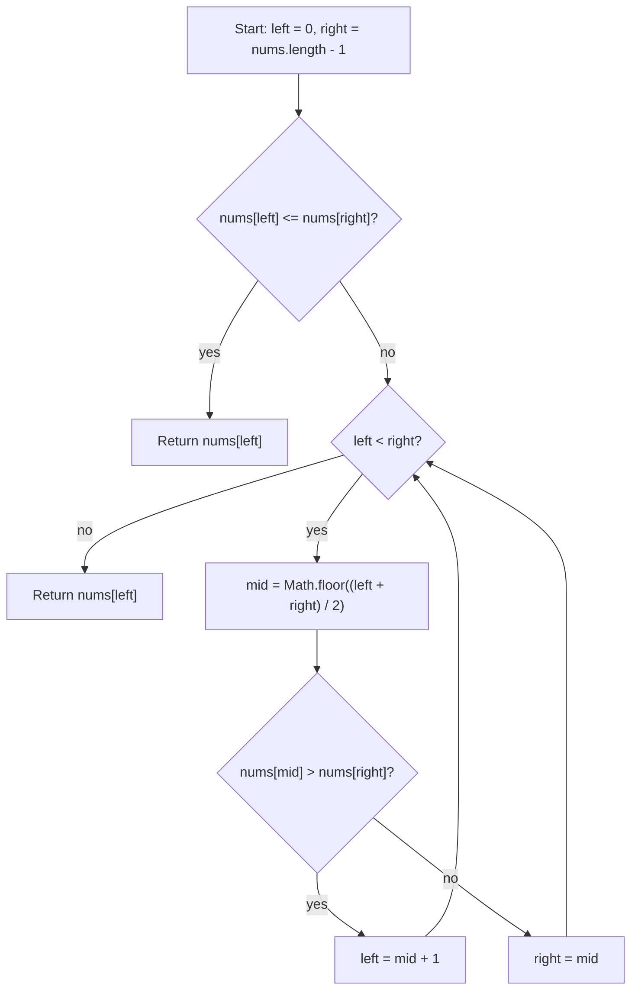

# Find Minimum in Rotated Sorted Array - Mental Model

## The Problem

You are given an ascending array of unique numbers that has been rotated some number of times.

Return the smallest value in the array.

Your solution must run in `O(log n)` time.

**Example 1:**
```
Input: nums = [3,4,5,1,2]
Output: 1
Explanation: The original sorted array was [1,2,3,4,5].
```

**Example 2:**
```
Input: nums = [4,5,6,7,0,1,2]
Output: 0
Explanation: The original sorted array was [0,1,2,4,5,6,7].
```

**Example 3:**
```
Input: nums = [11,13,15,17]
Output: 11
Explanation: The array was not broken by rotation in a way that changed the order.
```

## The Analogy: The Broken Bookshelf

### What are we actually searching for?

This is not really a "find the smallest number by scanning everything" problem. It is a "find where the sorted bookshelf breaks" problem.

If the shelf were still perfectly ordered from left to right, the first book would obviously be the smallest. Rotation changes only one thing: it cuts the shelf at some point and moves the back chunk to the front. That creates one break where a bigger book is immediately followed by a smaller one.

The smallest book is the first book after that break.

### The Broken Shelf

Imagine a long shelf of numbered books that used to be in perfect order. Then someone lifted one back section and moved it to the front without changing the order inside either section.

So now the shelf still has order locally, but not globally. The left chunk is sorted. The right chunk is sorted. The only disorder is the seam where the shelf was broken and reattached.

That is why the minimum is special. It sits exactly at the start of the lower chunk.

### How we define the live shelf

I keep `left` and `right` around the part of the shelf where that seam could still be hiding.

There is one fast check before any shrinking starts. If the leftmost book is already smaller than the rightmost book, then the whole live shelf is still in sorted order. That means no seam lives inside it, so the smallest book must simply be the leftmost one.

If the live shelf is not fully ordered, then the seam is somewhere inside it, and I need a probe to decide which half still contains it.

### The one break that makes Binary Search valid

The midpoint does not tell me whether it is the minimum directly. It tells me which side is still contaminated by the break.

Compare the midpoint book to the rightmost book in the live shelf.

If the midpoint book is larger than the rightmost book, then the midpoint is still sitting in the higher chunk. The break must be to its right, because the lower chunk has not started yet.

If the midpoint book is smaller than the rightmost book, then the midpoint is already in the lower chunk, which means the minimum cannot be to its right. The break, and therefore the minimum, must be at `mid` or to its left.

That is the monotone structure that makes Binary Search work here. One side is definitely clean. The other side still contains the seam.

### Testing one divider

So each probe asks one question: is this divider still standing in the higher chunk, or have I already crossed into the lower chunk?

`nums[mid] > nums[right]` means I am still on the higher side of the break, so the minimum must be farther right.

`nums[mid] <= nums[right]` means the suffix from `mid` through `right` is ordered and already belongs to the lower side, so `mid` is still a valid candidate minimum and I should squeeze left.

### How I Think Through This

I picture a shelf with one bad seam in it. I do not care about every book. I care about which side of the seam my midpoint probe landed on. The rightmost book acts like an anchor because it definitely belongs to the lower side of the live shelf.

If the midpoint is bigger than that anchor, I know I am still standing in the higher chunk, so I move `left` past `mid`. If the midpoint is smaller, I know I have reached the lower chunk already, so I pull `right` back to `mid` and keep the candidate minimum alive.

Take `nums = [4, 5, 6, 7, 0, 1, 2]`.

:::trace-bs
[
  {"values":[4,5,6,7,0,1,2],"left":0,"mid":3,"right":6,"action":"check","label":"Probe index 3, value 7, against the right anchor 2. Since 7 is larger, the midpoint is still in the higher chunk, so the seam must be to the right."},
  {"values":[4,5,6,7,0,1,2],"left":4,"mid":null,"right":6,"action":"candidate","label":"Move the left boundary to index 4. The live shelf now starts at the lower chunk, where the minimum still survives."}
]
:::

---

## Building the Algorithm

### Step 1: Detect When the Live Shelf Is Already Sorted

Start with the search window itself. Put `left` at the first book and `right` at the last book.

Before doing any midpoint work, ask whether the live shelf is already fully ordered. If `nums[left] <= nums[right]`, then there is no break inside this window, so the smallest value is simply `nums[left]`. This gives you the base case that handles a single book and an unrotated shelf with one rule.

Take `nums = [11, 13, 15, 17]`.

:::trace-bs
[
  {"values":[11,13,15,17],"left":0,"mid":null,"right":3,"action":"check","label":"The live shelf starts at index 0 and ends at index 3. The leftmost book is already smaller than the rightmost one, so this window is fully sorted."},
  {"values":[11,13,15,17],"left":0,"mid":0,"right":3,"action":"found","label":"Because the window is already ordered, the smallest book is the leftmost one: 11."}
]
:::

:::stackblitz{file="step1-problem.ts" step=1 total=2 solution="step1-solution.ts"}

<details>
  <summary>Hints & gotchas</summary>

- **Use the current window, not the original story**: `left` and `right` define the live shelf you are reasoning about.
- **Already sorted means answer found**: if the live window is in order, the first value in that window is the minimum.
- **This step is about the base case only**: do not start shrinking with midpoint logic yet.
</details>

### Step 2: Squeeze Toward the Seam

Now finish the Binary Search. As long as `left < right`, there is more than one book left in the live shelf, so probe the midpoint.

If `nums[mid] > nums[right]`, the midpoint is still inside the higher chunk, so the minimum must be strictly to the right and you move `left = mid + 1`.

Otherwise, the midpoint is already in the lower chunk. That means `mid` could still be the minimum, so keep it by setting `right = mid`.

When `left === right`, the live shelf has collapsed to one index. That index is exactly where the minimum lives.

Take `nums = [3, 4, 5, 1, 2]`.

:::trace-bs
[
  {"values":[3,4,5,1,2],"left":0,"mid":2,"right":4,"action":"check","label":"Probe index 2, value 5, against the right anchor 2. Since 5 is larger, the seam must be to the right."},
  {"values":[3,4,5,1,2],"left":3,"mid":3,"right":4,"action":"discard-left","label":"Move the left boundary to index 3. Probe again at index 3, value 1. This time the midpoint is already in the lower chunk."},
  {"values":[3,4,5,1,2],"left":3,"mid":3,"right":3,"action":"discard-right","label":"Keep index 3 alive by moving the right boundary back to it. Now both boundaries meet at the minimum."},
  {"values":[3,4,5,1,2],"left":3,"mid":null,"right":3,"action":"done","label":"The live shelf has collapsed to one index. Return value 1."}
]
:::

:::stackblitz{file="step2-problem.ts" step=2 total=2 solution="step2-solution.ts"}

<details>
  <summary>Hints & gotchas</summary>

- **Compare to the right anchor**: the key question is whether `nums[mid]` is bigger than `nums[right]`.
- **Keep `mid` when it might still be the answer**: use `right = mid`, not `mid - 1`, because `mid` could already be the minimum.
- **Stop when one index survives**: `left === right` means the seam has been pinned down completely.
</details>

## Tracing through an Example

Take `nums = [30, 40, 50, 5, 10, 20]`.

:::trace-bs
[
  {"values":[30,40,50,5,10,20],"left":0,"mid":2,"right":5,"action":"check","label":"Start with the whole shelf. Probe index 2, value 50, against the right anchor 20. Since 50 is larger, the seam is still to the right."},
  {"values":[30,40,50,5,10,20],"left":3,"mid":4,"right":5,"action":"discard-left","label":"Move left to index 3. Probe index 4, value 10. That value is already in the lower chunk because it is not larger than 20."},
  {"values":[30,40,50,5,10,20],"left":3,"mid":3,"right":4,"action":"discard-right","label":"Keep the lower chunk and pull right back to index 4. Probe index 3, value 5. It is still in the lower chunk, so keep squeezing left."},
  {"values":[30,40,50,5,10,20],"left":3,"mid":null,"right":3,"action":"done","label":"Now only index 3 survives. The minimum value is 5."}
]
:::

## Broken Shelf at a Glance



## Recognizing This Pattern

Reach for this pattern when an array is mostly sorted but has one rotation seam, pivot, or break in order. The signal is that one comparison can tell you which half still contains that break. Because the structure flips only once from the higher chunk to the lower chunk, Binary Search can keep discarding half the shelf instead of scanning every book. That cuts the work from `O(n)` to `O(log n)`.

## Complete Solution

:::stackblitz{file="solution.ts" step=2 total=2 solution="solution.ts"}
